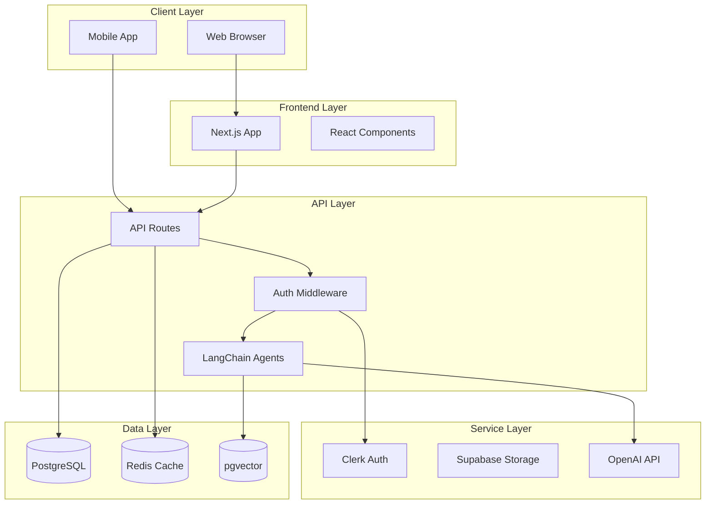

# Plan 10-04: System Architecture Diagram Generator

## Objective

Add a system architecture diagram generator to the existing diagram generators. This creates a visual representation of the full system: frontend, API layer, services, databases, and external integrations.

## Context

- Existing generators: `lib/diagrams/generators.ts`
- Diagram types: context, use case, class diagrams
- Uses Mermaid.js for rendering
- Depends on: tech stack + API spec (generated in Wave 1)

## Tasks

### Task 1: Add System Architecture Generator

**File:** `lib/diagrams/generators.ts` (modify)

**Function:** `generateSystemArchitectureDiagram(techStack, apiSpec, infrastructureSpec)`

**Output:** Mermaid flowchart with subgraphs



**Implementation:**
1. Parse tech stack to identify components
2. Parse API spec to understand endpoints
3. Parse infrastructure spec for services
4. Generate Mermaid subgraphs for each layer
5. Add connections based on dependencies
6. Apply consistent styling

### Task 2: Add Helper Functions

**Functions to add:**
- `sanitizeNodeId(name)` - Make Mermaid-safe IDs
- `inferConnections(techStack, apiSpec)` - Determine data flow
- `selectSubgraphStyle(layer)` - Consistent styling per layer

### Task 3: Update Diagram Generator Router

**File:** `lib/diagrams/generators.ts`

Update `generateDiagram()` to handle `type: 'system_architecture'`:

```typescript
case 'system_architecture':
  return generateSystemArchitectureDiagram(
    projectData.techStack,
    projectData.apiSpecification,
    projectData.infrastructureSpec
  );
```

### Task 4: Add Tests

**File:** `lib/diagrams/__tests__/generators.test.ts` (append)

Test cases:
- Generates valid Mermaid syntax
- Includes all tech stack components
- Creates correct subgraphs
- Handles missing optional data gracefully

## Dependencies

- Wave 1 plans (10-01, 10-02, 10-03) should complete first
- Needs tech stack and API spec data to generate meaningful diagram

## Deliverables

- [ ] `generateSystemArchitectureDiagram()` function added
- [ ] Helper functions for node IDs and connections
- [ ] Router updated for 'system_architecture' type
- [ ] Tests pass
- [ ] Generated diagrams render correctly in Mermaid
