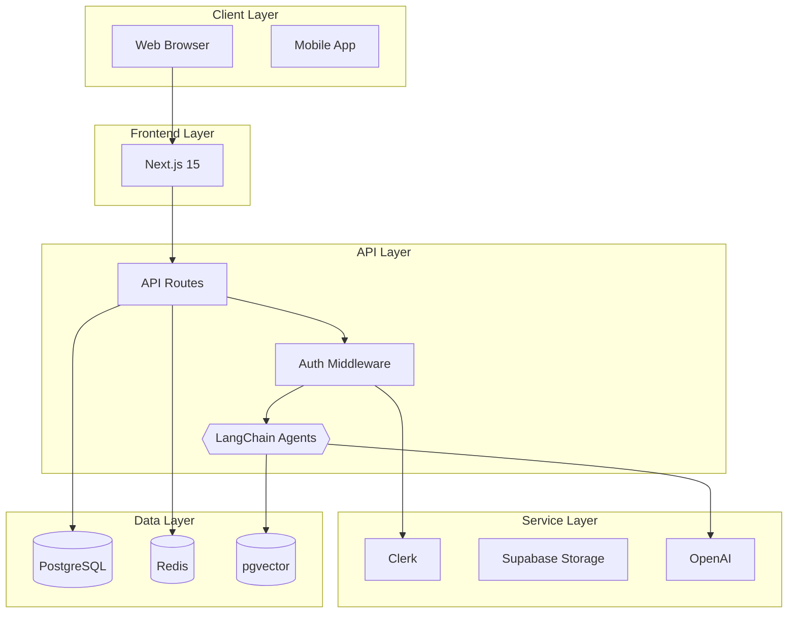

# Plan 10-04 Summary: System Architecture Diagram Generator

## Status: COMPLETE

## Implementation Summary

Added a system architecture diagram generator to create visual representations of the full system architecture, including client layer, frontend, API, services, and data layers.

## Commits

1. `cf5407d` - feat(10-04): Add system architecture diagram generator and helpers
2. `79fdc94` - feat(10-04): Add tests for system architecture diagram generator

## Files Modified

### Modified
- `lib/diagrams/generators.ts` (+562 lines)
  - Added types: `ArchitectureLayer`, `ArchitectureComponent`, `ArchitectureConnection`, etc.
  - Added helper functions: `sanitizeNodeId()`, `selectSubgraphStyle()`, `inferConnections()`
  - Added main generator: `generateSystemArchitectureDiagram()`
  - Updated `generateDiagram()` router to handle `'system_architecture'` type
  - Added imports from `@/lib/db/schema/v2-types`

- `lib/diagrams/__tests__/generators.test.ts` (+241 lines)
  - Added tests for `sanitizeNodeId()` helper
  - Added tests for `selectSubgraphStyle()` helper
  - Added tests for `inferConnections()` helper
  - Added tests for `generateSystemArchitectureDiagram()` main function
  - Added tests for `generateDiagram()` router with 'system_architecture' type

## Deliverables

- [x] `generateSystemArchitectureDiagram()` function added
- [x] Helper functions for node IDs and connections
- [x] Router updated for 'system_architecture' type
- [x] Tests pass (70 diagram tests, 358 total)
- [x] Generated diagrams render correctly in Mermaid

## Generated Diagram Features

### Layers
- **Client Layer**: Web Browser, Mobile App
- **Frontend Layer**: Auto-detects from tech stack (e.g., Next.js)
- **API Layer**: API Routes, Auth Middleware, LangChain Agents (if AI enabled)
- **Service Layer**: Auth provider, Storage, AI services
- **Data Layer**: Database, Cache, Vector Store (if AI enabled)

### Connection Inference
- Default architectural connections (Browser -> Frontend -> API)
- Database connections when database in tech stack
- Cache connections when cache in tech stack
- AI connections (Middleware -> Agents -> AI -> VectorStore) when ai-ml in tech stack
- Storage connections when storage in tech stack

### Styling
- Color-coded layers with distinct styling
- Database components use cylinder shape `[("...")]`
- Agents use hexagon shape `{{...}}`
- Solid and dashed connection lines

### Validation
- Component count tracking
- Connection count tracking
- Warnings for minimal diagrams
- Warnings when no tech stack provided

## Example Output

## Test Coverage

- 24 new tests added for system architecture diagram
- All 70 diagram generator tests passing
- All 358 project tests passing
- Type check passing
