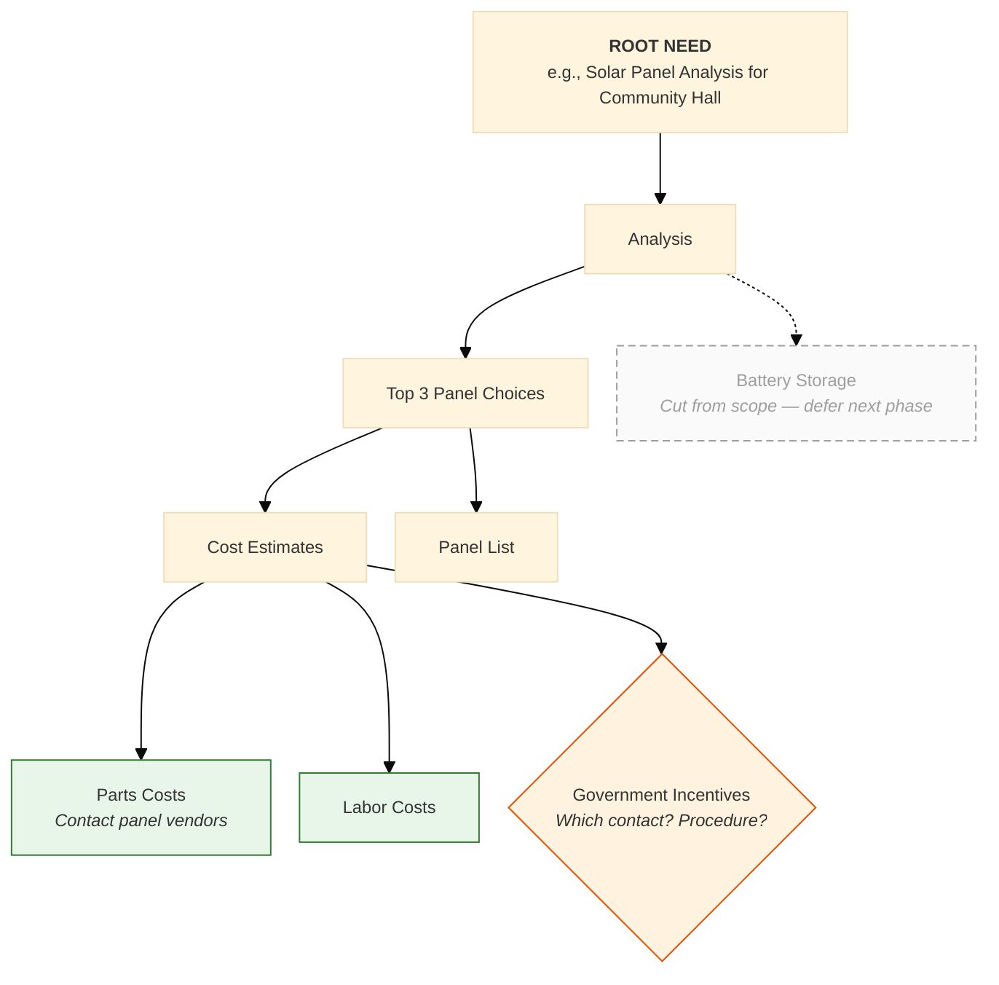

# Phase 3: Scope Tree (Deliverable Tree)

## §1 Decision context

This phase contributes to **m1-defining-scope** decisions. Runtime resolution flows through:

1. ContextResolver loads upstream artifacts + intake state.
2. NFREngineInterpreter evaluates predicates from `apps/product-helper/.planning/engines/m1-defining-scope.json` against EvalContext.
3. On match → auto-fill (clamped to `auto_fill_threshold`); on no match → fallback (§3); on still-no-match → STOP-GAP gate (§4) blocks proceed.

The legacy educational body (preserved in this file under the "Educational content" footer) explains *why* this phase exists. The runtime *what* lives in the engine.json + fail-closed registry referenced below.

## §2 Predicates (engine.json reference)

- **Engine story:** `m1-defining-scope` (`apps/product-helper/.planning/engines/m1-defining-scope.json`)
- **Predicate DSL evaluator:** `apps/product-helper/lib/langchain/engines/predicate-dsl.ts`
- **Story-tree schema:** `apps/product-helper/lib/langchain/schemas/engines/story-tree.ts`
- **Decisions consumed by this phase:** see `decisions[]` in the engine.json keyed on `target_field` containing `phase-3-scope-tree` or by manual mapping in the story tree.

> Predicates are NOT inlined here. The engine.json is the source of truth; this markdown points at it.

## §3 Fallback rules

When no predicate in §2 matches:

1. `searchKB` retrieves top-3 chunks scoped to `{module: 1, phase: phase-3-scope-tree}` (post-G8/G9 ingest).
2. If `searchKB` confidence < 0.90 OR returns zero chunks → `surfaceGap` emits `needs_user_input` to `system-question-bridge.ts` with computed_options + math_trace.
3. User answer re-enters the loop at ContextResolver.

> Fallback contract is shared across all phase files. Per-phase override (if any) is documented in the educational body below.

## §4 STOP-GAP rules (machine-readable)

- **artifact_key:** `module_1/phase-3-scope-tree`
- **registry:** `apps/product-helper/lib/langchain/engines/fail-closed-runner.ts` (`buildFailClosedRegistry`)
- **schema:** `apps/product-helper/lib/langchain/schemas/engines/fail-closed.ts` (`failClosedRuleSetSchema`)
- **audit doc (rule sources + severity):** [plans/v22-outputs/te1/fail-closed-audit.md](../../../../../../plans/v22-outputs/te1/fail-closed-audit.md#module-1-defining-scope)

The STOP-GAP / Validation-Checklist text in the legacy educational body below has been audited by `engine-fail-closed` and converted into machine-readable rules registered under the `artifact_key` above. The runner default-FAILs if the artifact_key is queried with no rule set registered (conservative).

> Default severity is `error` (proceed-blocking). Only items phrased "advisory" / "soft check" / "warning" / "will NOT fail" are downgraded to `warn`.

## §5 Math derivation

This phase's quantitative outputs (if any) carry `mathDerivationSchema` (or `mathDerivationMatrixSchema` for M5 sites per TC1 `tc1-wave-c-complete`). Each derivation:

- references inputs by `source` (upstream artifact + field path);
- carries `formula` (LaTeX-safe ASCII) + `units` + `computed_value`;
- attaches `base_confidence` + `confidence_modifiers` consumed by NFREngineInterpreter step 6.

> Per-decision math traces are emitted into `decision_audit` (`0011b_decision_audit.sql`) on every Scoring pass per EC-V21-E.3 (audit-writer agent).

## §6 References (KB chunk IDs)

- **Frontmatter `kb_chunk_refs`:** populated by the embedding pipeline (`engine-pgvector` agent, G8/G9 — `apps/product-helper/lib/langchain/engines/kb-embedder.ts`).
- **Runtime retrieval:** `searchKB(query, top_k, { module: 1, phase: 'phase-3-scope-tree' })` over the `kb_chunks` table (`0011a_kb_chunks.sql`, ivfflat lists=100; HNSW upgrade gated on `>10k` rows).
- **Provenance:** every retrieved chunk carries `{kb_source, chunk_hash, content, embedding_distance}`; rendered by `why-this-value-panel.tsx` (`provenance-ui` agent).

> The `kb_chunk_refs` array in frontmatter is left empty until the embedder backfills it. The runtime path does not depend on the static array — it queries the live table.

---

## Educational content (legacy, preserved)

> The body below is the pre-Wave-E text verbatim. It documents *why* this phase exists, the systems-engineering theory behind the prescribed steps, and the example-driven walkthroughs the LLM (and human readers) consume. The 6 sections above are the schema-first overlay locked by Wave-E γ-shape.

> Source: `scope-tree-visual-guide.md` and `ScopeTree_Defining_Deliverables.md`. Not numbered in the 11-step checklist (which focuses on context + use cases) — but eCornell treats the scope tree as the third Module-1 artifact.

## Knowledge

A scope tree (also called a deliverable tree) decomposes the top-level need into:

- **Branch nodes** — sub-deliverables that need further breakdown
- **Leaf nodes** of three types:
  1. **Atomic tasks** the team knows how to complete
  2. **Sets of data** that are already known or that need to be gathered
  3. **Open questions** or requests for additional resources

> *"Branches commonly end with… atomic tasks that we know how to complete… sets of data that are already known or need [to be gathered]… questions or requests for additional resources to allow you to proceed."*
> — eCornell, *scope-tree-visual-guide* (lines 510-540)

### Scope tree discipline

- Use **dotted-path notation** for branch IDs (e.g., `Analysis.3Panels.CostEst.GovtIncent`) so any node can be referenced unambiguously.
- It is OK to **repeat a node** under multiple parents when the same work serves both — but consider connecting it to multiple parents if the work can satisfy both at once.
- **Cut-from-scope branches** are drawn with **dashed lines** — don't delete them; they're the seed for the next phase of work.
- **Performance criteria** are added LATE as a check: do the deliverables actually meet the criteria?

> *"As a good check for completeness, make sure to add in performance criteria and see if the deliverables meet all of these needs."* — eCornell (line 1031)

> *"Notice the dashed line to show these were cut from the scope. Don't throw this away as it may be a good place to start for your next phase."* — eCornell (line 1631)

### Iteration is expected

> *"Notice that boxes aren't placed precisely. They're most likely going to be added to / moved around later anyways."*
> — eCornell, *scope-tree-visual-guide* (line 7)

## Input Required

- `intake_summary.json` (P0) — `body.need_statement` becomes the root of the tree
- `intake_summary.body.deferred_to_p3_scope_tree` — features the PM mentioned in P0 are candidate branches
- `use_case_inventory.json` (P2) — high-priority use cases typically map to top-level branches
- `context_diagram.body.external_actors` — referenced when sourcing data from / gathering data about external entities

## Instructions for the LLM

1. **Root the tree** at the need statement from P0 (e.g., "Solar Panel Analysis for Community Hall"). Use the same unnamed framing — root is need, not solution.
2. **Top-level branches** typically come from:
   - High-priority use cases (one branch per major use case)
   - PM-deferred features from P0 intake
   - Cross-cutting deliverables (e.g., "Risk Analysis", "Compliance Documentation")
3. **Grow each branch** by repeatedly asking: "What deliverables does this depend on?" Stop when leaf is atomic-task, known-data-set, or open-question.
4. **Mark cut-from-scope nodes** with dashed lines — but keep them. Add a note explaining the agreement with the stakeholder.
5. **Repeat shared deliverables** under each parent that needs them, OR connect one node to multiple parents when the work satisfies all parents simultaneously and one person/team can deliver against all parent needs at once.
6. **Performance-criteria completeness check.** When the tree feels complete, list the performance criteria the PM mentioned (deferred from P0 to Module 4) and walk the tree: "Does any deliverable address each criterion?" Add deliverables for gaps.

## Output Format — `scope_tree.json`

```json
{
  "_schema": "phase_artifact.v1",
  "phase_id": "P3",
  "artifact_type": "scope_tree",
  "status": "approved",
  "stop_gap_cleared": true,
  "body": {
    "root_need": "<P0 need_statement>",
    "nodes": [
      {
        "id": "Analysis",
        "label": "Analysis",
        "parent_ids": [],
        "kind": "branch",
        "in_scope": true
      },
      {
        "id": "Analysis.3Panels",
        "label": "Top 3 Panel Choices",
        "parent_ids": ["Analysis"],
        "kind": "branch",
        "in_scope": true
      },
      {
        "id": "Analysis.3Panels.CostEst",
        "label": "Cost Estimates",
        "parent_ids": ["Analysis.3Panels"],
        "kind": "branch",
        "in_scope": true
      },
      {
        "id": "Analysis.3Panels.CostEst.PartsCosts",
        "label": "Parts Costs",
        "parent_ids": ["Analysis.3Panels.CostEst"],
        "kind": "leaf_atomic_task",
        "in_scope": true,
        "notes": "Contact panel vendors for pricing."
      },
      {
        "id": "Analysis.3Panels.CostEst.GovtIncent",
        "label": "Government Incentives",
        "parent_ids": ["Analysis.3Panels.CostEst"],
        "kind": "leaf_open_question",
        "in_scope": true,
        "notes": "Which stakeholder contact would help? Application procedure?"
      },
      {
        "id": "Analysis.BattStorage",
        "label": "Battery Storage Options",
        "parent_ids": ["Analysis"],
        "kind": "branch",
        "in_scope": false,
        "notes": "Cut from scope — agreed with stakeholder to defer to next phase."
      }
    ],
    "performance_criteria_check": [
      { "criterion": "Payback Period", "covered_by_node_ids": ["Analysis.3Panels.CostEst", "Analysis.3Panels.PanelList.PowerGen"] },
      { "criterion": "Building Code Compliance", "covered_by_node_ids": ["Analysis.3Panels.PanelList.CodeAdjust"] },
      { "criterion": "Ability to Monitor", "covered_by_node_ids": [], "gap_note": "No deliverable yet — needs PM clarification on what 'ability to monitor' means" }
    ],
    "mermaid_path": "scope_tree.mmd"
  },
  "fail_closed_check": {
    "unnamed_system_ok": true,
    "no_subsystems_ok": null,
    "interactions_only_ok": null,
    "iteration_break_done": null,
    "no_externals_inside_system_box": null
  }
}
```

## Output Format — `scope_tree.mmd`

No template ships in the source material. Use this contract:



**Conventions:**
- Atomic-task leaves: green rectangle
- Open-question leaves: orange diamond
- Cut-from-scope: dashed grey
- Repeated nodes: just declare the node twice with the same label (Mermaid will render two boxes — that's fine for readability)
- Multi-parent nodes: declare once, draw multiple incoming arrows

## STOP GAP

**No exit STOP GAP for P3** — the final review-and-handoff gate happens at P4 exit. P3 hands `scope_tree.json` straight to P4 for consolidation. Internal sanity checks (PM iteration on tree) happen interactively without a formal gate.

## Output Artifacts

- `scope_tree.json`
- `scope_tree.mmd`

## Handoff to Next Phase

P4 reads `scope_tree.body.nodes` and walks the tree to extract `scope_tree_functions[]` — the top-level branch labels become candidate `abstract_function_name` values for Module 2's requirements table.

---

**Next →** [Phase 4: Review and Module 2 Handoff](07-Phase-4-Review-and-Module-2-Handoff.md) | **Back:** [Phase 2](05-Phase-2-Use-Case-Diagram.md) · [Master Prompt](00-Defining-Scope-Master-Prompt.md)

