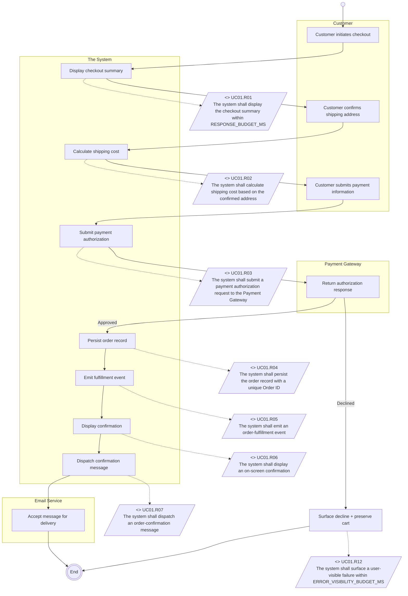
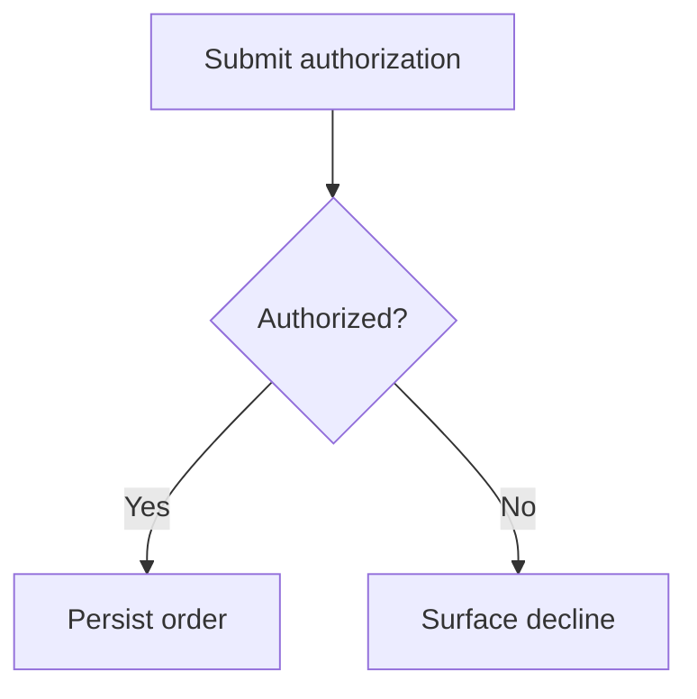
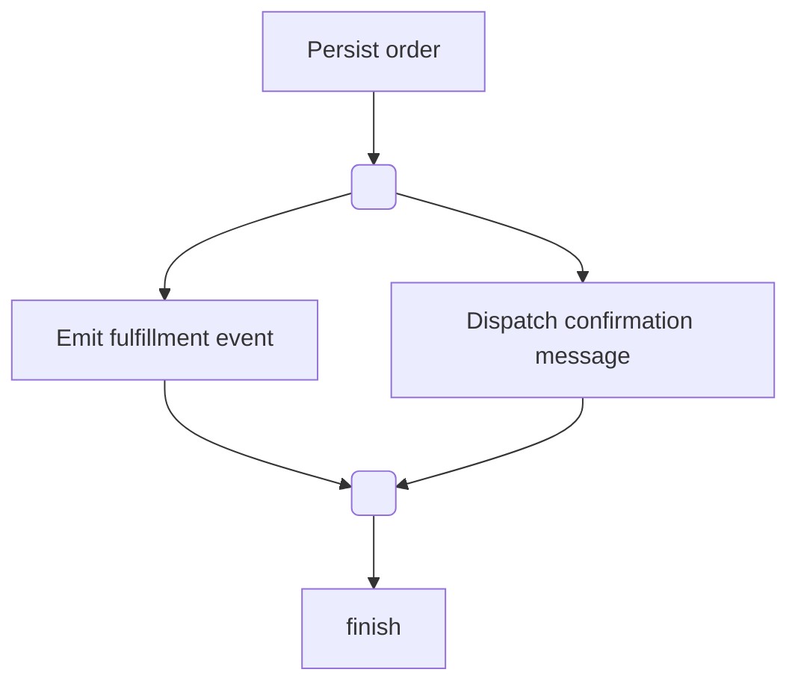

# Phase 10: SysML Activity Diagram

## §1 Decision context

This phase contributes to **m2-requirements** decisions. Runtime resolution flows through:

1. ContextResolver loads upstream artifacts + intake state.
2. NFREngineInterpreter evaluates predicates from `apps/product-helper/.planning/engines/m2-requirements.json` against EvalContext.
3. On match → auto-fill (clamped to `auto_fill_threshold`); on no match → fallback (§3); on still-no-match → STOP-GAP gate (§4) blocks proceed.

The legacy educational body (preserved in this file under the "Educational content" footer) explains *why* this phase exists. The runtime *what* lives in the engine.json + fail-closed registry referenced below.

## §2 Predicates (engine.json reference)

- **Engine story:** `m2-requirements` (`apps/product-helper/.planning/engines/m2-requirements.json`)
- **Predicate DSL evaluator:** `apps/product-helper/lib/langchain/engines/predicate-dsl.ts`
- **Story-tree schema:** `apps/product-helper/lib/langchain/schemas/engines/story-tree.ts`
- **Decisions consumed by this phase:** see `decisions[]` in the engine.json keyed on `target_field` containing `phase-10-sysml-activity-diagram` or by manual mapping in the story tree.

> Predicates are NOT inlined here. The engine.json is the source of truth; this markdown points at it.

## §3 Fallback rules

When no predicate in §2 matches:

1. `searchKB` retrieves top-3 chunks scoped to `{module: 2, phase: phase-10-sysml-activity-diagram}` (post-G8/G9 ingest).
2. If `searchKB` confidence < 0.90 OR returns zero chunks → `surfaceGap` emits `needs_user_input` to `system-question-bridge.ts` with computed_options + math_trace.
3. User answer re-enters the loop at ContextResolver.

> Fallback contract is shared across all phase files. Per-phase override (if any) is documented in the educational body below.

## §4 STOP-GAP rules (machine-readable)

- **artifact_key:** `module_2/phase-10-sysml-activity-diagram`
- **registry:** `apps/product-helper/lib/langchain/engines/fail-closed-runner.ts` (`buildFailClosedRegistry`)
- **schema:** `apps/product-helper/lib/langchain/schemas/engines/fail-closed.ts` (`failClosedRuleSetSchema`)
- **audit doc (rule sources + severity):** [plans/v22-outputs/te1/fail-closed-audit.md](../../../../../../plans/v22-outputs/te1/fail-closed-audit.md#module-2-requirements)

The STOP-GAP / Validation-Checklist text in the legacy educational body below has been audited by `engine-fail-closed` and converted into machine-readable rules registered under the `artifact_key` above. The runner default-FAILs if the artifact_key is queried with no rule set registered (conservative).

> Default severity is `error` (proceed-blocking). Only items phrased "advisory" / "soft check" / "warning" / "will NOT fail" are downgraded to `warn`.

## §5 Math derivation

This phase's quantitative outputs (if any) carry `mathDerivationSchema` (or `mathDerivationMatrixSchema` for M5 sites per TC1 `tc1-wave-c-complete`). Each derivation:

- references inputs by `source` (upstream artifact + field path);
- carries `formula` (LaTeX-safe ASCII) + `units` + `computed_value`;
- attaches `base_confidence` + `confidence_modifiers` consumed by NFREngineInterpreter step 6.

> Per-decision math traces are emitted into `decision_audit` (`0011b_decision_audit.sql`) on every Scoring pass per EC-V21-E.3 (audit-writer agent).

## §6 References (KB chunk IDs)

- **Frontmatter `kb_chunk_refs`:** populated by the embedding pipeline (`engine-pgvector` agent, G8/G9 — `apps/product-helper/lib/langchain/engines/kb-embedder.ts`).
- **Runtime retrieval:** `searchKB(query, top_k, { module: 2, phase: 'phase-10-sysml-activity-diagram' })` over the `kb_chunks` table (`0011a_kb_chunks.sql`, ivfflat lists=100; HNSW upgrade gated on `>10k` rows).
- **Provenance:** every retrieved chunk carries `{kb_source, chunk_hash, content, embedding_distance}`; rendered by `why-this-value-panel.tsx` (`provenance-ui` agent).

> The `kb_chunk_refs` array in frontmatter is left empty until the embedder backfills it. The runtime path does not depend on the static array — it queries the live table.

---

## Educational content (legacy, preserved)

> The body below is the pre-Wave-E text verbatim. It documents *why* this phase exists, the systems-engineering theory behind the prescribed steps, and the example-driven walkthroughs the LLM (and human readers) consume. The 6 sections above are the schema-first overlay locked by Wave-E γ-shape.

> Corresponds to the "Populating Activity Diagrams" lesson and the Course Project Part Two deliverable (SysML variation of the UCBD).

## Knowledge

A SysML Activity Diagram is the **formal, industry-standard** version of a UCBD. Same information, different notation. The course describes it as the alternative format your team may need for regulated or government-contracted work.

### Why we use Mermaid

Raw SysML is drawn in tools like Enterprise Architect, MagicDraw, or PowerPoint with the course's pptx template. For LLM-authored artifacts, we use **Mermaid** because:

1. Mermaid is **text**, which the LLM can write directly.
2. Mermaid renders in **GitHub, VSCode, Obsidian, Notion** — everywhere the rest of this KB lives.
3. Mermaid's flowchart syntax maps cleanly to SysML activity-diagram semantics.
4. A Mermaid diagram can be regenerated from JSON; a pptx cannot.

We render `<<requirement>>` stereotypes as labeled notes attached to action nodes. The notes carry the Requirements Table index.

### SysML Activity Diagram elements and Mermaid mappings

| SysML Element | Purpose | Mermaid Syntax |
|---------------|---------|----------------|
| Initial node (start) | Where the flow begins | `start([Start])` or `start(( ))` |
| Final node (end) | Terminal state | `finish([End])` or `finish(((End)))` |
| Action node | One functional step | `A[The system authorizes payment]` |
| Decision node | Branching guard | `D{Payment authorized?}` |
| Merge node | Re-converge branches | implicit at a node with multiple incoming arrows |
| Fork bar | Split into parallel flows | implicit via multiple outgoing arrows from a node |
| Join bar | Synchronize parallel flows | implicit at a node with multiple incoming parallel arrows |
| Object flow (data) | A value passes between actions | `A -->|Order ID| B` |
| Control flow | Sequence from one action to next | `A --> B` |
| Swimlane partition | Which actor owns the action | Mermaid `subgraph <ActorName>` |
| `<<requirement>>` note | Ties action to Requirements Table row | comment node `R1[<<requirement>><br/>Id: UC01.R03<br/>Text: The system shall...]` with dashed link |

### Structural conventions

1. **One activity diagram per UCBD.** Name the file after the UCBD: `ucbd/UC01-customer-checkout.ucbd.json` → `sysml/UC01-customer-checkout.activity.mmd`.
2. **Swimlanes = UCBD columns.** Each column from the UCBD becomes a Mermaid `subgraph` (partition).
3. **Action nodes = UCBD step rows.** The action label is the cell content (abbreviated if long — keep the full text in the `<<requirement>>` note).
4. **System actions get a `<<requirement>>` note** pointing to the Requirements Table row. Actor actions don't (they're not requirements).
5. **Initial conditions → notes** attached to the Start node.
6. **Ending conditions → notes** attached to the End node.

### Worked example (credit-card checkout)



Observations:
- Each `subgraph` is a swimlane.
- `<<requirement>>` boxes are separate nodes (drawn as parallelograms `/.../` to distinguish them from action boxes).
- Requirement boxes are attached to actions with **dashed arrows** (`-.->`), indicating a traceability link, not a control flow.
- The decision diamond was omitted in this simple flow; for the decline path we added a second terminal flow. In more complex UCBDs, use explicit `D{guard?}` nodes.

### When the UCBD has real branching (decision node needed)



Use decisions when the UCBD notes or delving gaps revealed a branch that materially changes requirements.

### When the UCBD has parallelism (fork/join needed)



Use fork nodes (a point where one flow becomes many parallel flows) and join nodes (where they sync back) only if the parallelism is semantically required by the requirements. If two actions *could* run in parallel but don't have to, use sequential flow instead — simpler and doesn't over-specify.

## Input Required

- All UCBD JSONs (final versions, post-Phase 9)
- `requirements_table.json` (to look up requirement text by index)
- `constants_table.json` (referenced in requirement text)

## Instructions for the LLM

For each UCBD:

1. **Initialize the Mermaid block.** `flowchart TB` (top-bottom) or `flowchart LR` (left-right — sometimes clearer for long flows).
2. **Add Start and End nodes.**
3. **Create a `subgraph` for each UCBD column** in left-to-right order. Name them using the column header (`Customer`, `The System`, `Payment Gateway`, etc.).
4. **Place action nodes inside the appropriate subgraph.** Use short, readable labels (≤40 chars). Full text goes in the `<<requirement>>` note.
5. **Connect actions with arrows (`-->`)** in the order given by the UCBD's `actor_steps_table`. Insert `D{...}` decision diamonds only for branches explicit in the UCBD or notes.
6. **Emit `<<requirement>>` nodes** for every system action row. Use parallelograms (`/.../` in Mermaid) to distinguish from actions.
7. **Attach requirement nodes to actions with dashed arrows** (`-.->`).
8. **Add initial-condition notes near Start** and **ending-condition notes near End** (optional but recommended — use `class` styling or a `note` pattern).
9. **Write the file** as `sysml/UC<xx>-<slug>.activity.mmd`.
10. Also emit an `activity_diagram_manifest.json` listing every `.mmd` file and its source UCBD.

## Output Format

**File 1:** `sysml/UC01-customer-checkout.activity.mmd` — the Mermaid text.

**File 2:** `activity_diagram_manifest.json`

```json
{
  "_schema": "activity_diagram_manifest.v1",
  "_output_path": "<project>/module-2-requirements/sysml/activity_diagram_manifest.json",
  "_phase_status": "phase-10-complete",

  "diagrams": [
    {
      "use_case_id": "UC01",
      "ucbd_source": "<project>/module-2-requirements/ucbd/UC01-customer-checkout.ucbd.json",
      "mermaid_file": "<project>/module-2-requirements/sysml/UC01-customer-checkout.activity.mmd",
      "requirements_linked": ["UC01.R01", "UC01.R02", "UC01.R03", "UC01.R04", "UC01.R05", "UC01.R06", "UC01.R07", "UC01.R12"],
      "decisions_modeled": ["Payment authorized?"],
      "forks_modeled": [],
      "swimlanes": ["Customer", "The System", "Payment Gateway", "Email Service"]
    }
  ],

  "summary": {
    "total_diagrams": 5,
    "total_requirements_traced": 41,
    "requirements_without_activity_link": []
  }
}
```

> `requirements_without_activity_link` should be empty. If non-empty, those requirements have no corresponding activity step — investigate (often means a requirement that isn't a UCBD step, like a cross-cutting concern — flag for user).

## Software-system translation notes

Software flows have some recurring SysML patterns:

| Pattern | Mermaid representation |
|---------|-------------------------|
| Request / response to external service | `System --> External` then `External --> System` in separate swimlanes |
| Async event emission | Action node → object flow with event name → receiver in a separate (often offstage) swimlane |
| Retry loop | Decision node after the action with "retry?" guard loopback to the action |
| Circuit breaker | Decision node with "circuit open?" guard before the action, bypassing to a fallback |
| Graceful degradation | `D{Dependency healthy?}` → healthy path vs reduced-capability path, both reaching End |
| Transactional multi-step with rollback | Use fork to parallelize, then a compensating action in the failure branch |

### Keep diagrams small

A single activity diagram should fit on one screen. If a UCBD produces a Mermaid file >60 nodes, consider splitting:

- Extract error/decline paths into a sibling UCBD and its own activity diagram.
- Extract background async flows into a separate diagram cross-referenced from the main one.

## STOP GAP — Checkpoint 1

Present the Mermaid files (render them if possible in the conversation) and the manifest. Ask:

1. "I produced **[N]** activity diagrams, one per UCBD."
2. "Every system action is linked to a Requirements Table index. **[M]** requirements traced."
3. "Requirements without activity links: **[list]** — usually cross-cutting. Confirm these are OK to stand alone or should become steps in some UCBD."
4. "Render each diagram and verify the flow visually matches your mental model."
5. "Proceed to Phase 11 (Multi-UseCase Expansion — if you have deferred use cases to build) or Phase 12 (Final Review)?"

> **STOP:** If rendering fails (Mermaid syntax error) — fix before proceeding. A broken diagram is worse than no diagram.

## Output Artifact

- One `.activity.mmd` per UCBD
- One `activity_diagram_manifest.json`

## Handoff to Next Phase

Phase 11 returns to Phases 3–10 for any use cases deferred in Phase 1. Phase 12 does the final review and FFBD handoff.

---

**Next →** [Phase 11: Multi-UseCase Expansion](14-Phase-11-Multi-UseCase-Expansion.md) | **Back:** [Phase 9](12-Phase-9-Delve-and-Fix.md)

