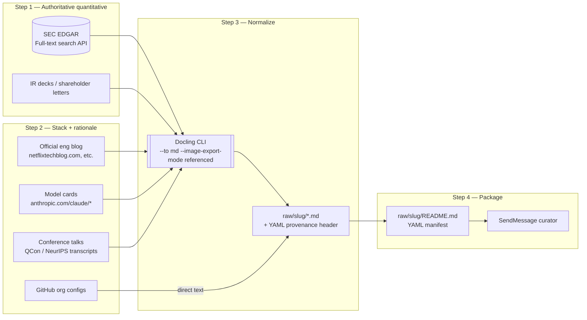

# PIPELINE.md — Atlas Research Pipeline (v0.1, DRAFT)

**Status**: DRAFT by scraper · pending architect review (schema hooks) · pending curator review (downstream consumer)
**Source of truth**: `plans/public-company-stacks-atlas.md` §6.1–6.3 and §4.3
**Scope**: How raw public-company + AI-private source material enters `raw/{slug}/`, gets normalized, and becomes consumable by the curator's extraction step. Does NOT cover schema definition (architect) or `companies/<slug>.md` extraction (curator).

---

## 1. Owners & Handoffs

| Role | Agent | Writes to | Reads from |
|---|---|---|---|
| Scraper | `scraper` (this doc's author) | `raw/{slug}/**`, `scraper-audit.log` | SEC EDGAR, allowlisted blog domains |
| Architect | `architect` | `scripts/atlas/entry.ts` (Zod schema), tier refinements | Plan §4.3, §6.3 |
| Curator | `curator` | `companies/{slug}.md`, `rejected/{slug}.md`, `SOURCES.md`, `indexes/*.json` | `raw/{slug}/**` |

**Signal order per company**:
1. `architect → scraper`: `schema_ready` (once per schema rev; blocks all scraper fetches until received)
2. `scraper → curator`: per-company `{company, raw_path, source_count, kind_hint, has_10k, notes}` (gates curator's extraction)
3. `curator → architect`: schema violations if any (curator may request schema tweak mid-batch)

`raw/` is scraper's namespace. Curator does not write to it. Scraper does not write to `companies/`, `rejected/`, or `indexes/`.

---

## 2. The 4-Step Workflow (per company)

Maps to plan §6.1 with concrete tool selections for this swarm.



### Step 1 — Authoritative quantitative (Tier A for public, skipped for AI-private)

1. Query SEC EDGAR full-text search:
   `https://efts.sec.gov/LATEST/search-index?q=<KEYWORDS>&forms=10-K&ciks=<CIK>`
2. Pick the latest 10-K (by `filed` date).
3. Download the primary `.pdf` to `raw/{slug}/10k-<fiscalYearEnd>.pdf`.
4. Compute `sha256` of the raw PDF bytes (this is the canonical hash).
5. Run Docling CLI:
   ```bash
   docling 'raw/{slug}/10k-<fiscalYearEnd>.pdf' --to md --image-export-mode referenced
   ```
   Outputs sibling `.md` + `_artifacts/` folder with referenced images.
6. Prepend YAML provenance header (see §4) to the produced `.md`.
7. Record `docling_output` filename in the manifest; the PDF stays on disk as the hash anchor.

**AI-private exception**: No 10-K exists. Skip to Step 2 directly. Set `has_10k: false` in handoff.

### Step 2 — Stack + rationale (Tiers B / E / G / F)

Per company, target a minimum source mix:
- **Public**: 1× tier B (official eng blog post on backend/edge stack) + 0-1× tier E (conference talk, `is_ic=true` only) + optional tier F (GitHub configs)
- **AI-private**: 1-2× tier B (official blog — e.g. `anthropic.com/research/*`) + 1× tier G (model card) + optional tier E (NeurIPS/ICML IC talk)

Fetch flow per source:
1. Allowlist check (§5). Reject if not on list.
2. SSRF guard: DNS-resolve the hostname, reject if RFC1918 / loopback / link-local.
3. `curl -sS -L --max-time 30 --max-filesize 20M -o raw/{slug}/<file>.html <URL>` — raw HTML bytes (not the WebFetch-summarized view, because we need the hash-stable source).
4. Compute `sha256` on the raw HTML bytes.
5. Run Docling CLI on the `.html` → produces `.md`.
6. Prepend YAML provenance header.
7. Append to `scraper-audit.log` (§6).

**PDF talks / slide decks**: treat like 10-K — download PDF, hash, docling.
**GitHub config files** (`package.json`, `go.mod`, etc.): fetch raw file via `https://raw.githubusercontent.com/...`; no docling needed (already text). Still gets a provenance header manually inserted at the top as a comment block or YAML frontmatter.

### Step 3 — Normalize (Docling CLI)

First run per session warms up the model (30-90s). Subsequent runs are ~2-5s per document. Output MD preserves heading anchors, which the curator uses for the `kb_section` field per plan §4.3.

Post-docling, the `.md` file is what curator reads. The pre-docling raw `.pdf`/`.html` is what the `sha256` is computed on (hash stability — docling model updates would otherwise churn hashes).

### Step 4 — Package & handoff

1. Write `raw/{slug}/README.md` (YAML manifest — see §3).
2. `SendMessage('curator', ...)` with the handoff payload (see §3).
3. Append a batch summary line to `scraper-audit.log`.

---

## 3. Contracts

### 3.1 Handoff message schema (scraper → curator)

Sent via `SendMessage` tool per company after Step 4:

```yaml
company: "netflix"
raw_path: "apps/product-helper/.planning/phases/13-Knowledge-banks-deepened/New-knowledge-banks/8-stacks-and-priors-atlas/raw/netflix/"
source_count: 4
kind_hint: "public"              # "public" | "ai_infra_public" | "frontier_ai_private"
has_10k: true
notes: "10-K FY25 + 2 tier-B blog posts + 1 tier-E QCon talk (is_ic=true). No NEEDS_RESEARCH flags."
```

`kind_hint` drives curator's kind-conditional Zod path. `frontier_ai_private` triggers the `ai_stack` + `utility_weight_hints` required-fields branch per plan §4.3.

### 3.2 Per-source YAML provenance header (required on every staged `.md`)

Prepended verbatim at the top of each staged source file:

```yaml
---
source_url: "https://www.sec.gov/Archives/edgar/data/1065280/..."
retrieved_at: "2026-04-21T14:22:33Z"    # ISO-8601 UTC
publish_date: "2025-01-24"               # publication date of the source itself; null if unknowable
source_tier: "A_sec_filing"              # one of the 8 codes, plan §6.3
sha256: "e3b0c44298fc1c149afbf4c8996fb92427ae41e4649b934ca495991b7852b855"
filing_type: "10-K"                      # "10-K" | "10-Q" | "S-1" | "blog" | "talk" | "tweet" | "repo" | "model_card" | null
author: "Netflix Investor Relations"     # for E/H/B tiers this matters; "" for filings
is_ic: false                             # true only when author is verified IC engineer at company
---
```

**Rules**:
- `publish_date` is `null` (not inferred) when the source page carries no date. Fall back to Wayback Machine first-capture only when explicitly noted in the manifest's `notes`. Silent inference is forbidden.
- `is_ic` defaults to `false`. Must be `true` only when byline + bio unambiguously verify IC status (excludes CEO/VP/marketing). Elevates tier E → B-equivalent for conference talks per plan §6.3.
- `source_tier` uses lettered codes from plan §6.3 (A_sec_filing, B_official_blog, C_press_analyst, D_stackshare, E_conference, F_github, G_model_card, H_social_flagged). No numeric T1-T4 codes.
- `sha256` is computed on the **pre-docling** raw bytes (PDF, HTML, or raw config file).

### 3.3 `raw/{slug}/README.md` manifest (YAML, not prose)

```yaml
company: netflix
kind_hint: public
has_10k: true
fetched_at: "2026-04-21T14:30:00Z"
scraper_version: "v0.1"
files:
  - path: "10k-FY2025.pdf"
    docling_output: "10k-FY2025.md"
    tier: A_sec_filing
    sha256: "e3b0c442..."
    extracted_claims: [revenue_fy25, subs_q4_25, gross_margin_fy25, capex_fy25]
  - path: "techblog-zuul-2-sauerkraut.html"
    docling_output: "techblog-zuul-2-sauerkraut.md"
    tier: B_official_blog
    sha256: "a7b9c1d4..."
    extracted_claims: [edge_gateway_tech, p95_chain_anchor]
  - path: "qcon-2024-caching-at-netflix.pdf"
    docling_output: "qcon-2024-caching-at-netflix.md"
    tier: E_conference
    sha256: "f0e1d2c3..."
    is_ic: true
    extracted_claims: [evcache_architecture, memcached_fronting]
notes: |
  All sources within 18mo staleness window.
  QCon talk verified IC via conference speaker page.
```

`extracted_claims` are scraper's best-guess hints of which plan §7 math primitives a file feeds (e.g. `subs_q4_25`, `p95_chain_anchor`, `availability_prior_*`, `cost_curve_*`, `ai_stack.*`). When unclear, emit `extracted_claims: [UNKNOWN]` — curator will skim-first rather than skip.

---

## 4. Directory layout scraper creates

```
raw/
└── {slug}/
    ├── 10k-<date>.pdf              # original, pre-docling, hash anchor
    ├── 10k-<date>.md               # docling output, with YAML provenance header
    ├── 10k-<date>_artifacts/       # docling image refs
    ├── techblog-<title>.html       # original HTML, pre-docling, hash anchor
    ├── techblog-<title>.md         # docling output, with provenance header
    ├── <other-sources>...
    └── README.md                   # YAML manifest
```

Curator reads `README.md` first, then the `.md` files. The `.pdf` / `.html` originals stay on disk for re-hash verification. `_artifacts/` folders can be ignored by curator (images are for human review only).

---

## 5. Domain allowlist

Hard-coded per-fetch preflight. Any URL not matching one of these patterns is rejected before network call.

**Global (always allowed)**:
- `sec.gov`, `*.sec.gov`, `efts.sec.gov`
- `raw.githubusercontent.com` (for config file fetch only)
- `github.com/<company>/*` (for repo browsing)
- `web.archive.org/web/*` (Wayback Machine, only for publish_date fallback)

**Per-company official engineering blogs** (seed list — expand per company as encountered):
| Company | Blog domain |
|---|---|
| netflix | `netflixtechblog.com`, `about.netflix.com` |
| shopify | `shopify.engineering`, `shopify.com/blog` |
| github | `github.blog` |
| uber | `uber.com/blog`, `eng.uber.com` |
| airbnb | `medium.com/airbnb-engineering` |
| stripe | `stripe.com/blog` |
| meta | `engineering.fb.com` |
| slack | `slack.engineering` |
| dropbox | `dropbox.tech` |
| pinterest | `medium.com/pinterest-engineering` |
| linkedin | `engineering.linkedin.com` |
| twitter / x | `blog.x.com`, `blog.twitter.com` |
| reddit | `redditinc.com/blog` |
| etsy | `codeascraft.com` |
| vercel | `vercel.com/blog` |
| figma | `figma.com/blog` |
| snowflake | `snowflake.com/blog` |
| databricks | `databricks.com/blog` |
| datadog | `datadoghq.com/blog` |
| elastic | `elastic.co/blog` |
| mongodb | `mongodb.com/blog` |
| confluent | `confluent.io/blog` |
| hashicorp | `hashicorp.com/blog` |
| gitlab | `about.gitlab.com/blog` |
| openai | `openai.com/blog`, `openai.com/research` |
| anthropic | `anthropic.com/news`, `anthropic.com/research` |
| mistral | `mistral.ai/news` |
| cursor | `cursor.com/blog` |
| perplexity | `perplexity.ai/hub` |
| replicate | `replicate.com/blog` |
| huggingface | `huggingface.co/blog` |
| together | `together.ai/blog` |
| coinbase | `coinbase.com/blog` |
| robinhood | `newsroom.aboutrh.com`, `robinhood.engineering` |
| basecamp | `basecamp.com/handbook`, `37signals.com` |
| doordash | `doordash.engineering` |
| lyft | `eng.lyft.com` |

**Explicit rejections** (never fetched, even if cited elsewhere):
- `pastebin.com`, `*.pastebin.com`
- `gist.github.com` private gists
- any URL matching `*leaked*`, `*internal*`, `*confidential*`

**SSRF guard** (runtime, all fetches): reject URLs whose DNS resolves to `10.0.0.0/8`, `172.16.0.0/12`, `192.168.0.0/16`, `127.0.0.0/8`, `169.254.0.0/16`, `::1`, `fc00::/7`.

---

## 6. Audit log

Every fetch appends one line to `scraper-audit.log` (JSONL, in phase root):

```json
{"ts":"2026-04-21T14:22:33Z","company":"netflix","url":"https://...","tier":"A_sec_filing","sha256":"e3b0c...","bytes":4823411,"status":"ok"}
```

`status` ∈ `{"ok", "rejected_allowlist", "rejected_ssrf", "rejected_oversize", "fetch_error"}`. Rejections log the URL + reason but do not follow redirects.

---

## 7. Batch discipline

- Max **3 companies per batch** (memory/context limit).
- Batch 1: `netflix → shopify → anthropic` (confirmed with curator).
- Do not fetch without architect's `schema_ready` signal.
- Between batches, scraper pauses and awaits curator's validation results. If curator rejects >1 entry in a batch, scraper halts and requests contract clarification before batch 2.

### 7.1 Single-writer-per-file discipline

Learned the hard way on 2026-04-22 when a parallel-curator instance wrote `companies/shopify.md` with a URL typo (`...000009/...` for an accession that doesn't exist on EDGAR) while the primary curator was parked on a team-lead hold. The mismatch was caught by cross-checking `raw/shopify/10k-FY2025.md` provenance vs `companies/shopify.md` frontmatter. Root cause: no lock on `companies/*.md` + no lock on the ledger files (`SOURCES.md`, `README.md` corpus_status).

**Rules going forward**:

1. **One writer per path, at a time.** For any file in `companies/`, `rejected/`, `archetypes/`, `indexes/`, `SOURCES.md`, or `README.md`, exactly one agent holds the write-lock. Curator is the designated writer for all of these. Scraper never writes there.

2. **`raw/{slug}/` is the scraper's exclusive namespace.** Curator reads but does not write. If a discrepancy is found in `raw/`, curator messages scraper — does not edit in place.

3. **Ledger updates are transactional with entry writes.** When curator emits `companies/<slug>.md`, the SAME extraction pass appends to `SOURCES.md` and bumps `README.md` corpus_status. Never a standalone ledger edit. If a write is partial (entry lands but ledger doesn't update), that's a bug to fix, not a state to leave.

4. **If a second curator instance appears**, the two must:
   - (a) Stop writing immediately
   - (b) Compare their task ledgers
   - (c) Request team-lead adjudication before any further writes
   - Never clobber, never race.

5. **URL/SHA provenance is single-source-of-truth from `raw/{slug}/`.** Curator's extraction MUST copy `source_url` and `sha256` verbatim from the scraper's provenance header — not re-transcribe, not infer from context. Transcription risk is the class of bug that produced the shopify `000009/000007` typo.

6. **A pre-commit lint (non-blocking) can help.** A CI job running `scripts/atlas/verify-citations.ts` (see §8.1) that re-fetches + re-hashes `companies/*.md` citations will catch transcription errors at build time. Recommended.

---

## 8. Failure modes & what scraper does

| Failure | Response |
|---|---|
| Docling CLI missing / `which docling` empty | Halt, SendMessage architect. No reinstall attempts. |
| SEC EDGAR rate-limits (429) | Exponential backoff 2s→4s→8s→16s→32s, then halt + message architect if still 429. |
| Blog URL redirects off-allowlist | Reject. Log `rejected_allowlist`. Do not follow. |
| PDF >20MB | Reject (oversize guard). Log. Flag in notes. |
| Page has no `publish_date` visible | Set `publish_date: null`, attempt Wayback first-capture as fallback, note in manifest. Never silently infer. |
| Author IC-status ambiguous | Set `is_ic: false` (conservative). Tier E stays at E, not elevated. |
| Source would be sole tier-H for a quant claim | Drop the source entirely. Flag in notes as "insufficient corroboration; curator may mark NEEDS_RESEARCH". |

---

### 8.1 Citation verification (reference implementation)

Not yet built — scaffolding sits in `apps/product-helper/scripts/atlas/` (empty). Architect provided this sketch on 2026-04-22 for whoever picks it up. The job: walk `companies/*.md`, re-fetch every `source_url` in the frontmatter, hash the bytes, compare to the stored `sha256`. Fail the build on mismatch or non-200.

```ts
// apps/product-helper/scripts/atlas/verify-citations.ts
// Run via: pnpm tsx scripts/atlas/verify-citations.ts
import { readdir, readFile } from 'node:fs/promises';
import { createHash } from 'node:crypto';
import { parse as parseYaml } from 'yaml';
import { companyAtlasEntrySchema } from '@/lib/langchain/schemas/atlas';

const ATLAS_DIR =
  '.planning/phases/13-Knowledge-banks-deepened/New-knowledge-banks/8-stacks-and-priors-atlas/companies';

async function verify() {
  const files = (await readdir(ATLAS_DIR)).filter((f) => f.endsWith('.md'));
  let failures = 0;
  for (const f of files) {
    const raw = await readFile(`${ATLAS_DIR}/${f}`, 'utf8');
    const [, yaml] = raw.split('---\n', 3);
    const fm = companyAtlasEntrySchema.parse(parseYaml(yaml));
    const cites = [
      fm.scale.citation,
      ...fm.economics_citations,
      ...fm.latency_priors.map((p) => p.citation),
      ...fm.availability_priors.map((p) => p.citation),
      ...fm.cost_curves.map((p) => p.citation),
    ];
    for (const c of cites) {
      const res = await fetch(c.source_url, { redirect: 'follow' });
      if (!res.ok) {
        console.error(`FAIL ${f}: ${c.source_url} -> HTTP ${res.status}`);
        failures++;
        continue;
      }
      const bytes = Buffer.from(await res.arrayBuffer());
      const got = createHash('sha256').update(bytes).digest('hex');
      if (got !== c.sha256) {
        console.error(`FAIL ${f}: ${c.source_url} sha=${got} != stored ${c.sha256}`);
        failures++;
      }
      await new Promise((r) => setTimeout(r, 150)); // rate-limit nice
    }
  }
  process.exit(failures === 0 ? 0 : 1);
}
verify();
```

**Caveats for implementer**:

- **SEC EDGAR rate limits aggressively**: insert a 100-150ms sleep between fetches (sketch above uses 150ms). Batches of many companies will need exponential backoff on 429.
- **Pin the User-Agent per PIPELINE.md §5**: `c1v-atlas-scraper/v0.1 ancordavid@gmail.com`. Some blogs serve different HTML to different UAs — re-hashing with a different UA can produce false-positive drift.
- **Respect `robots.txt`**: already in the allowlist in §5. Verify paths that would be newly hit by the CI job.
- **Expect legitimate drift on mutable sources**: Anthropic research pages get edited in place. When `verify-citations.ts` fires a drift warning on a `B_official_blog` or `G_model_card` source, that's a signal to re-scrape and update the citation, not a scraper bug.
- **Skip tier H (social)**: Twitter/X posts are volatile and often unfetchable without auth. Filter them out before the fetch loop.

Win: catches the shopify-class URL-transcription bug at build time rather than in manual review, and also catches silent source drift when publishers edit posts in place.

---

## 9. Architect review resolutions (2026-04-21)

Ruled by architect on schema landing:

- [x] **Raw output root path**: confirmed. `raw/{slug}/` relative to this folder is correct. No schema dependency.
- [x] **`kind_hint` enum**: confirmed — exactly `public | ai_infra_public | frontier_ai_private`. Matches `entryKindSchema` in `lib/langchain/schemas/atlas/entry.ts`. Never add a 4th without a schema PR.
- [x] **`extracted_claims` vocabulary**: free-text hints + `UNKNOWN` sentinel is fine for the handoff manifest. Curator's Zod validation happens at `companies/<slug>.md` emission, not at scraper hints.
- [x] **Wayback `publish_date` fallback**: acceptable under the explicit-note rule. `publish_date: null` remains legal in Zod (citation.publish_date is required, but curator writes the fallback into the companies/ entry; scraper sets null when unknowable so the curator sees the honest absence).
- [x] **Tier enum**: verified match. 8 codes from `plan §6.3` are the EXACT enum values in `sourceTierSchema`:
  `A_sec_filing | B_official_blog | C_press_analyst | D_stackshare | E_conference | F_github | G_model_card | H_social_flagged`.
- [x] **SHA-256 stability**: confirmed. Scraper hashes pre-docling raw bytes (PDF / HTML / config) — this matches the `sha256` column on `atlas_entries` which hashes the SAME bytes. No drift across Docling model updates.

## 10. Curator review resolutions (2026-04-22)

Ruled by curator after schema rev-2:

- [x] **`extracted_claims: [UNKNOWN]` sentinel**: keep. `[]` means "staged with no math-primitive use by design" (e.g., culture/history posts); `[UNKNOWN]` means "scraper couldn't tell" — different downstream signal.
- [x] **`docling_output` field**: keep explicit, not inferred from path stem. Reason: multi-output docling runs (e.g., PDF → `foo.md` + `foo-tables.md`) need unambiguous mapping; file renames during manual review would silently break inference.
- [x] **Tier E with `is_ic=true`**: keep `tier: E_conference` + carry `is_ic: true`. Architect's rev-2 Zod enforces correctly — `citationIsPriorAcceptable` requires `is_ic === true` on E_conference, rejects otherwise. Custom elevated-tier strings (`B_equivalent_from_E_ic`) would Zod-reject since enum is strict.

## 11. Open items (post-batch-1 followups)

- [ ] Wire `scripts/atlas/verify-citations.ts` (sketch in §8.1) into CI — catches URL/SHA transcription errors at build time.
- [ ] Optional: add conference-talk tier-E fetch path (youtube-transcript-api or whisper) to scraper v0.2 — useful for supplementary batches when blog corpus thin on a math primitive. Currently flagged as "supplementary opportunity" in per-company manifests.
- [ ] Optional: add GitHub org config fetch path (tier F) — can corroborate backend.runtimes claims from blogs. Simple `raw.githubusercontent.com` fetches.
