THE BIG IDEAS BEHIND RELIABLE, SCALABLE,

AND MAINTAINABLE SYSTEMS


## Predictable Low  Latencies @  Extreme  Throughput

[START INSTANTLY](https://developers.scylladb.com/stable/?latest_sfdc_campaign=701Rb00000R082v&campaign_status=&utm_campaign=mp%20book%20link%202023-05-15%20designing%20data-intensive%20apps%20book&utm_medium=o%27reilly&utm_source=marketing%20partner&lead_source_type=marketing%20partner)

[LEARN MORE](https://resources.scylladb.com/kleppmann?latest_sfdc_campaign=701Rb00000R082v&campaign_status=&utm_campaign=mp%20book%20link%202023-05-15%20designing%20data-intensive%20apps%20book&utm_medium=o%27reilly&utm_source=marketing%20partner&lead_source_type=marketing%20partner)

## Signs you need ScyllaDB for your data-intensive application…

- Cassandra migraines
- DynamoDB / Bigtable bill shock
- Scaling impairments
- Painful latency spikes
- Inability to meet SLAs
- Cloud vendor lock-in


## Designing Data-Intensive Applications

The Big Ideas Behind Reliable, Scalable, and Maintainable Systems

This excerpt contains Chapters 3, 5, and 8. The complete book is available on the O'Reilly Online Learning Platform and through other retailers.

Martin Kleppmann


## Designing Data-Intensive Applications

by Martin Kleppmann

Copyright © 2017 Martin Kleppmann. All rights reserved.

Printed in the United States of America.

Published by O'Reilly Media, Inc., 1005 Gravenstein Highway North, Sebastopol, CA 95472.

O'Reilly books may be purchased for educational, business, or sales promotional use. Online editions are also  available  for  most  titles  ( http://oreilly.com ).  For  more  information,  contact  our  corporate/institutional sales department: 800-998-9938 or corporate@oreilly.com .

Editors:

Ann Spencer and Marie Beaugureau

Indexer:

Ellen Troutman-Zaig

Production Editor:

Kristen Brown

Interior Designer:

David Futato

Copyeditor:

Rachel Head

Cover Designer:

Karen Montgomery

Proofreader:

Amanda Kersey

Illustrator:

Rebecca Demarest

March 2017:

First Edition

## Revision History for the First Edition

2019-03-15:

Sixth Release

2019-08-09:

Seventh Release

2019-10-11:

Eighth Release

2019-12-06:

Ninth Release

2020-01-24:

Tenth Release

2020-03-27:

Eleventh Release

2020-06-05:

Twelfth Release

2020-07-24:

Thirteenth Release

2020-09-25:

Fourteenth Release

2021-03-26:

Fifteenth Release

2021-06-25:

Sixteenth Release

[See http://oreilly.com/catalog/errata.csp?isbn=9781449373320 for release details.](http://oreilly.com/catalog/errata.csp?isbn=9781449373320)

The O'Reilly logo is a registered trademark of O'Reilly Media, Inc. Designing Data-Intensive Applications , the cover image, and related trade dress are trademarks of O'Reilly Media, Inc.

While  the  publisher  and  the  author  have  used  good  faith  efforts  to  ensure  that  the  information  and instructions contained in this work are accurate, the publisher and the author disclaim all responsibility for errors or omissions, including without limitation responsibility for damages resulting from the use of or reliance on this work. Use of the information and instructions contained in this work is at your own risk. If any code samples or other technology this work contains or describes is subject to open source licenses  or  the  intellectual  property  rights  of  others,  it  is  your  responsibility  to  ensure  that  your  use thereof complies with such licenses and/or rights.

This work is part of a collaboration between O'Reilly and ScyllaDB. See our statement of editorial independence.

978-1-449-37332-0

[LSI]

## Table of Contents

| 3. Storage and Retrieval. . . . . . . . . . . . . . . . . . . . . . . . . . . . . .         | . . 1   |
|---------------------------------------------------------------------------------------------|---------|
| Data Structures That Power Your Database                                                    | 2       |
| Hash Indexes                                                                                | 4       |
| SSTables and LSM-Trees                                                                      | 8       |
| B-Trees                                                                                     | 11      |
| Comparing B-Trees and LSM-Trees                                                             | 15      |
| Other Indexing Structures                                                                   | 17      |
| Transaction Processing or Analytics?                                                        | 22      |
| Data Warehousing                                                                            | 23      |
| Stars and Snowflakes: Schemas for Analytics                                                 | 25      |
| Column-Oriented Storage                                                                     | 27      |
| Column Compression                                                                          | 29      |
| Sort Order in Column Storage                                                                | 31      |
| Writing to Column-Oriented Storage                                                          | 33      |
| Aggregation: Data Cubes and Materialized Views                                              | 33      |
| Summary                                                                                     | 35      |
| 5. Replication. . . . . . . . . . . . . . . . . . . . . . . . . . . . . . . . . . . . . . . | . 43    |
| Leaders and                                                                                 |         |
| Followers                                                                                   | 44      |
| Synchronous Versus Asynchronous Replication                                                 | 45      |
| Setting Up New Followers Handling Node Outages                                              | 47 48   |
| Implementation of Replication Logs                                                          | 50      |
| Problems with Replication Lag                                                               | 53      |
| Reading Your Own Writes                                                                     | 54      |
| Monotonic Reads                                                                             | 56      |
| Consistent Prefix Reads                                                                     | 57      |
| Solutions for Replication Lag                                                               | 59      |

8.

| Multi-Leader Replication                                        |   60 |
|-----------------------------------------------------------------|------|
| Use Cases for Multi-Leader Replication                          |   60 |
| Handling Write Conflicts                                        |   63 |
| Multi-Leader Replication Topologies                             |   67 |
| Leaderless Replication                                          |   69 |
| Writing to the Database When a Node Is Down                     |   69 |
| Limitations of Quorum Consistency                               |   73 |
| Sloppy Quorums and Hinted Handoff                               |   75 |
| Detecting Concurrent Writes                                     |   76 |
| Summary                                                         |   84 |
| The Trouble with Distributed Systems. . . . . . . . . . . . . . |   91 |
| Faults and Partial Failures                                     |   92 |
| Cloud Computing and Supercomputing                              |   93 |
| Unreliable Networks                                             |   95 |
| Network Faults in Practice                                      |   97 |
| Detecting Faults                                                |   98 |
| Timeouts and Unbounded Delays                                   |   99 |
| Synchronous Versus Asynchronous Networks                        |  102 |
| Unreliable Clocks                                               |  105 |
| Monotonic Versus Time-of-Day Clocks                             |  106 |
| Clock Synchronization and Accuracy                              |  107 |
| Relying on Synchronized Clocks                                  |  108 |
| Process Pauses                                                  |  113 |
| Knowledge, Truth, and Lies                                      |  118 |
| The Truth Is Defined by the Majority                            |  118 |
| Byzantine Faults                                                |  122 |
| System Model and Reality                                        |  124 |
| Summary                                                         |  128 |

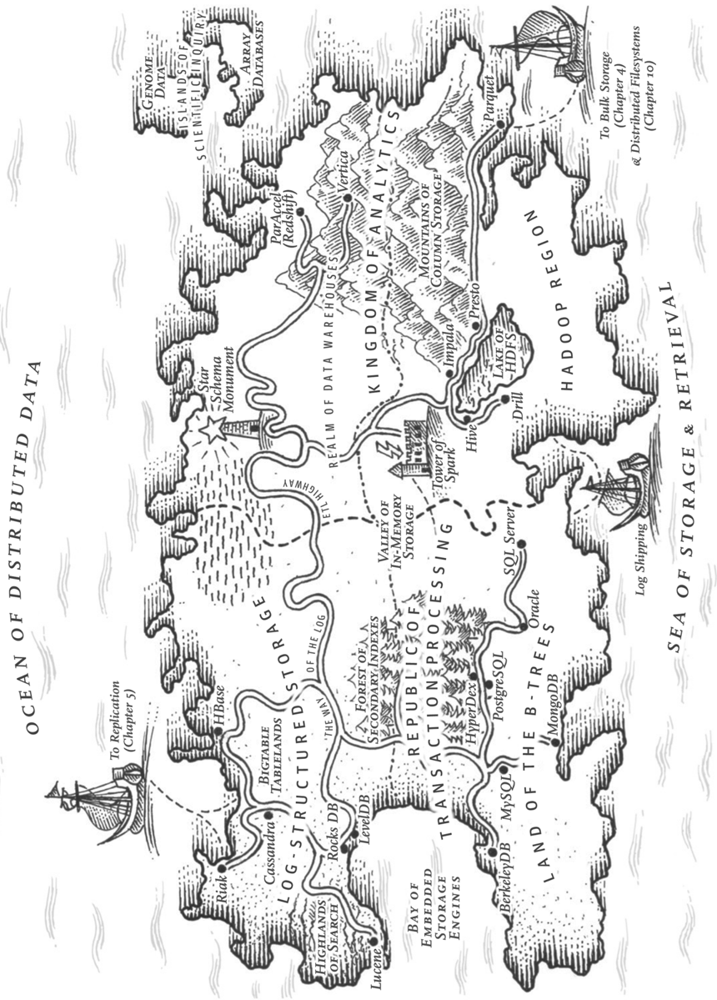

## CHAPTER 3 Storage and Retrieval

Wer Ordnung hält, ist nur zu faul zum Suchen. (If you keep things tidily ordered, you're just too lazy to go searching.)

-German proverb

On the most fundamental level, a database needs to do two things: when you give it some data, it should store the data, and when you ask it again later, it should give the data back to you.

In  Chapter  2  we  discussed  data  models  and  query  languages-i.e.,  the  format  in which you (the application developer) give the database your data, and the mechanism by which you can ask for it again later. In this chapter we discuss the same from the database's point of view: how we can store the data that we're given, and how we can find it again when we're asked for it.

Why should you, as an application developer, care how the database handles storage and retrieval internally? You're probably not going to implement your own storage engine from scratch, but you do need to select a storage engine that is appropriate for your application, from the many that are available. In order to tune a storage engine to perform well on your kind of workload, you need to have a rough idea of what the storage engine is doing under the hood.

In particular, there is a big difference between storage engines that are optimized for transactional workloads and those that are optimized for analytics. We will explore that  distinction  later  in  'Transaction  Processing  or  Analytics?'  on  page  22,  and  in 'Column-Oriented Storage' on page 27 we'll discuss a family of storage engines that is optimized for analytics.

However, first we'll start this chapter by talking about storage engines that are used in the kinds of databases that you're probably familiar with: traditional relational databases,  and  also  most  so-called  NoSQL  databases.  We  will  examine  two  families  of

storage  engines: log-structured storage  engines,  and page-oriented storage  engines such as B-trees.

## Data Structures That Power Your Database

Consider the world's simplest database, implemented as two Bash functions:

```
#!/bin/bash db_set () { echo "$1,$2" >> database } db_get () { grep "^$1," database | sed -e "s/^$1,//" | tail -n 1 }
```

These two functions implement a key-value store. You can call db\_set key value , which will store key and value in  the  database. The key and value can be (almost) anything you like-for example, the value could be a JSON document. You can then call db\_get key , which looks up the most recent value associated with that particular key and returns it.

## And it works:

```
$ db_set 123456 '{"name":"London","attractions":["Big Ben","London Eye"]}' $ db_set 42 '{"name":"San Francisco","attractions":["Golden Gate Bridge"]}' $ db_get 42 {"name":"San Francisco","attractions":["Golden Gate Bridge"]}
```

The underlying storage format is very simple: a text file where each line contains a key-value  pair,  separated  by  a  comma  (roughly  like  a  CSV  file,  ignoring  escaping issues). Every call to db\_set appends to the end of the file, so if you update a key several times, the old versions of the value are not overwritten-you need to look at the last  occurrence  of  a  key  in  a  file  to  find  the  latest  value  (hence  the tail -n 1 in db\_get ):

```
$ db_set 42 '{"name":"San Francisco","attractions":["Exploratorium"]}' $ db_get 42 {"name":"San Francisco","attractions":["Exploratorium"]} $ cat database 123456,{"name":"London","attractions":["Big Ben","London Eye"]} 42,{"name":"San Francisco","attractions":["Golden Gate Bridge"]} 42,{"name":"San Francisco","attractions":["Exploratorium"]}
```

|

Our db\_set function actually has pretty good performance for something that is so simple,  because  appending  to  a  file  is  generally  very  efficient.  Similarly  to  what db\_set does, many databases internally use a log ,  which is an append-only data file. Real databases have more issues to deal with (such as concurrency control, reclaiming disk space so that the log doesn't grow forever, and handling errors and partially written records), but the basic principle is the same. Logs are incredibly useful, and we will encounter them several times in the rest of this book.


The word log is  often  used  to  refer  to  application  logs,  where  an application  outputs  text  that  describes  what's  happening.  In  this book, log is  used  in  the  more  general  sense:  an  append-only sequence of records. It doesn't have to be human-readable; it might be binary and intended only for other programs to read.

On the other hand, our db\_get function has terrible performance if you have a large number of records in your database. Every time you want to look up a key, db\_get has to scan the entire database file from beginning to end, looking for occurrences of the key. In algorithmic terms, the cost of a lookup is O ( n ): if you double the number of records n in your database, a lookup takes twice as long. That's not good.

In order to efficiently find the value for a particular key in the database, we need a different data structure: an index . In this chapter we will look at a range of indexing structures and see how they compare; the general idea behind them is to keep some additional metadata on the side, which acts as a signpost and helps you to locate the data you want. If you want to search the same data in several different ways, you may need several different indexes on different parts of the data.

An index is an additional structure that is derived from the primary data. Many databases allow you to add and remove indexes, and this doesn't affect the contents of the database; it only affects the performance of queries. Maintaining additional structures incurs overhead, especially on writes. For writes, it's hard to beat the performance of simply appending to a file, because that's the simplest possible write operation. Any kind of index usually slows down writes, because the index also needs to be updated every time data is written.

This is an important trade-off in storage systems: well-chosen indexes speed up read queries, but every index slows down writes. For this reason, databases don't usually index everything by default, but require you-the application developer or database administrator-to  choose  indexes  manually,  using  your  knowledge  of  the  application's typical query patterns. You can then choose the indexes that give your application the greatest benefit, without introducing more overhead than necessary.

30

60

90

I

120

i

d

g

key byte offset

123456

## Hash Indexes

Log-structured file on disk

Let's start with indexes for key-value data. This is not the only kind of data you can index,  but  it's  very  common,  and  it's  a  useful  building  block  for  more  complex indexes. g 50

Key-value stores  are  quite  similar  to  the dictionary type  that  you  can  find  in  most programming  languages,  and  which  is  usually  implemented  as  a  hash  map  (hash table). Hash maps are described in many algorithms textbooks [1, 2], so we won't go into  detail  of  how  they  work  here.  Since  we  already  have  hash  maps  for  our  inmemory data structures, why not use them to index our data on disk?

Let's  say  our  data  storage  consists  only  of  appending  to  a  file,  as  in  the  preceding example.  Then  the  simplest  possible  indexing  strategy  is  this:  keep  an  in-memory hash map where every key is mapped to a byte offset in the data file-the location at which the value can be found, as illustrated in Figure 3-1. Whenever you append a new key-value pair to the file, you also update the hash map to reflect the offset of the data you just wrote (this works both for inserting new keys and for updating existing keys). When you want to look up a value, use the hash map to find the offset in the data file, seek to that location, and read the value.

Figure 3-1. Storing a log of key-value pairs in a CSV-like format, indexed with an inmemory hash map.

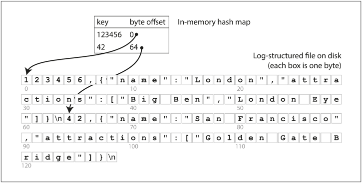

This may sound simplistic, but it is a viable approach. In fact, this is essentially what Bitcask (the default storage engine in Riak) does [3]. Bitcask offers high-performance reads and writes, subject to the requirement that all the keys fit in the available RAM, since  the  hash  map  is  kept  completely  in  memory.  The  values  can  use  more  space than there is available memory, since they can be loaded from disk with just one disk

In-memory hash map

Data file segment mew: 1078

purr: 2103

purr: 2104

mew: 1079

mew: 1080

mew: 1081

seek.  If  that  part  of  the  data  file  is  already  in  the  filesystem  cache,  a  read  doesn't require any disk I/O at all.

A storage engine like Bitcask is well suited to situations where the value for each key is updated frequently. For example, the key might be the URL of a cat video, and the value  might  be  the  number  of  times  it  has  been  played  (incremented  every  time someone hits the play button). In this kind of workload, there are a lot of writes, but there are not too many distinct keys-you have a large number of writes per key, but it's feasible to keep all keys in memory.

As described so far, we only ever append to a file-so how do we avoid eventually running out of disk space? A good solution is to break the log into segments of a certain size by closing a segment file when it reaches a certain size, and making subsequent  writes  to  a  new  segment  file.  We  can  then  perform compaction on  these segments, as illustrated in Figure 3-2. Compaction means throwing away duplicate keys in the log, and keeping only the most recent update for each key.

Figure 3-2. Compaction of a key-value update log (counting the number of times each cat video was played), retaining only the most recent value for each key.

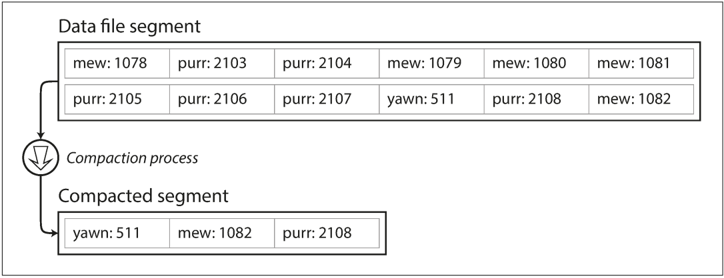

Moreover, since compaction often makes segments much smaller (assuming that a key is overwritten several times on average within one segment), we can also merge several segments together at the same time as performing the compaction, as shown in  Figure  3-3.  Segments  are  never  modified  after  they  have  been  written,  so  the merged segment is written to a new file. The merging and compaction of segments can be done in a background thread, and while it is going on, we can still continue to serve read requests using the old segment files, and write requests to the latest segment file. After the merging process is complete, we switch read requests to using the new merged segment instead of the old segments-and then the old segment files can simply be deleted.

+

Data file segment 1

mew: 1078

purr: 2103

purr: 2105

purr: 2106

Data file segment 2

purr: 2109

purr: 2111

Compaction and merging process

Merged segments 1 and 2

yawn: 511

purr: 2104

purr: 2107

mew: 1079

yawn: 511

mew: 1080

purr: 2108

mew: 1081

mew: 1082

Figure 3-3. Performing compaction and segment merging simultaneously.

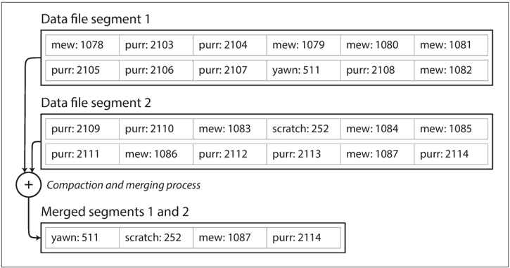

Each segment now has its own in-memory hash table, mapping keys to file offsets. In order to find the value for a key, we first check the most recent segment's hash map; if  the  key is not present we check the second-most-recent segment, and so on. The merging process keeps the number of segments small, so lookups don't need to check many hash maps.

Lots of detail goes into making this simple idea work in practice. Briefly, some of the issues that are important in a real implementation are:

## File format

CSV is not the best format for a log. It's faster and simpler to use a binary format that  first  encodes  the  length  of  a  string  in  bytes,  followed  by  the  raw  string (without need for escaping).

## Deleting records

If you want to delete a key and its associated value, you have to append a special deletion record to the data file (sometimes called a tombstone ).  When log segments are merged, the tombstone tells the merging process to discard any previous values for the deleted key.

## Crash recovery

If the database is restarted, the in-memory hash maps are lost. In principle, you can  restore  each  segment's  hash  map  by  reading  the  entire  segment  file  from beginning to end and noting the offset of the most recent value for every key as you go along. However, that might take a long time if the segment files are large, which would make server restarts painful. Bitcask speeds up recovery by storing

a snapshot of each segment's hash map on disk, which can be loaded into memory more quickly.

## Partially written records

The  database  may  crash  at  any  time,  including  halfway  through  appending  a record to the log. Bitcask files include checksums, allowing such corrupted parts of the log to be detected and ignored.

Concurrency control

As writes are appended to the log in a strictly sequential order, a common implementation  choice  is  to  have  only  one  writer  thread.  Data  file  segments  are append-only and otherwise immutable, so they can be read concurrently by multiple threads.

An append-only log seems wasteful at first glance: why don't you update the file in place, overwriting the old value with the new value? But an append-only design turns out to be good for several reasons:

- Appending and segment merging are sequential write operations, which are generally  much  faster  than  random  writes,  especially  on  magnetic  spinning-disk hard drives. To some extent sequential writes are also preferable on flash-based solid state drives (SSDs) [4]. We will discuss this issue further in 'Comparing BTrees and LSM-Trees' on page 15.
- Concurrency and crash recovery are much simpler if segment files are appendonly or immutable. For example, you don't have to worry about the case where a crash happened while a value was being overwritten, leaving you with a file containing part of the old and part of the new value spliced together.
- Merging old segments avoids the problem of data files getting fragmented over time.

However, the hash table index also has limitations:

- The hash table must fit in memory, so if you have a very large number of keys, you're  out  of  luck.  In  principle,  you  could  maintain  a  hash  map  on  disk,  but unfortunately  it  is  difficult  to  make  an  on-disk  hash  map  perform  well.  It requires a lot of random access I/O, it is expensive to grow when it becomes full, and hash collisions require fiddly logic [5].
- Range queries are not efficient. For example, you cannot easily scan over all keys between kitty00000 and kitty99999 -you'd have to look up each key individually in the hash maps.

In the next section we will look at an indexing structure that doesn't have those limitations.

+

handbag:8786 handful: 40308 handicap: 65995 handkerchief: 16324

handlebars: 3869| handprinted: 11150

## SSTables and LSM-Trees

Segment 1

In Figure 3-3, each log-structured storage segment is a sequence of key-value pairs. These pairs appear in the order that they were written, and values later in the log take precedence over values for the same key earlier in the log. Apart from that, the order of key-value pairs in the file does not matter.

Now we can make a simple change to the format of our segment files: we require that the  sequence  of  key-value  pairs  is sorted  by  key .  We  call  this  format Sorted  String Table , or SSTable for short. With this format, we cannot append new key-value pairs to the segment immediately, since writes can occur in any order; we will see shortly how to write SSTable segments using sequential I/O.

SSTables have several big advantages over log segments with hash indexes:

1. Merging  segments  is  simple  and  efficient,  even  if  the  files  are  bigger  than  the available memory. The approach is like the one used in the mergesort algorithm and is illustrated in Figure 3-4: you start reading the input files side by side, look at the first key in each file, copy the lowest key (according to the sort order) to the output file, and repeat. This produces a new merged segment file, also sorted by key.

Figure 3-4. Merging several SSTable segments, retaining only the most recent value for each key.

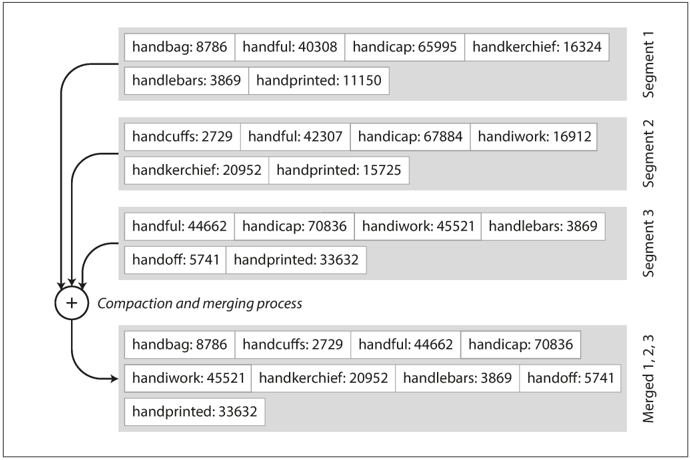

What if the same key appears in several input segments? Remember that each segment contains all  the  values  written  to  the  database  during  some  period  of

Sparse index in memory

key byte offset

hammock handbag

handsome hangout

100491

102134

104667

Sorted segment file (STable) on disk

....

hand: 91541

time. This means that all the values in one input segment must be more recent than all the values in the other segment (assuming that we always merge adjacent segments). When multiple segments contain the same key, we can keep the value from the most recent segment and discard the values in older segments.

2. In order to find a particular key in the file, you no longer need to keep an index of all the keys in memory. See Figure 3-5 for an example: say you're looking for the key handiwork , but you don't know the exact offset of that key in the segment file. However, you do know the offsets for the keys handbag and handsome ,  and because of the sorting you know that handiwork must appear between those two. This means you can jump to the offset for handbag and scan from there until you find handiwork (or not, if the key is not present in the file).

Figure 3-5. An SSTable with an in-memory index.

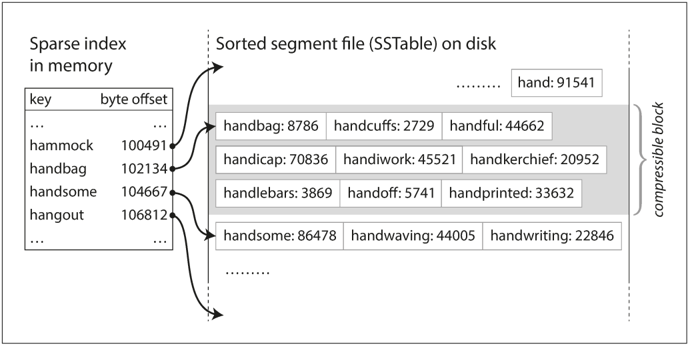

You still need an in-memory index to tell you the offsets for some of the keys, but it  can  be  sparse:  one  key  for  every  few  kilobytes  of  segment  file  is  sufficient, because a few kilobytes can be scanned very quickly. i

3. Since  read  requests  need  to  scan  over  several  key-value  pairs  in  the  requested range anyway, it is possible to group those records into a block and compress it before writing it to disk (indicated by the shaded area in Figure 3-5). Each entry of  the  sparse  in-memory  index  then  points  at  the  start  of  a  compressed  block. Besides saving disk space, compression also reduces the I/O bandwidth use.

i. If all keys and values had a fixed size, you could use binary search on a segment file and avoid the inmemory index entirely. However, they are usually variable-length in practice, which makes it difficult to tell where one record ends and the next one starts if you don't have an index.

## Constructing and maintaining SSTables

Fine so far-but how do you get your data to be sorted by key in the first place? Our incoming writes can occur in any order.

Maintaining  a  sorted  structure  on  disk  is  possible  (see  'B-Trees'  on  page  11),  but maintaining it in memory is much easier. There are plenty of well-known tree data structures that you can use, such as red-black trees or AVL trees [2]. With these data structures, you can insert keys in any order and read them back in sorted order.

We can now make our storage engine work as follows:

- When a write comes in, add it to an in-memory balanced tree data structure (for example, a red-black tree). This in-memory tree is sometimes called a memtable .
- When the memtable gets bigger than some threshold-typically a few megabytes -write it out to disk as an SSTable file. This can be done efficiently because the tree  already  maintains  the  key-value  pairs  sorted  by  key.  The  new  SSTable  file becomes the most recent  segment  of  the  database.  While  the  SSTable  is  being written out to disk, writes can continue to a new memtable instance.
- In order to serve a read request, first try to find the key in the memtable, then in the most recent on-disk segment, then in the next-older segment, etc.
- From time to time, run a merging and compaction process in the background to combine segment files and to discard overwritten or deleted values.

This  scheme  works  very  well.  It  only  suffers  from  one  problem:  if  the  database crashes, the most recent writes (which are in the memtable but not yet written out to disk) are lost. In order to avoid that problem, we can keep a separate log on disk to which every write is immediately appended, just like in the previous section. That log is not in sorted order, but that doesn't matter, because its only purpose is to restore the memtable after a crash. Every time the memtable is written out to an SSTable, the corresponding log can be discarded.

## Making an LSM-tree out of SSTables

The algorithm described here is essentially what is used in LevelDB [6] and RocksDB [7],  key-value storage engine libraries that are designed to be embedded into other applications. Among other things, LevelDB can be used in Riak as an alternative to Bitcask. Similar storage engines are used in Cassandra and HBase [8], both of which were inspired by Google's Bigtable paper [9] (which introduced the terms SSTable and memtable ).

Originally  this  indexing  structure  was  described  by  Patrick  O'Neil  et  al.  under  the name Log-Structured  Merge-Tree (or  LSM-Tree)  [10],  building  on  earlier  work  on log-structured  filesystems  [11].  Storage  engines  that  are  based  on  this  principle  of merging and compacting sorted files are often called LSM storage engines.

Lucene, an indexing engine for full-text search used by Elasticsearch and Solr, uses a similar method for storing its term dictionary [12, 13]. A full-text index is much more complex  than  a  key-value  index  but  is  based  on  a  similar  idea:  given  a  word  in  a search  query,  find  all  the  documents  (web  pages,  product  descriptions,  etc.)  that mention the word. This is implemented with a key-value structure where the key is a word (a term )  and the value is the list of IDs of all the documents that contain the word (the postings list ). In Lucene, this mapping from term to postings list is kept in SSTable-like sorted files, which are merged in the background as needed [14].

## Performance optimizations

As always, a lot of detail goes into making a storage engine perform well in practice. For example, the LSM-tree algorithm can be slow when looking up keys that do not exist in the database: you have to check the memtable, then the segments all the way back to the oldest (possibly having to read from disk for each one) before you can be sure  that  the  key  does  not  exist.  In  order  to  optimize  this  kind  of  access,  storage engines often use additional Bloom filters [15]. (A Bloom filter is a memory-efficient data structure for approximating the contents of a set. It can tell you if a key does not appear in the database, and thus saves many unnecessary disk reads for nonexistent keys.)

There are also different strategies to determine the order and timing of how SSTables are  compacted  and  merged.  The  most  common  options  are size-tiered and leveled compaction. LevelDB and RocksDB use leveled compaction (hence the name of LevelDB), HBase uses size-tiered, and Cassandra supports both [16]. In size-tiered compaction,  newer  and  smaller  SSTables  are  successively  merged  into  older  and  larger SSTables. In leveled compaction, the key range is split up into smaller SSTables and older data is moved into separate 'levels,' which allows the compaction to proceed more incrementally and use less disk space.

Even though there are many subtleties, the basic idea of LSM-trees-keeping a cascade of SSTables that are merged in the background-is simple and effective. Even when the dataset is much bigger than the available memory it continues to work well. Since data is stored in sorted order, you can efficiently perform range queries (scanning all keys above some minimum and up to some maximum), and because the disk writes are sequential the LSM-tree can support remarkably high write throughput.

## B-Trees

The log-structured indexes we have discussed so far are gaining acceptance, but they are not the most common type of index. The most widely used indexing structure is quite different: the B-tree .

key &lt;100 4*"

···

ref| 100

"Look up user\_id = 251"

ref 300

ref 200||

ref

400

ref

| 500

Introduced in 1970 [17] and called 'ubiquitous' less than 10 years later [18], B-trees have stood the test of time very well. They remain the standard index implementation in almost all relational databases, and many nonrelational databases use them too.

Like SSTables, B-trees keep key-value pairs sorted by key, which allows efficient keyvalue lookups and range queries. But that's where the similarity ends: B-trees have a very different design philosophy. ref 250 ref 270 ref 290 ref

The log-structured indexes we saw earlier break the database down into variable-size segments ,  typically  several  megabytes  or  more  in  size,  and  always  write  a  segment sequentially.  By  contrast,  B-trees  break  the  database  down  into  fixed-size blocks or pages , traditionally 4 KB in size (sometimes bigger), and read or write one page at a time. This design corresponds more closely to the underlying hardware, as disks are also arranged in fixed-size blocks.

Each page can be identified using an address or location, which allows one page to refer to another-similar to a pointer, but on disk instead of in memory. We can use these page references to construct a tree of pages, as illustrated in Figure 3-6.

Figure 3-6. Looking up a key using a B-tree index.

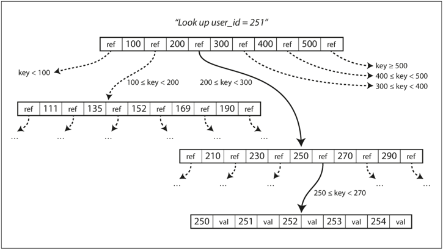

One page is designated as the root of the B-tree; whenever you want to look up a key in the index, you start here. The page contains several keys and references to child pages. Each child is responsible for a continuous range of keys, and the keys between the references indicate where the boundaries between those ranges lie.

In the example in Figure 3-6, we are looking for the key 251, so we know that we need to follow the page reference between the boundaries 200 and 300. That takes us to a similar-looking  page  that  further  breaks  down  the  200-300  range  into  subranges.

333

ref ref 310 ref 333 ref |345 ref

333 ≤ key &lt; 345

Eventually  we  get  down  to  a  page  containing  individual  keys  (a leaf  page ),  which either contains the value for each key inline or contains references to the pages where the values can be found.

The  number  of  references  to  child  pages  in  one  page  of  the  B-tree  is  called  the branching factor .  For example, in Figure 3-6 the branching factor is six. In practice, the branching factor depends on the amount of space required to store the page references and the range boundaries, but typically it is several hundred.

If you want to update the value for an existing key in a B-tree, you search for the leaf page containing that key, change the value in that page, and write the page back to disk (any references to that page remain valid). If you want to add a new key, you need to find the page whose range encompasses the new key and add it to that page. If  there isn't enough free space in the page to accommodate the new key, it is split into two half-full pages, and the parent page is updated to account for the new subdivision of key ranges-see Figure 3-7. i

Figure 3-7. Growing a B-tree by splitting a page.

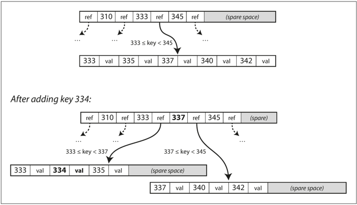

This algorithm ensures that the tree remains balanced :  a  B-tree  with n keys  always has a depth of O (log n ). Most databases can fit into a B-tree that is three or four levels deep, so you don't need to follow many page references to find the page you are looking for. (A four-level tree of 4 KB pages with a branching factor of 500 can store up to 250 TB.)

i. Inserting a new key into a B-tree is reasonably intuitive, but deleting one (while keeping the tree balanced) is somewhat more involved [2].

(spare space)

## Making B-trees reliable

The basic underlying write operation of a B-tree is to overwrite a page on disk with new data. It is assumed that the overwrite does not change the location of the page; i.e., all references to that page remain intact when the page is overwritten. This is in stark contrast to log-structured indexes such as LSM-trees, which only append to files (and eventually delete obsolete files) but never modify files in place.

You can think of overwriting a page on disk as an actual hardware operation. On a magnetic hard drive, this means moving the disk head to the right place, waiting for the right position on the spinning platter to come around, and then overwriting the appropriate sector with new data. On SSDs, what happens is somewhat more complicated, due to the fact that an SSD must erase and rewrite fairly large blocks of a storage chip at a time [19].

Moreover,  some  operations  require  several  different  pages  to  be  overwritten.  For example, if you split a page because an insertion caused it to be overfull, you need to write the two pages that were split, and also overwrite their parent page to update the references to the two child pages. This is a dangerous operation, because if the database crashes after only some of the pages have been written, you end up with a corrupted index (e.g., there may be an orphan page that is not a child of any parent).

In order to make the database resilient to crashes, it is common for B-tree implementations to include an additional data structure on disk: a write-ahead log (WAL, also known as a redo log ). This is an append-only file to which every B-tree modification must be written before it can be applied to the pages of the tree itself. When the database comes back up after a crash, this log is used to restore the B-tree back to a consistent state [5, 20].

An additional  complication  of  updating  pages  in  place  is  that  careful  concurrency control is required if multiple threads are going to access the B-tree at the same time -otherwise a thread may see the tree in an inconsistent state. This is typically done by protecting the tree's data structures  with latches (lightweight locks).  Logstructured approaches are simpler in this regard, because they do all the merging in the background without interfering with incoming queries and atomically swap old segments for new segments from time to time.

## B-tree optimizations

As B-trees have been around for so long, it's not surprising that many optimizations have been developed over the years. To mention just a few:

- Instead of overwriting pages and maintaining a WAL for crash recovery, some databases  (like  LMDB)  use  a  copy-on-write  scheme  [21].  A  modified  page  is written to a different location, and a new version of the parent pages in the tree is

created, pointing at the new  location. This approach is also useful for concurrency control, as we shall see in Chapter 7.

- We can save  space  in  pages  by  not  storing  the  entire  key,  but  abbreviating  it. Especially in pages on the interior of the tree, keys only need to provide enough information to act as boundaries between key ranges. Packing more keys into a page allows the tree to have a higher branching factor, and thus fewer levels. i
- In general, pages can be positioned anywhere on disk; there is nothing requiring pages with nearby key ranges to be nearby on disk. If a query needs to scan over a large part of the key range in sorted order, that page-by-page layout can be inefficient, because a disk seek may be required for every page that is read. Many Btree implementations therefore try to lay out the tree so that leaf pages appear in sequential order on disk. However, it's difficult to maintain that order as the tree grows. By contrast, since LSM-trees rewrite large segments of the storage in one go during merging, it's easier for them to keep sequential keys close to each other on disk.
- Additional pointers have been added to the tree. For example, each leaf page may have references to its sibling pages to the left and right, which allows scanning keys in order without jumping back to parent pages.
- B-tree  variants  such  as fractal  trees [22]  borrow  some  log-structured  ideas  to reduce disk seeks (and they have nothing to do with fractals).

## Comparing B-Trees and LSM-Trees

Even  though  B-tree  implementations  are  generally  more  mature  than  LSM-tree implementations, LSM-trees are also interesting due to their performance characteristics.  As  a  rule  of  thumb, LSM-trees are typically faster for writes, whereas B-trees are  thought  to  be  faster  for  reads  [23].  Reads  are  typically  slower  on  LSM-trees because they have to check several different data structures and SSTables at different stages of compaction.

However, benchmarks are often inconclusive and sensitive to details of the workload. You need to test systems with your particular workload in order to make a valid comparison. In this section we will briefly discuss a few things that are worth considering when measuring the performance of a storage engine.

## Advantages of LSM-trees

A B-tree index must write every piece of data at least twice: once to the write-ahead log, and once to the tree page itself (and perhaps again as pages are split). There is

i. This variant is sometimes known as a B + tree, although the optimization is so common that it often isn't distinguished from other B-tree variants.

also overhead from having to write an entire page at a time, even if only a few bytes in that page changed. Some storage engines even overwrite the same page twice in order to avoid ending up with a partially updated page in the event of a power failure [24, 25].

Log-structured indexes also rewrite data multiple times due to repeated compaction and merging of SSTables. This effect-one write to the database resulting in multiple writes to the disk over the course of the database's lifetime-is known as write amplification . It is of particular concern on SSDs, which can only overwrite blocks a limited number of times before wearing out.

In write-heavy applications, the performance bottleneck might be the rate at which the database can write to disk. In this case, write amplification has a direct performance cost: the more that a storage engine writes to disk, the fewer writes per second it can handle within the available disk bandwidth.

Moreover, LSM-trees are typically able  to  sustain  higher  write  throughput  than  Btrees,  partly  because  they  sometimes  have  lower  write  amplification  (although  this depends on the storage engine configuration and workload), and partly because they sequentially write compact SSTable files rather than having to overwrite several pages in  the  tree  [26].  This  difference  is  particularly  important  on  magnetic  hard  drives, where sequential writes are much faster than random writes.

LSM-trees  can  be  compressed  better,  and  thus  often  produce  smaller  files  on  disk than B-trees. B-tree storage engines leave some disk space unused due to fragmentation: when a page is split or when a row cannot fit into an existing page, some space in  a  page  remains  unused.  Since  LSM-trees  are  not  page-oriented  and  periodically rewrite SSTables to remove fragmentation, they have lower storage overheads, especially when using leveled compaction [27].

On many SSDs, the firmware internally uses a log-structured algorithm to turn random writes into sequential writes on the underlying storage chips, so the impact of the  storage  engine's  write  pattern  is  less  pronounced  [19].  However,  lower  write amplification and reduced fragmentation are still advantageous on SSDs: representing data more compactly allows more read and write requests within the available I/O bandwidth.

## Downsides of LSM-trees

A downside of log-structured storage is that the compaction process can sometimes interfere  with  the  performance  of  ongoing  reads  and  writes.  Even  though  storage engines try to perform compaction incrementally and without affecting concurrent access, disks have limited resources, so it can easily happen that a request needs to wait  while  the  disk  finishes  an  expensive  compaction  operation.  The  impact  on throughput and average response time is usually small, but at higher percentiles (see

Chapter 1) the response time of queries to log-structured storage engines can sometimes be quite high, and B-trees can be more predictable [28].

Another issue with compaction arises at high write throughput: the disk's finite write bandwidth  needs  to  be  shared  between  the  initial  write  (logging  and  flushing  a memtable to disk)  and  the  compaction  threads  running  in  the  background.  When writing to an empty database, the full disk bandwidth can be used for the initial write, but the bigger the database gets, the more disk bandwidth is required for compaction.

If write throughput is high and compaction is not configured carefully, it can happen that compaction cannot keep up with the rate of incoming writes. In this case, the number  of  unmerged  segments  on  disk  keeps  growing  until  you  run  out  of  disk space, and reads also slow down because they need to check more segment files. Typically, SSTable-based storage engines do not throttle the rate of incoming writes, even if  compaction cannot keep up, so you need explicit monitoring to detect this situation [29, 30].

An  advantage  of  B-trees  is  that  each  key  exists  in  exactly  one  place  in  the  index, whereas a log-structured storage engine may have multiple copies of the same key in different  segments.  This  aspect  makes  B-trees  attractive  in  databases  that  want  to offer strong transactional semantics: in many relational databases, transaction isolation is implemented using locks on ranges of keys, and in a B-tree index, those locks can be directly attached to the tree [5]. In Chapter 7 we will discuss this point in more detail.

B-trees are very ingrained in the architecture of databases and provide consistently good performance for many workloads, so it's unlikely that they will go away anytime soon. In new datastores, log-structured indexes are becoming increasingly popular. There is no quick and easy rule for determining which type of storage engine is better for your use case, so it is worth testing empirically.

## Other Indexing Structures

So far we have only discussed key-value indexes, which are like a primary key index in the relational model. A primary key uniquely identifies one row in a relational table, or one document in a document database, or one vertex in a graph database. Other records in the database can refer to that row/document/vertex by its primary key (or ID), and the index is used to resolve such references.

It  is  also  very  common  to  have secondary indexes .  In  relational  databases,  you  can create  several  secondary  indexes  on  the  same  table  using  the CREATE  INDEX command, and they are often crucial for performing joins efficiently. For example, in Figure  2-1  in  Chapter  2  you  would  most  likely  have  a  secondary  index  on  the user\_id columns so that you can find all the rows belonging to the same user in each of the tables.

A secondary index can easily be constructed from a key-value index. The main difference is that in a secondary index, the indexed values are not necessarily unique; that is, there might be many rows (documents, vertices) under the same index entry. This can be solved in two ways: either by making each value in the index a list of matching row  identifiers  (like  a  postings  list  in  a  full-text  index)  or  by  making  each  entry unique  by  appending  a  row  identifier  to  it.  Either  way,  both  B-trees  and  logstructured indexes can be used as secondary indexes.

## Storing values within the index

The key in an index is the thing that queries search for, but the value can be one of two things: it could be the actual row (document, vertex) in question, or it could be a reference  to  the  row  stored  elsewhere.  In  the  latter  case,  the  place  where  rows  are stored  is  known  as  a heap file ,  and  it  stores  data  in  no  particular  order  (it  may  be append-only, or it may keep track of deleted rows in order to overwrite them with new data later). The heap file approach is common because it avoids duplicating data when multiple secondary indexes are present: each index just references a location in the heap file, and the actual data is kept in one place.

When updating a value without changing the key, the heap file approach can be quite efficient: the record can be overwritten in place, provided that the new value is not larger than the old value. The situation is more complicated if the new value is larger, as it probably needs to be moved to a new location in the heap where there is enough space.  In  that  case,  either  all  indexes  need  to  be  updated  to  point  at  the  new  heap location of the record, or a forwarding pointer is left behind in the old heap location [5].

In some situations, the extra hop from the index to the heap file is too much of a performance penalty for reads, so it can be desirable to store the indexed row directly within  an  index.  This  is  known  as  a clustered  index .  For  example,  in  MySQL's InnoDB storage engine, the primary key of a table is always a clustered index, and secondary indexes refer to the primary key (rather than a heap file location) [31]. In SQL Server, you can specify one clustered index per table [32].

A compromise between a clustered index (storing all row data within the index) and a nonclustered index (storing only references to the data within the index) is known as a covering index or index with included columns , which stores some of a table's columns within the index [33]. This allows some queries to be answered by using the index alone (in which case, the index is said to cover the query) [32].

As with any kind of duplication of data, clustered and covering indexes can speed up reads, but they require additional storage and can add overhead on writes. Databases also need to go to additional effort to enforce transactional guarantees, because applications should not see inconsistencies due to the duplication.

## Multi-column indexes

The indexes discussed so far only map a single key to a value. That is not sufficient if we  need  to  query  multiple  columns  of  a  table  (or  multiple  fields  in  a  document) simultaneously.

The most common type of multi-column index is called a concatenated index , which simply combines several fields into one key by appending one column to another (the index definition specifies in which order the fields are concatenated). This is like an old-fashioned  paper  phone  book,  which  provides  an  index  from  ( lastname , firstname ) to phone number. Due to the sort order, the index can be used to find all the people  with  a  particular  last  name,  or  all  the  people  with  a  particular lastnamefirstname combination. However, the index is useless if you want to find all the people with a particular first name.

Multi-dimensional indexes are a  more  general  way  of  querying  several  columns  at once, which is particularly important for geospatial data. For example, a restaurantsearch website may have a database containing the latitude and longitude of each restaurant.  When  a  user  is  looking  at  the  restaurants  on  a  map,  the  website  needs  to search  for  all  the  restaurants  within  the  rectangular  map  area  that  the  user  is  currently viewing. This requires a two-dimensional range query like the following:

```
SELECT * FROM restaurants WHERE latitude  > 51.4946 AND latitude  < 51.5079 AND longitude > -0.1162 AND longitude < -0.1004;
```

A standard B-tree or LSM-tree index is not able to answer that kind of query efficiently: it can give you either all the restaurants in a range of latitudes (but at any longitude),  or  all  the  restaurants  in  a  range  of  longitudes  (but  anywhere  between  the North and South poles), but not both simultaneously.

One option is to translate a two-dimensional location into a single number using a space-filling curve, and then to use a regular B-tree index [34]. More commonly, specialized spatial indexes such as R-trees are used. For example, PostGIS implements geospatial  indexes  as  R-trees  using  PostgreSQL's  Generalized  Search  Tree  indexing facility [35]. We don't have space to describe R-trees in detail here, but there is plenty of literature on them.

An  interesting  idea  is  that  multi-dimensional  indexes  are  not  just  for  geographic locations. For example, on an ecommerce website you could use a three-dimensional index on the dimensions ( red , green , blue ) to search for products in a certain range of colors, or in a database of weather observations you could have a two-dimensional index  on  ( date , temperature )  in  order  to  efficiently  search  for  all  the  observations during the year 2013 where the temperature was between 25 and 30 ℃ .  With a onedimensional  index,  you  would  have  to  either  scan  over  all  the  records  from  2013 (regardless of temperature) and then filter them by temperature, or vice versa. A 2D

index could narrow down by timestamp and temperature simultaneously. This technique is used by HyperDex [36].

## Full-text search and fuzzy indexes

All  the  indexes  discussed  so  far  assume  that  you  have  exact  data  and  allow  you  to query for exact values of a key, or a range of values of a key with a sort order. What they don't allow you to do is search for similar keys, such as misspelled words. Such fuzzy querying requires different techniques.

For example, full-text search engines commonly allow a search for one word to be expanded  to  include  synonyms  of  the  word,  to  ignore  grammatical  variations  of words, and to search for occurrences of words near each other in the same document, and support various other features that depend on linguistic analysis of the text. To cope  with  typos  in  documents  or  queries,  Lucene  is  able  to  search  text  for  words within a certain edit distance (an edit distance of 1 means that one letter has been added, removed, or replaced) [37].

As mentioned in 'Making an LSM-tree out of SSTables' on page 10, Lucene uses a SSTable-like  structure  for  its  term  dictionary.  This  structure  requires  a  small  inmemory index that tells queries at which offset in the sorted file they need to look for a key. In LevelDB, this in-memory index is a sparse collection of some of the keys, but in Lucene, the in-memory index is a finite state automaton over the characters in the keys, similar to a trie [38]. This automaton can be transformed into a Levenshtein automaton ,  which  supports  efficient  search  for  words  within  a  given  edit  distance [39].

Other  fuzzy  search  techniques  go  in  the  direction  of  document  classification  and machine learning. See an information retrieval textbook for more detail [e.g., 40].

## Keeping everything in memory

The data structures discussed so far in this chapter have all been answers to the limitations of disks. Compared to main memory, disks are awkward to deal with. With both magnetic disks and SSDs, data on disk needs to be laid out carefully if you want good  performance  on  reads  and  writes.  However,  we  tolerate  this  awkwardness because disks  have  two  significant  advantages:  they  are  durable  (their  contents  are not  lost  if  the  power  is  turned  off),  and  they  have  a  lower  cost  per  gigabyte  than RAM.

As RAM becomes cheaper, the cost-per-gigabyte argument is eroded. Many datasets are  simply  not  that  big,  so  it's  quite  feasible  to  keep  them  entirely  in  memory, potentially distributed across several machines. This has led to the development of inmemory databases .

Some in-memory key-value stores, such as Memcached, are intended for caching use only, where it's acceptable for data to be lost if a machine is restarted. But other inmemory databases aim for durability, which can be achieved with special hardware (such as battery-powered RAM), by writing a log of changes to disk, by writing periodic snapshots to disk, or by replicating the in-memory state to other machines.

When an in-memory database is restarted, it needs to reload its state, either from disk or over the network from a replica (unless special hardware is used). Despite writing to  disk,  it's  still  an  in-memory  database,  because  the  disk  is  merely  used  as  an append-only log for durability, and reads are served entirely from memory. Writing to  disk  also  has  operational  advantages:  files  on  disk  can  easily  be  backed  up, inspected, and analyzed by external utilities.

Products such as VoltDB, MemSQL, and Oracle TimesTen are in-memory databases with a relational model, and the vendors claim that they can offer big performance improvements by removing all the overheads associated with managing on-disk data structures [41, 42]. RAMCloud is an open source, in-memory key-value store with durability (using a log-structured approach for the data in memory as well as the data on disk) [43]. Redis and Couchbase provide weak durability by writing to disk asynchronously.

Counterintuitively, the performance advantage of in-memory databases is not due to the fact that they don't need to read from disk. Even a disk-based storage engine may never need to read from disk if you have enough memory, because the operating system caches recently used disk blocks in memory anyway. Rather, they can be faster because  they  can  avoid  the  overheads  of  encoding  in-memory  data  structures  in  a form that can be written to disk [44].

Besides performance, another interesting area for in-memory databases is providing data  models  that  are  difficult  to  implement  with  disk-based  indexes.  For  example, Redis  offers  a  database-like  interface  to  various  data  structures  such  as  priority queues and sets. Because it keeps all data in memory, its implementation is comparatively simple.

Recent research indicates that an in-memory database architecture could be extended to support datasets larger than the available memory, without bringing back the overheads of a disk-centric architecture [45]. The so-called anti-caching approach works by  evicting  the  least  recently  used  data  from  memory  to  disk  when  there  is  not enough memory, and loading it back into memory when it is accessed again in the future. This is similar to what operating systems do with virtual memory and swap files,  but  the  database  can  manage  memory  more  efficiently  than  the  OS,  as  it  can work at the granularity of individual records rather than entire memory pages. This approach  still  requires  indexes  to  fit  entirely  in  memory,  though  (like  the  Bitcask example at the beginning of the chapter).

Further  changes  to  storage  engine  design  will  probably  be  needed  if non-volatile memory (NVM) technologies become more widely adopted [46]. At present, this is a new area of research, but it is worth keeping an eye on in the future.

## Transaction Processing or Analytics?

In the early days of business data processing, a write to the database typically corresponded to a commercial transaction taking  place:  making  a  sale,  placing  an  order with a supplier, paying an employee's salary, etc. As databases expanded into areas that didn't involve money changing hands, the term transaction nevertheless stuck, referring to a group of reads and writes that form a logical unit.


A  transaction  needn't  necessarily  have  ACID  (atomicity,  consistency, isolation, and durability) properties. Transaction processing just means allowing clients to make low-latency reads and writesas  opposed  to batch  processing jobs,  which  only  run  periodically (for  example,  once  per  day).  We  discuss  the  ACID  properties  in Chapter 7 and batch processing in Chapter 10.

Even  though  databases  started  being  used  for  many  different  kinds  of  data-comments on blog posts, actions in a game, contacts in an address book, etc.-the basic access pattern remained similar to processing business transactions. An application typically looks up a small number of records by some key, using an index. Records are  inserted  or  updated  based  on  the  user's  input.  Because  these  applications  are interactive,  the  access  pattern  became  known  as online transaction  processing (OLTP).

However, databases also started being increasingly used for data analytics , which has very  different  access  patterns.  Usually  an  analytic  query  needs  to  scan  over  a  huge number of records, only reading a few columns per record, and calculates aggregate statistics (such as count, sum, or average) rather than returning the raw data to the user. For example, if your data is a table of sales transactions, then analytic queries might be:

- What was the total revenue of each of our stores in January?
- How many more bananas than usual did we sell during our latest promotion?
- Which  brand  of  baby  food  is  most  often  purchased  together  with  brand  X diapers?

These queries are often written by business analysts, and feed into reports that help the management of a company make better decisions ( business intelligence ). In order to  differentiate  this  pattern  of  using  databases  from  transaction  processing,  it  has

been  called online  analytic  processing (OLAP)  [47]. i The  difference  between  OLTP and  OLAP  is  not  always  clear-cut,  but  some  typical  characteristics  are  listed  in Table 3-1.

Table 3-1. Comparing characteristics of transaction processing versus analytic systems

| Property             | Transaction processing systems (OLTP)             | Analytic systems (OLAP)                   |
|----------------------|---------------------------------------------------|-------------------------------------------|
| Main read pattern    | Small number of records per query, fetched by key | Aggregate over large number of records    |
| Main write pattern   | Random-access, low-latency writes from user input | Bulk import (ETL) or event stream         |
| Primarily used by    | End user/customer, via web application            | Internal analyst, for decision support    |
| What data represents | Latest state of data (current point in time)      | History of events that happened over time |
| Dataset size         | Gigabytes to terabytes                            | Terabytes to petabytes                    |

At first,  the  same databases were used for both transaction processing and analytic queries. SQL turned out to be quite flexible in this regard: it works well for OLTPtype queries as well as OLAP-type queries. Nevertheless, in the late 1980s and early 1990s, there was a trend for companies to stop using their OLTP systems for analytics purposes, and to run the analytics on a separate database instead. This separate database was called a data warehouse .

## Data Warehousing

An enterprise may have dozens of different transaction processing systems: systems powering the customer-facing website, controlling point of sale (checkout) systems in physical stores, tracking inventory in warehouses, planning routes for vehicles, managing suppliers, administering employees, etc. Each of these systems is complex and needs a team of people to maintain it, so the systems end up operating mostly autonomously from each other.

These OLTP systems are usually expected to be highly available and to process transactions with low latency, since they are often critical to the operation of the business. Database administrators therefore closely guard their OLTP databases. They are usually reluctant to let business analysts run ad hoc analytic queries on an OLTP database,  since  those  queries  are  often  expensive,  scanning  large  parts  of  the  dataset, which can harm the performance of concurrently executing transactions.

A data warehouse , by contrast, is a separate database that analysts can query to their hearts'  content,  without  affecting  OLTP  operations  [48].  The  data  warehouse  contains a read-only copy of the data in all the various OLTP systems in the company. Data is extracted from OLTP databases (using either a periodic data dump or a con-

i. The meaning of online in OLAP is unclear; it probably refers to the fact that queries are not just for predefined reports, but that analysts use the OLAP system interactively for explorative queries.

Users

OLTP systems

OLAP systems

Sales

Customer

Warehouse worker

Truck driver

tinuous  stream  of  updates),  transformed  into  an  analysis-friendly  schema,  cleaned up, and then loaded into the data warehouse. This process of getting data into the warehouse is known  as Extract-Transform-Load (ETL) and is illustrated in Figure 3-8. Inventory Geo

DB

extract

Business analyst

DB

DB

Figure 3-8. Simplified outline of ETL into a data warehouse.

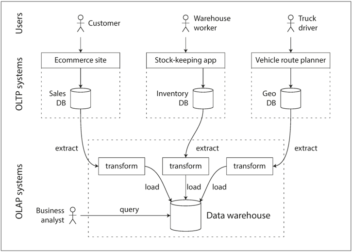

Data  warehouses  now  exist  in  almost  all  large  enterprises,  but  in  small  companies they  are  almost  unheard  of.  This  is  probably  because  most  small  companies  don't have  so  many  different  OLTP  systems,  and  most  small  companies  have  a  small amount of data-small enough that it can be queried in a conventional SQL database, or  even  analyzed  in  a  spreadsheet.  In  a  large  company,  a  lot  of  heavy  lifting  is required to do something that is simple in a small company.

A big advantage of using a separate data warehouse, rather than querying OLTP systems directly for analytics, is that the data warehouse can be optimized for analytic access patterns. It turns out that the indexing algorithms discussed in the first half of this chapter work well for OLTP, but are not very good at answering analytic queries. In the rest of this chapter we will look at storage engines that are optimized for analytics instead.

## The divergence between OLTP databases and data warehouses

The data model of a data warehouse is most commonly relational, because SQL is generally a good fit for analytic queries. There are many graphical data analysis tools that generate SQL queries, visualize the results, and allow analysts to explore the data (through operations such as drill-down and slicing and dicing ).

On  the  surface,  a  data  warehouse  and  a  relational  OLTP  database  look  similar, because they both have a SQL query interface. However, the internals of the systems can look quite different, because they are optimized for very different query patterns. Many database  vendors  now  focus  on  supporting  either  transaction  processing  or analytics workloads, but not both.

Some databases,  such  as  Microsoft  SQL  Server  and  SAP  HANA,  have  support  for transaction processing and data warehousing in the same product. However, they are increasingly becoming two separate storage and query engines, which happen to be accessible through a common SQL interface [49, 50, 51].

Data warehouse vendors such as Teradata, Vertica, SAP HANA, and ParAccel typically  sell  their  systems  under  expensive  commercial licenses. Amazon RedShift is a hosted  version  of  ParAccel.  More  recently,  a  plethora  of  open  source  SQL-onHadoop projects have emerged; they are young but aiming to compete with commercial  data  warehouse  systems.  These  include  Apache  Hive,  Spark  SQL,  Cloudera Impala, Facebook Presto, Apache Tajo, and Apache Drill [52, 53]. Some of them are based on ideas from Google's Dremel [54].

## Stars and Snowflakes: Schemas for Analytics

As explored in Chapter 2, a wide range of different data models are used in the realm of transaction processing, depending on the needs of the application. On the other hand, in analytics, there is much less diversity of data models. Many data warehouses are used in a fairly formulaic style, known as a star  schema (also  known as dimensional modeling [55]).

The example schema in Figure 3-9 shows a data warehouse that might be found at a grocery retailer. At the center of the schema is a so-called fact table (in this example, it is called fact\_sales ). Each row of the fact table represents an event that occurred at a particular time (here, each row represents a customer's purchase of a product). If we were analyzing website traffic rather than retail sales, each row might represent a page view or a click by a user.

dim\_product table product\_sk

sku

30

31

0K4012

KA9511

32

AB1234

fact\_sales table date\_key

product\_sk

140102

140102

140102

31 -

69

74

/ 140102

33

dim\_date table year month

date\_key

140101

140102

140103

2014

2014

2014

description

Bananas brand

Freshmax category

Fresh fruit dim\_store table

store\_sk state

1

WA

city

Seattle

Figure 3-9. Example of a star schema for use in a data warehouse.

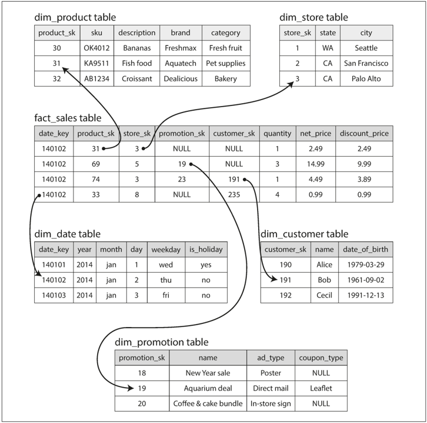

Usually, facts are captured as individual events, because this allows maximum flexibility of analysis later. However, this means that the fact table can become extremely large.  A  big  enterprise  like  Apple,  Walmart,  or  eBay  may have tens of petabytes of transaction history in its data warehouse, most of which is in fact tables [56].

Some of the columns in the fact table are attributes, such as the price at which the product was sold and the cost of buying it from the supplier (allowing the profit margin  to  be  calculated).  Other  columns  in  the  fact  table  are  foreign  key  references  to other tables, called dimension tables . As each row in the fact table represents an event, the dimensions represent the who , what , where , when , how , and why of the event.

For example, in Figure 3-9, one of the dimensions is the product that was sold. Each row in the dim\_product table represents one type of product that is for sale, including

its stock-keeping unit (SKU), description, brand name, category, fat content, package size, etc. Each row in the fact\_sales table uses a foreign key to indicate which product was sold in that particular transaction. (For simplicity, if the customer buys several  different  products  at  once,  they  are  represented  as  separate  rows  in  the  fact table.)

Even date and time are often represented using dimension tables, because this allows additional information about dates (such as public holidays) to be encoded, allowing queries to differentiate between sales on holidays and non-holidays.

The name 'star schema' comes from the fact that when the table relationships are visualized,  the  fact  table  is  in  the  middle,  surrounded  by  its  dimension  tables;  the connections to these tables are like the rays of a star.

A variation of this template is known as the snowflake schema , where dimensions are further broken down into subdimensions. For example, there could be separate tables for brands and product categories, and each row in the dim\_product table could reference the brand and category as foreign keys, rather than storing them as strings in the dim\_product table.  Snowflake schemas are more normalized than star schemas, but  star  schemas  are  often  preferred  because  they  are  simpler  for  analysts  to  work with [55].

In a typical data warehouse, tables are often very wide: fact tables often have over 100 columns, sometimes several hundred [51]. Dimension tables can also be very wide, as they  include  all  the  metadata  that  may  be  relevant  for  analysis-for  example,  the dim\_store table  may  include  details  of  which  services  are  offered  at  each  store, whether it has an in-store bakery, the square footage, the date when the store was first opened, when it was last remodeled, how far it is from the nearest highway, etc.

## Column-Oriented Storage

If  you  have  trillions  of  rows  and  petabytes  of  data  in  your  fact  tables,  storing  and querying them efficiently becomes a challenging problem. Dimension tables are usually much smaller (millions of rows), so in this section we will concentrate primarily on storage of facts.

Although fact tables are often over 100 columns wide, a typical data warehouse query only accesses 4 or 5 of them at one time ( "SELECT *" queries are rarely needed for analytics)  [51].  Take  the  query  in  Example  3-1:  it  accesses  a  large  number  of  rows (every occurrence of someone buying fruit or candy during the 2013 calendar year), but  it  only  needs  to  access  three  columns  of  the fact\_sales table: date\_key , product\_sk , and quantity . The query ignores all other columns.

```
SELECT dim_date.weekday, dim_product.category, SUM (fact_sales.quantity) AS quantity_sold FROM fact_sales JOIN dim_date ON fact_sales.date_key   = dim_date.date_key JOIN dim_product ON fact_sales.product_sk = dim_product.product_sk WHERE dim_date. year = 2013 AND dim_product.category IN ('Fresh fruit', 'Candy') GROUP BY dim_date.weekday, dim_product.category;
```

Example 3-1. Analyzing whether people are more inclined to buy fresh fruit or candy, depending on the day of the week

How can we execute this query efficiently?

In most OLTP databases, storage is laid out in a row-oriented fashion: all the values from one row of a table are stored next to each other. Document databases are similar: an entire document is typically stored as one contiguous sequence of bytes. You can see this in the CSV example of Figure 3-1.

In order to process a query like Example  3-1, you may  have indexes  on fact\_sales.date\_key and/or fact\_sales.product\_sk that  tell  the  storage  engine where to find all the sales for a particular date or for a particular product. But then, a row-oriented storage engine still needs to load all of those rows (each consisting of over  100  attributes)  from  disk  into  memory,  parse  them,  and  filter  out  those  that don't meet the required conditions. That can take a long time.

The idea behind column-oriented storage is simple: don't store all the values from one row together, but store all the values from each column together instead. If each column is stored in a separate file, a query only needs to read and parse those columns that are used in that query, which can save a lot of work. This principle is illustrated in Figure 3-10.


Column storage is easiest to understand in a relational data model, but it  applies  equally  to  nonrelational data. For example, Parquet [57] is a columnar storage format that supports a document data model, based on Google's Dremel [54].

|

fact\_sales table date\_key product\_sk store\_sk promotion\_sk customer\_sk quantity net\_price discount \_price

140102

140102

140102

140102

140103

140103

140103

69

74

31

31

31

140103

31

Columnar storage layout:

date\_key file contents:

product\_sk file contents:

store\_sk file contents:

promotion\_sk file contents:

customer\_sk file contents:

quantity file contents:

net\_price file contents:

discount\_price file contents:

Figure 3-10. Storing relational data by column, rather than by row.

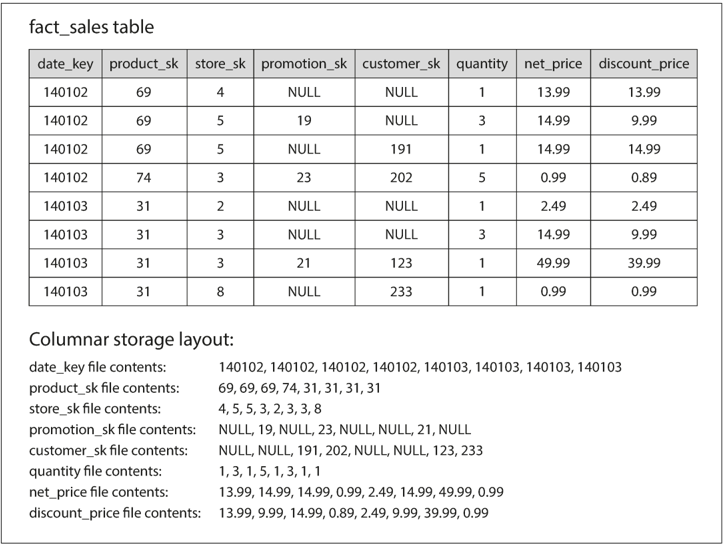

|   69 5 19 NULL 3 14.99 | 69 5 19 NULL 3 14.99           | 69 5 19 NULL 3 14.99                                           |   69 5 19 NULL 3 14.99 |   69 5 19 NULL 3 14.99 | 69 5 19 NULL 3 14.99   | 69 5 19 NULL 3 14.99   | 69 5 19 NULL 3 14.99   |
|------------------------|--------------------------------|----------------------------------------------------------------|------------------------|------------------------|------------------------|------------------------|------------------------|
|                      5 | NULL                           | 191 1                                                          |                  14.99 |                  14.99 |                        |                        |                        |
|                      3 | 23                             | 202 5                                                          |                   0.99 |                   0.89 |                        |                        |                        |
|                      2 | NULL                           | NULL 1                                                         |                   2.49 |                   2.49 |                        |                        |                        |
|                      3 | NULL                           | NULL 3                                                         |                  14.99 |                   9.99 |                        |                        |                        |
|                      3 | 21                             | 123                                                            |                  49.99 |                  39.99 |                        |                        |                        |
|                      8 | NULL                           | 233 1                                                          |                   0.99 |                   0.99 |                        |                        |                        |
|                        |                                | 140102, 140102, 140102, 140102, 140103, 140103, 140103, 140103 |                        |                        |                        |                        |                        |
|                        | 69, 69, 69, 74, 31, 31, 31, 31 |                                                                |                        |                        |                        |                        |                        |

The column-oriented storage layout relies on each column file containing the rows in the same order. Thus, if you need to reassemble an entire row, you can take the 23rd entry  from  each  of  the  individual  column  files  and  put  them  together  to  form  the 23rd row of the table.

## Column Compression

Besides only loading those columns from disk that are required for a query, we can further  reduce  the  demands  on  disk  throughput  by  compressing  data.  Fortunately, column-oriented storage often lends itself very well to compression.

Take a look at the sequences of values for each column in Figure 3-10: they often look quite repetitive, which is a good sign for compression. Depending on the data in the column, different compression techniques can be used. One technique that is particularly effective in data warehouses is bitmap encoding , illustrated in Figure 3-11.

4

NULL

NULL

1

13.99

13.99

Column values:

product\_sk:

69

69

69

69

74

Bitmap for each possible value:

product\_sk = 29:

product\_sk = 30:

product\_sk = 31:

product\_sk = 68:

product\_sk = 69:

product\_sk =74:

Run-length encoding:

product\_sk = 29: 9,1

product\_sk = 30:

product\_sk = 31: 5,4,3,3

product\_sk = 68:

product\_sk = 69:

product\_sk = 74:

31

31

31

31

29

30

30

31

31

31

68

69

69

Figure 3-11. Compressed, bitmap-indexed storage of a single column.

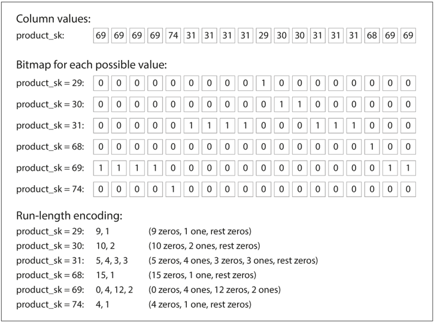

Often, the number of distinct values in a column is small compared to the number of rows (for example, a retailer may have billions of sales transactions, but only 100,000 distinct products). We can now take a column with n distinct values and turn it into n separate bitmaps: one bitmap for each distinct value, with one bit for each row. The bit is 1 if the row has that value, and 0 if not.

If n is  very  small (for example, a country column may have approximately 200 distinct  values),  those  bitmaps  can  be  stored  with  one  bit  per  row.  But  if n is  bigger, there will be a lot of zeros in most of the bitmaps (we say that they are sparse ). In that case, the bitmaps can additionally be run-length encoded, as shown at the bottom of Figure 3-11. This can make the encoding of a column remarkably compact.

Bitmap indexes such as these are very well suited for the kinds of queries that are common in a data warehouse. For example:

WHERE product\_sk IN (30, 68, 69):

Load the three bitmaps for product\_sk = 30 , product\_sk = 68 , and product\_sk = 69 , and calculate the bitwise OR of the three bitmaps, which can be done very efficiently.

WHERE product\_sk = 31 AND store\_sk = 3:

Load the bitmaps for product\_sk = 31 and store\_sk = 3 , and calculate the bitwise AND . This works because the columns contain the rows in the same order, so the k th bit in one column's bitmap corresponds to the same row as the k th bit in another column's bitmap.

There are also various other compression schemes for different kinds of data, but we won't go into them in detail-see [58] for an overview.


## Column-oriented storage and column families

Cassandra  and  HBase  have  a  concept  of column  families ,  which they inherited from Bigtable [9]. However, it is very misleading to call them column-oriented: within each column family, they store all columns from a row together, along with a row key, and they do not  use  column  compression.  Thus,  the  Bigtable  model  is  still mostly row-oriented.

## Memory bandwidth and vectorized processing

For data warehouse queries that need to scan over millions of rows, a big bottleneck is  the  bandwidth for getting data from disk into memory. However, that is not the only bottleneck. Developers of analytical databases also worry about efficiently using the bandwidth from main memory into the CPU cache, avoiding branch mispredictions  and  bubbles  in  the  CPU  instruction  processing  pipeline,  and  making  use  of single-instruction-multi-data (SIMD) instructions in modern CPUs [59, 60].

Besides  reducing  the  volume  of  data  that  needs  to  be  loaded  from  disk,  columnoriented  storage  layouts  are  also  good  for  making  efficient  use  of  CPU  cycles.  For example,  the  query  engine  can  take  a  chunk  of  compressed  column  data  that  fits comfortably in the CPU's L1 cache and iterate through it in a tight loop (that is, with no  function  calls).  A  CPU  can  execute  such  a  loop  much  faster  than  code  that requires a lot of function calls and conditions for each record that is processed. Column compression allows more rows from a column to fit in the same amount of L1 cache.  Operators,  such  as  the  bitwise AND and OR described  previously,  can  be designed to operate on such chunks of compressed column data directly. This technique is known as vectorized processing [58, 49].

## Sort Order in Column Storage

In a column store, it doesn't necessarily matter in which order the rows are stored. It's easiest to store them in the order in which they were inserted, since then inserting a new row just means appending to each of the column files. However, we can choose to impose an order, like we did with SSTables previously, and use that as an indexing mechanism.

Note that it wouldn't make sense to sort each column independently, because then we would no longer know which items in the columns belong to the same row. We can only reconstruct a row because we know that the k th item in one column belongs to the same row as the k th item in another column.

Rather, the data needs to be sorted an entire row at a time, even though it is stored by column.  The  administrator  of  the  database  can  choose  the  columns  by  which  the table  should  be  sorted,  using  their  knowledge  of  common  queries.  For  example,  if queries often target date ranges, such as the last month, it might make sense to make date\_key the first sort key. Then the query optimizer can scan only the rows from the last month, which will be much faster than scanning all rows.

A second column can determine the sort order of any rows that have the same value in  the  first  column.  For  example, if date\_key is  the  first  sort  key  in  Figure  3-10,  it might make sense for product\_sk to  be  the second sort key so that all sales for the same product on the same day are grouped together in storage. That will help queries that need to group or filter sales by product within a certain date range.

Another advantage of sorted order is that it can help with compression of columns. If the primary sort column does not have many distinct values, then after sorting, it will have long sequences where the same value is repeated many times in a row. A simple run-length  encoding,  like  we  used  for  the  bitmaps  in  Figure  3-11,  could  compress that column down to a few kilobytes-even if the table has billions of rows.

That compression effect is strongest on the first sort key. The second and third sort keys will be more jumbled up, and thus not have such long runs of repeated values. Columns further  down  the  sorting  priority  appear  in  essentially  random  order,  so they probably won't compress as well. But having the first few columns sorted is still a win overall.

## Several different sort orders

A clever extension of this idea was introduced in C-Store and adopted in the commercial data warehouse Vertica [61, 62]. Different queries benefit from different sort orders, so why not store the same data sorted in several different ways? Data needs to be replicated to multiple machines anyway, so that you don't lose data if one machine fails.  You  might  as  well  store  that  redundant  data  sorted  in  different  ways  so  that when  you're  processing  a  query,  you  can  use  the  version  that  best  fits  the  query pattern.

Having multiple sort orders in a column-oriented store is a bit similar to having multiple secondary indexes in a row-oriented store. But the big difference is that the roworiented store keeps every row in one place (in the heap file or a clustered index), and secondary  indexes  just  contain  pointers  to  the  matching  rows.  In  a  column  store, there normally aren't any pointers to data elsewhere, only columns containing values.

## Writing to Column-Oriented Storage

These optimizations make sense in data warehouses, because most of the load consists of large read-only queries run by analysts. Column-oriented storage, compression, and sorting all help to make those read queries faster. However, they have the downside of making writes more difficult.

An update-in-place approach, like B-trees use, is not possible with compressed columns. If you wanted to insert a row in the middle of a sorted table, you would most likely  have  to  rewrite  all  the  column  files.  As  rows  are  identified  by  their  position within a column, the insertion has to update all columns consistently.

Fortunately, we have already seen a good solution earlier in this chapter: LSM-trees. All writes first go to an in-memory store, where they are added to a sorted structure and prepared for writing to disk. It doesn't matter whether the in-memory store is row-oriented or column-oriented. When enough writes have accumulated, they are merged with the column files on disk and written to new files in bulk. This is essentially what Vertica does [62].

Queries need to examine both the column data on disk and the recent writes in memory, and combine the two. However, the query optimizer hides this distinction from the user. From an analyst's point of view, data that has been modified with inserts, updates, or deletes is immediately reflected in subsequent queries.

## Aggregation: Data Cubes and Materialized Views

Not  every  data  warehouse  is  necessarily  a  column  store:  traditional  row-oriented databases and a few other architectures are also used. However, columnar storage can be significantly faster for ad hoc analytical queries, so it is rapidly gaining popularity [51, 63].

Another aspect of data warehouses that is worth mentioning briefly is materialized aggregates .  As  discussed  earlier,  data  warehouse  queries  often  involve  an  aggregate function, such as COUNT , SUM , AVG , MIN , or MAX in SQL. If the same aggregates are used by many different queries, it can be wasteful to crunch through the raw data every time. Why not cache some of the counts or sums that queries use most often?

One way of creating such a cache is a materialized view . In a relational data model, it is often defined like a standard (virtual) view: a table-like object whose contents are the results of some query. The difference is that a materialized view is an actual copy of the query results, written to disk, whereas a virtual view is just a shortcut for writing queries. When you read from a virtual view, the SQL engine expands it into the view's underlying query on the fly and then processes the expanded query.

When the underlying data changes, a materialized view needs to be updated, because it  is  a  denormalized  copy  of  the  data.  The  database  can  do  that  automatically,  but

SELECT SUM(net\_price)

FROM fact\_sales

WHERE date\_key = 140101

AND product\_sk = 32

product\_sk such updates make writes more expensive, which is why materialized views are not often used in OLTP databases. In read-heavy data warehouses they can make more sense (whether or not they actually improve read performance depends on the individual case). 132.18 19.78 82.91 10.96 73091.28

A common special case of a materialized view is known as a data cube or OLAP cube [64]. It is a grid of aggregates grouped by different dimensions. Figure 3-12 shows an example.

SELECT SUM(net\_price)

FROM fact\_sales

WHERE product\_sk = 32

Figure 3-12. Two dimensions of a data cube, aggregating data by summing.

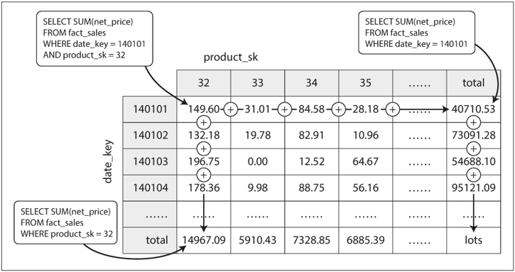

Imagine for  now  that  each  fact  has  foreign  keys  to  only  two  dimension  tables-in Figure 3-12, these are date and product . You can now draw a two-dimensional table, with dates along one axis and products along the other. Each cell contains the aggregate  (e.g., SUM )  of  an  attribute  (e.g., net\_price )  of  all  facts  with  that  date-product combination. Then you can apply the same aggregate along each row or column and get a summary that has been reduced by one dimension (the sales by product regardless of date, or the sales by date regardless of product).

In general, facts often have more than two dimensions. In Figure 3-9 there are five dimensions: date, product, store, promotion, and customer. It's a lot harder to imagine what a five-dimensional hypercube would look like, but the principle remains the same:  each  cell  contains  the  sales  for  a  particular  date-product-store-promotioncustomer combination. These values can then repeatedly be summarized along each of the dimensions.

The advantage of a materialized data cube is that certain  queries  become  very  fast because they have effectively been precomputed. For example, if you want to know

SELECT SUM(net\_price)

FROM fact\_sales

WHERE date\_key = 140101

the total sales per store yesterday, you just need to look at the totals along the appropriate dimension-no need to scan millions of rows.

The disadvantage is that a data cube doesn't have the same flexibility as querying the raw data. For example, there is no way of calculating which proportion of sales comes from items that cost more than $100, because the price isn't one of the dimensions. Most data warehouses therefore try to keep as much raw data as possible, and use aggregates such as data cubes only as a performance boost for certain queries.

## Summary

In  this  chapter  we  tried  to  get  to  the  bottom  of  how  databases  handle  storage  and retrieval. What happens when you store data in a database, and what does the database do when you query for the data again later?

On a high level, we saw that storage engines fall into two broad categories: those optimized for transaction processing (OLTP), and those optimized for analytics (OLAP). There are big differences between the access patterns in those use cases:

- OLTP systems are typically user-facing, which means that they may see a huge volume of requests. In order to handle the load, applications usually only touch a small number of records in each query. The application requests records using some kind of key, and the storage engine uses an index to find the data for the requested key. Disk seek time is often the bottleneck here.
- Data warehouses and similar analytic systems are less well known, because they are primarily used by business analysts, not by end users. They handle a much lower  volume  of  queries  than  OLTP  systems,  but  each  query  is  typically  very demanding, requiring many millions of records to be scanned in a short time. Disk  bandwidth  (not  seek  time)  is  often  the  bottleneck  here,  and  columnoriented storage is an increasingly popular solution for this kind of workload.

On the OLTP side, we saw storage engines from two main schools of thought:

- The log-structured  school,  which  only  permits  appending  to  files  and  deleting obsolete files,  but  never  updates  a  file  that  has  been  written.  Bitcask,  SSTables, LSM-trees, LevelDB, Cassandra, HBase, Lucene, and others belong to this group.
- The update-in-place school, which treats the disk as a set of fixed-size pages that can be overwritten. B-trees are the biggest example of this philosophy, being used in all major relational databases and also many nonrelational ones.

Log-structured  storage  engines  are  a  comparatively  recent  development.  Their  key idea is that they systematically turn random-access writes into sequential writes on disk, which enables higher write throughput due to the performance characteristics of hard drives and SSDs.

Finishing  off  the  OLTP  side,  we  did  a  brief  tour  through  some  more  complicated indexing structures, and databases that are optimized for keeping all data in memory.

We then took a detour from the internals of storage engines to look at the high-level architecture  of  a  typical  data  warehouse.  This  background  illustrated  why  analytic workloads are so different from OLTP: when your queries require sequentially scanning  across  a  large  number  of  rows,  indexes  are  much  less  relevant.  Instead  it becomes important to encode data very compactly, to minimize the amount of data that the query needs to read from disk. We discussed how column-oriented storage helps achieve this goal.

As an application developer, if you're armed with this knowledge about the internals of storage engines, you are in a much better position to know which tool is best suited for your particular application. If you need to adjust a database's tuning parameters, this understanding allows you to imagine what effect a higher or a lower value may have.

Although this chapter couldn't make you an expert in tuning any one particular storage engine, it has hopefully equipped you with enough vocabulary and ideas that you can make sense of the documentation for the database of your choice.

## References

[1]  Alfred  V.  Aho,  John  E.  Hopcroft,  and  Jeffrey  D.  Ullman: Data  Structures  and Algorithms . Addison-Wesley, 1983. ISBN: 978-0-201-00023-8

[2] Thomas H. Cormen, Charles E. Leiserson, Ronald L. Rivest, and Clifford Stein: Introduction to Algorithms , 3rd edition. MIT Press, 2009. ISBN: 978-0-262-53305-8

[3] Justin Sheehy and David Smith: 'Bitcask: A Log-Structured Hash Table for Fast Key/Value Data,' Basho Technologies, April 2010.

[4]  Yinan  Li,  Bingsheng  He,  Robin  Jun  Yang,  et  al.:  'Tree  Indexing  on  Solid  State Drives,' Proceedings of the VLDB Endowment , volume 3, number 1, pages 1195-1206, September 2010.

[5]  Goetz  Graefe:  'Modern  B-Tree  Techniques,' Foundations  and  Trends  in  Databases , volume 3, number 4, pages 203-402, August 2011. doi:10.1561/1900000028

[6]  Jeffrey  Dean  and  Sanjay  Ghemawat:  'LevelDB  Implementation  Notes,' github.com .

[7] Dhruba Borthakur: 'The History of RocksDB,' rocksdb.blogspot.com ,  November 24, 2013.

[8] Matteo Bertozzi: 'Apache HBase I/O - HFile,' blog.cloudera.com , June 29, 2012.

[9] Fay Chang, Jeffrey Dean, Sanjay Ghemawat, et al.: 'Bigtable: A Distributed Storage  System  for  Structured  Data,'  at 7th  USENIX  Symposium  on  Operating  System Design and Implementation (OSDI), November 2006.

[10] Patrick O'Neil, Edward Cheng, Dieter Gawlick, and Elizabeth O'Neil: 'The LogStructured Merge-Tree (LSM-Tree),' Acta Informatica ,  volume 33, number 4, pages 351-385, June 1996. doi:10.1007/s002360050048

[11] Mendel Rosenblum and John K. Ousterhout: 'The Design and Implementation of a Log-Structured File System,' ACM Transactions on Computer Systems ,  volume 10, number 1, pages 26-52, February 1992. doi:10.1145/146941.146943

[12] Adrien Grand: 'What Is in a Lucene Index?,' at Lucene/Solr Revolution , November 14, 2013.

[13] Deepak Kandepet: 'Hacking Lucene-The Index Format,' hackerlabs.github.io , October 1, 2011.

[14] Michael McCandless: 'Visualizing Lucene's Segment Merges,' blog.mikemccandless.com , February 11, 2011.

[15]  Burton  H.  Bloom:  'Space/Time  Trade-offs  in  Hash  Coding  with  Allowable Errors,' Communications  of  the  ACM ,  volume  13,  number  7,  pages  422-426,  July 1970. doi:10.1145/362686.362692

[16]  'Operating  Cassandra:  Compaction,'  Apache  Cassandra  Documentation  v4.0, 2016.

[17]  Rudolf  Bayer  and  Edward  M.  McCreight:  'Organization  and  Maintenance  of Large Ordered Indices,' Boeing Scientific Research Laboratories, Mathematical and Information Sciences Laboratory, report no. 20, July 1970.

[18] Douglas Comer: 'The Ubiquitous B-Tree,' ACM Computing Surveys , volume 11, number 2, pages 121-137, June 1979. doi:10.1145/356770.356776

[19] Emmanuel Goossaert: 'Coding for SSDs,' codecapsule.com , February 12, 2014.

[20] C. Mohan and Frank Levine: 'ARIES/IM: An Efficient and High Concurrency Index  Management  Method  Using  Write-Ahead  Logging,'  at ACM  International Conference on Management of Data (SIGMOD), June 1992. doi: 10.1145/130283.130338

[21] Howard Chu: 'LDAP at Lightning Speed,' at Build Stuff '14 , November 2014.

[22] Bradley C. Kuszmaul: 'A Comparison of Fractal Trees to Log-Structured Merge (LSM) Trees,' tokutek.com , April 22, 2014.

[23]  Manos  Athanassoulis,  Michael  S.  Kester,  Lukas  M.  Maas,  et  al.:  'Designing Access Methods: The RUM Conjecture,' at 19th International Conference on Extending Database Technology (EDBT), March 2016. doi:10.5441/002/edbt.2016.42

[24] Peter Zaitsev: 'Innodb Double Write,' percona.com , August 4, 2006.

[25]  Tomas  Vondra:  'On  the  Impact  of  Full-Page  Writes,' blog.2ndquadrant.com , November 23, 2016.

[26]  Mark  Callaghan:  'The  Advantages  of  an  LSM  vs  a  B-Tree,' smalldatum.blogspot.co.uk , January 19, 2016.

[27] Mark Callaghan: 'Choosing Between Efficiency and Performance with RocksDB,' at Code Mesh , November 4, 2016.

[28] Michi Mutsuzaki: 'MySQL vs. LevelDB' [URL inactive], August 2011.

[29]  Benjamin  Coverston,  Jonathan  Ellis,  et  al.:  'CASSANDRA-1608:  Redesigned Compaction, issues.apache.org , July 2011.

[30] Igor Canadi, Siying Dong, and Mark Callaghan: 'RocksDB Tuning Guide,' github.com , 2016.

[31] MySQL 5.7 Reference Manual . Oracle, 2014.

[32] Books Online for SQL Server 2012 . Microsoft, 2012.

[33]  Joe  Webb:  'Using  Covering  Indexes  to  Improve  Query  Performance,' simpletalk.com , 29 September 2008.

[34] Frank Ramsak, Volker Markl, Robert Fenk, et al.: 'Integrating the UB-Tree into a  Database  System  Kernel,'  at 26th  International  Conference  on  Very  Large  Data Bases (VLDB), September 2000.

[35] The PostGIS Development Group: 'PostGIS 2.1.2dev Manual,' postgis.net , 2014.

[36] Robert Escriva, Bernard Wong, and Emin Gün Sirer: 'HyperDex: A Distributed, Searchable  Key-Value  Store,'  at ACM  SIGCOMM  Conference ,  August  2012.  doi: 10.1145/2377677.2377681

[37]  Michael  McCandless:  'Lucene's  FuzzyQuery  Is  100  Times  Faster  in  4.0,' blog.mikemccandless.com , March 24, 2011.

[38] Steffen Heinz, Justin Zobel, and Hugh E. Williams: 'Burst Tries: A Fast, Efficient Data Structure for String Keys,' ACM Transactions on Information Systems ,  volume 20, number 2, pages 192-223, April 2002. doi:10.1145/506309.506312

[39]  Klaus  U.  Schulz  and  Stoyan  Mihov:  'Fast  String  Correction  with  Levenshtein Automata,' International Journal on Document Analysis and Recognition ,  volume 5, number 1, pages 67-85, November 2002. doi:10.1007/s10032-002-0082-8

[40] Christopher D. Manning, Prabhakar Raghavan, and Hinrich Schütze: Introduction to Information Retrieval . Cambridge University Press, 2008. ISBN: 978-0-521-86571-5, available online at nlp.stanford.edu/IR-book

[41]  Michael Stonebraker, Samuel Madden, Daniel J. Abadi, et al.: 'The End of an Architectural Era (It's Time for a Complete Rewrite),' at 33rd International Conference on Very Large Data Bases (VLDB), September 2007.

[42] 'VoltDB Technical Overview White Paper,' VoltDB, 2014.

[43] Stephen M. Rumble, Ankita Kejriwal, and John K. Ousterhout: 'Log-Structured Memory for DRAM-Based Storage,' at 12th USENIX Conference on File and Storage Technologies (FAST), February 2014.

[44]  Stavros  Harizopoulos,  Daniel  J.  Abadi,  Samuel  Madden,  and  Michael  Stonebraker:  'OLTP Through the Looking Glass, and What We Found There,' at ACM International  Conference  on  Management  of  Data (SIGMOD),  June  2008.  doi: 10.1145/1376616.1376713

[45]  Justin  DeBrabant,  Andrew  Pavlo,  Stephen  Tu,  et  al.:  'Anti-Caching:  A  New Approach to Database Management System Architecture,' Proceedings of the VLDB Endowment , volume 6, number 14, pages 1942-1953, September 2013.

[46] Joy Arulraj, Andrew Pavlo, and Subramanya R. Dulloor: 'Let's Talk About Storage  &amp;  Recovery  Methods  for  Non-Volatile  Memory  Database  Systems,'  at ACM International  Conference  on  Management  of  Data (SIGMOD),  June  2015.  doi: 10.1145/2723372.2749441

[47] Edgar F. Codd, S. B. Codd, and C. T. Salley: 'Providing OLAP to User-Analysts: An IT Mandate,' E. F. Codd Associates, 1993.

[48]  Surajit  Chaudhuri and Umeshwar Dayal: 'An Overview of Data Warehousing and OLAP Technology,' ACM SIGMOD Record , volume 26, number 1, pages 65-74, March 1997. doi:10.1145/248603.248616

[49] Per-Åke Larson, Cipri Clinciu, Campbell Fraser, et al.: 'Enhancements to SQL Server  Column  Stores,'  at ACM International  Conference  on  Management  of  Data (SIGMOD), June 2013.

[50] Franz Färber, Norman May, Wolfgang Lehner, et al.: 'The SAP HANA Database - An Architecture Overview,' IEEE Data Engineering Bulletin , volume 35, number 1, pages 28-33, March 2012.

[51] Michael Stonebraker: 'The Traditional RDBMS Wisdom Is (Almost Certainly) All Wrong,' presentation at EPFL , May 2013.

[52] Daniel J. Abadi: 'Classifying the SQL-on-Hadoop Solutions,' hadapt.com , October 2, 2013.

[53] Marcel Kornacker, Alexander Behm, Victor Bittorf, et al.: 'Impala: A Modern, Open-Source  SQL  Engine  for  Hadoop,'  at 7th  Biennial  Conference  on  Innovative Data Systems Research (CIDR), January 2015.

[54]  Sergey  Melnik,  Andrey  Gubarev,  Jing  Jing  Long,  et  al.:  'Dremel:  Interactive Analysis of Web-Scale Datasets,' at 36th International Conference on Very Large Data Bases (VLDB), pages 330-339, September 2010.

[55]  Ralph  Kimball  and  Margy  Ross: The  Data  Warehouse  Toolkit:  The  Definitive Guide to  Dimensional  Modeling ,  3rd  edition.  John  Wiley  &amp;  Sons,  July  2013.  ISBN: 978-1-118-53080-1

[56] Derrick Harris: 'Why Apple, eBay, and Walmart Have Some of the Biggest Data Warehouses You've Ever Seen,' gigaom.com , March 27, 2013.

[57] Julien Le Dem: 'Dremel Made Simple with Parquet,' blog.twitter.com ,  September 11, 2013.

[58]  Daniel  J.  Abadi,  Peter  Boncz,  Stavros  Harizopoulos,  et  al.:  'The  Design  and Implementation of Modern Column-Oriented Database Systems,' Foundations and Trends  in  Databases ,  volume  5,  number  3,  pages  197-280,  December  2013.  doi: 10.1561/1900000024

[59]  Peter  Boncz,  Marcin  Zukowski,  and  Niels  Nes:  'MonetDB/X100:  HyperPipelining Query Execution,' at 2nd Biennial Conference on Innovative Data Systems Research (CIDR), January 2005.

[60] Jingren Zhou and Kenneth A. Ross: 'Implementing Database Operations Using SIMD Instructions,' at ACM International Conference on Management of Data (SIGMOD), pages 145-156, June 2002. doi:10.1145/564691.564709

[61] Michael Stonebraker, Daniel J. Abadi, Adam Batkin, et al.: 'C-Store: A Columnoriented DBMS,' at 31st International Conference on Very Large Data Bases (VLDB), pages 553-564, September 2005.

[62] Andrew Lamb, Matt Fuller, Ramakrishna Varadarajan, et al.: 'The Vertica Analytic Database: C-Store 7 Years Later,' Proceedings of the VLDB Endowment , volume 5, number 12, pages 1790-1801, August 2012.

[63] Julien Le Dem and Nong Li: 'Efficient Data Storage for Analytics with Apache Parquet 2.0,' at Hadoop Summit , San Jose, June 2014.

[64] Jim Gray, Surajit Chaudhuri, Adam Bosworth, et al.: 'Data Cube: A Relational Aggregation  Operator  Generalizing  Group-By,  Cross-Tab,  and  Sub-Totals,' Data Mining  and  Knowledge  Discovery ,  volume  1,  number  1,  pages  29-53,  March  2007. doi:10.1023/A:1009726021843

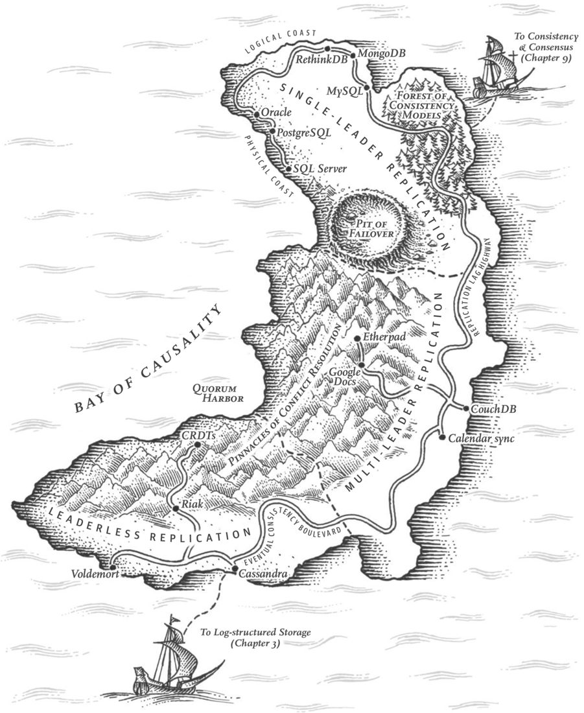

## CHAPTER 5 Replication

The major difference between a thing that might go wrong and a thing that cannot possibly go wrong is that when a thing that cannot possibly go wrong goes wrong it usually turns out to be impossible to get at or repair.

-Douglas Adams, Mostly Harmless (1992)

Replication means  keeping  a  copy  of  the  same  data  on  multiple  machines  that  are connected via a network. As discussed in the introduction to Part II, there are several reasons why you might want to replicate data:

- To keep data geographically close to your users (and thus reduce access latency)
- To allow  the  system  to  continue  working  even  if  some  of  its  parts  have  failed (and thus increase availability)
- To  scale  out  the  number  of  machines  that  can  serve  read  queries  (and  thus increase read throughput)

In this chapter we will assume that your dataset is so small that each machine can hold a copy of the entire dataset. In Chapter 6 we will relax that assumption and discuss partitioning ( sharding ) of datasets that are too big for a single machine. In later chapters we will discuss various kinds of faults that can occur in a replicated data system, and how to deal with them.

If the data that you're replicating does not change over time, then replication is easy: you just need to copy the data to every node once, and you're done. All of the difficulty  in  replication  lies  in  handling changes to  replicated  data,  and  that's  what  this chapter  is  about.  We  will  discuss  three  popular  algorithms  for  replicating  changes between nodes: single-leader , multi-leader ,  and leaderless replication. Almost all distributed databases use one of these three approaches. They all have various pros and cons, which we will examine in detail.

There are many trade-offs to consider with replication: for example, whether to use synchronous or asynchronous replication, and how to handle failed replicas. Those are often configuration options in databases, and although the details vary by database,  the  general  principles  are  similar  across  many  different  implementations.  We will discuss the consequences of such choices in this chapter.

Replication of databases is an old topic-the principles haven't changed much since they were studied in the 1970s [1], because the fundamental constraints of networks have remained the same. However, outside of research, many developers continued to assume for a long time that a database consisted of just one node. Mainstream use of distributed databases is more recent. Since many application developers are new to this  area,  there  has  been  a  lot  of  misunderstanding  around  issues  such  as eventual consistency . In 'Problems with Replication Lag' on page 53 we will get more precise about  eventual  consistency  and  discuss  things  like  the read-your-writes and monotonic reads guarantees.

## Leaders and Followers

Each node that stores a copy of the database is called a replica . With multiple replicas, a question inevitably arises: how do we ensure that all the data ends up on all the replicas?

Every write to the database needs to be processed by every replica; otherwise, the replicas would no longer contain the same data. The most common solution for this is called leader-based replication (also known as active/passive or master-slave replication ) and is illustrated in Figure 5-1. It works as follows:

1. One of the replicas is designated the leader (also known as master or primary ). When clients want to write to the database, they must send their requests to the leader, which first writes the new data to its local storage.
2. The other replicas are known as followers ( read replicas , slaves , secondaries , or hot standbys ). i Whenever the leader writes new data to its local storage, it also sends the data change to all of its followers as part of a replication log or change stream . Each follower takes the log from the leader and updates its local copy of the database accordingly, by applying all writes in the same order as they were processed on the leader.

i. Different people have different definitions for hot , warm , and cold standby servers. In PostgreSQL, for example, hot standby is used to refer to a replica that accepts reads from clients, whereas a warm standby processes changes from the leader but doesn't process any queries from clients. For purposes of this book, the difference isn't important.

User 1234

configures new profile picture

update users where user\_id = 1234

Leader replica

Replication streams

3. When a client wants to read from the database, it can query either the leader or any of the followers. However, writes are only accepted on the leader (the followers are read-only from the client's point of view).

old\_value:

me-old.jpg

User 2345

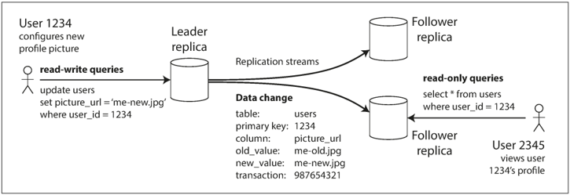

replica

Figure 5-1. Leader-based (master-slave) replication.

This mode of replication is a built-in feature of many relational databases, such as PostgreSQL  (since  version  9.0),  MySQL,  Oracle  Data  Guard  [2],  and  SQL  Server's AlwaysOn Availability Groups [3]. It is also used in some nonrelational databases, including MongoDB, RethinkDB, and Espresso [4]. Finally, leader-based replication is not restricted to only databases: distributed message brokers such as Kafka [5] and RabbitMQ  highly  available  queues  [6]  also  use  it.  Some  network  filesystems  and replicated block devices such as DRBD are similar.

## Synchronous Versus Asynchronous Replication

An important detail of a replicated system is whether the replication happens synchronously or asynchronously .  (In  relational  databases,  this  is  often  a  configurable option; other systems are often hardcoded to be either one or the other.)

Think about what happens in Figure 5-1, where the user of a website updates their profile image. At some point in time, the client sends the update request to the leader; shortly afterward, it is received by the leader. At some point, the leader forwards the data change to the followers. Eventually, the leader notifies the client that the update was successful.

Figure 5-2 shows the communication between various components of the system: the user's client, the leader, and two followers. Time flows from left to right. A request or response message is shown as a thick arrow.

Follower replica

User 1234

Leader

Follower 1

Follower 2

update users set picture\_url ='me-new.jpg'

where user\_id = 1234

time

- ·

Figure 5-2. Leader-based replication with one synchronous and one asynchronous follower.

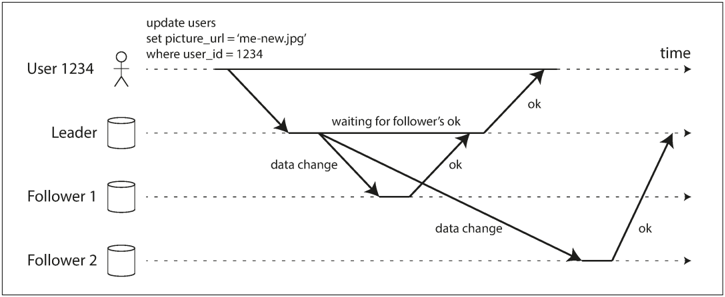

In the example of Figure 5-2, the replication to follower 1 is synchronous : the leader waits until follower 1 has confirmed that it received the write before reporting success to  the  user,  and  before  making the write visible to other clients. The replication to follower  2  is asynchronous :  the  leader  sends  the  message,  but  doesn't  wait  for  a response from the follower.

The diagram shows that there is a substantial delay before follower 2 processes the message. Normally, replication is quite fast: most database systems apply changes to followers in less than a second. However, there is no guarantee of how long it might take. There are circumstances when followers might fall behind the leader by several minutes or more; for example, if a follower is recovering from a failure, if the system is  operating near maximum capacity, or if there are network problems between the nodes.

The advantage of synchronous replication is that the follower is guaranteed to have an up-to-date copy of the data that is consistent with the leader. If the leader suddenly fails, we can be sure that the data is still available on the follower. The disadvantage is that if the synchronous follower doesn't respond (because it has crashed, or there is a network fault, or for any other reason), the write cannot be processed. The leader must block all writes and wait until the synchronous replica is available again.

For that reason, it is impracticable for all followers to be synchronous: any one node outage would cause the whole system to grind to a halt. In practice, if you enable synchronous replication on a database, it usually means that one of the followers is synchronous,  and  the  others  are  asynchronous.  If  the  synchronous  follower  becomes unavailable or slow, one of the asynchronous followers is made synchronous. This guarantees that you have an up-to-date copy of the data on at least two nodes: the

leader  and  one  synchronous  follower.  This  configuration  is  sometimes  also  called semi-synchronous [7].

Often, leader-based replication is configured to be completely asynchronous. In this case, if the leader fails and is not recoverable, any writes that have not yet been replicated to followers are lost. This means that a write is not guaranteed to be durable, even if it has been confirmed to the client. However, a fully asynchronous configuration has the advantage that the leader can continue processing writes, even if all of its followers have fallen behind.

Weakening durability may sound like a bad trade-off, but asynchronous replication is nevertheless  widely  used,  especially  if  there  are  many  followers  or  if  they  are  geographically  distributed.  We  will  return  to  this  issue  in  'Problems  with  Replication Lag' on page 53.

## Research on Replication

It can be a serious problem for asynchronously replicated systems to lose data if the leader fails, so researchers have continued investigating replication methods that do not lose data but still provide good performance and availability. For example, chain replication [8,  9]  is  a  variant  of  synchronous  replication  that  has  been  successfully implemented in a few systems such as Microsoft Azure Storage [10, 11].

There is a strong connection between consistency of replication and consensus (getting several nodes to agree on a value), and we will explore this area of theory in more detail in Chapter 9. In this chapter we will concentrate on the simpler forms of replication that are most commonly used in databases in practice.

## Setting Up New Followers

From time to time, you need to set up new followers-perhaps to increase the number of replicas, or to replace failed nodes. How do you ensure that the new follower has an accurate copy of the leader's data?

Simply copying data files from one node to another is typically not sufficient: clients are constantly writing to the database, and the data is always in flux, so a standard file copy would see different parts of the database at different points in time. The result might not make any sense.

You  could  make  the  files  on  disk  consistent  by  locking  the  database  (making  it unavailable for writes), but that would go against our goal of high availability. Fortunately,  setting  up  a  follower  can  usually  be  done  without  downtime.  Conceptually, the process looks like this:

1. Take a consistent snapshot of the leader's database at some point in time-if possible, without taking a lock on the entire database. Most databases have this feature,  as  it  is  also  required  for  backups.  In  some  cases,  third-party  tools  are needed, such as innobackupex for MySQL [12].
2. Copy the snapshot to the new follower node.
3. The follower connects to the leader and requests all the data changes that have happened since the snapshot was taken. This requires that the snapshot is associated with an exact position in the leader's replication log. That position has various  names:  for  example,  PostgreSQL  calls  it  the log  sequence  number ,  and MySQL calls it the binlog coordinates .
4. When the follower has processed the backlog of data changes since the snapshot, we say it has caught up .  It  can  now  continue to process data changes from the leader as they happen.

The practical  steps  of  setting  up  a  follower  vary  significantly  by  database.  In  some systems the process is fully automated, whereas in others it can be a somewhat arcane multi-step workflow that needs to be manually performed by an administrator.

## Handling Node Outages

Any node in the system can go down, perhaps unexpectedly due to a fault, but just as likely due to planned maintenance (for example, rebooting a machine to install a kernel security patch). Being able to reboot individual nodes without downtime is a big advantage for operations and maintenance. Thus, our goal is to keep the system as a whole running despite individual node failures, and to keep the impact of a node outage as small as possible.

How do you achieve high availability with leader-based replication?

## Follower failure: Catch-up recovery

On its local disk, each follower keeps a log of the data changes it has received from the leader. If a follower crashes and is restarted, or if the network between the leader and  the  follower  is  temporarily  interrupted,  the  follower  can  recover  quite  easily: from its log, it knows the last transaction that was processed before the fault occurred. Thus, the follower can connect to the leader and request all the data changes that occurred during the time when the follower was disconnected. When it has applied these changes, it has caught up to the leader and can continue receiving a stream of data changes as before.

## Leader failure: Failover

Handling a failure of the leader is trickier: one of the followers needs to be promoted to be the new leader, clients need to be reconfigured to send their writes to the new leader, and the other followers need to start consuming data changes from the new leader. This process is called failover .

Failover can happen manually (an administrator is notified that the leader has failed and takes the necessary steps to make a new leader) or automatically. An automatic failover process usually consists of the following steps:

1. Determining that the leader has failed. There are many things that could potentially  go  wrong: crashes, power outages, network issues, and more. There is no foolproof way of detecting what has gone wrong, so most systems simply use a timeout: nodes frequently bounce messages back and forth between each other, and if  a  node  doesn't  respond  for  some  period  of  time-say,  30  seconds-it  is assumed to be dead. (If the leader is deliberately taken down for planned maintenance, this doesn't apply.)
2. Choosing a new leader. This could be done through an election process (where the  leader  is  chosen  by  a  majority  of  the  remaining  replicas),  or  a  new  leader could be appointed by a previously elected controller node . The best candidate for leadership is usually the replica with the most up-to-date data changes from the old leader (to minimize any data loss). Getting all the nodes to agree on a new leader is a consensus problem, discussed in detail in Chapter 9.
3. Reconfiguring  the  system  to  use  the  new  leader. Clients  now  need  to  send their write requests to the new leader (we discuss this in Chapter 6). If the old leader comes back, it might still believe that it is the leader, not realizing that the other replicas have forced it to step down. The system needs to ensure that the old leader becomes a follower and recognizes the new leader.

Failover is fraught with things that can go wrong:

- If asynchronous replication is used, the new leader may not have received all the writes from the old leader before it failed. If the former leader rejoins the cluster after a new leader has been chosen, what should happen to those writes? The new leader may have received conflicting writes in the meantime. The most common solution is for the old leader's unreplicated writes to simply be discarded, which may violate clients' durability expectations.
- Discarding writes is especially dangerous if other storage systems outside of the database need to be coordinated with the database contents. For example, in one incident at GitHub [13], an out-of-date MySQL follower was promoted to leader. The database used an autoincrementing counter to assign primary keys to new rows,  but  because  the  new  leader's  counter  lagged  behind  the  old  leader's,  it

reused some primary keys that were previously assigned by the old leader. These primary keys were also used in a Redis store, so the reuse of primary keys resulted in inconsistency between MySQL and Redis, which caused some private data to be disclosed to the wrong users.

- In certain fault scenarios (see Chapter 8), it could happen that two nodes both believe that they are the leader. This situation is called split brain , and it is dangerous: if both leaders accept writes, and there is no process for resolving conflicts  (see  'Multi-Leader  Replication'  on  page  60),  data  is  likely  to  be  lost  or corrupted. As a safety catch, some systems have a mechanism to shut down one node  if  two  leaders  are  detected. ii However,  if  this  mechanism  is  not  carefully designed, you can end up with both nodes being shut down [14].
- What is the right timeout before the leader is declared dead? A longer timeout means a longer time to recovery in the case where the leader fails. However, if the timeout is too short, there could be unnecessary failovers. For example, a temporary load spike could cause a node's response time to increase above the timeout, or a network glitch could cause delayed packets. If the system is already struggling  with  high  load  or  network  problems,  an  unnecessary  failover  is  likely  to make the situation worse, not better.

There  are  no  easy  solutions  to  these  problems.  For  this  reason,  some  operations teams prefer to perform failovers manually, even if the software supports automatic failover.

These issues-node failures; unreliable networks; and trade-offs around replica consistency,  durability,  availability,  and  latency-are  in  fact  fundamental  problems  in distributed  systems.  In  Chapter  8  and  Chapter  9  we  will  discuss  them  in  greater depth.

## Implementation of Replication Logs

How does leader-based replication work under the hood? Several different replication methods are used in practice, so let's look at each one briefly.

## Statement-based replication

In the simplest case, the leader logs every write request ( statement )  that  it  executes and sends that statement log to its  followers.  For  a  relational  database,  this  means that every INSERT , UPDATE ,  or DELETE statement is forwarded to followers, and each follower  parses  and  executes  that  SQL  statement  as  if  it  had  been  received  from  a client.

ii. This approach is known as fencing or, more emphatically, Shoot The Other Node In The Head (STONITH). We will discuss fencing in more detail in 'The leader and the lock' on page 119.

Although this may sound reasonable, there are various ways in which this approach to replication can break down:

- Any statement that calls a nondeterministic function, such as NOW() to  get  the current date and time or RAND() to get a random number, is likely to generate a different value on each replica.
- If statements use an autoincrementing column, or if they depend on the existing data in the database (e.g., UPDATE … WHERE &lt;some condition&gt; ),  they  must  be executed in exactly the same order on each replica, or else they may have a different effect. This can be limiting when there are multiple concurrently executing transactions.
- Statements that have side effects (e.g., triggers, stored procedures, user-defined functions) may result in different side effects occurring on each replica, unless the side effects are absolutely deterministic.

It  is  possible  to  work  around those issues-for example, the leader can replace any nondeterministic function calls with a fixed return value when the statement is logged so that the followers all get the same value. However, because there are so many edge cases, other replication methods are now generally preferred.

Statement-based replication was used in MySQL before version 5.1. It is still sometimes used today, as it is quite compact, but by default MySQL now switches to rowbased replication (discussed shortly) if there is any nondeterminism in a statement. VoltDB uses statement-based replication, and makes it safe by requiring transactions to be deterministic [15].

## Write-ahead log (WAL) shipping

In Chapter 3 we discussed how storage engines represent data on disk, and we found that usually every write is appended to a log:

- In the case of a log-structured storage engine (see 'SSTables and LSM-Trees' on page 8), this log is the main place for storage. Log segments are compacted and garbage-collected in the background.
- In the case of a B-tree (see 'B-Trees' on page 11), which overwrites individual disk  blocks,  every  modification  is  first  written  to  a  write-ahead  log  so  that  the index can be restored to a consistent state after a crash.

In either case, the log is an append-only sequence of bytes containing all writes to the database. We can use the exact same log to build a replica on another node: besides writing  the  log  to  disk,  the  leader  also  sends  it  across  the  network  to  its  followers. When the follower processes this log, it builds a copy of the exact same data structures as found on the leader.

This method of replication is used in PostgreSQL and Oracle, among others [16]. The main disadvantage is that the log describes the data on a very low level: a WAL contains details of which bytes were changed in which disk blocks. This makes replication closely coupled to the storage engine. If the database changes its storage format from one version to another, it is typically not possible to run different versions of the database software on the leader and the followers.

That may seem like a minor implementation detail, but it can have a big operational impact. If the replication protocol allows the follower to use a newer software version than the leader, you can perform a zero-downtime upgrade of the database software by first upgrading the followers and then performing a failover to make one of the upgraded nodes the new leader. If the replication protocol does not allow this version mismatch, as is often the case with WAL shipping, such upgrades require downtime.

## Logical (row-based) log replication

An  alternative  is  to  use  different  log  formats  for  replication  and  for  the  storage engine,  which  allows  the  replication  log  to  be  decoupled  from  the  storage  engine internals. This kind of replication log is called a logical log , to distinguish it from the storage engine's ( physical ) data representation.

A  logical  log  for  a  relational  database  is  usually  a  sequence  of  records  describing writes to database tables at the granularity of a row:

- For an inserted row, the log contains the new values of all columns.
- For a deleted row, the log contains enough information to uniquely identify the row that was deleted. Typically this would be the primary key, but if there is no primary key on the table, the old values of all columns need to be logged.
- For an updated row, the log contains enough information to uniquely identify the updated row, and the new values of all columns (or at least the new values of all columns that changed).

A transaction that modifies several rows generates several such log records, followed by a record indicating that the transaction was committed. MySQL's binlog (when configured to use row-based replication) uses this approach [17].

Since a logical log is decoupled from the storage engine internals, it can more easily be kept backward compatible, allowing the leader and the follower to run different versions of the database software, or even different storage engines.

A logical log format is also easier for external applications to parse. This aspect is useful if you want to send the contents of a database to an external system, such as a data warehouse for offline analysis, or for building custom indexes and caches [18]. This technique is called change data capture , and we will return to it in Chapter 11.

## Trigger-based replication

The replication approaches described so far are implemented by the database system, without involving  any  application  code.  In  many  cases,  that's  what  you  want-but there are some circumstances where more flexibility is needed. For example, if you want  to  only  replicate  a  subset  of  the  data,  or  want  to  replicate  from  one  kind  of database  to  another,  or  if  you  need  conflict  resolution  logic  (see  'Handling  Write Conflicts' on page 63), then you may need to move replication up to the application layer.

Some tools, such as Oracle GoldenGate [19], can make data changes available to an application  by  reading  the  database  log.  An  alternative  is  to  use  features  that  are available in many relational databases: triggers and stored procedures .

A  trigger  lets  you  register  custom  application  code  that  is  automatically  executed when a data change (write transaction) occurs in a database system. The trigger has the opportunity to log this change into a separate table, from which it can be read by an external process. That external process can then apply any necessary application logic and replicate the data change to another system. Databus for Oracle [20] and Bucardo for Postgres [21] work like this, for example.

Trigger-based  replication  typically  has  greater  overheads  than  other  replication methods, and is more prone to bugs and limitations than the database's built-in replication. However, it can nevertheless be useful due to its flexibility.

## Problems with Replication Lag

Being  able  to  tolerate  node  failures  is  just  one  reason  for  wanting  replication.  As mentioned  in  the  introduction  to  Part  II,  other  reasons  are  scalability  (processing more requests than a single machine can handle) and latency (placing replicas geographically closer to users).

Leader-based  replication  requires  all  writes  to  go  through  a  single  node,  but  readonly queries can go to any replica. For workloads that consist of mostly reads and only a small percentage of writes (a common pattern on the web), there is an attractive option: create many followers, and distribute the read requests across those followers. This removes load from the leader and allows read requests to be served by nearby replicas.

In this read-scaling architecture, you can increase the capacity for serving read-only requests simply by adding more followers. However, this approach only realistically works with asynchronous replication-if you tried to synchronously replicate to all followers,  a  single  node  failure  or  network  outage  would  make  the  entire  system unavailable for writing. And the more nodes you have, the likelier it is that one will be down, so a fully synchronous configuration would be very unreliable.

Unfortunately, if an application reads from an asynchronous follower, it may see outdated information if the follower has fallen behind. This leads to apparent inconsistencies in the database: if you run the same query on the leader and a follower at the same time, you may get different results, because not all writes have been reflected in the follower. This inconsistency is just a temporary state-if you stop writing to the database and wait a while, the followers will eventually catch up and become consistent with the leader. For that reason, this effect is known as eventual consistency [22, 23]. iii

The term 'eventually' is deliberately vague: in general, there is no limit to how far a replica can fall behind. In normal operation, the delay between a write happening on the leader and being reflected on a follower-the replication lag -may be only a fraction of a second, and not noticeable in practice. However, if the system is operating near capacity or if there is a problem in the network, the lag can easily increase to several seconds or even minutes.

When the lag is so large, the inconsistencies it introduces are not just a theoretical issue but a real problem for applications. In this section we will highlight three examples  of  problems  that  are  likely  to  occur  when  there  is  replication  lag  and  outline some approaches to solving them.

## Reading Your Own Writes

Many applications let the user submit some data and then view what they have submitted. This might be a record in a customer database, or a comment on a discussion thread, or something else of that sort. When new data is submitted, it must be sent to the leader, but when the user views the data, it can be read from a follower. This is especially appropriate if data is frequently viewed but only occasionally written.

With asynchronous replication,  there  is  a  problem,  illustrated  in  Figure  5-3:  if  the user  views  the  data  shortly  after  making  a  write,  the  new  data  may  not  yet  have reached the replica. To the user, it looks as though the data they submitted was lost, so they will be understandably unhappy.

iii. The term eventual consistency was coined by Douglas Terry et al. [24], popularized by Werner Vogels [22], and became the battle cry of many NoSQL projects. However, not only NoSQL databases are eventually consistent: followers in an asynchronously replicated relational database have the same characteristics.

User 1234

Leader

Follower 1

Follower 2

10

insert into comments

(author, reply\_to, message)

values(1234, 55555, 'Sounds good!)

select * from comments where reply\_to = 55555

no results!

time

- ›

Figure 5-3. A user makes a write, followed by a read from a stale replica. To prevent this anomaly, we need read-after-write consistency.

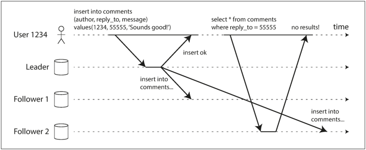

In this situation, we need read-after-write consistency , also known as read-your-writes consistency [24]. This is a guarantee that if the user reloads the page, they will always see any updates they submitted themselves. It makes no promises about other users: other users' updates may not be visible until some later time. However, it reassures the user that their own input has been saved correctly.

How can we implement read-after-write consistency in a system with leader-based replication? There are various possible techniques. To mention a few:

- When  reading  something  that  the  user  may  have  modified,  read  it  from  the leader; otherwise, read it from a follower. This requires that you have some way of  knowing  whether  something  might  have  been  modified,  without  actually querying  it.  For  example,  user  profile  information  on  a  social  network  is  normally only editable by the owner of the profile, not by anybody else. Thus, a simple  rule  is:  always  read  the  user's  own  profile  from  the  leader,  and  any  other users' profiles from a follower.
- If  most  things  in  the  application  are  potentially  editable  by  the  user,  that approach  won't  be  effective,  as  most  things  would  have  to  be  read  from  the leader (negating the benefit of read scaling). In that case, other criteria may be used to decide whether to read from the leader. For example, you could track the time of the last update and, for one minute after the last update, make all reads from the leader. You could also monitor the replication lag on followers and prevent queries on any follower that is more than one minute behind the leader.
- The client can remember the timestamp of its most recent write-then the system can ensure that the replica serving any reads for that user reflects updates at least until that timestamp. If a replica is not sufficiently up to date, either the read can  be  handled  by  another  replica  or  the  query  can  wait  until  the  replica  has

caught up. The timestamp could be a logical timestamp (something that indicates ordering of writes, such as the log sequence number) or the actual system clock (in  which  case  clock  synchronization  becomes  critical;  see  'Unreliable  Clocks' on page 105).

- If  your  replicas  are  distributed  across  multiple  datacenters  (for  geographical proximity to users or for availability), there is additional complexity. Any request that needs to be served by the leader must be routed to the datacenter that contains the leader.

Another complication arises when the same user is accessing your service from multiple devices, for example a desktop web browser and a mobile app. In this case you may want to provide cross-device read-after-write consistency: if the user enters some information on one device and then views it on another device, they should see the information they just entered.

In this case, there are some additional issues to consider:

- Approaches  that  require  remembering  the  timestamp  of  the  user's  last  update become more difficult,  because  the  code  running  on  one  device  doesn't  know what updates have happened on the other device. This metadata will need to be centralized.
- If your replicas are distributed across different datacenters, there is no guarantee that  connections  from  different  devices  will  be  routed  to  the  same  datacenter. (For example, if the user's desktop computer uses the home broadband connection and their mobile device uses the cellular data network, the devices' network routes may be completely different.) If your approach requires reading from the leader,  you  may  first  need  to  route  requests  from  all  of  a  user's  devices  to  the same datacenter.

## Monotonic Reads

Our second example of an anomaly that can occur when reading from asynchronous followers is that it's possible for a user to see things moving backward in time .

This can happen if a user makes several reads from different replicas. For example, Figure 5-4 shows user 2345 making the same query twice, first to a follower with little lag,  then  to  a  follower  with  greater  lag.  (This  scenario  is  quite  likely  if  the  user refreshes a web page, and each request is routed to a random server.) The first query returns  a  comment  that  was  recently  added  by  user  1234,  but  the  second  query doesn't return anything because the lagging follower has not yet picked up that write. In effect, the second query observes the system state at an earlier point in time than the first query. This wouldn't be so bad if the first query hadn't returned anything, because user 2345 probably wouldn't know that user 1234 had recently added a com-

User 1234

Leader

Follower 1

Follower 2

User 2345

^

insert into comments

(author, reply\_to, message)

values(1234, 55555, 'Sounds good!)

time

- ›

ment. However, it's very confusing for user 2345 if they first see user 1234's comment appear, and then see it disappear again.

insert into

Figure 5-4. A user first reads from a fresh replica, then from a stale replica. Time appears to go backward. To prevent this anomaly, we need monotonic reads.

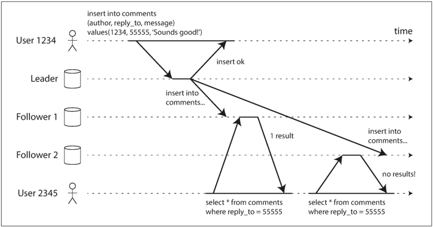

Monotonic reads [23] is a guarantee that this kind of anomaly does not happen. It's a lesser guarantee than strong consistency, but a stronger guarantee than eventual consistency. When you read data, you may see an old value; monotonic reads only means that if one user makes several reads in sequence, they will not see time go backwardi.e., they will not read older data after having previously read newer data.

One way of achieving monotonic reads is to make sure that each user always makes their reads from the same replica (different users can read from different replicas). For example, the replica can be chosen based on a hash of the user ID, rather than randomly. However, if that replica fails, the user's queries will need to be rerouted to another replica.

## Consistent Prefix Reads

Our third example of replication lag anomalies concerns violation of causality. Imagine the following short dialog between Mr. Poons and Mrs. Cake:

Mr. Poons

How far into the future can you see, Mrs. Cake?

Mrs. Cake

About ten seconds usually, Mr. Poons.

Mr. Poons

Partition 1

Leader

Partition 1

Follower

Mrs. Cake

Partition 2

Leader

Partition 2

Follower

Observer

"How far into the future can you see, Mrs. Cake?"

time

A

There  is  a  causal  dependency  between  those  two  sentences:  Mrs.  Cake  heard  Mr. Poons's question and answered it.

Now, imagine a third person is listening to this conversation through followers. The things said by Mrs. Cake go through a follower with little lag, but the things said by Mr. Poons have a longer replication lag (see Figure 5-5). This observer would hear the following:

## Mrs. Cake

About ten seconds usually, Mr. Poons.

## Mr. Poons

How far into the future can you see, Mrs. Cake?

To the observer it looks as though Mrs. Cake is answering the question before Mr. Poons has even asked it. Such psychic powers are impressive, but very confusing [25].

Figure 5-5. If some partitions are replicated slower than others, an observer may see the answer before they see the question.

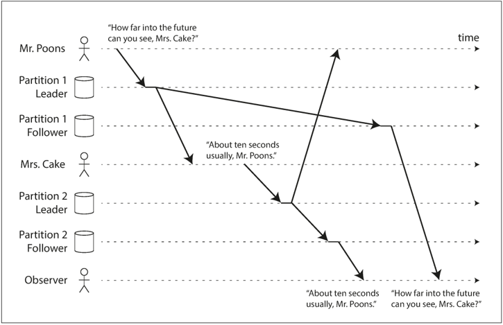

Preventing this kind of anomaly requires another type of guarantee: consistent prefix reads [23]. This guarantee says that if a sequence of writes happens in a certain order, then anyone reading those writes will see them appear in the same order.

This is a particular problem in partitioned (sharded) databases, which we will discuss in Chapter 6. If the database always applies writes in the same order, reads always see a  consistent  prefix,  so  this  anomaly  cannot  happen.  However,  in  many  distributed

databases, different partitions operate independently, so there is no global ordering of writes: when a user reads from the database, they may see some parts of the database in an older state and some in a newer state.

One solution is to make sure that any writes that are causally related to each other are written  to  the  same  partition-but  in  some  applications  that  cannot  be  done  efficiently. There are also algorithms that explicitly keep track of causal dependencies, a topic that we will return to in 'The 'happens-before' relationship and concurrency' on page 78.

## Solutions for Replication Lag

When working with an eventually consistent system, it is worth thinking about how the  application  behaves  if  the  replication  lag  increases  to  several  minutes  or  even hours. If the answer is 'no problem,' that's great. However, if the result is a bad experience for users, it's important to design the system to provide a stronger guarantee, such as read-after-write. Pretending that replication is synchronous when in fact it is asynchronous is a recipe for problems down the line.

As discussed earlier, there are ways in which an application can provide a stronger guarantee than the underlying database-for example, by performing certain kinds of reads on the leader. However, dealing with these issues in application code is complex and easy to get wrong.

It would be better if application developers didn't have to worry about subtle replication issues and could just trust their databases to 'do the right thing.' This is why transactions exist: they are a way for a database to provide stronger guarantees so that the application can be simpler.

Single-node transactions have existed for a long time. However, in the move to distributed (replicated and partitioned) databases, many systems have abandoned them, claiming that transactions are too expensive in terms of performance and availability, and  asserting  that  eventual  consistency  is  inevitable  in  a  scalable  system.  There  is some truth in that statement, but it is overly simplistic, and we will develop a more nuanced view over the course of the rest of this book. We will return to the topic of transactions in Chapters 7 and 9, and we will discuss some alternative mechanisms in Part III.

## Multi-Leader Replication

So far in this chapter we have only considered replication architectures using a single leader. Although that is a common approach, there are interesting alternatives.

Leader-based replication has one major downside: there is only one leader, and all writes  must  go  through  it. iv If  you  can't  connect  to  the  leader  for  any  reason,  for example due to a network interruption between you and the leader, you can't write to the database.

A natural extension of the leader-based replication model is to allow more than one node to accept writes. Replication still happens in the same way: each node that processes  a  write  must  forward  that  data  change  to  all  the  other  nodes.  We  call  this  a multi-leader configuration (also known as master-master or active/active replication ). In this setup, each leader simultaneously acts as a follower to the other leaders.

## Use Cases for Multi-Leader Replication

It rarely makes sense to use a multi-leader setup within a single datacenter, because the  benefits  rarely  outweigh  the  added  complexity.  However,  there  are  some  situations in which this configuration is reasonable.

## Multi-datacenter operation

Imagine you have a database with replicas in several different datacenters (perhaps so that you can tolerate failure of an entire datacenter, or perhaps in order to be closer to your users). With a normal leader-based replication setup, the leader has to be in one of the datacenters, and all writes must go through that datacenter.

In a multi-leader configuration, you can have a leader in each datacenter. Figure 5-6 shows what this architecture might look like. Within each datacenter, regular leaderfollower replication is used; between datacenters, each datacenter's leader replicates its changes to the leaders in other datacenters.

iv. If the database is partitioned (see Chapter 6), each partition has one leader. Different partitions may have their leaders on different nodes, but each partition must nevertheless have one leader node.

conflict resolution

leader read-write

queries

Datacenter 1!

Datacenter 2

conflict resolution

Figure 5-6. Multi-leader replication across multiple datacenters.

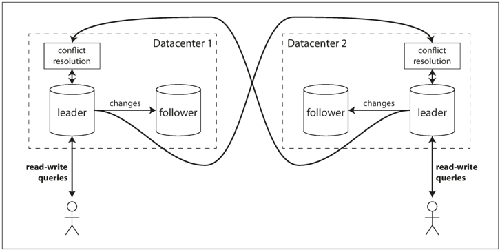

Let's compare how the single-leader and multi-leader configurations fare in a multidatacenter deployment:

Performance

In  a  single-leader  configuration,  every  write  must  go  over  the  internet  to  the datacenter with the leader. This can add significant latency to writes and might contravene  the  purpose  of  having  multiple  datacenters  in  the  first  place.  In  a multi-leader configuration, every write can be processed in the local datacenter and  is  replicated  asynchronously  to  the  other  datacenters.  Thus,  the  interdatacenter network delay is hidden from users, which means the perceived performance may be better.

## Tolerance of datacenter outages

In  a  single-leader  configuration,  if  the  datacenter  with  the  leader  fails,  failover can promote a follower in another datacenter to be leader. In a multi-leader configuration, each datacenter can continue operating independently of the others, and replication catches up when the failed datacenter comes back online.

## Tolerance of network problems

Traffic between datacenters usually goes over the public internet, which may be less reliable than the local network within a datacenter. A single-leader configuration is very sensitive to problems in this inter-datacenter link, because writes are made synchronously over this link. A multi-leader configuration with asynchronous replication can usually tolerate network problems better: a temporary network interruption does not prevent writes being processed.

Some databases  support  multi-leader  configurations  by  default,  but  it  is  also  often implemented with external tools, such as Tungsten Replicator for MySQL [26], BDR for PostgreSQL [27], and GoldenGate for Oracle [19].

Although  multi-leader  replication  has  advantages,  it  also  has  a  big  downside:  the same data may be concurrently modified in two different datacenters, and those write conflicts must be resolved (indicated as 'conflict resolution' in Figure 5-6). We will discuss this issue in 'Handling Write Conflicts' on page 63.

As multi-leader replication is a somewhat retrofitted feature in many databases, there are often subtle configuration pitfalls and surprising interactions with other database features. For example, autoincrementing keys, triggers, and integrity constraints can be problematic. For this reason, multi-leader replication is often considered dangerous territory that should be avoided if possible [28].

## Clients with offline operation

Another situation in which multi-leader replication is appropriate is if you have an application that needs to continue to work while it is disconnected from the internet.

For  example,  consider  the  calendar  apps  on  your  mobile  phone,  your  laptop,  and other  devices.  You  need  to  be  able  to  see  your  meetings  (make  read  requests)  and enter  new  meetings  (make  write  requests)  at  any  time,  regardless  of  whether  your device currently has an internet connection. If you make any changes while you are offline, they need to be synced with a server and your other devices when the device is next online.

In this  case,  every  device  has  a  local  database  that  acts  as  a  leader  (it  accepts  write requests),  and  there  is  an  asynchronous  multi-leader  replication  process  (sync) between the replicas of your calendar on all of your devices. The replication lag may be hours or even days, depending on when you have internet access available.

From an architectural point of view, this setup is essentially the same as multi-leader replication between datacenters, taken to the extreme: each device is a 'datacenter,' and the network connection between them is extremely unreliable. As the rich history of broken calendar sync implementations demonstrates, multi-leader replication is a tricky thing to get right.

There are tools that aim to make this kind of multi-leader configuration easier. For example, CouchDB is designed for this mode of operation [29].

## Collaborative editing

Real-time collaborative editing applications allow several people to edit a document simultaneously.  For  example,  Etherpad  [30]  and  Google  Docs  [31]  allow  multiple people to concurrently edit a text document or spreadsheet (the algorithm is briefly discussed in 'Automatic Conflict Resolution' on page 66).

User 1

Leader 1

Leader 2

User 2

initially, there is a update pages

set title =B'

where id =123

ok time

- ›

conflict: can't change title from A to C,

We don't usually think of collaborative editing as a database replication problem, but it has a lot in common with the previously mentioned offline editing use case. When one user edits a document, the changes are instantly applied to their local replica (the state of the document in their web browser or client application) and asynchronously replicated to the server and any other users who are editing the same document.

If you want to guarantee that there will be no editing conflicts, the application must obtain a lock on the document before a user can edit it. If another user wants to edit the same document, they first have to wait until the first user has committed their changes and released the lock. This collaboration model is equivalent to single-leader replication with transactions on the leader.

However,  for  faster  collaboration,  you  may  want  to  make  the  unit  of  change  very small (e.g., a single keystroke) and avoid locking. This approach allows multiple users to edit simultaneously, but it also brings all the challenges of multi-leader replication, including requiring conflict resolution [32].

## Handling Write Conflicts

The biggest problem with multi-leader replication is that write conflicts can occur, which means that conflict resolution is required.

For example, consider a wiki page that is simultaneously being edited by two users, as shown in Figure 5-7. User 1 changes the title of the page from A to B, and user 2 changes  the  title  from  A  to  C  at  the  same  time.  Each  user's  change  is  successfully applied to their local leader. However, when the changes are asynchronously replicated, a conflict is detected [33]. This problem does not occur in a single-leader database.

Figure 5-7. A write conflict caused by two leaders concurrently updating the same record.

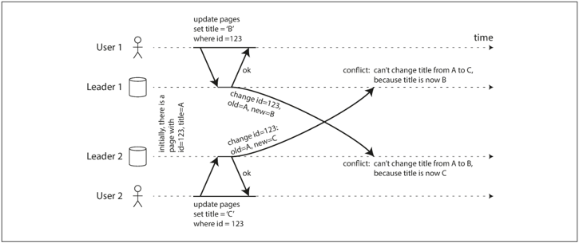

## Synchronous versus asynchronous conflict detection

In a single-leader database, the second writer will either block and wait for the first write to complete, or abort the second write transaction, forcing the user to retry the write. On the other hand, in a multi-leader setup, both writes are successful, and the conflict is only detected asynchronously at some later point in time. At that time, it may be too late to ask the user to resolve the conflict.

In  principle,  you  could  make  the  conflict  detection  synchronous-i.e.,  wait  for  the write to be replicated to all replicas before telling the user that the write was successful. However, by doing so, you would lose the main advantage of multi-leader replication: allowing each replica to accept writes independently. If you want synchronous conflict detection, you might as well just use single-leader replication.

## Conflict avoidance

The simplest strategy for dealing with conflicts is to avoid them: if the application can ensure that all writes for a particular record go through the same leader, then conflicts  cannot occur. Since many implementations of multi-leader replication handle conflicts quite poorly, avoiding conflicts is a frequently recommended approach [34].

For example, in an application where a user can edit their own data, you can ensure that requests from a particular user are always routed to the same datacenter and use the leader in that datacenter for reading and writing. Different users may have different 'home' datacenters (perhaps picked based on geographic proximity to the user), but from any one user's point of view the configuration is essentially single-leader.

However, sometimes you might want to change the designated leader for a recordperhaps because one datacenter has failed and you need to reroute traffic to another datacenter, or perhaps because a user has moved to a different location and is now closer to a different datacenter. In this situation, conflict avoidance breaks down, and you have to deal with the possibility of concurrent writes on different leaders.

## Converging toward a consistent state

A  single-leader  database  applies  writes  in  a  sequential  order:  if  there  are  several updates to the same field, the last write determines the final value of the field.

In a multi-leader configuration, there is no defined ordering of writes, so it's not clear what the final value should be. In Figure 5-7, at leader 1 the title is first updated to B and then to C; at leader 2 it is first updated to C and then to B. Neither order is 'more correct' than the other.

If each replica simply applied writes in the order that it saw the writes, the database would end up in an inconsistent state: the final value would be C at leader 1 and B at leader 2. That is not acceptable-every replication system must ensure that the data is eventually the same in all replicas. Thus, the database must resolve the conflict in a

convergent way,  which  means  that  all  replicas  must  arrive  at  the  same  final  value when all changes have been replicated.

There are various ways of achieving convergent conflict resolution:

- Give each write a unique ID (e.g., a timestamp, a long random number, a UUID, or a hash of the key and value), pick the write with the highest ID as the winner , and throw away the other writes. If a timestamp is used, this technique is known as last write wins (LWW). Although this approach is popular, it is dangerously prone to data loss [35]. We will discuss LWW in more detail at the end of this chapter ('Detecting Concurrent Writes' on page 76).
- Give  each  replica  a  unique  ID,  and  let  writes  that  originated  at  a  highernumbered replica always take precedence over writes that originated at a lowernumbered replica. This approach also implies data loss.
- Somehow merge the values together-e.g.,  order  them  alphabetically  and  then concatenate  them  (in  Figure  5-7,  the  merged  title  might  be  something  like 'B/C').
- Record the conflict in an explicit  data  structure  that  preserves  all  information, and write application code that resolves the conflict at some later time (perhaps by prompting the user).

## Custom conflict resolution logic

As the most appropriate way of resolving a conflict may depend on the application, most multi-leader replication tools let you write conflict resolution logic using application code. That code may be executed on write or on read:

On write

As soon as the database system detects a conflict in the log of replicated changes, it calls the conflict handler. For example, Bucardo allows you to write a snippet of Perl for this purpose. This handler typically cannot prompt a user-it runs in a background process and it must execute quickly.

On read

When a conflict is detected, all the conflicting writes are stored. The next time the data is read, these multiple versions of the data are returned to the application. The application may prompt the user or automatically resolve the conflict, and write the result back to the database. CouchDB works this way, for example.

Note that conflict resolution usually applies at the level of an individual row or document, not for an entire transaction [36]. Thus, if you have a transaction that atomically  makes  several  different  writes  (see  Chapter  7),  each  write  is  still  considered separately for the purposes of conflict resolution.

## Automatic Conflict Resolution

Conflict resolution rules can quickly become complicated, and custom code can be error-prone. Amazon is a frequently cited example of surprising effects due to a conflict resolution handler: for some time, the conflict resolution logic on the shopping cart  would  preserve  items  added  to  the  cart,  but  not  items  removed  from  the  cart. Thus, customers would sometimes see items reappearing in their carts even though they had previously been removed [37].

There  has  been  some  interesting  research  into  automatically  resolving  conflicts caused by concurrent data modifications. A few lines of research are worth mentioning:

- Conflict-free replicated datatypes (CRDTs) [32, 38] are a family of data structures for sets, maps (dictionaries), ordered lists, counters, etc. that can be concurrently edited  by  multiple  users,  and  which  automatically  resolve  conflicts  in  sensible ways. Some CRDTs have been implemented in Riak 2.0 [39, 40].
- Mergeable persistent data structures [41] track history explicitly, similarly to the Git version control system, and use a three-way merge function (whereas CRDTs use two-way merges).
- Operational transformation [42] is the conflict resolution algorithm behind collaborative editing applications such as Etherpad [30] and Google Docs [31]. It was designed particularly for concurrent editing of an ordered list of items, such as the list of characters that constitute a text document.

Implementations of these algorithms in databases are still young, but it's likely that they  will  be  integrated  into  more  replicated  data  systems  in  the  future.  Automatic conflict resolution could make multi-leader data synchronization much simpler for applications to deal with.

## What is a conflict?

Some kinds of conflict are obvious. In the example in Figure 5-7, two writes concurrently modified the same field in the same record, setting it to two different values. There is little doubt that this is a conflict.

Other kinds of conflict can be more subtle to detect. For example, consider a meeting room booking system: it tracks which room is booked by which group of people at which time. This application needs to ensure that each room is only booked by one group of people at any one time (i.e., there must not be any overlapping bookings for the same room). In this case, a conflict may arise if two different bookings are created for the same room at the same time. Even if the application checks availability before

allowing a user to make a booking, there can be a conflict if the two bookings are made on two different leaders.

There isn't a quick ready-made answer, but in the following chapters we will trace a path toward a good understanding of this problem. We will see some more examples of conflicts in Chapter 7, and in Chapter 12 we will discuss scalable approaches for detecting and resolving conflicts in a replicated system.

## Multi-Leader Replication Topologies

A replication  topology describes  the  communication  paths  along  which  writes  are propagated from one node to another. If you have two leaders,  like  in  Figure  5-7, there is only one plausible topology: leader 1 must send all of its writes to leader 2, and vice versa. With more than two leaders, various different topologies are possible. Some examples are illustrated in Figure 5-8.

Figure 5-8. Three example topologies in which multi-leader replication can be set up.

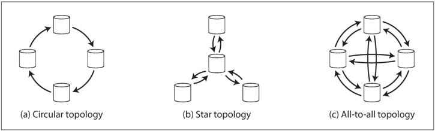

The most general topology is all-to-all (Figure 5-8 [c]), in which every leader sends its writes to every other leader. However, more restricted topologies are also used: for example,  MySQL  by  default  supports  only  a circular  topology [34],  in  which  each node receives writes from one node and forwards those writes (plus any writes of its own) to one other node. Another popular topology has the shape of a star : v one designated root node forwards writes to all of the other nodes. The star topology can be generalized to a tree.

In circular and star topologies, a write may need to pass through several nodes before it  reaches  all  replicas.  Therefore,  nodes  need  to  forward  data  changes  they  receive from other nodes. To prevent infinite replication loops, each node is given a unique identifier, and in the replication log, each write is tagged with the identifiers of all the nodes it has passed through [43]. When a node receives a data change that is tagged

v. Not to be confused with a star schema (see 'Stars and Snowflakes: Schemas for Analytics' on page 25), which describes the structure of a data model, not the communication topology between nodes.

Client A

Leader 1

Leader 2

Leader 3

Client B

U

insert into data

(key, value)

values ('×', 1)

time with its own identifier, that data change is ignored, because the node knows that it has already been processed.

A problem with circular and star topologies is that if just one node fails, it can interrupt the flow of replication messages between other nodes, causing them to be unable to communicate until the node is fixed. The topology could be reconfigured to work around the failed node, but in most deployments such reconfiguration would have to be done manually. The fault tolerance of a more densely connected topology (such as all-to-all) is better because it allows messages to travel along different paths, avoiding a single point of failure.

On the other hand, all-to-all topologies can have issues too. In particular, some network links may be faster than others (e.g., due to network congestion), with the result that some replication messages may 'overtake' others, as illustrated in Figure 5-9.

Figure 5-9. With multi-leader replication, writes may arrive in the wrong order at some replicas.

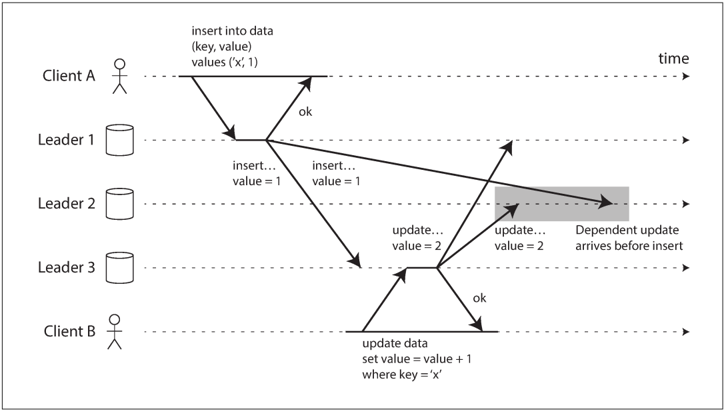

In Figure 5-9, client A inserts a row into a table on leader 1, and client B updates that row on leader 3. However, leader 2 may receive the writes in a different order: it may first receive the update (which, from its point of view, is an update to a row that does not  exist  in  the  database)  and  only  later  receive  the  corresponding  insert  (which should have preceded the update).

This is a problem of causality, similar to the one we saw in 'Consistent Prefix Reads' on page 57: the update depends on the prior insert, so we need to make sure that all nodes process the insert first, and then the update. Simply attaching a timestamp to

every write is not sufficient, because clocks cannot be trusted to be sufficiently in sync to correctly order these events at leader 2 (see Chapter 8).

To order these events correctly, a technique called version vectors can be used, which we will discuss later in this chapter (see 'Detecting Concurrent Writes' on page 76). However, conflict detection techniques are poorly implemented in many multi-leader replication systems. For example, at the time of writing, PostgreSQL BDR does not provide causal ordering of writes [27], and Tungsten Replicator for MySQL doesn't even try to detect conflicts [34].

If  you  are  using  a  system  with  multi-leader  replication,  it  is  worth  being  aware  of these issues, carefully reading the documentation, and thoroughly testing your database to ensure that it really does provide the guarantees you believe it to have.

## Leaderless Replication

The replication  approaches  we  have  discussed  so  far  in  this  chapter-single-leader and multi-leader replication-are based on the idea that a client sends a write request to one node (the leader), and the database system takes care of copying that write to the other replicas. A leader determines the order in which writes should be processed, and followers apply the leader's writes in the same order.

Some data storage systems take a different approach, abandoning the concept of a leader and allowing any replica to directly accept writes from clients. Some of the earliest replicated data systems were leaderless [1, 44], but the idea was mostly forgotten during the era of dominance of relational databases. It once again became a fashionable architecture for databases after Amazon used it for its in-house Dynamo system [37]. vi Riak,  Cassandra,  and  Voldemort  are  open  source  datastores  with  leaderless replication  models  inspired  by  Dynamo,  so  this  kind  of  database  is  also  known  as Dynamo-style .

In some leaderless implementations, the client directly sends its writes to several replicas, while in others, a coordinator node does this on behalf of the client. However, unlike a leader database, that coordinator does not enforce a particular ordering of writes. As we shall see, this difference in design has profound consequences for the way the database is used.

## Writing to the Database When a Node Is Down

Imagine you have a database with three replicas, and one of the replicas is currently unavailable-perhaps it is being rebooted to install a system update. In a leader-based

vi. Dynamo is not available to users outside of Amazon. Confusingly, AWS offers a hosted database product called DynamoDB , which uses a completely different architecture: it is based on single-leader replication.

User 1234

Replica 1

Replica 2

Replica 3

User 2345

set key = users.1234.picture\_url value = me-new.jpg'

time

- ›

configuration, if you want to continue processing writes, you may need to perform a failover (see 'Handling Node Outages' on page 48). A

On the other hand, in a leaderless configuration, failover does not exist. Figure 5-10 shows what happens: the client (user 1234) sends the write to all three replicas in parallel, and the two available replicas accept the write but the unavailable replica misses it. Let's say that it's sufficient for two out of three replicas to acknowledge the write: after user 1234 has received two ok responses, we consider the write to be successful. The client simply ignores the fact that one of the replicas missed the write.

Figure 5-10. A quorum write, quorum read, and read repair after a node outage.

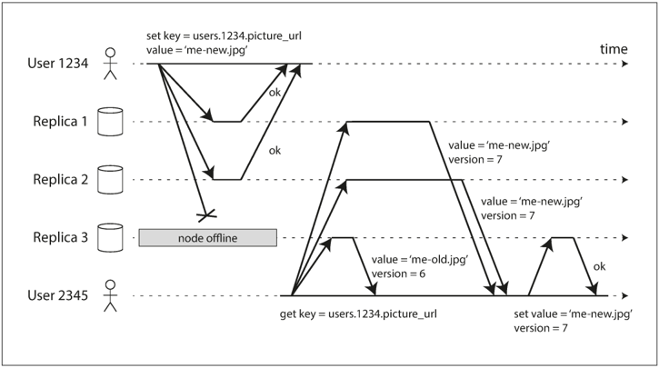

Now imagine that the unavailable node comes back online, and clients start reading from it. Any writes that happened while the node was down are missing from that node.  Thus,  if  you  read  from  that  node,  you  may  get stale (outdated)  values  as responses.

To solve that problem, when a client reads from the database, it doesn't just send its request to one replica: read requests are also sent to several nodes in parallel . The client may get different responses from different nodes; i.e., the up-to-date value from one  node  and  a  stale  value  from  another.  Version  numbers  are  used  to  determine which value is newer (see 'Detecting Concurrent Writes' on page 76).

## Read repair and anti-entropy

The replication system should ensure that eventually all the data is copied to every replica.  After  an  unavailable  node  comes back online, how does it catch up on the writes that it missed?

Two mechanisms are often used in Dynamo-style datastores:

Read repair

When a client makes a read from several nodes in parallel, it can detect any stale responses. For example, in Figure 5-10, user 2345 gets a version 6 value from replica 3 and a version 7 value from replicas 1 and 2. The client sees that replica 3 has a stale value and writes the newer value back to that replica. This approach works well for values that are frequently read.

Anti-entropy process

In addition, some datastores have a background process that constantly looks for differences  in  the  data  between  replicas  and  copies  any  missing  data  from  one replica  to  another.  Unlike  the  replication  log  in  leader-based  replication,  this anti-entropy process does not copy writes in any particular order, and there may be a significant delay before data is copied.

Not all systems implement both of these; for example, Voldemort currently does not have an anti-entropy process. Note that without an anti-entropy process, values that are rarely read may be missing from some replicas and thus have reduced durability, because read repair is only performed when a value is read by the application.

## Quorums for reading and writing

In the example of Figure 5-10, we considered the write to be successful even though it was only processed on two out of three replicas. What if only one out of three replicas accepted the write? How far can we push this?

If we know that every successful write is guaranteed to be present on at least two out of three replicas, that means at most one replica can be stale. Thus, if we read from at least two replicas, we can be sure that at least one of the two is up to date. If the third replica is down or slow to respond, reads can nevertheless continue returning an upto-date value.

More generally, if there are n replicas, every write must be confirmed by w nodes to be considered successful, and we must query at least r nodes for each read. (In our example, n =  3, w =  2, r =  2.)  As long as w + r &gt; n ,  we expect to get an up-to-date value when reading, because at least one of the r nodes we're reading from must be up to date. Reads and writes that obey these r and w values are called quorum reads and writes [44]. vii You can think of r and w as the minimum number of votes required for the read or write to be valid.

vii. Sometimes this kind of quorum is called a strict quorum , to contrast with sloppy quorums (discussed in 'Sloppy Quorums and Hinted Handoff' on page 75).

write w = 3

successful writes

n = 5 replicas

In Dynamo-style databases, the parameters n , w ,  and r are typically configurable. A common choice is to make n an  odd  number (typically 3 or 5) and to set w = r = ( n +  1)  /  2  (rounded  up).  However,  you  can  vary  the  numbers  as  you  see  fit.  For example, a workload with few writes and many reads may benefit from setting w = n and r = 1. This makes reads faster, but has the disadvantage that just one failed node causes all database writes to fail.


There may be more than n nodes in the cluster, but any given value is stored only on n nodes. This allows the dataset to be partitioned, supporting datasets that are larger than you can fit on one node. We will return to partitioning in Chapter 6.

The quorum condition, w + r &gt; n , allows the system to tolerate unavailable nodes as follows:

- If w &lt; n , we can still process writes if a node is unavailable.
- If r &lt; n , we can still process reads if a node is unavailable.
- With n = 3, w = 2, r = 2 we can tolerate one unavailable node.
- With n = 5, w = 3, r = 3 we can tolerate two unavailable nodes. This case is illustrated in Figure 5-11.
- Normally,  reads  and  writes  are  always  sent  to  all n replicas  in  parallel.  The parameters w and r determine how many nodes we wait for-i.e., how many of the n nodes need to report success before we consider the read or write to be successful.

Figure 5-11. If w + r &gt; n, at least one of the r replicas you read from must have seen the most recent successful write.

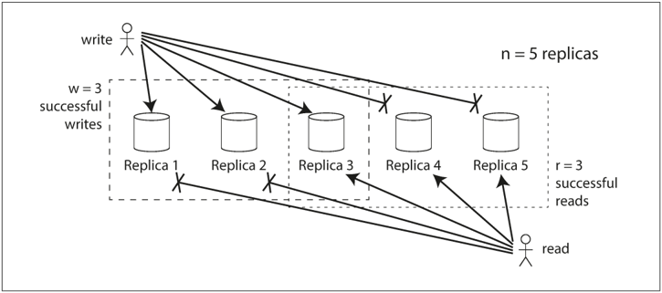

If fewer than the required w or r nodes are available, writes or reads return an error. A node could be unavailable for many reasons: because the node is down (crashed, powered down), due to an error executing the operation (can't write because the disk is  full),  due  to  a  network  interruption  between  the  client  and  the  node,  or  for  any number  of  other  reasons.  We  only  care  whether  the  node  returned  a  successful response and don't need to distinguish between different kinds of fault.

## Limitations of Quorum Consistency

If you have n replicas, and you choose w and r such that w + r &gt; n , you can generally expect every read to return the most recent value written for a key. This is the case because the set of nodes to which you've written and the set of nodes from which you've read must overlap. That is, among the nodes you read there must be at least one node with the latest value (illustrated in Figure 5-11).

Often, r and w are  chosen to be a majority (more than n /2) of nodes, because that ensures w + r &gt; n while still tolerating up to n /2 (rounded down) node failures. But quorums are not necessarily majorities-it only matters that the sets of nodes used by the  read  and  write  operations  overlap  in  at  least  one  node.  Other  quorum  assignments are possible,  which  allows  some  flexibility  in  the  design  of  distributed  algorithms [45].

You may also set w and r to smaller numbers, so that w + r ≤ n (i.e., the quorum condition is not satisfied). In this case, reads and writes will still be sent to n nodes, but a smaller number of successful responses is required for the operation to succeed.

With a smaller w and r you  are  more  likely  to  read  stale  values,  because  it's  more likely that your read didn't include the node with the latest value. On the upside, this configuration allows lower latency and higher availability: if there is a network interruption and many replicas become unreachable, there's a higher chance that you can continue  processing  reads  and  writes.  Only  after  the  number  of  reachable  replicas falls  below w or r does  the  database  become  unavailable  for  writing  or  reading, respectively.

However, even with w + r &gt; n , there are likely to be edge cases where stale values are returned. These depend on the implementation, but possible scenarios include:

- If a sloppy quorum is used (see 'Sloppy Quorums and Hinted Handoff' on page 75), the w writes may end up on different nodes than the r reads, so there is no longer a guaranteed overlap between the r nodes and the w nodes [46].
- If two writes occur concurrently, it is not clear which one happened first. In this case,  the  only  safe  solution  is  to  merge  the  concurrent  writes  (see  'Handling Write Conflicts' on page 63). If a winner is picked based on a timestamp (last write wins), writes can be lost due to clock skew [35]. We will return to this topic in 'Detecting Concurrent Writes' on page 76.

- If a write happens concurrently with a read, the write may be reflected on only some of the replicas. In this case, it's undetermined whether the read returns the old or the new value.
- If a write succeeded on some replicas but failed on others (for example because the disks on some nodes are full), and overall succeeded on fewer than w replicas, it is not rolled back on the replicas where it succeeded. This means that if a write was reported as failed, subsequent reads may or may not return the value from that write [47].
- If a node carrying a new value fails, and its data is restored from a replica carrying an old value, the number of replicas storing the new value may fall below w , breaking the quorum condition.
- Even if everything is working correctly, there are edge cases in which you can get unlucky with the timing, as we shall see in Chapter 9.

Thus, although quorums appear to guarantee that a read returns the latest written value, in practice it is not so simple. Dynamo-style databases are generally optimized for use cases that can tolerate eventual consistency. The parameters w and r allow you to adjust the probability of stale values being read, but it's wise to not take them as absolute guarantees.

In particular, you usually do not get the guarantees discussed in 'Problems with Replication Lag' on page 53 (reading your writes, monotonic reads, or consistent prefix reads),  so  the  previously  mentioned  anomalies  can  occur  in  applications.  Stronger guarantees generally require transactions or consensus. We will return to these topics in Chapter 7 and Chapter 9.

## Monitoring staleness

From an operational perspective, it's important to monitor whether your databases are returning up-to-date results. Even if your application can tolerate stale reads, you need to be aware of the health of your replication. If it falls behind significantly, it should alert you so that you can investigate the cause (for example, a problem in the network or an overloaded node).

For leader-based replication, the database typically exposes metrics for the replication lag, which you can feed into a monitoring system. This is possible because writes are applied to the leader and to followers in the same order, and each node has a position in the replication log (the number of writes it has applied locally). By subtracting a follower's current position from the leader's current position, you can measure the amount of replication lag.

However,  in  systems  with  leaderless  replication,  there  is  no  fixed  order  in  which writes are applied, which makes monitoring more difficult. Moreover, if the database only uses read repair (no anti-entropy), there is no limit to how old a value might be

-if a  value  is  only  infrequently  read,  the  value  returned  by  a  stale  replica  may  be ancient.

There has been some research on measuring replica staleness in databases with leaderless replication and predicting the expected percentage of stale reads depending on the parameters n , w , and r [48]. This is unfortunately not yet common practice, but it would be good to include staleness measurements in the standard set of metrics for databases. Eventual consistency is a deliberately vague guarantee, but for operability it's important to be able to quantify 'eventual.'

## Sloppy Quorums and Hinted Handoff

Databases with appropriately configured quorums can tolerate the failure of individual nodes without the need for failover. They can also tolerate individual nodes going slow  (e.g.  due  to  overload),  because  requests  don't  have  to  wait  for  all n nodes  to respond-they can return when w or r nodes have responded. These characteristics make databases with leaderless replication appealing for use cases that require high availability and low latency, and that can tolerate occasional stale reads.

However, quorums (as described so far) are not as fault-tolerant as they could be. A network  interruption  can  easily  cut  off  a  client  from  a  large  number  of  database nodes. Although those nodes are alive, and other clients may be able to connect to them, to a client that is cut off from the database nodes, they might as well be dead. In this situation, it's likely that fewer than w or r reachable nodes remain, so the client can no longer reach a quorum.

In a large cluster (with significantly more than n nodes) it's likely that the client can connect  to some database  nodes  during  the  network  interruption,  just  not  to  the nodes that it needs to assemble a quorum for a particular value. In that case, database designers face a trade-off:

- Is it better to return errors to all requests for which we cannot reach a quorum of w or r nodes?
- Or  should  we  accept  writes  anyway,  and  write  them  to  some  nodes  that  are reachable but aren't among the n nodes on which the value usually lives?

The latter is known as a sloppy quorum [37]:  writes  and  reads  still  require w and r successful responses, but those may include nodes that are not among the designated n 'home' nodes for a value. By analogy, if you lock yourself out of your house, you may knock on the neighbor's door and ask whether you may stay on their couch temporarily.

Once  the  network  interruption  is  fixed,  any  writes  that  one  node  temporarily accepted on behalf of another node are sent to the appropriate 'home' nodes. This is

called hinted handoff .  (Once  you  find  the  keys  to  your  house  again,  your  neighbor politely asks you to get off their couch and go home.)

Sloppy quorums are particularly useful for increasing write availability: as long as any w nodes are available, the database can accept writes. However, this means that even when w + r &gt; n ,  you  cannot  be  sure  to  read  the  latest  value  for  a  key,  because  the latest value may have been temporarily written to some nodes outside of n [47].

Thus, a sloppy quorum actually isn't a quorum at all in the traditional sense. It's only an  assurance  of  durability,  namely  that  the  data  is  stored  on w nodes  somewhere. There is no guarantee that a read of r nodes will see it until the hinted handoff has completed.

Sloppy quorums are optional in all common Dynamo implementations. In Riak they are enabled by default, and in Cassandra and Voldemort they are disabled by default [46, 49, 50].

## Multi-datacenter operation

We previously discussed cross-datacenter replication as a use case for multi-leader replication (see 'Multi-Leader Replication' on page 60). Leaderless replication is also suitable  for  multi-datacenter  operation,  since  it  is  designed  to  tolerate  conflicting concurrent writes, network interruptions, and latency spikes.

Cassandra and Voldemort implement their multi-datacenter support within the normal leaderless model: the number of replicas n includes nodes in all datacenters, and in the configuration you can specify how many of the n replicas you want to have in each datacenter. Each write from a client is sent to all replicas, regardless of datacenter,  but  the  client  usually  only  waits  for  acknowledgment  from  a  quorum of nodes within its local datacenter so that it is unaffected by delays and interruptions on the cross-datacenter link. The higher-latency writes to other datacenters are often configured to happen asynchronously, although there is some flexibility in the configuration [50, 51].

Riak keeps all communication between clients and database nodes local to one datacenter, so n describes the number of replicas within one datacenter. Cross-datacenter replication between database clusters happens asynchronously in the background, in a style that is similar to multi-leader replication [52].

## Detecting Concurrent Writes

Dynamo-style databases allow several clients to concurrently write to the same key, which means that conflicts will occur even if strict quorums are used. The situation is similar  to  multi-leader  replication  (see  'Handling  Write  Conflicts'  on  page  63), although  in  Dynamo-style  databases  conflicts  can  also  arise  during  read  repair  or hinted handoff.

Client A

Node 1

Node 2

Node 3

Client B 9

set X = A

time

The problem is that events may arrive in a different order at different nodes, due to variable network delays and partial failures. For example, Figure 5-12 shows two clients, A and B, simultaneously writing to a key X in a three-node datastore:

- Node 1 receives the write from A, but never receives the write from B due to a transient outage.
- Node 2 first receives the write from A, then the write from B.
- Node 3 first receives the write from B, then the write from A.

set X = B

get X

Figure 5-12. Concurrent writes in a Dynamo-style datastore: there is no well-defined ordering.

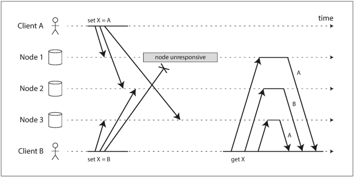

If each node simply overwrote the value for a key whenever it received a write request from a client, the nodes would become permanently inconsistent, as shown by the final get request in Figure 5-12: node 2 thinks that the final value of X is B, whereas the other nodes think that the value is A.

In  order  to  become  eventually  consistent,  the  replicas  should  converge  toward  the same value. How do they do that? One might hope that replicated databases would handle this automatically, but unfortunately most implementations are quite poor: if you want to avoid losing data, you-the application developer-need to know a lot about the internals of your database's conflict handling.

We briefly touched on some techniques for conflict resolution in 'Handling Write Conflicts' on page 63. Before we wrap up this chapter, let's explore the issue in a bit more detail.

## Last write wins (discarding concurrent writes)

One approach for achieving eventual convergence is to declare that each replica need only store the most 'recent' value and allow 'older' values to be overwritten and discarded.  Then,  as  long  as  we  have  some  way  of  unambiguously  determining  which write is more 'recent,' and every write is eventually copied to every replica, the replicas will eventually converge to the same value.

As indicated by the quotes around 'recent,' this idea is actually quite misleading. In the example of Figure 5-12, neither client knew about the other one when it sent its write requests to the database nodes, so it's not clear which one happened first. In fact, it doesn't really make sense to say that either happened 'first': we say the writes are concurrent , so their order is undefined.

Even though the writes don't have a natural ordering, we can force an arbitrary order on  them.  For  example,  we  can  attach  a  timestamp  to  each  write,  pick  the  biggest timestamp as the most 'recent,' and discard any writes with an earlier timestamp. This  conflict  resolution  algorithm,  called last  write  wins (LWW),  is  the  only  supported conflict resolution method in Cassandra [53], and an optional feature in Riak [35].

LWW achieves the goal of eventual convergence, but at the cost of durability: if there are several concurrent writes to the same key, even if they were all reported as successful to the client (because they were written to w replicas), only one of the writes will survive and the others will be silently discarded. Moreover, LWW may even drop writes  that  are  not  concurrent,  as  we  shall  discuss  in  'Timestamps  for  ordering events' on page 109.

There are some situations, such as caching, in which lost writes are perhaps acceptable. If losing data is not acceptable, LWW is a poor choice for conflict resolution.

The only safe way of using a database with LWW is to ensure that a key is only written once and thereafter treated as immutable, thus avoiding any concurrent updates to  the  same  key.  For  example,  a  recommended  way  of  using  Cassandra  is  to  use  a UUID as the key, thus giving each write operation a unique key [53].

## The 'happens-before' relationship and concurrency

How do we decide whether  two  operations  are  concurrent  or  not?  To  develop  an intuition, let's look at some examples:

- In  Figure  5-9,  the  two  writes  are  not  concurrent:  A's  insert happens before B's increment,  because  the  value  incremented  by  B  is  the  value  inserted  by  A.  In other words, B's operation builds upon A's operation, so B's operation must have happened later. We also say that B is causally dependent on A.

- On the other hand, the two writes in Figure 5-12 are concurrent: when each client starts the operation, it does not know that another client is also performing an operation on the same key. Thus, there is no causal dependency between the operations.

An operation A happens before another operation B if B knows about A, or depends on A, or builds upon A in some way. Whether one operation happens before another operation is the key to defining what concurrency means. In fact, we can simply say that two operations are concurrent if  neither  happens before the other (i.e., neither knows about the other) [54].

Thus, whenever you have two operations A and B, there are three possibilities: either A happened before B, or B happened before A, or A and B are concurrent. What we need is an algorithm to tell us whether two operations are concurrent or not. If one operation happened before another, the later operation should overwrite the earlier operation, but if the operations are concurrent, we have a conflict that needs to be resolved.

## Concurrency, Time, and Relativity

It  may  seem  that  two  operations  should  be  called  concurrent  if  they  occur  'at  the same time'-but in fact, it  is  not  important  whether  they  literally  overlap  in  time. Because of problems with clocks in distributed systems, it is actually quite difficult to tell whether two things happened at exactly the same time-an issue we will discuss in more detail in Chapter 8.

For defining concurrency, exact time doesn't matter: we simply call two operations concurrent if they are both unaware of each other, regardless of the physical time at which  they  occurred.  People  sometimes  make  a  connection  between  this  principle and  the  special  theory  of  relativity  in  physics  [54],  which  introduced  the  idea  that information  cannot  travel  faster  than  the  speed  of  light.  Consequently,  two  events that occur some distance apart cannot possibly affect each other if the time between the events is shorter than the time it takes light to travel the distance between them.

In computer systems, two operations might be concurrent even though the speed of light would in principle have allowed one operation to affect the other. For example, if  the  network was slow or interrupted at the time, two operations can occur some time  apart  and  still  be  concurrent,  because  the  network  problems  prevented  one operation from being able to know about the other.

## Capturing the happens-before relationship

Let's look at an algorithm that determines whether two operations are concurrent, or whether one happened before another. To keep things simple, let's start with a data-

base that has only one replica. Once we have worked out how to do this on a single replica, we can generalize the approach to a leaderless database with multiple replicas.

Figure 5-13 shows two clients concurrently adding items to the same shopping cart. (If  that example strikes you as too inane, imagine instead two air traffic controllers concurrently  adding  aircraft  to  the  sector  they  are  tracking.)  Initially,  the  cart  is empty. Between them, the clients make five writes to the database:

1. Client 1 adds milk to the cart. This is the first write to that key, so the server successfully stores it and assigns it version 1. The server also echoes the value back to the client, along with the version number.
2. Client 2 adds eggs to the cart, not knowing that client 1 concurrently added milk (client 2 thought that its eggs were the only item in the cart). The server assigns version 2 to this write, and stores eggs and milk as two separate values. It then returns both values to the client, along with the version number of 2.
3. Client 1, oblivious to client 2's write, wants to add flour to the cart, so it thinks the  current  cart  contents  should  be [milk, flour] .  It  sends  this  value  to  the server, along with the version number 1 that the server gave client 1 previously. The server  can  tell  from  the  version  number  that  the  write  of [milk, flour] supersedes the prior value of [milk] but that it is concurrent with [eggs] . Thus, the  server  assigns  version  3  to [milk, flour] ,  overwrites  the  version  1  value [milk] , but keeps the version 2 value [eggs] and returns both remaining values to the client.
4. Meanwhile, client 2 wants to add ham to the cart, unaware that client 1 just added flour . Client 2 received the two values [milk] and [eggs] from the server in the last response, so the client now merges those values and adds ham to form a new value, [eggs, milk, ham] . It sends that value to the server, along with the previous version number 2. The server detects that version 2 overwrites [eggs] but is concurrent with [milk, flour] , so the two remaining values are [milk, flour] with version 3, and [eggs, milk, ham] with version 4.
5. Finally, client 1 wants to add bacon .  It  previously  received [milk, flour] and [eggs] from the server at version 3, so it merges those, adds bacon , and sends the final value [milk, flour, eggs, bacon] to  the  server,  along  with  the  version number 3. This overwrites [milk, flour] (note that [eggs] was already overwritten in the last step) but is concurrent with [eggs, milk, ham] , so the server keeps those two concurrent values.

Client 1

empty

Database

Client 2

+ milk

E

[milk]

value: [milk]

set key: cart flour

set key: cart value: [milk, flour]

[milk, flour]

version: 1

bacon

+

+ flour

..+

set key: cart

[milk, flour, value: [milk, four, eggs, bacon]

eggs, bacon]

- ›

time version: 3

Figure 5-13. Capturing causal dependencies between two clients concurrently editing a shopping cart.

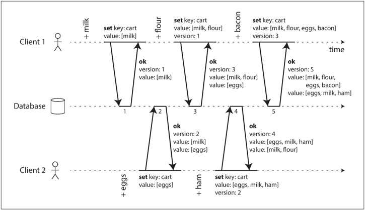

The  dataflow  between  the  operations  in  Figure  5-13  is  illustrated  graphically  in Figure 5-14. The arrows indicate which operation happened before which other operation, in the sense that the later operation knew about or depended on the earlier one. In this example, the clients are never fully up to date with the data on the server, since there is always another operation going on concurrently. But old versions of the value do get overwritten eventually, and no writes are lost.

Figure 5-14. Graph of causal dependencies in Figure 5-13.

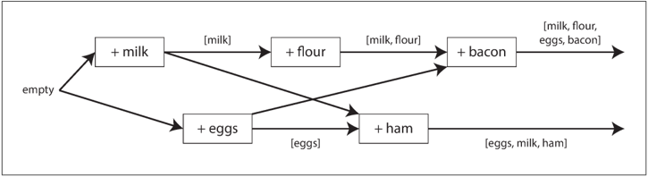

Note that the server can determine whether two operations are concurrent by looking at  the  version  numbers-it does not need to interpret the value itself (so the value could be any data structure). The algorithm works as follows:

+ bacon

- The  server  maintains  a  version  number  for  every  key,  increments  the  version number every time that key is written, and stores the new version number along with the value written.
- When a client reads a key, the server returns all values that have not been overwritten,  as  well  as  the  latest  version  number.  A  client  must  read  a  key  before writing.
- When a client writes a key, it must include the version number from the prior read, and it must merge together all values that it received in the prior read. (The response  from  a  write  request  can  be  like  a  read,  returning  all  current  values, which allows us to chain several writes like in the shopping cart example.)
- When the server receives a write with a particular version number, it can overwrite all values with that version number or below (since it knows that they have been merged into the new value), but it must keep all values with a higher version number (because those values are concurrent with the incoming write).

When a write includes the version number from a prior read, that tells us which previous  state  the  write  is  based  on.  If  you  make  a  write  without  including  a  version number, it is concurrent with all other writes, so it will not overwrite anything-it will just be returned as one of the values on subsequent reads.

## Merging concurrently written values

This algorithm ensures that no data is silently dropped, but it unfortunately requires that the clients do some extra work: if several operations happen concurrently, clients have  to  clean  up  afterward  by  merging  the  concurrently  written  values.  Riak  calls these concurrent values siblings .

Merging sibling values is essentially the same problem as conflict resolution in multileader replication, which we discussed previously (see 'Handling Write Conflicts' on page 63). A simple approach is to just pick one of the values based on a version number or timestamp (last write wins), but that implies losing data. So, you may need to do something more intelligent in application code.

With the example of a shopping cart, a reasonable approach to merging siblings is to just take the union. In Figure 5-14, the two final siblings are [milk, flour, eggs, bacon] and [eggs,  milk,  ham] ;  note  that milk and eggs appear  in  both,  even though they were each only written once. The merged value might be something like [milk, flour, eggs, bacon, ham] , without duplicates.

However, if you want to allow people to also remove things from their carts, and not just add things, then taking the union of siblings may not yield the right result: if you merge two sibling carts and an item has been removed in only one of them, then the removed item will reappear in the union of the siblings [37]. To prevent this prob-

lem, an item cannot simply be deleted from the database when it is removed; instead, the system must leave a marker with an appropriate version number to indicate that the item has been removed when merging siblings. Such a deletion marker is known as a tombstone .  (We previously saw tombstones in the context of log compaction in 'Hash Indexes' on page 4.)

As merging siblings in application code is complex and error-prone, there are some efforts to design data structures that can perform this merging automatically, as discussed in 'Automatic Conflict Resolution' on page 66. For example, Riak's datatype support uses a family of data structures called CRDTs [38, 39, 55] that can automatically merge siblings in sensible ways, including preserving deletions.

## Version vectors

The  example  in  Figure  5-13  used  only  a  single  replica.  How  does  the  algorithm change when there are multiple replicas, but no leader?

Figure  5-13  uses  a  single  version  number  to  capture  dependencies  between  operations, but that is not sufficient when there are multiple replicas accepting writes concurrently.  Instead,  we  need  to  use  a  version  number per  replica as  well  as  per  key. Each replica increments its own version number when processing a write, and also keeps track of the version numbers it has seen from each of the other replicas. This information indicates which values to overwrite and which values to keep as siblings.

The collection of version numbers from all the replicas is called a version vector [56]. A few variants of this idea are in use, but the most interesting is probably the dotted version vector [57], which is used in Riak 2.0 [58, 59]. We won't go into the details, but the way it works is quite similar to what we saw in our cart example.

Like the version numbers in Figure 5-13, version vectors are sent from the database replicas  to  clients  when  values  are  read,  and  need  to  be  sent  back  to  the  database when a value is subsequently written. (Riak encodes the version vector as a string that it calls causal context .) The version vector allows the database to distinguish between overwrites and concurrent writes.

Also, like in the single-replica example, the application may need to merge siblings. The version vector structure ensures that it is safe to read from one replica and subsequently write back to another replica. Doing so may result in siblings being created, but no data is lost as long as siblings are merged correctly.


## Version vectors and vector clocks

A version vector is sometimes also called a vector clock , even though they are not quite the same. The difference is subtle-please see the references  for  details  [57,  60,  61].  In  brief,  when  comparing  the state of replicas, version vectors are the right data structure to use.

## Summary

In  this  chapter  we  looked  at  the  issue  of  replication.  Replication  can  serve  several purposes:

High availability

Keeping the system running, even when one machine (or several machines, or an entire datacenter) goes down

## Disconnected operation

Allowing an application to continue working when there is a network interruption

## Latency

Placing data geographically close to users, so that users can interact with it faster

Scalability

Being able to handle a higher volume of reads than a single machine could handle, by performing reads on replicas

Despite being a simple goal-keeping a copy of the same data on several machinesreplication turns out to be a remarkably tricky problem. It requires carefully thinking about concurrency and about all the things that can go wrong, and dealing with the consequences of those faults. At a minimum, we need to deal with unavailable nodes and network interruptions (and that's not even considering the more insidious kinds of fault, such as silent data corruption due to software bugs).

We discussed three main approaches to replication:

Single-leader replication

Clients send all writes to a single node (the leader), which sends a stream of data change events to the other replicas (followers). Reads can be performed on any replica, but reads from followers might be stale.

## Multi-leader replication

Clients send each write to one of several leader nodes, any of which can accept writes. The leaders send streams of data change events to each other and to any follower nodes.

## Leaderless replication

Clients send each write to several nodes, and read from several nodes in parallel in order to detect and correct nodes with stale data.

Each approach has advantages and disadvantages. Single-leader replication is popular because  it  is  fairly  easy  to  understand  and  there  is  no  conflict  resolution  to  worry about. Multi-leader and leaderless replication can be more robust in the presence of

faulty nodes, network interruptions, and latency spikes-at the cost of being harder to reason about and providing only very weak consistency guarantees.

Replication can be synchronous or asynchronous, which has a profound effect on the system behavior when there is a fault. Although asynchronous replication can be fast when  the  system  is  running  smoothly,  it's  important  to  figure  out  what  happens when replication lag increases and servers fail. If a leader fails and you promote an asynchronously updated follower to be the new leader, recently committed data may be lost.

We looked at some strange effects that can be caused by replication lag, and we discussed a few consistency models which are helpful for deciding how an application should behave under replication lag:

## Read-after-write consistency

Users should always see data that they submitted themselves.

## Monotonic reads

After users have seen the data at one point in time, they shouldn't later see the data from some earlier point in time.

## Consistent prefix reads

Users should see the data in a state that makes causal sense: for example, seeing a question and its reply in the correct order.

Finally,  we  discussed  the  concurrency  issues  that  are  inherent  in  multi-leader  and leaderless replication approaches: because such systems allow multiple writes to happen concurrently,  conflicts  may  occur.  We  examined  an  algorithm  that  a  database might use to determine whether one operation happened before another, or whether they happened concurrently. We also touched on methods for resolving conflicts by merging together concurrently written values.

In the next chapter we will continue looking at data that is distributed across multiple machines, through the counterpart of replication: splitting a large dataset into partitions .

## References

[1]  Bruce  G.  Lindsay,  Patricia  Griffiths  Selinger,  C.  Galtieri,  et  al.:  'Notes  on  Distributed Databases,' IBM Research, Research Report RJ2571(33471), July 1979.

[2] 'Oracle Active Data Guard Real-Time Data Protection and Availability,' Oracle White Paper, June 2013.

[3] 'AlwaysOn Availability Groups,' in SQL Server Books Online , Microsoft, 2012.

[4]  Lin  Qiao,  Kapil  Surlaker,  Shirshanka  Das,  et  al.:  'On  Brewing  Fresh  Espresso: LinkedIn's Distributed Data Serving Platform,' at ACM International Conference on Management of Data (SIGMOD), June 2013.

[5]  Jun  Rao:  'Intra-Cluster  Replication  for  Apache  Kafka,'  at ApacheCon  North America , February 2013.

[6] 'Highly Available Queues,' in RabbitMQ Server Documentation , Pivotal Software, Inc., 2014.

[7]  Yoshinori Matsunobu: 'Semi-Synchronous Replication at Facebook,' yoshinorimatsunobu.blogspot.co.uk , April 1, 2014.

[8] Robbert van Renesse and Fred B. Schneider: 'Chain Replication for Supporting High Throughput and Availability,' at 6th USENIX Symposium on Operating System Design and Implementation (OSDI), December 2004.

[9]  Jeff  Terrace  and  Michael  J.  Freedman:  'Object  Storage  on  CRAQ:  HighThroughput  Chain  Replication  for  Read-Mostly  Workloads,'  at USENIX  Annual Technical Conference (ATC), June 2009.

[10] Brad Calder, Ju Wang, Aaron Ogus, et al.: 'Windows Azure Storage: A Highly Available Cloud Storage Service with Strong Consistency,' at 23rd ACM Symposium on Operating Systems Principles (SOSP), October 2011.

[11] Andrew Wang: 'Windows Azure Storage,' umbrant.com , February 4, 2016.

[12] 'Percona Xtrabackup - Documentation,' Percona LLC, 2014.

[13]  Jesse  Newland:  'GitHub  Availability  This  Week,' github.com ,  September  14, 2012.

[14] Mark Imbriaco: 'Downtime Last Saturday,' github.com , December 26, 2012.

[15]  John  Hugg:  ''All  in'  with  Determinism  for  Performance  and  Testing  in  Distributed Systems,' at Strange Loop , September 2015.

[16]  Amit  Kapila:  'WAL  Internals  of  PostgreSQL,'  at PostgreSQL  Conference (PGCon), May 2012.

[17] MySQL Internals Manual . Oracle, 2014.

[18] Yogeshwer Sharma, Philippe Ajoux, Petchean Ang, et al.: 'Wormhole: Reliable Pub-Sub to Support Geo-Replicated Internet Services,' at 12th USENIX Symposium on Networked Systems Design and Implementation (NSDI), May 2015.

[19] 'Oracle GoldenGate 12c: Real-Time Access to Real-Time Information,' Oracle White Paper, October 2013.

[20]  Shirshanka  Das,  Chavdar  Botev,  Kapil  Surlaker,  et  al.:  'All  Aboard  the  Databus!,' at ACM Symposium on Cloud Computing (SoCC), October 2012.

[21]  Greg  Sabino  Mullane:  'Version  5  of  Bucardo  Database  Replication  System,' blog.endpoint.com , June 23, 2014.

[22]  Werner  Vogels:  'Eventually  Consistent,' ACM  Queue ,  volume  6,  number  6, pages 14-19, October 2008. doi:10.1145/1466443.1466448

[23] Douglas B. Terry: 'Replicated Data Consistency Explained Through Baseball,' Microsoft Research, Technical Report MSR-TR-2011-137, October 2011.

[24] Douglas B. Terry, Alan J. Demers, Karin Petersen, et al.: 'Session Guarantees for Weakly Consistent Replicated Data,' at 3rd International Conference on Parallel and Distributed Information Systems (PDIS), September 1994. doi:10.1109/PDIS. 1994.331722

[25] Terry Pratchett: Reaper Man: A Discworld Novel .  Victor Gollancz, 1991. ISBN: 978-0-575-04979-6

[26] 'Tungsten Replicator,' github.com .

[27]  'BDR  0.10.0  Documentation,'  The  PostgreSQL  Global  Development  Group, bdr-project.org , 2015.

[28]  Robert  Hodges:  'If  You  *Must*  Deploy  Multi-Master  Replication,  Read  This First,' scale-out-blog.blogspot.co.uk , March 30, 2012.

[29]  J.  Chris  Anderson,  Jan  Lehnardt,  and  Noah  Slater: CouchDB:  The  Definitive Guide . O'Reilly Media, 2010. ISBN: 978-0-596-15589-6

[30] AppJet, Inc.: 'Etherpad and EasySync Technical Manual,' github.com , March 26, 2011.

[31] John Day-Richter: 'What's Different About the New Google Docs: Making Collaboration Fast,' drive.googleblog.com , September 23, 2010.

[32] Martin Kleppmann and Alastair R. Beresford: 'A Conflict-Free Replicated JSON Datatype,' arXiv:1608.03960, August 13, 2016.

[33]  Frazer  Clement:  'Eventual  Consistency  -  Detecting  Conflicts,' messagepassing.blogspot.co.uk , October 20, 2011.

[34] Robert Hodges: 'State of the Art for MySQL Multi-Master Replication,' at Percona Live: MySQL Conference &amp; Expo , April 2013.

[35]  John  Daily:  'Clocks  Are  Bad,  or,  Welcome  to  the  Wonderful  World  of  Distributed Systems,' riak.com , November 12, 2013.

[36] Riley Berton: 'Is Bi-Directional Replication (BDR) in Postgres Transactional?,' sdf.org , January 4, 2016.

[37] Giuseppe DeCandia, Deniz Hastorun, Madan Jampani, et al.: 'Dynamo: Amazon's Highly Available Key-Value Store,' at 21st ACM Symposium on Operating Systems Principles (SOSP), October 2007.

[38] Marc Shapiro, Nuno Preguiça, Carlos Baquero, and Marek Zawirski: 'A Comprehensive Study of Convergent and Commutative Replicated Data Types,' INRIA Research Report no. 7506, January 2011.

[39]  Sam  Elliott:  'CRDTs:  An  UPDATE (or Maybe Just a PUT),' at RICON West , October 2013.

[40] Russell Brown: 'A Bluffers Guide to CRDTs in Riak,' gist.github.com ,  October 28, 2013.

[41]  Benjamin  Farinier,  Thomas  Gazagnaire,  and  Anil  Madhavapeddy:  'Mergeable Persistent  Data  Structures,'  at 26es  Journées  Francophones  des  Langages  Applicatifs (JFLA), January 2015.

[42] Chengzheng Sun and Clarence Ellis: 'Operational Transformation in Real-Time Group Editors: Issues, Algorithms, and Achievements,' at ACM Conference on Computer Supported Cooperative Work (CSCW), November 1998.

[43] Lars Hofhansl: 'HBASE-7709: Infinite Loop Possible in Master/Master Replication,' issues.apache.org , January 29, 2013.

[44] David K. Gifford: 'Weighted Voting for Replicated Data,' at 7th ACM Symposium on Operating Systems Principles (SOSP), December 1979. doi: 10.1145/800215.806583

[45] Heidi Howard, Dahlia Malkhi, and Alexander Spiegelman: 'Flexible Paxos: Quorum Intersection Revisited,' arXiv:1608.06696 , August 24, 2016.

[46] Joseph Blomstedt: 'Re: Absolute Consistency,' email to riak-users mailing list, lists.basho.com , January 11, 2012.

[47]  Joseph  Blomstedt:  'Bringing  Consistency  to  Riak,'  at RICON  West ,  October 2012.

[48]  Peter  Bailis,  Shivaram  Venkataraman, Michael J. Franklin, et al.: 'Quantifying Eventual Consistency with PBS,' Communications of the ACM , volume 57, number 8, pages 93-102, August 2014. doi:10.1145/2632792

[49] Jonathan Ellis: 'Modern Hinted Handoff,' datastax.com , December 11, 2012.

[50] 'Project Voldemort Wiki,' github.com , 2013.

[51]  'Apache  Cassandra  Documentation,'  Apache  Software  Foundation, cassandra.apache.org .

[52]  'Riak  Enterprise:  Multi-Datacenter  Replication.'  Technical  whitepaper,  Basho Technologies, Inc., September 2014.

[53]  Jonathan  Ellis:  'Why  Cassandra  Doesn't  Need  Vector  Clocks,' datastax.com , September 2, 2013.

[54] Leslie Lamport: 'Time, Clocks, and the Ordering of Events in a Distributed System,' Communications of the ACM , volume 21, number 7, pages 558-565, July 1978. doi:10.1145/359545.359563

[55] Joel Jacobson: 'Riak 2.0: Data Types,' blog.joeljacobson.com , March 23, 2014.

[56] D. Stott Parker Jr., Gerald J. Popek, Gerard Rudisin, et al.: 'Detection of Mutual Inconsistency  in  Distributed  Systems,' IEEE Transactions  on  Software  Engineering , volume 9, number 3, pages 240-247, May 1983. doi:10.1109/TSE.1983.236733

[57] Nuno Preguiça, Carlos Baquero, Paulo Sérgio Almeida, et al.: 'Dotted Version Vectors: Logical Clocks for Optimistic Replication,' arXiv:1011.5808, November 26, 2010.

[58] Sean Cribbs: 'A Brief History of Time in Riak,' at RICON , October 2014.

[59]  Russell  Brown:  'Vector  Clocks  Revisited  Part  2:  Dotted  Version  Vectors,' basho.com , November 10, 2015.

[60]  Carlos  Baquero:  'Version  Vectors  Are  Not  Vector  Clocks,' haslab.wordpress.com , July 8, 2011.

[61] Reinhard Schwarz and Friedemann Mattern: 'Detecting Causal Relationships in Distributed Computations: In Search of the Holy Grail,' Distributed Computing , volume 7, number 3, pages 149-174, March 1994. doi:10.1007/BF02277859

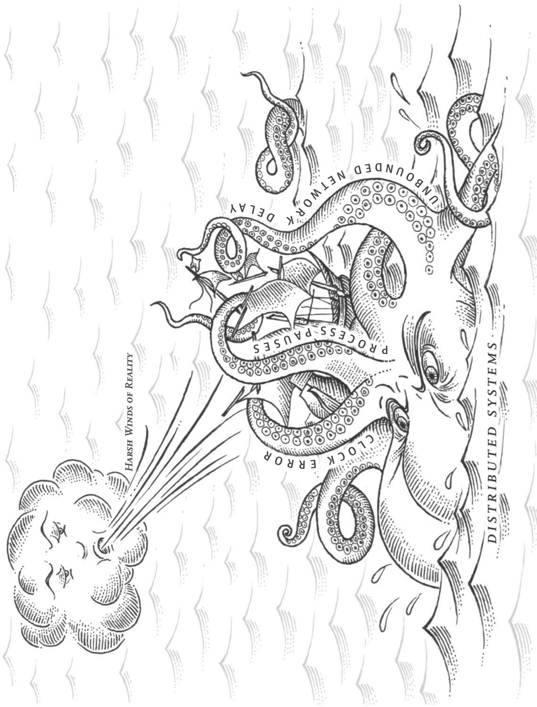

## CHAPTER 8

## The Trouble with Distributed Systems

Hey I just met you The network's laggy But here's my data So store it maybe

-Kyle Kingsbury, Carly Rae Jepsen and the Perils of Network Partitions (2013)

A recurring theme in the last few chapters has been how systems handle things going wrong.  For  example,  we  discussed  replica  failover  ('Handling  Node  Outages'  on page 48), replication lag ('Problems with Replication Lag' on page 53), and concurrency control for transactions (Chapter 7). As we come to understand various edge cases that can occur in real systems, we get better at handling them.

However, even though we have talked a lot about faults, the last few chapters have still been too optimistic. The reality is even darker. We will now turn our pessimism to the maximum and assume that anything that can go wrong will go wrong. i (Experienced  systems  operators  will  tell  you  that  is  a  reasonable  assumption.  If  you  ask nicely, they might tell you some frightening stories while nursing their scars of past battles.)

Working with distributed systems is fundamentally different from writing software on a single computer-and the main difference is that there are lots of new and exciting ways for things to go wrong [1, 2]. In this chapter, we will get a taste of the problems that arise in practice, and an understanding of the things we can and cannot rely on.

In the end, our task as engineers is to build systems that do their job (i.e., meet the guarantees that users are expecting), in spite of everything going wrong. In Chapter 9,

i. With one exception: we will assume that faults are non-Byzantine (see 'Byzantine Faults' on page 122).

we will look at some examples of algorithms that can provide such guarantees in a distributed system. But first, in this chapter, we must understand what challenges we are up against.

This chapter is a thoroughly pessimistic and depressing overview of things that may go wrong in a distributed system. We will look into problems with networks ('Unreliable Networks' on page 95); clocks and timing issues ('Unreliable Clocks' on page 105);  and  we'll  discuss  to  what  degree  they  are  avoidable.  The  consequences  of  all these issues are disorienting, so we'll explore how to think about the state of a distributed  system  and  how  to  reason  about  things  that  have  happened  ('Knowledge, Truth, and Lies' on page 118).

## Faults and Partial Failures

When you are writing a program on a single computer, it normally behaves in a fairly predictable way: either it works or it doesn't. Buggy software may give the appearance that the computer is sometimes 'having a bad day' (a problem that is often fixed by a reboot), but that is mostly just a consequence of badly written software.

There is no fundamental reason why software on a single computer should be flaky: when  the  hardware  is  working  correctly,  the  same  operation  always  produces  the same result (it is deterministic ). If there is a hardware problem (e.g., memory corruption or a loose connector), the consequence is usually a total system failure (e.g., kernel panic, 'blue screen of death,' failure to start up). An individual computer with good software is usually either fully functional or entirely broken, but not something in between.

This is a deliberate choice in the design of computers: if an internal fault occurs, we prefer a computer to crash completely rather than returning a wrong result, because wrong results are difficult and confusing to deal with. Thus, computers hide the fuzzy physical  reality  on  which  they  are  implemented  and  present  an  idealized  system model that operates with mathematical perfection. A CPU instruction always does the same thing; if you write some data to memory or disk, that data remains intact and doesn't get randomly corrupted. This design goal of always-correct computation goes all the way back to the very first digital computer [3].

When you are writing software that runs on several computers, connected by a network,  the  situation  is  fundamentally  different.  In  distributed  systems,  we  are  no longer operating in an idealized system model-we have no choice but to confront the messy reality of the physical world. And in the physical world, a remarkably wide range of things can go wrong, as illustrated by this anecdote [4]:

In my limited experience I've dealt with long-lived network partitions in a single data center (DC), PDU [power distribution unit] failures, switch failures, accidental power cycles  of  whole  racks,  whole-DC  backbone  failures,  whole-DC  power  failures,  and  a

hypoglycemic driver smashing his Ford pickup truck into a DC's HVAC [heating, ventilation, and air conditioning] system. And I'm not even an ops guy.

-Coda Hale

In a distributed system, there may well be some parts of the system that are broken in some unpredictable way, even though other parts of the system are working fine. This is known as a partial failure . The difficulty is that partial failures are nondeterministic : if you try to do anything involving multiple nodes and the network, it may sometimes work  and  sometimes  unpredictably  fail.  As  we  shall  see,  you  may  not  even know whether  something  succeeded  or  not,  as  the  time  it  takes  for  a  message  to  travel across a network is also nondeterministic!

This nondeterminism and possibility of partial failures is what makes distributed systems hard to work with [5].

## Cloud Computing and Supercomputing

There is a spectrum of philosophies on how to build large-scale computing systems:

- At one end of the scale is the field of high-performance computing (HPC). Supercomputers with thousands of CPUs are typically used for computationally intensive scientific  computing  tasks,  such  as  weather  forecasting  or  molecular dynamics (simulating the movement of atoms and molecules).
- At the other extreme is cloud computing , which is not very well defined [6] but is often associated with multi-tenant datacenters, commodity computers connected with an IP network (often Ethernet), elastic/on-demand resource allocation, and metered billing.
- Traditional enterprise datacenters lie somewhere between these extremes.

With  these  philosophies  come  very  different  approaches  to  handling  faults.  In  a supercomputer,  a  job  typically  checkpoints  the  state  of  its  computation  to  durable storage from time to time. If one node fails, a common solution is to simply stop the entire cluster workload. After the faulty node is repaired, the computation is restarted from  the  last  checkpoint  [7,  8].  Thus,  a  supercomputer  is  more  like  a  single-node computer than a distributed system: it deals with partial failure by letting it escalate into total failure-if any part of the system fails, just let everything crash (like a kernel panic on a single machine).

In this book we focus on systems for implementing internet services, which usually look very different from supercomputers:

- Many internet-related applications are online ,  in  the  sense that they need to be able to serve users with low latency at any time. Making the service unavailablefor example, stopping the cluster for repair-is not acceptable. In contrast, off-

line (batch) jobs like weather simulations can be stopped and restarted with fairly low impact.

- Supercomputers are typically built from specialized hardware, where each node is  quite  reliable,  and  nodes  communicate  through  shared  memory  and  remote direct memory access (RDMA). On the other hand, nodes in cloud services are built from commodity machines, which can provide equivalent performance at lower cost due to economies of scale, but also have higher failure rates.
- Large datacenter networks are often based on IP and Ethernet, arranged in Clos topologies  to  provide  high  bisection  bandwidth  [9].  Supercomputers  often  use specialized  network  topologies,  such  as  multi-dimensional  meshes  and  toruses [10], which yield better performance for HPC workloads with known communication patterns.
- The bigger a system gets, the more likely it is that one of its components is broken. Over time, broken things get fixed and new things break, but in a system with thousands of nodes, it is reasonable to assume that something is always broken [7]. When the error handling strategy consists of simply giving up, a large system can end up spending a lot of its time recovering from faults rather than doing useful work [8].
- If the system can tolerate failed nodes and still keep working as a whole, that is a very  useful  feature  for  operations  and  maintenance:  for  example,  you  can  perform a rolling upgrade (see Chapter 4), restarting one node at a time, while the service continues serving users without interruption. In cloud environments, if one virtual machine is not performing well, you can just kill it and request a new one (hoping that the new one will be faster).
- In a geographically distributed deployment (keeping data geographically close to your users to reduce access latency), communication most likely goes over the internet,  which  is  slow  and  unreliable  compared  to  local  networks.  Supercomputers generally assume that all of their nodes are close together.

If we want to make distributed systems work, we must accept the possibility of partial failure  and  build  fault-tolerance  mechanisms into the software. In other words, we need to build a reliable system from unreliable components. (As discussed in Chapter 1, there is no such thing as perfect reliability, so we'll need to understand the limits of what we can realistically promise.)

Even in smaller systems consisting of only a few nodes, it's important to think about partial  failure.  In  a  small  system,  it's  quite  likely  that  most  of  the  components  are working correctly most of the time. However, sooner or later, some part of the system will become faulty, and the software will have to somehow handle it. The fault handling must be part of the software design, and you (as operator of the software) need to know what behavior to expect from the software in the case of a fault.

It would be unwise to assume that faults are rare and simply hope for the best. It is important to consider a wide range of possible faults-even fairly unlikely ones-and to artificially create such situations in your testing environment to see what happens. In distributed systems, suspicion, pessimism, and paranoia pay off.

## Building a Reliable System from Unreliable Components

You may wonder whether this makes any sense-intuitively it may seem like a system can only be as reliable as its least reliable component (its weakest link ). This is not the case: in fact, it is an old idea in computing to construct a more reliable system from a less reliable underlying base [11]. For example:

- Error-correcting  codes  allow  digital  data  to  be  transmitted  accurately  across  a communication channel that occasionally gets some bits wrong, for example due to radio interference on a wireless network [12].
- IP (the Internet Protocol) is unreliable: it may drop, delay, duplicate, or reorder packets.  TCP  (the  Transmission  Control  Protocol)  provides  a  more  reliable transport  layer  on  top  of  IP:  it  ensures  that  missing  packets  are  retransmitted, duplicates are eliminated, and packets are reassembled into the order in which they were sent.

Although the system can be more reliable than its underlying parts, there is always a limit to how much more reliable it can be. For example, error-correcting codes can deal with a small number of single-bit errors, but if your signal is swamped by interference,  there  is  a  fundamental  limit  to  how  much  data  you  can  get  through  your communication channel [13]. TCP can hide packet loss, duplication, and reordering from you, but it cannot magically remove delays in the network.

Although the more reliable higher-level system is not perfect, it's still useful because it takes care of some of the tricky low-level faults, and so the remaining faults are usually easier to reason about and deal with. We will explore this matter further in Chapter 12.

## Unreliable Networks

As discussed in the introduction to Part II, the distributed systems we focus on in this book are shared-nothing systems :  i.e.,  a  bunch of machines connected by a network. The network is the only way those machines can communicate-we assume that each machine  has  its  own  memory  and  disk,  and  one  machine  cannot  access  another machine's memory or disk (except by making requests to a service over the network).

Shared-nothing is not the only way of building systems, but it has become the dominant approach for building internet services, for several reasons: it's comparatively

Client

Network

Service

(a)

???

???

???

time

·

cheap  because  it  requires  no  special  hardware,  it  can  make  use  of  commoditized cloud  computing  services,  and  it  can  achieve  high  reliability  through  redundancy across multiple geographically distributed datacenters.

The internet  and  most  internal  networks  in  datacenters  (often  Ethernet)  are asynchronous packet networks .  In  this kind of network, one node can send a message (a packet) to another node, but the network gives no guarantees as to when it will arrive, or  whether  it  will  arrive  at  all.  If  you  send  a  request  and  expect  a  response,  many things could go wrong (some of which are illustrated in Figure 8-1):

1. Your request may have been lost (perhaps someone unplugged a network cable).
2. Your request may be waiting in a queue and will be delivered later (perhaps the network or the recipient is overloaded).
3. The remote node may have failed (perhaps it crashed or it was powered down).
4. The remote node may have temporarily stopped responding (perhaps it is experiencing a long garbage collection pause; see 'Process Pauses' on page 113), but it will start responding again later.
5. The remote node may have processed your request, but the response has been lost on the network (perhaps a network switch has been misconfigured).
6. The remote node may have processed your request, but the response has been delayed and will be delivered later (perhaps the network or your own machine is overloaded).

Figure 8-1. If you send a request and don't get a response, it's not possible to distinguish whether (a) the request was lost, (b) the remote node is down, or (c) the response was lost.

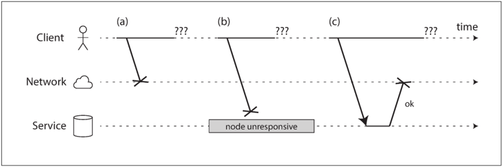

The sender can't even tell whether the packet was delivered: the only option is for the recipient to send a response message, which may in turn be lost or delayed. These issues are indistinguishable in an asynchronous network: the only information you have is that you haven't received a response yet. If you send a request to another node and don't receive a response, it is impossible to tell why.

(b)

(c)

The usual way of handling this issue is a timeout : after some time you give up waiting and assume that the response is not going to arrive. However, when a timeout occurs, you  still  don't  know  whether  the  remote  node  got  your  request  or  not  (and  if  the request is still queued somewhere, it may still be delivered to the recipient, even if the sender has given up on it).

## Network Faults in Practice

We have been building computer networks for decades-one might hope that by now we would have figured out how to make them reliable. However, it seems that we have not yet succeeded.

There are some systematic studies, and plenty of anecdotal evidence, showing that network problems can be surprisingly common, even in controlled environments like a datacenter operated by one company [14]. One study in a medium-sized datacenter found  about  12  network  faults  per  month,  of  which  half  disconnected  a  single machine, and half disconnected an entire rack [15]. Another study measured the failure rates of components like top-of-rack switches, aggregation switches, and load balancers [16]. It found that adding redundant networking gear doesn't reduce faults as much as you might hope, since it doesn't guard against human error (e.g., misconfigured switches), which is a major cause of outages.

Public  cloud  services  such  as  EC2  are  notorious  for  having  frequent  transient  network  glitches  [14],  and  well-managed  private  datacenter  networks  can  be  stabler environments. Nevertheless, nobody is immune from network problems: for example, a problem during a software upgrade for a switch could trigger a network topology reconfiguration, during which network packets could be delayed for more than a minute [17]. Sharks might bite undersea cables and damage them [18]. Other surprising faults include a network interface that sometimes drops all inbound packets but sends outbound packets successfully [19]: just because a network link works in one direction doesn't guarantee it's also working in the opposite direction.


## Network partitions

When one part of the network is cut off from the rest due to a network fault, that is sometimes called a network partition or netsplit . In this book we'll generally stick with the more general term network fault , to avoid confusion with partitions (shards) of a storage system, as discussed in Chapter 6.

Even if  network  faults  are  rare  in  your  environment,  the  fact  that  faults can occur means that your software needs to be able to handle them. Whenever any communication happens over a network, it may fail-there is no way around it.

If the error handling of network faults is not defined and tested, arbitrarily bad things could happen: for example, the cluster could become deadlocked and permanently unable to serve requests, even when the network recovers [20], or it could even delete all of your data [21]. If software is put in an unanticipated situation, it may do arbitrary unexpected things.

Handling network faults doesn't necessarily mean tolerating them: if your network is normally fairly reliable, a valid approach may be to simply show an error message to users while your network is experiencing problems. However, you do need to know how  your  software  reacts  to  network  problems  and  ensure  that  the  system  can recover from them. It may make sense to deliberately trigger network problems and test the system's response (this is the idea behind Chaos Monkey; see Chapter 1).

## Detecting Faults

Many systems need to automatically detect faulty nodes. For example:

- A load balancer needs to stop sending requests to a node that is dead (i.e., take it out of rotation ).
- In a distributed database with single-leader replication, if the leader fails, one of the followers needs to be promoted to be the new leader (see 'Handling Node Outages' on page 48).

Unfortunately, the uncertainty about the network makes it difficult to tell whether a node is working or not. In some specific circumstances you might get some feedback to explicitly tell you that something is not working:

- If you can reach the machine on which the node should be running, but no process is  listening  on  the  destination  port  (e.g.,  because  the  process  crashed),  the operating system will helpfully close or refuse TCP connections by sending a RST or FIN packet in reply. However, if the node crashed while it was handling your request, you have no way of knowing how much data was actually processed by the remote node [22].
- If a node process crashed (or was killed by an administrator) but the node's operating system is still running, a script can notify other nodes about the crash so that another node can take over quickly without having to wait for a timeout to expire. For example, HBase does this [23].
- If you have access to the management interface of the network switches in your datacenter, you can query them to detect link failures at a hardware level (e.g., if the  remote machine is powered down). This option is ruled out if you're connecting via the internet, or if you're in a shared datacenter with no access to the switches themselves, or if you can't reach the management interface due to a network problem.

- If a router is sure that the IP address you're trying to connect to is unreachable, it may reply to you with an ICMP Destination Unreachable packet. However, the router doesn't have a magic failure detection capability either-it is subject to the same limitations as other participants of the network.

Rapid feedback about a remote node being down is useful, but you can't count on it. Even  if  TCP  acknowledges  that  a  packet  was  delivered,  the  application  may  have crashed before handling it. If you want to be sure that a request was successful, you need a positive response from the application itself [24].

Conversely,  if  something  has  gone  wrong,  you  may  get  an  error  response  at  some level of the stack, but in general you have to assume that you will get no response at all. You can retry a few times (TCP retries transparently, but you may also retry at the application level), wait for a timeout to elapse, and eventually declare the node dead if you don't hear back within the timeout.

## Timeouts and Unbounded Delays

If a timeout is the only sure way of detecting a fault, then how long should the timeout be? There is unfortunately no simple answer.

A long timeout means a long wait until a node is declared dead (and during this time, users may have to wait or see error messages). A short timeout detects faults faster, but carries a higher risk of incorrectly declaring a node dead when in fact it has only suffered a temporary slowdown (e.g., due to a load spike on the node or the network).

Prematurely declaring a node dead is problematic: if the node is actually alive and in the middle of performing some action (for example, sending an email), and another node takes over, the action may end up being performed twice. We will discuss this issue in more detail in 'Knowledge, Truth, and Lies' on page 118, and in Chapters 9 and 11.

When a  node  is  declared  dead,  its  responsibilities  need  to  be  transferred  to  other nodes, which places additional load on other nodes and the network. If the system is already  struggling  with  high  load,  declaring  nodes  dead  prematurely  can  make  the problem worse. In particular, it could happen that the node actually wasn't dead but only slow to respond due to overload; transferring its load to other nodes can cause a cascading failure (in the extreme case, all nodes declare each other dead, and everything stops working).

Imagine  a  fictitious  system  with  a  network  that  guaranteed  a  maximum  delay  for packets-every packet is either delivered within some time d , or it is lost, but delivery never takes longer than d .  Furthermore, assume that you can guarantee that a nonfailed node always handles a request within some time r . In this case, you could guarantee that every successful request receives a response within time 2 d + r -and if you

don't receive a response within that time, you know that either the network or the remote node is not working. If this was true, 2 d + r would be a reasonable timeout to use.

Unfortunately, most systems we work with have neither of those guarantees: asynchronous  networks  have unbounded  delays (that  is,  they  try  to  deliver  packets  as quickly as possible, but there is no upper limit on the time it may take for a packet to arrive),  and  most  server  implementations  cannot  guarantee  that  they  can  handle requests within some maximum time (see 'Response time guarantees' on page 116). For failure detection, it's not sufficient for the system to be fast most of the time: if your timeout is low, it only takes a transient spike in round-trip times to throw the system off-balance.

## Network congestion and queueing

When driving a car, travel times on road networks often vary most due to traffic congestion. Similarly, the variability of packet delays on computer networks is most often due to queueing [25]:

- If several different nodes simultaneously try to send packets to the same destination, the network switch must queue them up and feed them into the destination network link one by one (as illustrated in Figure 8-2). On a busy network link, a packet may have to wait a while until it can get a slot (this is called network congestion ).  If  there  is  so  much  incoming  data  that  the  switch  queue  fills  up,  the packet is dropped, so it needs to be resent-even though the network is functioning fine.
- When a packet reaches the destination machine, if all CPU cores are currently busy, the incoming request from the network is queued by the operating system until the application is ready to handle it. Depending on the load on the machine, this may take an arbitrary length of time.
- In virtualized environments, a running operating system is often paused for tens of milliseconds while another virtual machine uses a CPU core. During this time, the  VM  cannot  consume  any  data  from  the  network,  so  the  incoming  data  is queued  (buffered)  by  the  virtual  machine  monitor  [26],  further  increasing  the variability of network delays.
- TCP performs flow control (also known as congestion avoidance or backpressure ), in  which a node limits its own rate of sending in order to avoid overloading a network link or the receiving node [27]. This means additional queueing at the sender before the data even enters the network.

Port 1

Port 2

Port 3

Port 4

Input links

Network switch

Output links

· Port 1

Figure 8-2. If several machines send network traffic to the same destination, its switch queue can fill up. Here, ports 1, 2, and 4 are all trying to send packets to port 3.

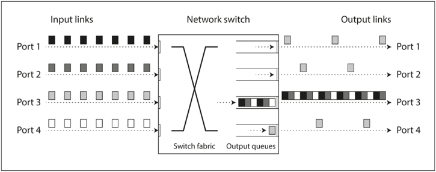

Moreover, TCP considers a packet to be lost if it is not acknowledged within some timeout (which is calculated from observed round-trip times), and lost packets are automatically  retransmitted.  Although  the  application  does  not  see  the  packet  loss and retransmission, it does see the resulting delay (waiting for the timeout to expire, and then waiting for the retransmitted packet to be acknowledged).

## TCP Versus UDP

Some  latency-sensitive  applications,  such  as  videoconferencing  and  Voice  over  IP (VoIP), use UDP rather than TCP. It's a trade-off between reliability and variability of delays: as UDP does not perform flow control and does not retransmit lost packets, it avoids some of the reasons for variable network delays (although it is still susceptible to switch queues and scheduling delays).

UDP is a good choice in situations where delayed data is worthless. For example, in a VoIP phone call, there probably isn't enough time to retransmit a lost packet before its  data  is  due  to  be  played  over  the  loudspeakers.  In  this  case,  there's  no  point  in retransmitting the packet-the application must instead fill the missing packet's time slot  with  silence  (causing  a  brief  interruption  in  the  sound)  and  move  on  in  the stream. The retry happens at the human layer instead. ('Could you repeat that please? The sound just cut out for a moment.')

All of these factors contribute to the variability of network delays. Queueing delays have an especially wide range when a system is close to its maximum capacity: a system with plenty of spare capacity can easily drain queues, whereas in a highly utilized system, long queues can build up very quickly.

In  public  clouds  and  multi-tenant  datacenters,  resources  are  shared  among  many customers: the network links and switches, and even each machine's network inter-

face  and  CPUs  (when  running  on  virtual  machines),  are  shared.  Batch  workloads such as MapReduce (see Chapter 10) can easily saturate network links. As you have no control over or insight into other customers' usage of the shared resources, network delays can be highly variable if someone near you (a noisy neighbor ) is using a lot of resources [28, 29].

In  such  environments,  you  can  only  choose  timeouts  experimentally:  measure  the distribution  of  network  round-trip  times  over  an  extended  period,  and  over  many machines, to determine the expected variability of delays. Then, taking into account your  application's characteristics, you  can  determine  an  appropriate  trade-off between failure detection delay and risk of premature timeouts.

Even better, rather than using configured constant timeouts, systems can continually measure response times and their variability ( jitter ),  and automatically adjust timeouts according to the observed response time distribution. This can be done with a Phi Accrual failure detector [30], which is used for example in Akka and Cassandra [31]. TCP retransmission timeouts also work similarly [27].

## Synchronous Versus Asynchronous Networks

Distributed systems would be a lot simpler if we could rely on the network to deliver packets  with  some  fixed  maximum  delay,  and  not  to  drop  packets.  Why  can't  we solve this at the hardware level and make the network reliable so that the software doesn't need to worry about it?

To answer this question, it's interesting to compare datacenter networks to the traditional  fixed-line  telephone  network  (non-cellular,  non-VoIP),  which  is  extremely reliable: delayed audio frames and dropped calls are very rare. A phone call requires a constantly low end-to-end latency and enough bandwidth to transfer the audio samples of your voice. Wouldn't it be nice to have similar reliability and predictability in computer networks?

When you make a call over the telephone network, it establishes a circuit :  a  fixed, guaranteed  amount  of  bandwidth  is  allocated  for  the  call,  along  the  entire  route between  the  two  callers.  This  circuit  remains  in  place  until  the  call  ends  [32].  For example, an ISDN network runs at a fixed rate of 4,000 frames per second. When a call is established, it is allocated 16 bits of space within each frame (in each direction). Thus, for the duration of the call, each side is guaranteed to be able to send exactly 16 bits of audio data every 250 microseconds [33, 34].

This kind of network is synchronous :  even as data passes through several routers, it does not suffer from queueing, because the 16 bits of space for the call have already been reserved in the next hop of the network. And because there is no queueing, the maximum end-to-end latency of the network is fixed. We call this a bounded delay .

## Can we not simply make network delays predictable?

Note that a circuit in a telephone network is very different from a TCP connection: a circuit is a fixed amount of reserved bandwidth which nobody else can use while the circuit is established, whereas the packets of a TCP connection opportunistically use whatever network bandwidth is available. You can give TCP a variable-sized block of data (e.g., an email or a web page), and it will try to transfer it in the shortest time possible. While a TCP connection is idle, it doesn't use any bandwidth. ii

If datacenter networks and the internet were circuit-switched networks, it would be possible to establish a guaranteed maximum round-trip time when a circuit was set up. However, they are not: Ethernet and IP are packet-switched protocols, which suffer  from  queueing  and  thus  unbounded delays in the network. These protocols do not have the concept of a circuit.

Why do datacenter networks and the internet use packet switching? The answer is that they are optimized for bursty traffic . A circuit is good for an audio or video call, which needs to transfer a fairly constant number of bits per second for the duration of the call. On the other hand, requesting a web page, sending an email, or transferring  a  file  doesn't  have  any  particular  bandwidth  requirement-we  just  want  it  to complete as quickly as possible.

If you wanted to transfer a file over a circuit, you would have to guess a bandwidth allocation. If you guess too low, the transfer is unnecessarily slow, leaving network capacity unused. If you guess too high, the circuit cannot be set up (because the network cannot allow a circuit to be created if its bandwidth allocation cannot be guaranteed).  Thus,  using  circuits  for  bursty  data  transfers  wastes  network  capacity  and makes transfers unnecessarily slow. By contrast, TCP dynamically adapts the rate of data transfer to the available network capacity.

There have been some attempts to build hybrid networks that support both circuit switching and packet switching, such as ATM. iii InfiniBand has some similarities [35]: it  implements end-to-end flow control at the link layer, which reduces the need for queueing in the network, although it can still suffer from delays due to link congestion [36]. With careful use of quality of service (QoS, prioritization and scheduling of packets) and admission control (rate-limiting senders), it is possible to emulate circuit switching on packet networks, or provide statistically bounded delay [25, 32].

ii. Except perhaps for an occasional keepalive packet, if TCP keepalive is enabled.

iii. Asynchronous Transfer Mode (ATM) was a competitor to Ethernet in the 1980s [32], but it didn't gain much adoption outside of telephone network core switches. It has nothing to do with automatic teller machines (also known as cash machines), despite sharing an acronym. Perhaps, in some parallel universe, the internet is based on something like ATM-in that universe, internet video calls are probably a lot more reliable than they are in ours, because they don't suffer from dropped and delayed packets.

## Latency and Resource Utilization

More  generally,  you  can  think  of  variable  delays  as  a  consequence  of  dynamic resource partitioning.

Say  you  have  a  wire  between  two  telephone  switches  that  can  carry  up  to  10,000 simultaneous calls. Each circuit that is switched over this wire occupies one of those call slots. Thus, you can think of the wire as a resource that can be shared by up to 10,000 simultaneous users. The resource is divided up in a static way: even if you're the only call on the wire right now, and all other 9,999 slots are unused, your circuit is still allocated the same fixed amount of bandwidth as when the wire is fully utilized.

By contrast, the internet shares network bandwidth dynamically .  Senders  push  and jostle with each other to get their packets over the wire as quickly as possible, and the network switches decide which packet to send (i.e., the bandwidth allocation) from one moment to the next. This approach has the downside of queueing, but the advantage is that it maximizes utilization of the wire. The wire has a fixed cost, so if you utilize it better, each byte you send over the wire is cheaper.

A  similar  situation  arises  with  CPUs:  if  you  share  each  CPU  core  dynamically between several threads, one thread sometimes has to wait in the operating system's run  queue  while  another  thread  is  running,  so  a  thread  can  be  paused  for  varying lengths  of  time.  However,  this  utilizes  the  hardware  better  than  if  you  allocated  a static number of CPU cycles to each thread (see 'Response time guarantees' on page 116).  Better  hardware  utilization  is  also  a  significant  motivation  for  using  virtual machines.

Latency guarantees are achievable in certain environments, if resources are statically partitioned (e.g., dedicated hardware and exclusive bandwidth allocations). However, it comes at the cost of reduced utilization-in other words, it is more expensive. On the  other  hand,  multi-tenancy  with  dynamic  resource  partitioning  provides  better utilization, so it is cheaper, but it has the downside of variable delays.

Variable delays in networks are not a law of nature, but simply the result of a cost/ benefit trade-off.

However, such quality of service is currently not enabled in multi-tenant datacenters and  public  clouds,  or  when  communicating  via  the  internet. iv Currently  deployed technology does not allow us to make any guarantees about delays or reliability of the network:  we  have  to  assume  that  network  congestion,  queueing,  and  unbounded

iv. Peering agreements between internet service providers and the establishment of routes through the Border Gateway Protocol (BGP), bear closer resemblance to circuit switching than IP itself. At this level, it is possible to buy dedicated bandwidth. However, internet routing operates at the level of networks, not individual connections between hosts, and at a much longer timescale.

delays will happen. Consequently, there's no 'correct' value for timeouts-they need to be determined experimentally.

## Unreliable Clocks

Clocks  and  time  are  important.  Applications  depend  on  clocks  in  various  ways  to answer questions like the following:

1. Has this request timed out yet?
2. What's the 99th percentile response time of this service?
3. How many queries per second did this service handle on average in the last five minutes?
4. How long did the user spend on our site?
5. When was this article published?
6. At what date and time should the reminder email be sent?
7. When does this cache entry expire?
8. What is the timestamp on this error message in the log file?

Examples 1-4 measure durations (e.g., the time interval between a request being sent and a response being received), whereas examples 5-8 describe points in time (events that occur on a particular date, at a particular time).

In  a  distributed  system,  time  is  a  tricky  business,  because  communication  is  not instantaneous:  it  takes  time  for  a  message  to  travel  across  the  network  from  one machine to another.  The  time  when  a  message  is  received  is  always  later  than  the time when it is sent, but due to variable delays in the network, we don't know how much later. This fact sometimes makes it difficult to determine the order in which things happened when multiple machines are involved.

Moreover, each machine on the network has its own clock, which is an actual hardware device: usually a quartz crystal oscillator. These devices are not perfectly accurate,  so  each  machine  has  its  own  notion  of  time,  which  may  be  slightly  faster  or slower than on other machines. It is possible to synchronize clocks to some degree: the  most  commonly used mechanism is the Network Time Protocol (NTP), which allows the computer clock to be adjusted according to the time reported by a group of servers  [37].  The  servers  in  turn  get  their  time  from  a  more  accurate  time  source, such as a GPS receiver.

## Monotonic Versus Time-of-Day Clocks

Modern computers have at least two different kinds of clocks: a time-of-day clock and a monotonic clock .  Although they both measure time, it is important to distinguish the two, since they serve different purposes.

## Time-of-day clocks

A time-of-day clock does what you intuitively expect of a clock: it returns the current date and time according to some calendar (also known as wall-clock time ). For example, clock\_gettime(CLOCK\_REALTIME) on Linux v and System.currentTimeMillis() in  Java  return  the  number  of  seconds  (or  milliseconds)  since  the epoch :  midnight UTC on January 1, 1970, according to the Gregorian calendar, not counting leap seconds. Some systems use other dates as their reference point.

Time-of-day clocks  are  usually  synchronized  with  NTP,  which  means  that  a  timestamp  from  one  machine  (ideally)  means  the  same  as  a  timestamp  on  another machine. However, time-of-day clocks also have various oddities, as described in the next section. In particular, if the local clock is too far ahead of the NTP server, it may be forcibly reset and appear to jump back to a previous point in time. These jumps, as well as similar jumps caused by leap seconds, make time-of-day clocks unsuitable for measuring elapsed time [38].

Time-of-day clocks have also historically had quite a coarse-grained resolution, e.g., moving forward in steps of 10 ms on older Windows systems [39]. On recent systems, this is less of a problem.

## Monotonic clocks

A  monotonic  clock  is  suitable  for  measuring  a  duration  (time  interval),  such  as  a timeout  or  a  service's  response  time: clock\_gettime(CLOCK\_MONOTONIC) on  Linux and System.nanoTime() in Java are monotonic clocks, for example. The name comes from the fact that they are guaranteed to always move forward (whereas a time-ofday clock may jump back in time).

You can check the value of the monotonic clock at one point in time, do something, and then check the clock again at a later time. The difference between the two values tells  you  how  much  time  elapsed  between  the  two  checks.  However,  the absolute value of the clock is meaningless: it might be the number of nanoseconds since the computer  was  started,  or  something  similarly  arbitrary.  In  particular,  it  makes  no sense to compare monotonic clock values from two different computers, because they don't mean the same thing.

v. Although the clock is called real-time , it has nothing to do with real-time operating systems, as discussed in 'Response time guarantees' on page 116.

On  a  server  with  multiple  CPU  sockets,  there  may  be  a  separate  timer  per  CPU, which is not necessarily synchronized with other CPUs. Operating systems compensate for any discrepancy and try to present a monotonic view of the clock to application threads, even as they are scheduled across different CPUs. However, it is wise to take this guarantee of monotonicity with a pinch of salt [40].

NTP may adjust the frequency at which the monotonic clock moves forward (this is known as slewing the  clock) if it  detects that the computer's local quartz is moving faster or slower than the NTP server. By default, NTP allows the clock rate to be speeded up or slowed down by up to 0.05%, but NTP cannot cause the monotonic clock to  jump forward or backward. The resolution of monotonic clocks is usually quite good: on most systems they can measure time intervals in microseconds or less.

In  a  distributed  system,  using  a  monotonic  clock  for  measuring  elapsed  time  (e.g., timeouts) is usually fine, because it doesn't assume any synchronization between different nodes' clocks and is not sensitive to slight inaccuracies of measurement.

## Clock Synchronization and Accuracy

Monotonic clocks don't need synchronization, but time-of-day clocks need to be set according  to  an  NTP  server  or  other  external  time  source  in  order  to  be  useful. Unfortunately, our methods for getting a clock to tell the correct time aren't nearly as reliable  or  accurate  as  you  might  hope-hardware  clocks  and  NTP  can  be  fickle beasts. To give just a few examples:

- The  quartz  clock  in  a  computer  is  not  very  accurate:  it drifts (runs  faster  or slower than it should). Clock drift varies depending on the temperature of the machine.  Google  assumes  a  clock  drift  of  200  ppm  (parts  per  million)  for  its servers [41], which is equivalent to 6 ms drift for a clock that is resynchronized with a server every 30 seconds, or 17 seconds drift for a clock that is resynchronized once a day. This drift limits the best possible accuracy you can achieve, even if everything is working correctly.
- If a computer's clock differs too much from an NTP server, it may refuse to synchronize, or the local clock will be forcibly reset [37]. Any applications observing the time before and after this reset may see time go backward or suddenly jump forward.
- If  a  node  is  accidentally  firewalled  off  from  NTP  servers,  the  misconfiguration may go unnoticed for some time. Anecdotal evidence suggests that this does happen in practice.
- NTP synchronization can only be as good as the network delay, so there is a limit to its accuracy when you're on a congested network with variable packet delays. One experiment showed that a minimum error of 35 ms is achievable when synchronizing over the internet [42], though occasional spikes in network delay lead

to  errors  of  around  a  second.  Depending  on  the  configuration,  large  network delays can cause the NTP client to give up entirely.

- Some  NTP  servers  are  wrong  or  misconfigured,  reporting  time  that  is  off  by hours [43, 44]. NTP clients are quite robust, because they query several servers and ignore outliers. Nevertheless, it's somewhat worrying to bet the correctness of your systems on the time that you were told by a stranger on the internet.
- Leap  seconds  result  in  a  minute  that  is  59  seconds  or  61  seconds  long,  which messes up timing assumptions in systems that are not designed with leap seconds in  mind [45]. The fact that leap seconds have crashed many large systems [38, 46] shows how easy it is for incorrect assumptions about clocks to sneak into a system. The best way of handling leap seconds may be to make NTP servers 'lie,' by  performing  the  leap  second  adjustment  gradually  over  the  course  of  a  day (this is known as smearing ) [47, 48], although actual NTP server behavior varies in practice [49].
- In  virtual  machines,  the  hardware  clock  is  virtualized,  which  raises  additional challenges  for  applications  that  need  accurate  timekeeping  [50].  When  a  CPU core  is  shared  between  virtual  machines,  each  VM  is  paused  for  tens  of  milliseconds while another VM is running. From an application's point of view, this pause manifests itself as the clock suddenly jumping forward [26].
- If  you  run  software  on  devices  that  you  don't  fully  control  (e.g.,  mobile  or embedded devices), you probably cannot trust the device's hardware clock at all. Some users deliberately set their hardware clock to an incorrect date and time, for  example  to  circumvent  timing  limitations  in  games.  As  a  result,  the  clock might be set to a time wildly in the past or the future.

It is possible to achieve very good clock accuracy if you care about it sufficiently to invest significant resources. For example, the MiFID II draft European regulation for financial institutions requires all high-frequency trading funds to synchronize their clocks to within 100 microseconds of UTC, in order to help debug market anomalies such as 'flash crashes' and to help detect market manipulation [51].

Such  accuracy  can  be  achieved  using  GPS  receivers,  the  Precision  Time  Protocol (PTP) [52], and careful deployment and monitoring. However, it requires significant effort  and  expertise,  and  there  are  plenty  of  ways  clock  synchronization  can  go wrong. If your NTP daemon is misconfigured, or a firewall is blocking NTP traffic, the clock error due to drift can quickly become large.

## Relying on Synchronized Clocks

The problem with clocks is that while they seem simple and easy to use, they have a surprising number of pitfalls: a day may not have exactly 86,400 seconds, time-of-day

clocks may move backward in time, and the time on one node may be quite different from the time on another node.

Earlier in this chapter we discussed networks dropping and arbitrarily delaying packets.  Even  though  networks  are  well  behaved  most  of  the  time,  software  must  be designed on the assumption that the network will occasionally be faulty, and the software must handle such faults gracefully. The same is true with clocks: although they work quite well most of the time, robust software needs to be prepared to deal with incorrect clocks.

Part of the problem is that incorrect clocks easily go unnoticed. If a machine's CPU is defective or its network is misconfigured, it most likely won't work at all, so it will quickly be noticed and fixed. On the other hand, if its quartz clock is defective or its NTP client  is  misconfigured,  most  things  will  seem  to  work  fine,  even  though  its clock gradually drifts further and further away from reality. If some piece of software is  relying on an accurately synchronized clock, the result is more likely to be silent and subtle data loss than a dramatic crash [53, 54].

Thus, if  you  use  software  that  requires  synchronized  clocks,  it  is  essential  that  you also  carefully  monitor  the  clock  offsets  between  all  the  machines.  Any  node  whose clock drifts too far from the others should be declared dead and removed from the cluster. Such monitoring ensures that you notice the broken clocks before they can cause too much damage.

## Timestamps for ordering events

Let's consider one particular situation in which it is tempting, but dangerous, to rely on clocks: ordering of events across multiple nodes. For example, if two clients write to a distributed database, who got there first? Which write is the more recent one?

Figure 8-3 illustrates a dangerous use of time-of-day clocks in a database with multileader replication (the example is similar to Figure 5-9). Client A writes x = 1 on node 1;  the  write  is  replicated  to  node  3;  client  B  increments x on  node 3 (we now have x = 2); and finally, both writes are replicated to node 2.

Client A

Node 1

Node 2

Node 3

Client B

42.003

42.004

ok

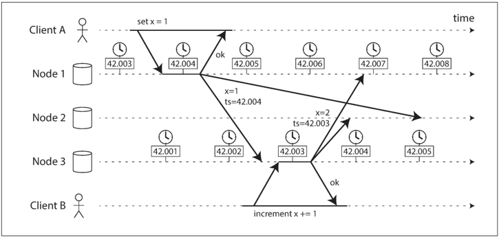

42.005

42.006

42.007

42.008

Figure 8-3. The write by client B is causally later than the write by client A, but B's write has an earlier timestamp.

In Figure 8-3, when a write is replicated to other nodes, it is tagged with a timestamp according to the time-of-day clock on the node where the write originated. The clock synchronization is very good in this example: the skew between node 1 and node 3 is less than 3 ms, which is probably better than you can expect in practice.

Nevertheless, the timestamps in Figure 8-3 fail to order the events correctly: the write x =  1  has  a  timestamp  of  42.004  seconds,  but  the  write x =  2  has  a  timestamp  of 42.003  seconds,  even  though x =  2  occurred  unambiguously  later.  When  node  2 receives these two events, it will incorrectly conclude that x =  1  is  the  more  recent value and drop the write x = 2. In effect, client B's increment operation will be lost.

This conflict resolution strategy is called last write wins (LWW), and it is widely used in both multi-leader replication and leaderless databases such as Cassandra [53] and Riak  [54]  (see  'Last  write  wins  (discarding  concurrent  writes)'  on  page  78).  Some implementations generate timestamps on the client rather than the server, but this doesn't change the fundamental problems with LWW:

- Database writes can mysteriously disappear: a node with a lagging clock is unable to overwrite values previously written by a node with a fast clock until the clock skew between the nodes has elapsed [54, 55]. This scenario can cause arbitrary amounts of data to be silently dropped without any error being reported to the application.
- LWW cannot distinguish between writes that occurred sequentially in quick succession  (in  Figure  8-3,  client  B's  increment  definitely  occurs after client  A's write)  and  writes  that  were  truly  concurrent  (neither  writer  was  aware  of  the other).  Additional  causality  tracking  mechanisms,  such  as  version  vectors,  are

set x = 1

time

needed  in  order  to  prevent  violations  of  causality  (see  'Detecting  Concurrent Writes' on page 76).

- It is possible for two nodes to independently generate writes with the same timestamp, especially when the clock only has millisecond resolution. An additional tiebreaker  value  (which  can  simply  be  a  large  random  number)  is  required  to resolve such conflicts, but this approach can also lead to violations of causality [53].

Thus, even though it is tempting to resolve conflicts by keeping the most 'recent' value and discarding others, it's important to be aware that the definition of 'recent' depends on a local time-of-day clock, which may well be incorrect. Even with tightly NTP-synchronized clocks, you could send a packet at timestamp 100 ms (according to the sender's clock) and have it arrive at timestamp 99 ms (according to the recipient's clock)-so it appears as though the packet arrived before it was sent, which is impossible.

Could NTP synchronization be made accurate enough that such incorrect orderings cannot occur? Probably not, because NTP's synchronization accuracy is itself limited by the network round-trip time, in addition to other sources of error such as quartz drift. For correct ordering, you would need the clock source to be significantly more accurate than the thing you are measuring (namely network delay).

So-called logical  clocks [56,  57],  which  are  based  on  incrementing  counters  rather than  an  oscillating  quartz  crystal,  are  a  safer  alternative  for  ordering  events  (see 'Detecting Concurrent Writes' on page 76). Logical clocks do not measure the time of  day  or  the  number  of  seconds  elapsed,  only  the  relative  ordering  of  events (whether one event happened before or after another). In contrast, time-of-day and monotonic  clocks,  which  measure  actual  elapsed  time,  are  also  known  as physical clocks . We'll look at ordering a bit more in Chapter 9.

## Clock readings have a confidence interval

You may be able to read a machine's time-of-day clock with microsecond or even nanosecond  resolution.  But  even  if  you  can  get  such  a  fine-grained  measurement, that  doesn't  mean  the  value  is  actually  accurate  to  such  precision.  In  fact,  it  most likely  is  not-as  mentioned  previously,  the  drift  in  an  imprecise  quartz  clock  can easily  be  several  milliseconds,  even  if  you  synchronize  with  an  NTP  server  on  the local network every minute. With an NTP server on the public internet, the best possible accuracy is probably to the tens of milliseconds, and the error may easily spike to over 100 ms when there is network congestion [57].

Thus, it doesn't make sense to think of a clock reading as a point in time-it is more like a range of times, within a confidence interval: for example, a system may be 95% confident that the time now is between 10.3 and 10.5 seconds past the minute, but it

doesn't know any more precisely than that [58]. If we only know the time +/- 100 ms, the microsecond digits in the timestamp are essentially meaningless.

The uncertainty bound can be calculated based on your time source. If you have a GPS  receiver  or  atomic  (caesium)  clock  directly  attached  to  your  computer,  the expected error range is reported by the manufacturer. If you're getting the time from a  server,  the  uncertainty  is  based  on  the  expected  quartz  drift  since  your  last  sync with the server, plus the NTP server's uncertainty, plus the network round-trip time to the server (to a first approximation, and assuming you trust the server).

Unfortunately, most systems don't expose this uncertainty: for example, when you call clock\_gettime() ,  the  return  value  doesn't  tell  you  the  expected  error  of  the timestamp, so you don't know if its confidence interval is five milliseconds or five years.

An interesting exception is Google's TrueTime API in Spanner [41], which explicitly reports the confidence interval on the local clock. When you ask it for the current time, you get back two values: [ earliest , latest ] ,  which are the earliest  possible and  the latest  possible timestamp.  Based  on  its  uncertainty  calculations,  the  clock knows that the actual current time is somewhere within that interval. The width of the  interval  depends,  among  other  things,  on  how  long  it  has  been  since  the  local quartz clock was last synchronized with a more accurate clock source.

## Synchronized clocks for global snapshots

In Chapter 7 we discussed snapshot isolation ,  which is a very useful feature in databases that need to support both small, fast read-write transactions and large, longrunning  read-only  transactions  (e.g.,  for  backups  or  analytics).  It  allows  read-only transactions  to  see  the  database  in  a  consistent  state  at  a  particular  point  in  time, without locking and interfering with read-write transactions.

The most common implementation of snapshot isolation requires a monotonically increasing transaction ID. If a write happened later than the snapshot (i.e., the write has a greater transaction ID than the snapshot), that write is invisible to the snapshot transaction. On a single-node database, a simple counter is sufficient for generating transaction IDs.

However, when a database is distributed across many machines, potentially in multiple  datacenters,  a  global,  monotonically  increasing  transaction  ID  (across  all  partitions)  is  difficult  to  generate,  because  it  requires  coordination.  The  transaction  ID must reflect causality: if transaction B reads a value that was written by transaction A, then B must have a higher transaction ID than A-otherwise, the snapshot would not

be consistent. With lots of small, rapid transactions, creating transaction IDs in a distributed system becomes an untenable bottleneck. vi

Can we use the timestamps from synchronized time-of-day clocks as transaction IDs? If we could get the synchronization good enough, they would have the right properties: later transactions have a higher timestamp. The problem, of course, is the uncertainty about clock accuracy.

Spanner implements snapshot isolation across datacenters in this way [59, 60]. It uses the clock's confidence interval as reported by the TrueTime API, and is based on the following observation: if you have two confidence intervals, each consisting of an earliest  and  latest  possible  timestamp  ( A =  [ Aearliest , Alatest ]  and B =  [ B earliest , B latest ]),  and those two intervals do not overlap (i.e., Aearliest &lt; Alatest &lt; B earliest &lt; B latest ),  then B definitely happened after A-there can be no doubt. Only if the intervals overlap are we unsure in which order A and B happened.

In order to ensure that transaction timestamps reflect causality, Spanner deliberately waits for the length of the confidence interval before committing a read-write transaction. By doing so, it ensures that any transaction that may read the data is at a sufficiently later time, so their confidence intervals do not overlap. In order to keep the wait time as short as possible, Spanner needs to keep the clock uncertainty as small as possible;  for  this  purpose,  Google  deploys  a  GPS  receiver  or  atomic  clock  in  each datacenter, allowing clocks to be synchronized to within about 7 ms [41].

Using clock synchronization for distributed transaction semantics is an area of active research [57, 61, 62]. These ideas are interesting, but they have not yet been implemented in mainstream databases outside of Google.

## Process Pauses

Let's consider another example of dangerous clock use in a distributed system. Say you have a database with a single leader per partition. Only the leader is allowed to accept writes. How does a node know that it is still leader (that it hasn't been declared dead by the others), and that it may safely accept writes?

One option is for the leader to obtain a lease from the other nodes, which is similar to a lock with a timeout [63]. Only one node can hold the lease at any one time-thus, when a node obtains a lease, it knows that it is the leader for some amount of time, until the lease expires. In order to remain leader, the node must periodically renew

vi. There are distributed sequence number generators, such as Twitter's Snowflake, that generate approximately monotonically increasing unique IDs in a scalable way (e.g., by allocating blocks of the ID space to different nodes). However, they typically cannot guarantee an ordering that is consistent with causality, because the timescale at which blocks of IDs are assigned is longer than the timescale of database reads and writes. See also Chapter 9.

the  lease  before  it  expires.  If  the  node  fails,  it  stops  renewing  the  lease,  so  another node can take over when it expires.

You can imagine the request-handling loop looking something like this:

```
while ( true ) { request = getIncomingRequest(); // Ensure that the lease always has at least 10 seconds remaining if (lease.expiryTimeMillis - System.currentTimeMillis() < 10000) { lease = lease.renew(); } if (lease.isValid()) { process(request); } }
```

What's wrong with this code? Firstly, it's relying on synchronized clocks: the expiry time on the lease is set by a different machine (where the expiry may be calculated as the current time plus 30 seconds, for example), and it's being compared to the local system clock. If the clocks are out of sync by more than a few seconds, this code will start doing strange things.

Secondly, even if we change the protocol to only use the local monotonic clock, there is  another problem: the code assumes that very little time passes between the point that  it  checks  the  time  ( System.currentTimeMillis() )  and  the  time  when  the request is processed ( process(request) ).  Normally this code runs very quickly, so the 10 second buffer is more than enough to ensure that the lease doesn't expire in the middle of processing a request.

However, what if there is an unexpected pause in the execution of the program? For example, imagine the thread stops for 15 seconds around the line lease.isValid() before finally continuing. In that case, it's likely that the lease will have expired by the time  the  request  is  processed,  and  another  node  has  already  taken  over  as  leader. However, there is nothing to tell this thread that it was paused for so long, so this code won't notice that the lease has expired until the next iteration of the loop-by which time it may have already done something unsafe by processing the request.

Is it crazy to assume that a thread might be paused for so long? Unfortunately not. There are various reasons why this could happen:

- Many programming language runtimes (such as the Java Virtual Machine) have a garbage  collector (GC)  that  occasionally  needs  to  stop  all  running  threads. These 'stop-the-world' GC pauses have sometimes been known to last for several minutes  [64]!  Even  so-called  'concurrent'  garbage  collectors  like  the  HotSpot JVM's  CMS  cannot  fully  run  in  parallel  with  the  application  code-even  they need to stop the world from time to time [65]. Although the pauses can often be

|

reduced  by  changing  allocation  patterns  or  tuning  GC  settings  [66],  we  must assume the worst if we want to offer robust guarantees.

- In  virtualized  environments,  a  virtual  machine  can  be suspended (pausing  the execution  of  all  processes  and  saving  the  contents  of  memory  to  disk)  and resumed (restoring  the  contents  of  memory  and  continuing  execution).  This pause can occur at any time in a process's execution and can last for an arbitrary length  of  time.  This  feature  is  sometimes  used  for live  migration of  virtual machines from one host to another without a reboot, in which case the length of the pause depends on the rate at which processes are writing to memory [67].
- On  end-user  devices  such  as  laptops,  execution  may  also  be  suspended  and resumed arbitrarily, e.g., when the user closes the lid of their laptop.
- When  the  operating  system  context-switches  to  another  thread,  or  when  the hypervisor  switches  to  a  different  virtual  machine  (when  running  in  a  virtual machine), the currently running thread can be paused at any arbitrary point in the code. In the case of a virtual machine, the CPU time spent in other virtual machines is known as steal time . If the machine is under heavy load-i.e., if there is  a  long  queue  of  threads  waiting  to  run-it  may  take  some  time  before  the paused thread gets to run again.
- If  the  application  performs  synchronous  disk  access,  a  thread  may  be  paused waiting for a slow disk I/O operation to complete [68]. In many languages, disk access  can  happen  surprisingly,  even  if  the  code  doesn't  explicitly  mention  file access-for example, the Java classloader lazily loads class files when they are first used, which could happen at any time in the program execution. I/O pauses and GC pauses may even conspire to combine their delays [69]. If the disk is actually a network filesystem or network block device (such as Amazon's EBS), the I/O latency is further subject to the variability of network delays [29].
- If the operating system is configured to allow swapping to disk ( paging ), a simple memory access may result in a page fault that requires a page from disk to be loaded into memory. The thread is paused while this slow I/O operation takes place. If memory pressure is high, this may in turn require a different page to be swapped out to disk. In extreme circumstances, the operating system may spend most of its time swapping pages in and out of memory and getting little actual work done (this is known as thrashing ).  To avoid this problem, paging is often disabled on server machines (if you would rather kill a process to free up memory than risk thrashing).
- A Unix process can be paused by sending it the SIGSTOP signal, for example by pressing Ctrl-Z in a shell. This signal immediately stops the process from getting any more CPU cycles until it is resumed with SIGCONT , at which point it continues running where it left off. Even if your environment does not normally use SIGSTOP , it might be sent accidentally by an operations engineer.

All of these occurrences can preempt the running thread at any point and resume it at some later time, without the thread even noticing. The problem is similar to making multi-threaded  code  on  a  single  machine  thread-safe:  you  can't  assume  anything about timing, because arbitrary context switches and parallelism may occur.

When writing multi-threaded code on a single machine, we have fairly good tools for making it  thread-safe:  mutexes,  semaphores,  atomic  counters,  lock-free  data  structures, blocking queues, and so on. Unfortunately, these tools don't directly translate to  distributed  systems,  because  a  distributed  system  has  no  shared  memory-only messages sent over an unreliable network.

A node in a distributed system must assume that its execution can be paused for a significant length of time at any point, even in the middle of a function. During the pause,  the  rest  of  the  world  keeps  moving  and  may  even  declare  the  paused  node dead because it's not responding. Eventually, the paused node may continue running, without even noticing that it was asleep until it checks its clock sometime later.

## Response time guarantees

In many programming languages and operating systems, threads and processes may pause for an unbounded amount of time, as discussed. Those reasons for pausing can be eliminated if you try hard enough.

Some software runs in environments where a failure to respond within a specified time can cause serious damage: computers that control aircraft, rockets, robots, cars, and  other  physical  objects  must  respond  quickly  and  predictably  to  their  sensor inputs.  In  these  systems,  there  is  a  specified deadline by  which  the  software  must respond; if it doesn't meet the deadline, that may cause a failure of the entire system. These are so-called hard real-time systems.


## Is real-time really real?

In  embedded  systems, real-time means  that  a  system  is  carefully designed and tested to meet specified timing guarantees in all circumstances. This meaning is in contrast to the more vague use of the term real-time on the web, where it describes servers pushing data to clients and stream processing without hard response time constraints (see Chapter 11).

For example, if your car's onboard sensors detect that you are currently experiencing a crash, you wouldn't want the release of the airbag to be delayed due to an inopportune GC pause in the airbag release system.

Providing  real-time  guarantees  in  a  system  requires  support  from  all  levels  of  the software stack: a real-time operating system (RTOS) that allows processes to be scheduled with a guaranteed allocation of CPU time in specified intervals is needed; library

functions must document their worst-case execution times; dynamic memory allocation may be restricted or disallowed entirely (real-time garbage collectors exist, but the application must still ensure that it doesn't give the GC too much work to do); and an enormous amount of testing and measurement must be done to ensure that guarantees are being met.

All of this requires a large amount of additional work and severely restricts the range of  programming  languages,  libraries,  and  tools  that  can  be  used  (since  most  languages and tools do not provide real-time guarantees). For these reasons, developing real-time  systems  is  very  expensive,  and  they  are  most  commonly  used  in  safetycritical embedded  devices. Moreover, 'real-time' is not the same as 'highperformance'-in  fact,  real-time  systems  may  have  lower  throughput,  since  they have to prioritize timely responses above all else (see also 'Latency and Resource Utilization' on page 104).

For  most  server-side  data  processing  systems,  real-time  guarantees  are  simply  not economical or appropriate. Consequently, these systems must suffer the pauses and clock instability that come from operating in a non-real-time environment.

## Limiting the impact of garbage collection

The negative effects of process pauses can be mitigated without resorting to expensive  real-time  scheduling  guarantees.  Language  runtimes  have  some  flexibility around when they schedule garbage collections,  because  they  can  track  the  rate  of object allocation and the remaining free memory over time.

An emerging idea is to treat GC pauses like brief planned outages of a node, and to let other nodes handle requests from clients while one node is collecting its garbage. If  the  runtime can warn the application that a node soon requires a GC pause, the application can stop sending new requests to that node, wait for it to finish processing outstanding requests, and then perform the GC while no requests are in progress. This trick hides GC pauses from clients and reduces the high percentiles of response time [70, 71]. Some latency-sensitive financial trading systems [72] use this approach.

A  variant  of  this  idea  is  to  use  the  garbage  collector  only  for  short-lived  objects (which are fast to collect) and to restart processes periodically, before they accumulate enough long-lived objects to require a full GC of long-lived objects [65, 73]. One node can be restarted at a time, and traffic can be shifted away from the node before the planned restart, like in a rolling upgrade (see Chapter 4).

These measures cannot fully prevent garbage collection pauses, but they can usefully reduce their impact on the application.

## Knowledge, Truth, and Lies

So far in this chapter we have explored the ways in which distributed systems are different from programs running on a single computer: there is no shared memory, only message passing via an unreliable network with variable delays, and the systems may suffer from partial failures, unreliable clocks, and processing pauses.

The consequences of these issues are profoundly disorienting if you're not used to distributed systems. A node in the network cannot know anything for sure-it can only make guesses based on the messages it receives (or doesn't receive) via the network. A node can only find out what state another node is in (what data it has stored, whether it is correctly functioning, etc.) by exchanging messages with it. If a remote node doesn't respond, there is no way of knowing what state it is in, because problems in the network cannot reliably be distinguished from problems at a node.

Discussions of these systems border on the philosophical: What do we know to be true or false in our system? How sure can we be of that knowledge, if the mechanisms for  perception  and  measurement  are  unreliable?  Should  software  systems  obey  the laws that we expect of the physical world, such as cause and effect?

Fortunately, we don't need to go as far as figuring out the meaning of life. In a distributed system, we can state the assumptions we are making about the behavior (the system model ) and design the actual system in such a way that it meets those assumptions. Algorithms can be proved to function correctly within a certain system model. This means that reliable behavior is achievable, even if the underlying system model provides very few guarantees.

However, although it is possible to make software well behaved in an unreliable system model, it is not straightforward to do so. In the rest of this chapter we will further explore the notions of knowledge and truth in distributed systems, which will help us think about the kinds of assumptions we can make and the guarantees we may want to  provide.  In  Chapter  9  we  will  proceed  to  look  at  some  examples  of  distributed algorithms that provide particular guarantees under particular assumptions.

## The Truth Is Defined by the Majority

Imagine a network with an asymmetric fault: a node is able to receive all messages sent to it,  but  any  outgoing  messages  from that node are dropped or delayed [19]. Even though that node is working perfectly well, and is receiving requests from other nodes,  the  other  nodes  cannot  hear  its  responses.  After  some  timeout,  the  other nodes  declare  it  dead,  because  they  haven't  heard  from  the  node.  The  situation unfolds  like  a  nightmare:  the  semi-disconnected  node  is  dragged  to  the  graveyard, kicking and screaming 'I'm not dead!'-but since nobody can hear its screaming, the funeral procession continues with stoic determination.

In a slightly less nightmarish scenario, the semi-disconnected node may notice that the messages it is sending are not being acknowledged by other nodes, and so realize that there must be a fault in the network. Nevertheless, the node is wrongly declared dead by the other nodes, and the semi-disconnected node cannot do anything about it.

As a third scenario, imagine a node that experiences a long stop-the-world garbage collection pause. All of the node's threads are preempted by the GC and paused for one minute, and consequently, no requests are processed and no responses are sent. The other nodes wait, retry, grow impatient, and eventually declare the node dead and load it onto the hearse. Finally, the GC finishes and the node's threads continue as  if  nothing  had  happened. The other nodes are surprised as the supposedly dead node suddenly raises its head out of the coffin, in  full  health,  and  starts  cheerfully chatting with bystanders. At first, the GCing node doesn't even realize that an entire minute has passed and that it was declared dead-from its perspective, hardly any time has passed since it was last talking to the other nodes.

The moral of these stories is that a node cannot necessarily trust its own judgment of a situation. A distributed system cannot exclusively rely on a single node, because a node may fail at any time, potentially leaving the system stuck and unable to recover. Instead,  many  distributed  algorithms  rely  on  a quorum ,  that  is,  voting  among  the nodes (see 'Quorums for reading and writing' on page 71): decisions require some minimum number of votes from several nodes in order to reduce the dependence on any one particular node.

That includes decisions about declaring nodes dead. If a quorum of nodes declares another node dead, then it must be considered dead, even if that node still very much feels alive. The individual node must abide by the quorum decision and step down.

Most commonly, the quorum is an absolute majority of more than half the nodes (although other kinds of quorums are possible). A majority quorum allows the system to continue working if individual nodes have failed (with three nodes, one failure can be tolerated; with five nodes, two failures can be tolerated). However, it is still safe, because there can only be only one majority in the system-there cannot be two majorities with conflicting decisions at the same time. We will discuss the use of quorums in more detail when we get to consensus algorithms in Chapter 9.

## The leader and the lock

Frequently, a system requires there to be only one of some thing. For example:

- Only one node is allowed to be the leader for a database partition, to avoid split brain (see 'Handling Node Outages' on page 48).
- Only one transaction or client is allowed to hold the lock for a particular resource or object, to prevent concurrently writing to it and corrupting it.

Lock service

Client 1

Client 2

Storage get

lease lease

expired,

- Only one user is allowed to register a particular username, because a username must uniquely identify a user. write data

Implementing this in a distributed system requires care: even if a node believes that it is  'the  chosen  one'  (the  leader  of  the  partition,  the  holder  of  the  lock,  the  request handler of the user who successfully grabbed the username), that doesn't necessarily mean a quorum of nodes agrees! A node may have formerly been the leader, but if the other nodes declared it dead in the meantime (e.g., due to a network interruption or GC pause), it may have been demoted and another leader may have already been elected.

If a node continues acting as the chosen one, even though the majority of nodes have declared it dead, it could cause problems in a system that is not carefully designed. Such a node could send messages to other nodes in its self-appointed capacity, and if other nodes believe it, the system as a whole may do something incorrect.

For example, Figure 8-4 shows a data corruption bug due to an incorrect implementation of locking. (The bug is not theoretical: HBase used to have this problem [74, 75].) Say you want to ensure that a file in a storage service can only be accessed by one  client  at  a  time,  because  if  multiple  clients  tried  to  write  to  it,  the  file  would become corrupted. You try to implement this by requiring a client to obtain a lease from a lock service before accessing the file.

Figure 8-4. Incorrect implementation of a distributed lock: client 1 believes that it still has a valid lease, even though it has expired, and thus corrupts a file in storage.

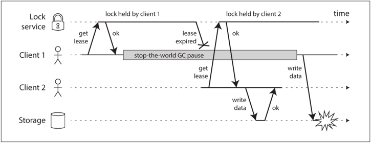

The problem is an example of what we discussed in 'Process Pauses' on page 113: if the client holding the lease is paused for too long, its lease expires. Another client can obtain a lease for the same file, and start writing to the file. When the paused client comes back, it believes (incorrectly) that it still has a valid lease and proceeds to also write to the file. As a result, the clients' writes clash and corrupt the file.

lock held by client 1

ok lock held by client 2

ok time

Lock service

Client 1

Client 2

Storage get

lock held by client 1

ok, lease

token: 33

## Fencing tokens

lease expired

stop-the-world GC pause

When using a lock or lease to protect access to some resource, such as the file storage in Figure 8-4, we need to ensure that a node that is under a false belief of being 'the chosen one' cannot disrupt the rest of the system. A fairly simple technique that achieves this goal is called fencing , and is illustrated in Figure 8-5.

Figure 8-5. Making access to storage safe by allowing writes only in the order of increasing fencing tokens.

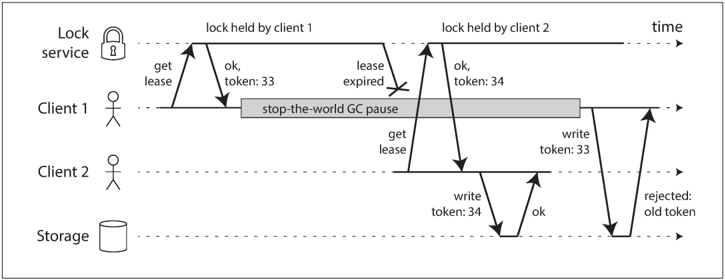

Let's assume that every time the lock server grants a lock or lease, it also returns a fencing  token ,  which  is  a  number  that  increases  every  time  a  lock  is  granted  (e.g., incremented by the lock service). We can then require that every time a client sends a write request to the storage service, it must include its current fencing token.

In Figure 8-5, client 1 acquires the lease with a token of 33, but then it goes into a long pause and the lease expires. Client 2 acquires the lease with a token of 34 (the number  always  increases)  and  then  sends  its  write  request  to  the  storage  service, including the token of 34. Later, client 1 comes back to life and sends its write to the storage service, including its token value 33. However, the storage server remembers that it has already processed a write with a higher token number (34), and so it rejects the request with token 33.

If  ZooKeeper  is  used  as  lock  service,  the  transaction  ID zxid or  the  node  version cversion can be used as fencing token. Since they are guaranteed to be monotonically increasing, they have the required properties [74].

Note that this mechanism requires the resource itself to take an active role in checking tokens by rejecting any writes with an older token than one that has already been processed-it is not sufficient to rely on clients checking their lock status themselves. For resources that do not explicitly support fencing tokens, you might still be able work  around  the  limitation  (for  example,  in  the  case  of  a  file  storage  service  you could  include  the  fencing  token  in  the  filename).  However,  some  kind  of  check  is necessary to avoid processing requests outside of the lock's protection.

lock held by client 2

ok, token: 34

time

- ›

Checking a token on the server side may seem like a downside, but it is arguably a good  thing:  it  is  unwise  for  a  service  to  assume  that  its  clients  will  always  be  well behaved, because the clients are often run by people whose priorities are very different from the priorities of the people running the service [76]. Thus, it is a good idea for any service to protect itself from accidentally abusive clients.

## Byzantine Faults

Fencing tokens can detect and block a node that is inadvertently acting in error (e.g., because it hasn't yet found out that its lease has expired). However, if the node deliberately  wanted  to  subvert  the  system's  guarantees,  it  could  easily  do  so  by  sending messages with a fake fencing token.

In  this  book  we  assume  that  nodes  are  unreliable  but  honest:  they  may  be  slow  or never respond (due to a fault), and their state may be outdated (due to a GC pause or network delays), but we assume that if a node does respond, it is telling the 'truth': to the best of its knowledge, it is playing by the rules of the protocol.

Distributed systems problems become much harder if there is a risk that nodes may 'lie' (send arbitrary faulty or corrupted responses)-for example, if a node may claim to have received a particular message when in fact it didn't. Such behavior is known as a Byzantine fault , and the problem of reaching consensus in this untrusting environment is known as the Byzantine Generals Problem [77].

## The Byzantine Generals Problem

The  Byzantine  Generals  Problem  is  a  generalization  of  the  so-called Two Generals Problem [78], which imagines a situation in which two army generals need to agree on a battle plan. As they have set up camp on two different sites, they can only communicate by messenger, and the messengers sometimes get delayed or lost (like packets in a network). We will discuss this problem of consensus in Chapter 9.

In the Byzantine version of the problem, there are n generals who need to agree, and their  endeavor  is  hampered  by  the  fact  that  there  are  some  traitors  in  their  midst. Most of the generals are loyal, and thus send truthful messages, but the traitors may try to deceive and confuse the others by sending fake or untrue messages (while trying to remain undiscovered). It is not known in advance who the traitors are.

Byzantium was an ancient Greek city that later became Constantinople, in the place which is now Istanbul in Turkey. There isn't any historic evidence that the generals of Byzantium  were  any  more  prone  to  intrigue  and  conspiracy  than  those  elsewhere. Rather, the name is derived from Byzantine in  the  sense  of excessively  complicated, bureaucratic, devious , which was used in politics long before computers [79]. Lamport  wanted  to  choose  a  nationality  that  would  not  offend  any  readers,  and  he  was advised that calling it The Albanian Generals Problem was not such a good idea [80].

A system is Byzantine fault-tolerant if  it  continues to operate correctly even if some of the nodes are malfunctioning and not obeying the protocol, or if malicious attackers are interfering with the network. This concern is relevant in certain specific circumstances. For example:

- In  aerospace  environments,  the  data  in  a  computer's  memory  or  CPU  register could  become  corrupted  by  radiation,  leading  it  to  respond  to  other  nodes  in arbitrarily  unpredictable  ways.  Since  a  system  failure  would  be  very  expensive (e.g.,  an  aircraft  crashing  and  killing  everyone  on  board,  or  a  rocket  colliding with the International Space Station), flight control systems must tolerate Byzantine faults [81, 82].
- In  a  system  with  multiple  participating  organizations,  some  participants  may attempt  to  cheat  or  defraud  others.  In  such  circumstances,  it  is  not  safe  for  a node to simply trust another node's messages, since they may be sent with malicious  intent.  For  example,  peer-to-peer  networks  like  Bitcoin  and  other  blockchains can be considered to be a way of getting mutually untrusting parties to agree  whether  a  transaction  happened  or  not,  without  relying  on  a  central authority [83].

However,  in  the  kinds  of  systems  we  discuss  in  this  book,  we  can  usually  safely assume that there are no Byzantine faults. In your datacenter, all the nodes are controlled by your organization (so they can hopefully be trusted) and radiation levels are low enough that memory corruption is not a major problem. Protocols for making  systems  Byzantine  fault-tolerant  are  quite  complicated  [84],  and  fault-tolerant embedded systems rely on support from the hardware level [81]. In most server-side data  systems,  the  cost  of  deploying  Byzantine  fault-tolerant  solutions  makes  them impracticable.

Web applications do need to expect arbitrary and malicious behavior of clients that are under end-user control, such as web browsers. This is why input validation, sanitization, and output escaping are so important: to prevent SQL injection and crosssite scripting, for example. However, we typically don't use Byzantine fault-tolerant protocols  here,  but  simply  make  the  server  the  authority  on  deciding  what  client behavior is and isn't allowed. In peer-to-peer networks, where there is no such central authority, Byzantine fault tolerance is more relevant.

A bug in the software could be regarded as a Byzantine fault, but if you deploy the same software to all nodes, then a Byzantine fault-tolerant algorithm cannot save you. Most Byzantine fault-tolerant algorithms require a supermajority of more than twothirds of the nodes to be functioning correctly (i.e., if you have four nodes, at most one may malfunction). To use this approach against bugs, you would have to have four  independent  implementations of  the  same  software  and  hope  that  a  bug  only appears in one of the four implementations.

Similarly,  it  would  be  appealing  if  a  protocol  could  protect  us  from  vulnerabilities, security  compromises,  and  malicious  attacks.  Unfortunately,  this  is  not  realistic either: in most systems, if an attacker can compromise one node, they can probably compromise all of them, because they are probably running the same software. Thus, traditional mechanisms (authentication, access control, encryption, firewalls, and so on) continue to be the main protection against attackers.

## Weak forms of lying

Although we assume that nodes are generally honest, it can be worth adding mechanisms  to  software  that  guard  against  weak  forms  of  'lying'-for  example,  invalid messages due to hardware issues, software bugs, and misconfiguration. Such protection  mechanisms  are  not  full-blown  Byzantine  fault  tolerance,  as  they  would  not withstand  a  determined  adversary,  but  they  are  nevertheless  simple  and  pragmatic steps toward better reliability. For example:

- Network packets do sometimes get corrupted due to hardware issues or bugs in operating systems, drivers, routers, etc. Usually, corrupted packets are caught by the checksums built into TCP and UDP, but sometimes they evade detection [85, 86,  87].  Simple  measures  are  usually  sufficient  protection  against  such  corruption, such as checksums in the application-level protocol.
- A publicly accessible application must carefully sanitize any inputs from users, for example checking that a value is within a reasonable range and limiting the size of strings to prevent denial of service through large memory allocations. An internal service behind a firewall may be able to get away with less strict checks on  inputs,  but  some  basic  sanity-checking  of  values  (e.g.,  in  protocol  parsing [85]) is a good idea.
- NTP clients can be configured with multiple server addresses. When synchronizing,  the  client  contacts  all  of  them,  estimates  their  errors,  and  checks  that  a majority of servers agree on some time range. As long as most of the servers are okay, a misconfigured NTP server that is reporting an incorrect time is detected as  an  outlier  and  is  excluded  from  synchronization  [37].  The  use  of  multiple servers makes NTP more robust than if it only uses a single server.

## System Model and Reality

Many  algorithms  have  been  designed  to  solve  distributed  systems  problems-for example, we will examine solutions for the consensus problem in Chapter 9. In order to be useful, these algorithms need to tolerate the various faults of distributed systems that we discussed in this chapter.

Algorithms  need  to  be  written  in  a  way  that  does  not  depend  too  heavily  on  the details  of  the  hardware  and  software  configuration  on  which  they  are  run.  This  in

turn requires that we somehow formalize the kinds of faults that we expect to happen in  a  system.  We  do  this  by  defining  a system  model ,  which  is  an  abstraction  that describes what things an algorithm may assume.

With regard to timing assumptions, three system models are in common use:

Synchronous model

The synchronous model assumes bounded network delay, bounded process pauses, and bounded clock error. This does not imply exactly synchronized clocks or zero network delay; it just means you know that network delay, pauses, and clock drift will never exceed some fixed upper bound [88]. The synchronous model is not  a  realistic  model  of  most  practical  systems,  because  (as  discussed  in  this chapter) unbounded delays and pauses do occur.

Partially synchronous model

Partial synchrony means that a system behaves like a synchronous system most of the time , but it sometimes exceeds the bounds for network delay, process pauses, and clock drift [88]. This is a realistic model of many systems: most of the time, networks  and  processes  are  quite  well  behaved-otherwise  we  would  never  be able to get anything done-but we have to reckon with the fact that any timing assumptions may be shattered occasionally. When this happens, network delay, pauses, and clock error may become arbitrarily large.

Asynchronous model

In this model, an algorithm is not allowed to make any timing assumptions-in fact, it does not even have a clock (so it cannot use timeouts). Some algorithms can be designed for the asynchronous model, but it is very restrictive.

Moreover, besides timing issues, we have to consider node failures. The three most common system models for nodes are:

Crash-stop faults

In the crash-stop model, an algorithm may assume that a node can fail in only one  way,  namely  by  crashing.  This  means  that  the  node  may  suddenly  stop responding at any moment, and thereafter that node is gone forever-it never comes back.

Crash-recovery faults

We assume that nodes may crash at any moment, and perhaps start responding again after some unknown time. In the crash-recovery model, nodes are assumed to  have  stable  storage  (i.e.,  nonvolatile  disk  storage)  that  is  preserved  across crashes, while the in-memory state is assumed to be lost.

Byzantine (arbitrary) faults

Nodes may do absolutely anything, including trying to trick and deceive other nodes, as described in the last section.

For  modeling  real  systems,  the  partially  synchronous  model  with  crash-recovery faults  is  generally  the  most  useful  model.  But  how  do  distributed  algorithms  cope with that model?

## Correctness of an algorithm

To define what it means for an algorithm to be correct , we can describe its properties . For example, the output of a sorting algorithm has the property that for any two distinct elements of the output list, the element further to the left is smaller than the element further to the right. That is simply a formal way of defining what it means for a list to be sorted.

Similarly,  we  can  write  down  the  properties  we  want  of  a  distributed  algorithm  to define what it means to be correct. For example, if we are generating fencing tokens for a lock (see 'Fencing tokens' on page 121), we may require the algorithm to have the following properties:

## Uniqueness

No two requests for a fencing token return the same value.

Monotonic sequence

If request x returned token t x ,  and request y returned token t y ,  and x completed before y began, then t x &lt; t y .

Availability

A node that requests a fencing token and does not crash eventually receives a response.

An algorithm is correct in some system model if it always satisfies its properties in all situations that we assume may occur in that system model. But how does this make sense? If all nodes crash, or all network delays suddenly become infinitely long, then no algorithm will be able to get anything done.

## Safety and liveness

To  clarify  the  situation,  it  is  worth  distinguishing  between  two  different  kinds  of properties: safety and liveness properties. In the example just given, uniqueness and monotonic sequence are safety properties, but availability is a liveness property.

What distinguishes the two kinds of properties? A giveaway is that liveness properties often  include  the  word  'eventually'  in  their  definition.  (And  yes,  you  guessed  iteventual consistency is a liveness property [89].)

Safety is often informally defined as nothing bad happens ,  and liveness as something good eventually happens . However, it's best to not read too much into those informal definitions, because the meaning of good and bad is subjective. The actual definitions of safety and liveness are precise and mathematical [90]:

- If a safety property is violated, we can point at a particular point in time at which it was broken (for example, if the uniqueness property was violated, we can identify  the  particular  operation  in  which  a  duplicate  fencing  token  was  returned). After a safety property has been violated, the violation cannot be undone-the damage is already done.
- A liveness property works the other way round: it may not hold at some point in time  (for  example,  a  node  may  have  sent  a  request  but  not  yet  received  a response), but there is always hope that it may be satisfied in the future (namely by receiving a response).

An advantage of distinguishing between safety and liveness properties is that it helps us  deal  with  difficult  system  models.  For  distributed  algorithms,  it  is  common  to require that safety properties always hold, in all possible situations of a system model [88]. That is, even if all nodes crash, or the entire network fails, the algorithm must nevertheless ensure that it does not return a wrong result (i.e., that the safety properties remain satisfied).

However, with liveness properties we are allowed to make caveats: for example, we could say that a request needs to receive a response only if a majority of nodes have not crashed, and only if the network eventually recovers from an outage. The definition of the partially synchronous model requires that eventually the system returns to a synchronous state-that is, any period of network interruption lasts only for a finite duration and is then repaired.

## Mapping system models to the real world

Safety and liveness properties and system models are very useful for reasoning about the  correctness  of  a  distributed  algorithm.  However,  when  implementing  an  algorithm  in  practice,  the  messy  facts  of  reality  come  back  to  bite  you  again,  and  it becomes clear that the system model is a simplified abstraction of reality.

For example, algorithms in the crash-recovery model generally assume that data in stable storage survives crashes. However, what happens if the data on disk is corrupted, or the data is wiped out due to hardware error or misconfiguration [91]? What happens  if  a  server  has  a  firmware  bug  and  fails  to  recognize  its  hard  drives  on reboot, even though the drives are correctly attached to the server [92]?

Quorum algorithms (see 'Quorums for reading and writing' on page 71) rely on a node remembering the data that it claims to have stored. If a node may suffer from amnesia  and  forget  previously  stored  data,  that  breaks  the  quorum  condition,  and thus breaks the correctness of the algorithm. Perhaps a new system model is needed, in which we assume that stable storage mostly survives crashes, but may sometimes be lost. But that model then becomes harder to reason about.

The theoretical description of an algorithm can declare that certain things are simply assumed not to happen-and in non-Byzantine systems, we do have to make some assumptions about faults that can and cannot happen. However, a real implementation may still have to include code to handle the case where something happens that was assumed to be impossible, even if that handling boils down to printf("Sucks to be  you") and exit(666) -i.e.,  letting  a  human  operator  clean  up  the  mess  [93]. (This is arguably the difference between computer science and software engineering.)

That is not to say that theoretical, abstract system models are worthless-quite the opposite. They are incredibly helpful for distilling down the complexity of real systems to a manageable set of faults that we can reason about, so that we can understand the problem and try to solve it systematically. We can prove algorithms correct by showing that their properties always hold in some system model.

Proving an algorithm correct does not mean its implementation on a real system will necessarily always behave correctly. But it's a very good first step, because the theoretical analysis can uncover problems in an algorithm that might remain hidden for a long time in a real system, and that only come to bite you when your assumptions (e.g.,  about timing) are defeated due to unusual circumstances. Theoretical analysis and empirical testing are equally important.

## Summary

In  this  chapter  we  have  discussed  a  wide  range  of  problems  that  can  occur  in  distributed systems, including:

- Whenever you try to send a packet over the network, it may be lost or arbitrarily delayed. Likewise, the reply may be lost or delayed, so if you don't get a reply, you have no idea whether the message got through.
- A node's clock may be significantly out of sync with other nodes (despite your best efforts to set up NTP), it may suddenly jump forward or back in time, and relying on it is dangerous because you most likely don't have a good measure of your clock's confidence interval.
- A process may pause for a substantial amount of time at any point in its execution  (perhaps  due  to  a  stop-the-world  garbage  collector),  be  declared  dead  by other  nodes,  and  then  come  back  to  life  again  without  realizing  that  it  was paused.

The  fact  that  such partial  failures can  occur  is  the  defining  characteristic  of  distributed  systems.  Whenever  software  tries  to  do  anything  involving  other  nodes, there  is  the  possibility  that  it  may  occasionally  fail,  or  randomly  go  slow,  or  not respond at all (and eventually time out). In distributed systems, we try to build toler-

ance  of  partial  failures  into  software,  so  that  the  system  as  a  whole  may  continue functioning even when some of its constituent parts are broken.

To tolerate faults, the first step is to detect them, but even that is hard. Most systems don't have an accurate mechanism of detecting whether a node has failed, so most distributed algorithms rely on timeouts to determine whether a remote node is still available.  However,  timeouts  can't  distinguish  between  network  and  node  failures, and variable network delay sometimes causes a node to be falsely suspected of crashing. Moreover, sometimes a node can be in a degraded state: for example, a Gigabit network interface could suddenly drop to 1 Kb/s throughput due to a driver bug [94]. Such a node that is 'limping' but not dead can be even more difficult to deal with than a cleanly failed node.

Once a fault  is  detected,  making  a  system  tolerate  it  is  not  easy  either:  there  is  no global  variable,  no  shared  memory,  no  common  knowledge  or  any  other  kind  of shared  state  between  the  machines.  Nodes  can't  even  agree  on  what  time  it  is,  let alone  on  anything  more  profound.  The  only  way  information  can  flow  from  one node to another is by sending it over the unreliable network. Major decisions cannot be safely made by a single node, so we require protocols that enlist help from other nodes and try to get a quorum to agree.

If you're used to writing software in the idealized mathematical perfection of a single computer, where the same operation always deterministically returns the same result, then  moving  to  the  messy  physical  reality  of  distributed  systems  can  be  a  bit  of  a shock. Conversely, distributed systems engineers will often regard a problem as trivial if it can be solved on a single computer [5], and indeed a single computer can do a lot nowadays [95]. If you can avoid opening Pandora's box and simply keep things on a single machine, it is generally worth doing so.

However, as discussed in the introduction to Part II, scalability is not the only reason for wanting to use a distributed system. Fault tolerance and low latency (by placing data geographically close to users) are equally important goals, and those things cannot be achieved with a single node.

In this chapter we also went on some tangents to explore whether the unreliability of networks, clocks, and processes is an inevitable law of nature. We saw that it isn't: it is  possible  to  give  hard  real-time  response  guarantees  and  bounded  delays  in  networks,  but  doing  so  is  very  expensive  and  results  in  lower  utilization  of  hardware resources. Most non-safety-critical systems choose cheap and unreliable over expensive and reliable.

We also touched on supercomputers, which assume reliable components and thus have to be stopped and restarted entirely when a component does fail. By contrast, distributed  systems  can  run  forever  without  being  interrupted  at  the  service  level, because  all  faults  and  maintenance  can  be  handled  at  the  node  level-at  least  in

theory. (In practice, if a bad configuration change is rolled out to all nodes, that will still bring a distributed system to its knees.)

This chapter has been all about problems, and has given us a bleak outlook. In the next  chapter  we  will  move  on  to  solutions,  and  discuss  some  algorithms  that  have been designed to cope with the problems in distributed systems.

## References

[1] Mark Cavage: 'There's Just No Getting Around It: You're Building a Distributed System,' ACM  Queue , volume  11, number  4,  pages 80-89, April 2013. doi: 10.1145/2466486.2482856

[2]  Jay  Kreps:  'Getting  Real  About  Distributed  System  Reliability,' blog.empathybox.com , March 19, 2012.

[3]  Sydney  Padua: The Thrilling Adventures of Lovelace and Babbage: The (Mostly) True Story of the First Computer . Particular Books, April 2015. ISBN: 978-0-141-98151-2

[4] Coda Hale: 'You Can't Sacrifice Partition Tolerance,' codahale.com ,  October 7, 2010.

[5]  Jeff  Hodges:  'Notes  on  Distributed  Systems  for  Young  Bloods,' somethingsimilar.com , January 14, 2013.

[6]  Antonio  Regalado:  'Who  Coined  'Cloud  Computing'?,' technologyreview.com , October 31, 2011.

[7] Luiz André Barroso, Jimmy Clidaras, and Urs Hölzle: 'The Datacenter as a Computer:  An  Introduction  to  the  Design  of  Warehouse-Scale  Machines,  Second  Edition,' Synthesis Lectures on Computer Architecture ,  volume 8, number 3, Morgan &amp; Claypool Publishers, July 2013. doi:10.2200/S00516ED2V01Y201306CAC024, ISBN: 978-1-627-05010-4

[8] David Fiala, Frank Mueller, Christian Engelmann, et al.: 'Detection and Correction  of  Silent  Data  Corruption  for  Large-Scale  High-Performance  Computing,'  at International Conference for High Performance Computing, Networking, Storage and Analysis (SC12), November 2012.

[9] Arjun Singh, Joon Ong, Amit Agarwal, et al.: 'Jupiter Rising: A Decade of Clos Topologies  and  Centralized  Control  in  Google's  Datacenter  Network,'  at Annual Conference of the ACM Special Interest Group on Data Communication (SIGCOMM), August 2015. doi:10.1145/2785956.2787508

[10]  Glenn  K.  Lockwood:  'Hadoop's  Uncomfortable  Fit  in  HPC,' glennklockwood.blogspot.co.uk , May 16, 2014.

[11] John von Neumann: 'Probabilistic Logics and the Synthesis of Reliable Organisms from Unreliable Components,' in Automata Studies (AM-34) , edited by Claude E. Shannon and John McCarthy, Princeton University Press, 1956. ISBN: 978-0-691-07916-5

[12] Richard W. Hamming: The Art of Doing Science and Engineering . Taylor &amp; Francis, 1997. ISBN: 978-9-056-99500-3

[13] Claude E. Shannon: 'A Mathematical Theory of Communication,' The Bell System Technical Journal , volume 27, number 3, pages 379-423 and 623-656, July 1948.

[14] Peter Bailis and Kyle Kingsbury: 'The Network Is Reliable,' ACM Queue ,  volume 12, number 7, pages 48-55, July 2014. doi:10.1145/2639988.2639988

[15]  Joshua  B.  Leners,  Trinabh  Gupta,  Marcos  K.  Aguilera,  and  Michael  Walfish: 'Taming Uncertainty in Distributed Systems with Help from the Network,' at 10th European Conference on Computer Systems (EuroSys), April 2015. doi: 10.1145/2741948.2741976

[16]  Phillipa  Gill,  Navendu  Jain,  and  Nachiappan  Nagappan:  'Understanding  Network Failures in Data Centers: Measurement, Analysis, and Implications,' at ACM SIGCOMM Conference , August 2011. doi:10.1145/2018436.2018477

[17] Mark Imbriaco: 'Downtime Last Saturday,' github.com , December 26, 2012.

[18] Will Oremus: 'The Global Internet Is Being Attacked by Sharks, Google Confirms,' slate.com , August 15, 2014.

[19]  Marc  A.  Donges:  'Re:  bnx2  cards  Intermittantly  Going  Offline,'  Message  to Linux netdev mailing list, spinics.net , September 13, 2012.

[20] Kyle Kingsbury: 'Call Me Maybe: Elasticsearch,' aphyr.com , June 15, 2014.

[21]  Salvatore  Sanfilippo:  'A  Few  Arguments  About  Redis  Sentinel  Properties  and Fail Scenarios,' antirez.com , October 21, 2014.

[22] Bert Hubert: 'The Ultimate SO\_LINGER Page, or: Why Is My TCP Not Reliable,' blog.netherlabs.nl , January 18, 2009.

[23] Nicolas Liochon: 'CAP: If All You Have Is a Timeout, Everything Looks Like a Partition,' blog.thislongrun.com , May 25, 2015.

[24] Jerome H. Saltzer, David P. Reed, and David D. Clark: 'End-To-End Arguments in  System  Design,' ACM Transactions on Computer Systems ,  volume  2,  number  4, pages 277-288, November 1984. doi:10.1145/357401.357402

[25]  Matthew  P.  Grosvenor,  Malte  Schwarzkopf,  Ionel  Gog,  et  al.:  'Queues  Don't Matter  When You Can JUMP Them!,' at 12th  USENIX Symposium on Networked Systems Design and Implementation (NSDI), May 2015.

[26] Guohui Wang and T. S. Eugene Ng: 'The Impact of Virtualization on Network Performance of Amazon EC2 Data Center,' at 29th IEEE International Conference on Computer Communications (INFOCOM), March 2010. doi:10.1109/INFCOM. 2010.5461931

[27]  Van  Jacobson:  'Congestion  Avoidance  and  Control,'  at ACM Symposium on Communications Architectures and Protocols (SIGCOMM),  August  1988.  doi: 10.1145/52324.52356

[28] Brandon Philips: 'etcd: Distributed Locking and Service Discovery,' at Strange Loop , September 2014.

[29]  Steve  Newman:  'A  Systematic  Look  at  EC2  I/O,' blog.scalyr.com ,  October  16, 2012.

[30] Naohiro Hayashibara, Xavier Défago, Rami Yared, and Takuya Katayama: 'The ϕ  Accrual  Failure  Detector,'  Japan  Advanced  Institute  of  Science  and  Technology, School of Information Science, Technical Report IS-RR-2004-010, May 2004.

[31]  Jeffrey  Wang:  'Phi  Accrual  Failure  Detector,' ternarysearch.blogspot.co.uk , August 11, 2013.

[32]  Srinivasan  Keshav: An  Engineering  Approach  to  Computer  Networking:  ATM Networks,  the  Internet,  and  the  Telephone  Network .  Addison-Wesley  Professional, May 1997. ISBN: 978-0-201-63442-6

[33] Cisco, 'Integrated Services Digital Network,' docwiki.cisco.com .

[34] Othmar Kyas: ATM Networks .  International Thomson Publishing, 1995. ISBN: 978-1-850-32128-6

[35] 'InfiniBand FAQ,' Mellanox Technologies, December 22, 2014.

[36]  Jose  Renato  Santos,  Yoshio  Turner,  and  G.  (John)  Janakiraman:  'End-to-End Congestion  Control  for  InfiniBand,'  at 22nd  Annual  Joint  Conference  of  the  IEEE Computer and Communications Societies (INFOCOM), April 2003. Also published by HP  Laboratories  Palo  Alto,  Tech  Report  HPL-2002-359.  doi:10.1109/INFCOM. 2003.1208949

[37]  Ulrich  Windl,  David  Dalton,  Marc  Martinec,  and  Dale  R.  Worley:  'The  NTP FAQ and HOWTO,' ntp.org , November 2006.

[38]  John  Graham-Cumming:  'How  and  why  the  leap  second  affected  Cloudflare DNS,' blog.cloudflare.com , January 1, 2017.

[39] David Holmes: 'Inside the Hotspot VM: Clocks, Timers and Scheduling Events - Part I - Windows,' blogs.oracle.com , October 2, 2006.

[40]  Steve  Loughran:  'Time  on  Multi-Core,  Multi-Socket  Servers,' steveloughran.blogspot.co.uk , September 17, 2015.

[41]  James  C.  Corbett,  Jeffrey  Dean,  Michael  Epstein,  et  al.:  'Spanner:  Google's Globally-Distributed  Database,'  at 10th  USENIX  Symposium  on  Operating  System Design and Implementation (OSDI), October 2012.

[42]  M.  Caporaloni  and  R.  Ambrosini:  'How  Closely  Can  a  Personal  Computer Clock Track the UTC Timescale Via the Internet?,' European Journal of Physics , volume 23, number 4, pages L17-L21, June 2012. doi:10.1088/0143-0807/23/4/103

[43] Nelson Minar: 'A Survey of the NTP Network,' alumni.media.mit.edu , December 1999.

[44] Viliam Holub: 'Synchronizing Clocks in a Cassandra Cluster Pt. 1 - The Problem,' blog.rapid7.com , March 14, 2014.

[45]  Poul-Henning  Kamp:  'The  One-Second  War  (What  Time  Will  You  Die?),' ACM Queue , volume 9, number 4, pages 44-48, April 2011. doi: 10.1145/1966989.1967009

[46]  Nelson  Minar:  'Leap  Second  Crashes  Half  the  Internet,' somebits.com ,  July  3, 2012.

[47] Christopher Pascoe: 'Time, Technology and Leaping Seconds,' googleblog.blogspot.co.uk , September 15, 2011.

[48] Mingxue Zhao and Jeff Barr: 'Look Before You Leap - The Coming Leap Second and AWS,' aws.amazon.com , May 18, 2015.

[49] Darryl Veitch and Kanthaiah Vijayalayan: 'Network Timing and the 2015 Leap Second,'  at 17th  International  Conference  on  Passive  and  Active  Measurement (PAM), April 2016. doi:10.1007/978-3-319-30505-9\_29

[50] 'Timekeeping in VMware Virtual Machines,' Information Guide, VMware, Inc., December 2011.

[51] 'MiFID II / MiFIR: Regulatory Technical and Implementing Standards - Annex I  (Draft),'  European  Securities  and  Markets  Authority,  Report  ESMA/2015/1464, September 2015.

[52] Luke Bigum: 'Solving MiFID II Clock Synchronisation With Minimum Spend (Part 1),' lmax.com , November 27, 2015.

[53] Kyle Kingsbury: 'Call Me Maybe: Cassandra,' aphyr.com , September 24, 2013.

[54]  John  Daily:  'Clocks  Are  Bad,  or,  Welcome  to  the  Wonderful  World  of  Distributed Systems,' riak.com , November 12, 2013.

[55] Kyle Kingsbury: 'The Trouble with Timestamps,' aphyr.com , October 12, 2013.

[56] Leslie Lamport: 'Time, Clocks, and the Ordering of Events in a Distributed System,' Communications of the ACM , volume 21, number 7, pages 558-565, July 1978. doi:10.1145/359545.359563

[57] Sandeep Kulkarni, Murat Demirbas, Deepak Madeppa, et al.: 'Logical Physical Clocks and Consistent Snapshots in Globally Distributed Databases,' State University of  New  York  at  Buffalo,  Computer  Science  and  Engineering  Technical  Report 2014-04, May 2014.

[58]  Justin  Sheehy:  'There  Is  No  Now:  Problems  With  Simultaneity  in  Distributed Systems,' ACM  Queue ,  volume  13,  number  3,  pages  36-41,  March  2015.  doi: 10.1145/2733108

[59] Murat Demirbas: 'Spanner: Google's Globally-Distributed Database,' muratbuffalo.blogspot.co.uk , July 4, 2013.

[60]  Dahlia  Malkhi  and  Jean-Philippe  Martin:  'Spanner's  Concurrency  Control,' ACM  SIGACT  News ,  volume  44,  number  3,  pages  73-77,  September  2013.  doi: 10.1145/2527748.2527767

[61]  Manuel  Bravo,  Nuno  Diegues,  Jingna  Zeng,  et  al.:  'On  the  Use  of  Clocks  to Enforce Consistency in the Cloud,' IEEE Data Engineering Bulletin , volume 38, number 1, pages 18-31, March 2015.

[62] Spencer Kimball: 'Living Without Atomic Clocks,' cockroachlabs.com , February 17, 2016.

[63] Cary G. Gray and David R. Cheriton: 'Leases: An Efficient Fault-Tolerant Mechanism for Distributed File Cache Consistency,' at 12th ACM Symposium on Operating Systems Principles (SOSP), December 1989. doi:10.1145/74850.74870

[64] Todd Lipcon: 'Avoiding Full GCs in Apache HBase with MemStore-Local Allocation Buffers: Part 1,' blog.cloudera.com , February 24, 2011.

[65] Martin Thompson: 'Java Garbage Collection Distilled,' mechanicalsympathy.blogspot.co.uk , July 16, 2013.

[66]  Alexey  Ragozin:  'How  to  Tame  Java  GC  Pauses?  Surviving  16GiB  Heap  and Greater,' dzone.com , June 28, 2011.

[67] Christopher Clark, Keir Fraser, Steven Hand, et al.: 'Live Migration of Virtual Machines,' at 2nd USENIX Symposium on Symposium on Networked Systems Design &amp; Implementation (NSDI), May 2005.

[68] Mike Shaver: 'fsyncers and Curveballs,' shaver.off.net , May 25, 2008.

[69] Zhenyun Zhuang and Cuong Tran: 'Eliminating Large JVM GC Pauses Caused by Background IO Traffic,' engineering.linkedin.com , February 10, 2016.

[70] David Terei and Amit Levy: 'Blade: A Data Center Garbage Collector,' arXiv: 1504.02578, April 13, 2015.

[71] Martin Maas, Tim Harris, Krste Asanović, and John Kubiatowicz: 'Trash Day: Coordinating Garbage Collection in Distributed Systems,' at 15th USENIX Workshop on Hot Topics in Operating Systems (HotOS), May 2015.

[72]  'Predictable  Low  Latency,'  Cinnober  Financial  Technology  AB, cinnober.com , November 24, 2013.

[73] Martin Fowler: 'The LMAX Architecture,' martinfowler.com , July 12, 2011.

[74] Flavio P. Junqueira and Benjamin Reed: ZooKeeper: Distributed Process Coordination . O'Reilly Media, 2013. ISBN: 978-1-449-36130-3

[75] Enis Söztutar: 'HBase and HDFS: Understanding Filesystem Usage in HBase,' at HBaseCon , June 2013.

[76] Caitie McCaffrey: 'Clients Are Jerks: AKA How Halo 4 DoSed the Services at Launch &amp; How We Survived,' caitiem.com , June 23, 2015.

[77]  Leslie  Lamport,  Robert Shostak, and Marshall Pease: 'The Byzantine Generals Problem,' ACM Transactions  on  Programming  Languages  and  Systems (TOPLAS), volume 4, number 3, pages 382-401, July 1982. doi:10.1145/357172.357176

[78] Jim N. Gray: 'Notes on Data Base Operating Systems,' in Operating Systems: An Advanced Course , Lecture Notes in Computer Science, volume 60, edited by R. Bayer, R.  M.  Graham,  and  G.  Seegmüller,  pages  393-481,  Springer-Verlag,  1978.  ISBN: 978-3-540-08755-7

[79] Brian Palmer: 'How Complicated Was the Byzantine Empire?,' slate.com , October 20, 2011.

[80] Leslie Lamport: 'My Writings,' lamport.azurewebsites.net ,  December 16, 2014. This page can be found by searching the web for the 23-character string obtained by removing the hyphens from the string allla-mport-spubso-ntheweb .

[81] John Rushby: 'Bus Architectures for Safety-Critical Embedded Systems,' at 1st International Workshop on Embedded Software (EMSOFT), October 2001.

[82] Jake Edge: 'ELC: SpaceX Lessons Learned,' lwn.net , March 6, 2013.

[83]  Andrew  Miller  and  Joseph  J.  LaViola,  Jr.:  'Anonymous  Byzantine  Consensus from Moderately-Hard Puzzles: A Model for Bitcoin,' University of Central Florida, Technical Report CS-TR-14-01, April 2014.

[84] James Mickens: 'The Saddest Moment,' USENIX ;login: logout , May 2013.

[85] Evan Gilman: 'The Discovery of Apache ZooKeeper's Poison Packet,' pagerduty.com , May 7, 2015.

[86] Jonathan Stone and Craig Partridge: 'When the CRC and TCP Checksum Disagree,' at ACM Conference on Applications, Technologies, Architectures, and Protocols for Computer Communication (SIGCOMM), August 2000. doi: 10.1145/347059.347561

[87] Evan Jones: 'How Both TCP and Ethernet Checksums Fail,' evanjones.ca , October 5, 2015.

[88] Cynthia Dwork, Nancy Lynch, and Larry Stockmeyer: 'Consensus in the Presence of Partial Synchrony,' Journal of the ACM ,  volume 35, number 2, pages 288323, April 1988. doi:10.1145/42282.42283

[89] Peter Bailis and Ali Ghodsi: 'Eventual Consistency Today: Limitations, Extensions,  and  Beyond,' ACM Queue ,  volume 11, number 3, pages 55-63, March 2013. doi:10.1145/2460276.2462076

[90] Bowen Alpern and Fred B. Schneider: 'Defining Liveness,' Information Processing Letters , volume 21, number 4, pages 181-185, October 1985. doi: 10.1016/0020-0190(85)90056-0

[91] Flavio P. Junqueira: 'Dude, Where's My Metadata?,' fpj.me , May 28, 2015.

[92] Scott Sanders: 'January 28th Incident Report,' github.com , February 3, 2016.

[93] Jay Kreps: 'A Few Notes on Kafka and Jepsen,' blog.empathybox.com ,  September 25, 2013.

[94]  Thanh  Do,  Mingzhe  Hao,  Tanakorn  Leesatapornwongsa,  et  al.:  'Limplock: Understanding the Impact of Limpware on Scale-out Cloud Systems,' at 4th  ACM Symposium on Cloud Computing (SoCC), October 2013. doi: 10.1145/2523616.2523627

[95] Frank McSherry, Michael Isard, and Derek G. Murray: 'Scalability! But at What COST?,' at 15th  USENIX Workshop on Hot Topics in Operating Systems (HotOS), May 2015.

## About the Author

Martin Kleppmann is a researcher in distributed systems at the University of Cambridge, UK. Previously he was a software engineer and entrepreneur at internet companies  including  LinkedIn  and  Rapportive,  where  he  worked  on  large-scale  data infrastructure. In the process he learned a few things the hard way, and he hopes this book will save you from repeating the same mistakes.

Martin  is  a  regular  conference  speaker,  blogger,  and  open  source  contributor.  He believes  that  profound  technical  ideas  should  be  accessible  to  everyone,  and  that deeper understanding will help us develop better software.

## Colophon

The animal on the cover of Designing Data-Intensive Applications is  an  Indian wild boar ( Sus scrofa cristatus ), a subspecies of wild boar found in India, Myanmar, Nepal, Sri Lanka, and Thailand. They are distinctive from European boars in that they have higher back bristles, no woolly undercoat, and a larger, straighter skull.

The Indian wild boar has a coat of gray or black hair, with stiff bristles running along the spine. Males have protruding canine teeth (called tushes) that are used to fight with rivals or fend off predators. Males are larger than females, but the species averages 33-35 inches tall at the shoulder and 200-300 pounds in weight. Their natural predators include bears, tigers, and various big cats.

These  animals  are  nocturnal  and  omnivorous-they  eat  a  wide  variety  of  things, including roots, insects, carrion, nuts, berries, and small animals. Wild boars are also known to root through garbage and crop fields, causing a great deal of destruction and earning the enmity of farmers. They need to eat 4,000-4,500 calories a day. Boars have a well-developed sense of smell, which helps them forage for underground plant material and burrowing animals. However, their eyesight is poor.

Wild boars have long held significance in human culture. In Hindu lore, the boar is an avatar of the god Vishnu. In ancient Greek funerary monuments, it was a symbol of  a  gallant  loser  (in  contrast  to  the  victorious  lion).  Due  to  its  aggression,  it  was depicted on the armor and weapons of Scandinavian, Germanic, and Anglo-Saxon warriors. In the Chinese zodiac, it symbolizes determination and impetuosity.

Many of the animals on O'Reilly covers are endangered; all of them are important to the world. To learn more about how you can help, go to animals.oreilly.com .

The cover image is from Shaw's Zoology .  The cover fonts are URW Typewriter and Guardian Sans. The text font is Adobe Minion Pro; the font in diagrams is Adobe Myriad Pro; the heading font is Adobe Myriad Condensed; and the code font is Dalton Maag's Ubuntu Mono.