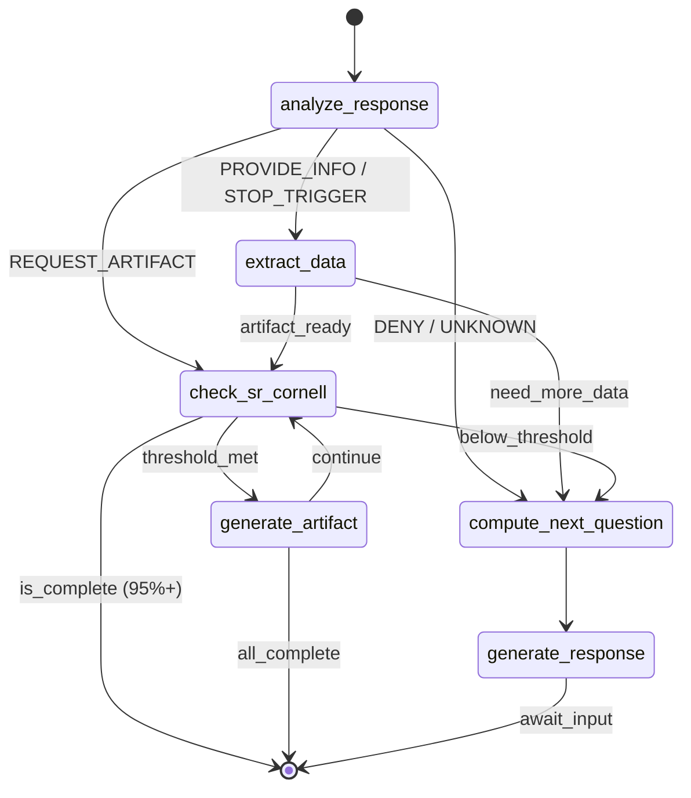

# LangGraph State Machine Implementation Plan

## Product-Helper AI Intake System

**Version:** 1.0
**Author:** LangChain Integration Engineer (Agent 3.1)
**Date:** 2026-01-16
**Status:** Implementation Plan

---

## Table of Contents

1. [Executive Summary](#1-executive-summary)
2. [Current State Analysis](#2-current-state-analysis)
3. [Architecture Overview](#3-architecture-overview)
4. [IntakeState Interface](#4-intakestate-interface)
5. [Node Functions](#5-node-functions)
6. [Edge Definitions](#6-edge-definitions)
7. [Graph Topology](#7-graph-topology)
8. [Integration Points](#8-integration-points)
9. [Implementation Phases](#9-implementation-phases)
10. [Testing Strategy](#10-testing-strategy)
11. [File Structure](#11-file-structure)

---

## 1. Executive Summary

This document outlines the implementation plan for a LangGraph-based state machine to power the intelligent intake system for the product-helper PRD generation tool. The state machine will:

- **Replace** the current single-prompt approach in `/app/api/chat/projects/[projectId]/route.ts`
- **Orchestrate** multi-step AI workflows for question generation, data extraction, and artifact creation
- **Enforce** SR-CORNELL-PRD-95-V1 validation standards at each phase
- **Track** conversation state and extracted data persistently

### Key Benefits

| Benefit | Description |
|---------|-------------|
| **Structured Workflow** | Explicit state transitions vs implicit prompt logic |
| **Persistence** | State survives across requests; resumable conversations |
| **Observability** | LangSmith tracing at node level |
| **Testability** | Individual node functions can be unit tested |
| **Flexibility** | Easy to add/modify phases without rewriting prompts |

---

## 2. Current State Analysis

### Existing Implementation

**File:** `/apps/product-helper/app/api/chat/projects/[projectId]/route.ts`

```typescript
// Current approach: Single prompt with inline logic
const promptText = `You are a PRD assistant...
## Project Context
Name: ${project.name}
Vision: ${project.vision}
Completeness: ${completeness}%
Current Artifact: ${currentArtifact}
...`;

const chain = streamingLLM.pipe(new StringOutputParser());
const stream = await chain.stream(promptText);
```

### Current Limitations

1. **No state persistence** - Completeness calculated on-the-fly from DB
2. **No conditional routing** - Prompt decides next action (unreliable)
3. **No extraction loop** - Extraction happens separately, not integrated
4. **No validation integration** - SR-CORNELL checks not enforced in flow
5. **No artifact generation control** - LLM decides when to generate

### Existing Assets to Reuse

| Asset | Location | Usage in State Machine |
|-------|----------|------------------------|
| `extractionSchema` | `/lib/langchain/schemas.ts` | Node output validation |
| `extractProjectData()` | `/lib/langchain/agents/extraction-agent.ts` | Extract data node |
| `validateProject()` | `/lib/validation/validator.ts` | Validation node |
| `SR_CORNELL_PIPELINE` | `/lib/langchain/prompts.ts` | Artifact sequence |
| `streamingLLM` | `/lib/langchain/config.ts` | Response generation |

---

## 3. Architecture Overview

### High-Level Flow

```
                                    +-------------------+
                                    |   Entry Point     |
                                    | (User Message)    |
                                    +--------+----------+
                                             |
                                             v
                                    +-------------------+
                                    | analyze_response  |
                                    | (Intent Detection)|
                                    +--------+----------+
                                             |
                         +-------------------+-------------------+
                         |                   |                   |
                         v                   v                   v
                 +-------+-------+   +-------+-------+   +-------+-------+
                 | STOP_TRIGGER  |   | NEED_MORE_DATA|   | READY_TO_GEN  |
                 +-------+-------+   +-------+-------+   +-------+-------+
                         |                   |                   |
                         v                   v                   v
                 +-------+-------+   +-------+-------+   +-------+-------+
                 | extract_data  |   | compute_next  |   | check_sr_     |
                 | + generate    |   | _question     |   | cornell       |
                 +-------+-------+   +-------+-------+   +-------+-------+
                         |                   |                   |
                         |                   v                   |
                         |           +-------+-------+           |
                         |           | generate_     |           |
                         |           | response      |           |
                         |           +-------+-------+           |
                         |                   |                   |
                         v                   v                   v
                 +-------+-------+   +-------+-------+   +-------+-------+
                 | generate_     |   |   END         |   | generate_     |
                 | artifact      |   | (Await Input) |   | artifact      |
                 +---------------+   +---------------+   +---------------+
```

### LangGraph Concepts Used

- **StateGraph**: Main graph structure with typed state
- **Channels**: State fields with reducers for message accumulation
- **Conditional Edges**: Route based on extracted intent/readiness
- **Checkpointing**: Persist state to database between invocations

---

## 4. IntakeState Interface

### Core State Definition

```typescript
// File: /apps/product-helper/lib/langchain/graphs/types.ts

import { BaseMessage, HumanMessage, AIMessage } from '@langchain/core/messages';
import { ExtractionResult } from '../schemas';
import { ValidationResult } from '@/lib/validation/types';

/**
 * Artifact types in SR-CORNELL pipeline order
 */
export type ArtifactPhase =
  | 'context_diagram'
  | 'use_case_diagram'
  | 'scope_tree'
  | 'ucbd'
  | 'requirements_table'
  | 'constants_table'
  | 'sysml_activity_diagram';

/**
 * User intent detected from message analysis
 */
export type UserIntent =
  | 'PROVIDE_INFO'      // User answered a question
  | 'ASK_QUESTION'      // User has a question
  | 'STOP_TRIGGER'      // User wants to stop and generate
  | 'CONFIRM'           // User confirmed an assumption
  | 'DENY'              // User denied an assumption
  | 'REQUEST_ARTIFACT'  // User explicitly requests artifact
  | 'EDIT_DATA'         // User wants to modify extracted data
  | 'UNKNOWN';          // Could not determine intent

/**
 * Artifact readiness status for each SR-CORNELL artifact
 */
export interface ArtifactReadiness {
  context_diagram: boolean;
  use_case_diagram: boolean;
  scope_tree: boolean;
  ucbd: boolean;
  requirements_table: boolean;
  constants_table: boolean;
  sysml_activity_diagram: boolean;
}

/**
 * Main state interface for the intake graph
 * All fields persisted between invocations via checkpointing
 */
export interface IntakeState {
  // ============================================================
  // Message History (Accumulated)
  // ============================================================

  /**
   * Full conversation history as LangChain messages
   * Reducer: Append new messages to existing array
   */
  messages: BaseMessage[];

  // ============================================================
  // Project Context (Static per session)
  // ============================================================

  /**
   * Database project ID
   */
  projectId: number;

  /**
   * Project name from database
   */
  projectName: string;

  /**
   * Project vision statement from database
   */
  projectVision: string;

  /**
   * Team ID for authorization
   */
  teamId: number;

  // ============================================================
  // Extracted Data (Incremental)
  // ============================================================

  /**
   * Structured PRD data extracted from conversation
   * Updated incrementally after each extraction
   */
  extractedData: ExtractionResult;

  /**
   * Completeness score 0-100
   */
  completeness: number;

  /**
   * Which artifacts are ready to generate
   */
  artifactReadiness: ArtifactReadiness;

  // ============================================================
  // Current Phase Tracking
  // ============================================================

  /**
   * Current artifact being gathered data for
   * Follows SR-CORNELL sequence
   */
  currentPhase: ArtifactPhase;

  /**
   * Artifacts that have been generated successfully
   */
  generatedArtifacts: ArtifactPhase[];

  // ============================================================
  // Analysis Results (Per-Turn)
  // ============================================================

  /**
   * Detected intent from last user message
   */
  lastIntent: UserIntent;

  /**
   * Latest validation result from SR-CORNELL check
   */
  validationResult: ValidationResult | null;

  /**
   * Pending question to ask user (if any)
   */
  pendingQuestion: string | null;

  /**
   * Pending artifact content to generate
   */
  pendingArtifact: {
    type: ArtifactPhase;
    content: string;
  } | null;

  // ============================================================
  // Control Flags
  // ============================================================

  /**
   * Whether the conversation is complete (95%+ validation)
   */
  isComplete: boolean;

  /**
   * Error state for recovery
   */
  error: string | null;

  /**
   * Turn counter for conversation limits
   */
  turnCount: number;
}
```

### State Initialization Function

```typescript
// File: /apps/product-helper/lib/langchain/graphs/types.ts (continued)

/**
 * Create initial state for a new project intake session
 *
 * @param projectId - Database project ID
 * @param projectName - Project name
 * @param projectVision - Project vision statement
 * @param teamId - Team ID for authorization
 * @param existingData - Optional existing extracted data to resume from
 * @returns Initialized IntakeState
 */
export function createInitialState(
  projectId: number,
  projectName: string,
  projectVision: string,
  teamId: number,
  existingData?: Partial<{
    extractedData: ExtractionResult;
    messages: BaseMessage[];
    generatedArtifacts: ArtifactPhase[];
    completeness: number;
  }>
): IntakeState {
  const extractedData: ExtractionResult = existingData?.extractedData ?? {
    actors: [],
    useCases: [],
    systemBoundaries: { internal: [], external: [] },
    dataEntities: [],
  };

  return {
    // Messages
    messages: existingData?.messages ?? [],

    // Project context
    projectId,
    projectName,
    projectVision,
    teamId,

    // Extracted data
    extractedData,
    completeness: existingData?.completeness ?? 0,
    artifactReadiness: computeArtifactReadiness(extractedData),

    // Phase tracking
    currentPhase: determineCurrentPhase(existingData?.generatedArtifacts ?? []),
    generatedArtifacts: existingData?.generatedArtifacts ?? [],

    // Per-turn analysis
    lastIntent: 'UNKNOWN',
    validationResult: null,
    pendingQuestion: null,
    pendingArtifact: null,

    // Control flags
    isComplete: false,
    error: null,
    turnCount: existingData?.messages?.filter(m => m._getType() === 'human').length ?? 0,
  };
}

/**
 * Compute artifact readiness from extracted data
 */
function computeArtifactReadiness(data: ExtractionResult): ArtifactReadiness {
  const hasActors = data.actors.length >= 1;
  const hasMultipleActors = data.actors.length >= 2;
  const hasUseCases = data.useCases.length >= 3;
  const hasExternal = data.systemBoundaries.external.length >= 1 ||
                      data.systemBoundaries.external.includes('none_confirmed');
  const hasInternal = data.systemBoundaries.internal.length >= 1;
  const hasEntities = data.dataEntities.length >= 1;

  return {
    context_diagram: hasActors && hasExternal,
    use_case_diagram: hasMultipleActors && hasUseCases,
    scope_tree: hasInternal, // In-scope items
    ucbd: hasUseCases && data.useCases.some(uc =>
      (uc.preconditions?.length ?? 0) > 0 && (uc.postconditions?.length ?? 0) > 0
    ),
    requirements_table: hasUseCases && data.useCases.length >= 5,
    constants_table: true, // Can always infer constants
    sysml_activity_diagram: hasUseCases && data.useCases.length >= 3,
  };
}

/**
 * Determine current phase based on generated artifacts
 */
function determineCurrentPhase(generated: ArtifactPhase[]): ArtifactPhase {
  const sequence: ArtifactPhase[] = [
    'context_diagram',
    'use_case_diagram',
    'scope_tree',
    'ucbd',
    'requirements_table',
    'constants_table',
    'sysml_activity_diagram',
  ];

  for (const phase of sequence) {
    if (!generated.includes(phase)) {
      return phase;
    }
  }

  return 'sysml_activity_diagram'; // All complete
}
```

### Channel Configuration

```typescript
// File: /apps/product-helper/lib/langchain/graphs/channels.ts

import { StateGraphArgs } from '@langchain/langgraph';
import { BaseMessage } from '@langchain/core/messages';
import { IntakeState, ArtifactReadiness } from './types';

/**
 * Message accumulator reducer
 * Appends new messages to existing array
 */
function messagesReducer(
  existing: BaseMessage[],
  incoming: BaseMessage[] | BaseMessage
): BaseMessage[] {
  const newMessages = Array.isArray(incoming) ? incoming : [incoming];
  return [...existing, ...newMessages];
}

/**
 * Default reducer - replace existing value with new value
 */
function replaceReducer<T>(existing: T, incoming: T): T {
  return incoming;
}

/**
 * Array accumulator reducer for generated artifacts
 */
function artifactsReducer(
  existing: string[],
  incoming: string | string[]
): string[] {
  const newItems = Array.isArray(incoming) ? incoming : [incoming];
  return [...new Set([...existing, ...newItems])];
}

/**
 * Channel configuration for IntakeState
 * Defines how each state field is updated
 */
export const intakeStateChannels: StateGraphArgs<IntakeState>['channels'] = {
  // Accumulated channels
  messages: {
    reducer: messagesReducer,
    default: () => [],
  },
  generatedArtifacts: {
    reducer: artifactsReducer,
    default: () => [],
  },

  // Replace channels (most fields)
  projectId: { reducer: replaceReducer, default: () => 0 },
  projectName: { reducer: replaceReducer, default: () => '' },
  projectVision: { reducer: replaceReducer, default: () => '' },
  teamId: { reducer: replaceReducer, default: () => 0 },
  extractedData: {
    reducer: replaceReducer,
    default: () => ({
      actors: [],
      useCases: [],
      systemBoundaries: { internal: [], external: [] },
      dataEntities: [],
    }),
  },
  completeness: { reducer: replaceReducer, default: () => 0 },
  artifactReadiness: {
    reducer: replaceReducer,
    default: () => ({
      context_diagram: false,
      use_case_diagram: false,
      scope_tree: false,
      ucbd: false,
      requirements_table: false,
      constants_table: false,
      sysml_activity_diagram: false,
    }),
  },
  currentPhase: { reducer: replaceReducer, default: () => 'context_diagram' },
  lastIntent: { reducer: replaceReducer, default: () => 'UNKNOWN' },
  validationResult: { reducer: replaceReducer, default: () => null },
  pendingQuestion: { reducer: replaceReducer, default: () => null },
  pendingArtifact: { reducer: replaceReducer, default: () => null },
  isComplete: { reducer: replaceReducer, default: () => false },
  error: { reducer: replaceReducer, default: () => null },
  turnCount: { reducer: replaceReducer, default: () => 0 },
};
```

---

## 5. Node Functions

### 5.1 analyze_response

**Purpose:** Analyze user's message to detect intent and extract key signals.

```typescript
// File: /apps/product-helper/lib/langchain/graphs/nodes/analyze-response.ts

import { ChatOpenAI } from '@langchain/openai';
import { z } from 'zod';
import { HumanMessage } from '@langchain/core/messages';
import { IntakeState, UserIntent } from '../types';

/**
 * Schema for intent analysis output
 */
const intentAnalysisSchema = z.object({
  intent: z.enum([
    'PROVIDE_INFO',
    'ASK_QUESTION',
    'STOP_TRIGGER',
    'CONFIRM',
    'DENY',
    'REQUEST_ARTIFACT',
    'EDIT_DATA',
    'UNKNOWN',
  ]).describe('Primary intent of the user message'),

  confidence: z.number().min(0).max(1).describe('Confidence score 0-1'),

  extractedEntities: z.object({
    actors: z.array(z.string()).optional(),
    useCases: z.array(z.string()).optional(),
    externalSystems: z.array(z.string()).optional(),
    scopeItems: z.array(z.string()).optional(),
  }).optional().describe('Quick entity extraction from message'),

  stopTriggerDetected: z.boolean().describe('Whether stop words detected'),

  reasoning: z.string().describe('Brief explanation of intent classification'),
});

type IntentAnalysis = z.infer<typeof intentAnalysisSchema>;

/**
 * Stop trigger keywords that indicate user wants to generate artifact
 */
const STOP_TRIGGERS = [
  'nope', 'no', "that's enough", "that's it", 'done',
  'move on', "let's see", 'generate', 'show me', 'looks good',
  'perfect', 'good enough', "that's all", 'nothing else',
];

/**
 * LLM for intent analysis
 */
const intentLLM = new ChatOpenAI({
  modelName: 'gpt-4o',
  temperature: 0,
  maxTokens: 500,
}).withStructuredOutput(intentAnalysisSchema);

/**
 * Analyze user response to determine intent and extract quick signals
 *
 * @param state - Current intake state
 * @returns Partial state update with lastIntent and any quick extractions
 *
 * @example
 * Input: "There are admins and regular users. Nope, no external systems."
 * Output: { lastIntent: 'STOP_TRIGGER', ... }
 */
export async function analyzeResponse(
  state: IntakeState
): Promise<Partial<IntakeState>> {
  const lastMessage = state.messages[state.messages.length - 1];

  if (!lastMessage || lastMessage._getType() !== 'human') {
    return { lastIntent: 'UNKNOWN' };
  }

  const userText = lastMessage.content as string;

  // Quick check for stop triggers (before LLM call)
  const hasStopTrigger = STOP_TRIGGERS.some(trigger =>
    userText.toLowerCase().includes(trigger)
  );

  // If clear stop trigger, skip LLM analysis
  if (hasStopTrigger && userText.length < 50) {
    return {
      lastIntent: 'STOP_TRIGGER',
      turnCount: state.turnCount + 1,
    };
  }

  try {
    const analysis = await intentLLM.invoke(`
Analyze this user message in the context of a PRD intake conversation.

## Current Phase: ${state.currentPhase}
## Completeness: ${state.completeness}%
## Last Question Asked: ${state.pendingQuestion || 'N/A'}

## User Message:
"${userText}"

## Stop Trigger Words:
${STOP_TRIGGERS.join(', ')}

Determine the user's intent and extract any mentioned entities.
`);

    // Merge quick extractions into state if present
    let updatedData = state.extractedData;
    if (analysis.extractedEntities) {
      const { actors, useCases, externalSystems, scopeItems } = analysis.extractedEntities;

      if (actors?.length) {
        updatedData = {
          ...updatedData,
          actors: [
            ...updatedData.actors,
            ...actors.map(name => ({
              name,
              role: 'To be determined',
              description: `Actor mentioned: ${name}`,
            })),
          ],
        };
      }

      if (externalSystems?.length) {
        updatedData = {
          ...updatedData,
          systemBoundaries: {
            ...updatedData.systemBoundaries,
            external: [
              ...updatedData.systemBoundaries.external,
              ...externalSystems,
            ],
          },
        };
      }
    }

    return {
      lastIntent: analysis.stopTriggerDetected ? 'STOP_TRIGGER' : analysis.intent,
      extractedData: updatedData,
      turnCount: state.turnCount + 1,
    };
  } catch (error) {
    console.error('Intent analysis error:', error);
    return {
      lastIntent: hasStopTrigger ? 'STOP_TRIGGER' : 'PROVIDE_INFO',
      turnCount: state.turnCount + 1,
    };
  }
}
```

### 5.2 extract_data

**Purpose:** Deep extraction of structured PRD data from conversation history.

```typescript
// File: /apps/product-helper/lib/langchain/graphs/nodes/extract-data.ts

import { IntakeState } from '../types';
import {
  extractProjectData,
  calculateCompleteness,
  mergeExtractionData
} from '../../agents/extraction-agent';
import { formatMessagesAsText } from '../utils';

/**
 * Extract structured PRD data from conversation
 * Uses existing extraction agent with schema validation
 *
 * @param state - Current intake state with messages
 * @returns Partial state with updated extractedData, completeness, artifactReadiness
 *
 * @example
 * After extraction:
 * {
 *   extractedData: {
 *     actors: [{ name: 'Admin', role: 'Primary User', ... }],
 *     useCases: [{ id: 'UC1', name: 'Manage Users', ... }],
 *     ...
 *   },
 *   completeness: 45,
 *   artifactReadiness: { context_diagram: true, ... }
 * }
 */
export async function extractData(
  state: IntakeState
): Promise<Partial<IntakeState>> {
  try {
    // Format conversation for extraction
    const conversationText = formatMessagesAsText(state.messages);

    // Run extraction
    const newExtraction = await extractProjectData(
      conversationText,
      state.projectName,
      state.projectVision
    );

    // Merge with existing data (incremental)
    const mergedData = mergeExtractionData(state.extractedData, newExtraction);

    // Calculate completeness
    const completeness = calculateCompleteness(mergedData);

    // Compute artifact readiness
    const artifactReadiness = computeArtifactReadiness(mergedData);

    return {
      extractedData: mergedData,
      completeness,
      artifactReadiness,
    };
  } catch (error) {
    console.error('Data extraction error:', error);
    return {
      error: `Extraction failed: ${error instanceof Error ? error.message : 'Unknown error'}`,
    };
  }
}

/**
 * Compute which artifacts are ready to generate based on extracted data
 */
function computeArtifactReadiness(data: ExtractionResult): ArtifactReadiness {
  // Actor counts
  const actorCount = data.actors.length;
  const hasMinActors = actorCount >= 1;
  const hasTwoActors = actorCount >= 2;

  // Use case counts
  const useCaseCount = data.useCases.length;
  const hasMinUseCases = useCaseCount >= 3;
  const hasFiveUseCases = useCaseCount >= 5;

  // Boundaries
  const hasExternal = data.systemBoundaries.external.length > 0;
  const hasInternal = data.systemBoundaries.internal.length > 0;

  // UCBD requirements (at least one use case with pre/post conditions)
  const hasUCBDData = data.useCases.some(uc =>
    (uc.preconditions?.length ?? 0) > 0 || (uc.postconditions?.length ?? 0) > 0
  );

  return {
    // Context Diagram: system name + 1 actor + external defined
    context_diagram: hasMinActors && hasExternal,

    // Use Case Diagram: 2+ actors + 3+ use cases linked
    use_case_diagram: hasTwoActors && hasMinUseCases,

    // Scope Tree: in-scope + out-scope defined
    scope_tree: hasInternal,

    // UCBD: preconditions + steps + postconditions for 1+ use case
    ucbd: hasMinUseCases && hasUCBDData,

    // Requirements: 5+ use cases traced
    requirements_table: hasFiveUseCases,

    // Constants: Always possible (can infer)
    constants_table: true,

    // Activity Diagram: 3+ workflow steps + decision points
    sysml_activity_diagram: hasMinUseCases,
  };
}
```

### 5.3 compute_next_question

**Purpose:** Generate the next question to ask the user based on data gaps.

```typescript
// File: /apps/product-helper/lib/langchain/graphs/nodes/compute-next-question.ts

import { ChatOpenAI } from '@langchain/openai';
import { z } from 'zod';
import { IntakeState, ArtifactPhase } from '../types';
import { SR_CORNELL_PIPELINE } from '../../prompts';

/**
 * Schema for question generation output
 */
const questionSchema = z.object({
  question: z.string().describe('Single focused question to ask'),
  targetData: z.enum([
    'actors', 'use_cases', 'external_systems',
    'scope', 'data_entities', 'ucbd_details'
  ]).describe('What data this question targets'),
  assumption: z.string().optional().describe('Optional assumption to confirm'),
  priority: z.enum(['high', 'medium', 'low']).describe('How critical this data is'),
});

type QuestionOutput = z.infer<typeof questionSchema>;

/**
 * LLM for question generation
 */
const questionLLM = new ChatOpenAI({
  modelName: 'gpt-4o',
  temperature: 0.7, // Some creativity for natural questions
  maxTokens: 300,
}).withStructuredOutput(questionSchema);

/**
 * Data gaps by artifact phase
 */
const PHASE_REQUIREMENTS: Record<ArtifactPhase, {
  required: string[];
  questions: string[];
}> = {
  context_diagram: {
    required: ['actors:1+', 'external_systems:1+ or none'],
    questions: [
      'Who are the main users of {projectName}?',
      'Will {projectName} integrate with any external systems or APIs?',
    ],
  },
  use_case_diagram: {
    required: ['actors:2+', 'use_cases:3+'],
    questions: [
      'What are the 3-5 main things a {actor} can do in {projectName}?',
      'Are there different user roles with different permissions?',
    ],
  },
  scope_tree: {
    required: ['in_scope:1+', 'out_scope:1+'],
    questions: [
      'What features are definitely IN scope for the first version?',
      'What is explicitly OUT of scope for now?',
    ],
  },
  ucbd: {
    required: ['preconditions', 'steps:3+', 'postconditions'],
    questions: [
      'For {useCase}, what must be true before a user can start?',
      'What are the main steps in {useCase}?',
    ],
  },
  requirements_table: {
    required: ['requirements:5+'],
    questions: [
      'What performance requirements does {projectName} have?',
      'Are there specific security requirements to consider?',
    ],
  },
  constants_table: {
    required: ['constants:1+'],
    questions: [
      'Are there any specific limits or thresholds (e.g., max users, timeout)?',
    ],
  },
  sysml_activity_diagram: {
    required: ['workflow_steps:3+', 'decision_points:1+'],
    questions: [
      'In {useCase}, are there any decision points or branches?',
    ],
  },
};

/**
 * Compute the next question to ask based on current data gaps
 *
 * @param state - Current intake state
 * @returns Partial state with pendingQuestion set
 *
 * Strategy:
 * 1. Identify what data is missing for current phase
 * 2. Generate a single, focused question
 * 3. Prefer inference + confirmation over open-ended questions
 */
export async function computeNextQuestion(
  state: IntakeState
): Promise<Partial<IntakeState>> {
  const phase = state.currentPhase;
  const data = state.extractedData;

  // Build context about what's missing
  const gaps = identifyDataGaps(state);

  if (gaps.length === 0) {
    // No gaps - ready to generate
    return { pendingQuestion: null };
  }

  try {
    const result = await questionLLM.invoke(`
You are gathering PRD requirements for "${state.projectName}".

## Vision Statement:
${state.projectVision}

## Current Phase: ${phase}
## Completeness: ${state.completeness}%

## Data We Have:
- Actors (${data.actors.length}): ${data.actors.map(a => a.name).join(', ') || 'None'}
- Use Cases (${data.useCases.length}): ${data.useCases.map(uc => uc.name).join(', ') || 'None'}
- External Systems: ${data.systemBoundaries.external.join(', ') || 'None identified'}
- In Scope: ${data.systemBoundaries.internal.join(', ') || 'Not defined'}

## Data Gaps:
${gaps.map(g => `- ${g}`).join('\n')}

## Rules:
1. Ask ONE question only
2. Be specific and actionable
3. If you can infer something from the vision, make an assumption and ask user to confirm
4. Keep it brief (1-2 sentences max)

Generate the next question to fill the most critical data gap.
`);

    let question = result.question;

    // Add assumption if provided
    if (result.assumption) {
      question = `${result.assumption} ${question}`;
    }

    return {
      pendingQuestion: question,
    };
  } catch (error) {
    console.error('Question generation error:', error);

    // Fallback to template question
    const templates = PHASE_REQUIREMENTS[phase]?.questions || [];
    const fallbackQuestion = templates[0]
      ?.replace('{projectName}', state.projectName)
      ?.replace('{actor}', data.actors[0]?.name || 'user');

    return {
      pendingQuestion: fallbackQuestion || 'Can you tell me more about your project requirements?',
    };
  }
}

/**
 * Identify data gaps for current phase
 */
function identifyDataGaps(state: IntakeState): string[] {
  const gaps: string[] = [];
  const data = state.extractedData;
  const phase = state.currentPhase;

  switch (phase) {
    case 'context_diagram':
      if (data.actors.length < 1) gaps.push('Need at least 1 actor');
      if (data.systemBoundaries.external.length === 0) {
        gaps.push('Need to identify external systems (or confirm none)');
      }
      break;

    case 'use_case_diagram':
      if (data.actors.length < 2) gaps.push('Need at least 2 actors');
      if (data.useCases.length < 3) gaps.push(`Need at least 3 use cases (have ${data.useCases.length})`);
      break;

    case 'scope_tree':
      if (data.systemBoundaries.internal.length === 0) gaps.push('Need in-scope items defined');
      break;

    case 'ucbd':
      const hasPrePost = data.useCases.some(uc =>
        (uc.preconditions?.length ?? 0) > 0 && (uc.postconditions?.length ?? 0) > 0
      );
      if (!hasPrePost) gaps.push('Need preconditions and postconditions for at least one use case');
      break;

    case 'requirements_table':
      if (data.useCases.length < 5) gaps.push('Need at least 5 use cases for requirements derivation');
      break;

    default:
      // Constants and activity diagram can be inferred
      break;
  }

  return gaps;
}
```

### 5.4 check_sr_cornell

**Purpose:** Run SR-CORNELL validation to determine if artifact is ready.

```typescript
// File: /apps/product-helper/lib/langchain/graphs/nodes/check-sr-cornell.ts

import { IntakeState, ArtifactPhase } from '../types';
import { validateProject } from '@/lib/validation/validator';
import { ProjectValidationData } from '@/lib/validation/types';

/**
 * Minimum thresholds for each artifact (from SR-CORNELL spec)
 */
const ARTIFACT_THRESHOLDS: Record<ArtifactPhase, {
  minimumScore: number;
  requiredGates: string[];
}> = {
  context_diagram: {
    minimumScore: 20,
    requiredGates: ['system_boundary_defined', 'external_entities_defined'],
  },
  use_case_diagram: {
    minimumScore: 35,
    requiredGates: ['primary_actors_defined', 'use_case_list_5_to_15_defined'],
  },
  scope_tree: {
    minimumScore: 45,
    requiredGates: ['system_boundary_defined'],
  },
  ucbd: {
    minimumScore: 60,
    requiredGates: ['each_use_case_has_trigger_and_outcome'],
  },
  requirements_table: {
    minimumScore: 75,
    requiredGates: ['core_data_objects_defined'],
  },
  constants_table: {
    minimumScore: 85,
    requiredGates: [],
  },
  sysml_activity_diagram: {
    minimumScore: 90,
    requiredGates: [],
  },
};

/**
 * Run SR-CORNELL validation for current phase
 *
 * @param state - Current intake state
 * @returns Partial state with validationResult and readiness assessment
 *
 * This node:
 * 1. Transforms extracted data to validation format
 * 2. Runs SR-CORNELL validation
 * 3. Checks if minimum threshold for current artifact is met
 * 4. Sets isComplete if 95%+ reached
 */
export async function checkSRCornell(
  state: IntakeState
): Promise<Partial<IntakeState>> {
  const { extractedData, projectId, projectName, projectVision, currentPhase } = state;

  // Transform to validation data format
  const validationData: ProjectValidationData = {
    id: projectId,
    name: projectName,
    vision: projectVision,
    status: 'intake',
    actors: extractedData.actors.map(a => ({
      name: a.name,
      role: a.role,
      description: a.description,
    })),
    useCases: extractedData.useCases.map(uc => ({
      id: uc.id,
      name: uc.name,
      description: uc.description,
      actor: uc.actor,
      trigger: uc.trigger,
      outcome: uc.outcome,
      preconditions: uc.preconditions,
      postconditions: uc.postconditions,
    })),
    systemBoundaries: {
      internal: extractedData.systemBoundaries.internal,
      external: extractedData.systemBoundaries.external,
      inScope: extractedData.systemBoundaries.internal, // Map internal to inScope
      outOfScope: [], // TODO: Track out-of-scope separately
    },
    dataEntities: extractedData.dataEntities.map(e => ({
      name: e.name,
      attributes: e.attributes,
      relationships: e.relationships,
    })),
    completeness: state.completeness,
  };

  try {
    // Run validation
    const result = await validateProject(validationData);

    // Check if current artifact threshold is met
    const threshold = ARTIFACT_THRESHOLDS[currentPhase];
    const artifactReady = result.overallScore >= threshold.minimumScore;

    // Check if overall 95% threshold is met
    const isComplete = result.overallScore >= 95;

    // Determine next phase if current is ready
    let nextPhase = currentPhase;
    if (artifactReady && !isComplete) {
      const phases: ArtifactPhase[] = [
        'context_diagram', 'use_case_diagram', 'scope_tree', 'ucbd',
        'requirements_table', 'constants_table', 'sysml_activity_diagram',
      ];
      const currentIndex = phases.indexOf(currentPhase);
      if (currentIndex < phases.length - 1) {
        nextPhase = phases[currentIndex + 1];
      }
    }

    return {
      validationResult: {
        score: result.overallScore,
        passed: result.passedChecks,
        failed: result.failedChecks,
        hardGatesResult: Object.fromEntries(
          result.hardGates.map(hg => [hg.gate, hg.passed])
        ),
        errors: result.errors,
        warnings: result.warnings,
      },
      isComplete,
      currentPhase: nextPhase,
    };
  } catch (error) {
    console.error('SR-CORNELL validation error:', error);
    return {
      error: `Validation failed: ${error instanceof Error ? error.message : 'Unknown error'}`,
    };
  }
}
```

### 5.5 generate_artifact

**Purpose:** Generate the current artifact using SR-CORNELL templates.

```typescript
// File: /apps/product-helper/lib/langchain/graphs/nodes/generate-artifact.ts

import { ChatOpenAI } from '@langchain/openai';
import { AIMessage } from '@langchain/core/messages';
import { IntakeState, ArtifactPhase } from '../types';
import { diagramPrompt } from '../../prompts';

/**
 * LLM for artifact generation
 */
const artifactLLM = new ChatOpenAI({
  modelName: 'gpt-4o',
  temperature: 0.3, // Low temperature for consistent diagrams
  maxTokens: 2000,
});

/**
 * Mermaid diagram templates by artifact type
 */
const DIAGRAM_TEMPLATES: Record<ArtifactPhase, {
  type: string;
  instructions: string;
}> = {
  context_diagram: {
    type: 'C4Context',
    instructions: `Generate a C4 Context diagram showing:
- Central system in the middle
- External actors around the system
- External systems with labeled interactions
Use: graph TB with clear labels`,
  },
  use_case_diagram: {
    type: 'Use Case',
    instructions: `Generate a Use Case diagram showing:
- System boundary box
- Actors on the left
- Use cases as ovals inside boundary
- Actor-usecase connections
Use proper UML notation`,
  },
  scope_tree: {
    type: 'Mindmap',
    instructions: `Generate a scope tree showing:
- Root: System name
- Branch 1: In Scope (with items)
- Branch 2: Out of Scope (with items)
Use: mindmap syntax`,
  },
  ucbd: {
    type: 'Sequence',
    instructions: `Generate a UCBD (Use Case Behavior Document) diagram showing:
- Actors as participants
- System as participant
- Steps as messages
- Preconditions as notes
Use: sequenceDiagram syntax`,
  },
  requirements_table: {
    type: 'Table',
    instructions: `Generate a requirements table (not a diagram).
Return a markdown table with columns:
| ID | Name | Description | Source | Priority | Testability |`,
  },
  constants_table: {
    type: 'Table',
    instructions: `Generate a constants table (not a diagram).
Return a markdown table with columns:
| Name | Value | Units | Description | Category |`,
  },
  sysml_activity_diagram: {
    type: 'Activity',
    instructions: `Generate a SysML Activity diagram showing:
- Start node
- Action nodes for each step
- Decision diamonds for branches
- End node
Use: flowchart TD syntax with clear labels`,
  },
};

/**
 * Generate an artifact for the current phase
 *
 * @param state - Current intake state
 * @returns Partial state with pendingArtifact and AI message
 *
 * This node:
 * 1. Selects appropriate diagram template for current phase
 * 2. Formats extracted data for the diagram
 * 3. Generates Mermaid syntax (or markdown table)
 * 4. Returns artifact content for rendering
 */
export async function generateArtifact(
  state: IntakeState
): Promise<Partial<IntakeState>> {
  const { currentPhase, extractedData, projectName } = state;
  const template = DIAGRAM_TEMPLATES[currentPhase];

  // Format data for prompt
  const dataContext = formatDataForArtifact(currentPhase, extractedData, projectName);

  try {
    const prompt = `Generate a ${template.type} for "${projectName}".

${template.instructions}

## Data to Include:
${dataContext}

## Output Rules:
1. If generating a diagram, wrap in \`\`\`mermaid code fences
2. If generating a table, use proper markdown table syntax
3. Include all relevant data points
4. Use clear, professional labels
5. Add appropriate styling

Generate the ${currentPhase.replace('_', ' ')} now:`;

    const response = await artifactLLM.invoke(prompt);
    const content = response.content as string;

    // Create AI message with the artifact
    const aiMessage = new AIMessage(
      `Here's your ${currentPhase.replace('_', ' ')}:\n\n${content}`
    );

    return {
      pendingArtifact: {
        type: currentPhase,
        content,
      },
      messages: [aiMessage],
      generatedArtifacts: [currentPhase],
    };
  } catch (error) {
    console.error('Artifact generation error:', error);
    return {
      error: `Failed to generate ${currentPhase}: ${error instanceof Error ? error.message : 'Unknown error'}`,
    };
  }
}

/**
 * Format extracted data for artifact generation
 */
function formatDataForArtifact(
  phase: ArtifactPhase,
  data: ExtractionResult,
  projectName: string
): string {
  switch (phase) {
    case 'context_diagram':
      return `
System: ${projectName}
Actors:
${data.actors.map(a => `- ${a.name} (${a.role}): ${a.description}`).join('\n')}
External Systems:
${data.systemBoundaries.external.map(e => `- ${e}`).join('\n') || '- None identified'}
`;

    case 'use_case_diagram':
      return `
System: ${projectName}
Actors:
${data.actors.map(a => `- ${a.name}`).join('\n')}
Use Cases:
${data.useCases.map(uc => `- ${uc.id}: ${uc.name} (Actor: ${uc.actor})`).join('\n')}
`;

    case 'scope_tree':
      return `
System: ${projectName}
In Scope:
${data.systemBoundaries.internal.map(s => `- ${s}`).join('\n')}
Out of Scope:
- (To be defined based on conversation)
`;

    case 'ucbd':
      const primaryUC = data.useCases[0];
      return `
Use Case: ${primaryUC?.name || 'Primary Flow'}
Actor: ${primaryUC?.actor || data.actors[0]?.name || 'User'}
Preconditions:
${primaryUC?.preconditions?.map(p => `- ${p}`).join('\n') || '- User is authenticated'}
Steps:
${primaryUC?.description || 'Main workflow steps'}
Postconditions:
${primaryUC?.postconditions?.map(p => `- ${p}`).join('\n') || '- Operation completed successfully'}
`;

    case 'requirements_table':
      return `
Use Cases for derivation:
${data.useCases.map(uc => `- ${uc.id}: ${uc.name} - ${uc.description}`).join('\n')}
`;

    case 'constants_table':
      return `
Project: ${projectName}
Use Cases: ${data.useCases.length}
Actors: ${data.actors.map(a => a.name).join(', ')}
`;

    case 'sysml_activity_diagram':
      const uc = data.useCases[0];
      return `
Use Case: ${uc?.name || 'Main Flow'}
Description: ${uc?.description || 'Primary workflow'}
Actor: ${uc?.actor || 'User'}
`;

    default:
      return `Project: ${projectName}`;
  }
}
```

### 5.6 generate_response

**Purpose:** Generate the streaming response to send back to user.

```typescript
// File: /apps/product-helper/lib/langchain/graphs/nodes/generate-response.ts

import { ChatOpenAI } from '@langchain/openai';
import { AIMessage } from '@langchain/core/messages';
import { IntakeState } from '../types';

/**
 * LLM for conversational responses
 */
const responseLLM = new ChatOpenAI({
  modelName: 'gpt-4o',
  temperature: 0.7, // Natural conversation
  maxTokens: 500,
  streaming: true,
});

/**
 * Generate conversational response based on current state
 *
 * @param state - Current intake state
 * @returns Partial state with AI message added
 *
 * Response types:
 * 1. Ask pending question (if set)
 * 2. Confirm assumption
 * 3. Acknowledge info and ask follow-up
 * 4. Announce artifact generation
 */
export async function generateResponse(
  state: IntakeState
): Promise<Partial<IntakeState>> {
  const { pendingQuestion, pendingArtifact, lastIntent, completeness, currentPhase } = state;

  // If artifact was generated, it already has a message
  if (pendingArtifact) {
    return {};
  }

  // If we have a pending question, ask it
  if (pendingQuestion) {
    const aiMessage = new AIMessage(pendingQuestion);
    return {
      messages: [aiMessage],
      pendingQuestion: null, // Clear after asking
    };
  }

  // Generate contextual response
  try {
    const prompt = buildResponsePrompt(state);
    const response = await responseLLM.invoke(prompt);
    const content = response.content as string;

    const aiMessage = new AIMessage(content);
    return {
      messages: [aiMessage],
    };
  } catch (error) {
    console.error('Response generation error:', error);
    const fallback = new AIMessage(
      `Got it! We're at ${completeness}% completeness. Let me know if you have more details to add.`
    );
    return {
      messages: [fallback],
    };
  }
}

/**
 * Build prompt for response generation
 */
function buildResponsePrompt(state: IntakeState): string {
  const { projectName, completeness, currentPhase, lastIntent, extractedData } = state;

  return `You are a PRD assistant for "${projectName}".

## Current Status
- Completeness: ${completeness}%
- Current Phase: ${currentPhase.replace('_', ' ')}
- Last User Intent: ${lastIntent}

## Data Collected
- Actors: ${extractedData.actors.length} (${extractedData.actors.map(a => a.name).join(', ') || 'none'})
- Use Cases: ${extractedData.useCases.length}
- External Systems: ${extractedData.systemBoundaries.external.length}

## Response Guidelines
1. Be brief (1-3 sentences max)
2. Acknowledge what user provided
3. If close to artifact generation, mention it
4. Don't ask multiple questions

Generate a natural, brief response:`;
}
```

---

## 6. Edge Definitions

### Conditional Edge Functions

```typescript
// File: /apps/product-helper/lib/langchain/graphs/edges.ts

import { IntakeState } from './types';

/**
 * Routing targets from analyze_response node
 */
export type AnalyzeRouteTarget =
  | 'extract_data'           // User provided info -> extract it
  | 'generate_artifact'      // Stop trigger -> generate current artifact
  | 'compute_next_question'  // Need more data -> ask question
  | 'check_sr_cornell';      // Check if ready for artifact

/**
 * Route after analyzing user response
 *
 * Decision logic:
 * 1. STOP_TRIGGER -> extract_data (then generate)
 * 2. PROVIDE_INFO with high completeness -> check_sr_cornell
 * 3. PROVIDE_INFO with low completeness -> extract_data
 * 4. ASK_QUESTION -> generate_response (answer their question)
 * 5. Otherwise -> compute_next_question
 */
export function routeAfterAnalysis(state: IntakeState): AnalyzeRouteTarget {
  const { lastIntent, completeness, artifactReadiness, currentPhase } = state;

  // Stop trigger - extract final data then generate
  if (lastIntent === 'STOP_TRIGGER') {
    return 'extract_data';
  }

  // User requested specific artifact
  if (lastIntent === 'REQUEST_ARTIFACT') {
    return 'check_sr_cornell';
  }

  // User provided info
  if (lastIntent === 'PROVIDE_INFO' || lastIntent === 'CONFIRM') {
    // If artifact for current phase is ready, check validation
    if (artifactReadiness[currentPhase]) {
      return 'check_sr_cornell';
    }
    // Otherwise extract and continue
    return 'extract_data';
  }

  // User denied assumption - need to ask again
  if (lastIntent === 'DENY') {
    return 'compute_next_question';
  }

  // Default: extract what we have and ask more
  return 'extract_data';
}

/**
 * Routing targets from extract_data node
 */
export type ExtractRouteTarget =
  | 'check_sr_cornell'
  | 'compute_next_question';

/**
 * Route after data extraction
 *
 * Decision logic:
 * 1. If stop trigger was detected -> check_sr_cornell (to generate)
 * 2. If artifact ready -> check_sr_cornell
 * 3. Otherwise -> compute_next_question
 */
export function routeAfterExtraction(state: IntakeState): ExtractRouteTarget {
  const { lastIntent, artifactReadiness, currentPhase, completeness } = state;

  // After stop trigger, always proceed to check/generate
  if (lastIntent === 'STOP_TRIGGER') {
    return 'check_sr_cornell';
  }

  // If current artifact is ready, check validation
  if (artifactReadiness[currentPhase] || completeness >= 30) {
    return 'check_sr_cornell';
  }

  // Need more data
  return 'compute_next_question';
}

/**
 * Routing targets from check_sr_cornell node
 */
export type ValidationRouteTarget =
  | 'generate_artifact'
  | 'compute_next_question'
  | '__end__';

/**
 * Route after SR-CORNELL validation
 *
 * Decision logic:
 * 1. If 95%+ complete -> __end__ (conversation complete)
 * 2. If current artifact threshold met -> generate_artifact
 * 3. Otherwise -> compute_next_question
 */
export function routeAfterValidation(state: IntakeState): ValidationRouteTarget {
  const { isComplete, validationResult, artifactReadiness, currentPhase, lastIntent } = state;

  // Full completion
  if (isComplete) {
    return '__end__';
  }

  // Stop trigger always generates
  if (lastIntent === 'STOP_TRIGGER') {
    return 'generate_artifact';
  }

  // Current artifact ready
  if (artifactReadiness[currentPhase]) {
    return 'generate_artifact';
  }

  // Need more data
  return 'compute_next_question';
}

/**
 * Routing targets from generate_artifact node
 */
export type ArtifactRouteTarget =
  | 'check_sr_cornell'
  | '__end__';

/**
 * Route after artifact generation
 *
 * Decision logic:
 * 1. If all artifacts generated -> __end__
 * 2. Otherwise -> check_sr_cornell (move to next phase)
 */
export function routeAfterArtifact(state: IntakeState): ArtifactRouteTarget {
  const { generatedArtifacts, isComplete } = state;

  // All 7 artifacts generated or 95%+ validation
  if (generatedArtifacts.length >= 7 || isComplete) {
    return '__end__';
  }

  // Continue to next phase
  return 'check_sr_cornell';
}
```

---

## 7. Graph Topology

### Complete Graph Definition

```typescript
// File: /apps/product-helper/lib/langchain/graphs/intake-graph.ts

import { StateGraph, END, START } from '@langchain/langgraph';
import { IntakeState } from './types';
import { intakeStateChannels } from './channels';

// Node imports
import { analyzeResponse } from './nodes/analyze-response';
import { extractData } from './nodes/extract-data';
import { computeNextQuestion } from './nodes/compute-next-question';
import { checkSRCornell } from './nodes/check-sr-cornell';
import { generateArtifact } from './nodes/generate-artifact';
import { generateResponse } from './nodes/generate-response';

// Edge imports
import {
  routeAfterAnalysis,
  routeAfterExtraction,
  routeAfterValidation,
  routeAfterArtifact,
} from './edges';

/**
 * Build the intake state graph
 *
 * Graph structure:
 *
 *   START
 *     |
 *     v
 * [analyze_response] ----+
 *     |                  |
 *     v                  v (STOP_TRIGGER)
 * [extract_data] <-------+
 *     |
 *     +-------> [check_sr_cornell]
 *     |              |
 *     v              v
 * [compute_next_   [generate_artifact]
 *  question]            |
 *     |                 v
 *     v            [check_sr_cornell]
 * [generate_response]   |
 *     |                 v
 *     v               END (if complete)
 *   END
 *
 * @returns Compiled state graph ready for invocation
 */
export function buildIntakeGraph() {
  const graph = new StateGraph<IntakeState>({
    channels: intakeStateChannels,
  });

  // ============================================================
  // Add Nodes
  // ============================================================

  graph.addNode('analyze_response', analyzeResponse);
  graph.addNode('extract_data', extractData);
  graph.addNode('compute_next_question', computeNextQuestion);
  graph.addNode('check_sr_cornell', checkSRCornell);
  graph.addNode('generate_artifact', generateArtifact);
  graph.addNode('generate_response', generateResponse);

  // ============================================================
  // Add Edges
  // ============================================================

  // Entry point: START -> analyze_response
  graph.addEdge(START, 'analyze_response');

  // After analysis: conditional routing
  graph.addConditionalEdges(
    'analyze_response',
    routeAfterAnalysis,
    {
      extract_data: 'extract_data',
      check_sr_cornell: 'check_sr_cornell',
      compute_next_question: 'compute_next_question',
      generate_artifact: 'generate_artifact',
    }
  );

  // After extraction: check validation or ask more
  graph.addConditionalEdges(
    'extract_data',
    routeAfterExtraction,
    {
      check_sr_cornell: 'check_sr_cornell',
      compute_next_question: 'compute_next_question',
    }
  );

  // After validation: generate or ask more
  graph.addConditionalEdges(
    'check_sr_cornell',
    routeAfterValidation,
    {
      generate_artifact: 'generate_artifact',
      compute_next_question: 'compute_next_question',
      __end__: END,
    }
  );

  // After artifact generation: continue or end
  graph.addConditionalEdges(
    'generate_artifact',
    routeAfterArtifact,
    {
      check_sr_cornell: 'check_sr_cornell',
      __end__: END,
    }
  );

  // After computing question: always generate response
  graph.addEdge('compute_next_question', 'generate_response');

  // After response: end turn (await next user input)
  graph.addEdge('generate_response', END);

  // ============================================================
  // Compile
  // ============================================================

  return graph.compile();
}

/**
 * Singleton graph instance
 */
let _graphInstance: ReturnType<typeof buildIntakeGraph> | null = null;

/**
 * Get or create the intake graph instance
 */
export function getIntakeGraph() {
  if (!_graphInstance) {
    _graphInstance = buildIntakeGraph();
  }
  return _graphInstance;
}
```

### Visual Graph Representation



---

## 8. Integration Points

### 8.1 API Route Integration

```typescript
// File: /apps/product-helper/app/api/chat/projects/[projectId]/route.ts (updated)

import { NextRequest } from 'next/server';
import { StreamingTextResponse } from 'ai';
import { HumanMessage } from '@langchain/core/messages';
import { getUser, getTeamForUser } from '@/lib/db/queries';
import { db } from '@/lib/db/drizzle';
import { projects, conversations, projectData } from '@/lib/db/schema';
import { eq, and, asc } from 'drizzle-orm';
import { getIntakeGraph } from '@/lib/langchain/graphs/intake-graph';
import { createInitialState, IntakeState } from '@/lib/langchain/graphs/types';
import { loadCheckpoint, saveCheckpoint } from '@/lib/langchain/graphs/checkpointer';

export const runtime = 'nodejs';

export async function POST(
  req: NextRequest,
  { params }: { params: Promise<{ projectId: string }> }
) {
  try {
    // Authentication
    const user = await getUser();
    if (!user) {
      return new Response(JSON.stringify({ error: 'Unauthorized' }), { status: 401 });
    }

    const team = await getTeamForUser();
    if (!team) {
      return new Response(JSON.stringify({ error: 'Team not found' }), { status: 404 });
    }

    const { projectId: projectIdStr } = await params;
    const projectId = parseInt(projectIdStr, 10);

    // Load project
    const project = await db.query.projects.findFirst({
      where: and(eq(projects.id, projectId), eq(projects.teamId, team.id)),
      with: { projectData: true },
    });

    if (!project) {
      return new Response(JSON.stringify({ error: 'Project not found' }), { status: 404 });
    }

    // Parse request
    const { messages } = await req.json();
    const lastMessage = messages[messages.length - 1];

    // Load or create state
    let state: IntakeState;
    const checkpoint = await loadCheckpoint(projectId);

    if (checkpoint) {
      // Resume from checkpoint
      state = checkpoint;
      state.messages.push(new HumanMessage(lastMessage.content));
    } else {
      // Initialize new state
      state = createInitialState(
        projectId,
        project.name,
        project.vision,
        team.id
      );
      state.messages.push(new HumanMessage(lastMessage.content));
    }

    // Get graph and invoke
    const graph = getIntakeGraph();
    const result = await graph.invoke(state);

    // Save checkpoint
    await saveCheckpoint(projectId, result);

    // Save messages to database
    await db.insert(conversations).values({
      projectId,
      role: 'user',
      content: lastMessage.content,
      tokens: Math.ceil(lastMessage.content.length / 4),
    });

    // Get AI response from result
    const aiMessages = result.messages.filter(m => m._getType() === 'ai');
    const lastAIMessage = aiMessages[aiMessages.length - 1];
    const responseContent = lastAIMessage?.content as string || 'I understand. Could you tell me more?';

    await db.insert(conversations).values({
      projectId,
      role: 'assistant',
      content: responseContent,
      tokens: Math.ceil(responseContent.length / 4),
    });

    // Update project data
    await db.update(projectData)
      .set({
        actors: result.extractedData.actors,
        useCases: result.extractedData.useCases,
        systemBoundaries: result.extractedData.systemBoundaries,
        dataEntities: result.extractedData.dataEntities,
        completeness: result.completeness,
        lastExtractedAt: new Date(),
        updatedAt: new Date(),
      })
      .where(eq(projectData.projectId, projectId));

    // Return streaming response
    return new Response(responseContent, {
      headers: { 'Content-Type': 'text/plain' },
    });
  } catch (error) {
    console.error('Project chat API error:', error);
    return new Response(
      JSON.stringify({ error: 'Internal Server Error' }),
      { status: 500 }
    );
  }
}
```

### 8.2 Checkpointer Implementation

```typescript
// File: /apps/product-helper/lib/langchain/graphs/checkpointer.ts

import { db } from '@/lib/db/drizzle';
import { IntakeState } from './types';
import { HumanMessage, AIMessage, BaseMessage } from '@langchain/core/messages';

/**
 * Checkpoint storage table (add to schema.ts):
 *
 * export const graphCheckpoints = pgTable('graph_checkpoints', {
 *   id: serial('id').primaryKey(),
 *   projectId: integer('project_id').notNull().unique(),
 *   state: jsonb('state').notNull(),
 *   updatedAt: timestamp('updated_at').notNull().defaultNow(),
 * });
 */

/**
 * Load checkpoint for a project
 */
export async function loadCheckpoint(projectId: number): Promise<IntakeState | null> {
  try {
    const result = await db.query.graphCheckpoints?.findFirst({
      where: eq(graphCheckpoints.projectId, projectId),
    });

    if (!result) return null;

    const state = result.state as any;

    // Reconstruct message objects
    state.messages = state.messages.map((m: any) => {
      if (m.type === 'human') return new HumanMessage(m.content);
      if (m.type === 'ai') return new AIMessage(m.content);
      return m;
    });

    return state as IntakeState;
  } catch (error) {
    console.error('Load checkpoint error:', error);
    return null;
  }
}

/**
 * Save checkpoint for a project
 */
export async function saveCheckpoint(projectId: number, state: IntakeState): Promise<void> {
  try {
    // Serialize messages for storage
    const serializedState = {
      ...state,
      messages: state.messages.map(m => ({
        type: m._getType(),
        content: m.content,
      })),
    };

    await db.insert(graphCheckpoints)
      .values({
        projectId,
        state: serializedState,
        updatedAt: new Date(),
      })
      .onConflictDoUpdate({
        target: graphCheckpoints.projectId,
        set: {
          state: serializedState,
          updatedAt: new Date(),
        },
      });
  } catch (error) {
    console.error('Save checkpoint error:', error);
  }
}
```

### 8.3 Utility Functions

```typescript
// File: /apps/product-helper/lib/langchain/graphs/utils.ts

import { BaseMessage } from '@langchain/core/messages';

/**
 * Format messages as text for extraction prompts
 */
export function formatMessagesAsText(messages: BaseMessage[]): string {
  return messages
    .map(m => {
      const role = m._getType() === 'human' ? 'User' : 'Assistant';
      return `${role}: ${m.content}`;
    })
    .join('\n\n');
}

/**
 * Get last N messages from history
 */
export function getRecentMessages(messages: BaseMessage[], n: number): BaseMessage[] {
  return messages.slice(-n);
}

/**
 * Count tokens (rough estimate)
 */
export function estimateTokens(text: string): number {
  return Math.ceil(text.length / 4);
}

/**
 * Truncate message history to fit context window
 */
export function truncateHistory(
  messages: BaseMessage[],
  maxTokens: number = 8000
): BaseMessage[] {
  let totalTokens = 0;
  const result: BaseMessage[] = [];

  // Keep most recent messages that fit
  for (let i = messages.length - 1; i >= 0; i--) {
    const msg = messages[i];
    const tokens = estimateTokens(msg.content as string);

    if (totalTokens + tokens > maxTokens) break;

    result.unshift(msg);
    totalTokens += tokens;
  }

  return result;
}
```

---

## 9. Implementation Phases

### Phase 1: Foundation (Days 1-2)

**Goal:** Set up graph structure and types without breaking existing functionality.

| Task | File | Description |
|------|------|-------------|
| 1.1 | `lib/langchain/graphs/types.ts` | Define IntakeState interface |
| 1.2 | `lib/langchain/graphs/channels.ts` | Define channel configuration |
| 1.3 | `lib/langchain/graphs/utils.ts` | Add utility functions |
| 1.4 | `lib/db/schema.ts` | Add graphCheckpoints table |
| 1.5 | Run migration | `pnpm db:generate && pnpm db:migrate` |

### Phase 2: Core Nodes (Days 3-5)

**Goal:** Implement all node functions with unit tests.

| Task | File | Description |
|------|------|-------------|
| 2.1 | `nodes/analyze-response.ts` | Intent detection node |
| 2.2 | `nodes/extract-data.ts` | Data extraction node |
| 2.3 | `nodes/compute-next-question.ts` | Question generation node |
| 2.4 | `nodes/check-sr-cornell.ts` | Validation node |
| 2.5 | `nodes/generate-artifact.ts` | Artifact generation node |
| 2.6 | `nodes/generate-response.ts` | Response generation node |
| 2.7 | `__tests__/*.test.ts` | Unit tests for each node |

### Phase 3: Graph Assembly (Days 6-7)

**Goal:** Wire nodes together with conditional edges.

| Task | File | Description |
|------|------|-------------|
| 3.1 | `graphs/edges.ts` | Define routing functions |
| 3.2 | `graphs/intake-graph.ts` | Build complete graph |
| 3.3 | `graphs/checkpointer.ts` | State persistence |
| 3.4 | Integration test | Test full graph flow |

### Phase 4: API Integration (Days 8-9)

**Goal:** Replace existing chat route with graph invocation.

| Task | File | Description |
|------|------|-------------|
| 4.1 | `route.ts` | Update API route to use graph |
| 4.2 | Feature flag | Add `USE_LANGGRAPH` env var |
| 4.3 | A/B test | Compare old vs new approach |
| 4.4 | Monitoring | Add LangSmith tracing |

### Phase 5: Polish & Optimization (Day 10)

**Goal:** Optimize performance and handle edge cases.

| Task | Description |
|------|-------------|
| 5.1 | Add retry logic for LLM failures |
| 5.2 | Implement streaming for long responses |
| 5.3 | Add conversation turn limits |
| 5.4 | Performance benchmarking |
| 5.5 | Documentation |

---

## 10. Testing Strategy

### Unit Tests for Nodes

```typescript
// File: /apps/product-helper/lib/langchain/graphs/__tests__/analyze-response.test.ts

import { describe, it, expect, vi } from 'vitest';
import { analyzeResponse } from '../nodes/analyze-response';
import { createInitialState } from '../types';
import { HumanMessage } from '@langchain/core/messages';

describe('analyzeResponse', () => {
  it('detects STOP_TRIGGER for "nope" response', async () => {
    const state = createInitialState(1, 'Test Project', 'A test app', 1);
    state.messages.push(new HumanMessage('nope, no external systems'));

    const result = await analyzeResponse(state);

    expect(result.lastIntent).toBe('STOP_TRIGGER');
  });

  it('detects PROVIDE_INFO for detailed response', async () => {
    const state = createInitialState(1, 'Test Project', 'A test app', 1);
    state.messages.push(new HumanMessage(
      'The main users are admins who manage content and regular users who view it'
    ));

    const result = await analyzeResponse(state);

    expect(result.lastIntent).toBe('PROVIDE_INFO');
  });

  it('increments turn count', async () => {
    const state = createInitialState(1, 'Test Project', 'A test app', 1);
    state.turnCount = 5;
    state.messages.push(new HumanMessage('some input'));

    const result = await analyzeResponse(state);

    expect(result.turnCount).toBe(6);
  });
});
```

### Integration Tests

```typescript
// File: /apps/product-helper/lib/langchain/graphs/__tests__/intake-graph.test.ts

import { describe, it, expect } from 'vitest';
import { getIntakeGraph } from '../intake-graph';
import { createInitialState } from '../types';
import { HumanMessage } from '@langchain/core/messages';

describe('IntakeGraph Integration', () => {
  it('completes context diagram phase with minimal input', async () => {
    const graph = getIntakeGraph();

    const state = createInitialState(
      1,
      'Task Manager',
      'A simple task management app for teams',
      1
    );

    // Simulate conversation
    state.messages.push(new HumanMessage('Admins and team members will use it'));
    let result = await graph.invoke(state);

    expect(result.extractedData.actors.length).toBeGreaterThan(0);

    // Add external systems info
    result.messages.push(new HumanMessage('No external systems needed'));
    result = await graph.invoke(result);

    expect(result.artifactReadiness.context_diagram).toBe(true);
  });

  it('generates artifact on stop trigger', async () => {
    const graph = getIntakeGraph();

    const state = createInitialState(
      1,
      'E-commerce Platform',
      'An online store for selling products',
      1
    );

    // Provide enough data then stop
    state.messages.push(new HumanMessage(
      'Customers buy products, admins manage inventory. Integrates with Stripe. Done, generate it.'
    ));

    const result = await graph.invoke(state);

    expect(result.generatedArtifacts).toContain('context_diagram');
  });
});
```

### Golden Test Sets

```typescript
// File: /apps/product-helper/lib/langchain/graphs/__tests__/golden-tests.ts

/**
 * Golden test scenarios for regression testing
 * Each scenario has expected extraction results
 */
export const goldenTests = [
  {
    name: 'Basic SaaS App',
    vision: 'A project management tool for small teams',
    conversation: [
      'Team leads and developers will use it',
      'Integrates with GitHub and Slack',
      "That's enough for now",
    ],
    expectedActors: ['Team Lead', 'Developer'],
    expectedExternal: ['GitHub', 'Slack'],
    expectedPhase: 'use_case_diagram',
  },
  {
    name: 'E-commerce Platform',
    vision: 'An online marketplace for handmade goods',
    conversation: [
      'Sellers list products, buyers purchase them',
      'Admins handle disputes',
      'Payment via Stripe, shipping via ShipStation',
      'Generate the context diagram',
    ],
    expectedActors: ['Seller', 'Buyer', 'Admin'],
    expectedExternal: ['Stripe', 'ShipStation'],
    expectedArtifact: 'context_diagram',
  },
];
```

---

## 11. File Structure

### Final Directory Layout

```
apps/product-helper/lib/langchain/
├── graphs/
│   ├── __tests__/
│   │   ├── analyze-response.test.ts
│   │   ├── extract-data.test.ts
│   │   ├── compute-next-question.test.ts
│   │   ├── check-sr-cornell.test.ts
│   │   ├── generate-artifact.test.ts
│   │   ├── generate-response.test.ts
│   │   ├── intake-graph.test.ts
│   │   └── golden-tests.ts
│   ├── nodes/
│   │   ├── analyze-response.ts
│   │   ├── extract-data.ts
│   │   ├── compute-next-question.ts
│   │   ├── check-sr-cornell.ts
│   │   ├── generate-artifact.ts
│   │   └── generate-response.ts
│   ├── types.ts              # IntakeState interface
│   ├── channels.ts           # Channel configuration
│   ├── edges.ts              # Routing functions
│   ├── intake-graph.ts       # Graph assembly
│   ├── checkpointer.ts       # State persistence
│   └── utils.ts              # Utility functions
├── agents/
│   └── extraction-agent.ts   # (existing, reused)
├── prompts.ts                # (existing, reused)
├── schemas.ts                # (existing, reused)
└── config.ts                 # (existing, reused)
```

---

## Success Metrics

| Metric | Target | Measurement |
|--------|--------|-------------|
| Extraction Accuracy | > 95% | Compare to golden test sets |
| Question Relevance | > 90% | User feedback on question quality |
| P95 Response Time | < 3 seconds | LangSmith latency tracking |
| Stop Trigger Detection | > 99% | False negative rate |
| Artifact Quality | > 90% | Validation pass rate |

---

## Risks & Mitigations

| Risk | Impact | Mitigation |
|------|--------|------------|
| LLM rate limits | High | Implement retry with exponential backoff |
| State corruption | High | Validate state on load, fallback to fresh state |
| Infinite loops | High | Turn counter limit (max 50 turns per session) |
| Context window overflow | Medium | Truncate history to recent 20 messages |
| Cold start latency | Medium | Pre-warm graph instance on server start |

---

## Next Steps

1. **Review this plan** with the team for feedback
2. **Create feature branch**: `feature/langgraph-intake-system`
3. **Begin Phase 1** implementation
4. **Set up LangSmith** project for observability
5. **Schedule code review** after Phase 2 completion

---

*Document maintained by: AI/Agent Engineering Team (Agent 3.1)*
