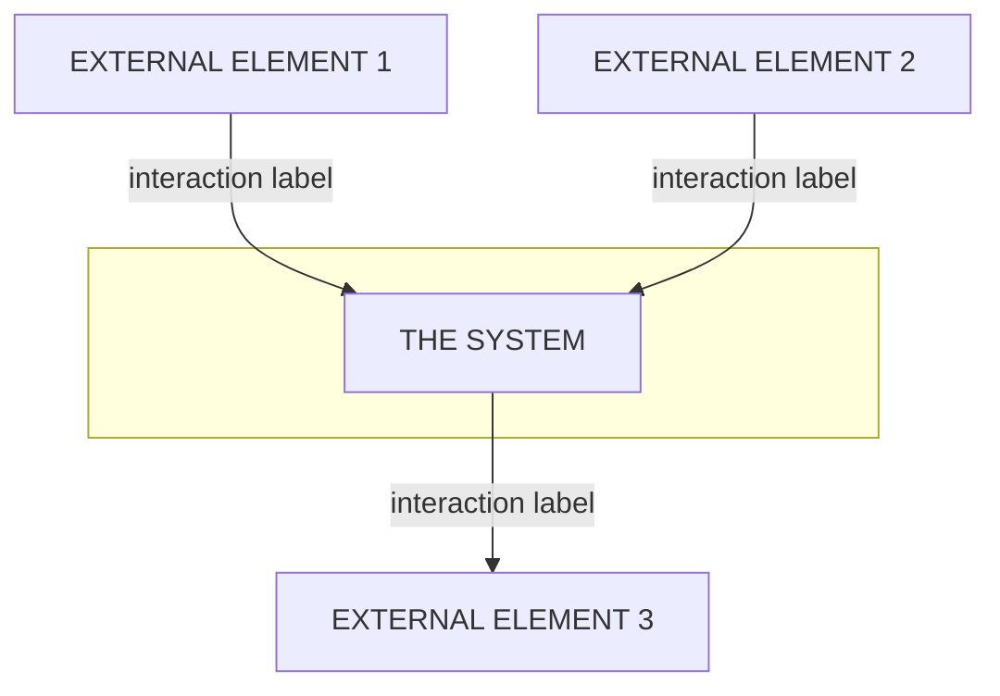
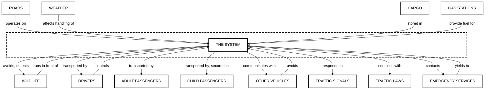

# Context Diagram Specification

## Overview

This specification defines the exact requirements for generating Context Diagrams in the C1V Product Helper application, based on the **systems engineering Systems Engineering** methodology and **Schneider requirements engineering** principles.

A Context Diagram establishes the **system boundary** by showing what is inside the system versus what exists outside it. It is the first and most fundamental diagram in systems engineering, answering the question: "What does our system interact with?"

---

## Purpose and Usage

### When to Use Context Diagrams

1. **Project Kickoff**: Establish system scope before detailed requirements
2. **Stakeholder Alignment**: Ensure all parties agree on what is in/out of scope
3. **Requirements Traceability**: Every external element becomes a potential source of requirements
4. **Risk Identification**: External dependencies represent integration points and risks

### Key Principle (industry-standard)

> "The context diagram is NOT a design diagram. It shows WHAT the system interacts with, not HOW it works internally."

---

## systems engineering Layout Requirements

### 1. Central System Representation

| Rule | Specification |
|------|---------------|
| Position | Exact center of diagram |
| Label | **"THE SYSTEM"** (capitalized, generic) |
| Box Style | Square corners (NEVER rounded) |
| Naming | Do NOT name the system prematurely; use generic label |
| Boundary | Dashed line box surrounding the system |

**Rationale**: Naming the system too early biases the design. "The System" keeps focus on interactions, not implementation.

### 2. External Elements

| Rule | Specification |
|------|---------------|
| Count | 8-20 exterior elements (minimum 8, maximum 20) |
| Position | OUTSIDE the dashed system boundary |
| Box Style | Same size boxes, square corners |
| Layout | Distributed evenly around the system |
| Naming | Capitalized names, same font and size |

### 3. Styling Requirements

| Rule | Specification |
|------|---------------|
| Colors | **BLACK AND WHITE ONLY** (no color fills) |
| Lines | Rectilinear only (horizontal/vertical, no curves, no diagonals) |
| Crossings | NO crossing lines allowed |
| Line Jumps | NO line jumps or bridges |
| Font | Consistent font family and size throughout |

### 4. Interaction Labels

| Rule | Specification |
|------|---------------|
| Case | **Lowercase** for all interaction labels |
| Multiple | Comma-separated for multiple interactions on same line |
| Position | Place text at the END of line closest to the external element |
| Grammar | Write as if starting with the external element name |

**Example Grammar Pattern**:
- External Element: "Cargo"
- Interaction: "stored in"
- Reads as: "Cargo [is] stored in The System"

### 5. Directional Rules

| Direction | Meaning | Mermaid Arrow |
|-----------|---------|---------------|
| From External TO System | External provides input to system | `External --> System` |
| From System TO External | System outputs to external | `System --> External` |
| Bidirectional | Both input and output | Use two separate labeled lines |

**Important**: Expand the system boundary box to encapsulate interaction labels that describe what the system provides.

---

## Element Classification Guide

### External Element Categories (Standard Examples)

Based on systems engineering autonomous vehicle example:

| Category | Examples | Typical Interactions |
|----------|----------|---------------------|
| **Physical Environment** | Roads, Weather, Terrain | "affects handling of", "operates on" |
| **Infrastructure** | Parking Spaces, Gas Stations, Charging Stations | "provide fuel for", "docks at" |
| **Living Entities** | Wildlife, Pedestrians | "runs in front of", "avoids" |
| **Human Actors** | Drivers, Passengers, Adults, Children, Disabled, Pets | "transported by", "controls" |
| **Other Systems** | Other Vehicles, Traffic Signals | "collides with", "responds to" |
| **Cargo/Objects** | Cargo, Luggage, Packages | "stored in", "delivered by" |
| **Regulations** | Traffic Laws, Safety Standards | "complies with", "governed by" |
| **Services** | Maintenance Services, Emergency Services | "serviced by", "contacts" |

### Decomposition Rule

**Complex categories MUST be decomposed**. Example:

- **BAD**: "Passengers" (too generic)
- **GOOD**: "Drivers", "Adult Passengers", "Child Passengers", "Infants", "Disabled Passengers", "Service Animals"

Each decomposed element may have different interaction requirements.

---

## Mermaid.js Implementation

Since Mermaid.js does not natively support all industry-standard diagram features, we define approximations:

### Layout Strategy



### Mermaid Limitations and Workarounds

| Specification Requirement | Mermaid Limitation | Workaround |
|---------------------|-------------------|------------|
| Dashed boundary | Subgraph has no dash style | Use subgraph with descriptive styling via CSS |
| Square corners only | Mermaid uses rounded by default | Use `["text"]` syntax for square nodes |
| B&W only | Mermaid defaults to colors | Override with `classDef` using grayscale |
| No crossing lines | Auto-layout may cross | Use explicit ranks (TB/LR) and ordering |
| Rectilinear lines | Mermaid uses curves | Use `linkStyle` with `fill:none` |
| 8-20 elements | No enforcement | Validate programmatically |

### Style Definitions

```mermaid
%%{init: {'theme': 'base', 'themeVariables': { 'lineColor': '#000000' }}}%%
graph TB
    classDef system fill:#ffffff,stroke:#000000,stroke-width:3px,color:#000000
    classDef external fill:#ffffff,stroke:#000000,stroke-width:2px,color:#000000
    classDef boundary fill:none,stroke:#000000,stroke-width:2px,stroke-dasharray: 8 4
```

---

## Data Structure

### TypeScript Interface

```typescript
/**
 * External Element for Context Diagram
 * Represents an entity outside the system boundary
 */
interface ContextDiagramElement {
  /** Unique identifier for the element */
  id: string;

  /** Display name (will be CAPITALIZED in diagram) */
  name: string;

  /** Category for grouping related elements */
  category:
    | 'actor'           // Human users
    | 'system'          // External systems
    | 'environment'     // Physical environment
    | 'infrastructure'  // Supporting infrastructure
    | 'regulation'      // Laws, standards, policies
    | 'service';        // External services

  /** Interactions with the system */
  interactions: ContextInteraction[];
}

/**
 * Interaction between external element and the system
 */
interface ContextInteraction {
  /** Interaction label (lowercase, verb phrase) */
  label: string;

  /** Direction of the interaction */
  direction: 'inbound' | 'outbound' | 'bidirectional';

  /** Optional: source requirement or use case ID */
  sourceRef?: string;
}

/**
 * Complete Context Diagram specification
 */
interface ContextDiagramSpec {
  /** Project/system identifier */
  projectId: string;

  /** Optional system name (defaults to "THE SYSTEM") */
  systemLabel?: string;

  /** All external elements (target: 8-20) */
  elements: ContextDiagramElement[];

  /** Validation metadata */
  metadata?: {
    elementCount: number;
    categoryCounts: Record<string, number>;
    validationScore: number;
    generatedAt: string;
  };
}
```

---

## Validation Rules

### Hard Gates (Must Pass)

| Gate ID | Rule | Error Message |
|---------|------|---------------|
| CTX-001 | System node exists and is centered | "Missing central system node" |
| CTX-002 | At least 8 external elements | "Insufficient external elements (min: 8)" |
| CTX-003 | No more than 20 external elements | "Too many external elements (max: 20)" |
| CTX-004 | All elements have at least one interaction | "Element '{name}' has no interactions" |
| CTX-005 | No duplicate element names | "Duplicate element: '{name}'" |
| CTX-006 | Interaction labels are lowercase | "Interaction label must be lowercase: '{label}'" |

### Soft Checks (Warnings)

| Check ID | Rule | Warning Message |
|----------|------|-----------------|
| CTX-W01 | At least 3 different categories | "Limited category diversity" |
| CTX-W02 | Human actors are decomposed | "Consider decomposing '{name}' by user type" |
| CTX-W03 | Bidirectional relationships use two lines | "Consider splitting bidirectional: '{label}'" |
| CTX-W04 | No generic terms like "Users" or "Data" | "'{name}' is too generic, decompose further" |

---

## Example: Autonomous Vehicle Context Diagram

### Input Data

```typescript
const autonomousVehicleContext: ContextDiagramSpec = {
  projectId: "av-project",
  elements: [
    {
      id: "roads",
      name: "Roads",
      category: "environment",
      interactions: [
        { label: "operates on", direction: "inbound" }
      ]
    },
    {
      id: "weather",
      name: "Weather",
      category: "environment",
      interactions: [
        { label: "affects handling of", direction: "inbound" }
      ]
    },
    {
      id: "wildlife",
      name: "Wildlife",
      category: "environment",
      interactions: [
        { label: "runs in front of", direction: "inbound" },
        { label: "avoids, detects", direction: "outbound" }
      ]
    },
    {
      id: "drivers",
      name: "Drivers",
      category: "actor",
      interactions: [
        { label: "controls", direction: "inbound" },
        { label: "transported by", direction: "outbound" }
      ]
    },
    {
      id: "adult-passengers",
      name: "Adult Passengers",
      category: "actor",
      interactions: [
        { label: "transported by", direction: "outbound" }
      ]
    },
    {
      id: "child-passengers",
      name: "Child Passengers",
      category: "actor",
      interactions: [
        { label: "transported by, secured in", direction: "outbound" }
      ]
    },
    {
      id: "cargo",
      name: "Cargo",
      category: "infrastructure",
      interactions: [
        { label: "stored in", direction: "inbound" }
      ]
    },
    {
      id: "other-vehicles",
      name: "Other Vehicles",
      category: "system",
      interactions: [
        { label: "avoids, communicates with", direction: "bidirectional" }
      ]
    },
    {
      id: "gas-stations",
      name: "Gas Stations",
      category: "infrastructure",
      interactions: [
        { label: "provide fuel for", direction: "inbound" }
      ]
    },
    {
      id: "traffic-signals",
      name: "Traffic Signals",
      category: "system",
      interactions: [
        { label: "responds to", direction: "inbound" }
      ]
    },
    {
      id: "traffic-laws",
      name: "Traffic Laws",
      category: "regulation",
      interactions: [
        { label: "complies with", direction: "inbound" }
      ]
    },
    {
      id: "emergency-services",
      name: "Emergency Services",
      category: "service",
      interactions: [
        { label: "contacts", direction: "outbound" },
        { label: "yields to", direction: "inbound" }
      ]
    }
  ]
};
```

### Generated Mermaid Output



---

## Generator Function Signature

```typescript
/**
 * Generate a specification-compliant Context Diagram
 *
 * @param spec - Context diagram specification
 * @returns Object containing Mermaid syntax and validation results
 *
 * @example
 * const result = generateindustry-standardContextDiagram({
 *   projectId: "my-project",
 *   elements: [...],
 * });
 *
 * if (result.validation.passed) {
 *   renderDiagram(result.mermaidSyntax);
 * } else {
 *   showErrors(result.validation.errors);
 * }
 */
function generateindustry-standardContextDiagram(spec: ContextDiagramSpec): {
  mermaidSyntax: string;
  validation: {
    passed: boolean;
    errors: string[];
    warnings: string[];
    elementCount: number;
    categoryCount: number;
  };
}
```

---

## Migration from Legacy Format

The existing `generateContextDiagram` function uses a simplified format:

```typescript
// Legacy format
generateContextDiagram(
  systemName: string,
  internal: string[],  // Not used in context diagrams per industry-standard
  external: string[]
)
```

### Migration Strategy

1. **Deprecate** the `internal` parameter (context diagrams show EXTERNAL only)
2. **Transform** simple string arrays to `ContextDiagramElement[]`
3. **Add** automatic interaction inference from element names
4. **Validate** against industry-standard requirements

```typescript
// Legacy compatibility wrapper
function migrateLegacyContextData(
  systemName: string,
  internal: string[],
  external: string[]
): ContextDiagramSpec {
  // Internal components become part of "THE SYSTEM" - not shown separately
  // External strings become ContextDiagramElements with inferred interactions
  return {
    projectId: 'legacy',
    systemLabel: 'THE SYSTEM', // Ignore systemName per industry-standard
    elements: external.map((name, i) => ({
      id: `ext-${i}`,
      name: name,
      category: inferCategory(name),
      interactions: [
        { label: inferInteraction(name), direction: 'inbound' }
      ]
    }))
  };
}
```

---

## References

- **systems engineering**: Systems Engineering Context Diagram Lecture
- **Schneider Requirements Engineering**: System Boundary Definition
- **SysML Specification**: Block Definition Diagrams (related)
- **IEEE 1233**: Guide for Developing System Requirements Specifications

---

## Changelog

| Version | Date | Changes |
|---------|------|---------|
| 1.0.0 | 2025-01-17 | Initial specification based on systems engineering |

---

## See Also

- [Use Case Diagram Specification](./use-case-diagram-spec.md)
- [Class Diagram Specification](./class-diagram-spec.md)
- [Activity Diagram Specification](./activity-diagram-spec.md)
- [Diagram Generators Implementation](/lib/diagrams/generators.ts)
