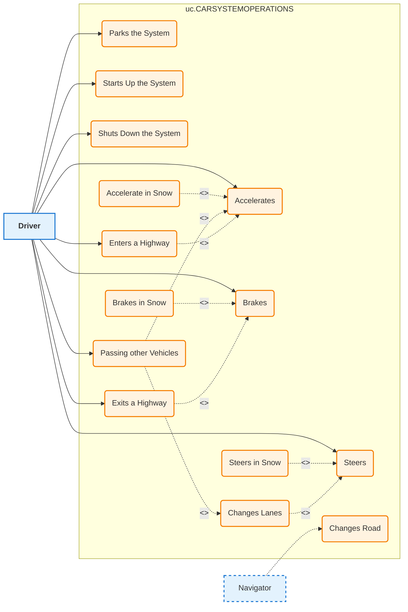

# Use Case Diagram Specification

## Overview

This document defines the exact specification for generating Use Case Diagrams in the C1V Product Helper application, based on the Cornell CESYS521 course methodology and UML/SysML standards.

---

## Title Format

All use case diagrams MUST follow the title convention:

```
uc.[TITLEINALLCAPS]
```

**Examples:**
- `uc.SYSMAINOPERATIONUSECASES`
- `uc.USERACCOUNTMANAGEMENT`
- `uc.ORDERPROCESSINGSYSTEM`

---

## Visual Elements

### 1. Actors

Actors represent users, systems, or external entities that interact with the system.

**Visual Representation:**
- Stick figure icon (standard UML notation)
- Placed OUTSIDE the system boundary rectangle
- Actor name label directly below the stick figure

**Actor Types:**
| Type | Placement | Connection Style |
|------|-----------|------------------|
| Primary Actor | LEFT side of diagram | Solid line to use cases |
| Secondary Actor | RIGHT side or elsewhere | Dashed line to use cases |
| External System | Any side (typically right) | Dashed line with system icon |

**Actor Title Boxes:**
- Optional rectangular label box for complex actor descriptions
- Format: `<<ActorType>>` stereotype above actor name

### 2. Use Cases

Use cases represent specific actions or functionalities of the system.

**Visual Representation:**
- Oval/ellipse shape (bubble)
- Placed INSIDE the system boundary rectangle
- Text centered within the oval
- Same font size for all use cases (consistency)
- Use case name as verb phrase (e.g., "Places Order", "Accelerates")

### 3. System Boundary

**Visual Representation:**
- Rectangle enclosing all use cases
- System name at top of rectangle
- Actors remain OUTSIDE this boundary
- Optional subsystem boundaries (nested rectangles)

---

## Relationship Types

### 1. Association (Actor to Use Case)

Basic connection between an actor and a use case they can perform.

```
Actor -------- Use Case
```

**Mermaid Implementation:**
```mermaid
Actor --> UseCase
```

**Rules:**
- Solid line from actor to use case
- No arrowhead required (UML standard), but arrow acceptable
- Primary actors use solid lines
- Secondary actors use dashed lines

### 2. Include Relationship

Indicates that a use case ALWAYS incorporates the behavior of another use case.

```
<<include>>
Main Use Case - - - - -> Included Use Case
```

**Semantics:**
- The main use case REQUIRES the included use case
- Dashed arrow FROM main use case TO sub use case
- Label: `<<include>>`

**Example:**
```
"Place Order" --<<include>>--> "Validate Payment"
```

**Mermaid Implementation:**
```mermaid
PlaceOrder -.->|<<include>>| ValidatePayment
```

### 3. Extend Relationship

Indicates optional or conditional behavior that extends a base use case.

```
<<extends>>
Extension Use Case - - - - -> Base Use Case
```

**Semantics:**
- The extending use case is OPTIONAL
- Dashed arrow FROM extending use case TO base use case
- Label: `<<extends>>`
- Often includes extension point specification

**Example:**
```
"Apply Discount" --<<extends>>--> "Place Order"
```

**Mermaid Implementation:**
```mermaid
ApplyDiscount -.->|<<extends>>| PlaceOrder
```

### 4. Generalization (Inheritance)

Shows inheritance relationship between actors or use cases.

```
Child --------▷ Parent
```

**Semantics:**
- Solid line with hollow/open triangle arrowhead
- Points FROM child TO parent
- Child inherits all capabilities of parent

**Example:**
```
"Admin User" ----▷ "User"
"Accelerate in Snow" ----▷ "Accelerates"
```

**Mermaid Implementation:**
```mermaid
AdminUser ---|> User
AccelerateInSnow ---|> Accelerates
```

### 5. Trigger Relationship

Shows what event initiates a use case.

```
<<trigger>>
Trigger Event - - - - -> Use Case
```

**Mermaid Implementation:**
```mermaid
TriggerEvent -.->|<<trigger>>| UseCase
```

---

## Cornell Car System Example

Based on the CESYS521 course example:

### Actors:
- **Driver** (Primary Actor - LEFT side)
- **Navigator** (Secondary Actor - may be LEFT or elsewhere)

### Use Cases:
| Use Case | Category | Relationships |
|----------|----------|---------------|
| Accelerates | Core Operation | Base use case |
| Brakes | Core Operation | Base use case |
| Parks the System | Core Operation | - |
| Steers | Core Operation | Base use case |
| Changes Lanes | Derived Operation | extends Steers |
| Steers in Snow | Derived Operation | extends Steers |
| Accelerate in Snow | Derived Operation | extends Accelerates |
| Brakes in Snow | Derived Operation | extends Brakes |
| Starts Up the System | Lifecycle | - |
| Shuts Down the System | Lifecycle | - |
| Passing other Vehicles | Complex Operation | includes Accelerates, includes Changes Lanes |
| Enters a Highway | Complex Operation | includes Accelerates |
| Changes Road | Complex Operation | - |
| Exits a Highway | Complex Operation | includes Brakes |

### Diagram Structure:
```
+----------------------------------------------------------+
|                    uc.CARSYSTEMOPERATIONS                 |
|                                                          |
|   Driver [stick figure]                                  |
|      |                                                   |
|      +---> (Accelerates)                                 |
|      |         ^                                         |
|      |         | <<extends>>                             |
|      |    (Accelerate in Snow)                           |
|      |                                                   |
|      +---> (Brakes)                                      |
|      |         ^                                         |
|      |         | <<extends>>                             |
|      |    (Brakes in Snow)                               |
|      |                                                   |
|      +---> (Steers)                                      |
|      |         ^                                         |
|      |         | <<extends>>                             |
|      |    (Steers in Snow)                               |
|      |    (Changes Lanes)                                |
|      |                                                   |
|      +---> (Passing other Vehicles)                      |
|      |         |                                         |
|      |         +--<<include>>--> (Accelerates)           |
|      |         +--<<include>>--> (Changes Lanes)         |
|      |                                                   |
|      +---> (Enters a Highway)                            |
|      |         |                                         |
|      |         +--<<include>>--> (Accelerates)           |
|      |                                                   |
|      +---> (Exits a Highway)                             |
|      |         |                                         |
|      |         +--<<include>>--> (Brakes)                |
|      |                                                   |
|   Navigator [stick figure] - - - -> (Changes Road)       |
|                                                          |
+----------------------------------------------------------+
```

---

## Mermaid.js Implementation

Since Mermaid.js does not have native UML Use Case Diagram support, we use a combination of flowchart syntax with custom styling.

### Node Types

| Element | Mermaid Syntax | Visual Result |
|---------|----------------|---------------|
| Actor (Primary) | `ActorName["Actor Name"]:::primaryActor` | Rectangle styled as actor |
| Actor (Secondary) | `ActorName["Actor Name"]:::secondaryActor` | Dashed rectangle |
| Use Case | `UCName("Use Case Name"):::useCase` | Rounded rectangle (oval-like) |
| System Boundary | `subgraph SystemName` | Grouped container |

### Connection Types

| Relationship | Mermaid Syntax | Description |
|--------------|----------------|-------------|
| Association (primary) | `Actor --> UseCase` | Solid arrow |
| Association (secondary) | `Actor -.-> UseCase` | Dashed arrow |
| Include | `UC1 -.->|"<<include>>"| UC2` | Dashed arrow with label |
| Extend | `UC1 -.->|"<<extends>>"| UC2` | Dashed arrow with label |
| Generalization | `Child -->\|> Parent` | Arrow with triangle (approximation) |
| Trigger | `Event -.->|"<<trigger>>"| UseCase` | Dashed arrow with label |

### Style Definitions

```mermaid
classDef primaryActor fill:#e3f2fd,stroke:#1976d2,stroke-width:2px,font-weight:bold
classDef secondaryActor fill:#e3f2fd,stroke:#1976d2,stroke-width:2px,stroke-dasharray:5 5
classDef useCase fill:#fff3e0,stroke:#f57c00,stroke-width:2px,rx:20,ry:20
classDef systemBoundary fill:#f5f5f5,stroke:#9e9e9e,stroke-width:2px
classDef includeRelation stroke:#666,stroke-dasharray:5 5
classDef extendRelation stroke:#666,stroke-dasharray:5 5
```

### Complete Mermaid Example



---

## Data Model for Use Case Diagrams

### Extended UseCase Schema

To support all relationship types, the UseCase schema requires these fields:

```typescript
interface UseCaseExtended {
  id: string;                    // Unique ID (e.g., "UC1")
  name: string;                  // Verb phrase name
  description: string;           // Detailed description
  actor: string;                 // Primary actor name
  actorType?: 'primary' | 'secondary';  // Actor classification

  // Relationships
  includes?: string[];           // IDs of use cases this INCLUDES
  extendedBy?: string[];         // IDs of use cases that EXTEND this
  extends?: string;              // ID of use case this EXTENDS
  generalizes?: string;          // ID of parent use case (inheritance)
  triggeredBy?: string;          // Event or actor that triggers this

  // Metadata
  preconditions?: string[];
  postconditions?: string[];
  trigger?: string;
  outcome?: string;
  category?: string;             // For grouping (e.g., "Core", "Lifecycle")
}
```

### Actor Schema Extension

```typescript
interface ActorExtended {
  name: string;
  role: string;
  description: string;
  type: 'primary' | 'secondary' | 'external';
  position?: 'left' | 'right' | 'top' | 'bottom';  // Diagram placement
  goals?: string[];
}
```

---

## Generation Algorithm

### Step 1: Validate Input

1. Check that all actors have unique names
2. Check that all use cases have unique IDs
3. Validate that actor references in use cases exist

### Step 2: Classify Elements

1. Separate primary vs secondary actors
2. Group use cases by category (if provided)
3. Identify include/extend chains

### Step 3: Generate Mermaid Syntax

```
1. Start with graph direction (LR for horizontal, TB for vertical)
2. Create subgraph for system boundary
3. Add use case nodes inside subgraph
4. Add actor nodes outside subgraph
5. Add actor-to-usecase connections
6. Add include relationships
7. Add extend relationships
8. Add generalization relationships
9. Add style definitions
```

### Step 4: Apply Styling

1. Primary actors: solid borders, left placement
2. Secondary actors: dashed borders
3. Use cases: oval-like (rounded rectangles)
4. Include/extend: dashed lines with labels

---

## Validation Rules

### Hard Gates (Must Pass)

1. **At least one actor defined** - Cannot have use cases without actors
2. **At least one use case defined** - Cannot have actors without use cases
3. **All use case actors exist** - Referenced actors must be defined
4. **No circular includes** - Include chains must not form cycles
5. **No circular extends** - Extend chains must not form cycles

### Soft Checks (Warnings)

1. **Unconnected actors** - Actors without any use cases
2. **Orphan use cases** - Use cases not connected to any actor
3. **Missing descriptions** - Use cases without descriptions
4. **Duplicate names** - Use cases with identical names
5. **Too many use cases** - More than 15 use cases may reduce readability

---

## Best Practices

### Naming Conventions

1. Use case names should be **verb phrases** (action-oriented)
   - Good: "Places Order", "Authenticates User"
   - Bad: "Order", "Authentication"

2. Actor names should be **nouns or roles**
   - Good: "Customer", "Administrator", "Payment Gateway"
   - Bad: "The person who orders", "Admin functionality"

3. Keep names concise but descriptive
   - Good: "Validates Payment"
   - Bad: "System validates the payment information provided by user"

### Diagram Organization

1. **Primary actors on the left** - Users typically scan left-to-right
2. **Core use cases in the center** - Most important functionality visible
3. **Extended/specialized use cases below or to the right**
4. **External systems on the right** - Clear separation from users
5. **Group related use cases** - Use categories or subgraphs

### Relationship Guidelines

1. **Include**: Use when behavior is ALWAYS required
   - "Checkout" always includes "Calculate Total"

2. **Extend**: Use when behavior is OPTIONAL or CONDITIONAL
   - "Apply Coupon" extends "Checkout" (only if user has coupon)

3. **Generalization**: Use for inheritance hierarchies
   - "Premium Customer" generalizes "Customer"

---

## Error Handling

### Missing Actor

If a use case references an actor that does not exist:
- Log a warning
- Create a placeholder actor with type "unknown"
- Apply warning styling to the actor node

### Invalid Relationship

If an include/extend references a non-existent use case:
- Log an error
- Skip the relationship in the diagram
- Add comment in generated code noting the issue

### Empty Diagram

If no actors or use cases are provided:
- Generate a placeholder diagram with message
- Return validation error to user

---

## Appendix: Mermaid Limitations

### Known Limitations

1. **No native oval shape** - Use rounded rectangles as approximation
2. **No stick figure nodes** - Use labeled rectangles with icons (if supported)
3. **Limited line styling** - Dashed lines via stroke-dasharray
4. **No native stereotypes** - Use link labels for <<include>>, <<extends>>
5. **Subgraph limitations** - Cannot style subgraph borders easily

### Workarounds

1. **For ovals**: Use `("text")` syntax which creates rounded rectangles
2. **For actors**: Use rectangles with special styling and optional Unicode icons
3. **For stereotypes**: Use link labels `|<<include>>|`
4. **For system boundary**: Use `subgraph` with title

---

## Version History

| Version | Date | Author | Changes |
|---------|------|--------|---------|
| 1.0.0 | 2025-01-17 | C1V Team | Initial specification based on Cornell CESYS521 methodology |
