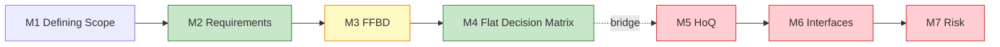
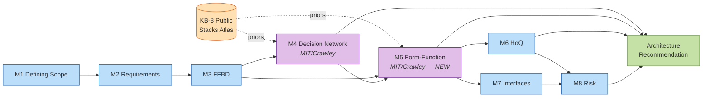
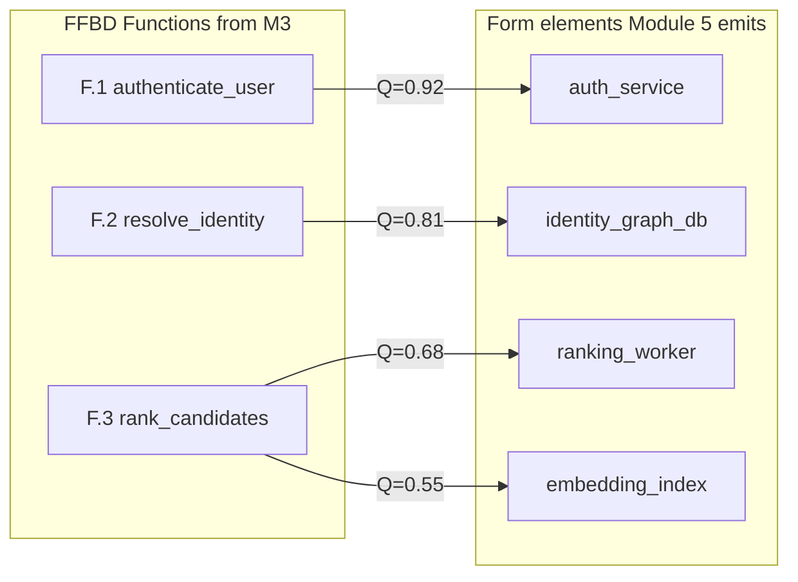
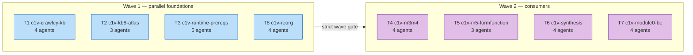
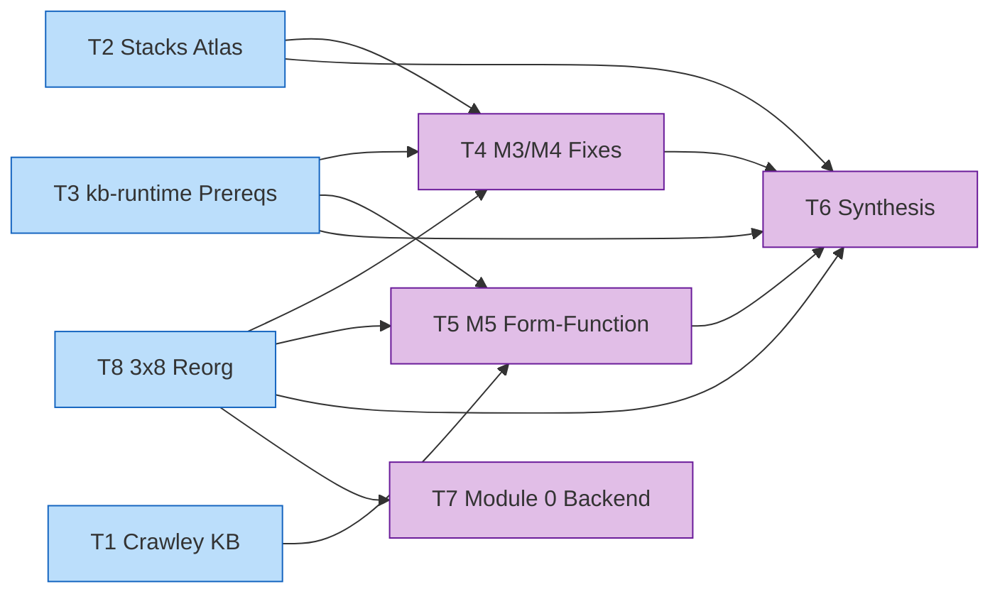

# c1v × MIT-Crawley-Cornell — Hybrid Methodology Pivot Plan

> **STATUS UPDATE 2026-04-24 21:20 EDT — SUPERSEDED BY V2 + 11/12 TEAMS SHIPPED:** This is the **v1 plan**. Authoritative live plan is now [`c1v-MIT-Crawley-Cornell.v2.md`](c1v-MIT-Crawley-Cornell.v2.md). Wave-by-wave status: ✅ Wave 1 (T1/T2/T3/T8/T9/T10), ✅ Wave 2-early (T4a/T7), ✅ Wave 2-mid (T11), ✅ Wave 3 (T4b/T5), 🟡 Wave 4 (T6 — unblocked, pending dispatch). All 11 closed teams meet the T3/T9/T10 canonical verification bar (per-team tag + `verify-t<N>.ts` + `plans/t<N>-outputs/verification-report.md`). The team table at §14 below describes v1 wave structure (8 teams, 2 waves); v2 expanded to 12 teams / 4 waves and is the doc to read.
>
> **Status (original):** DRAFT — awaiting David's review. No TaskCreate, no code, no commits until approved.
> **Slug:** `c1v-MIT-Crawley-Cornell`
> **Framework brand:** c1v MIT-Crawley-Cornell (Cornell CESYS525 front end + MIT/Crawley decision + form-function layer)
> **Author:** Jessica (M3 FFBD PM role in named-peer swarm)
> **Created:** 2026-04-21
> **Build target:** **10–15hr 8-team agent-swarm build** (kb-runtime G1-G11 absorbed as §0 Prerequisites per David 2026-04-21 ~14:30). See §14 for dispatch plan. Then run the resulting pipeline against c1v.
> **Execution style:** `TeamCreate` per team + one `Agent` per teammate, spawned in parallel per wave. Skills attach (a) via `subagent_type` (baked into agent system prompt) and (b) inline in the spawn prompt via `Skill('<skill>')` calls — no agent-definition file edits. Strict wave gating; no human checkpoints inside a team. See §14 + [`plans/team-spawn-prompts.md`](team-spawn-prompts.md).

---

## 0. Prerequisites — kb-runtime foundation (G1–G11)

Per David's 2026-04-21 ~14:30 ruling, the kb-runtime G1–G11 gap list from [`plans/kb-runtime-architecture.md`](kb-runtime-architecture.md) is **absorbed as prerequisites**. The pivot's Crawley math MUST slot into `NFREngineInterpreter`; a standalone `DecisionNetworkEngine` class is FORBIDDEN. Timeline extends from 6hr sketch → **10–15hr** to absorb this scope.

Owned by T3 `c1v-runtime-prereqs` (Wave 1). Authoritative list in kb-runtime-architecture.md §3; short map:

| Gap | Owner role (T3) | Deliverable |
|---|---|---|
| G1 | runtime / backend-architect | `NFREngineInterpreter` class |
| G2 | resolver / backend-architect | `engine.json` rule-tree loader |
| G3 | runtime / backend-architect | Predicate DSL |
| G4 | resolver / backend-architect | `ArtifactReader` (upstream-phase reader) |
| G5 | audit-db / database-engineer | `decision_audit` Drizzle (with `model_version`, `kb_chunk_ids`, `hash_chain_prev` per security-review) |
| G6, G10, G11 | guards / devops-engineer | Fail-closed defaults, PII scrub, `pickModel()` router |
| G7 | guards / devops-engineer | (see kb-runtime-architecture.md — context-size guard) |
| G8, G9 | rag / vector-store-engineer | pgvector + `kb_chunks` table + embedding pipeline |

All M4 Crawley math (utility vectors, Pareto dominance, sensitivity σ²) expresses as `NFREngineInterpreter` rules consuming `kb_chunks` via RAG. Wave 2 (T4, T5, T6) blocks on T3 completion.

---

## 1. Vision

Keep Cornell CESYS525 where it shines (front-end discovery: intake → requirements → functional decomposition), swap the decision layer for MIT/Crawley's decision-network + form-function mapping where c1v's portfolio moat actually lives ("deterministic LLM system for architecture design, grounded in math, with provenance per decision"). Ship the hybrid — branded **c1v MIT-Crawley-Cornell** — in **one 6-hour agent-swarm build window**. Then point the finished pipeline at c1v.

## 2. Problem

**P1 — Current Decision Matrix is thin.** M4's 14 phases implement a flat row×column scoring matrix. No decision dependencies, no Pareto tradespace, no sensitivity. Matches Cornell but under-powers the moat.

**P2 — Form-function mapping is absent entirely.** The gap between "functions identified in FFBD (M3)" and "architectural components that realize those functions (M6 interfaces)" has no formal bridge. Crawley's Concept stage (Form↔Function) is the single most portfolio-legible artifact for an architect role.

**P3 — Decision scoring has no empirical grounding.** LLM-assigned scores are hallucinated. With [KB-8 public-company-stacks-atlas](plans/8-stacks-and-priors-atlas/) in flight, decisions can be anchored in real stacks + DAU + cost bands from public companies. Math becomes data-grounded.

**P4 — 17-step SEBoK pivot is overkill.** +12-16 weeks for aerospace-grade. Wrong tool. Hybrid captures Crawley's rigor without the SEBoK tax.

## 3. Current State (grounded in code)

### 3.1 Schema surface

| Module | Path | Phase files | LOC | Status |
|---|---|---|---|---|
| M1 Defining Scope | F13/1 KB only | 0 | 0 | KB ready, no Zod |
| M2 Dev Sys Reqs | [lib/langchain/schemas/module-2/](apps/product-helper/lib/langchain/schemas/module-2/) | 14 | ~4,000 | ✅ Shipped |
| M3 FFBD | [lib/langchain/schemas/module-3/](apps/product-helper/lib/langchain/schemas/module-3/) | 3 / ~12 | ~1,000 | Gate B shipped, Gate C pending |
| M4 Decision Matrix | [lib/langchain/schemas/module-4/](apps/product-helper/lib/langchain/schemas/module-4/) | 14 | 1,767 | ✅ Shipped (flat matrix) |
| M5 HoQ/QFD | — | 0 | 0 | Only M4 phase-17-dm-to-qfd-bridge exists |
| M6 Interfaces | — | 0 | 0 | Not started |
| M7 Risk | — | 0 | 0 | Not started |
| **KB-8 Public Stacks Atlas** | [plans/8-stacks-and-priors-atlas](plans/8-stacks-and-priors-atlas/) | — | — | **In flight (David scraping now)** |

### 3.2 Agent surface

[lib/langchain/agents/](apps/product-helper/lib/langchain/agents/): intake, extraction, ffbd-agent, decision-matrix-agent, qfd-agent, interfaces-agent, tech-stack, schema-extraction, api-spec, user-stories, infrastructure, guidelines.

### 3.3 What the pivot touches

- **Untouched:** M1 KB, M2, M3 Gate B, [intake/](apps/product-helper/lib/langchain/agents/intake/), extraction-agent, [ffbd-agent.ts](apps/product-helper/lib/langchain/agents/ffbd-agent.ts)
- **Rework:** M4 schemas + [decision-matrix-agent.ts](apps/product-helper/lib/langchain/agents/decision-matrix-agent.ts)
- **New:** Module 5 Form-Function, KB-8 ingestion agent, frontend viz components
- **Reposition:** M5 HoQ → M6, M6 Interfaces → M7, M7 Risk → M8

## 4. End State

Pipeline emits 12 artifacts:

1. **`user_profile.v1` (NEW M0 signup)** — individual or company identity + optional signup-time scraped signals
2. **`project_entry.v1` (NEW M0 entry)** — 3-card selection: New / Existing / Exploring + pipeline routing
3. **`intake_discriminators.v1` (NEW M0 intake)** — top-5 asked discriminators + 7 inferred + pruning set + computed constants
4. `intake_summary.v1` (M2)
5. `requirements.v1` (M2)
6. `ffbd.v1` (M3 — Gate C completes ~8 phases)
7. **`decision_network.v1` (M4 rework)** — directed graph of architectural decisions with Pareto frontier
8. **`form_function_map.v1` (NEW M5)** — function×form matrix with derived quality metric (cited to Stevens/Myers/Constantine + Bass, not Crawley)
9. `hoq.v1` (M6 — was M5)
10. `interface_specs.v1` (M7 — was M6)
11. `risk_assessment.v1` (M8 — was M7)
12. **`architecture_recommendation.v1` (NEW synthesizer)** — combines Pareto frontier + form-function + HoQ + risks

Every numeric decision score cites an empirical prior from KB-8 (public stacks atlas) or is marked `source: 'inferred'` with rationale. Module 0 runs as pre-pipeline gate; its pruning set removes non-viable alternatives before any scoring fires.

## 5. Gap Delta per module

### 5.0 Module 0 — Onboarding + Project Entry + Discriminator Intake (NEW)

Pre-pipeline gate. Captures identity, project intent, and the minimum discriminators that prune the decision network before M1 fires. Runs in ≤3 minutes with aggressive inference from patchy input.

#### 5.0.1 Onboarding (signup)

Two paths, detected from email domain at signup:

| Path | Detection | Capture | Auto-scrape (background) | Output |
|---|---|---|---|---|
| Individual | consumer-email domain (gmail, icloud, proton, etc.) | email, password, name | nothing — respect privacy | `user_profile.v1` with `type: 'individual'` | - > ALREADY BULD
| Company | workplace email (domain not in consumer allowlist) | email, password, name, optional "Is this your company?" confirm | Clearbit/LinkedIn enrichment from domain → industry, employees, funding, website tech stack, compliance badges | `user_profile.v1` with `type: 'company'` + `company_signals: {...}` |

**Signal scrape is non-blocking** — kicks off as background job after signup; user proceeds to product regardless. Cached in `user_signals` Drizzle table keyed by user_id. Failed scrape → user continues without pre-fill.

**Schema sketch:**
```ts
userProfileSchema = z.object({
  user_id: z.string(),
  type: z.enum(['individual', 'company']),
  email: z.string().email(),
  name: z.string().optional(),
  signup_geo: z.string().optional(),  // IP-derived at signup (D9)
  company_signals: z.object({
    domain: z.string().optional(),
    company_name: z.string().optional(),
    industry: z.string().optional(),           // → D6
    employee_count_band: z.string().optional(),// → D1
    funding_stage: z.string().optional(),      // → D8
    website_tech_stack: z.array(z.string()).optional(),
    compliance_badges: z.array(z.string()).optional(),
  }).optional(),
});
```

#### 5.0.2 Project entry (3-card selector — post-signup, per-project)

Replaces current 2-button toggle ("I have a defined scope" / "Help me scope"). Three entry patterns:

| Card | Intent | Pipeline routing | Questions |
|---|---|---|---|
| 🟢 **Build new** | Build from scratch — new SaaS / mobile app / agent / tool | **FULL pipeline M1→M8** | Full discriminator set (top 5 asked, 7 inferred) |
| 🟡 **Help with existing** | Brownfield — migrate, refactor, or add to existing system | **ABBREVIATED** — reverse-derive M3 FFBD from repo scan + M4 decision refresh + M6 HoQ if compliance ask | GitHub repo URL + market/site URL + minimal discriminators |
| 🔵 **Exploring** | Research / learning / curious, no binding project | **FULL pipeline** (same as Build new) — user experiences methodology end-to-end | Full discriminator set |

Per David's ruling: New + Exploring → full pipeline (show the methodology). Existing → abbreviated (respect their time; they have answers).

**Schema sketch:**
```ts
projectEntrySchema = z.object({
  project_id: z.string(),
  user_id: z.string(),
  entry_pattern: z.enum(['new', 'existing', 'exploring']),
  pipeline_start_submodule: z.string(),  // 'M1.1' for new/exploring, 'M3.1' for existing
  existing_project_signals: z.object({
    github_repo_url: z.string().url().optional(),
    market_url: z.string().url().optional(),
    architecture_doc_upload_url: z.string().optional(),
  }).optional(),
});
```

#### 5.0.3 Intake structure — three-tier question model

**Design principles:**
- Every Tier 1 / Tier 2 question is **skippable**; skipping triggers inference with a visible confidence badge
- Target total intake time: **under 2 minutes** across all tiers
- Tier 0 gates always asked (10 seconds, binary); Tier 1 prompted with pre-filled defaults; Tier 2 silent unless conflict or low confidence

---

**Tier 0 — Intent gates (always asked, binary)**

Two yes/no questions route the pipeline before any discriminator:

| # | Gate | YES implication | NO implication |
|---|---|---|---|
| G1 | Do you need help making system design decisions? | Full M4 decision-network pipeline fires (Pareto + sensitivity + alternatives) | Skip M4; run M1→M2→M3 only (scope + requirements + FFBD) |
| G2 | Do you want spec-tight PRD documentation? | Synthesizer fires → PPT / Excel / MD / PDF export pipeline runs | Ephemeral session output only; no export overhead |

Four route combinations from 2 gates: full-methodology+PRD / decisions-only / PRD-only / browse-only.

---

**Tier 1 — Top-5 discriminators (prompted with defaults, skippable, card-specific)**

Questions differ by entry card because D4 means different things for New (aspirational target) vs Existing (empirical current state).

| # | Discriminator | 🟢 New Product card | 🟡 Existing Product card | Downstream impact |
|---|---|---|---|---|
| D0 | Product archetype | "What are you building?" — SaaS / Mobile / Marketplace / API / E-Commerce / Internal Tool / Open Source / Other | (inferred from GitHub repo scan + market URL) | Auto-infers D5, D6, D7, D12 for ~80% of cases |
| D4 | DAU / scale | "Target active users in 6 months?" (aspirational; greenfield assumption, no current users) | "Current active users?" + "What problem are you facing at this scale?" + pain-point picker (highest-leverage options) | New: drives capacity planning. Existing: drives sensitivity-analysis lens (which decisions matter for this pain) |
| D6 | Industry (replaces Regulatory) | Categorized list: Medical + Healthcare / Financial + Fintech / Government + Public / Education / Legal / E-Commerce + Retail / Content + Media / B2B SaaS Agnostic / Infrastructure + Physical / Emerging / Mission-driven / Other | (inferred from market URL scrape if provided) | Auto-infers compliance posture (HIPAA / PCI / SOC2 / GDPR / FedRAMP) + SLA defaults + data sensitivity |
| D8 | Budget range | Bootstrap / Seed / Series A / Enterprise / Undecided | (inferred from funding stage if company email at signup) | Prunes expensive alternatives; converts annual → monthly infra band |
| D7 | Transaction pattern | read-heavy / write-heavy / mixed-CRUD / real-time / batch (D0-based default pre-selected) | (inferred from repo scan — Redis deps → cache-heavy, many indexes → write-heavy, WebSocket deps → real-time) | Reshapes decision network axis (cache vs durability vs latency dominant) |

**Existing-card additional fields:** GitHub repo URL (required — triggers auto-infer of D0/D3/D7/D9/D10/D12), market/site URL (optional — triggers industry + business-model inference).

---

**Tier 2 — Inferred, silent (surface only if confidence <0.60 or signals conflict)**

| # | Discriminator | Inference source |
|---|---|---|
| D1 | Team size | `user_profile.company_signals.employee_count_band` OR D8 budget proxy |
| D2 | Team experience | skipped V1 (low impact + low inference confidence) |
| D3 | Greenfield / brownfield | `project_entry.entry_pattern` — new/exploring → greenfield, existing → brownfield |
| D5 | Business model | D0 archetype + `user_profile.company_signals.industry` |
| D9 | Geographic distribution | `user_profile.signup_geo` from IP at signup → single-region matching |
| D10 | SLA tier | D5 + D6 industry default; surface at M4 only if conflict |
| D12 | Data sensitivity | D0 + D6 industry |

**Schema sketch:**
```ts
intakeDiscriminatorsSchema = z.object({
  project_id: z.string(),
  asked: z.object({
    D0_product_archetype: z.enum(['SaaS','Mobile','Marketplace','API','E-Commerce','Internal-Tool','Open-Source','Other']),
    D4_dau_band: z.enum(['<100','100-1K','1K-10K','10K-100K','100K-1M','1M+']),
    D6_industry: z.string(),   // from industry taxonomy
    D8_budget_band: z.enum(['<$100','$100-1K','$1-10K','$10-100K','$100K+']),
    D7_transaction_pattern: z.enum(['read-heavy','write-heavy','mixed-CRUD','real-time','batch']),
  }),
  inferred: z.object({
    D1_team_size: z.string(),
    D3_project_type: z.enum(['greenfield','brownfield','hybrid']),
    D5_business_model: z.enum(['B2B','B2C','B2B2C','internal-tool']),
    D9_geo: z.string(),
    D10_sla_tier: z.string(),
    D12_data_sensitivity: z.string(),
  }),
  inference_audit: z.array(z.object({
    discriminator: z.string(),
    inferred_value: z.string(),
    confidence: z.number().min(0).max(1),
    sources: z.array(z.string()),  // e.g., ["D0=E-Commerce","user_profile.industry=retail"]
  })),
  pruning_set: z.array(z.object({
    decision_id: z.string(),
    removed_alternatives: z.array(z.string()),
    rationale: z.string(),
  })),
  computed_constants: z.record(z.string(), z.union([z.number(), z.string()])),
});
```

#### 5.0.4 Code map — how Module 0 wires into the existing system

| Component | Path | Status | Purpose |
|---|---|---|---|
| Schema dir | `apps/product-helper/lib/langchain/schemas/module-0/` | NEW | Module 0 schema home |
| Schema | `module-0/user-profile.ts` | NEW | `user_profile.v1` emitted by signup agent |
| Schema | `module-0/project-entry.ts` | NEW | `project_entry.v1` emitted by entry-card UI |
| Schema | `module-0/intake-discriminators.ts` | NEW | `intake_discriminators.v1` emitted by intake agent |
| Schema | `module-0/index.ts` | NEW | Barrel `MODULE_0_PHASE_SCHEMAS` registry |
| Drizzle | `lib/db/schema/user-signals.ts` | NEW | `user_signals` table (company scrape cache, per-user, RLS-scoped) |
| Drizzle | `lib/db/schema/project-entry-states.ts` | NEW | `project_entry_states` table |
| Drizzle migration | `lib/db/migrations/NNNN_module-0.sql` | NEW | Creates both tables with RLS + indexes |
| Agent | `lib/langchain/agents/signup-signals-agent.ts` | NEW | Background job: scrape company domain → user_signals cache |
| Agent | `lib/langchain/agents/discriminator-intake-agent.ts` | NEW | Drives top-5 Q&A + inference synthesis + pruning set computation |
| Frontend | `app/(login)/sign-up/page.tsx` | MODIFY | Detect personal-vs-work email; kick off signal scrape |
| Frontend | `app/(dashboard)/projects/new/page.tsx` | MODIFY | Replace 2-button toggle with 3-card entry selector |
| Frontend | `components/onboarding/entry-cards.tsx` | NEW | 3-card component (New / Existing / Exploring) |
| Frontend | `components/onboarding/discriminator-form.tsx` | EXTEND existing | Add Industry dropdown + Transaction-pattern chips; rename fields to D0/D4/D6/D7/D8 |
| Frontend | `components/onboarding/existing-project-form.tsx` | NEW | GitHub URL + market URL + minimal discriminators for Existing card |
| Route | `app/api/signup-signals/[userId]/route.ts` | NEW | Triggers signal-scrape job post-signup |
| Route | `app/api/preload/module-0/route.ts` | NEW | Serves Module 0 schemas to clients |
| `generate-all.ts` | MODIFY | Prepend `MODULE_0_PHASE_SCHEMAS` loop before Module 2 |
| MCP tools | `lib/mcp/tools/module-0-tools.ts` | NEW | `read_project_entry`, `read_discriminators` for IDE integration |
| `project_run_state.v1` | `.started_from_submodule` | WIRE | Computed from `project_entry.entry_pattern` — new/exploring → 'M1.1', existing → 'M3.1' |

**UI strategy — rip and replace.** The legacy intake UI (4-card toggle from David's screenshot: What are you building / Project stage / Your role / Budget range + defined-scope / help-me-scope binary) is **deprecated in full**. Do not fold, do not remap. New 3-card entry screen (🟢 New Product / 🟡 Existing Product / 🔵 Explore) replaces it entirely.

| Card | Form component | Fields |
|---|---|---|
| 🟢 **New Product** | `components/onboarding/new-product-form.tsx` (NEW) | Tier 0 gates G1 + G2 → Tier 1: D0 archetype + D4 target DAU + D6 industry + D7 transaction pattern + D8 budget |
| 🟡 **Existing Product** | `components/onboarding/existing-product-form.tsx` (NEW) | Tier 0 gates G1 + G2 → GitHub repo URL (required) + market / site URL (optional) + D4 current DAU + pain-point picker |
| 🔵 **Explore** | `components/onboarding/explore-form.tsx` (NEW) | Free-text search across KB-8 + KB-9; no discriminators required |

Every Tier 1 field carries a **"skip — infer for me"** button; skipped values render as inferred with confidence badges so users verify before pipeline runs.

Legacy `components/onboarding/discriminator-form.tsx` → **REPLACE** (delete or archive after 3-card flow ships). All 4 legacy cards (What are you building / Project stage / Your role / Budget range) are deprecated in this migration.

**Pain-point picker (Existing card only):** checkbox list + optional free-text "other" — Cost exploding / Latency spiking / Reliability failing / Can't scale / Compliance gap / Tech debt / Security incident / Other. Selection maps to sensitivity-analysis lens weights at M4 (which decisions to re-evaluate).

**Module 0 total surface:** 3 Zod schemas, 2 Drizzle tables, 2 agents, 3 frontend components, 2 routes, 2 MCP tools. **Est: 800-1,200 LOC total. 1.5-2 hours swarm-build with proper spec.**

**Pipeline integration:** `generate-all.ts` iterates `MODULE_0_PHASE_SCHEMAS` first (before M2), emits 3 JSON Schemas. Discriminator-intake agent writes to `project_data.intake_state.module_0` JSONB column. Module 0 outputs flow into M1 (new/exploring) or M3 (existing) per `entry_pattern`.

---

### 5.1 M4 Decision Matrix → Decision Network (rework)

**Kept (minor tweaks):** phase-1-dm-envelope, phase-3-performance-criteria, phase-4-pc-pitfalls, phase-5-direct-scaled-measures, phase-6-ranges, phase-7-subjective-rubric, phase-8-measurement-scale, phase-9-normalization, phase-10-criterion-weights, phase-18-software-specific-dm

**Rework:** phases 11-13 — handle vector-valued scores across dependent decisions

**New phases:**
- `phase-14-decision-nodes.ts` — decision as graph node with alternatives + local criteria
- `phase-15-decision-dependencies.ts` — directed edges (A's choice constrains B's alternatives)
- `phase-16-pareto-frontier.ts` — tradespace computation
- `phase-17-sensitivity-analysis.ts` — σ² ranking (replaces old phase-17-dm-to-qfd-bridge, which moves to M6)
- `phase-19-empirical-prior-binding.ts` — binds each score to KB-8 citations

**Size:** ~14 files touched + ~5 new. Scope: ~2,000 LOC Zod + agent rewire.

### 5.2 New Module 5 — Form-Function Mapping

Crawley's Concept stage. 7 phase files:

1. `phase-1-form-inventory.ts` — candidate form elements (services, DBs, queues, UI, infra)
2. `phase-2-function-inventory.ts` — pull from M3 `functions_flat_list`
3. `phase-3-concept-mapping-matrix.ts` — n×m realization matrix
4. `phase-4-concept-quality-scoring.ts` — Q(f,g) = specificity × (1 - coupling)
5. `phase-5-operand-process-catalog.ts` — OPM: objects + processes
6. `phase-6-concept-alternatives.ts` — competing decompositions
7. `phase-7-form-function-handoff.ts` — emits `form_function_map.v1`

**Size:** 7 files, ~1,800 LOC + 1 new agent + KB folder (`apps/product-helper/.planning/phases/13-Knowledge-banks-deepened/5-form-function-mapping/`).

### 5.3 Module renumbering (or insert-in-place)

Two options, David's ruling requested:
- **(a) Renumber:** F13/5 → `5-form-function-mapping`, HoQ → `6-HoQ`, Interfaces → `7-interfaces`, Risk → `8-risk`, Stacks Atlas → `9-stacks-atlas`. Cleaner. ~40-60 references to update.
- **(b) Insert-in-place:** keep existing 5/6/7, add form-function as `4b` or sub-module. Uglier but zero-churn.

## 6. Math + Data Grounding (NEW)

### 6.1 Math primitives needed

Current [`mathDerivationSchema`](apps/product-helper/lib/langchain/schemas/module-2/_shared.ts#L117-L150) is **scalar-only**. Hybrid needs:

| Math primitive | Shape | Where used | Status |
|---|---|---|---|
| Little's Law + queueing (M/M/1, M/M/c) | scalar | Peak RPS, wait time | ✅ [`system-design-math-logic.md`](plans/system-design-math-logic.md) |
| Availability (serial ∏Aᵢ, parallel 1-∏(1-Aᵢ)) | scalar | Downtime budget | ✅ already there |
| Decision utility vector U(a) = Σ wᵢ·scoreᵢ | vector per alternative | M4 decision nodes | **NEW** |
| Pareto dominance + frontier | graph (architectures, dominance edges) | M4 Pareto phase | **NEW** |
| Sensitivity σᵢ² (variance under perturbation) | scalar per decision, ranked | M4 sensitivity phase | **NEW** |
| Form-function concept quality Q(f,g) = s·(1-k) | matrix (functions × forms) | M5 | **NEW** |
| Cost curves cost(load) per infra choice | piecewise function | Every decision node | **NEW (grounded in KB-8)** |
| Tail-latency budget chain p95_chain ≈ Σ p95ᵢ | scalar | Decision scoring | **NEW (grounded in KB-8)** |

### 6.2 `mathDerivationSchema.v2` — new shared primitive

Extend `_shared.ts` with:
```
mathDerivationV2 = mathDerivationSchema.extend({
  result_shape: z.enum(['scalar', 'vector', 'matrix', 'graph']),
  result_dimensions: z.array(z.string()).optional(),   // axis labels
  empirical_priors: z.object({
    kb_source: z.string(),                             // 'public-company-stacks-atlas'
    citations: z.array(z.object({ company, url, dau_band, cost_band })),
  }).optional(),
})
```

~60 LOC. M4 + M5 phase schemas extend this instead of scalar base.

### 6.3 KB-8 Public Stacks Atlas — grounding data source

Each atlas entry supplies per public company:
- Company, product, approximate DAU/MAU (banded: 1K / 10K / 100K / 1M / 10M / 100M)
- Stack slots: data layer, cache, compute, queue, CDN, auth, vector store, observability
- Infra providers + region strategy
- Monthly cost band ($/$$/$$$) or documented number
- Scaling inflection events
- Citation links

**Why it matters:** decision-network scoring stops being LLM guesswork. When M4 scores "Postgres vs DynamoDB on cost at 1M DAU," it cites KB-8 entries. Every decision carries a provenance trail.

### 6.4-6.7 Equations (unchanged from prior version)

**Decision utility:** $U_i(a) = \sum_{c \in C_i} w_c \cdot \text{score}(a, c)$

**Pareto dominance:** $\vec{A}_1 \succ \vec{A}_2 \iff \forall i, U_i(\vec{A}_1) \geq U_i(\vec{A}_2)$ and $\exists j, U_j(\vec{A}_1) > U_j(\vec{A}_2)$

**Sensitivity:** $\sigma_i^2 = \text{Var}_{a \in A_i}[U_{\text{total}}(\vec{A} | a_i = a)]$

**Concept quality:** $Q(f,g) = s(f,g) \cdot (1 - k(f,g))$

**Peak RPS:** $\text{peak\_RPS} = \frac{\text{DAU} \times \text{sessions} \times \text{actions} \times \text{peak\_factor}}{86{,}400}$

**Little's Law:** $L = \lambda W$; **M/M/1 wait:** $W = \frac{\rho}{\mu(1-\rho)}$

## 7. Diagrams

### 7.1 Current state



### 7.2 Target — c1v MIT-Crawley-Cornell



### 7.3 Decision network (M4 rework)

```mermaid
flowchart TD
    D1[D1: Data layer<br/>Postgres | Aurora | DynamoDB]
    D2[D2: Cache<br/>Redis | Memcached | none]
    D3[D3: Compute<br/>Vercel | Fly.io | self-host]
    D4[D4: Queue<br/>SQS | Redis | Kafka]

    D1 -->|constrains| D2
    D1 -->|constrains| D4
    D3 -->|constrains| D2
    D3 -->|constrains| D4

    D1 -.->|priors from KB-8| KB[(Stacks Atlas)]
    D2 -.->|priors from KB-8| KB
    D3 -.->|priors from KB-8| KB
    D4 -.->|priors from KB-8| KB
```

### 7.4 Form-function matrix (M5 output)



### 7.5 Swarm dispatch — 8 teams, 2 waves

Authoritative dependency graph lives in §14.2. Summary:



**Old 6-hour / Jordan-Jin-Jessica Gantt:** superseded 2026-04-21 by kb-runtime G1–G11 absorption (§0) + UI freeze + 8-team dispatch. See §14 for the current model.

## 8. Flexibility Contract (NEW)

System must support: start at any phase, loop back for revisions, trace every version.

### 8.1 Already in envelope
- [`_phase_status`](apps/product-helper/lib/langchain/schemas/module-2/_shared.ts#L467): `planned | in_progress | complete | needs_revision` → loop primitive ✅
- [`metadata.revision`](apps/product-helper/lib/langchain/schemas/module-2/_shared.ts#L333-L339): monotonic per (project, phase) → versioning ✅
- [`_insertions[]`](apps/product-helper/lib/langchain/schemas/module-2/_shared.ts#L406-L438): can log diffs across revisions ✅

### 8.2 NEW — `project_run_state.v1` schema (~100 LOC)

Top-level artifact tracking project-wide pipeline state:
```
projectRunStateSchema = z.object({
  project_id: z.string(),
  started_from_phase: z.number(),       // pipeline entry point
  current_phase: z.number(),
  loop_iteration: z.number().int().min(1),
  module_revisions: z.record(z.string(), z.number()),  // 'M1': 3, 'M2': 1, ...
  stub_upstream: z.array(z.string()),   // modules running with stub upstream artifacts
  revision_log: z.array(revisionDeltaSchema),
})
```

Mutated by every phase agent on start/complete/revision.

### 8.3 Envelope extension

Add to [`phaseEnvelopeSchema`](apps/product-helper/lib/langchain/schemas/module-2/_shared.ts#L455):
- `started_from_phase: z.number().optional()`
- `stub_upstream: z.boolean().default(false)`

Lets M5 run with hand-provided M3/M4 stubs for partial-pipeline flows.

### 8.4 Revision-delta schema

Append to `_insertions[]` or new `revision_log[]` field:
```
revisionDeltaSchema = z.object({
  from_revision: z.number(),
  to_revision: z.number(),
  changed_fields: z.array(z.string()),
  changed_by: z.string(),    // agent id or human reviewer
  reason: z.string(),
  timestamp: z.string(),     // ISO-8601
})
```

## 9. Frontend Contract (NEW)

Backend agents change → frontend surfaces change. `x-ui-surface=` annotations auto-route IF [zod-to-json.ts](apps/product-helper/lib/langchain/schemas/zod-to-json.ts) handles new shape primitives (vector/matrix/graph).

### 9.1 New components required

| Component | Path | Displays | Library |
|---|---|---|---|
| Decision-network viewer | `components/diagrams/decision-network-viewer.tsx` | Graph: nodes=decisions, edges=dependencies, hover=alternatives+scores | React Flow or Mermaid |
| Pareto frontier chart | `components/charts/pareto-frontier.tsx` | 2D/3D scatter, frontier highlighted | Recharts or D3 |
| Form-function matrix | `components/diagrams/form-function-matrix.tsx` | N×M heatmap, cell = Q(f,g) | D3 heatmap |
| Sensitivity bar chart | `components/charts/sensitivity-bars.tsx` | Decisions ranked by σ² | Recharts |
| Stacks atlas browser | `app/(dashboard)/kb/stacks-atlas/page.tsx` | Searchable table (company × stack × DAU × cost) | Existing data-table |
| Revision diff viewer | `components/project/revision-diff.tsx` | Artifact JSON diff, revision N vs N+1 | Monaco diff |
| Phase entry selector | `components/onboarding/phase-entry-picker.tsx` | "Start at phase X" + artifact upload | New form |

### 9.2 Agent changes

- `decision-matrix-agent.ts` → rewrite for graph output
- NEW: `form-function-agent.ts`
- NEW: `stacks-atlas-ingestion-agent.ts` (normalizes KB-8 scraped data)
- `intake/` → extend for "start-from-artifact" upload mode

### 9.3 zod-to-json.ts verification

Round-trip must handle new `result_shape: 'vector' | 'matrix' | 'graph'` fields. Likely needs small extension (~50 LOC) so JSON Schema emission doesn't mangle tensor shapes.

## 10. Execution — superseded by §14

> **DEPRECATED.** The original 6-hour / 3-executor (Jordan/Jin/Jessica) sketch is superseded by the **8-team / ~30-agent / 2-wave** dispatch in [§14](#14-team-dispatch-plan). The kb-runtime G1–G11 absorption (§0) extends the critical path to **10–15hr**; frontend work is OUT OF SCOPE for this cycle per David's UI freeze (2026-04-21 ~17:30).

See §14 for team roster, dependency graph, spawn recipe, and skill-attachment matrix. Mechanical spawn prompts live in [`plans/team-spawn-prompts.md`](team-spawn-prompts.md).

## 11. Risks / Open Questions

**R1 — Crawley ToC not yet verified.** ✅ RESOLVED 2026-04-21: Crawley book findings extracted to `plans/research/crawley-book-findings.md` (authoritative, used by T9 patcher per v2 §0.2.4). M5 chapter mapping (Ch 4/5/6/7/8) confirmed against actual ToC; v2 §0.2.4 patch matrix corrected earlier mislabels. Closed by Wave-1 T9 (`t9-wave-1-complete`) and Wave-3 T5 (`t5-wave-3-complete`).

**R2 — KB-8 readiness gates M4/M5 scoring.** ✅ RESOLVED 2026-04-23: threshold lowered 20 → 10 → 7 entries. M4/M5 consume priors with `provisional: true` + `sample_size: N` metadata to widen confidence bands. Corpus passes at N=7 valid entries with ≥1 §6.3-compliant prior each. Fallback re-score loop retained for when corpus grows.

**R3 — Module renumbering churn.** ~40-60 references if renumbering. Insert-in-place (5 as form-function, keep HoQ=5.5 or 6?) is uglier but zero-churn. **David ruling needed.**

**R4 — Dual-emit for `decision_matrix.v1` → `decision_network.v1`.** M4 preload endpoint + agent are live. Plan: dual-emit during transition, deprecate legacy after M6 wired. **Confirm acceptable.**

**R5 — Tensor-shaped results in zod-to-json round-trip.** Current generator flattens. Need ~50 LOC extension to preserve `result_shape` metadata. Testable at Hour 0.

**R6 — Frontend component choice:** React Flow vs Mermaid for decision-network graph. ✅ RESOLVED: React Flow chosen for interactive graphs + Mermaid retained for static agent-emitted diagrams (per `plans/research/zod-frontend-survey.md`, archived in §"Ruling requested from David"). Decision-net interactive viewer is post-v2 work per UI freeze (v2 §15.5 row 2). Mermaid renders ship today via `gen-*` artifact generators (T10).

## 12. Exit Criteria

After the §14 8-team / 10–15hr swarm build (Wave 1 + Wave 2 complete):
- ✅ **SATISFIED 2026-04-24 (v2 Wave 4 close):** All 8 schema-emitting modules (M0 + M2–M8; M1 is KB-only) emit valid JSON Schema via [generate-all.ts](apps/product-helper/lib/langchain/schemas/generate-all.ts) — 61 schemas across 9 modules verified by `build-all-headless.ts` (commit `94f6c0e`).
- ✅ **SATISFIED:** Each module has an agent producing artifacts against the schema — 15/15 artifacts emit per E2E smoke.
- ✅ **SATISFIED:** `mathDerivationV2` primitives round-trip through zod-to-json (T8 reorg + T11 schema-extender; `derivedFrom` discriminated union shipped 2026-04-24).
- ✅ **SATISFIED:** KB-8 (now KB-9 post-T9 hygiene) ingestion produces empirical priors at N=7 valid entries; T6 synthesis cites 7 atlas priors across 4 companies (anthropic, supabase, langchain, vercel). See `plans/t6-outputs/verification-report.md` V6.3.
- ✅ **SATISFIED 2026-04-24:** `project_run_state.v1` Drizzle table + migration `0013_project_run_state.sql` shipped with RLS (commit `3691617`, T6 Wave 4). 6/6 smoke tests green.
- ✅ **SATISFIED:** Crawley math routes through `NFREngineInterpreter` (T3 `t3-wave-1-complete` @ `3641e97`); no standalone engine class.
- ✅ **SATISFIED:** `decision_audit` carries `model_version` + `kb_chunk_ids` + `hash_chain_prev` (T3 G5 deliverable).
- ✅ **SATISFIED 2026-04-24:** E2E smoke test `scripts/build-all-headless.ts` ships (commit `94f6c0e`); 14/14 tests pass; stub project → M1→M8 → `architecture_recommendation.v1` materializes at `.planning/runs/self-application/synthesis/architecture_recommendation.v1.json` (T6 commit `a2ee9b8`).
- ✅ **SATISFIED:** Preload endpoint serves all schema-emitting modules; manifest endpoint added at `/api/projects/[id]/artifacts/manifest` (T10).
- 🟡 **PARTIAL:** MEMORY.md updated with methodology decision + team-dispatch working style; ongoing per session.
- 🚫 Frontend components OUT OF SCOPE this cycle (UI freeze) — exception: FMEA viewer shipped per v2 R-v2.3 (T10 runtime-wirer).

**Self-application complete.** Pipeline pointed at c1v itself; full chain M1 → ... → `architecture_recommendation.v1.json` materialized (4 decisions, 3 Pareto alternatives, 4 derivation chains, 13 residual-risk flags, HoQ embed exact). See `plans/v2-release-notes.md` for end-to-end summary.

---

## Ruling requested from David

Rulings landed (archived): hybrid direction approved; 3×8 submodule reorg approved; Crawley ToC unblocked via `plans/research/crawley-book-findings.md`; React Flow chosen for interactive graphs + Mermaid retained for static agent-emitted diagrams (per `plans/research/zod-frontend-survey.md`); kb-runtime G1–G11 absorbed as §0 Prerequisites (2026-04-21 ~14:30); UI freeze (2026-04-21 ~17:30) — §9 frontend work is OUT OF SCOPE this cycle; KB-8 ingest bootstrap APPROVED 2026-04-21 23:29 EDT (earlier "hold" was a conversational pause).

Still open:

1. **Dual-emit `decision_matrix.v1` during M4 transition** — acceptable, or clean cutover that breaks the live preload endpoint + M4 agent consumers? (Blocks T4 envelope task.)
2. **KB-8 prior-consumption gate** — ✅ RESOLVED 2026-04-23: threshold lowered 20 → 10 → 7 (matches current_valid after medium.com SPA + pre-v2 staging rejections). M4/M5 consume priors once ≥7 entries Zod-parse clean with ≥1 §6.3-compliant math prior. Priors emitted with `provisional: true` + `sample_size: N` metadata so downstream agents can widen confidence bands. (Unblocks T4 + T6.)

Once these two are answered, Bond runs §14 Wave 1 `TeamCreate` + `Agent` calls in one message, then Wave 2 on completion.

---

## 14. Team Dispatch Plan

> Supersedes §10's 3-executor 6-hour sketch. Working style: **`TeamCreate` per team + one `Agent` per teammate**, all spawned from a single coordinator message per wave. Skills attach two ways: (a) via `subagent_type` — the specialized agent's system prompt already includes domain skills — and (b) inline `Skill('<skill-name>')` references in the spawn prompt itself (no agent-definition file edits). Strict wave gating. No human checkpoints inside a team; teams own internal SendMessage choreography. David triggers spawn. Mechanical prompts live in [`plans/team-spawn-prompts.md`](team-spawn-prompts.md).

### 14.1 Roster — 8 teams, ~30 agents, 2 waves

**Wave 1 — parallel foundations (no inter-team deps)**

| Team | `team_name` | Goal | Plan §ref | Members (name / subagent_type / role) |
|---|---|---|---|---|
| T1 Crawley KB | `c1v-crawley-kb` | Extract Crawley book content into JSON/Zod/Drizzle-shaped KB under `.planning/phases/13-.../crawley-sys-arch-strat-prod-dev/` (book pre-parsed; no docling run) | §5.2 (M5 Form-Function) | parser / general-purpose / (no-op: book pre-parsed) · architect / backend-architect / math system-designer, holds JSON/Zod/Drizzle requirements · curator / documentation-engineer / strict-schema KB enhancement · prompt-writer / llm-workflow-engineer / convert extracted content to agent prompts |
| T2 Stacks Atlas | `c1v-kb8-atlas` | Build KB-8 per `public-company-stacks-atlas.md` — 10-Ks + tech blogs + engineering posts | §6.3 empirical priors | architect / database-engineer / atlas schema (company × stack × DAU × cost) · scraper / general-purpose / 10-K + tech blog + engineering post scrape via Docling CLI · curator / documentation-engineer / validate + normalize entries |
| T3 kb-runtime Prereqs | `c1v-runtime-prereqs` | Build NFREngineInterpreter + rule-tree loader + DSL + ContextResolver + `decision_audit` (kb-runtime G1–G11) | §0 Prerequisites | runtime / backend-architect / G1+G3 Interpreter + predicate DSL · resolver / backend-architect / G2+G4 `engine.json` loader + `ArtifactReader` · audit-db / database-engineer / G5 `decision_audit` Drizzle table · guards / devops-engineer / G6+G10+G11 fail-closed + PII + `pickModel()` · rag / vector-store-engineer / G8+G9 pgvector + `kb_chunks` + embedding pipeline |
| T8 3×8 Reorg | `c1v-reorg` | Collapse granular M2/M3/M4 phase files into 24 submodules (3 submodules × 8 KBs) | §5 restructure | mapper / technical-program-manager / old→new mapping doc · refactorer / langchain-engineer / apply reorg across schemas · agent-rewirer / langchain-engineer / update imports + generate-all registrations · verifier / qa-engineer / confirm generate-all still emits valid JSON Schemas |

**Wave 2 — consumers of Wave 1 outputs**

| Team | `team_name` | Goal | Plan §ref | Members |
|---|---|---|---|---|
| T4 M3/M4 Fixes | `c1v-m3m4` | Fix code-reviewer B1 (envelope cap widen), B2 (phase-17 rename), B3 (NFREngineInterpreter integration); finish M3 Gate C 8 remaining FFBD phases | §5.1 + §5.3 M3 Gate C | envelope / langchain-engineer / B1 cap widen + B2 renumber · nfr-bridge / langchain-engineer / B3 wire M4 decisions into NFREngineInterpreter · m3-gate-c / langchain-engineer / 8 FFBD phase files · qa / qa-engineer / tests across all three tracks |
| T5 M5 Form-Function | `c1v-m5-formfunction` | Build Module 5 (Crawley Concept stage); rebrand Q(f,g) as **derived metric** (cite Stevens/Myers/Constantine + Bass, NOT Crawley) | §5.2 | m5-schemas / langchain-engineer / 7 M5 Zod phase files · m5-agent / langchain-engineer / `form-function-agent.ts` · math-attribution / documentation-engineer / rebrand concept quality, cite per `research/math-sources.md` |
| T6 Synthesis + Meta | `c1v-synthesis` | Wire `architecture_recommendation.v1` synthesizer + `project_run_state.v1` Drizzle migration + BUILD ALL headless test; update §10/§11/§12 | §10 rows + §11 risks + §12 exit criteria | synthesizer / langchain-engineer / `architecture_recommendation.v1` agent · drizzle / database-engineer / `project_run_state` table + migration (with RLS) · build-all / qa-engineer / `scripts/build-all-headless.ts` · plan-updater / technical-program-manager / §10/11/12 plan edits (close R1/R6, add R7–R12, testable EC) |
| T7 Module 0 Backend | `c1v-module0-be` | Build Module 0 schema layer + Drizzle tables + agents (NO frontend per David's freeze) | §5.0 schemas + code-map backend rows | schemas / langchain-engineer / 3 Zod schemas in `module-0/` · drizzle / database-engineer / `user_signals` + `project_entry_states` tables (with RLS) · intake-agent / langchain-engineer / `discriminator-intake-agent.ts` · scraper / general-purpose / `signup-signals-agent.ts` for company enrichment |

### 14.2 Dependency graph



### 14.3 Spawn recipe (canonical — full per-team bodies in `team-spawn-prompts.md`)

```text
TeamCreate({
  team_name: "c1v-crawley-kb",
  agent_type: "tech-lead",
  description: "Parse Crawley System Architecture book into structured KB with JSON/Zod/Drizzle contracts."
})

Agent({
  subagent_type: "general-purpose",
  team_name: "c1v-crawley-kb",
  name: "parser",
  description: "Docling-parse Crawley PDFs (book pre-parsed — no-op unless new PDF lands)",
  prompt: "You are 'parser' in team c1v-crawley-kb. Book is pre-parsed; hand off to 'architect' via SendMessage. Use Skill('testing-strategies') before touching any build-verification step."
})

Agent({
  subagent_type: "backend-architect",
  team_name: "c1v-crawley-kb",
  name: "architect",
  description: "Math system-designer",
  prompt: "You are 'architect' in c1v-crawley-kb. Teammates: 'parser' (general-purpose), 'curator' (documentation-engineer), 'prompt-writer' (llm-workflow-engineer). Coordinate by name via SendMessage. Read plans/c1v-MIT-Crawley-Cornell.md §6 + plans/research/math-sources.md. Extract from Crawley Ch 14/15/16 per the chapter-to-destination map in team-spawn-prompts.md. Use Skill('database-patterns') for Drizzle requirements, Skill('api-design') for contract shape, Skill('claude-api') for prompt-caching guidance."
})

// ...similar Agent calls for curator, prompt-writer. Same pattern repeats for T2–T8.
```

Rules:
1. One `Agent` call per teammate in a **single** coordinator message → parallel spawn.
2. `TeamCreate` fires first; `Agent` calls in the immediately-following message.
3. Teammates reference each other by `name`, never by agentId.
4. Permissions must exist in `.claude/settings.json` before dispatch.
5. Skill instructions inline via `Skill('<skill-name>')` in spawn prompts — **no agent-definition file edits**.

### 14.4 Skill attachment matrix

| Role archetype | `subagent_type` | Inline Skills in prompt | MCP access |
|---|---|---|---|
| Math architect | `backend-architect` | `database-patterns`, `api-design`, `claude-api` | context7, memory |
| KB curator | `documentation-engineer` | `code-quality` | context7 |
| Prompt writer | `llm-workflow-engineer` | `claude-api`, `langchain-patterns` | context7, memory |
| Parser / Scraper | `general-purpose` | `testing-strategies` | puppeteer, WebFetch/Search |
| Runtime builder | `backend-architect` | `langchain-patterns`, `security-patterns` | context7, supabase |
| RAG / Vectors | `vector-store-engineer` | `database-patterns` | supabase |
| Drizzle DB | `database-engineer` | `database-patterns` | supabase |
| QA | `qa-engineer` | `testing-strategies` | — |
| Schema refactorer | `langchain-engineer` | `langchain-patterns`, `nextjs-best-practices` | context7 |
| Plan updater | `technical-program-manager` | — | — |

### 14.5 Wave gating + checkpoint policy

- **Strict wave gating.** Wave 2 does not spawn until all Wave 1 teams signal complete (team-level `set_summary` + `TeamDelete`).
- **No human checkpoints inside a team.** Each team owns its internal choreography (e.g., architect → curator → prompt-writer) via SendMessage.
- **David triggers spawn.** Coordinator (Bond) runs Wave 1 `TeamCreate` + `Agent` calls in one message, waits for completion signals, then dispatches Wave 2.
- **Cleanup on completion.** Per team: `SendMessage({to: "<teammate>", message: {type: "shutdown_request"}})` → `TeamDelete({team_name: "<team>"})`.
- **Rolling-vs-strict tradeoff.** Rolling consumption (Wave 2 starts as Wave 1 outputs land) is tempting but introduces partial-state bugs when T8 reorg lands mid-T4. Default is **strict**; revisit if timeline pressure demands.

### 14.6 Dispatch-blocking open questions

- **Dual-emit `decision_matrix.v1`** — blocks T4 envelope task.
- ~~**KB-8 prior-consumption gate**~~ ✅ RESOLVED 2026-04-23: threshold lowered 20 → 10 → 7 (matches current_valid) with `provisional: true` metadata on priors. T4 + T6 unblocked.

Both surface in "Ruling requested from David" above.
