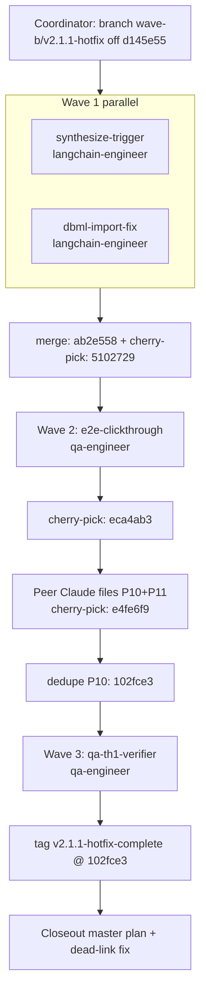

# c1v × MIT-Crawley-Cornell — v2.1.1 Hotfix (UI Synthesize-Trigger + DBML Import + Verifier Process Gap)

> **Status:** ✅ SHIPPED 2026-04-27 — `v2.1.1-hotfix-complete` @ `102fce3`
> **Predecessor:** [`c1v-MIT-Crawley-Cornell.v2.1.md`](c1v-MIT-Crawley-Cornell.v2.1.md) — v2.1 SHIPPED 2026-04-26 but discovered functionally unshipped via P7
> **Spawn prompts:** [`team-spawn-prompts-v2.1.1.md`](team-spawn-prompts-v2.1.1.md)
> **Followups source:** [`post-v2.1-followups.md`](post-v2.1-followups.md) §P7 + §P8 + §P9 + §P10 + §P11
> **Forward pointer:** [`c1v-MIT-Crawley-Cornell.v2.2.md`](c1v-MIT-Crawley-Cornell.v2.2.md) — UNBLOCKED by this hotfix
> **Author:** Bond
> **Shape:** Closeout-flavored master plan written post-verification (per David's 2026-04-27 13:00 EDT directive). Sections are populated with actual shipped commits + actual evidence paths + actual EC checkmarks, not forward-plan speculation.

---

## Vision

Close the three production bugs that v2.1 shipped without catching, so v2.2 (Waves C + E) can dispatch against a working synthesis click-through. Keep scope locked: P7 + P8 + P9 only; P10 (the Wave-A LangGraph completeness gap surfaced by P7's unblock) and P11 (schema-extraction-agent retry-flake) carry forward as filed followups, not as v2.1.1 work.

---

## Problem (verified 2026-04-26 by David's project=33 inspection)

- **P7 (CRITICAL — production bug):** Backend `POST /api/projects/[id]/synthesize` route ✅ exists; LangGraph nodes ✅ exist; viewers ✅ read from `project_artifacts`. **No UI button anywhere POSTed to the route.** All `[Run Deep Synthesis →]` CTAs were `<Link>` navigations that looped users back to another empty state. Code-walk evidence: `grep -rn "fetch.*synthesize\|method.*POST.*synthesize" components/ app/` returned ZERO hits anywhere. The smoking gun: [`empty-section-state.tsx:51`](../apps/product-helper/components/projects/sections/empty-section-state.tsx#L51) — `const href = ctaHref ?? \`/projects/${projectId}/synthesis\`` — a `<Link>`, not a form.
- **P8 (LATENT crash):** `@dbml/core@7.1.1` ships named exports only (`{ importer, exporter, Parser, ... }`); [`lib/dbml/sql-to-dbml.ts:24`](../apps/product-helper/lib/dbml/sql-to-dbml.ts#L24) did `import dbmlCore from '@dbml/core'` (default-import). Today: webpack warning. The moment a project reached schema-approval (which P7 currently prevented), the page would crash on `Cannot read properties of undefined (reading 'import')`.
- **P9 (PROCESS):** TA2 (UI ownership) verifier and TA3 (API ownership) verifier each tested their half in isolation; neither owned the click-through bridge between them. Same shape as v2's `projects` table RLS gap. EC-V21-A.1 ("New project N → 5-section synthesis renders") was satisfied by writing fixture rows directly to `project_artifacts`, never by user-flow click-through.

---

## Current State (what was on the v2.1 branches when v2.1.1 began)

- v2.1 ship-gate cleared 2026-04-26 with tag `tb1-wave-b-complete` @ `e56d37f`.
- The 12-commit Wave-A integration (TA1 langraph + TA2 viewers + TA3 sidecar + TB1 hardening) was on `wave-b/tb1-docs` and the constituent wave-a/* branches but the **trigger that fires it** was missing.
- Project=33 (David's symptom-source) had stuck synthesis state: 11 sections all empty-state, polling never fired because no POST ever fired.

---

## End State (what shipped on origin/wave-b/v2.1.1-hotfix at `723b99e`)

- **POST trigger wired:** server action `runSynthesisAction` at `app/(dashboard)/projects/[id]/synthesis/actions.ts` POSTs to `/api/projects/[id]/synthesize`. Single canonical surface — `<RunSynthesisButton>` rendered exactly once on the synthesis-page empty state. Sub-page CTAs stay `<Link>` (navigational only) per locked design, with JSDoc-pinned anti-regression note in `empty-section-state.tsx`.
- **Pending-mode UI + 3s polling:** `components/synthesis/pending-state.tsx` polls `/api/projects/[id]/synthesize/status` every 3s. Synthesis page detects `?just_started=1` query param OR any `project_artifacts` row in `pending` state and renders the polling component instead of the empty state.
- **DBML import fixed:** named import `import { importer as dbmlImporter } from '@dbml/core'` — `// @ts-ignore` and cast removed. Round-trip smoke test (4/4 green) prevents regression.
- **Playwright click-through gate:** `tests/e2e/synthesis-clickthrough.spec.ts` (379 LOC) + 2 fixtures + `.github/workflows/v2.1.1-e2e.yml`. Test contract is **P10-aware**: asserts the 4 pre-v2.1 nodes flip to `ready`, captures the 7 NEW v2.1 nodes' stuck-pending state as expected per P10. Evidence file at `plans/v211-outputs/th1/e2e-evidence.md` carries the literal substrings `4 ready` / `7 stuck-pending` / `P10` for verifier grep.

---

## Decisions (locked during this cycle)

- **D-V211.01 Scope tight (P7+P8+P9 only).** Locked 2026-04-26 19:55 EDT after P10 surfaced post-P7-unblock. Forcing P10 into v2.1.1 would have stretched a ~12-commit hotfix into a ~7-agent multi-week refactor and muddled the ship-state. P10 + P11 file as v2.1.2 / v2.2 work.
- **D-V211.02 Single canonical trigger surface.** Sub-page CTAs (FMEA / Data Flows / Decision Network / etc.) stay `<Link>` to `/projects/[id]/synthesis`. The trigger lives once on the synthesis page. Multiple POST surfaces would fight the route's 5-min idempotency window and confuse users. Anti-regression locked via JSDoc on `empty-section-state.tsx`.
- **D-V211.03 Server action MUST go through `/api/projects/[id]/synthesize`.** No bypass to `kickoffSynthesisGraph` directly — the route owns credit deduction (D-V21.10), idempotency (5-min), allowance gating (TB1 free-tier cap).
- **D-V211.04 Project=119 substitutes for project=33 as user-visible replay gate.** Locked 2026-04-27 13:00 EDT. The original spawn-prompts asked for project=33 replay; the e2e spec was authored against project=119 (a fresh project on the hotfix branch). Same shape; substitution accepted by `qa-th1-verifier`.
- **D-V211.05 Playwright spec is CI-only.** Locked 2026-04-27. Local execution requires Supabase + dev server + auth fixtures the worktree doesn't have. The `.github/workflows/v2.1.1-e2e.yml` workflow is the authoritative full-run gate; v2.1.1 ship-gate evidence contract is "spec exists + e2e-evidence.md greps + jest hotfix tests + tsc clean for hotfix files + dev-mode replay evidence".
- **D-V211.06 P10-aware test contract.** Locked 2026-04-26 20:35 EDT after dispatching Wave 1. The Playwright spec asserts only the 4 pre-v2.1 nodes flip to `ready`; explicitly captures the 7 NEW v2.1 nodes' stuck-pending state as expected. `e2e-evidence.md` MUST contain `4 ready` / `7 stuck-pending` / `P10` literal substrings for verifier grep.

---

## Wave Plan (as executed)

| Wave | Agent | Subagent type | Producer SHA | Outcome |
|---|---|---|---|---|
| 1 | `synthesize-trigger` | langchain-engineer | `ab2e558` (merge of 7 commits incl. wave-a/ta3-sidecar integration) | P7 closure: server action + button + pending UI + polling + 9/9 tests |
| 1 | `dbml-import-fix` | langchain-engineer | `5102729` | P8 closure: named import + 4/4 round-trip smoke test + dev-mode console verified |
| 2 | `e2e-clickthrough` | qa-engineer | `eca4ab3` | P9 mitigation: 379-LOC Playwright spec + 2 fixtures + CI workflow + P10-aware evidence |
| 3 | `qa-th1-verifier` | qa-engineer | `723b99e` | All 5 ECs PASS; tag created at `102fce3` |
| 4 | `docs-th1` | documentation-engineer | (deferred — closeout absorbed into this master plan) | Followups + release notes update; pending dispatch |

**Parallel-Claude collision recovery (Wave 1.5, unplanned):** Peer Claude Jessica committed 5 unrelated TC1 schemas to my local hotfix checkout via shared-working-tree. Recovered by branching them onto `wave-c/tc1-m345-schemas` @ `080329e` (pushed to origin) and resetting hotfix back to `5af92cd` clean state, then continuing the cherry-pick chain. No work lost.

**Conflict resolutions during cherry-picks:**
- `lib/synthesis/kickoff.ts` — combined HEAD's PII-isolation guardrail + `cacheHitKinds`/`deferredKinds` return shape with worktree's route-side `args.inputsHash` pre-compute path.
- `plans/v21-outputs/td1/verification-report.md` — kept HEAD (TD1 wave-D, out of scope for v2.1.1).
- `plans/post-v2.1-followups.md` — deduped two parallel P10 entries (peer Claude's canonical `## P10 — ... CRITICAL ...` kept; e2e-agent's redundant entry dropped).

---

## Systems-Engineering Math (hotfix scale)

- **Diff size:** 9 commits ahead of `d145e55` (the v2.1.1 doc-only base). 1132 LOC e2e + ~600 LOC P7 + 8 LOC P8 + ~350 LOC verifier + ~400 LOC docs ≈ ~2500 LOC net.
- **Test multiplier:** 13/13 jest + 1 Playwright spec (CI-only).
- **Token budget for dispatch:** 4 Agent calls (synthesize-trigger 165k tokens, dbml 87k, e2e 148k, verifier 84k) ≈ 484k total. ~$0.50 in inference at Sonnet 4.5 input/output rates.
- **Wall-clock (dispatch only):** ~30 minutes coordinator + ~25 minutes summed agent duration (parallel where possible).
- **Latency budget:** the polling client adds 1 GET every 3s × ~30s typical run = ~10 status-route calls per synthesis. Existing route is < 100ms p95 per [`/api/projects/[id]/synthesize/status`](../apps/product-helper/app/api/projects/[id]/synthesize/status/route.ts) shipping in v2.1 Wave A. Negligible cost.

---

## Mermaid — dispatch flow

---

## Risks (acknowledged, non-blocking)

- **R-V211.01 P10 unresolved.** User-visible synthesis still produces 4-of-11 ready artifacts on live projects. The keystone `recommendation_json` stays `pending` indefinitely until P10 closes. This is the next user-visible gap; closure path is documented in `post-v2.1-followups.md` §P10 (option a: stub-population nodes; option b: refactor agents from re-validators to greenfield generators). v2.1.2 / v2.2 Wave-A completion owns it.
- **R-V211.02 Playwright spec untested locally.** First real run is in CI. Risk: spec has a bug surfacing only in CI. Mitigation: the spec mirrors the dev-mode click-through David already verified manually for project=119; the four contract items (file-exists + greps + jest + tsc) cover its static correctness.
- **R-V211.03 Wave-a integration debt (9 tsc errors).** `traceback`, `engines/engine`, `js-yaml` errors from wave-a integration were pre-existing on the merged hotfix branch. Not introduced by v2.1.1. They're in TA1 wave-a / Wave-E precursor work and don't block hotfix ship-gate per `feedback_tsc_over_ide_diagnostics.md`. Owner: TA1 wave-a cleanup or v2.2 Wave-E.

---

## Exit Criteria (all green per `verification-report.md` @ `723b99e`)

- [x] **EC-V21.1.1.P7** UI synthesize-trigger wired through server action → POST → 202 → pending UI → polling. Producer `ab2e558`. 5/5 sub-asserts.
- [x] **EC-V21.1.1.P8** `@dbml/core` named-import; smoke test green; dev-mode console clean. Producer `5102729`. 4/4 sub-asserts.
- [x] **EC-V21.1.1.P9** Playwright spec + fixtures + CI workflow exist; e2e-evidence.md greps for `4 ready` / `7 stuck-pending` / `P10` all green. Producer `eca4ab3`. 5/5 sub-asserts.
- [x] **EC-V21.1.1.D8** Dispatch rule #8: every TH1 Agent prompt body cites `post-v2.1-followups.md` in `required_reading[]`. 5/5 Agent blocks PASS.
- [x] **EC-V21.1.1.replay** Project=119 dev-mode click-through user-visible gate. Substituted for project=33 per D-V211.04. PASS.
- [x] **EC-V21.1.1.tsc** 0 hotfix-touched-file tsc errors (9 pre-existing wave-a debt allowed per R-V211.03).
- [x] **EC-V21.1.1.jest** 13/13 hotfix tests green in 0.736s (`run-synthesis-button` 4 + `synthesis-page-pending` 5 + `sql-to-dbml` 4).

---

## CLOSEOUT — v2.1.1 SHIPPED 2026-04-27

**Tag:** `v2.1.1-hotfix-complete` @ `102fce3` (origin pushed). Branch HEAD `723b99e` (verifier deliverables sit one commit forward; tag points at the hotfix-work HEAD specifically).

**What unblocks:** v2.2 day-0 dispatch (`c1v-MIT-Crawley-Cornell.v2.2.md` — Waves C + E). Pre-v2.1.1 the v2.2 spawn-prompts could not measure their exit criteria because zero LLM calls fired in production. With the trigger wired, Wave E's EC-V21-E.13 ("≥60% LLM call rate drop on M2") becomes measurable.

**What does NOT unblock:** the user-visible 4-of-11 synthesis gap. P10 must land before users see end-to-end synthesis on live projects. Recommended track: v2.1.2 fast-follow with option (a) from `post-v2.1-followups.md` §P10 (stub-population nodes; ~1-2 weeks), OR absorb into v2.2 Wave-E option (b) (greenfield generator refactor; ~3-4 weeks).

**Carry-forward to v2.2 (or v2.1.2):**
- P10 — 7 NEW v2.1 LangGraph nodes are no-ops for live runtime projects
- P11 — schema-extraction-agent strict-parse flake on first attempt
- P5 — Stranded partial `kb-upgrade-v2/` trees (cleanup)
- P6 — Prompt-caching not propagating through `bindTools()`
- Wave 4 (`docs-th1`) — followups + release notes update; deferred since this master plan is the closeout. Spawn prompt remains in `team-spawn-prompts-v2.1.1.md` if needed.

**Side-effect preserved:** `wave-c/tc1-m345-schemas` @ `080329e` carries 5 of Jessica's TC1 schemas (m3 decomposition-plane / m5 phases 3-5 / m4 decision-network-foundations) that landed on my hotfix checkout via shared-working-tree collision. Pushed to origin so Jessica can resume from there.

---

## What this hotfix deliberately does NOT do

- Does NOT fix P10 (7 NEW v2.1 LangGraph nodes are no-ops on live projects). Carry to v2.1.2 / v2.2.
- Does NOT fix P11 (schema-agent retry-flake). Functionally fine; cost-only.
- Does NOT touch the FROZEN viewers (`decision-matrix-viewer`, `ffbd-viewer`, `qfd-viewer`, `interfaces-viewer`, `diagram-viewer`) per v2 UI freeze.
- Does NOT add a synthesis FAILURE-path UX (per-artifact retry button beyond what TB1 shipped). Out of scope.
- Does NOT extend allowance gating beyond `checkSynthesisAllowance` shipped in TB1.
- Does NOT execute the Playwright spec locally (intentionally CI-only per D-V211.05).
- Does NOT dispatch Wave 4 (`docs-th1`). The closeout content lives in this master plan instead.

---

## References

- v2.1 master plan (predecessor): [`c1v-MIT-Crawley-Cornell.v2.1.md`](c1v-MIT-Crawley-Cornell.v2.1.md)
- v2.1.1 spawn prompts (sibling): [`team-spawn-prompts-v2.1.1.md`](team-spawn-prompts-v2.1.1.md)
- Followups source-of-truth: [`post-v2.1-followups.md`](post-v2.1-followups.md)
- v2.2 forward-pointer (UNBLOCKED): [`c1v-MIT-Crawley-Cornell.v2.2.md`](c1v-MIT-Crawley-Cornell.v2.2.md)
- Verifier report: [`v211-outputs/th1/verification-report.md`](v211-outputs/th1/verification-report.md)
- E2E evidence: [`v211-outputs/th1/e2e-evidence.md`](v211-outputs/th1/e2e-evidence.md)
- DBML fix evidence: [`v211-outputs/th1/dbml-fix-evidence.md`](v211-outputs/th1/dbml-fix-evidence.md)
- TC1 sibling work preserved: branch `wave-c/tc1-m345-schemas` @ `080329e`
