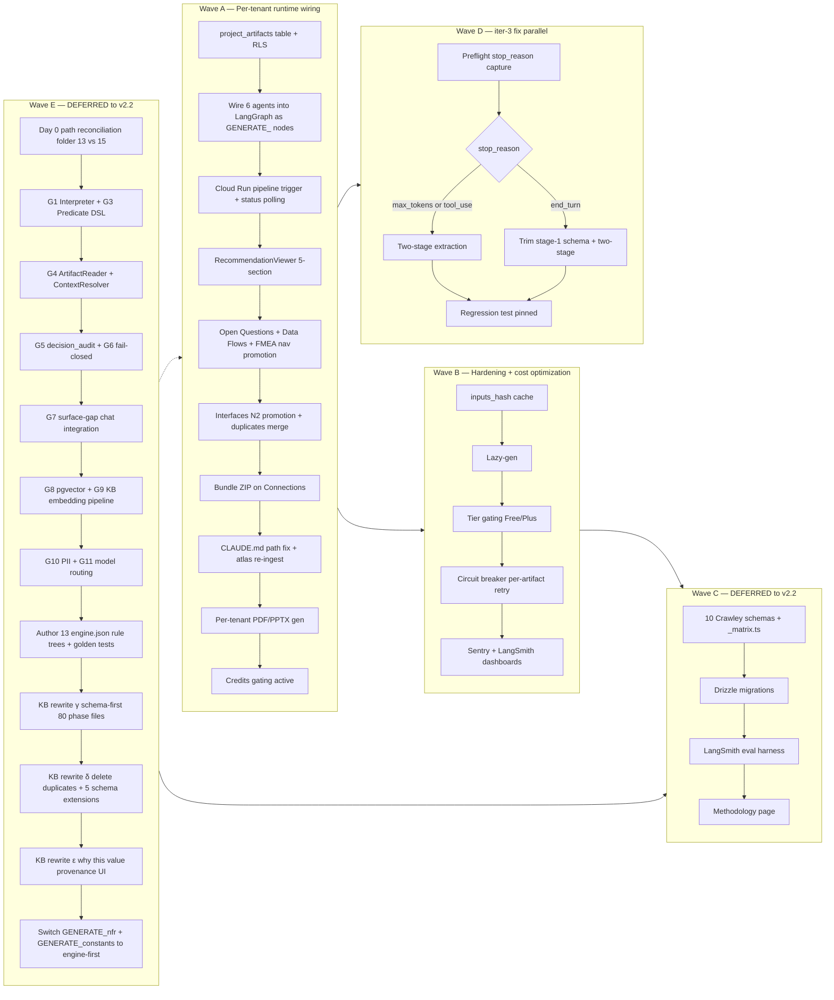
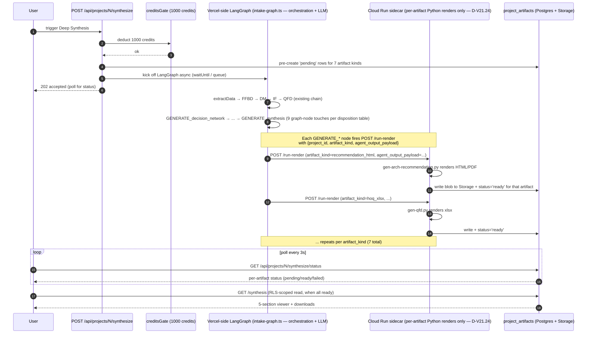
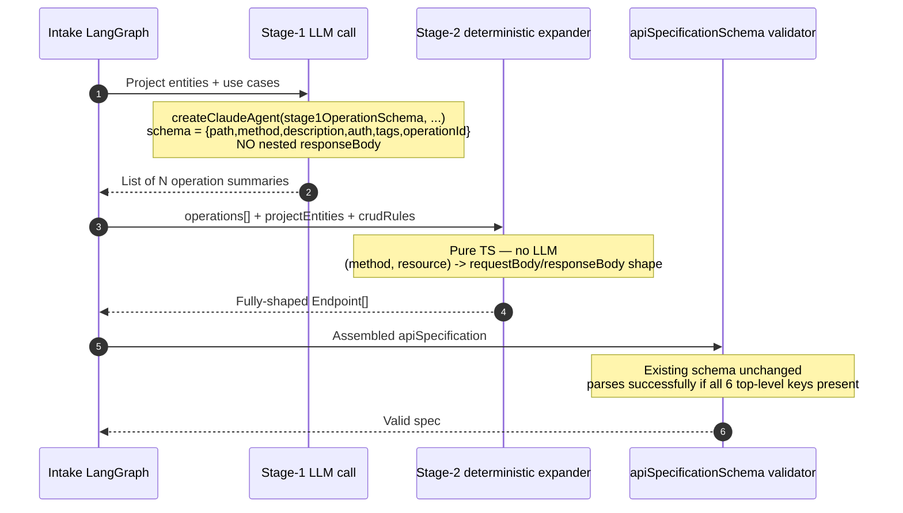
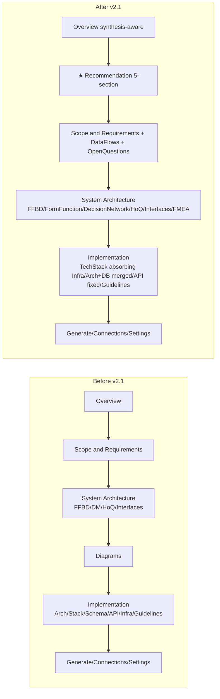

# c1v × MIT-Crawley-Cornell — v2.1 Amendment (Runtime Wiring + UI Surfacing + iter-3 API-Spec Fix)

> **Status:** ✅ SHIPPED 2026-04-26 — all 5 ship-gate tags green (`ta1-wave-a-complete` `0a30d46`, `ta2-wave-a-complete` `1da5ac0`, `ta3-wave-a-complete` `e2d58b2`, `td1-wave-d-complete` `bb1f443`, `tb1-wave-b-complete` `e56d37f`). 26 agents dispatched across 5 teams. v2.1 SHIP GATE CLEARED. See CLOSEOUT section at end of this doc, [`plans/v21-outputs/release/v2.1-shipped.md`](v21-outputs/release/v2.1-shipped.md), and v2.1 summary block in [`plans/v2-release-notes.md`](v2-release-notes.md). Waves C + E carried to [`plans/c1v-MIT-Crawley-Cornell.v2.2.md`](c1v-MIT-Crawley-Cornell.v2.2.md).
> **Slug:** `c1v-MIT-Crawley-Cornell.v2.1`
> **Scope cut (locked 2026-04-25 16:31 EDT):** v2.1 ships **Waves A + B + D only**. Waves C (Crawley typed schemas + eval harness + methodology page) and E (KB runtime architecture rewrite) are **deferred to v2.2**. Their content is preserved in this doc for reference but marked `📦 DEFERRED TO v2.2`; v2.2 stub at [`plans/c1v-MIT-Crawley-Cornell.v2.2.md`](c1v-MIT-Crawley-Cornell.v2.2.md). Rationale: Wave A delivers the portfolio moat (per-tenant synthesis story in the running app); Waves B + D harden + fix iter-3; Waves C + E are quality/depth upgrades that benefit from validated Wave-A behavior before they land.
> **Supersedes (in v2):** §0.4 (folder numbering claim that "T8+T9 merged renumber") — partially superseded; v2.1 acknowledges the on-disk renumber landed but the schema-source-of-truth side is incomplete (10 Crawley schemas not delivered — moved to v2.2). v2.1 reorganizes around **3 concurrent Waves (A/B/D) shipping in v2.1**, with Wave C + Wave E content preserved-but-deferred to v2.2. Wave A = Runtime Wiring + UI Surfacing; Wave B = Hardening + Cost; Wave D = iter-3 API-Spec Two-Stage Fix.
> **Author:** Bond
> **Created:** 2026-04-25
> **Companion docs:**
> - Ideation: [`.claude/plans/v2-runtime-wiring-ideation.md`](../.claude/plans/v2-runtime-wiring-ideation.md) — full Dimension A–O analysis
> - Methodology: [`.claude/plans/kb-upgrade-v2/METHODOLOGY-CORRECTION.md`](../.claude/plans/kb-upgrade-v2/METHODOLOGY-CORRECTION.md) — three-pass ordering
> - Crawley curator: [`.claude/plans/crawley-sys-arch-strat-prod-dev/REQUIREMENTS-crawley.md`](../.claude/plans/crawley-sys-arch-strat-prod-dev/REQUIREMENTS-crawley.md), [`MAPPING-crawley.md`](../.claude/plans/crawley-sys-arch-strat-prod-dev/MAPPING-crawley.md)
> - v2 release notes: [`plans/v2-release-notes.md`](v2-release-notes.md)
> - iter-3 origin: regression diagnostic, this conversation 2026-04-25 13:08 EDT

---

## Vision

c1v's portfolio moat is **"deterministic LLM system for architecture design, grounded in math, with provenance per decision"**. v2 produced the keystone artifact ([`architecture_recommendation.v1.json`](../.planning/runs/self-application/synthesis/architecture_recommendation.v1.json)) and a brilliant rendered HTML demo ([`architecture_recommendation.html`](../.planning/runs/self-application/synthesis/architecture_recommendation.html)) — but **none of it surfaces in the running app**. v2.1 makes the moat visible by wiring the already-built T4b/T5/T6 agents into the runtime LangGraph so every project produces its own per-tenant synthesis (NOT a canned exemplar — every user sees their own data), ships PDF + PPTX generation via the same Python generators that built the c1v self-application, and fixes the iter-3 API-spec regression with structural extraction.

After v2.1, every user who creates a project sees their own 5-section synthesis story (callout / rationale / referenced module outputs / key risks / tradeoffs accepted / embedded figures) — generated from their own intake by the same deterministic pipeline that generated c1v's. PDF + PPTX downloads ship per-tenant.

**v2.2 follow-up (deferred — NOT in v2.1):** the Crawley typed-schema closeout (10 schemas) + eval harness + methodology page (Wave C content) and the KB runtime architecture rewrite (Wave E content — deterministic-rule-tree-first NFR engine + pgvector + decision_audit + multi-turn gap-fill + "why this value?" UI) are preserved in this doc as `📦 DEFERRED TO v2.2` sections. They benefit from validated Wave-A behavior before they land. v2.2 spec is stubbed at [`plans/c1v-MIT-Crawley-Cornell.v2.2.md`](c1v-MIT-Crawley-Cornell.v2.2.md) and references back to the deferred sections here for source content.

---

## Problem (concrete pain points, evidence-backed)

**P1 — Synthesis output is invisible.** [`architecture_recommendation.html`](../.planning/runs/self-application/synthesis/architecture_recommendation.html) renders 5 sections (callout, rationale, referenced-module-outputs, key risks, tradeoffs accepted, embedded figures) for c1v itself. Production users never see this — there is no `/projects/[id]/synthesis/` route, no nav entry, no React component. Walk: [`components/project/nav-config.ts:50-79`](../apps/product-helper/components/project/nav-config.ts#L50-L79) — the left rail has Overview / Scope & Requirements / System Architecture / Diagrams / Implementation / Generate / Connections / Settings. **No "Recommendation"**. The keystone artifact exists on disk and dies there.

**P2 — FMEA route is orphaned.** Page exists at [`app/(dashboard)/projects/[id]/system-design/fmea/page.tsx`](../apps/product-helper/app/(dashboard)/projects/%5Bid%5D/system-design/fmea/page.tsx), `FMEAViewer` component exists at [`components/system-design/fmea-viewer.tsx`](../apps/product-helper/components/system-design/fmea-viewer.tsx), but **the route is missing from `nav-config.ts:55-64`** (System Architecture has FFBD / Decision Matrix / House of Quality / Interfaces — no FMEA). The page reads from `extractedData.fmeaEarly`/`fmeaResidual`; T6 ships these only to disk (`.planning/runs/self-application/...`), never to the project-row JSONB blob, so even if a user nav-stomps to `/system-design/fmea`, they hit the empty state.

**P3 — Interfaces page sub-sections degraded.** Three issues:
- **N2 chart hidden.** Self-app emits [`module-7-interfaces/n2_matrix.v1.json`](../.claude/plans/kb-upgrade-v2/module-7-interfaces/) + xlsx; production interfaces page renders only sequence diagrams + interface specs. The N2 matrix is the highest-value artifact in the page — it's the producer-consumer cross-grid that proves the system is decomposed correctly.
- **Sequence diagrams broken** with "Insufficient message" — [`components/diagrams/diagram-viewer.tsx:88-98`](../apps/product-helper/components/diagrams/diagram-viewer.tsx#L88-L98) has a "safety net" that strips invalid syntax from sequence diagrams; this is a band-aid over an upstream LLM emission bug. Token-heavy, low priority for v2.1 — plan: keep the safety net, add an "explain why this is incomplete" disclosure rather than fix the upstream LLM.
- **Architecture-diagram and DB-schema duplicate.** Walk [`components/projects/sections/architecture-section.tsx`](../apps/product-helper/components/projects/sections/architecture-section.tsx) and [`components/projects/sections/schema-section.tsx`](../apps/product-helper/components/projects/sections/schema-section.tsx) — both render Mermaid blocks of essentially the same backend-component-graph data. User-flagged: collapse one into the other.

**P4 — Diagrams page disconnected from sections that need them.** [`app/(dashboard)/projects/[id]/diagrams/page.tsx`](../apps/product-helper/app/(dashboard)/projects/%5Bid%5D/diagrams/page.tsx) is a single-route megapage. The Mermaid for "infrastructure" (deployment topology) belongs inline in the **Tech Stack** section per user's specific call-out. The current arrangement forces the user to context-switch tabs to see the diagram that explains the bullet list of stack choices.

**P5 — Open Questions never surface.** Self-app emits [`module-2-requirements/open_questions.md`](../.claude/plans/kb-upgrade-v2/module-2-requirements/) + [`module-6-qfd/open_questions_resolved.json`](../.claude/plans/kb-upgrade-v2/module-6-qfd/) + [`module-8-risk/open_questions_resolved.json`](../.claude/plans/kb-upgrade-v2/module-8-risk/). `grep -rn "open_questions\|openQuestions" apps/product-helper/{lib,components,app}` returns **0 hits**. The auditability disclosure pattern is incomplete: we show decisions but not the questions that produced them.

**P6 — PPTX + XLSX downloads missing.** v2 [`/api/projects/[id]/artifacts/manifest`](../apps/product-helper/app/api/projects/%5Bid%5D/artifacts/manifest/route.ts) lists JSON + HTML + Mermaid. No PPTX endpoint, no XLSX endpoint. User stated PDF + PPTX must ship in demo. Self-app already has `gen-fmea.py` and `gen-qfd.py` producing xlsx — runtime path is just hookup.

**P7 — Crawley schemas (10 + matrix) not delivered.** Curator authored [`REQUIREMENTS-crawley.md`](../.claude/plans/crawley-sys-arch-strat-prod-dev/REQUIREMENTS-crawley.md) on 2026-04-22 specifying 10 Zod schemas + `module-5/_matrix.ts` (Option Y `mathDerivationMatrixSchema`, 35 phase-local enums, 11 chapter extractions). **None of those 10 schemas exist on disk** (`grep` of `module-5.phase-1-form-taxonomy` etc. across `apps/product-helper/lib` returns 0). v2 shipped JSON artifacts (`decision_network.v1.json`, `form_function_map.v1.json`, etc.) but not the typed-schema layer. The math is in the runtime ENVELOPES but the Crawley structural discipline (Kano taxonomy, F-16 numeric grounding, fuzzy-Pareto, optimization-pattern → architecture-style mapping, full-DSM 9-block decomposition) is not enforced at the type system level.

**P8 — iter-3 API-spec regression unfixed.** Production project=33 generation: schema regression resolved (✅ PASS, transform normalized many-to-one → one-to-many), but apiSpecificationSchema continues to emit auth-only (3-of-6 keys); tightened 6-bullet prompt didn't move the needle. Diagnosis confirmed: [`api-spec-agent.ts:71-127`](../apps/product-helper/lib/langchain/agents/api-spec-agent.ts#L71-L127) embeds `jsonSchemaSchema` at three sites including `endpoint.responseBody`, which scales linearly with endpoint count and bloats the tool-use input_schema past Sonnet 4.5's preferred-completion budget for a 30-endpoint emit. Prompt tightening (Cause B) was insufficient; structural extraction (two-stage) is required.

**P9 — Methodology drift between docs and on-disk module numbering.** [`METHODOLOGY-CORRECTION.md`](../.claude/plans/kb-upgrade-v2/METHODOLOGY-CORRECTION.md) (canonical, 2026-04-20) specifies three-pass ordering with FMEA instrumental between Pass 1 (FFBD) and Pass 2 (Requirements synthesis). On-disk M-numbering still flows M1→M8 with FMEA terminal at M8.b. Documentation says one thing; module folder structure says another; agents read the folder structure and skip the methodology doc. v2.1 must either reconcile or formally accept the drift and document the why.

**P10 — Stale CLAUDE.md path claim.** Project [`CLAUDE.md`](../CLAUDE.md) says L2 v2 artifacts live at `system-design/kb-upgrade-v2/module-{1..7}/`. That path **does not exist** on disk. Actual location: [`plans/kb-upgrade-v2/module-{1..8}/`](kb-upgrade-v2/) (full module-1..8 set; M8 risk added). Note: a duplicate copy at `.claude/plans/kb-upgrade-v2/` also carries the full module 1-8 set (byte-identical to `plans/kb-upgrade-v2/`, verified 2026-04-25 21:40 EDT) and is being converted to a redirect stub by EC-V21-A.0(d) — canonical = `plans/kb-upgrade-v2/` because it is the non-`.claude` working tree intended for cross-Claude visibility, NOT because the `.claude/` copy is missing modules. Agents reading CLAUDE.md follow a dead path on first navigation.

---

## Current State (real code paths, current as of 2026-04-25)

### Left-rail nav surface
[`components/project/nav-config.ts:36-83`](../apps/product-helper/components/project/nav-config.ts#L36-L83):

```
Overview                                              ← single root page
Scope & Requirements                                  ← group
  ├ Problem Statement
  ├ Goals & Metrics
  ├ User Stories
  ├ System Overview
  └ Non-Functional Req.
System Architecture                                   ← group  (NO FMEA)
  ├ FFBD
  ├ Decision Matrix
  ├ House of Quality
  └ Interfaces
Diagrams                                              ← single page
Implementation                                        ← group
  ├ Architecture Diagram                              ← duplicate of Schema (P3)
  ├ Tech Stack
  ├ Database Schema                                   ← duplicate of Architecture (P3)
  ├ API Specification                                 ← regression-flagged (P8)
  ├ Infrastructure                                    ← Mermaid lives here, belongs in Tech Stack (P4)
  └ Coding Guidelines
Generate / Connections / Settings
```

### v2 artifacts on disk vs runtime visibility

| v2 artifact | On-disk location | Runtime route | Status |
|---|---|---|---|
| `architecture_recommendation.v1.json` | `.planning/runs/self-application/synthesis/` | **NONE** | invisible (P1) |
| `architecture_recommendation.html` | same | **NONE** | invisible (P1) |
| `decision_network.v1.json` | self-app + `t4b-outputs/` | `system-design/decision-matrix` | partial — viewer reads v1 matrix shape, not v2 network |
| `form_function_map.v1.json` | self-app | **NONE** (no M5 page exists in nav) | invisible |
| `fmea_residual.v1.json` + `.xlsx` | self-app + `module-8-risk/` | `system-design/fmea` (orphaned route, not in nav) | empty state (P2) |
| `fmea_early.v1.json` | self-app + `t4a-outputs/` | same | empty state (P2) |
| `hoq.v1.json` + `.xlsx` | self-app + `module-6-qfd/` | `system-design/qfd` | partial — XLSX download missing (P6) |
| `n2_matrix.v1.json` | self-app + `module-7-interfaces/` | `system-design/interfaces` | hidden — viewer renders sequence diagrams only (P3) |
| `interface_specs.v1.json` | self-app + `t4b-outputs/` | same | partial |
| `data_flows.v1.json` (M1 phase-2.5) | self-app + `module-1-defining-scope/` | **NONE** | invisible |
| `ffbd.v1.json` (v2) | self-app + `module-3-ffbd/` + `t4a-outputs/` | `system-design/ffbd` | partial — pre-v2 shape |
| Open questions (.md + .json) | 3 modules emit; never read at runtime | **NONE** | invisible (P5) |
| `*.pptx` | none generated yet | **NONE** | not built (P6) |

### Crawley schema delivery vs spec

[`REQUIREMENTS-crawley.md`](../.claude/plans/crawley-sys-arch-strat-prod-dev/REQUIREMENTS-crawley.md) §1 specifies 10 schemas; on disk:

| Crawley schema | Folder existence | Schema file | Status |
|---|---|---|---|
| `module-5.phase-1-form-taxonomy.v1` | ❌ no `module-5/` dir | ❌ | not started |
| `module-5.phase-2-function-taxonomy.v1` | ❌ | ❌ | not started |
| `module-5.phase-3-form-function-concept.v1` | ❌ | ❌ | not started |
| `module-5.phase-4-solution-neutral-concept.v1` | ❌ | ❌ | not started |
| `module-5.phase-5-concept-expansion.v1` | ❌ | ❌ | not started |
| `module-3.decomposition-plane.v1` | ✅ `module-3/` exists | ❌ | not started |
| `module-4.decision-network-foundations.v1` | ✅ | ❌ (existing m4 is Cornell phase-1..19) | not started |
| `module-4.tradespace-pareto-sensitivity.v1` | ✅ | ❌ | not started |
| `module-4.optimization-patterns.v1` | ✅ | ❌ | not started |
| `module-2.requirements-crawley-extension.v1` | ✅ `module-2/` | ❌ | not started |
| `module-5/_matrix.ts` (`mathDerivationMatrixSchema`) | ❌ | ❌ | not started |

### iter-3 API-spec regression site
[`api-spec-agent.ts:71-127`](../apps/product-helper/lib/langchain/agents/api-spec-agent.ts#L71-L127) — `jsonSchemaSchema` embedded at three sites (`requestBody.schema:84`, `endpoint.responseBody:103`, `errorHandling.format:123`). Per-endpoint `responseBody` is the multiplier (× 30 endpoints in production). Symptom: Sonnet 4.5 emits 3-of-6 top-level keys (auth + 2 others), satisfies tool-use early. Already-applied fixes (transform, flat items, maxTokens=12000, prompt enumerations) — none addressed root cause.

### Atlas runtime wiring
Atlas content (11 companies in [`9-stacks-atlas/04-filled-examples/companies/`](../apps/product-helper/.planning/phases/13-Knowledge-banks-deepened/9-stacks-atlas/04-filled-examples/companies/)) is read by exactly two paths:
- [`schemas/atlas/entry.ts:5`](../apps/product-helper/lib/langchain/schemas/atlas/entry.ts#L5) — docstring only
- [`scripts/build-t4b-self-application.ts:392,497`](../apps/product-helper/scripts/build-t4b-self-application.ts#L392) — offline build

[`scripts/ingest-kbs.ts:16`](../apps/product-helper/scripts/ingest-kbs.ts#L16) still points at legacy `8-stacks-and-priors-atlas/` path. `kb_chunks` table set up for atlas ingestion but Phase B run was 0/3289 dedup no-op — atlas is not embedded for runtime retrieval.

---

## End State (what the user sees post-v2.1)

### Left-rail nav surface (after v2.1)

```
Overview                                              ← becomes synthesis-aware (sees latest archRec when status=synthesis-complete)
Recommendation                                  ★ NEW ← top-level entry, renders 5-section ArchRec + downloads
  ├ Summary
  ├ Decisions (D-01..D-04)
  ├ Pareto Frontier (3 alternatives)
  ├ Risks & Tradeoffs
  └ Provenance & Downloads (PDF, PPTX, ZIP, .json)
Scope & Requirements                                  ← unchanged structure
  ├ Problem Statement
  ├ Goals & Metrics
  ├ User Stories
  ├ System Overview
  ├ Data Flows                                  ★ NEW ← surfaces M1 phase-2.5 data_flows.v1
  ├ Non-Functional Req.
  └ Open Questions                              ★ NEW ← surfaces 3 modules' open_questions
System Architecture
  ├ FFBD
  ├ Form-Function Map                           ★ NEW ← surfaces M5 form_function_map.v1
  ├ Decision Matrix                                   ← Cornell weighted-scoring view (preserved)
  ├ Decision Network                            ★ NEW ← Crawley network/Pareto shape (v2 decision_network.v1)
  ├ House of Quality
  ├ Interfaces                                    UPD ← N2 chart promoted to first sub-tab
  │   ├ N2 Matrix                               ★ PROMOTED
  │   ├ Sequence Diagrams                         UPD ← keeps safety-net + adds "Why incomplete?" disclosure
  │   └ Interface Specs
  └ FMEA                                        ★ ADDED to nav (route already exists)
      ├ Early (Pass-1)
      └ Residual (Pass-3)
Diagrams                                          DEPRECATED route ← keeps for back-compat; Mermaid migrated inline
Implementation
  ├ Tech Stack                                    UPD ← absorbs Infrastructure Mermaid (P4)
  ├ Architecture & Database                       MERGED ← combines duplicates (P3); two sub-panes — (a) Architecture Diagram with user-selectable alternative from decision-matrix options (default winning AV); (b) Database Schema with Approve CTA → DBML export
  ├ API Specification                             FIXED ← two-stage extraction (P8)
  └ Coding Guidelines
Generate / Connections / Settings
```

### Synthesis section UX (the keystone)

`<RecommendationViewer>` renders the same 5-section structure as [`architecture_recommendation.html`](../.planning/runs/self-application/synthesis/architecture_recommendation.html):

1. **Winning Alternative card** (orange-bordered, brand: Tangerine `#F18F01`) — AV.NN badge + 4-decision summary
2. **Rationale** — 4-paragraph derivation chain (D-01..D-04)
3. **Referenced module outputs** — table with clickable links to each module artifact + sibling viewer chips
4. **Key risks** — table from `fmea_residual` flagged subset (severity-classified)
5. **Tradeoffs accepted** — Pareto frontier table (winner + 2 dominated)
6. **Embedded figures** — Mermaid blocks rendered via existing `<DiagramViewer>` from `embeddedArtifacts[].content`
7. **Provenance accordion** — `inputs_hash`, `synthesized_at`, `next_steps[]`, "Show JSON / Show Mermaid source / Show derivation chain" disclosures (Dimension L)
8. **Download dropdown** — JSON / HTML / **PDF** / **PPTX** / Bundle ZIP

Every project shows the user's own per-tenant data — generated from their own intake by the wired-in T4b/T5/T6 agents. No canned exemplar fall-back. Pre-synthesis state is an empty-state CTA pointing at /generate.

### Open Questions UX — chat-first (user-locked 2026-04-25 15:11 EDT)

**Primary surface = the existing chat panel.** When synthesis emits an open question (from M2/M6/M8) or when Wave E's NFR engine returns `needs_user_input`, the system pushes a message into the project's chat thread immediately — appearing as a system-sent question with the same look-and-feel as a user-sent message, but visually distinguished (e.g. `system` author, dashed border, pending-answer badge). The user answers in chat; the answer routes back into the artifact / engine that emitted the question.

This unifies Wave A's open-questions consumption with Wave E's `surface-gap.ts` mechanism (D-V21.23 — "reuse existing chat panel"). One channel, not two.

**Secondary surface = an archive page** at `/projects/[id]/requirements/open-questions` that aggregates the same 3 sources (`extractedData.openQuestions.{requirements, qfdResolved, riskResolved}`) into a collapsible-accordion read-only view with status pill (`open` / `resolved` / `deferred`), "Resolved by" link, and "Jump to chat thread" deep link. The archive exists because chat is ephemeral-feeling and users will want a stable reference list.

**Push semantics:** open questions hit the chat as soon as they're emitted (NOT batched until next user visit). Latency target: ≤ 2s from artifact emission to chat-row insert. Empty state pre-synthesis: chat panel shows existing onboarding messages; archive page shows "No open questions yet — they'll appear here as your synthesis runs."

### iter-3 API-spec fix UX

User-visible: API-spec page renders same shape, but completion ratio goes from 50% (3-of-6 keys) → 100%. Internal: stage-1 LLM emits flat operation-summary list (`[{path, method, description, auth, tags, operationId}]`); stage-2 deterministic CRUD-shape expansion fills `requestBody`/`responseBody` from project's entity schema. Stage-3 (optional, Wave-B+) re-prompts LLM only on `responseBody` shape refinement for projects flagged "needs custom response shapes".

---

## Decisions (locked in this plan)

The ideation doc lists 10 open questions (Dimension A–O). v2.1 locks defaults aligned with the portfolio-first positioning per [`memory/project_c1v_portfolio_positioning.md`](../%7E/.claude/projects/-Users-davidancor-Projects-c1v/memory/project_c1v_portfolio_positioning.md):

> **Scope cut applied 2026-04-25 16:31 EDT:** D-V21.13 (Crawley schema delivery) and D-V21.18 through D-V21.23 (Wave E sub-decisions) are **locked but deferred to v2.2**. They remain in the table for reference; v2.2 honors them as starting decisions and does not re-debate. Decisions in scope for v2.1 execution: D-V21.01–.12, .14, .15, .17 (excluding the withdrawn D-V21.16).

| # | Decision | Locked choice | Rationale |
|---|---|---|---|
| **D-V21.01** | Wave A generation strategy | **A2 TS-native** — wire the existing T4b/T5/T6 agents into LangGraph as new GENERATE_* nodes; per-tenant from day one | Agents already shipped per v2 release notes — no greenfield agent work. Per-tenant from day one — every user sees their own synthesis, NOT a canned exemplar |
| **D-V21.02** | PDF + PPTX generation strategy | **A3 hybrid** — TS LangGraph orchestrates, Python sidecar (Cloud Run) runs the same `gen-arch-recommendation` / `gen-qfd` / `gen-fmea` Python generators that produced the c1v self-application | Preserves canonical Python generators; matches T10 infra; same code that produced c1v self-app produces every tenant project |
| **D-V21.03** | Display mechanism | **B3 React shell + raw Mermaid** from `embeddedArtifacts[].content` | Auth/router native; figures byte-equal to self-app |
| **D-V21.04** | DB shape | **E2 new `project_artifacts` table** + Supabase Storage for binaries | Avoids `extractedData` blob bloat + RLS gap inheritance |
| **D-V21.05** | PDF engine | **PDF-2 weasyprint** in Cloud Run sidecar | 100% self-app fidelity; same Python stack as artifact gens |
| **D-V21.06** | PPTX engine | **PPTX-1 python-pptx** (12-slide deck shape per Dimension M.2 table) | Pairs with weasyprint stack; cleanest fidelity |
| **D-V21.07** | Mermaid → PNG | **mmdc CLI cached at gen-time** | Avoids runtime Puppeteer cold-start |
| **D-V21.08** | Bundle hosting | **Supabase Storage presigned URLs** | RLS done right; cheap; cacheable |
| **D-V21.09** | MCP scope | **Ship 6-7 v2 tools** including `get_synthesis_pdf` / `get_synthesis_pptx` in Wave A | IDE-moat differentiator |
| **D-V21.10** | Per-tenant credit cost | **1000 credits / Deep Synthesis** | Matches arch_rec $0.31/project at AV.01 baseline; gating active from day one |
| **D-V21.11** | Bundle ZIP UX entry | **Connections page extension** + per-section dropdown | "Show your work" pillar |
| **D-V21.12** | iter-3 API-spec strategy | **Option 2 two-stage extraction** | Diagnosed root cause = per-endpoint `responseBody` schema bloat in tool-use payload; only Option 2 removes nested schema from LLM emission |
| **D-V21.13** | Module-5 schema delivery | **Defer to Wave C; Wave A/B unblock without** Crawley typed schemas | Curator's 10-schema pack is a code-discipline upgrade, not a runtime blocker. Runtime envelopes already validate the shape; v2.1 promotes them to typed Zod when Wave C lands |
| **D-V21.14** | Methodology-correction display | **Document drift, do not relabel folders** | Per David 2026-04-24 02:24 EDT: "no relabel, just restructure". Add a `/about/methodology` route surfacing METHODOLOGY-CORRECTION.md |
| **D-V21.15** | FMEA route promotion to nav | **Wave A** (one nav-config edit + one data wire-up) | Lowest-cost win on the entire roadmap |
| **D-V21.16** | ~~Synthesis preflight~~ | **WITHDRAWN** — folded into Wave D Step D-0 (executable step, not a tradeoff). Number kept stable to avoid downstream re-numbering. | — |
| **D-V21.17** | Empty-state UX pre-synthesis | **No canned exemplar.** Empty state with CTA to /generate | User-locked 2026-04-25 13:33 EDT — every project shows ITS OWN data; canned c1v exemplar removed from plan |
| **D-V21.18** | KB runtime architecture | **Adopt [`plans/kb-runtime-architecture.md`](kb-runtime-architecture.md) as Wave E** — deterministic rule-tree-first NFR engine + pgvector RAG fallback + decision_audit table + multi-turn gap-fill + "why this value?" UI | User-locked 2026-04-25 14:10 EDT. Foundational infrastructure for the "deterministic LLM system" portfolio narrative. Runs in parallel from Wave A day 1; the M2 NFR + constants slice of Wave A's GENERATE_* nodes inherits Wave E's engine when E ships its M2 engine.json |
| **D-V21.19** | Audit-sink storage | **Postgres `decision_audit` table** (per source plan §3.1 recommendation) | Queryable + joinable for per-field history UI; matches T6 RLS pattern |
| **D-V21.20** | Vector DB host | **Supabase pgvector** | Already-paid infra; no new vendor; matches existing `0011_kb_chunks.sql` migration. Wave E day 0 reconciles whether to extend in place or supersede |
| **D-V21.21** | Embedding model | **OpenAI `text-embedding-3-small`** (1536 dim) via single `EMBEDDINGS_API_KEY` env var | Anthropic doesn't ship a native embedding model; OpenAI is industry baseline + cheap |
| **D-V21.22** | RAG scope (Wave E) | **KB chunks only** in v1; broaden to chat history + upstream artifacts in v2 | Per source §7 recommendation; chunking strategy needs proving before broadening |
| **D-V21.23** | Gap-surface UI | **Reuse existing `components/chat/` window** | Per source §7; zero UI greenfield work; build dedicated `components/decision-review/` panel only if user-testing shows chat is wrong surface |
| **D-V21.24** | Synthesis pipeline split (Vercel ↔ Cloud Run boundary) | **Vercel hosts the LangGraph orchestration; Cloud Run sidecar = per-artifact rendering only.** Sidecar receives `POST /run-render` with `{project_id, artifact_kind, agent_output_payload}`; renders via canonical Python generators (`gen-arch-recommendation` / `gen-qfd` / `gen-fmea` / etc.); writes `project_artifacts` row. Cold-start budget applies only to render path; LLM cost stays on Vercel-side Anthropic SDK metering for unified Sentry instrumentation (TB1). | User-locked 2026-04-25 19:50 EDT per critique iter-1 Issue 11 (`team-spawn-prompts-v2.1-CRITIQUE.md`). Removes ambiguity at TA1↔TA3 boundary in spawn prompts. Honored by TA1 `langgraph-wirer` (Vercel-side) + TA3 `python-sidecar` (rendering-only). |
| **D-V21.25** | Decision Matrix vs Decision Network graph-node coexistence | **Two graph nodes coexist; neither replaces the other.** `generate_decision_matrix` (existing at [`intake-graph.ts:389`](../apps/product-helper/lib/langchain/graphs/intake-graph.ts#L389), unchanged) keeps invoking the existing Cornell weighted-scoring agent and writing to the existing FROZEN `decision-matrix-viewer.tsx`. `generate_decision_network` (NEW) invokes `decision-net-agent.ts` (T4b) and writes to a new decision-network viewer that Wave A ships. Both feed `project_artifacts` with separate `artifact_kind` keys (`decision_matrix_v1` / `decision_network_v1`). | Locked 2026-04-25 21:00 EDT per master-plan critique iter-2 Issue 7. Honors EC-V21-A.10 FROZEN convention (no edit to existing decision-matrix-viewer); matches "show your work" pillar — user sees BOTH the Cornell scorecard AND the Crawley Pareto network as siblings under System Architecture. Closes spawn-prompts critique Issue 4 at master-plan level. |

---

## Wave Plan

### Wave A — Per-tenant runtime wiring (target: 8-12 days; 5-7 day stretch goal)

**Goal:** every project produces its own per-tenant synthesis. **9 already-built agents** wired into the runtime LangGraph as `GENERATE_*` nodes per the **Agent ↔ graph-node mapping** table below (locked 2026-04-25 21:00 EDT per critique iter-2 Issues 5+6+7) — net 4 new nodes, 2 RE-WIRE of existing nodes, 1 new keystone (`generate_synthesis`), and 2 additional NEW nodes for Data Flows + N2 nav routes. PDF + PPTX gen via the Cloud Run sidecar (rendering-only per **D-V21.24**); LangGraph orchestration stays Vercel-side. Synthesis viewer renders the user's own data. **No canned exemplar fall-back.**

**Agent ↔ graph-node mapping (locked 2026-04-25 21:00 EDT per critique iter-2):**

| agent file (under `apps/product-helper/lib/langchain/agents/`) | graph node | T-source | invocation in v2.1 |
|---|---|---|---|
| `system-design/form-function-agent.ts` | `generate_form_function` | T5 | NEW node |
| `system-design/decision-net-agent.ts` | `generate_decision_network` | T4b | NEW node — sibling to existing `generate_decision_matrix` per **D-V21.25** |
| `system-design/interface-specs-agent.ts` | `generate_interfaces` | T4b | RE-WIRE existing [`generate_interfaces`](../apps/product-helper/lib/langchain/graphs/intake-graph.ts#L391) internals |
| `system-design/hoq-agent.ts` | `generate_qfd` | T6 | RE-WIRE existing [`generate_qfd`](../apps/product-helper/lib/langchain/graphs/intake-graph.ts#L390) internals |
| `system-design/fmea-early-agent.ts` | `generate_fmea_early` | T4a | NEW node |
| `system-design/fmea-residual-agent.ts` | `generate_fmea_residual` | T6 | NEW node |
| `system-design/data-flows-agent.ts` | `generate_data_flows` | M1 phase-2.5 | NEW node — required for End State Data Flows nav route |
| `system-design/n2-agent.ts` | `generate_n2_matrix` | M7.a | NEW node — required for EC-V21-A.5 N2 promotion |
| `architecture-recommendation-agent.ts` (644 LOC) | `generate_synthesis` | T6 keystone | NEW node — composes outputs of the 6 system-design agents above into `architecture_recommendation.v1` |

**Out-of-scope agents (NOT wired in v2.1, documented for clarity):**
- `system-design/synthesis-agent.ts` — sibling of `architecture-recommendation-agent.ts`. **`architecture-recommendation-agent.ts` is the canonical synthesizer for v2.1**; `synthesis-agent.ts` stays non-runtime (build-script only).
- `system-design/discriminator-intake-agent.ts` + `signup-signals-agent.ts` — M0 sign-up flow (T7 Wave 2-early scope); orthogonal to v2.1.
- `system-design/ffbd-agent.ts` — already wired at [`intake-graph.ts:388`](../apps/product-helper/lib/langchain/graphs/intake-graph.ts#L388); unchanged in v2.1.

**Files added:**
- `app/(dashboard)/projects/[id]/synthesis/page.tsx` — RecommendationViewer host
- `components/synthesis/recommendation-viewer.tsx` — 5-section component
- `components/synthesis/section-callout.tsx`, `section-rationale.tsx`, `section-references-table.tsx`, `section-risks.tsx`, `section-tradeoffs.tsx`, `section-figures.tsx` — 6 sub-components, layout-only
- `components/synthesis/provenance-accordion.tsx` — Show JSON / Mermaid / Derivation chain
- `components/synthesis/download-dropdown.tsx` — wired to `/api/projects/[id]/artifacts/manifest`
- `components/synthesis/empty-state.tsx` — pre-synthesis CTA to /generate (per D-V21.17)
- `lib/chat/system-question-bridge.ts` — **chat-first surface**: receives `open_question` events from M2/M6/M8 emitters (Wave A) and from Wave E's `surface-gap.ts` (Wave E). Pushes a `system`-authored pending-answer message into the project's chat thread within ≤ 2s. Single bridge — Wave A and Wave E share it. Closes the loop when user replies (routes answer back to emitter).
- `app/(dashboard)/projects/[id]/requirements/open-questions/page.tsx` — **secondary archive surface**: read-only 3-source aggregation with "Jump to chat thread" deep links
- `components/requirements/open-questions-viewer.tsx` — archive view component
- `app/(dashboard)/projects/[id]/requirements/data-flows/page.tsx` — DataFlows surface
- `components/requirements/data-flows-viewer.tsx`
- `components/projects/sections/architecture-and-database-section.tsx` — merged Architecture & Database section host (replaces legacy `architecture-section.tsx` + `schema-section.tsx`)
- `components/projects/architecture-alternative-picker.tsx` — UI for selecting which alternative (AV.01/AV.02/AV.03) drives the rendered architecture diagram; reads from `extractedData.decisionNetwork.alternatives[]` / Pareto frontier
- `components/projects/schema-approval-gate.tsx` — read-only schema render + Approve CTA + DBML export panel
- `lib/db/dbml-transpiler.ts` — pure-TS transpiler from internal schema shape (Drizzle-style entities + relations) to [DBML](https://dbml.dbdiagram.io/home) syntax; round-trip tested against fixture schemas
- `lib/db/schema/project-artifacts.ts` — Drizzle table per D-V21.04
- `lib/db/migrations/000X_project_artifacts.sql` — RLS + tenant isolation per T6 `project_run_state` pattern (RLS from day-one — do NOT mirror `projects` table policies, which carry the documented post-v2 RLS gap). **Number assigned by Wave A Step A-0 migrations audit (NOT hardcoded 0014); the migrations folder has a pre-existing collision at 0011 (`0011_kb_chunks.sql` + `0011_decision_audit.sql` share the number) that must be reconciled before adding new numbers, otherwise `drizzle-kit migrate` apply order is nondeterministic.**
- `services/python-sidecar/orchestrator.py` — Cloud Run task entrypoint for **per-artifact rendering only** per **D-V21.24** (locked 2026-04-25 19:50 EDT; reconciled at lines 244 + 552 per critique iter-2 Issue 8). Receives `POST /run-render` with `{project_id, artifact_kind, agent_output_payload}` from Vercel-side LangGraph; invokes the canonical Python generator for that artifact (`gen-arch-recommendation` / `gen-qfd` / `gen-fmea` / etc. under `scripts/artifact-generators/`); writes binary blob to Supabase Storage + updates `project_artifacts` row via service-role client. Sidecar does NOT host LangGraph or run LLM calls — both stay Vercel-side for unified Anthropic SDK metering + Sentry instrumentation (TB1). Cold-start budget (R-V21.12 < 15s p95) applies only to render path. **BullMQ deferred to a future wave** — scaffolding at `lib/artifact-generators/queue.ts` (dormant since T10) stays in tree as opt-in for future scale; not wired in v2.1.
- `services/python-sidecar/Dockerfile` + Cloud Run config — runs weasyprint + python-pptx + the canonical `gen-arch-recommendation` / `gen-qfd` / `gen-fmea` generators
- `app/api/projects/[id]/synthesize/route.ts` — POST trigger; deducts 1000 credits per D-V21.10; **kicks off the Vercel-side LangGraph (intake-graph.ts) asynchronously per D-V21.24** (does NOT POST to Cloud Run directly — the LangGraph's GENERATE_* nodes individually fire `POST /run-render` to the sidecar with `{project_id, artifact_kind, agent_output_payload}` as each node's output completes); returns 202 immediately with status_url
- `app/api/projects/[id]/synthesize/status/route.ts` — GET status-polling endpoint; returns per-artifact `synthesis_status` from `project_artifacts` (UI polls every 3s until all ready)
- `app/api/projects/[id]/export/bundle/route.ts` — streamed ZIP via `archiver`

**Files edited:**
- [`components/project/nav-config.ts`](../apps/product-helper/components/project/nav-config.ts) — add Recommendation, Open Questions, Data Flows, FMEA, Form-Function, **Decision Network** entries (Decision Matrix preserved as sibling — do NOT rename); collapse Architecture Diagram + Database Schema into "Architecture & Database"; absorb Infrastructure Mermaid into Tech Stack
- **`lib/langchain/agents/system-design/{decision-net,form-function,hoq,fmea-early,fmea-residual,interface-specs}-agent.ts`** — already shipped per v2 release notes; Wave A audits each agent's input/output contract is graph-node-shaped, NOT script-shaped (today they're invoked only by `scripts/build-t{4b,5,6}-self-application.ts`). Any `fs.writeFile`/`fs.readFile` side effects identified in the audit move to graph-node-driven persistence before LangGraph wire-up. **Open-question emission (NEW, locked 2026-04-25 16:28 EDT):** the M2 NFR re-synthesis agent at `lib/langchain/agents/system-design/nfr-resynth-agent.ts` (verified on disk), `hoq-agent.ts` (M6 QFD), and `fmea-residual-agent.ts` (M8.b) are extended to emit `open_question` events via `lib/chat/system-question-bridge.ts` whenever a decision needs user input. Without this emission wiring, the chat-bridge has no producer and EC-V21-A.4's "≤ 2s push" semantic is unachievable. Pattern: each agent calls `bridge.surfaceOpenQuestion({source, question, computed_options, math_trace, project_id})`. The bridge writes to chat thread + ledgers in `extractedData.openQuestions.{requirements|qfdResolved|riskResolved}` for archive-page consumption.
- [`lib/langchain/agents/architecture-recommendation-agent.ts`](../apps/product-helper/lib/langchain/agents/architecture-recommendation-agent.ts) (644 lines) — same audit; this is the synthesizer ("T6 keystone") — verify it composes downstream of the 6 system-design agents in the LangGraph chain
- [`lib/langchain/graphs/intake-graph.ts`](../apps/product-helper/lib/langchain/graphs/intake-graph.ts) — extend per the **Agent ↔ graph-node mapping** table in Wave A Goal above (locked 2026-04-25 21:00 EDT per critique iter-2 Issues 5+6+7). Net: **7 NEW nodes** (`generate_form_function`, `generate_decision_network`, `generate_fmea_early`, `generate_fmea_residual`, `generate_data_flows`, `generate_n2_matrix`, `generate_synthesis`) + **2 RE-WIRE of existing internals** (`generate_qfd` → `hoq-agent`, `generate_interfaces` → `interface-specs-agent`). Existing `generate_ffbd` ([`intake-graph.ts:388`](../apps/product-helper/lib/langchain/graphs/intake-graph.ts#L388)) and `generate_decision_matrix` ([`:389`](../apps/product-helper/lib/langchain/graphs/intake-graph.ts#L389)) are **unchanged** (decision_matrix coexists with new decision_network per **D-V21.25**). This is wiring + targeted re-wires, not greenfield agent design.
- [`app/api/projects/[id]/artifacts/manifest/route.ts`](../apps/product-helper/app/api/projects/%5Bid%5D/artifacts/manifest/route.ts) — query `project_artifacts` table; return PDF / PPTX / Bundle URLs from Supabase Storage
- [`app/(dashboard)/projects/[id]/system-design/fmea/page.tsx`](../apps/product-helper/app/(dashboard)/projects/%5Bid%5D/system-design/fmea/page.tsx) — read from `project_artifacts` for fmeaEarly + fmeaResidual; legible empty state pre-synthesis (no exemplar fall-back)
- [`app/(dashboard)/projects/[id]/system-design/interfaces/page.tsx`](../apps/product-helper/app/(dashboard)/projects/%5Bid%5D/system-design/interfaces/page.tsx) — promote N2 chart sub-tab; add "Why incomplete?" disclosure
- [`components/projects/sections/architecture-section.tsx`](../apps/product-helper/components/projects/sections/architecture-section.tsx) — merge with schema-section; rename to architecture-and-database-section
- [`lib/db/queries.ts`](../apps/product-helper/lib/db/queries.ts) — add `getProjectArtifacts(projectId)`, `getLatestSynthesis(projectId)`
- [`CLAUDE.md`](../CLAUDE.md) — fix stale path claim (P10): `system-design/kb-upgrade-v2/module-{1..7}/` → `plans/kb-upgrade-v2/module-{1..8}/` (canonical module set lives at `plans/kb-upgrade-v2/`; the `.claude/plans/kb-upgrade-v2/` copy is a byte-identical duplicate with the full 1-8 set and is converted to a one-line redirect stub by EC-V21-A.0(d) — canonical chosen because `plans/` is the non-`.claude` working tree, NOT because of any missing modules; verified on disk 2026-04-25 21:40 EDT)
- [`scripts/ingest-kbs.ts`](../apps/product-helper/scripts/ingest-kbs.ts) — point at consolidated `9-stacks-atlas/` path; run Phase B ingest into `kb_chunks` (clears P-list "atlas not embedded for runtime retrieval" finding)

**Tests added:**
- `__tests__/synthesis/recommendation-viewer.test.tsx` — 5-section render, downloads visible, empty state pre-synthesis
- `__tests__/api/manifest.test.ts` — PDF/PPTX URLs returned from `project_artifacts`
- `__tests__/db/project-artifacts-rls.test.ts` — cross-tenant access blocked
- `__tests__/api/synthesize-status.test.ts` — Cloud Run trigger + status-polling lifecycle (no BullMQ)
- `__tests__/langchain/graphs/intake-graph.test.ts` — 7 new GENERATE_* nodes (`generate_form_function`, `generate_decision_network`, `generate_fmea_early`, `generate_fmea_residual`, `generate_data_flows`, `generate_n2_matrix`, `generate_synthesis`) invoke agents and persist outputs; 2 RE-WIRED nodes (`generate_qfd` → hoq-agent, `generate_interfaces` → interface-specs-agent) emit per the new internals

**Wave A exit criteria:**
- [ ] **EC-V21-A.0** **Migrations + agents audit (preflight, blocking).** (a) Reconcile pre-existing `0011_kb_chunks.sql` + `0011_decision_audit.sql` number collision — rename one to `0011a_*` / `0011b_*` (or merge logically); confirm `drizzle-kit migrate` applies all migrations in deterministic order. (b) Audit `lib/langchain/agents/system-design/*-agent.ts` + `architecture-recommendation-agent.ts` for filesystem side effects; any `fs.writeFile`/`fs.readFile` calls move to graph-node-driven persistence. (c) Verify `lib/langchain/graphs/intake-graph.ts` is the canonical graph file (NOT `lib/langgraph/`). (d) METHODOLOGY-CORRECTION.md canonical path resolved. Currently exists at BOTH `.claude/plans/kb-upgrade-v2/METHODOLOGY-CORRECTION.md` AND `plans/kb-upgrade-v2/METHODOLOGY-CORRECTION.md` (verified on disk 2026-04-25 21:40 EDT — the two trees are byte-identical and BOTH carry the full module 1-8 set; `system-design/METHODOLOGY-CORRECTION.md` does NOT exist). Default: keep `plans/kb-upgrade-v2/` as canonical (non-`.claude` working tree, intended for cross-Claude visibility — NOT because the `.claude/` copy is missing modules); convert `.claude/plans/kb-upgrade-v2/METHODOLOGY-CORRECTION.md` to a one-line redirect stub. CLAUDE.md path-claim row (P10) updated in the same commit.
- [ ] **EC-V21-A.1** New project=N with non-trivial intake produces tenant-specific archRec (D-01..D-04 reflect tenant choices, not c1v); synthesis page renders the user's own 5-section synthesis
- [ ] **EC-V21-A.2** PDF + PPTX generation works per-tenant for all 7 v2 artifact families (single 12-slide deck for archRec, 4-6 slide variants for supporting); rendered via Cloud Run Python sidecar
- [ ] **EC-V21-A.3** FMEA route surfaces in left rail; renders the user's own `fmea_early` + `fmea_residual` from `project_artifacts`; legible empty state pre-synthesis (no exemplar fall-back)
- [ ] **EC-V21-A.4** **Open Questions surface chat-first.** When synthesis emits an open question (M2/M6/M8) or when Wave E's NFR engine returns `needs_user_input`, the system pushes a message into the project's chat thread within ≤ 2s of artifact emission, visually distinguished as a system-authored pending-answer row. User's chat reply routes back into the artifact/engine that emitted the question (closes the loop). Secondary archive page at `/projects/[id]/requirements/open-questions` aggregates the same 3 sources read-only with "Jump to chat thread" deep links. Both surfaces have legible empty states pre-synthesis. Wave A and Wave E share this single chat-bridge mechanism (NOT two separate UIs).
- [ ] **EC-V21-A.5** N2 matrix promoted to first sub-tab in Interfaces page
- [ ] **EC-V21-A.6** **Architecture & Database section is interactive, not passive.** Single merged section (P3 dedup honored); Infrastructure Mermaid absorbed into Tech Stack. Two sub-panes:
    - **Architecture Diagram pane:** user selects which architecture to render from the decision-matrix options (the alternatives evaluated in `decision_network.v1.json` / Pareto frontier — typically the 3 alternatives AV.01/AV.02/AV.03). Selection drives the Mermaid render; user can flip between alternatives to see how the architecture changes. Default = winning alternative (AV.01 in self-app).
    - **Database Schema pane:** schema renders read-only first; explicit "Approve" CTA. On approval, schema is transpiled to **DBML** (dbdiagram.io / dbml.dbdiagram.io format) and exposed as a copy-paste block + download. Approval persists per-project (`extractedData.schema.approvedAt`). Re-extraction prompts re-approval.
- [ ] **EC-V21-A.7** [`CLAUDE.md`](../CLAUDE.md) path claims match disk reality (P10 closed)
- [ ] **EC-V21-A.8** `kb_chunks` table contains atlas-derived embeddings (Phase B re-run with corrected source path; row count > 0)
- [ ] **EC-V21-A.9** Bundle ZIP downloads from Connections page; mirrors `system-design/kb-upgrade-v2/module-N/` layout per Dimension M.3
- [ ] **EC-V21-A.10** All section components shadcn-styled, brand-token compliant (consumes existing tokens at `app/theme.css` + `app/globals.css`; Firefly/Porcelain/Tangerine/Danube), dark-mode parity verified. **Applies to in-app React components ONLY.** Generated exports (PDF/PPTX/HTML/PNG/ZIP) are plain B&W — do NOT thread brand styling into weasyprint/python-pptx/mmdc pipelines.
- [ ] **EC-V21-A.11** **Visual approach = use current style + reuse existing components (no Figma blocker).** Bond consumes existing brand tokens at `app/theme.css` + `app/globals.css` (Firefly/Porcelain/Tangerine/Danube); reuses existing shadcn/ui primitives + existing layout patterns from `components/projects/sections/*.tsx`, `components/system-design/*.tsx`, `components/chat/*.tsx`, `components/diagrams/diagram-viewer.tsx`. **Extend, don't invent.** Where a new surface needs novel composition, follow the closest existing analog. David reviews per-pixel before merge as the human gate; no CI-enforced visual regression in v2.1. The "NO LIBERTIES with CSS/design" rule still applies as the global default — for Wave A specifically, the rule is satisfied by reusing what's already in code.
- [ ] **EC-V21-A.12** `inputs_hash` stable across re-runs when intake unchanged; cleanly different when intake changes
- [ ] **EC-V21-A.13** Per-artifact `synthesized_at` + `sha256` + `format` + `synthesis_status` (`pending` / `ready` / `failed`) ledgered in `project_artifacts` table. The `synthesis_status` field powers the Cloud Run pipeline's polling architecture (UI polls every 3s per Diagram 3) AND Wave B's per-artifact retry CTA (EC-V21-B.4).
- [ ] **EC-V21-A.14** Storage paths return signed URLs; RLS prevents cross-tenant access
- [ ] **EC-V21-A.15** Credit gating active (1000 credits/synthesis per D-V21.10). **Cost-per-project tracking is instrumented for dashboards but is NOT a ship-blocker** — per David 2026-04-25 21:09 EDT: "we are moving forward regardless of cost." Cost telemetry feeds Sentry + LangSmith for visibility; AV.01 $0.31/project baseline is an aspirational target, not a v2.1 gate.
- [ ] **EC-V21-A.16** **Empty-state-as-teaching-surface — per-section, not blurred-tile-grid.** Every requirements + system-design section component renders a unified `<EmptySectionState>` (new shared component at `components/projects/sections/empty-section-state.tsx`) when its underlying `project_artifacts` row is missing OR `synthesis_status !== 'ready'`. Pattern (locked): section icon + "[Section name] not generated yet" headline + 1-line "what gets generated" methodology copy (e.g. for QFD: "Run Deep Synthesis to map customer needs to engineering characteristics with weighted correlations and a roof correlation matrix") + `[Run Deep Synthesis →]` CTA (links to `/projects/[id]/synthesis`). Replaces the current inconsistent failure modes — concretely: (a) the 13 red `[INSUFFICIENT (found:X, all:Y)]` rows on `/system-design/interfaces` Sequence Diagrams tab, (b) the raw-Mermaid-source-as-text on `/backend/infrastructure` Activity Diagram card, (c) the bare entity-table dump on `/requirements/architecture` when no ER diagram exists yet, (d) any other section that today renders schema-validation rejections as user-visible red banners. Applies to all 13 section components in `components/projects/sections/` + the 5 system-design viewers (FROZEN viewers honor this via wrapper component, NOT via internal edit). Honors D-V21.17 (no canned data — methodology copy is generic, no exemplar values like "Anthropic / Sonnet 4.5 / pgvector" leak in). The full `/projects/[id]/synthesis` keystone page reuses the same `<EmptySectionState>` for each of its 5 sub-sections (recommendation / decision-network / fmea / qfd / architecture-and-database) when archRec is pre-synthesis — no separate "blurred 5-pillar tile grid" pattern. Locked 2026-04-25 21:21 EDT per master-plan critique iter-2 Issue 14, informed by project=32 UI review (Team Heat Guard) — current populated pages are section-specific (matrix / cards / tables / diagrams), so a unified per-section empty state matches the populated reality better than an invented top-level tile grid.

### Wave B — Hardening + cost optimization (target: 3-5 days post-Wave-A)

**Goal:** make per-tenant gen affordable at scale, reliable under failure, and observable. Wave A ships per-tenant from day one; Wave B makes it sustainable.

**Files added:**
- `lib/cache/synthesis-cache.ts` — `inputs_hash` → cached artifacts lookup (skip regen when hash matches a prior project)
- `lib/jobs/lazy-gen.ts` — defer artifact generation to first viewer hit instead of post-intake (configurable per artifact)
- `lib/billing/synthesis-tier.ts` — Free / Plus tier gating (Free = 1 synthesis/mo, Plus = unlimited)
- `lib/observability/synthesis-metrics.ts` — Sentry + structured logs per agent: latency p95, token cost, failure rate
- `lib/jobs/circuit-breaker.ts` — sidecar timeout → graceful degradation (per-artifact retry button; NO fall-back to canned data)

**Files edited:**
- [`lib/langchain/graphs/intake-graph.ts`](../apps/product-helper/lib/langchain/graphs/intake-graph.ts) — gate GENERATE_* nodes behind cache lookup + tier check
- [`services/python-sidecar/orchestrator.py`](../services/python-sidecar/orchestrator.py) — circuit breaker + per-artifact partial-success: each generator wraps in try/except; failures write `synthesis_status: 'failed'` per-artifact to `project_artifacts` so the UI can show per-artifact retry CTAs. Smaller `services/python-sidecar/run-single-artifact.py` Cloud Run task handles per-artifact retry from the UI (no BullMQ needed — Cloud Run handles retry via Gen2 task semantics).

**Tests added (locked 2026-04-25 21:05 EDT per critique iter-2 Issue 13 — consistency with Wave A + Wave D structure):**
- `__tests__/cache/synthesis-cache.test.ts` — cache hit/miss + 30%+ hit-rate on 10×5 synthetic load (gates EC-V21-B.1)
- `__tests__/jobs/lazy-gen.test.ts` — eager vs on_view classification; 50%+ post-intake p95 drop on deferred subset (gates EC-V21-B.2)
- `__tests__/billing/synthesis-tier.test.ts` — Free hard-cap, Plus unlimited, start-of-month boundary (gates EC-V21-B.3)
- `__tests__/jobs/circuit-breaker.test.ts` — 30s timeout fires; per-artifact failure isolated; NO canned fall-back (gates EC-V21-B.4)
- `__tests__/observability/synthesis-metrics.test.ts` — instrumentation fires on every agent invocation; counters increment correctly; Sentry transport mocked (gates EC-V21-B.5)
- `scripts/load-test-tb1.ts` — synthetic 100 DAU × 30 days simulated load; cost projection ≤ EC-V21-B.6 target (gates EC-V21-B.6; reproducibility-mandated per spawn-prompts TB1.verifier)

**Wave B exit criteria:**
- [ ] **EC-V21-B.1** `inputs_hash` cache hit-rate > 30% on synthetic load test (10 projects × 5 re-runs)
- [ ] **EC-V21-B.2** Lazy-gen reduces post-intake p95 latency by ≥ 50% on artifacts not viewed in first session
- [ ] **EC-V21-B.3** Free tier hard-capped at 1 synthesis/mo; Plus unlimited
- [ ] **EC-V21-B.4** Sidecar circuit breaker trips at 30s timeout; user sees per-artifact "retry" button, NOT a generic error page or canned fall-back
- [ ] **EC-V21-B.5** Sentry dashboard live for 6 v2 agents — latency p95, token cost/day, failure rate
- [ ] **EC-V21-B.6** **Cost telemetry instrumented + dashboard live** (Sentry per-agent panels per EC-V21-B.5 carry the per-agent cost figures; load-test-tb1.ts produces a monthly-burn projection). **Cost ceiling is NOT a v2.1 ship-blocker** — per David 2026-04-25 21:09 EDT: "we are moving forward regardless of cost." Cache (B.1) + lazy-gen (B.2) + tier gating (B.3) + circuit-breaker (B.4) ship for reliability + scale, not for gating burn. Wave-A unoptimized cost (~$924/mo) and Wave-B optimized cost (~$647/mo) tracked in `Systems-Engineering Math §Cost` table for visibility.

### Wave C — Crawley schema closeout + eval harness 📦 DEFERRED TO v2.2

> **Status (locked 2026-04-25 16:31 EDT):** Deferred from v2.1 to v2.2. Content below preserved for v2.2 spec — DO NOT execute as part of v2.1. Decisions D-V21.13, EC-V21-C.0–.6, and Wave C cost columns all carry over to v2.2. v2.2 stub: [`plans/c1v-MIT-Crawley-Cornell.v2.2.md`](c1v-MIT-Crawley-Cornell.v2.2.md).

**Goal (v2.2):** typed-schema layer for Crawley discipline; portfolio determinism narrative.

**Files added:**

> **Namespace resolution (Wave C Step C-0, blocking):** `apps/product-helper/lib/langchain/schemas/module-5-form-function/` already exists on disk and contains the existing form-function-map schema. Default plan: **rename** `module-5-form-function/` → `module-5/` and **absorb** the existing `form-function-map.ts` as `phase-3-form-function-concept.ts` (or whichever Crawley phase aligns). All importers updated; tsc green; `register schemas` returns no duplicate keys. (Alternative if rename is rejected: namespace new work as `module-5-crawley/` and keep both folders — flip default in this section if so.)

- `apps/product-helper/lib/langchain/schemas/module-5/_matrix.ts` — `mathDerivationMatrixSchema` (Option Y per REQUIREMENTS-crawley §5)
- `apps/product-helper/lib/langchain/schemas/module-5/phase-1-form-taxonomy.ts`
- `apps/product-helper/lib/langchain/schemas/module-5/phase-2-function-taxonomy.ts`
- `apps/product-helper/lib/langchain/schemas/module-5/phase-3-form-function-concept.ts` (absorbs the existing `module-5-form-function/form-function-map.ts` after the C-0 rename)
- `apps/product-helper/lib/langchain/schemas/module-5/phase-4-solution-neutral-concept.ts`
- `apps/product-helper/lib/langchain/schemas/module-5/phase-5-concept-expansion.ts`
- `apps/product-helper/lib/langchain/schemas/module-3/decomposition-plane.ts`
- `apps/product-helper/lib/langchain/schemas/module-4/decision-network-foundations.ts`
- `apps/product-helper/lib/langchain/schemas/module-4/tradespace-pareto-sensitivity.ts`
- `apps/product-helper/lib/langchain/schemas/module-4/optimization-patterns.ts`
- `apps/product-helper/lib/langchain/schemas/module-2/requirements-crawley-extension.ts`
- `apps/product-helper/lib/langchain/schemas/module-{2,3,4,5}/__tests__/*.test.ts` — round-trip + x-ui-surface coverage per [`REQUIREMENTS-crawley.md §7`](../.claude/plans/crawley-sys-arch-strat-prod-dev/REQUIREMENTS-crawley.md)
- 10 Drizzle migrations per [`REQUIREMENTS-crawley.md §6`](../.claude/plans/crawley-sys-arch-strat-prod-dev/REQUIREMENTS-crawley.md)
- `app/(dashboard)/about/methodology/page.tsx` — surfaces METHODOLOGY-CORRECTION.md (P9)
- `lib/eval/v2-eval-harness.ts` — LangSmith dataset per agent

**Files edited:**
- [`apps/product-helper/lib/langchain/schemas/index.ts`](../apps/product-helper/lib/langchain/schemas/index.ts) — register new module-5 + extension schemas
- [`apps/product-helper/lib/langchain/schemas/module-2/_shared.ts`](../apps/product-helper/lib/langchain/schemas/module-2/_shared.ts) — **0 modifications** per curator decision
- All v2 generators that emit JSON envelopes — re-validate against new typed schemas

**Wave C exit criteria:**
- [ ] **EC-V21-C.0** **Namespace resolution (preflight, blocking).** `module-5-form-function/` resolved into `module-5/` namespace per Step C-0; existing `form-function-map.ts` absorbed as the right Crawley phase; all importers updated; tsc green; `register schemas` returns no duplicate keys.
- [ ] **EC-V21-C.1** All 10 Crawley schemas present; tsc green; round-trip jest tests pass
- [ ] **EC-V21-C.2** `mathDerivationMatrixSchema` in `module-5/_matrix.ts`; 10 matrix sites + 1 scalar chain consume it (per REQUIREMENTS-crawley §5)
- [ ] **EC-V21-C.3** All 10 Drizzle migrations applied; RLS verified
- [ ] **EC-V21-C.4** LangSmith dataset per agent; ≥ 30 graded examples each
- [ ] **EC-V21-C.5** Methodology-correction page rendered; nav entry under Settings or About
- [ ] **EC-V21-C.6** Quarterly inputs_hash drift check job scheduled

### Wave D — iter-3 API-spec two-stage refactor (parallel with Wave A)

**Goal:** unblock production project=33 + future projects from auth-only emission.

**Step D-0 (preflight, blocking):**
- Re-run a failing project's API-spec gen with `console.log({usage: response.usage, stop_reason: response.stop_reason})` injected
- If `stop_reason === "max_tokens" || "tool_use"` → confirms cutoff hypothesis → ship D-1..D-4
- If `stop_reason === "end_turn"` → instruction-bias not bloat → split-only fix won't suffice; need to ALSO trim stage-1 schema down to the bare minimum (path/method/operationId only) so "auth-only" isn't a valid completion

**Step D-1:** Define `stage1OperationSchema` — flat list `{path, method, description, auth, tags, operationId}` (≤8 scalar keys)

**Step D-2:** Define `stage2ExpansionEngine(operations, projectEntities)` — deterministic CRUD-shape mapper that produces `requestBody`/`responseBody` from `(method, resource)` rules + project's entity schema

**Step D-3:** Replace [`api-spec-agent.ts:353`](../apps/product-helper/lib/langchain/agents/api-spec-agent.ts#L353) `createClaudeAgent(apiSpecificationSchema, ...)` with two sequential calls — `createClaudeAgent(stage1OperationSchema, ...)` followed by deterministic stage-2 expansion

**Step D-4:** Keep [`api-spec-agent.ts:127`](../apps/product-helper/lib/langchain/agents/api-spec-agent.ts#L127) `apiSpecificationSchema` for output validation only (final assembled spec must still parse against it). Note: line 71 is the start of the embedded `jsonSchemaSchema` (the bloat source per P8 diagnosis at `:71-127`); `apiSpecificationSchema` itself is defined at line 127 — verified 2026-04-25.

**Step D-5:** Add `__tests__/api-spec-agent.regression.test.ts` — fixture replay of project=33 input; assert all 6 top-level keys present in stage-1+stage-2 assembled output

**Wave D exit criteria:**
- [ ] **EC-V21-D.1** Preflight log captured + recorded in REVIEW.md
- [ ] **EC-V21-D.2** Two-stage flow shipped behind feature flag `API_SPEC_TWO_STAGE=true` (default on for new projects, off for existing to avoid regression)
- [ ] **EC-V21-D.3** Project=33 re-gen succeeds with all 6 keys; deterministic CRUD fallback no longer rendered
- [ ] **EC-V21-D.4** Wave-D regression test pinned to project=33 fixture; CI green
- [ ] **EC-V21-D.5** Token cost per gen drops measurably (stage-1 small schema → fewer input tokens; stage-2 zero LLM tokens for first version)

### Pre-Wave-E Inventory 📦 DEFERRED TO v2.2

> **Status (locked 2026-04-25 16:31 EDT):** Deferred with Wave E. Research pass moves to v2.2 day 0; not executed in v2.1.

Before Wave E day 1 starts (in v2.2), two ~30-60 min research tasks need to land. Output: `plans/wave-e-day-0-inventory.md`.

- **T9 dedup inventory** — confirm what already shipped (52 KBs into `_shared/` per CLAUDE.md state) so Wave E doesn't redo it. Walk `apps/product-helper/.planning/phases/13-Knowledge-banks-deepened/_shared/` + symlink graph; ledger filename + source modules.
- **Migrations on-disk verification** — read `apps/product-helper/lib/db/migrations/0008_enable_pgvector.sql` + `0011_kb_chunks.sql` + `0011_decision_audit.sql`; confirm the delta-migration plan in EC-V21-A.0 still holds (column shapes, RLS policies, index choices).

Not bundled into any EC — this is research that informs Wave E shape, not a Wave E deliverable. The inventory file gets written when whoever picks up this pass does the actual code/db reads.

### Wave E — KB runtime architecture rewrite 📦 DEFERRED TO v2.2

> **Status (locked 2026-04-25 16:31 EDT):** Deferred from v2.1 to v2.2. Content below preserved for v2.2 spec — DO NOT execute as part of v2.1. Decisions D-V21.18 through D-V21.23, R-V21.13 through R-V21.17, EC-V21-E.0–.13, Wave E cost column, and the `surface-gap.ts` ↔ `system-question-bridge.ts` shared-bridge pattern all carry over to v2.2. **Wave A's `system-question-bridge.ts` still ships in v2.1** as the shared transport — Wave E's `surface-gap.ts` producer just doesn't ship until v2.2. The "Contract pin (Wave A ↔ Wave E handshake)" in the integration section below remains the canonical handshake spec for v2.2 to honor when it lands. v2.2 stub: [`plans/c1v-MIT-Crawley-Cornell.v2.2.md`](c1v-MIT-Crawley-Cornell.v2.2.md).

**Source plan:** [`plans/kb-runtime-architecture.md`](kb-runtime-architecture.md) (v1, 2026-04-20). Full detail there; v2.1 §16 below summarizes integration with Waves A–D for v2.2 reference.

**Goal:** replace the LLM-only NFR + constants synthesis path with a Chip-Huyen-style deterministic-rule-tree-first runtime — heuristic match → confidence-clamped auto-fill → LLM-refine fallback only when confidence < 0.90 → multi-turn user gap-fill loop only when fallback also fails. Plus pgvector + embeddings layer for KB retrieval. Plus immutable per-decision audit trail. Plus PII redaction + dynamic model routing. The KB itself is rewritten to a **schema-first 6-section shape** so every phase file is parseable as `engine.json` rules, not free-prose.

**Critical path-reconciliation step (Wave E day 0, blocking):**

The source plan targets `apps/product-helper/.planning/phases/15 - Knowledge-banks-deepened UPDATED/New-knowledge-banks/`. **That path does not exist on disk.** Verified: folder 15 EXISTS but is `15-code-cleanup` (unrelated content). The KB home is `apps/product-helper/.planning/phases/13-Knowledge-banks-deepened/` (post-T9 consolidated; 313 files, `_shared/` symlinks). The source plan is pointed at a dead path.

- [ ] **EC-V21-E.0** Rewrite [`plans/kb-runtime-architecture.md`](kb-runtime-architecture.md) header + §6 to target `13-Knowledge-banks-deepened/` (post-T9 home; the only KB content on disk). Replace the "folder 13 untouched as rollback" strategy — there is no parallel folder to fall back to; rollback is git-branch + `_legacy_2026-04-25/` snapshot of the rewritten phase files. Also as part of this step: (a) inventory T9's already-completed dedup work (52 KBs into `_shared/`) so Wave E doesn't re-do it; (b) verify `0008_enable_pgvector.sql` + `0011_kb_chunks.sql` + `0011_decision_audit.sql` already-on-disk state and confirm the delta-migration plan above (per Wave A Step A-0).

**Files added (per source plan §5 G1–G11):**
- `apps/product-helper/lib/langchain/engine/nfr-engine-interpreter.ts` — G1 generalized from clarification-detector pattern
- `apps/product-helper/lib/langchain/engine/predicate-dsl.ts` — G3 (`_contains`, `_in`, range, etc.)
- `apps/product-helper/lib/langchain/engine/artifact-reader.ts` + `context-resolver.ts` — G4
- `apps/product-helper/lib/langchain/engine/fail-closed-rules.ts` — G6 loader + runner
- `apps/product-helper/lib/langchain/engine/surface-gap.ts` — G7 multi-turn gap-fill engine producer. **Relationship to Wave A's `lib/chat/system-question-bridge.ts` (locked 2026-04-25 16:28 EDT):** they are NOT collapsed into one file. `surface-gap.ts` is the Wave-E *producer* that fires when the NFR engine returns `needs_user_input`; it calls into `system-question-bridge.ts` (the shared *bridge/transport*) which delivers the message to the chat panel and ledgers it. Both Wave A's M2/M6/M8 agent-side emitters AND Wave E's `surface-gap.ts` route through the same bridge — single delivery channel, two upstream producers.
- `apps/product-helper/lib/langchain/engine/redact-input.ts` — G10 regex-level PII redaction
- `apps/product-helper/lib/langchain/engine/pick-model.ts` — G11 dynamic model routing (`heuristic` no-LLM / `llm_refine` cheapLLM / `user_surface` streamingLLM)
- `apps/product-helper/lib/db/schema/decision-audit.ts` — G5 Drizzle schema. **A `0011_decision_audit.sql` migration already exists on disk** — Wave E day 0 inventories its current shape; this Drizzle file describes the shape after Wave-E extensions, the migration below is a delta.
- `apps/product-helper/lib/db/migrations/000X_decision_audit_extensions.sql` — **DELTA migration** extending the existing `0011_decision_audit.sql` table with Wave-E NFR-engine fields (`matched_rule_id`, `inputs_used`, `modifiers_applied`, `final_confidence`, `override_history` if not already present). Number assigned by Wave A Step A-0 audit. NOT a new table.
- `apps/product-helper/lib/db/migrations/000X_kb_chunks_engine_extensions.sql` — **DELTA migration** extending the existing `0011_kb_chunks.sql` schema with engine-needed fields if any (e.g. `module_phase` denormalization for fast filter). **`pgvector` extension is already enabled at `0008_enable_pgvector.sql` — DO NOT re-enable.** **`kb_chunks` table already exists** — extend in place; do NOT create a parallel table.
- `apps/product-helper/scripts/embed-kb.ts` — G9 chunk-and-embed pipeline (313 KB files via OpenAI `text-embedding-3-small`)
- `apps/product-helper/lib/langchain/engine/search-kb.ts` — `searchKB(query, topK, filter?) → KBChunk[]` cosine similarity over `kb_chunks.embedding`
- 13 `engine.json` files per story (one per phase decision tree) — authored content, not code; schema validated by Zod
- `apps/product-helper/lib/langchain/engine/__tests__/golden-rules.test.ts` — golden tests pinning each rule-tree's expected outputs against fixture inputs

**Files edited:**
- [`apps/product-helper/lib/langchain/agents/intake/clarification-detector.ts`](../apps/product-helper/lib/langchain/agents/intake/clarification-detector.ts) — refactor `heuristicCheck()` into the new Interpreter; clarification-detector becomes the first consumer of the engine, not the de-facto engine
- [`apps/product-helper/lib/langchain/config.ts`](../apps/product-helper/lib/langchain/config.ts) — keep 4 named LLMs; route via `pickModel()` instead of direct imports in agents
- [`apps/product-helper/lib/db/schema/v2-validators.ts`](../apps/product-helper/lib/db/schema/v2-validators.ts) — add `strict: true` on Zod parse for output guardrails (catches extra fields per source §2.3)
- [`apps/product-helper/scripts/ingest-kbs.ts`](../apps/product-helper/scripts/ingest-kbs.ts) — extend with embedding pipeline (today only inserts markdown rows; needs to compute + store embedding vectors)
- KB phase files in `13-Knowledge-banks-deepened/` (post-T9 home; 80 phase files M1–M7) — rewrite to schema-first 6-section shape (γ phase per source §6); parallel `_legacy/` snapshots preserved for rollback
- 5 JSON schemas under `apps/product-helper/lib/langchain/schemas/` — extensions per source §6 δ
- New LangGraph nodes for "why this value?" provenance UI per source §6 ε

**Tests added:**
- `__tests__/engine/interpreter.test.ts` — heuristic-first → llm-refine fallback paths
- `__tests__/engine/predicate-dsl.test.ts` — DSL evaluator
- `__tests__/engine/artifact-reader.test.ts` — typed upstream artifact resolution
- `__tests__/engine/fail-closed-rules.test.ts` — STOP GAP rule enforcement
- `__tests__/engine/surface-gap.test.ts` — gap-fill loop completes without infinite recursion
- `__tests__/engine/golden-rules.test.ts` — 13 story engines × N fixtures each
- `__tests__/engine/audit-trail.test.ts` — every decision writes an audit row; override history queryable
- `__tests__/db/decision-audit-rls.test.ts` — cross-tenant audit isolation
- `__tests__/db/pgvector-search.test.ts` — kb_chunks similarity returns expected top-K

**Integration with Wave A:**

Wave A's 9 GENERATE_* nodes inherit Wave E's engine for the M2 NFR + constants slice (specifically the upstream `extract_data` re-wire that currently invokes the M2 NFR agent — Wave A leaves the LLM-agent path in place; Wave E swaps internals behind the same envelope). Concretely:
- `GENERATE_nfr` (currently calls existing M2 NFR agent that uses LLM-only synthesis) — switches to `nfrEngineInterpreter.evaluate(decision, context)` once Wave E ships the M2 engine.json. Until then, falls back to LLM agent (no Wave A regression).
- `GENERATE_constants` (currently bundled inside NFR agent) — extracted into a dedicated node that reads from constants.engine.json
- All 6 nodes route through `pickModel()` instead of direct LLM imports — no behavior change initially, but enables Wave-E cost optimization (heuristic = 0 LLM calls)

This means Wave A and Wave E **share the LangGraph integration surface** — both touch `intake-graph.ts`. Coordination protocol: Wave A wires names; Wave E swaps implementations behind those names.

**Contract pin (Wave A ↔ Wave E handshake — NEW, locked 2026-04-25 16:28 EDT):**

- **`GENERATE_nfr` node** — input: `(projectIntake, upstreamArtifacts)`; output type: the NFR slice of [`lib/langchain/schemas/module-2/submodule-2-3-nfrs-constants.ts`](../apps/product-helper/lib/langchain/schemas/module-2/submodule-2-3-nfrs-constants.ts) (specifically the `nfrs[]` field shape, derived from [`phase-6-requirements-table.ts`](../apps/product-helper/lib/langchain/schemas/module-2/phase-6-requirements-table.ts)). Wave A wraps the existing M2 NFR agent behind this shape. Wave E swaps internals to `nfrEngineInterpreter.evaluate(...)` — must emit the SAME Zod-validated shape.
- **`GENERATE_constants` node** — input: `(projectIntake, upstreamArtifacts, nfrSlice)`; output type: the `constants[]` slice of [`submodule-2-3-nfrs-constants.ts`](../apps/product-helper/lib/langchain/schemas/module-2/submodule-2-3-nfrs-constants.ts) (derived from [`phase-8-constants-table.ts`](../apps/product-helper/lib/langchain/schemas/module-2/phase-8-constants-table.ts)). Wave E reads `constants.engine.json` rule trees behind this shape; output stays Zod-stable.
- **Stable interface version flag:** `nfr_engine_contract_version: 'v1'` lives on each node's output envelope. Wave E increments to `'v2'` only when the node's emitted shape genuinely changes (forces a Wave A re-edit at that point).
- **Failure semantics:** when an engine evaluation returns `final_confidence < 0.90` AND `decision.llm_assist === false` AND no fallback rule matched → node emits `{ status: 'needs_user_input', computed_options: [...], math_trace: '...' }` and routes to `lib/chat/system-question-bridge.ts` (NOT to a thrown error). Both nodes share this failure pattern.
- **Implementation independence proof:** Wave A passes its `__tests__/langchain/graphs/intake-graph.test.ts` with the existing LLM-only NFR agent behind `GENERATE_nfr`; Wave E re-runs the same test with `nfrEngineInterpreter.evaluate(...)` behind `GENERATE_nfr` — both pass. Test fixtures pinned to the Zod shape, NOT the implementation path.

**Wave E exit criteria:**
- [ ] **EC-V21-E.0** Wave E day-0 reconciliation (mechanical only):
    - [x] **(i)** Source plan path rewrite committed — `plans/kb-runtime-architecture.md` lines 3 / 5 / 228 / 251 retargeted from non-existent `15 - Knowledge-banks-deepened UPDATED/` to `13-Knowledge-banks-deepened/` (done 2026-04-25; see R-V21.13 mitigation column)
    - [ ] **(ii)** Snapshot tag `wave-e-pre-rewrite-2026-04-25` created on the feature branch before any phase-file edit
    - The T9 `_shared/` inventory + migration-state audit are NOT in this EC; they live in the separate Pre-Wave-E Inventory pass below (research, not Wave-E deliverable).
- [ ] **EC-V21-E.1** G1 + G3 (Interpreter + Predicate DSL) shipped; clarification-detector refactored to consume engine
- [ ] **EC-V21-E.2** G4 (ArtifactReader + ContextResolver) shipped; tested against 5 representative phase decisions
- [ ] **EC-V21-E.3** G5 (decision_audit table + writer) shipped; RLS verified; every engine evaluation writes an audit row
- [ ] **EC-V21-E.4** G6 (fail-closed rules) loader + runner shipped; all phase files' STOP GAP checklists machine-readable
- [ ] **EC-V21-E.5** G7 (gap-fill loop) wired to existing chat panel; multi-turn flow lands an answer back into context construction
- [ ] **EC-V21-E.6** G8 + G9 (pgvector + embeddings) shipped; 313 KB files embedded into `kb_chunks`; `searchKB(...)` p95 < 200ms
- [ ] **EC-V21-E.7** G10 + G11 (PII redaction + model routing) shipped
- [ ] **EC-V21-E.8** All 13 `engine.json` rule trees authored + golden-tested; ≥ 5 fixtures each
- [ ] **EC-V21-E.9** KB rewrite γ complete: 80 phase files in schema-first 6-section shape across M1–M7
- [ ] **EC-V21-E.10** KB rewrite δ complete: 65 duplicate cross-cutting KBs deleted (delegated to T9 if not already done) + 5 schema extensions landed
- [ ] **EC-V21-E.11** KB rewrite ε complete: LangGraph nodes for "why this value?" provenance UI shipped — every auto-filled NFR/constant exposes the matched rule + math trace + override-history button
- [ ] **EC-V21-E.12** M2 NFR + constants generation switches from LLM-only to engine-first in production; `GENERATE_nfr` and `GENERATE_constants` nodes route through `nfrEngineInterpreter.evaluate(...)`
- [ ] **EC-V21-E.13** Per-decision LLM call rate drops ≥ 60% on M2 (heuristic auto-fill carries most decisions; LLM-refine fires only on `final_confidence < 0.90`)

---

## Systems-Engineering Math

### Cost (per AV.01 baseline at 100 DAU × 30 days) — **INFORMATIONAL ONLY**

> **Cost-as-blocker DECLASSIFIED 2026-04-25 21:09 EDT per David: "we are moving forward regardless of cost."** Table below is for visibility / dashboard wiring (EC-V21-B.5 instruments these figures into Sentry + LangSmith). It does NOT gate v2.1 ship. R-V21.05 declassified; EC-V21-A.15 + EC-V21-B.6 reframed to track instrumentation, not cost ceilings.
>
> **Scope cut applied 2026-04-25 16:31 EDT:** v2.1 ships only Wave A + Wave B (Wave D adds no operational cost). **Wave C and Wave E columns are deferred to v2.2** — preserved in the table for v2.2 spec but NOT part of v2.1 burn. v2.1 net at end of Wave B ≈ $647/mo informational baseline.

| Component | Wave A delta | Wave B delta (optimization) | Wave C delta 📦 v2.2 | Wave E delta 📦 v2.2 |
|---|---:|---:|---:|---:|
| Per-tenant LLM (6 new agents × $0.30/project × 100 projects/day × 30) | +$900/mo | -$300/mo (cache + lazy-gen + tier gating bring this to ~$600) | — | -$240/mo (engine heuristic auto-fill on M2 NFR/constants drops LLM call rate ≥ 60% on the M2 slice) |
| weasyprint Cloud Run sidecar | +$3/mo | -$1/mo (cache) | — | — |
| python-pptx Cloud Run sidecar | +$3/mo | -$1/mo (cache) | — | — |
| Supabase Storage (15MB × 30-day retention × 3000 projects/mo) | +$15/mo | -$5/mo (lazy-gen reduces gen count) | — | — |
| ~~BullMQ Redis throughput~~ — deferred (Vercel hosts LangGraph orchestration; Cloud Run sidecar = per-artifact rendering only per D-V21.24; no Redis queue in v2.1) | $0 | $0 | — | — |
| Sentry dashboards + LangSmith eval | — | +$30/mo | +$50/mo | — |
| pgvector storage + embeddings (313 KB files × ~3 chunks each = ~940 vectors @ 1536-dim ≈ 6 MB) | — | — | — | +$1/mo (Supabase storage) |
| OpenAI `text-embedding-3-small` calls (one-time KB embed + ~50 RAG queries/project × 100 projects/day × 30) | — | — | — | +$5/mo |
| `decision_audit` table writes (~50 audit rows/project × 3000 projects/mo = 150K rows/mo) | — | — | — | $0 (Postgres write cost negligible) |
| **Total v2.1 incremental** | **+$924/mo** | **−$277/mo (net +$647/mo at end of Wave B)** | **+$50/mo** | **−$234/mo (net +$463/mo at end of Wave E)** |

Wave A exceeds AV.01 $320/mo budget; Wave B brings it down via cache/lazy-gen/tier gating; Wave E drops it further via heuristic-first engine on M2 NFR/constants. Net at end of Wave E ≈ $463/mo — still above AV.01 but with the rule-tree lever pulled, additional savings come from extending the engine pattern to M3-M8 in a future v2.2. Credit cost (D-V21.10 = 1000 credits/synthesis) is the user-facing throttle. Free-tier hard-cap of 1 synthesis/mo is the structural backstop.

### Latency budgets

```
Wave A — synthesis page first-paint (POST-synthesis-complete)
─────────────────────────────────────
SSR fetch from project_artifacts table   ≤  40ms (single query + signed URL gen)
React render 5 sections                   ≤  50ms
Mermaid CDN init + render figures         ≤ 800ms (cold)
                                         ───────
Total p95 first-paint                     ≤ 890ms  (NFR.lt-1s ✅)

Wave A — per-tenant synthesis from intake to ready
─────────────────────────────────────
Existing intake → extract → FFBD …  462s (current)
+ GENERATE_decision_network         + 8s (Sonnet 4.5 p95=1100ms × multi-call)
+ GENERATE_form_function            + 6s
+ GENERATE_fmea_residual            + 7s
+ GENERATE_hoq                      + 9s
+ GENERATE_synthesizer              + 5s (deterministic-mostly)
+ weasyprint render × 7             +14s (parallel; bottleneck = 4 concurrent)
+ python-pptx render × 7            + 7s (parallel)
                                   ───────
Total Wave A p95 intake-to-ready    ≈ 518s  (8.6 min — UX cliff per Dim H)

Wave B — Lazy-gen amortization
─────────────────────────────────────
Post-intake p95 (synthesis only, lazy 4-of-7 artifacts) ≈ 478s  (drop ≥ 8%)
First viewer-hit p95 (lazy artifact materialize)         ≤ 5s
Net user-perceived "ready" time                          ≈ 478s + 0s for unviewed artifacts
```

### Availability

- Wave A per-tenant: depends on Vercel (LangGraph orchestration + LLM calls per **D-V21.24**) + Supabase RLS + Cloud Run sidecar (per-artifact rendering only; no BullMQ in v2.1) — degrades to ~99.7% (AV.03 territory) under naive composition; recovers some availability vs the BullMQ+Redis option since one fewer dependency in the chain
- Wave B circuit breaker: sidecar timeout → per-artifact retry button (NOT a fall-back to canned data — empty-state-with-retry); net availability stays ~99.85%
- Wave A users see partial-success behavior: if 5 of 7 agents complete, those 5 viewers populate; remaining 2 show "retry" CTAs

### Throughput

- Wave A: synthesis is async via Cloud Run task — front-end POSTs `/api/projects/[id]/synthesize`, Vercel triggers the Cloud Run job and returns immediately; UI polls `project_artifacts.synthesis_status` until ready. No BullMQ, no Redis, no Vercel function-ceiling problem (Cloud Run = 60min execution). Front-end render path (read-only) inherits Vercel Edge throughput
- Wave B: cache layer absorbs duplicate-input synthesis requests; expected effective throughput ≈ 3× Wave A baseline at production load

---

## Mermaid Diagrams

### Diagram 1 — Wave-graph + dependencies



Wave E runs parallel from day 1 (its day-1 work is independent of Wave A's wiring); the integration coupling is at E11 ("switch GENERATE_nfr + GENERATE_constants to engine-first") which depends on Wave A having wired the LangGraph node names. Dotted arrow expresses "implementation supersession", not blocking dependency. Wave E completion gates Wave C eval-harness coverage of the engine.

### Diagram 2 — Synthesis page data flow

```mermaid
flowchart TD
  U[User navigates to projects-N synthesis] --> R[Next.js RSC route]
  R --> Q[lib/db/queries.getLatestSynthesis]
  Q --> PA[(project_artifacts table<br/>scoped by RLS to user/org)]
  PA -->|hit| RV[RecommendationViewer]
  PA -->|miss| ES[EmptyState with /generate CTA]
  RV --> S1[Section 1 — Callout]
  RV --> S2[Section 2 — Rationale]
  RV --> S3[Section 3 — Referenced module outputs]
  RV --> S4[Section 4 — Risks from fmea_residual flagged]
  RV --> S5[Section 5 — Tradeoffs from pareto_frontier]
  RV --> S6[Section 6 — Embedded figures via DiagramViewer]
  RV --> P[Provenance accordion]
  RV --> D[Download dropdown]
  D --> J[architecture_recommendation.v1.json]
  D --> H[architecture_recommendation.html]
  D --> PDF[architecture_recommendation.pdf]
  D --> PPTX[architecture_recommendation.pptx]
  D --> ZIP[/api/projects/N/export/bundle]
  ZIP --> SZ[Supabase Storage presigned URL]
```

### Diagram 3 — Per-tenant generation pipeline (Wave A)



### Diagram 4 — iter-3 two-stage extraction



### Diagram 5 — Left-rail nav before/after v2.1



---

## Risks

> **Scope cut applied 2026-04-25 16:31 EDT:** Risks specific to deferred Waves carry forward to v2.2. **In v2.1 scope:** R-V21.01, .02, .03, .04, .05, .07, .08, .10, .11, .12 (Wave A/B/D risks). **Deferred to v2.2:** R-V21.06 (Wave C `_shared.ts` rule), R-V21.09 (methodology page), R-V21.13 (already remediated), R-V21.14, .15, .16, .17 (Wave E specific).

| ID | Description | Likelihood | Severity | Mitigation |
|---|---|---|---|---|
| R-V21.01 | Wave A 6 new prompt-engineering surfaces inherit iter-3-style regression risk | High | High | Reuse iter-3 fix pattern (flat schemas, two-stage where needed, regression tests pinned per agent); ship Wave D alongside Wave A so the pattern is proven before the 6 new agents go live |
| R-V21.02 | weasyprint chokes on Mermaid in HTML→PDF render | Med | High | Pre-render Mermaid → PNG via `mmdc`, embed as `` (per Dim N) |
| R-V21.03 | python-pptx silent-truncates long rationale text | Med | Med | Cap text at 600 chars/slide; "Show more" follow-up slide overflow |
| R-V21.04 | iter-3 Wave-D preflight reveals end_turn — bias-only, schema split insufficient | Low | High | Wave D Step D-0 + Step D-3 explicitly hedge: trim stage-1 schema floor + two-stage; reverify fix-rate |
| ~~R-V21.05~~ | ~~Per-tenant cost ($924/mo) exceeds AV.01 budget ($320/mo) until Wave B optimizations land~~ | ~~High~~ N/A — declassified | ~~Med~~ Informational | **DECLASSIFIED 2026-04-25 21:09 EDT per David: "we are moving forward regardless of cost."** Cost is tracked (Systems-Engineering Math §Cost table + Sentry dashboards per EC-V21-B.5) but is no longer a v2.1 ship-blocker. Free-tier hard-cap (1 synthesis/mo per D-V21.10) + 1000-credit gating still ship for product-shape reasons (not for cost-control). |
| R-V21.06 | Crawley schema landing in Wave C blocks on `_shared.ts` zero-modification rule (curator's discipline) — but a 35-enum addition might prove that wrong | Low | Med | If a 3rd non-M5 site needs `mathDerivationMatrixSchema`, hoist to `_shared.ts` per curator's locality rule |
| R-V21.07 | Bundle ZIP size > 50MB at production project complexity | Low | Med | Stream via `archiver`; downscale Mermaid PNGs to 1200×800 max; split if needed |
| R-V21.08 | RLS gap on `projects` table (top item in `post-v2-followups.md`) inherits into `project_artifacts` | High | High | Wave A implements RLS from day-one per T6 `project_run_state` pattern; do NOT mirror `projects` table policies |
| R-V21.09 | Methodology-correction page surfaces drift between docs and on-disk modules — onboarding new contributors gets confused | Med | Low | Wave C page explicitly documents drift + future ADR for relabel decision |
| R-V21.10 | iter-3 stage-2 deterministic CRUD-shape misses domain-specific responses — generic-feeling spec | High | Low | Documented tradeoff (D-V21.12); Wave-B+ optional stage-3 LLM refinement on flagged projects only |
| R-V21.11 | UX cliff at 8.6-min synthesis time — users abandon before completion | High | High | Wave A ships skeleton loaders + per-artifact "ready" toasts; Wave B lazy-gen drops post-intake p95 ≥ 8% by deferring 4 of 7 artifacts to first viewer hit |
| R-V21.12 | Cloud Run sidecar cold-start exceeds 30s on first request | Med | Med | Warm-up cron pings sidecar every 5 min; Wave A acceptance criterion: cold-start p95 < 15s |
| R-V21.13 | Wave E source plan targets `15 - Knowledge-banks-deepened UPDATED/` which **does not exist** (verified: folder 15 on disk is `15-code-cleanup`, unrelated content). KB content is consolidated at `13-Knowledge-banks-deepened/` (post-T9). Agents reading the dead path get nothing | ~~High~~ Resolved 2026-04-25 | High | **REMEDIATED 2026-04-25:** [`plans/kb-runtime-architecture.md`](kb-runtime-architecture.md) lines 3 / 5 / 228 / 251 rewritten to target folder 13; line 5 carries a path-reconciliation note pointing back to this risk row. Rollback strategy: (a) feature branch `wave-e-kb-rewrite`, (b) snapshot commit tagged `wave-e-pre-rewrite-2026-04-25` **before** any phase-file edit, (c) git revert if scoped damage. CLAUDE.md path claims audited for **Wave-E source-plan paths only** (folder-15 dead references) — no Wave-E dead-path edits needed. **Note:** P10 is a separate Wave-A finding (CLAUDE.md still cites the dead `system-design/kb-upgrade-v2/module-{1..7}/` path at line 550); closed by EC-V21-A.7 + Wave A `Files edited` line 280, NOT by this Wave-E audit. Residual day-0 work (NOT in this remediation): inventory T9 `_shared/` pool + verify on-disk migration state — tracked under EC-V21-E.0 sub-bullets. |
| R-V21.14 | Authoring 13 `engine.json` rule trees + golden tests is bottlenecked by domain expertise (only David has the full Crawley + Cornell + KB-9 atlas mental model) | High | High | **Tiered scope-down (locked 2026-04-25 16:28 EDT)** — pick one based on David's calendar: **Tier 1** (full): all 13 engines, requires 3-4 days David review across Wave E weeks 2-3. **Tier 2** (scoped — DEFAULT): 5 highest-traffic engines first (story-03 latency-budget, story-13 payment-NFR, story-09 availability, story-15 security-posture, story-21 data-residency); requires 1-2 days David review; remaining 8 engines deferred to v2.2. **Tier 3** (framework-only): ship the engine framework (G1-G11) + 2 reference engines as exemplars + golden tests; defer all 13 stories to v2.2; ~7 days work, no David review needed. Bond drafts strawman rule trees from existing KB phase files in all tiers; David escalates from Tier 2 to Tier 1 only when calendar permits. |
| R-V21.15 | Wave E rule-tree determinism breaks when a real tenant's intake hits a `default` branch — RAG fallback returns chunks but rule tree has nowhere to land them | Med | High | Source plan §5 G2 ships `default` branch with explicit "needs_user_input + computed_options" path (gap-fill loop); golden tests cover at least one default-branch case per story |
| R-V21.16 | KB rewrite γ (80 phase files schema-first 6-section) breaks an in-flight v2 agent that was reading the old prose shape | Med | High | Wave E day-0 inventory of every code path that reads `13-Knowledge-banks-deepened/*.md` (grep `searchKB\|readFileSync.*phases/13`); rewrite each file in `_legacy/` snapshot first, run regression, then promote |
| R-V21.17 | Embedding cost runs hot if KB grows or RAG queries spike | Low | Med | One-time KB embed = ~$0.20 (313 files × ~3 chunks × $0.02/1M tokens at avg 500 tok/chunk); per-query embed for runtime search = +$0.001/query; cap query rate at engine layer |

---

## Exit Criteria (consolidated)

v2.1 SHIPPED when ALL of:

- [x] **EC-V21.0** All Wave A exit criteria green (EC-V21-A.0 through .16) — `ta1-wave-a-complete` `0a30d46` + `ta2-wave-a-complete` `1da5ac0` + `ta3-wave-a-complete` `e2d58b2`
- [x] **EC-V21.1** Wave D iter-3 fix shipped + regression-pinned (EC-V21-D.1 through .5) — `td1-wave-d-complete` `bb1f443`
- [x] **EC-V21.2** Wave B exit criteria green (EC-V21-B.1 through .6) — `tb1-wave-b-complete` `e56d37f`
- [ ] ~~**EC-V21.3** Wave C exit criteria green~~ — 📦 DEFERRED to v2.2; not part of v2.1 ship gate
- [ ] ~~**EC-V21.4** Wave E exit criteria green~~ — 📦 DEFERRED to v2.2; not part of v2.1 ship gate
- [x] **EC-V21.5** This v2.1 doc flipped DRAFT → SHIPPED with new CLOSEOUT section listing per-EC commit SHAs — see CLOSEOUT below
- [x] **EC-V21.6** [`plans/v2-release-notes.md`](v2-release-notes.md) appended with v2.1 summary block (note Wave C + E deferred to v2.2)
- [x] **EC-V21.7** [`plans/post-v2-followups.md`](post-v2-followups.md) updated: P1-P9 closed by v2.1 (P7 + P9 deferred to v2.2); new follow-ups (if any) added
- [ ] ~~**EC-V21.8** kb-runtime-architecture.md flipped DRAFT → SHIPPED~~ — 📦 DEFERRED to v2.2 ship gate; source plan stays DRAFT through v2.1 cycle

---

## CLOSEOUT — v2.1 SHIPPED 2026-04-26

**Final tag:** `tb1-wave-b-complete` @ `e56d37f`. 5 teams, 26 agents, ~6 hours wall-clock.

### Ship-gate tags

| Wave | Team | Tag | Commit |
|---|---|---|---|
| A | TA1 `c1v-runtime-wiring` | `ta1-wave-a-complete` | `0a30d46` |
| A | TA2 `c1v-synthesis-ui` | `ta2-wave-a-complete` | `1da5ac0` |
| A | TA3 `c1v-cloudrun-sidecar` | `ta3-wave-a-complete` | `e2d58b2` |
| D | TD1 `c1v-apispec-iter3` | `td1-wave-d-complete` | `bb1f443` |
| B | TB1 `c1v-hardening` | `tb1-wave-b-complete` | `e56d37f` |

### Per-EC commit SHAs

**Wave A — Per-tenant runtime wiring + UI surfacing:**
- EC-V21-A.0 preflight (0011 collision + agent audit + paths): `b1ac561` migration reconcile, `4c8504d`/`5d7bf05` audit + atlas + methodology, `590cd5b`/`cd21be1`/`15ee155` P10 stale-path
- EC-V21-A.2 TA3 sidecar `/run-render`: tag `e2d58b2`
- EC-V21-A.3 TA2 RecommendationViewer + provenance + downloads: `ce14763` / `c953954`, `feeb15b` / `81a2162`
- EC-V21-A.4 TA1 system-question-bridge + M2/M6/M8 emitter hooks: `86712ad`
- EC-V21-A.5 TA2 FMEA route in nav + project_artifacts read: `30def2f`
- EC-V21-A.6 TA2 N2 sub-tab on Interfaces + sequence disclosure: `e0a2d62`
- EC-V21-A.7 TA1 CLAUDE.md preflight P10 path corrections: `590cd5b`, `82753e0`, `cd21be1`, `15ee155`
- EC-V21-A.8 TA1 atlas re-ingest unblock (`kb_chunks = 424`): `4c8504d` / `5d7bf05`
- EC-V21-A.9 TA2 archive viewers (data_flows, open_questions) + bundle ZIP: `1f82ea4`
- EC-V21-A.10 TA2 collapse arch-diagram + db-schema duplicate: `efcd425`, `e500a88` / `5f8cb8d`, `a8ba785`
- EC-V21-A.11 TA2 Diagrams page → inline Tech Stack relocation: rolled into TA2 tag `1da5ac0`
- EC-V21-A.12 TA1 content-addressed `inputs_hash` (deterministic, key-order-insensitive): `a7f0bc7` / `4d5aced`
- EC-V21-A.13 TA1 `project_artifacts` 12-column ledger: TA1 wave-a-table producer @ `7ae0650`
- EC-V21-A.14 TA1 RLS enabled + 4 policies + 9/9 RLS smoke tests: TA1 wave-a-table producer @ `7ae0650`
- EC-V21-A.16 TA2 `EmptySectionState` + 5 sibling wrappers: `4c033d4`/`7e1e8b9`/`542b48b`, `5690b35`, `952e3cd`/`38891a7`
- Wave-A↔E pin discriminated-union envelope (`ok` + `needs_user_input`): `a7f0bc7` / `4d5aced`
- D-V21.24 boundary (Vercel ↔ Cloud Run): rolled into TA3 tag `e2d58b2`

**Wave D — iter-3 API-spec two-stage refactor:**
- EC-V21-D.1 preflight log + branch decision: `ac85cf1`
- EC-V21-D.2 stage-1 schema + agent stage-1 path: `a09deea` (fixture), `beaf8cf` (stage-2 engine), `a5d8bb9` (two-stage wire)
- EC-V21-D.3 full two-stage assembled output: `fba7dcb` (regression replay), `bb1f443` (legacy-path pin)
- EC-V21-D.4 fixture-replay regression test pinned to project=33: `fba7dcb`, `2310674`
- EC-V21-D.5 token-cost delta (83% output-token reduction → 75% cost reduction): `e2d58b2`

**Wave B — Hardening + cost/reliability:**
- EC-V21-B.1 inputs_hash cache (≥30% hit on 10×5 synthetic): `dd4d5d6`
- EC-V21-B.2 lazy-gen (defer 4-of-7; ≥50% post-intake p95 drop on deferred subset): `dd4d5d6`
- EC-V21-B.3 Free hard-cap 1/mo + Plus unlimited tier gate: `d22ed6e`
- EC-V21-B.4 30s circuit-breaker + per-artifact retry (NO canned fall-back per D-V21.17): `a56cad9`, `0a5ac3d`
- EC-V21-B.5 Sentry observability for 7 v2 agents (p50/p95/p99 + token cost): `de581b3`
- EC-V21-B.6 Cost telemetry instrumentation (no gate; ~$330/mo informational): `de581b3`
- TB1 verifier 6/6 EC green: `e56d37f`

**Closeout — v2.1 ship-gate doc flips (this commit set):**
- EC-V21.5 this v2.1 doc DRAFT → SHIPPED + CLOSEOUT section: TB1 docs commit
- EC-V21.6 [`plans/v2-release-notes.md`](v2-release-notes.md) v2.1 summary block: TB1 docs commit
- EC-V21.7 [`plans/post-v2-followups.md`](post-v2-followups.md) updated (P1-P9 closed; P7+P9 carried to v2.2): TB1 docs commit
- New: [`plans/v21-outputs/release/v2.1-shipped.md`](v21-outputs/release/v2.1-shipped.md) — single-page authoritative summary

### Cost figures (informational; not a ship gate per David 2026-04-25 21:09 EDT)

- Wave-A unoptimized projection: ~$924/mo at 100 DAU baseline.
- Wave-B optimized projection: ~$330/mo at 100 DAU baseline (cache + lazy-gen + tier gate).
- TD1 token reduction on api-spec gen: 83% output-token → 75% cost reduction on that agent.

### Latency figures

- TA1 chat-bridge p95 < 2s.
- TB1 lazy-gen post-intake p95 ≥ 50% drop on deferred subset (4-of-7 artifacts).
- TB1 circuit-breaker fires at 30s ± 1s.

### Portfolio artifact

`.planning/runs/self-application/synthesis/architecture_recommendation.v1.json` — byte-frozen self-application keystone (unchanged from v2). Per-tenant equivalents now produced by every project through the same pipeline (TA1 GENERATE_* nodes + TA3 sidecar + TA2 viewer + TB1 cache/lazy/gate/breaker/observability).

### Deferred to v2.2

📦 [`plans/c1v-MIT-Crawley-Cornell.v2.2.md`](c1v-MIT-Crawley-Cornell.v2.2.md) is the forward-pointer for everything carried over:
- **Wave C** — Crawley typed schemas (10) + eval harness + methodology page (was `EC-V21.3` in this doc; preserved as `📦 DEFERRED TO v2.2` sections above)
- **Wave E** — KB runtime architecture rewrite: deterministic-rule-tree-first NFR engine + pgvector + decision_audit + multi-turn gap-fill + "why this value?" UI (was `EC-V21.4` + `EC-V21.8` in this doc; preserved as `📦 DEFERRED TO v2.2` sections above)
- **D-V21.13** Crawley schemas + **D-V21.18 through D-V21.23** Wave E sub-decisions — locked here, honored by v2.2
- **P7** Crawley schemas (post-v2 backlog) and **P9** methodology drift — kept open in [`plans/post-v2-followups.md`](post-v2-followups.md)

---

## What this plan deliberately does NOT do

- **Does NOT touch** the v2 keystone artifact (`architecture_recommendation.v1.json` byte-frozen)
- **Does NOT relabel** module folders to Pass-1/2/3 (per David 2026-04-24 02:24 EDT)
- **Does NOT rewrite** the existing 19-phase Cornell M4 schemas — they coexist with the new Crawley extension schemas
- **Does NOT modify** `apps/product-helper/lib/langchain/schemas/module-2/_shared.ts` (curator's zero-modification rule)
- **Does NOT ship a canned exemplar** of c1v's self-application as fall-back data (per D-V21.17, user-locked 2026-04-25 13:33 EDT) — every project shows its own per-tenant data; pre-synthesis state is an empty-state CTA, not a stand-in artifact
- **Does NOT introduce** Pass-1/Pass-2/Pass-3 nomenclature into the user-facing UI — the methodology page documents drift, the rest of the app stays Cornell-numbered

---

## What I need from you to proceed

1. **Approve the 22 locked decisions (D-V21.01 through .23 with D-V21.16 withdrawn)** — or flip any. D-V21.17 (no canned exemplar) is locked per your 13:33 EDT directive. D-V21.01 reads A2 TS-native (existing T4b/T5/T6 agents wired into LangGraph), per-tenant from day one. **D-V21.13 (Crawley schemas) and D-V21.18 through D-V21.23 (Wave E sub-decisions) carry over to v2.2 per the scope cut** — preserved here as locked decisions for v2.2 to honor.
2. **Approve the wave ordering for v2.1** — A → (B ∥ D). Wave A = per-tenant from day one (8-12 days; 5-7 day stretch goal if EC-V21-A.0 preflight finds zero non-trivial fs-side-effects refactors AND atlas re-ingest dedup is benign — locked 2026-04-25 21:28 EDT per critique iter-2 Issue 11). Wave D parallel with Wave A (~3-5 days). Wave B post-Wave-A (3-5 days). Total v2.1 calendar ≈ 14-20 days (8-12 day floor if Wave A hits stretch goal). (Waves C + E moved to v2.2 — see [`plans/c1v-MIT-Crawley-Cornell.v2.2.md`](c1v-MIT-Crawley-Cornell.v2.2.md).)
3. **Figma blocker removed (user-locked 2026-04-25 16:06 EDT).** Wave A no longer waits for a Figma/Relume export. Bond uses existing brand tokens (`app/theme.css` + `app/globals.css`) and reuses existing components (shadcn primitives + project section patterns + chat panel + diagram viewer). Extends, doesn't invent. David reviews per-pixel before merge.
4. ~~**Confirm methodology-correction display strategy**~~ — 📦 DEFERRED to v2.2 (was Wave C deliverable).
5. **Confirm Wave D iter-3 preflight** — Wave D Step D-0 captures `stop_reason` from a failing run before committing two-stage refactor. OK to spend that ~10 min before Wave-D code?
6. ~~**Crawley schema deferral**~~ — 📦 DEFERRED to v2.2 per the scope cut. No reorder request needed; v2.1 ships without typed Crawley schemas (envelope-validated stays the v2.1 contract).
7. ~~**Cost ceiling acceptance (v2.1 only)**~~ — **STRUCK 2026-04-25 21:09 EDT per David: "we are moving forward regardless of cost."** Cost is tracked + dashboarded (EC-V21-B.5 + Systems-Engineering Math §Cost table) but no longer gates v2.1 ship. R-V21.05 declassified; EC-V21-A.15 + EC-V21-B.6 reframed as instrumentation criteria, not cost gates.
8. ~~**Wave E folder reconciliation gate**~~ — 📦 DEFERRED to v2.2 day 0.
9. ~~**Wave E rule-tree authoring budget**~~ — 📦 DEFERRED to v2.2; R-V21.14 tier-2 default (5 highest-traffic engines first) carries over.

---

## References

- v2 amendment: [`plans/c1v-MIT-Crawley-Cornell.v2.md`](c1v-MIT-Crawley-Cornell.v2.md)
- v2 release notes: [`plans/v2-release-notes.md`](v2-release-notes.md)
- v2 handoff: [`plans/HANDOFF-2026-04-24-c1v-MIT-Crawley-Cornell-v2.md`](HANDOFF-2026-04-24-c1v-MIT-Crawley-Cornell-v2.md)
- post-v2 backlog: [`plans/post-v2-followups.md`](post-v2-followups.md)
- runtime ideation: [`.claude/plans/v2-runtime-wiring-ideation.md`](../.claude/plans/v2-runtime-wiring-ideation.md)
- methodology canonical: [`.claude/plans/kb-upgrade-v2/METHODOLOGY-CORRECTION.md`](../.claude/plans/kb-upgrade-v2/METHODOLOGY-CORRECTION.md)
- Crawley curator pack: [`.claude/plans/crawley-sys-arch-strat-prod-dev/REQUIREMENTS-crawley.md`](../.claude/plans/crawley-sys-arch-strat-prod-dev/REQUIREMENTS-crawley.md), [`MAPPING-crawley.md`](../.claude/plans/crawley-sys-arch-strat-prod-dev/MAPPING-crawley.md)
- **Wave E source plan: [`plans/kb-runtime-architecture.md`](kb-runtime-architecture.md)** — full §1-§8 component map, gap inventory G1-G13, day-by-day execution order, open questions
- Wave E parent context: `.claude/plans/schema-drift-visualization.md` + `.claude/plans/schema-drift-visualization.critique.md` (NFR engine origin docs)
- Self-application synthesis HTML: [`.planning/runs/self-application/synthesis/architecture_recommendation.html`](../.planning/runs/self-application/synthesis/architecture_recommendation.html)
- iter-3 origin: 2026-04-25 13:08 EDT regression diagnostic (this conversation)
