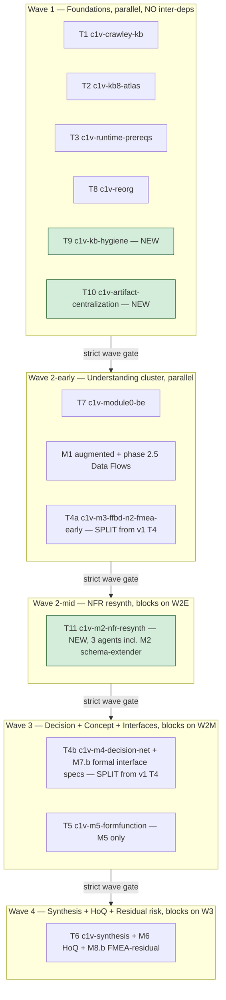
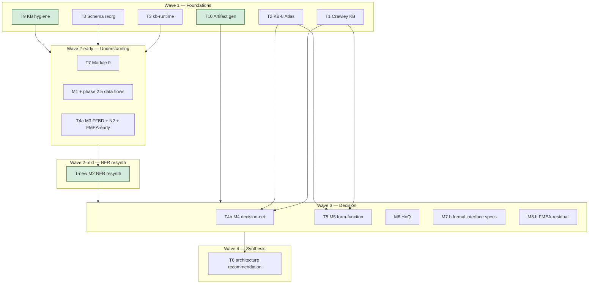

# c1v × MIT-Crawley-Cornell — v2 Amendment

> **Status:** DRAFT — awaiting David's review. No TaskCreate, no code, no commits until approved.
> **Slug:** `c1v-MIT-Crawley-Cornell.v2`
> **Supersedes (in v1):** §0, §5.3, §14 entirely; ADDS §0.2, §0.3, §0.4, §15. All other v1 sections stand.
> **Author:** Bond (brainstorming session 2026-04-24 ~00:30-02:35 EDT)
> **Created:** 2026-04-24
> **Rationale:** v1 landed the Crawley decision-net + Atlas-grounding + Module 0 pivot but inherited (a) an unhygienic L1 KB corpus that every Wave-2 agent would re-navigate against, (b) a linear M1→M8 flow that makes FMEA terminal when it should be instrumental, (c) no spec for artifact generator consolidation. v2 adds those three prerequisites and restructures the wave graph to fire FMEA-early early — **without renaming modules or introducing Pass-1/2/3 labels** (David 2026-04-24 02:24 EDT: "no relabel, just restructure").

---

## 0.1 What v1 got right (preserved)

- Crawley decision-network replacing flat M4 matrix
- New M5 form-function mapping (cited Stevens/Myers/Constantine + Bass, NOT Crawley directly)
- KB-8 Public-Company Stacks Atlas for numeric grounding
- Module 0 onboarding + discriminator intake
- `mathDerivationSchema.v2` scalar+vector+graph extension
- 8-team swarm execution model via `TeamCreate` + `Agent`
- Self-application as launch artifact (`launch-v1-demo.md §6`)

These carry forward unchanged.

---

## 0.2 NEW — KB corpus hygiene (T9), Wave-1 prerequisite

### 0.2.1 Motivation — what's broken in L1

**Naming convention (resolves prior ambiguity 2026-04-24 11:00 EDT):** The company-stacks atlas is **KB-9** post-consolidation (target: `13-Knowledge-banks-deepened/9-stacks-atlas/`). Legacy references to "KB-8 Atlas" (including in Defect 3 below) refer to the pre-consolidation state at `plans/8-stacks-and-priors-atlas/`. Post-T9: Atlas = KB-9. Do not create a KB-8 slot; the "8-" slot belongs to risk/FMEA.

Audit of `apps/product-helper/.planning/phases/13-Knowledge-banks-deepened/` (2026-04-24) found four structural defects that silently degrade every downstream agent:

**Defect 1 — Uneven depth.** Four-layer structure (pedagogy + schemas+templates + filled-examples + cross-cutting sw-design KBs) is present in M2, old-M5-HoQ, M6-interfaces, M7-FMEA. Absent or partial in: M1-defining-scope (no cross-cutting KBs), M3-ffbd-llm (no cross-cutting KBs, no .schema.json), both M4 folders (`4-assess-software-performance-kb` is Cornell-flat, `4-decision-network-mit-crawley` has only 3 foundation docs and no schemas), and `5-form-function-mapping` (5 phase docs + glossary only, no templates).

**Defect 2 — 4× cross-cutting KB duplication.** Thirteen cross-cutting sw-design KBs (`api-design-sys-design-kb.md`, `caching-system-design-kb.md`, `cap_theorem.md`, `cdn-networking-kb.md`, `data-model-kb.md`, `deployment-release-cicd-kb.md`, `load-balancing-kb.md`, `maintainability-kb.md`, `message-queues-kb.md`, `Multithreading-vs-Multiprocessing.md`, `observability-kb.md`, `resilliency-patterns-kb.md`, `software_architecture_system.md`) are copy-pasted verbatim into four KB folders (M2, M5-HoQ, M6-interfaces, M7-FMEA). Any edit must land 4× or drift. Verified identical by content-hash cross-check.

**Defect 3 — Atlas content lives outside the KB tree.** KB-8 *corpus* (company entry markdown, cost-curve references, scraper outputs) lives at `plans/8-stacks-and-priors-atlas/`. KB-8 *Zod schemas* live at `apps/product-helper/lib/langchain/schemas/atlas/`. Neither is under `13-Knowledge-banks-deepened/`. RAG retrieval over "the 8 deepened KBs" walks a different root than retrieval over KB-8 — breaks the uniformity assumption the Crawley pivot depends on. (Hygiene target: consolidate atlas *content* into `13-Knowledge-banks-deepened/9-stacks-atlas/` while leaving Zod schemas untouched under `lib/langchain/schemas/atlas/`.)

**Defect 4 — Folder numbering lags the hybrid renumber.** Disk still has Cornell-era `5-HoQ_...` / `6-software-define-interface-...` / `7-identify-evaluate-risk-...`. The hybrid renumber per v1 §5.3 (form-function becomes M5, HoQ becomes M6, interfaces M7, risk M8) has not propagated to the KB tree. Agents reading folder names get mixed signals.

### 0.2.2 Exit criteria

- [ ] **EC-0.2.1** Every KB folder `N-*/` (N ∈ {1..9}) has the uniform **6-sub-folder** structure (1 top-level file + 6 sub-folders):
  ```
  N-<slug>/
  ├── 00-master-prompt.md   # (file, not folder)
  ├── 01-phase-docs/        # Cornell pedagogy, one file per phase
  ├── 02-schemas/           # *.schema.json for every emitted artifact
  ├── 03-templates/         # *.xlsx, *.pptx stencils, *.mmd skeletons
  ├── 04-filled-examples/   # *_FILLED_TEST.xlsx reference fills
  ├── 05-crawley/           # Crawley chapter excerpts (present only where patched per §0.2.4)
  └── 06-cross-cutting/     # SYMLINKS to _shared/ (no file content)
  ```
- [ ] **EC-0.2.1b** (Defect 1 scope note) Structural uniformity only. Empty sub-folders satisfy EC-0.2.1. **Content-depth filling (e.g., populating `02-schemas/` in M1-defining-scope or adding `.schema.json` to M3-ffbd) is OUT OF SCOPE for T9 — owned by T4a (M3 phase 2.5) / T5 (form-function) / downstream module teams.** T9 delivers structure only; Defect 1 is therefore partially addressed by T9 (structural) and closed by downstream teams (content).
- [ ] **EC-0.2.2** `_shared/` pool exists at `13-Knowledge-banks-deepened/_shared/` containing single canonical copy of each cross-cutting KB. All four previous duplicates deleted; replaced by symlinks. **Scoped dedup check** (not global — avoids false-positives on empty TODO.md and identical boilerplate headers): for each of the 13 canonical cross-cutting KBs in `_shared/`, verify that every `06-cross-cutting/<file>` in every KB folder resolves (via `readlink -f` or `find -L ... -samefile`) to the same `_shared/<file>` canonical inode AND that no non-symlink copy of that filename exists elsewhere under `13-Knowledge-banks-deepened/` (outside `_shared/`). Implemented in `scripts/verify-kb-hygiene.ts`. The legacy global command `find -L . -name "*.md" -type f | xargs md5sum | sort | uniq -w32 -d` (note `-w32` — compares only the 32-char hash, not the full line) may be run as a secondary sanity check but is NOT the authoritative EC.
- [ ] **EC-0.2.3** Atlas *content* consolidated into `13-Knowledge-banks-deepened/9-stacks-atlas/` (Atlas becomes KB-9 per §0.2.1 naming note). Source: `plans/8-stacks-and-priors-atlas/` (company markdown entries + cost-curve references) — moved to new location with git-tracked history. Zod schemas at `lib/langchain/schemas/atlas/` left in place (schema ownership is T8/T4 territory, not T9). **All intra-repo references to old content paths updated.** Concretely: `grep -r "plans/8-stacks-and-priors-atlas" --include="*.ts" --include="*.tsx" --include="*.md" --include="*.json" --include="*.py" --include="*.mjs" --include="*.cjs" .` must return empty (excluding historical references in `plans/HANDOFF-*.md`, `plans/SNAPSHOT-*.md`, `plans/c1v-MIT-Crawley-Cornell.v2.md` §0.2 itself, and git-ignored dirs). Verifier codifies the exclusion list.
- [ ] **EC-0.2.4** Folder numbering matches v2 §0.4 renumber ruling. Verified by `scripts/verify-tree-pair-consistency.ts` (see §0.4).
- [ ] **EC-0.2.5** Crawley content patched into specific KBs per §0.2.4 deliverable matrix. Not uniform — only where Crawley adds signal.
- [ ] **EC-0.2.6** All `_upstream_refs` paths in `system-design/kb-upgrade-v2/module-*/*.json` files resolve under new paths. Verified by `scripts/verify-v2-upstream-refs.ts`.
- [ ] **EC-0.2.7** `lib/langchain/schemas/generate-all.ts` still emits valid JSON Schemas post-hygiene. Schema output diff-compared to pre-hygiene baseline.
- [ ] **EC-0.2.8** `next build` completes without symlink resolution errors AND `find -L .planning -xtype l` returns empty (no broken symlinks).
- [ ] **EC-0.2.9** **RAG ingest smoke test.** `pnpm tsx scripts/ingest-kbs.ts --dry-run` walks the symlinked `_shared/` content successfully and reports non-zero document count for every cross-cutting KB. Proves downstream tooling resolves relative POSIX symlinks (not just `next build` / `find -L`).
- [ ] **EC-0.2.10** **Atlas schema→content cross-ref check.** `scripts/verify-atlas-schema-refs.ts` (new — extends `verify-v2-upstream-refs.ts` pattern) confirms every path assumption embedded in `lib/langchain/schemas/atlas/*.ts` or `*.schema.json` (e.g., companion content paths referenced in schema `description` / `examples` / `$ref`) resolves under the new `13-Knowledge-banks-deepened/9-stacks-atlas/` location. Covers the schemas-stay / content-moves ownership seam.

### 0.2.3 Scope boundaries

**IN SCOPE:**
- File moves, renames, deduplication inside `13-Knowledge-banks-deepened/`
- Symlink creation (POSIX symlinks, not Windows junctions — macOS/Linux only)
- Crawley chapter insertion into KB folders that need it
- Atlas relocation
- Path reference updates in any file under the repo that references moved paths

**OUT OF SCOPE:**
- Content rewrites to existing deepened-KB phase docs (only reorganization, no editorial changes)
- Schema content changes in `lib/langchain/schemas/` (owned by T8)
- Runtime agent changes (owned by T4/T5/T6)
- UI/frontend changes (UI freeze 2026-04-21 17:30)
- RAG re-ingest (owned by T3 kb-runtime)

### 0.2.4 Crawley patch matrix

Crawley's *System Architecture: Strategy and Product Development for Complex Systems* (2015) has content relevant across more than M4-M5. Patch the specific chapters listed below into the listed KB's `05-crawley/` folder:

| KB folder | Crawley chapters to patch | Rationale |
|---|---|---|
| 1-defining-scope | Ch 1 (Introduction to System Architecture), Ch 2 (System Thinking) | Frames M1 scope-tree work in Crawley's system-thinking + four-task context vocabulary |
| 2-dev-sys-reqs | Ch 11 (Translating Needs into Goals), Ch 13 (Decomposition as a Tool for Managing Complexity) — ALREADY PRESENT, verify | Already in M2; confirm no drift against Ch 11 needs→goals procedure and Ch 13 §13.2/13.3 decomposition heuristics |
| 3-ffbd-llm-kb | Ch 5 (Function — internal/external function, functional interactions), Ch 13 (Decomposition) | Grounds FFBD functional-analysis rigor in Crawley's operand-based function definition + decomposition heuristics (corrects earlier "Ch 9/10" mislabel — Ch 9 is Ambiguity, Ch 10 is Upstream/Downstream, neither is functional analysis/decomposition) |
| 4-decision-net | Ch 12 (Applying Creativity to Generating a Concept), Ch 14 (System Architecture as a Decision-Making Process), Ch 15 (Reasoning about Architectural Tradespaces) | This IS the Crawley decision-net chapter family: Ch 12 = concept generation, Ch 14 = decision trees/networks/DSM + Four Tasks, Ch 15 = tradespace + Pareto + sensitivity (corrects earlier "Ch 11/12/14" labels — Ch 11 is needs→goals, not concept generation) |
| 4-decision-net | Ch 16 (Formulating and Solving System Architecture Optimization Problems) | NEW row — optimization formulation, solver taxonomy (full-factorial / heuristic / NSGA-II / rule-based), NEOSS NASA case study. Feeds decision-net optimization math (corrects earlier omission where Ch 14 was mislabeled as "architecture optimization" — actual optimization is Ch 16) |
| 5-form-function | Ch 4 (Form), Ch 5 (Function), Ch 6 (System Architecture — synthesis of form and function), Ch 7 (Solution-Neutral Function and Concepts), Ch 8 (From Concept to Architecture) | This IS the Crawley form-function chapter family: Ch 4 = Form analysis, Ch 5 = Function (operand-based), Ch 6 = synthesis + non-1:1 mappings, Ch 7 = SNF, Ch 8 = concept expansion (corrects earlier "Ch 3/4/5" labels — Ch 3 is Thinking about Complex Systems, not form+function) |
| 6-hoq | Ch 16 §"Patterns in System Architecting Decisions" (6 Selva operator patterns: down-select / assign / partition / permute / connect / permute-with-substitution) | HoQ roof math maps to Crawley/Selva operator correlations; the 6 patterns are the operator basis (corrects earlier "Ch 15 operators" label — Ch 15 is tradespace/Pareto, the operator patterns live in Ch 16) |
| 7-interfaces | Ch 5 §"Analysis of Functional Interactions and Functional Architecture", Ch 6 §"Analysis of an existing architecture" + non-1:1 mappings | Ties N2 chart + formal specs to Crawley interaction semantics. Crawley has no dedicated "interfaces" chapter; interface content is distributed across Ch 5 functional interactions and Ch 6 relationships/non-1:1 mappings (corrects earlier "Ch 6 interfaces" label — Ch 6 is form/function synthesis, not interfaces per se) |
| 8-risk | — (no Crawley; FMEA is MIL-STD-1629 / INCOSE lineage) | Do not over-cite |
| 9-stacks-atlas | — (empirical grounding, not methodology) | Do not over-cite |
| _shared | Ch 3 (Thinking about Complex Systems — complexity, decomposition, reasoning, SysML/OPM representation), Ch 7 (Solution-Neutral Function) | Single-source-of-truth reference for cross-cutting Crawley concepts — Ch 3's reasoning/representation toolkit and Ch 7's solution-neutrality span every KB (corrects earlier "Ch 7 system reasoning" — the generic reasoning subsection is in Ch 3; Ch 7 is specifically SNF) |

**Sourcing:** Crawley book findings already extracted to `plans/research/crawley-book-findings.md` per v1 §6.4. T9 reads that file; does NOT re-scan the book. If a chapter isn't in the findings file, flag to David as a gap, don't fabricate.

### 0.2.5 T9 Team — `c1v-kb-hygiene` (4 agents)

**Spawn prompt (canonical — paste into TeamCreate):**

```
TeamCreate({
  team_name: "c1v-kb-hygiene",
  goal: "Normalize the L1 deepened-KB corpus per v2 §0.2 exit criteria. Read-and-move only — no editorial rewrites. Blocking prerequisite for Wave 2 decision/form-function/NFR-resynth teams.",
  context: {
    authoritative_spec: "plans/c1v-MIT-Crawley-Cornell.v2.md §0.2",
    kb_root: "apps/product-helper/.planning/phases/13-Knowledge-banks-deepened/",
    v2_artifacts_root: "system-design/kb-upgrade-v2/",
    crawley_findings: "plans/research/crawley-book-findings.md",
    renumber_spec: "plans/c1v-MIT-Crawley-Cornell.v2.md §0.4",
    no_go_signals: [
      "Do not edit phase-doc content. Moves and renames only.",
      "Do not delete any file without committing it to git first (pre-move snapshot).",
      "Do not modify anything under lib/langchain/schemas/ — T8 owns that tree.",
      "Do not modify UI code — UI is frozen.",
      "If a Crawley chapter is missing from plans/research/crawley-book-findings.md, flag it — do not fabricate content."
    ]
  },
  commit_policy: "one-commit-per-agent-per-deliverable; include pre-move snapshot commits",
  wave: 1,
  blocks: ["wave-2-mid-nfr-resynth", "wave-3-decision", "wave-4-synthesis"]
})
```

**Roster (4 Agent calls in parallel inside the team):**

#### Agent 1: `auditor` (subagent_type: documentation-engineer)

```
Agent({
  name: "auditor",
  subagent_type: "documentation-engineer",
  team: "c1v-kb-hygiene",
  goal: "Produce a pre-hygiene audit + pre-move snapshot BEFORE any structurer/patcher/verifier agent touches the tree.",
  inline_skills: ["code-quality"],
  deliverables: [
    "plans/t9-outputs/pre-hygiene-audit.md — enumerate every file under 13-Knowledge-banks-deepened/ with: current path, target path per §0.4, layer classification (pedagogy/schema/template/filled-example/cross-cutting/crawley/other), content-hash (md5), duplicate-group membership.",
    "plans/t9-outputs/duplicate-content-map.md — for each of the 13 cross-cutting sw-design KBs, list all 4 existing paths + content-hash + chosen canonical source.",
    "git commit tagged 't9-pre-hygiene-snapshot' on apps/product-helper/.planning/phases/13-Knowledge-banks-deepened/ — every existing file committed as-is."
  ],
  guardrails: [
    "Walk only 13-Knowledge-banks-deepened/. Do not cross into other planning phases.",
    "Use find + md5sum for content-hash verification. Do not guess content equality from filename alone.",
    "Do not propose content changes. Audit is structural, not editorial.",
    "Exit non-zero if any file is a binary >10MB (flag for David, not for move)."
  ],
  blocks: ["structurer", "patcher", "verifier"]
})
```

#### Agent 2: `structurer` (subagent_type: technical-program-manager)

```
Agent({
  name: "structurer",
  subagent_type: "technical-program-manager",
  team: "c1v-kb-hygiene",
  goal: "Apply the 6-sub-folder uniform structure (00-master-prompt.md + 01-phase-docs/ + 02-schemas/ + 03-templates/ + 04-filled-examples/ + 05-crawley/ + 06-cross-cutting/) to every KB folder per EC-0.2.1. Create _shared/ pool. Consolidate Atlas → KB-9 (9-stacks-atlas/ per §0.2.1 naming note). Rename folders per §0.4. Content-depth fills are OUT OF SCOPE (see EC-0.2.1b) — deliver structure only.",
  inline_skills: [],
  deliverables: [
    "13-Knowledge-banks-deepened/_shared/ created with 13 canonical cross-cutting KB files (copy from M2 as canonical source per auditor's duplicate-content-map.md; verify other 3 copies are byte-identical before deleting).",
    "For each of 9 KB folders (1..9), the 4 required sub-folders exist and files are moved into them. Missing sub-folders created as empty (agent does not fabricate content).",
    "06-cross-cutting/ in each KB is a directory of symlinks pointing to _shared/. Symlinks use relative paths (../_shared/<file>) for repo portability.",
    "Atlas content consolidated from plans/8-stacks-and-priors-atlas/ into 13-Knowledge-banks-deepened/9-stacks-atlas/ via git mv (preserves history). Zod schemas at lib/langchain/schemas/atlas/ NOT touched — owned by T8/T4.",
    "Folder renames per §0.4 applied. Old path no longer exists post-move.",
    "plans/t9-outputs/structurer-diff.md — human-readable summary of all mv/ln -s operations performed."
  ],
  guardrails: [
    "Depend on auditor. Do not start until auditor's commit 't9-pre-hygiene-snapshot' exists.",
    "Use git mv (not plain mv) to preserve history.",
    "Use ln -s with relative paths. Test: `cat <symlink>` must return canonical content after creation.",
    "If a file cannot be cleanly classified into one of the 4 sub-folders, dump it in a 07-uncategorized/ folder and log to structurer-diff.md.",
    "Do not edit any file's content. Rename/move only.",
    "After each KB folder is done, commit atomically: 'chore(t9): normalize KB-<N> to 4-layer structure'."
  ],
  blocks: ["patcher", "verifier"]
})
```

#### Agent 3: `patcher` (subagent_type: documentation-engineer)

```
Agent({
  name: "patcher",
  subagent_type: "documentation-engineer",
  team: "c1v-kb-hygiene",
  goal: "Insert Crawley chapter excerpts per §0.2.4 matrix into KB 05-crawley/ sub-folders. Add Atlas cross-references in M4/M5/M6 where the methodology cites numeric grounding.",
  inline_skills: ["code-quality"],
  deliverables: [
    "Per KB in §0.2.4 matrix that has non-empty Crawley column: 05-crawley/<chapter>.md file containing the relevant excerpt from plans/research/crawley-book-findings.md. File header: YAML front-matter with {source: 'Crawley 2015', chapter: N, section: X.Y, relevance_to_kb: '<why-this-chapter-in-this-kb>'}.",
    "Per KB cited in v1 §6.3 as needing Atlas numeric grounding (M4/M5/M6): add `07-atlas-references.md` file listing exact Atlas paths the KB's agent retrieval should fetch.",
    "plans/t9-outputs/patcher-manifest.md — listing every file added + source chapter + target KB."
  ],
  guardrails: [
    "Depend on structurer. Do not start until structurer's folder-rename commits are all in.",
    "Do not fabricate Crawley content. If a chapter from §0.2.4 is missing from plans/research/crawley-book-findings.md, write a single-line stub file at 05-crawley/<chapter>.MISSING.md with: '# MISSING: Crawley Ch N — patch blocked pending research findings update.' and log to patcher-manifest.md. Do NOT invent excerpts.",
    "Excerpt length: if findings file has more than 500 words for a chapter, trim to ~500 words + add 'see full text in plans/research/crawley-book-findings.md §N'.",
    "Do not modify any existing file's content — only create new files under 05-crawley/ and 07-atlas-references.md.",
    "One commit per KB: 'docs(t9): patch Crawley <chapter> + Atlas refs into KB-<N>'."
  ],
  blocks: ["verifier"]
})
```

#### Agent 4: `verifier` (subagent_type: qa-engineer)

```
Agent({
  name: "verifier",
  subagent_type: "qa-engineer",
  team: "c1v-kb-hygiene",
  goal: "Verify every §0.2.2 exit criterion. Produce green/red report. Block Wave 2 handoff until green.",
  inline_skills: ["testing-strategies"],
  deliverables: [
    "scripts/verify-kb-hygiene.ts — verifier script (reusable; committed to repo). Exit non-zero on any EC failure.",
    "scripts/verify-atlas-schema-refs.ts — NEW companion verifier for EC-0.2.10 (atlas schema→content cross-ref check). Modeled on verify-v2-upstream-refs.ts but scoped to lib/langchain/schemas/atlas/.",
    "plans/t9-outputs/verification-report.md — per EC: PASS/FAIL + evidence (command output snippet + line count / file count).",
    "Specific checks: (a) EC-0.2.1 each N-*/ has 1 top-level file (00-master-prompt.md) + all 6 required sub-folders (01..06); (a.b) EC-0.2.1b structural-only — verifier does NOT fail on empty sub-folders (content-depth is downstream teams' territory); (b) EC-0.2.2 scoped dedup — for each of the 13 canonical files in _shared/, confirm all 06-cross-cutting/<file> are symlinks resolving (via readlink -f) to the same _shared/ canonical AND no non-symlink copy exists elsewhere under 13-Knowledge-banks-deepened/. Legacy global command `find -L . -name '*.md' -type f | xargs md5sum | sort | uniq -w32 -d` runs as sanity check only; (c) EC-0.2.3 13-Knowledge-banks-deepened/9-stacks-atlas/ exists with atlas entries AND plans/8-stacks-and-priors-atlas/ no longer contains company entry markdown AND `grep -r 'plans/8-stacks-and-priors-atlas' --include='*.ts' --include='*.tsx' --include='*.md' --include='*.json' --include='*.py' --include='*.mjs' --include='*.cjs' .` returns empty (excluding the exclusion list: plans/HANDOFF-*.md, plans/SNAPSHOT-*.md, plans/c1v-MIT-Crawley-Cornell.v2.md §0.2 itself); (d) EC-0.2.4 folder numbering matches §0.4; (e) EC-0.2.6 run `pnpm tsx scripts/verify-v2-upstream-refs.ts` — must exit 0; (f) EC-0.2.7 run `pnpm tsx lib/langchain/schemas/generate-all.ts` — output semantically equivalent to pre-hygiene baseline (compare via `scripts/compare-schema-output.ts` using canonical JSON sort + `fast-deep-equal`; byte-identical not required, same `$id`+required+properties per schema IS required); (g) EC-0.2.8 `next build` completes without symlink resolution errors; `find -L .planning -xtype l` returns empty (no broken symlinks); (h) EC-0.2.9 `pnpm tsx scripts/ingest-kbs.ts --dry-run` exits 0 and reports non-zero document count for every cross-cutting KB (proves relative POSIX symlinks resolve through RAG ingest, not just through next/find); (i) EC-0.2.10 `pnpm tsx scripts/verify-atlas-schema-refs.ts` exits 0 (atlas schema→content cross-refs resolve under new 9-stacks-atlas/ location).",
    "git commit tagged 't9-wave-1-complete' only if all ECs green."
  ],
  guardrails: [
    "Depend on patcher. Do not start until patcher's commits are all in.",
    "Do not attempt to fix failures yourself — if an EC fails, log to verification-report.md and return failure to the team coordinator. Another agent wave addresses it.",
    "Do not create the 't9-wave-1-complete' tag unless every EC is PASS.",
    "Re-run verification is idempotent — running twice must yield same result."
  ],
  blocks: ["wave-2-mid-nfr-resynth", "wave-3-decision", "wave-4-synthesis"]
})
```

---

## 0.3 NEW — Flow restructure (no relabeling)

### 0.3.1 Principle

Per David's ruling 2026-04-24 02:24 EDT: **"no Pass-1/2/3 labels"** (causes confusion with external SE pedagogy and with existing team names). The METHODOLOGY-CORRECTION.md benefit — FMEA becomes instrumental, NFRs synthesize with failure-mode inputs, decisions fire with stable inputs — is captured by **three structural insertions within the existing module names + revised wave graph**. Modules keep their names (M1-M8). Teams keep their slugs.

### 0.3.2 Structural Insertions

#### Insertion 1: **M8 splits into M8.a (FMEA-early) and M8.b (FMEA-residual)**

- **M8.a FMEA-early** fires after M3 FFBD + M7.a N2 matrix are stable. Produces `fmea_early.v1.json` per METHODOLOGY-CORRECTION.md Appendix A §8 schema.
- **M8.b FMEA-residual** stays terminal. Consumes M8.a as `predecessor_ref`. Adds residual-risk assessment on the chosen architecture (M4 winner + M7.b formal specs). Produces `fmea_residual.v1.json`.
- **M2 NFRs derive from M8.a** via `derived_from: {type: 'fmea', ref: 'FM.NN'}` field. This is the single highest-leverage change — it prevents the ~60% rework cycle that motivated METHODOLOGY-CORRECTION.md.

#### Insertion 2: **M7 splits into M7.a (N2 matrix) and M7.b (formal interface specs)**

- **M7.a N2 matrix** fires during/after M3 FFBD. Produces `n2_matrix.v1.json` per METHODOLOGY-CORRECTION Appendix A §7 schema. This is an **understanding** artifact — who-talks-to-whom, from FFBD.
- **M7.b formal interface specs** stays late. Consumes M4 decision-net winner + M6 HoQ top ECs. Produces `interface_specs.v1.json` with formal SLAs, retry policy, timeout, etc.
- UI rendering: the existing `/projects/[id]/system-design/interfaces/page.tsx` viewer (351 LOC) will need to render both. Design decision (§9.x): one tab per, or merged? **Answer: one viewer, two sub-views — verified against existing viewer component depth** (see §15.5).

#### Insertion 3: **M1 adds a new phase 2.5 "Data Flows"**

- Inserts between M1 phase 2 (Context Diagram) and phase 3 (Scope Tree / Functional Decomposition).
- Produces `data_flows.v1.json` per METHODOLOGY-CORRECTION Appendix A §4 schema.
- Rationale: decomposition-before-data-topology decomposes on the wrong axis (UI surface instead of data lineage). Data flows are the skeleton FDF hangs on.
- Cascades into M3 FFBD (FFBD `data_entity` fields now link to `DE.NN` IDs from M1-2.5) and M7.a N2 (N2 `data_flow_ref` is a first-class column, not guessed).

### 0.3.3 Revised wave graph



### 0.3.4 Team deltas from v1

| Team | v1 | v2 |
|---|---|---|
| T4 | single team M3-FFBD-Gate-C + M4-decision-net-rework | **SPLIT.** T4a = M3 FFBD + M7.a N2 + M8.a FMEA-early (Wave 2-early). T4b = M4 decision-net rework + M7.b formal interface specs (Wave 3). ✅ **T4b COMPLETE 2026-04-24** — tag `t4b-wave-3-complete` @ `4ecfe3f`. Artifacts: `decision_network.v1.json`, `interface_specs.v1.json`. Plan: [`t4b-t5-completion.md`](t4b-t5-completion.md). |
| T5 | Wave 2 | **Moves to Wave 3.** Scope is M5 form-function ONLY. NFR priorities drive form-function quality weights (depends on T11 resynth, NOT on FMEA-early directly). ✅ **T5 COMPLETE 2026-04-24** — tag `t5-wave-3-complete` @ `a30d9c6`. Artifact: `form_function_map.v1.json` (re-validated, not regenerated). |
| T6 | Wave 2 | **Moves to Wave 4.** Scope extended to include M6 HoQ (consumes T4b decision_network winner) + M8.b FMEA-residual (residual risk on chosen architecture). Always terminal. M6 moved here (not T5) to resolve Wave-3 cross-team dep on decision_network. |
| T7 | Wave 2 | **Moves to Wave 2-early.** Module 0 is intake (understanding), fires with M1. |
| T9 | — | **NEW Wave 1.** KB hygiene per §0.2. |
| T10 | — | **NEW Wave 1.** Artifact-generator centralization per §15. |
| T11 `c1v-m2-nfr-resynth` | — | **NEW Wave 2-mid.** Re-runs M2 NFRs + Constants consuming M8.a. 3 agents (nfr-resynthesizer, constants-resynthesizer, schema-extender). |
| **Ownership of M6 / M7.b / M8.b** | — | Folded into T5 / T4b / T6 respectively as named agents. See team-spawn-prompts.md §T4b, §T5, §T6 for full per-agent specs. No separate micro-teams. |

### 0.3.5 T4a Team — `c1v-m3-ffbd-n2-fmea-early` (Wave 2-early)

**Full spawn prompt:**

```
TeamCreate({
  team_name: "c1v-m3-ffbd-n2-fmea-early",
  goal: "Understanding cluster — complete M3 FFBD Gate C + produce M7.a N2 matrix + produce M8.a FMEA-early. These three artifacts fire together because they share an upstream (M1 outputs + data flows) and share a downstream (M2 NFR resynth + M4 decision net).",
  context: {
    authoritative_spec: "plans/c1v-MIT-Crawley-Cornell.v2.md §0.3.2 Insertions 1+2",
    upstream_artifacts: [
      ".planning/runs/self-application/module-1/scope_tree.json",
      ".planning/runs/self-application/module-1/context_diagram.json",
      ".planning/runs/self-application/module-1/data_flows.json  (NEW per M1 phase 2.5)"
    ],
    downstream_consumers: [
      "T-new c1v-m2-nfr-resynth — reads fmea_early.json as NFR derivation input",
      "T4b c1v-m4-decision-net — reads n2_matrix.json + fmea_early.json for PC weights",
      "T5 c1v-m5-formfunction — reads fmea_early.json for quality-scoring prior"
    ],
    schemas: [
      "apps/product-helper/lib/langchain/schemas/module-3/ (FFBD schemas, T8-reorged)",
      "apps/product-helper/lib/langchain/schemas/module-7-interfaces/ (N2 schema — create if missing, coordinate with T8)",
      "apps/product-helper/lib/langchain/schemas/module-8-risk/fmea-early.ts (create per METHODOLOGY-CORRECTION §8 schema)"
    ]
  },
  commit_policy: "one-commit-per-agent-per-artifact",
  wave: "2-early",
  blocks: ["wave-2-mid-nfr-resynth"]
})
```

**Roster (4 agents — m1-data-flows runs FIRST, then ffbd-closer + n2-builder + fmea-early-producer chain on it):**

```
Agent({
  name: "m1-data-flows",
  subagent_type: "langchain-engineer",
  team: "c1v-m3-ffbd-n2-fmea-early",
  goal: "Produce M1 phase 2.5 data_flows.v1.json (new structural insertion per v2 §0.3.2 Insertion 3). Derives data-flow entities (DE.NN) from scope_tree.json + context_diagram.json BEFORE ffbd-closer runs. Every DE carries: source, sink, payload_shape, criticality (maps to NFR severity later), encryption_at_rest_required, encryption_in_transit_required, pii_class.",
  inline_skills: ["langchain-patterns", "code-quality"],
  deliverables: [
    "apps/product-helper/lib/langchain/schemas/module-1/phase-2-5-data-flows.ts — Zod schema per METHODOLOGY-CORRECTION Appendix A §4",
    "apps/product-helper/lib/langchain/agents/system-design/data-flows-agent.ts — LangChain agent",
    ".planning/runs/self-application/module-1/data_flows.v1.json — c1v-self-applied instance",
    "generate-all.ts registration: MODULE_1_PHASE_SCHEMAS[2.5] = dataFlowsSchema"
  ],
  guardrails: [
    "HARD-DEP on T8 c1v-reorg: writes under `lib/langchain/schemas/module-1/` — blocks on `t8-wave-1-complete` tag.",
    "Every DE.NN MUST resolve to either a scope_tree.json node OR a context_diagram.json external actor.",
    "Criticality field ∈ {low, medium, high, critical} — mapped to NFR severity by T11 nfr-resynthesizer downstream.",
    "PII class ∈ {none, indirect, direct, sensitive} — drives encryption flags via D6 industry default (GDPR/HIPAA/PCI tiers).",
    "Single commit: 'feat(m1/phase-2.5): data_flows.v1 schema + agent + c1v self-applied'"
  ],
  blocks: ["ffbd-closer", "n2-builder"]
})

Agent({
  name: "ffbd-closer",
  subagent_type: "langchain-engineer",
  goal: "Complete M3 FFBD Gate C (phases 5-12 of the FFBD module). Emit ffbd.v1.json per existing M3 schema. Wire the new data_flows.json upstream ref into every FFBD function's input/output fields (each input/output should reference a DE.NN from data_flows.json where applicable).",
  inline_skills: ["langchain-patterns", "code-quality"],
  deliverables: [
    ".planning/runs/self-application/module-3/ffbd.v1.json — schema-valid, all phases 5-12 complete",
    ".planning/runs/self-application/module-3/ffbd_F*_*.mmd — Mermaid per top-level function",
    "apps/product-helper/lib/langchain/schemas/module-3/ updated schemas for Gate C phases",
    "lib/langchain/agents/system-design/ffbd-agent.ts — updated agent that reads data_flows.v1 as additional upstream"
  ],
  guardrails: [
    "Every function.inputs[] entry must reference either DE.NN (from data_flows) or 'external' marker with rationale",
    "Every OR/AND/IT gate must have guard condition or termination_condition",
    "Commit after each Gate C phase lands"
  ]
})

Agent({
  name: "n2-builder",
  subagent_type: "langchain-engineer",
  goal: "Produce M7.a N2 interface matrix from ffbd.v1.json + data_flows.v1.json. Schema per METHODOLOGY-CORRECTION Appendix A §7. This is N2 informal — who-talks-to-whom from FFBD. Formal interface specs with SLAs come later (M7.b, owned by T4b/T6).",
  inline_skills: ["langchain-patterns"],
  deliverables: [
    "apps/product-helper/lib/langchain/schemas/module-7-interfaces/n2-matrix.ts — Zod schema",
    "lib/langchain/agents/system-design/n2-agent.ts — LangChain agent",
    ".planning/runs/self-application/module-7/n2_matrix.v1.json — c1v-self-applied instance",
    "Mermaid flowchart rendering of the N2 (node per function, edge per interface)"
  ],
  guardrails: [
    "Depend on ffbd-closer. Block on ffbd.v1.json existence.",
    "Every IF.NN row MUST have producer + consumer both present in ffbd.v1.json functions list",
    "data_flow_ref column is soft-nullable (per METHODOLOGY-CORRECTION §7 schema note: forward-passable) — acceptable if null where no data-flow applies",
    "criticality field: derive from data_flows.v1.json criticality if data_flow_ref is non-null; else manual (agent assigns)"
  ]
})

Agent({
  name: "fmea-early-producer",
  subagent_type: "langchain-engineer",
  goal: "Produce M8.a FMEA-early by analyzing ffbd.v1.json (functions as failure targets) + n2_matrix.v1.json (interfaces as failure targets). Schema per METHODOLOGY-CORRECTION Appendix A §8. This is the instrumental FMEA — its output drives M2 NFR resynth downstream.",
  inline_skills: ["langchain-patterns"],
  deliverables: [
    "apps/product-helper/lib/langchain/schemas/module-8-risk/fmea-early.ts — Zod schema",
    "lib/langchain/agents/system-design/fmea-early-agent.ts — LangChain agent",
    ".planning/runs/self-application/module-8/fmea_early.v1.json — c1v-self-applied instance",
    "FMEA xlsx via gen-fmea.py (T10 generator) — for review"
  ],
  guardrails: [
    "Depend on ffbd-closer + n2-builder. Block on both artifacts.",
    "Every FM.NN failure_mode MUST have target_ref resolvable in ffbd.v1 or n2_matrix.v1.",
    "severity/likelihood/detectability scales per rating_scales.json (reuse v2 rating_scales).",
    "candidate_mitigation field: first-pass — do NOT commit to design decisions (those come from M4). Just enumerate options.",
    "Output MUST be consumable by T-new (NFR resynth) — at minimum each FM.NN needs enough detail for an NFR to be derived."
  ]
})
```

### 0.3.6 T-new Team — `c1v-m2-nfr-resynth` (Wave 2-mid)

**Full spawn prompt:**

```
TeamCreate({
  team_name: "c1v-m2-nfr-resynth",
  goal: "Re-synthesize M2 NFRs + Constants now that M8.a FMEA-early is available. This replaces the linear-order practice of guessing NFRs at M2 before FMEA. The v2 NFRs set will derive from three upstream inputs: (1) FRs (from FFBD + UCs), (2) fmea_early.v1.json (FM.NN → NFR categories: availability, recoverability, observability, etc.), (3) data_flows.v1.json (flow criticality → performance NFRs).",
  context: {
    authoritative_spec: "plans/c1v-MIT-Crawley-Cornell.v2.md §0.3.2 Insertion 1 + METHODOLOGY-CORRECTION.md §2 Pass 2",
    upstream_artifacts: [
      ".planning/runs/self-application/module-3/ffbd.v1.json",
      ".planning/runs/self-application/module-8/fmea_early.v1.json",
      ".planning/runs/self-application/module-1/data_flows.v1.json"
    ],
    existing_v2_baseline: "system-design/kb-upgrade-v2/module-2-requirements/requirements_table.json + constants_table.json — these represent old-order NFRs; v2.1 will likely supersede, but preserve for diff.",
    downstream_consumers: [
      "T4b c1v-m4-decision-net — PCs derive from resynthesized NFRs",
      "T5 c1v-m5-formfunction — quality-metric weights derive from NFR priorities",
      "T6 c1v-synthesis — architecture_recommendation.derivation_chain.nfrs_driving_choice cites these"
    ]
  },
  commit_policy: "one-commit-per-agent; MUST preserve v2 baseline for diff review",
  wave: "2-mid",
  blocks: ["wave-3-decision"]
})
```

**Roster (3 agents — schema-extender runs FIRST, then nfr-resynthesizer + constants-resynthesizer in parallel):**

```
Agent({
  name: "schema-extender",
  subagent_type: "langchain-engineer",
  goal: "PRE-REQ for nfr-resynthesizer. Extend the M2 requirements-table Zod schema at apps/product-helper/lib/langchain/schemas/module-2/ to add a `derivedFrom` discriminated-union field on every NFR entry: { type: 'fmea', ref: 'FM.NN' } | { type: 'data_flow', ref: 'DF.NN' } | { type: 'functional_requirement', ref: 'FR.NN' }. Regenerate JSON Schema via generate-all.ts. Verify preload endpoint still serves.",
  inline_skills: ["langchain-patterns", "code-quality"],
  deliverables: [
    "apps/product-helper/lib/langchain/schemas/module-2/requirements-table.ts — extended with derivedFrom field (z.discriminatedUnion)",
    "apps/product-helper/lib/langchain/schemas/generated/module-2/requirements-table.schema.json — regenerated, committed",
    "Smoke test: pnpm tsx scripts/test-m2-schema-roundtrip.ts — parses the v2 baseline requirements_table.json with new optional field (backward-compat)"
  ],
  guardrails: [
    "derivedFrom field MUST be optional on schema to keep v2 baseline parseable; nfr-resynthesizer output will always populate it",
    "Do NOT change any other field on requirements-table. Single-purpose edit.",
    "Commit: 'feat(m2/schema): add derivedFrom discriminated-union for NFR-to-failure-mode tracing'"
  ],
  blocks: ["nfr-resynthesizer", "constants-resynthesizer"]
})

Agent({
  name: "nfr-resynthesizer",
  subagent_type: "llm-workflow-engineer",
  goal: "Read FFBD + FMEA-early + data flows. Emit revised NFRs. Every NFR must have `derived_from` pointing to a concrete upstream artifact.",
  inline_skills: ["claude-api", "langchain-patterns"],
  deliverables: [
    ".planning/runs/self-application/module-2/nfrs.v2.json — new NFR set",
    ".planning/runs/self-application/module-2/nfr-diff-v2-to-v2.1.md — side-by-side table of OLD-v2 vs NEW-v2.1 NFRs with rationale for adds/removes/changes",
    "lib/langchain/agents/system-design/nfr-resynth-agent.ts — agent that performs the synthesis"
  ],
  guardrails: [
    "Every NFR.NN must have derived_from.type ∈ {fmea, data_flow, functional_requirement}",
    "If an old-v2 NFR has no FMEA/data-flow derivation, flag in diff doc as 'orphaned — keep only if FR-derived'",
    "Target values: preserve from v2 baseline unless FMEA-early findings explicitly invalidate (e.g., FMEA says MTBF must be ≥ X; v2 guessed Y < X; v2.1 uses X).",
    "Single commit: 'feat(m2): NFR v2 — derived from M8.a FMEA-early'"
  ]
})

Agent({
  name: "constants-resynthesizer",
  subagent_type: "backend-architect",
  goal: "Re-derive Constants table from the revised NFRs. Every constant's derived_from must point to an NFR.NN.",
  inline_skills: ["database-patterns", "code-quality"],
  deliverables: [
    ".planning/runs/self-application/module-2/constants.v2.json",
    ".planning/runs/self-application/module-2/constants-diff-v2-to-v2.1.md",
    "apps/product-helper/lib/langchain/schemas/module-2/constants-table.ts — updated schema (only if NEW constant categories needed; no schema churn for value changes)"
  ],
  guardrails: [
    "Depend on nfr-resynthesizer. Block on nfrs.v2.json.",
    "Preserve v2 constants that still have a derivable NFR. Only add new constants where NFR demands (e.g., if NFR.NN says 'provider fallback depth ≥ 3', add PROVIDER_FALLBACK_DEPTH=3 constant).",
    "Status field: 'Final' only if NFR is Final AND value has single-source empirical or regulatory grounding; else 'Estimate'."
  ]
})
```

---

## 0.4 NEW — Atomic cross-tree renumber + consistency verifier

### 0.4.1 Ruling

Per David 2026-04-24 02:24 EDT: **option (a) renumber**, applied to **both trees in a single commit** (superseding v1 §5.3 which left the ruling open).

**§0.4.x landed 2026-04-24** for the L2 self-application tree (`system-design/kb-upgrade-v2/`): `module-5-qfd → module-6-qfd`, `module-6-interfaces → module-7-interfaces`, `module-7-fmea → module-8-risk`, plus empty `module-5-formfunction/` scaffold. Schema-dir (§0.4.2) and KB-dir (§0.4.3) renames landed earlier under T8/T9. See `plans/t-renumber-v2-outputs/` for audit trail.

### 0.4.2 Schema-dir renames (apps/product-helper/lib/langchain/schemas/)

| Current | Target | Notes |
|---|---|---|
| `module-4/` | `module-4-decision-net/` | Decision-net rework per v1 §5.1 |
| — | `module-5-form-function/` (NEW) | Crawley form-function per v1 §5.2 |
| `module-5/` (if exists — verify) | `module-6-hoq/` | HoQ shifts from M5 → M6 per v1 §5.3(a) |
| `module-6/` (if exists — verify) | `module-7-interfaces/` | N2 + formal specs both live here |
| `module-7/` (if exists — verify) | `module-8-risk/` | FMEA-early + FMEA-residual both live here |
| — | `module-9-stacks-atlas/` (NEW) | Atlas as methodology-peer KB |

Audit result 2026-04-24: the schemas dir currently has `_shared.ts`, `module-2/`, `module-3/`, `module-4/`, `atlas/`, `engines/`, `generated/`, `synthesis/` + top-level files. `module-5`/`6`/`7` do not exist yet as separate folders — the HoQ/interfaces/FMEA schemas are scaffolding work owned by T5/T6.

### 0.4.3 KB-dir renames (.planning/phases/13-Knowledge-banks-deepened/)

| Current | Target | Notes |
|---|---|---|
| `1-defining-scope-kb-for-software/` | `1-defining-scope/` | trim suffix |
| `2-dev-sys-reqs-for-kb-llm-software/` | `2-requirements/` | trim suffix |
| `3-ffbd-llm-kb/` | `3-ffbd/` | trim suffix |
| `4-assess-software-performance-kb/` + `4-decision-network-mit-crawley/` | **merge into** `4-decision-net-crawley-on-cornell/` | Cornell scoring becomes `01-phase-docs/cornell/`; Crawley overlays as `01-phase-docs/crawley/` |
| `5-HoQ_for_software_sys_design/` | `6-hoq/` | HoQ becomes M6 |
| `5-form-function-mapping/` | `5-form-function/` | trim suffix |
| `6-software-define-interface-LLM-kb/` | `7-interfaces/` | interfaces becomes M7 |
| `7-identify-evaluate-risk-software/` | `8-risk/` | risk becomes M8 |
| `plans/8-stacks-and-priors-atlas/` (company markdown entries + cost-curve refs only — NOT schemas) | `13-Knowledge-banks-deepened/9-stacks-atlas/` | Atlas content consolidated per §0.2.3. Zod schemas at `lib/langchain/schemas/atlas/` NOT moved. |

### 0.4.4 Consistency verifier

```
scripts/verify-tree-pair-consistency.ts
```

**Contract:**
- Reads `lib/langchain/schemas/` and `.planning/phases/13-Knowledge-banks-deepened/` directory listings.
- Extracts leading integer + slug from each folder (ignore `_shared`, `generated`, `engines`, `atlas`, `synthesis`, `__tests__`).
- For each N in {1..9}:
  - Assert schema dir `module-N-<slug>/` exists (missing allowed if module is NEW-only like 5-form-function until T5 creates it)
  - Assert KB dir `N-<slug>/` exists
  - Assert slug portion matches between trees (`module-5-form-function` ↔ `5-form-function`)
- For each v2 artifact JSON file under `system-design/kb-upgrade-v2/module-*/`:
  - Parse `_schema`, `_output_path`, `_upstream_refs` fields
  - Assert every path resolves under new naming (walk renamed tree)
- For each `lib/langchain/schemas/generate-all.ts` registration:
  - Assert the referenced schema path exists post-rename
- For each MCP tool ref in `lib/mcp/` that points into schemas or KBs:
  - Assert the path resolves

**Exit codes:**
- 0: all consistent
- 1: schema/KB tree mismatch (missing pair)
- 2: slug mismatch between trees
- 3: v2 artifact `_upstream_ref` broken
- 4: generate-all.ts reference broken
- 5: MCP tool reference broken

**Runs in CI.** Blocks PR merge until green. T8 verifier agent (per v1 §5 reorg team) owns this script; T9 verifier consumes it as one of its EC checks.

### 0.4.5 Ownership

- **T8 schema-dir renames:** owned by T8 `c1v-reorg` per v1 §5 (already in-flight, 40% done per earlier audit).
- **T9 KB-dir renames:** owned by T9 `structurer` per §0.2.5.
- **Consistency verifier:** owned by T8 verifier; extended to cover both trees per §0.4.4.
- **Atomic commit:** a single merge commit combining T8 + T9 outputs. The schema-dir rename PR and KB-dir rename PR land together or neither lands. Coordinated by the wave-1 merge gate.

---

## 15. NEW — Artifact Generator Centralization (T10)

### 15.1 Motivation

Fourteen Python scripts are scattered across two trees with version skew:

| Script | v2 path | deepened path | Skew |
|---|---|---|---|
| `create_ffbd_thg_v3.py` | module-3-ffbd/ | 3-ffbd-llm-kb/ | duplicate |
| `create_dfd_thg_v2.py` | — | 6-software-define-interface-LLM-kb/ | single |
| `create_n2_chart.py` | — | 6-software-define-interface-LLM-kb/ | single |
| `create_sequence_thg.py` | — | 6-software-define-interface-LLM-kb/ | single |
| `interface_matrix_from_json.py` | — | 6-software-define-interface-LLM-kb/ | single |
| `n2_from_json.py` | — | 6-software-define-interface-LLM-kb/ | single |
| `generate_interface_matrix.py` | module-7-interfaces/ | — | single |
| `generate_n2.py` | module-7-interfaces/ | — | single |
| `generate_pptx.py` | module-7-interfaces/ | — | single (sequence) |
| `write_xlsx.py` + `.applescript` | module-6-qfd/ | — | AppleScript-only (macOS lock-in) |
| `generate_fmea_xlsx.py` | module-8-risk/ | — | single |
| `generate_stoplights.py` | module-8-risk/ | — | single |
| `fill_artifacts.py` | module-4-decision-matrix/ | — | single |
| `generate_ucbd_pptx.py` | — | 2-dev-sys-reqs-for-kb-llm-software/ | single |

**Problems:** duplicated scripts, heterogeneous input contracts, macOS-only AppleScript, no shared invocation entrypoint, no TS runtime integration — they were run by hand during v2 self-application, not as background jobs triggered by agent artifact emission.

**Crawley pipeline gap:** ten new artifact types needed, zero scripts exist.

### 15.2 Current UI rendering (verified 2026-04-24)

Routes shipped at prd.c1v.ai:

| Route | Viewer | LOC | Data source |
|---|---|---|---|
| `/projects/[id]/system-design/decision-matrix` | `DecisionMatrixViewer` | 178 | `project.projectData.intakeState.extractedData.decisionMatrix` |
| `/projects/[id]/system-design/ffbd` | `FFBDViewer` | 205 | `extractedData.ffbd` |
| `/projects/[id]/system-design/qfd` | `QFDViewer` | 471 | `extractedData.qfd` |
| `/projects/[id]/system-design/interfaces` | `InterfacesViewer` | 351 | `extractedData.interfaces` |
| `/projects/[id]/diagrams` | `DiagramViewer` | 651 | extracted Mermaid strings (multi) |

Plus 13 section components in `components/projects/sections/` (problem-statement, system-overview, goals-metrics, scope, actors, user-stories, architecture, tech-stack, NFR, schema, API-spec, guidelines, infrastructure) at `/projects/[id]/requirements/*` and `/projects/[id]/backend/*` routes.

**Already shipped but needing Crawley-depth extension:**
- `decision-matrix` viewer — currently flat (criteria × alternatives × scores + recommendation). Needs: decision-network DAG view, Pareto frontier scatter, sensitivity heatmap.
- `qfd` viewer — already has HoQ structure (471 LOC, largest). Needs: verify it supports Crawley roof correlations vs simple relationship matrix.
- `interfaces` viewer — needs splitting into N2 tab (informal) + Formal Specs tab.

**Missing (no route, no viewer):**
- FMEA — no route, no viewer. Both M8.a (FMEA-early) and M8.b (FMEA-residual) unshipped.
- Form-function matrix — new M5 artifact, no viewer.
- Cost curves — no viewer.
- Tail-latency chain — no viewer.
- Atlas data browser — KB-8 lookup UI — no viewer.
- Architecture-recommendation synthesizer output — no viewer.

### 15.3 Centralization target

**Path:** `scripts/artifact-generators/` at repo root.

**Uniform input contract (TypeScript):**

```ts
// scripts/artifact-generators/types.ts
export type ArtifactGeneratorInput = {
  generator: 'gen-ffbd' | 'gen-qfd' | 'gen-n2' | 'gen-sequence' | 'gen-dfd'
           | 'gen-interfaces' | 'gen-fmea' | 'gen-ucbd' | 'gen-decision-net'
           | 'gen-form-function' | 'gen-cost-curves' | 'gen-latency-chain'
           | 'gen-arch-recommendation';
  schemaRef: string;        // e.g. "Requirements-table.schema.json"
  schemaVersion: string;    // e.g. "v1"
  instanceJson: unknown;    // schema-valid instance (agent must validate before invoke)
  outputDir: string;        // e.g. ".planning/runs/self-application/module-2/"
  targets: Array<'xlsx' | 'pptx' | 'mmd' | 'svg' | 'pdf' | 'html' | 'json-enriched'>;
  options?: {
    title?: string;
    branding?: { logo?: string; theme?: 'light'|'dark' };
    figureNumbering?: boolean;
  };
};

export type ArtifactGeneratorOutput = {
  ok: true;
  generated: Array<{
    target: string;
    path: string;
    bytes: number;
    sha256: string;
  }>;
  warnings: string[];
  elapsedMs: number;
} | {
  ok: false;
  error: { code: string; message: string; phase: 'validate'|'render'|'write'; stack?: string };
  partial: Array<{ target: string; path: string }>;
};
```

**Manifest contract:** Every generator appends to `artifacts.manifest.jsonl` in `outputDir`:

```jsonl
{"timestamp":"ISO-8601","generator":"gen-fmea","instance":"fmea_early.v1.json","outputs":[{"target":"xlsx","path":"./fmea_early.xlsx","sha256":"..."},{"target":"stoplight.svg","path":"./fmea_stoplight.svg","sha256":"..."}],"ok":true,"elapsedMs":431}
```

Manifest is the single source of truth for "what artifacts exist for this run." UI explorer reads the manifest to enumerate downloadable files.

### 15.4 Migration & extension matrix

| Target generator | Absorbs | NEW? | Targets emitted |
|---|---|:-:|---|
| `gen-ffbd.py` | `create_ffbd_thg_v3.py` (v2 + deepened — dedup) | No | pptx, mmd |
| `gen-ucbd.py` | `generate_ucbd_pptx.py` | No | pptx |
| `gen-n2.py` | `generate_n2.py` + `create_n2_chart.py` + `n2_from_json.py` | No (dedup 3→1) | xlsx, pptx |
| `gen-sequence.py` | `generate_pptx.py` (seq) + `create_sequence_thg.py` | No (dedup 2→1) | pptx, mmd |
| `gen-dfd.py` | `create_dfd_thg_v2.py` | No | pptx, mmd |
| `gen-interfaces.py` | `generate_interface_matrix.py` + `interface_matrix_from_json.py` | No (dedup 2→1) | xlsx (informal N2 and formal specs both covered via `options.variant`) |
| `gen-qfd.py` | `write_xlsx.py` (drop AppleScript — cross-platform openpyxl) | No | xlsx |
| `gen-fmea.py` | `generate_fmea_xlsx.py` + `generate_stoplights.py` (merge — stoplights become sheet in fmea xlsx) | No (dedup 2→1) | xlsx, svg (stoplight standalone optional) |
| `gen-decision-net.py` | `fill_artifacts.py` (v2/M4) — extend | **Extended** | xlsx (matrix), svg (graph), svg (pareto scatter), svg (sensitivity heatmap), svg (utility-vector bar) |
| `gen-form-function.py` | — | **NEW** | xlsx (matrix), svg (bipartite graph), mmd (concept expansion tree) |
| `gen-cost-curves.py` | — | **NEW** | svg (log-log plot per infra choice) |
| `gen-latency-chain.py` | — | **NEW** | svg (stacked bar, p50/p95/p99/p99.99 bands) |
| `gen-arch-recommendation.py` | — | **NEW** | html (standalone), pdf, json-enriched |

**Result:** 14 scripts → 13 generators (dedup), + 4 new Crawley generators → **13 total final**. One entry point per artifact type. No AppleScript. Cross-platform.

### 15.5 UI integration (READ from existing viewers, WRITE only via UI-freeze-honoring manifest)

UI is frozen (v1 note 2026-04-21 17:30). v2 does NOT add new routes or viewers. v2 confines UI work to:

1. **Manifest read capability added to `artifact-pipeline.tsx` (142 LOC component)** — expose download links for whatever generators emitted into the run's output dir. Falls back silently if manifest absent. No visual redesign.
2. **`DecisionMatrixViewer`, `FFBDViewer`, `QFDViewer`, `InterfacesViewer` unchanged.** The extended decision-net viewer (graph / Pareto / sensitivity) is post-v2 work, explicitly deferred.
3. **FMEA viewer: IN SCOPE for v2** (David ruling 2026-04-24 03:40 EDT — R-v2.3 flipped to allow exception). New route `/projects/[id]/system-design/fmea/page.tsx` + new component `components/system-design/fmea-viewer.tsx` (~300 LOC target). Renders BOTH `fmea_early.v1.json` (Wave 2-early) and `fmea_residual.v1.json` (Wave 4) via tabbed view. Owned by T10 `runtime-wirer` agent — added as 6th deliverable. Stoplight SVG from `gen-fmea.py` embeds inside viewer.
4. **Form-function, cost curves, tail-latency, arch-recommendation:** downloadable artifacts only. No in-app viewers in v2.

### 15.6 Runtime integration

**Trigger path:** Agent emits schema-valid JSON → LangGraph edge validates via Ajv against `schemaRef` → if valid, invokes `scripts/artifact-generators/invoke.ts` with the input contract → `invoke.ts` spawns the generator via `child_process.spawn('python3', ['gen-*.py', '<input-json-path>'])` → awaits exit code + stdout parse → appends to manifest → edge returns.

**Failure policy:** Generator failure is non-fatal for pipeline. Error logged to manifest (`"ok": false`). Pipeline continues. Agent's next step does not depend on generator output (generators are derivative artifacts).

**Background vs inline:** Generators ≤ 5s elapsed run inline (block the pipeline edge). Generators > 5s (e.g., `gen-arch-recommendation` HTML+PDF) run via BullMQ background job (Redis-backed). UI polls manifest for completion.

### 15.7 T10 Team — `c1v-artifact-centralization` (Wave 1, NEW)

**Full spawn prompt:**

```
TeamCreate({
  team_name: "c1v-artifact-centralization",
  goal: "Consolidate 14 scattered Python scripts into 9 uniform generators + implement 4 new Crawley-pipeline generators (13 total). Uniform input/output contract per v2 §15.3. TS runtime invoker. Manifest emission. UI read path extension (artifact-pipeline.tsx only; no viewer changes).",
  context: {
    authoritative_spec: "plans/c1v-MIT-Crawley-Cornell.v2.md §15",
    current_scripts: [
      "system-design/kb-upgrade-v2/module-3-ffbd/create_ffbd_thg_v3.py",
      "system-design/kb-upgrade-v2/module-4-decision-matrix/fill_artifacts.py",
      "system-design/kb-upgrade-v2/module-6-qfd/write_xlsx.py",
      "system-design/kb-upgrade-v2/module-6-qfd/write_xlsx.applescript",
      "system-design/kb-upgrade-v2/module-7-interfaces/generate_interface_matrix.py",
      "system-design/kb-upgrade-v2/module-7-interfaces/generate_n2.py",
      "system-design/kb-upgrade-v2/module-7-interfaces/generate_pptx.py",
      "system-design/kb-upgrade-v2/module-8-risk/generate_fmea_xlsx.py",
      "system-design/kb-upgrade-v2/module-8-risk/generate_stoplights.py",
      "apps/product-helper/.planning/phases/13-Knowledge-banks-deepened/2-dev-sys-reqs-for-kb-llm-software/generate_ucbd_pptx.py",
      "apps/product-helper/.planning/phases/13-Knowledge-banks-deepened/3-ffbd-llm-kb/create_ffbd_thg_v3.py",
      "apps/product-helper/.planning/phases/13-Knowledge-banks-deepened/6-software-define-interface-LLM-kb/create_dfd_thg_v2.py",
      "apps/product-helper/.planning/phases/13-Knowledge-banks-deepened/6-software-define-interface-LLM-kb/create_n2_chart.py",
      "apps/product-helper/.planning/phases/13-Knowledge-banks-deepened/6-software-define-interface-LLM-kb/create_sequence_thg.py",
      "apps/product-helper/.planning/phases/13-Knowledge-banks-deepened/6-software-define-interface-LLM-kb/interface_matrix_from_json.py",
      "apps/product-helper/.planning/phases/13-Knowledge-banks-deepened/6-software-define-interface-LLM-kb/n2_from_json.py"
    ],
    target_path: "scripts/artifact-generators/",
    ui_component_to_extend: "apps/product-helper/components/project/overview/artifact-pipeline.tsx",
    do_not_touch: [
      "components/system-design/decision-matrix-viewer.tsx",
      "components/system-design/ffbd-viewer.tsx",
      "components/system-design/qfd-viewer.tsx",
      "components/system-design/interfaces-viewer.tsx",
      "components/diagrams/diagram-viewer.tsx",
      "Any route page.tsx under app/(dashboard)/projects/[id]/system-design/ — UI freeze."
    ]
  },
  commit_policy: "one-commit-per-agent-per-generator",
  wave: 1,
  blocks: ["wave-3-decision"]
})
```

**Roster (4 agents):**

```
Agent({
  name: "migrator",
  subagent_type: "backend-architect",
  goal: "Consolidate the 14 existing Python scripts into 9 uniform generators at scripts/artifact-generators/. Dedupe (ffbd×2, n2×3, seq×2, interfaces×2). Drop AppleScript (replace write_xlsx.applescript with openpyxl cross-platform). Every generator conforms to v2 §15.3 input/output contract.",
  inline_skills: ["code-quality", "testing-strategies"],
  deliverables: [
    "scripts/artifact-generators/types.ts — uniform contracts per §15.3",
    "scripts/artifact-generators/gen-ffbd.py — merged v2+deepened, reads input.instanceJson + options, emits per targets[]",
    "scripts/artifact-generators/gen-ucbd.py",
    "scripts/artifact-generators/gen-n2.py — 3→1 merge (v2 generate_n2.py + deepened create_n2_chart.py + n2_from_json.py)",
    "scripts/artifact-generators/gen-sequence.py — 2→1 merge",
    "scripts/artifact-generators/gen-dfd.py",
    "scripts/artifact-generators/gen-interfaces.py — 2→1 merge, options.variant ∈ {informal-n2, formal-specs}",
    "scripts/artifact-generators/gen-qfd.py — openpyxl-only (no AppleScript)",
    "scripts/artifact-generators/gen-fmea.py — 2→1 merge (fmea-xlsx + stoplights into one xlsx with sheets)",
    "scripts/artifact-generators/common/schema-loader.py — Ajv-equivalent Python schema validator",
    "scripts/artifact-generators/common/manifest-writer.py — atomic append to artifacts.manifest.jsonl",
    "plans/t10-outputs/migration-report.md — per-script: OLD path → NEW generator + delta summary + round-trip byte-compare result"
  ],
  guardrails: [
    "Every generator MUST validate instanceJson against schemaRef before rendering. Fail fast with error.phase='validate'.",
    "Every generator MUST write manifest entry (success or failure).",
    "Round-trip test: for each migrated generator, load a v2 JSON input, run generator, diff output against v2 baseline xlsx/pptx. Byte-identical preferred; visual-equivalent acceptable if cell-by-cell content matches.",
    "Do NOT delete the original scripts in-place. Move to archive/scripts-v1/ for rollback.",
    "One commit per generator: 'refactor(t10): migrate gen-<name> to scripts/artifact-generators/'."
  ]
})

Agent({
  name: "extender",
  subagent_type: "backend-architect",
  goal: "Implement the 4 NEW generators for Crawley pipeline artifacts: decision-net, form-function, cost-curves, latency-chain. Plus the architecture-recommendation renderer.",
  inline_skills: ["code-quality"],
  deliverables: [
    "scripts/artifact-generators/gen-decision-net.py — renders decision_network.v1.json to: xlsx (scoring matrix), svg (DAG via graphviz), svg (Pareto scatter via matplotlib), svg (sensitivity heatmap via matplotlib/seaborn), svg (utility-vector bar chart per alternative).",
    "scripts/artifact-generators/gen-form-function.py — renders form_function_map.v1.json to: xlsx (function×form quality matrix), svg (bipartite graph via networkx), mmd (concept expansion tree per Crawley).",
    "scripts/artifact-generators/gen-cost-curves.py — reads KB-8 Atlas + decision_network.v1.json winner's infra choices; emits svg log-log plot per infra choice (x=DAU, y=$/month). Rendering via matplotlib.",
    "scripts/artifact-generators/gen-latency-chain.py — reads interface_specs.v1.json (M7.b); emits svg stacked bar showing p50/p95/p99/p99.99 budget allocation per interface in the chain. Rendering via matplotlib.",
    "scripts/artifact-generators/gen-arch-recommendation.py — reads architecture_recommendation.v1.json + all module outputs; renders: html (self-contained, embeds svg/mmd via inline base64), pdf (via weasyprint), json-enriched (denormalized bundle for CLI tools).",
    "plans/t10-outputs/new-generators-spec.md — per generator: input schema ref, output format spec, library dependencies (pin versions)"
  ],
  guardrails: [
    "Depend on migrator. Block on migrator's gen-decision-net stub being in place (extender extends it, doesn't overwrite).",
    "Pin all Python deps in scripts/artifact-generators/requirements.txt: matplotlib==3.x, networkx==3.x, graphviz==0.x, weasyprint==62.x, openpyxl==3.1.x, jsonschema==4.x",
    "Every SVG must be viewer-agnostic (no external font refs, embedded styles).",
    "HTML arch-recommendation report must render correctly when opened directly (file://) — no external CDN deps.",
    "One commit per generator."
  ]
})

Agent({
  name: "runtime-wirer",
  subagent_type: "backend-architect",
  goal: "Wire the 13 generators into the TS pipeline. Implement invoker, BullMQ queue for long-running jobs, manifest reader, and the artifact-pipeline.tsx UI extension.",
  inline_skills: ["api-design", "code-quality", "nextjs-best-practices"],
  deliverables: [
    "apps/product-helper/lib/artifact-generators/invoke.ts — spawn wrapper per §15.6. Inline if elapsed ≤ 5s guess (based on generator config); queue if > 5s.",
    "apps/product-helper/lib/artifact-generators/config.ts — table: generator → { runtimeClass: 'inline'|'queue', maxElapsedMs, inputSchemaRef }",
    "apps/product-helper/lib/artifact-generators/manifest.ts — read/write artifacts.manifest.jsonl; provide `listArtifacts(runDir)` helper",
    "apps/product-helper/lib/artifact-generators/queue.ts — BullMQ config (reuse existing Upstash Redis from env). Job name 'artifact-generate'. Processor loads input, invokes invoke.ts. Retry policy: 2 retries, exponential backoff.",
    "apps/product-helper/components/project/overview/artifact-pipeline.tsx — EXTENDED to read manifest and render download links. Graceful fallback if manifest absent (current behavior preserved). No visual redesign.",
    "apps/product-helper/app/api/projects/[id]/artifacts/manifest/route.ts — GET endpoint that returns the manifest for a project's latest run (gated by project ownership + credit-system check-only, not deduct).",
    "plans/t10-outputs/runtime-integration-diagram.md — Mermaid sequence diagram of: agent emits JSON → validator → invoker → generator → manifest → UI"
  ],
  guardrails: [
    "Depend on migrator AND extender (all 13 generators must exist before wirer fires).",
    "Invoker MUST NOT fail the calling pipeline edge on generator failure. Log and continue.",
    "Manifest write MUST be atomic (write to tmp file, rename). Concurrent writes from parallel jobs are possible.",
    "UI extension: artifact-pipeline.tsx stays ≤ 180 LOC post-extension (was 142). If expansion is larger, extract into a helper component but keep the top-level component within budget.",
    "DO NOT modify any of the 5 DO-NOT-TOUCH files listed in team context.",
    "One commit per logical layer: invoker, config, manifest, queue, UI, API route."
  ]
})

Agent({
  name: "verifier",
  subagent_type: "qa-engineer",
  goal: "Verify every §15 exit criterion. Produce green/red report. Include round-trip tests (v2 JSON → new generator → byte-compare to v2 baseline).",
  inline_skills: ["testing-strategies"],
  deliverables: [
    "scripts/artifact-generators/__tests__/round-trip.test.ts — for each of 9 migrated generators: feed corresponding v2 JSON input, run generator, assert output matches baseline (byte-identical for xlsx; visual-equivalent for pptx/svg via imagehash).",
    "scripts/artifact-generators/__tests__/contract.test.ts — for each of 13 generators: feed malformed JSON, assert validate-phase error; feed valid JSON, assert manifest entry written; assert output paths exist post-run.",
    "apps/product-helper/__tests__/artifact-pipeline.test.tsx — React Testing Library: mount artifact-pipeline.tsx with manifest fixture; assert download links render; assert graceful fallback when manifest absent.",
    "plans/t10-outputs/verification-report.md — per EC: PASS/FAIL with evidence"
  ],
  guardrails: [
    "Depend on migrator + extender + runtime-wirer (all code must be landed before verifier fires).",
    "Do not attempt to fix failures — log and return.",
    "Tests MUST be re-runnable (no order dependencies, no shared-state flake).",
    "Tag 't10-wave-1-complete' only if all ECs green."
  ]
})
```

### 15.8 Exit criteria

- [ ] **EC-15.1** `scripts/artifact-generators/` contains exactly 13 generators matching §15.4 matrix + `types.ts` + `common/*` helpers + `requirements.txt`.
- [ ] **EC-15.2** Every migrated generator passes round-trip byte-compare against v2 baseline output.
- [ ] **EC-15.3** Every new Crawley generator (decision-net, form-function, cost-curves, latency-chain, arch-recommendation) produces syntactically valid output (xlsx parses, svg renders, pdf opens, html validates).
- [ ] **EC-15.4** `apps/product-helper/lib/artifact-generators/invoke.ts` spawns generators successfully from TS. Integration test passes.
- [ ] **EC-15.5** BullMQ queue processes long-running jobs. Retry+backoff verified.
- [ ] **EC-15.6** `artifact-pipeline.tsx` renders manifest-driven download links when present; no visual regression vs pre-v2 when manifest absent.
- [ ] **EC-15.7** Manifest schema stable — `artifacts.manifest.jsonl` format documented + future-compatible.
- [ ] **EC-15.8** Original scripts moved to `archive/scripts-v1/` (not deleted). Rollback path documented.
- [ ] **EC-15.9** No changes to 5 frozen UI files. CI check enforces.

---

## 14. Updated Team Dispatch Plan (supersedes v1 §14)

### 14.1 Revised roster — 4-wave structure

| # | Team | Wave | Agents | Depends on | Owns |
|---|---|---|---|---|---|
| 1 | `c1v-crawley-kb` | 1 | 4 | — | Crawley chapter ingest → KB-1 |
| 2 | `c1v-kb8-atlas` | 1 | 3 | — | Public-company stacks atlas (corpus + schemas + cost-curves data) |
| 3 | `c1v-runtime-prereqs` | 1 | 5 | — | kb-runtime G1-G11 (NFREngineInterpreter, RAG, audit-db) |
| 4a | `c1v-m3-ffbd-n2-fmea-early` | 2-early | 4 | Wave 1 complete | M1 phase 2.5 Data Flows + M3 FFBD Gate C + M7.a N2 + M8.a FMEA-early |
| 4b | `c1v-m4-decision-net` | 3 | 4 | Wave 2-mid complete + `t8-wave-1-complete` | M4 decision-net rework (utility, Pareto, sensitivity, cost-grounding) + M7.b formal interface specs |
| 5 | `c1v-m5-formfunction` | 3 | 3 | Wave 2-mid complete + `t8-wave-1-complete` | Crawley form-function mapping (M5 NEW) only. **M6 HoQ moved to T6** per critique iter 1 (cross-team dep avoidance). |
| 6 | `c1v-synthesis` | 4 | 6 | Wave 3 complete | Architecture-recommendation synthesizer + M6 HoQ + M8.b FMEA-residual |
| 7 | `c1v-module0-be` | 2-early | 4 | Wave 1 complete | Module 0 onboarding + project-entry + discriminator intake |
| 8 | `c1v-reorg` | 1 | 4 | — | Schema dir 3×8 reorg (in-flight, ~40% done) |
| 9 | `c1v-kb-hygiene` | 1 | 4 | — | **NEW — KB corpus hygiene per §0.2** |
| 10 | `c1v-artifact-centralization` | 1 | 4 | — | **NEW — 13 artifact generators per §15** |
| 11 | `c1v-m2-nfr-resynth` | 2-mid | 3 | Wave 2-early complete | **NEW — M2 NFR + Constants resynth from FMEA-early + M2 schema `derivedFrom` field extension** |

### 14.2 Dependency graph (revised)



### 14.3 Wave gate policy

**Strict gating — no rolling consumption across waves.** Per v1 §14.5 rationale ("rolling introduces partial-state bugs"). The only change in v2: **4 waves instead of 2** because the structural insertions (§0.3.2) created two new sync points (Wave 2-early → 2-mid, 2-mid → 3).

Each gate requires:
1. All team `complete` tags present (`t<N>-wave-<K>-complete`)
2. Wave-level consistency verifier green (per team-specific verify-*.ts scripts)
3. `scripts/verify-tree-pair-consistency.ts` green (after Wave 1 specifically)
4. Human sign-off from David (one-line `/approve-wave <N>`)

### 14.4 Spawn order

**Wave 1 (spawn all 6 teams in parallel):**
- `TeamCreate({team_name: 'c1v-crawley-kb', ...})` — spawn T1's 4 agents
- `TeamCreate({team_name: 'c1v-kb8-atlas', ...})` — spawn T2's 3 agents
- `TeamCreate({team_name: 'c1v-runtime-prereqs', ...})` — spawn T3's 5 agents
- `TeamCreate({team_name: 'c1v-reorg', ...})` — T8 resumes from 40% (refactorer + agent-rewirer + verifier)
- `TeamCreate({team_name: 'c1v-kb-hygiene', ...})` — T9, all 4 agents per §0.2.5
- `TeamCreate({team_name: 'c1v-artifact-centralization', ...})` — T10, all 4 agents per §15.7

23 agents firing in parallel. Each agent's own commit discipline keeps diffs reviewable.

**Wave 2-early (after Wave 1 gate):** T7 + M1-extended + T4a (3 teams, 10 agents).

**Wave 2-mid (after Wave 2-early gate):** T-new (2 agents).

**Wave 3 (after Wave 2-mid gate):** T4b + T5 + M6 + M7.b + M8.b (5 teams, ~15 agents). ✅ **T4b + T5 SHIPPED 2026-04-24** (tags `t4b-wave-3-complete` `4ecfe3f`, `t5-wave-3-complete` `a30d9c6`); M6 / M7.b / M8.b folded into T6 (Wave 4).

**Wave 4 (after Wave 3 gate):** T6 synthesis (4 agents).

### 14.5 Total scope

- **12 teams** (v1 had 8; v2 splits T4 into T4a+T4b [+1] and adds T9, T10, T11 [+3] → net +4 → 12)
- **~50 agents** across 4 waves
- **Estimated wall-clock:** 12-16 hr agent time + 2-4 hr human gate review latency (3 `/approve-wave` checkpoints × 20-45 min each) = **14-20 hr total wall-clock**. v1 was 10-15 hr for 8 teams; v2 adds 4 prereq/split teams in Wave 1 without extending critical path since they're parallel, but the 4-wave gate structure adds 3 sync-point pauses vs v1's 1.

---

## Open Rulings Needed Before Dispatch

**ALL RESOLVED 2026-04-24 09:52 EDT — v2 dispatch is UNBLOCKED.**

| # | Question | Ruling | Blocks |
|---|---|---|---|
| ~~R-v2.1~~ | §0.2.4 Crawley patch matrix — is `plans/research/crawley-book-findings.md` complete enough for patcher, or do we need a research gap pass first? | **RESOLVED 2026-04-24 09:52 EDT — run research gap pass FIRST before T9 patcher dispatch.** Patcher does NOT start until research gap pass closes holes in `crawley-book-findings.md`. | T9 patcher |
| ~~R-v2.2~~ | §0.3 — 4-wave vs 3-wave collapse? | **RESOLVED 2026-04-24 09:52 EDT — 4-wave strict.** No collapse. | T4a kickoff |
| ~~R-v2.3~~ | §15.5 — strict UI freeze for v2? Or allow FMEA viewer exception? | **RESOLVED 2026-04-24 03:40 EDT — FMEA viewer IN SCOPE (~300 LOC, T10 runtime-wirer).** | — |
| ~~R-v2.4~~ | §14.4 — spawn all 6 Wave-1 teams in one message? | **RESOLVED 2026-04-24 09:52 EDT — stagger by 2 min** to avoid Claude API rate-limit. | Dispatch start |
| ~~R-v2.5~~ | ~~§0.4.4 — cross-tree consistency verifier location~~ | **RESOLVED in §0.4.5:** script at `scripts/verify-tree-pair-consistency.ts`, owned by T8 verifier agent. | — |

---

## Sign-off

Proposed dispatch readiness after: (a) David reviews this v2 doc, (b) answers rulings above, (c) approves the 4-wave restructure (vs v1's 2-wave), (d) confirms UI-freeze boundary for v2.

Nothing spawns until explicit `/dispatch-v2` signal.
