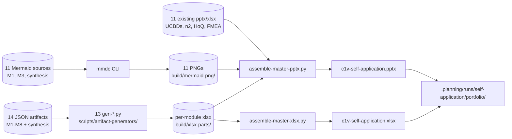
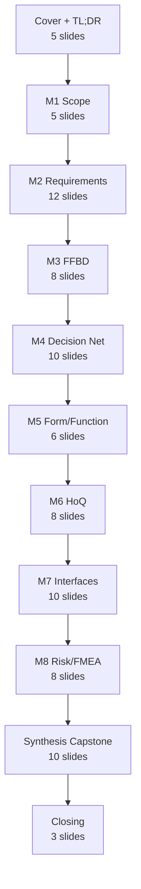
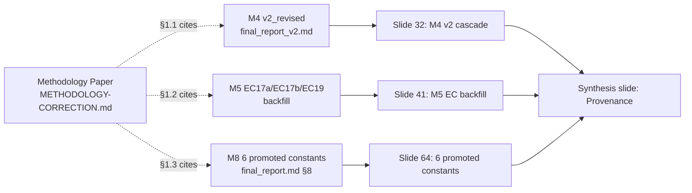

# Dogfooding Artifact Deck

**Slug:** `dogfooding-artifact-deck`
**Date:** 2026-05-01
**Status:** REVIEW-FIRST DRAFT — awaiting David approval; NO code yet

---

## 1. Vision

A single consolidated visualization layer over the c1v self-application run. Every JSON artifact from M1→M8 + the synthesis keystone gets a paired PPT slide(s) and Excel sheet, so the entire dogfooding evidence chain — currently only legible by reading raw JSON + 868 lines of methodology MD — becomes a portfolio-grade browseable + printable + investor-shareable deck.

**Two outputs, both regenerable from JSON:**
1. **`c1v-self-application.pptx`** — master deck, ~85 slides, walks the three-pass methodology with one section per module (M1→M8) + the synthesis capstone. PPT is the storytelling artifact.
2. **`c1v-self-application.xlsx`** — multi-sheet workbook, 1 tab per matrix-shaped artifact (requirements, constants, NFRs, decision network, HoQ, N2, FMEA-early, FMEA-residual, Pareto frontier). Excel is the analyst/auditor artifact.

Both regenerated by a single command: `pnpm tsx scripts/artifact-generators/build-self-application-deck.ts`.

---

## 2. Problem

The dogfooding artifacts are real (you ran the methodology on c1v itself and it produced 13 upstream JSON files + a synthesis recommendation). But **today they're unviewable without a code reader**:

- Self-synthesis sits in [.planning/runs/self-application/synthesis/architecture_recommendation.v1.json](.planning/runs/self-application/synthesis/architecture_recommendation.v1.json) (23.6 KB JSON) and an HTML render. No PPT.
- Per-module v2 artifacts are in [system-design/kb-upgrade-v2/](system-design/kb-upgrade-v2/) — JSON-rich but PPT/XLSX coverage is **inconsistent**:

| Module | JSON | PPT | XLSX | Coverage |
|---|---|---|---|---|
| M1 Scope | ✅ scope_tree, context_diagram, data_flows | ❌ | ❌ | 0% |
| M2 Reqs | ✅ requirements (99), constants (28), NFRs, UCBDs (6) | ✅ UCBDs only (14 slides) | ❌ | ~10% |
| M3 FFBD | ✅ ffbd.v1.json (88 fns) | ❌ in v2 tree | ❌ | 0% |
| M4 Decision Net | ✅ decision_network.v1.json | ❌ in v2 tree | ❌ | 0% |
| M5 Form/Function | ✅ form_function_map.v1.json | ❌ | ❌ | 0% |
| M6 HoQ | ✅ ×2 (kb-upgrade v2 + self-app) | ❌ | ✅ ×2 | 50% |
| M7 Interfaces | ✅ n2 + interface_specs | ✅ ×3 (n2/data_flow/sequence) | ✅ ×2 (n2 + interface_matrix) | ~80% |
| M8 Risk/FMEA | ✅ fmea_early + fmea_residual | ❌ | ✅ ×2 | 50% |
| Synthesis | ✅ architecture_recommendation.v1 | ❌ | ❌ | HTML only |

**Net:** ~30% of artifacts have a viewer. M1, M3, M4, M5, and the synthesis capstone — the *most important* slides for the methodology argument — have **zero** PPT/XLSX.

The methodology paper at `/about/methodology` cites these artifacts as evidence (e.g., M4's `final_report_v2.md §3-7`, M8's 6 promoted constants). A reader who clicks a citation today gets either a JSON file or a 404.

---

## 3. Current State (real code, real paths)

### 3.1 Generators that already exist
13 Python generators at [scripts/artifact-generators/](scripts/artifact-generators/) (T10 Wave-1 ship; CLAUDE.md confirms `t10-wave-1-complete`):

```
gen-arch-recommendation.py    — synthesis HTML (not PPT)
gen-cost-curves.py             — cost charts
gen-decision-net.py            — M4 decision network
gen-dfd.py                     — data flow diagram
gen-ffbd.py                    — M3 FFBD
gen-fmea.py                    — M8 FMEA (variant=early|residual; xlsx works)
gen-form-function.py           — M5 form/function map
gen-interfaces.py              — M7 interface specs
gen-latency-chain.py           — latency chain charts
gen-n2.py                      — M7 N2 matrix
gen-qfd.py                     — M6 HoQ (xlsx works — produced hoq.v1.xlsx)
gen-sequence.py                — sequence diagrams
gen-ucbd.py                    — M2 UCBDs
```

These mostly emit single-artifact files (xlsx, png, mmd → png). **None of them currently emit PPT slides.** Only M2's stakeholder UCBD pptx (14 slides) and M7's n2/data_flow/sequence pptx exist on disk — those were hand-authored or built by older M7-local scripts at [system-design/kb-upgrade-v2/module-7-interfaces/generate_pptx.py](system-design/kb-upgrade-v2/module-7-interfaces/generate_pptx.py).

### 3.2 TS pipeline that orchestrates them
T10 also shipped a TS invoker + manifest at [apps/product-helper/lib/artifact-generators/](apps/product-helper/lib/artifact-generators/) and a manifest endpoint `/api/projects/[id]/artifacts/manifest`. This is **runtime per-tenant** generation. The dogfooding deck is a **batch one-shot** — it can reuse the Python generators directly without going through the TS layer.

### 3.3 Existing rendered artifacts on disk
```
system-design/kb-upgrade-v2/module-2-requirements/diagrams/c1v_UCBDs.pptx        (14 slides)
system-design/kb-upgrade-v2/module-6-qfd/c1v_QFD.xlsx
system-design/kb-upgrade-v2/module-7-interfaces/data_flow_diagram.pptx
system-design/kb-upgrade-v2/module-7-interfaces/interface_matrix.xlsx
system-design/kb-upgrade-v2/module-7-interfaces/n2_chart.pptx
system-design/kb-upgrade-v2/module-7-interfaces/n2_chart.xlsx
system-design/kb-upgrade-v2/module-7-interfaces/sequence_diagrams.pptx
system-design/kb-upgrade-v2/module-8-risk/fmea_table.xlsx
system-design/kb-upgrade-v2/module-8-risk/fmea_residual.v1.xlsx
.planning/runs/self-application/module-6/hoq.v1.xlsx
.planning/runs/self-application/synthesis/architecture_recommendation.html  (103 KB)
```

These are **keepers** — the deck pulls them in rather than re-rendering, except where the layout needs to be normalized for the master PPT.

### 3.4 Mermaid diagrams that need rasterization
M1's [DIAGRAMS-INDEX.md](system-design/kb-upgrade-v2/DIAGRAMS-INDEX.md), the synthesis JSON's inline Mermaid blocks (context / use_case / class / sequence / decision_network), and M3's FFBD diagrams are all currently `.mmd` source. PPT can't embed Mermaid; they need to be rendered to PNG/SVG via `mmdc` (Mermaid CLI). `mmdc` is not currently in repo dev-deps — installing it is a step.

---

## 4. End State

### 4.1 `c1v-self-application.pptx` (master deck, ~85 slides)

**Title section (5 slides):**
- Cover: "c1v Self-Application: Dogfooding the Methodology"
- TL;DR: three-pass argument in 4 bullets
- Methodology cascade diagram (Pass 1 → Pass 2 → Pass 3) — rendered from a new Mermaid in plan
- Provenance chain (1 slide): JSON dependency DAG showing M1→M8→Synthesis
- Reading order: how to navigate the deck

**Module 1 — Defining Scope (5 slides):**
- Section header
- Context diagram (rendered Mermaid PNG from `module-1-defining-scope/M1-diagrams.md`)
- Use-case diagram (rendered Mermaid PNG)
- Scope tree (rendered Mermaid PNG)
- Boundary + 16 external actors table

**Module 2 — Requirements (12 slides):**
- Section header
- Stats slide: 99 reqs / 28 constants / 6 UCBDs
- Requirements distribution chart (functional vs NFR vs constraint)
- Constants table top-10 by tier (Final / Estimate)
- NFR matrix (rows: NFR.NN, cols: target / source / verification)
- Reuse 6 UCBD slides from existing `c1v_UCBDs.pptx` (14 slides → cherry-pick 6)
- v2-to-v2.1 NFR diff slide (the rework receipt)

**Module 3 — FFBD (8 slides):**
- Section header
- F.0 top-level (rendered Mermaid PNG from `FFBD-diagrams.md`)
- F.2–F.7 sub-diagrams (6 slides)

**Module 4 — Decision Network (10 slides):**
- Section header
- DN.01–DN.04 winners (Sonnet 4.5 / pgvector / LangGraph / Vercel)
- Pareto frontier chart (cost vs latency, AV.01..AV.05)
- v2 cascade slide: PC.7 added retroactively (the §1.1 evidence)
- Sensitivity analysis chart
- Full decision matrix (re-render from `decision_network.v1.json`)

**Module 5 — Form/Function (6 slides):**
- Section header
- Form taxonomy
- Function taxonomy
- Form-function map matrix
- EC17a/EC17b/EC19 backfill (the §1.2 evidence)

**Module 6 — HoQ (8 slides):**
- Section header
- Stats: 6 PCs × 18 ECs, 27 nonzero matrix cells, 14 roof pairs
- Full HoQ render (xlsx-to-image via openpyxl → matplotlib heatmap)
- Roof correlation diagram
- Target-value summary

**Module 7 — Interfaces (10 slides):**
- Section header
- N2 chart (reuse existing `n2_chart.pptx` slides)
- Interface specs table (top-10 by criticality)
- Data flow diagram (reuse existing)
- Sequence diagrams (reuse existing — pick 3 representative chains)
- IF.01–IF.NN catalog summary

**Module 8 — Risk/FMEA (8 slides):**
- Section header
- FMEA-early stoplight chart
- FMEA-residual stoplight chart
- 14 high-RPN flagged residual modes table
- 6 promoted-to-Final constants slide (the §1.3 evidence)
- RPN distribution histogram

**Synthesis Capstone (10 slides):**
- Section header
- Recommendation summary (AV.01: $320/mo, 2600ms p95, 99.9% avail)
- Decision-network winners (4 nodes)
- Pareto frontier visualization
- Latency chain breakdown (IF.01..IF.04 sum to 2600ms)
- 14 residual risks → controls mapping
- Architecture sequence diagram
- Cost derivation
- Availability derivation
- Provenance: 13 upstream JSON files cited

**Closing (3 slides):**
- Methodology paper link (`/about/methodology`)
- Where to find raw artifacts (paths)
- Next steps for empirical extension

### 4.2 `c1v-self-application.xlsx` (multi-sheet workbook)

| Sheet | Source | Rows × Cols |
|---|---|---|
| `00_README` | hand-authored | sheet index + provenance |
| `M1_actors` | system_scope_summary.json | 16 × 4 |
| `M1_use_cases` | use_case_inventory.json | 15 × 6 |
| `M2_requirements` | requirements_table.json | 99 × 8 |
| `M2_constants` | constants_table.json + constants.v2.json | 28 × 7 |
| `M2_NFRs` | nfrs.v2.json | ~26 × 9 |
| `M3_functions` | ffbd.v1.json | 88 × 5 |
| `M4_decision_network` | decision_network.v1.json | 4 × N |
| `M4_pareto` | flatten from synthesis | 5 × 8 |
| `M5_form_function_map` | form_function_map.v1.json | varies |
| `M6_HoQ` | hoq.v1.xlsx | embed existing sheet |
| `M7_N2_matrix` | n2_matrix.v1.json | 10 × 10 |
| `M7_interface_specs` | interface_specs.v1.json | ~22 × 8 |
| `M8_FMEA_early` | fmea_early.v1.json | 12 × 11 |
| `M8_FMEA_residual` | fmea_residual.v1.json | 16 × 12 |
| `Synthesis_summary` | architecture_recommendation.v1.json | flattened |
| `Provenance_chain` | _upstream_refs traversal | ~13 rows |

Cross-sheet hyperlinks where artifacts cite each other (e.g., M8's promoted constants link to M2_constants rows).

### 4.3 Build script

```
scripts/artifact-generators/build-self-application-deck.ts
```

Single entry point. Reads SELF_APP_ROOT + KB_UPGRADE_ROOT env paths. Invokes:
1. `mmdc` to rasterize all Mermaid sources to `build/mermaid-png/`
2. Each `gen-*.py` with the right `--input` / `--output` flags
3. `python-pptx` script to assemble the master PPT (new: `assemble-master-deck.py`)
4. `openpyxl` script to assemble the master XLSX (new: `assemble-master-xlsx.py`)

Outputs land in `.planning/runs/self-application/portfolio/`:
```
c1v-self-application.pptx
c1v-self-application.xlsx
build-manifest.json    # what was built, when, from which JSON inputs
```

Idempotent. Re-runnable. Emits a manifest so downstream (e.g., `/about/methodology/evidence` page later) can link to the latest renders.

---

## 5. Systems Engineering Math

### 5.1 Inputs

- **JSON artifacts to consume:** 13 upstream + 1 synthesis = **14 JSON files**
- **Combined JSON size:** ~280 KB (synthesis 23.6 KB + ~256 KB across M1-M8)
- **Mermaid sources to rasterize:** 11 (3 M1 + 7 M3 + 1 inline-synthesis sequence; the synthesis JSON has 5 inline blocks — 4 already rendered into the HTML via mmdc, 1 net-new for master deck cover)
- **Existing rendered artifacts to ingest verbatim:** 11 files (5 pptx + 6 xlsx)

### 5.2 Outputs

- **Master PPT slide count:** ~85 slides
  - Section headers: 9 (one per module + intro + close)
  - Content slides: ~76
  - Avg LOC per `python-pptx` slide assembler: ~30 → assembler script ~2,500 LOC
- **Master XLSX sheet count:** 17 sheets
- **Combined output size estimate:** ~6 MB pptx + ~1.2 MB xlsx = **~7.2 MB deliverable**
- **Mermaid PNG output:** 11 PNGs × ~80 KB avg = ~880 KB intermediate

### 5.3 Generation budget

- **`mmdc` rasterization:** ~2s per diagram × 11 = 22s
- **Per `gen-*.py` invocation:** ~3-5s (read JSON, write xlsx) × 13 = ~50s
- **`assemble-master-pptx.py`:** ~30s (load 11 existing pptx + 11 PNGs + 76 content slides)
- **`assemble-master-xlsx.py`:** ~10s
- **Total wall-clock:** ~2 minutes for a full re-render
- **CI feasibility:** runnable in GitHub Actions (Python 3.14 + node + mmdc) — adds ~3 min to a workflow

### 5.4 Slide-density vs reading-time

- 85 slides × 30s avg reading time = **42 minutes for cover-to-cover walkthrough**
- Investor-pitch subset (intro + synthesis + 3 module exemplars) = 25 slides → ~12 minutes
- Self-contained section reading: any single module = 5-12 slides → 3-6 minutes
- Excel: 17 sheets, analyst-driven, no fixed read time

### 5.5 Provenance fidelity

Every slide footer cites the source JSON path + commit SHA at render time. Every XLSX cell that's a derived value carries a comment with its formula + source. Re-renders preserve `_upstream_refs` chain so future drift between paper and deck is auditable.

---

## 6. Mermaid Diagrams

### 6.1 Build pipeline data flow



### 6.2 Slide section flow



### 6.3 Provenance / evidence chain



---

## 7. Steps

> Order matters; later steps depend on earlier ones. Each step is one atomic commit per `feedback_commit_per_file_immediately` rule.

1. **Add `mmdc` (Mermaid CLI) to repo dev-deps** at root `package.json`. Document install in `scripts/artifact-generators/README.md`. Verify on Apple Silicon.

2. **Write `scripts/artifact-generators/rasterize-mermaid.ts`** — walks a list of `.mmd` paths (or extracts inline blocks from MD), invokes `mmdc`, writes PNGs to `build/mermaid-png/`. Tested against the 3 M1 diagrams.

3. **Extend `gen-decision-net.py` to emit xlsx** (currently outputs JSON-only or chart-only — confirm by reading file). One commit.

4. **Extend `gen-form-function.py` to emit xlsx for the form/function map matrix.** One commit.

5. **Extend `gen-ffbd.py` to emit xlsx for the 88-function table** (in addition to existing PNG output). One commit.

6. **New `scripts/artifact-generators/assemble-master-xlsx.py`** — reads all per-module xlsx parts via `openpyxl`, copies sheets into a master workbook, adds `00_README` index sheet with hyperlinks. Tested on existing partial xlsx files. One commit.

7. **New `scripts/artifact-generators/assemble-master-pptx.py`** — uses `python-pptx` to build the 85-slide deck. Loads section templates, embeds Mermaid PNGs, ingests existing pptx slides via `python-pptx-merger` or manual slide-copy. One commit per major section (10 commits total).

8. **New `scripts/artifact-generators/build-self-application-deck.ts`** — single TS entry point that orchestrates steps 2-7 in dependency order. Reads SELF_APP_ROOT + KB_UPGRADE_ROOT from env. Writes `build-manifest.json`. One commit.

9. **CI workflow `.github/workflows/build-self-application-deck.yml`** — manual trigger + nightly cron. Uploads pptx/xlsx as workflow artifacts. One commit.

10. **`/about/methodology/evidence` page in apps/product-helper** — server component, force-static, links to the latest portfolio outputs from `build-manifest.json`. One commit.

11. **README at `.planning/runs/self-application/portfolio/README.md`** — explains the deck, points readers to the methodology paper, lists how to re-render.

12. **Atomic verification step** — run the full build, assert the 14 source JSON files all surface in either a slide or a sheet, assert no Mermaid block is unrasterized, assert build-manifest.json is well-formed.

**Total commits estimate:** ~22 atomic commits across 4-6 work sessions. No new database tables. No deps beyond `mmdc` + `python-pptx` + `openpyxl` (latter two already in `.venv`).

---

## 8. Out of Scope (explicit)

- **Animated/interactive PPT** — static slides only. Interactivity goes on the future `/about/methodology/evidence` page, not in PPT.
- **Re-running the methodology pipeline** — this plan visualizes existing artifacts only. Does not re-execute M1→M8.
- **Live Sentry/cost data** — synthesis cost/latency numbers are frozen at synthesis-time. A future "live" version goes in TB1's dashboards, not the deck.
- **Investor-pitch subset deck** — defer to a follow-up "pitch-deck" plan; this plan ships the full 85-slide artifact, and the pitch-deck can be derived from it later.
- **Per-tenant version of this for customer projects** — that's the runtime artifact pipeline (T10 ship). This deck is c1v-only, batch.

---

## 9. Open Items for David Review

These are not scope cuts — they're forced choices where the answer changes the build:

1. **Brand styling on the deck:** apply the Firefly/Porcelain/Tangerine palette + Space Grotesk title font + Consolas body? Or keep it neutral B&W per `feedback_exports_no_branding` ("exports = plain B&W is FINE")?
2. **Output location:** `.planning/runs/self-application/portfolio/` (proposed) or `system-design/portfolio/` (closer to source)?
3. **Synthesis HTML vs new synthesis slides:** the 103 KB HTML already renders the recommendation beautifully. Do we ingest it as iframes/screenshots, or rebuild from the JSON natively in PPT?

Default I'll take if unanswered: **(1) plain B&W per feedback memory, (2) `.planning/runs/self-application/portfolio/`, (3) rebuild from JSON natively (HTML stays, but PPT is independent).**

---

## 10. Reading Order for the Reviewer

1. §2 Problem (the 30%-coverage table)
2. §4 End State (what gets built)
3. §5 Math (slide count, build time, output size)
4. §7 Steps (the 22-commit order)
5. §9 Open Items (decide before I start)
