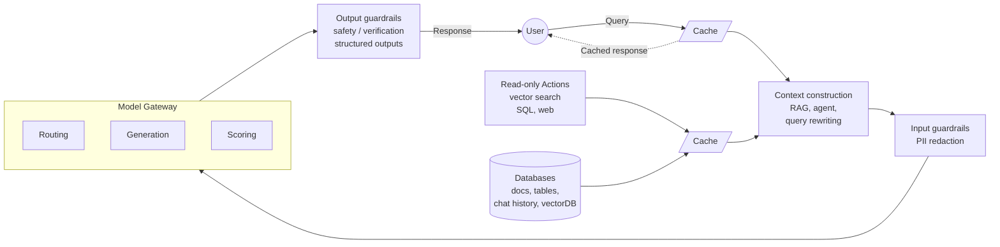
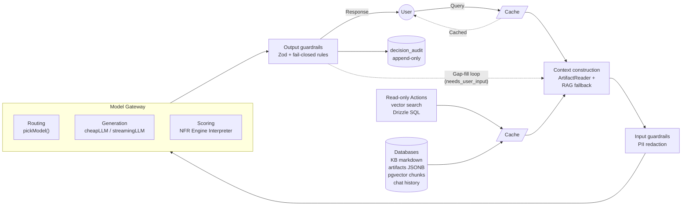
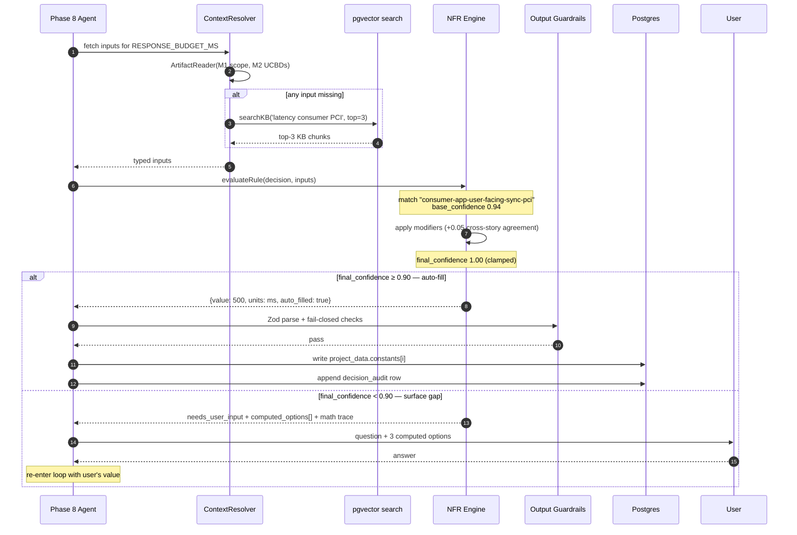

# KB Runtime Architecture — Component Map

> Purpose: Map the Chip-Huyen-style AI system reference architecture (your Apr 20 diagram) to concrete c1v code locations + contracts. Decides what gets built vs. reused vs. added before executing the schema-first KB rewrite on folder 15.
> Parent plans: `.claude/plans/schema-drift-visualization.md` (NFR engine) + `.claude/plans/schema-drift-visualization.critique.md`
> Target corpus: `apps/product-helper/.planning/phases/15 - Knowledge-banks-deepened UPDATED/New-knowledge-banks/`
> Date: 2026-04-20
> Status: DRAFT v1 — awaiting David's review. No code or KB touched.

---

## 1. Reference architecture (the diagram)

### 1.1 Huyen reference (as shared Apr 20)



### 1.2 c1v adaptation (with §3 additions)

Two arrows that aren't in Huyen's single-shot diagram but are load-bearing for the NFR engine: the **audit sink** (every Scoring decision persists) and the **multi-turn gap-fill loop** (below-threshold outputs route back to Context construction, not straight to Response).



c1v's KB runtime is this pipeline, parameterized for the 7-module system-design process instead of a general chatbot.

---

## 2. Component map

Each row: **block → current c1v location → status → contract**.

### 2.1 Storage & retrieval

| Block | c1v location | Status | Contract |
|---|---|---|---|
| **Databases — documents** | `apps/product-helper/.planning/phases/15 - .../New-knowledge-banks/` (313 files, 7 modules) | ✅ exists | Markdown files keyed by `<module>/<phase>.md`. Schema-first 6-section shape per plan §3 (post-rewrite). |
| **Databases — tables** | `apps/product-helper/lib/db/schema.ts` (Drizzle) + `apps/product-helper/lib/db/schema/v2-validators.ts` (Zod) | ✅ exists | `projects.project_data` JSONB holds artifacts. Phase-artifact shape = Zod schemas in v2-validators. |
| **Databases — chat history** | `messages` table (Drizzle) | ✅ exists | Per-project message thread. Feeds Context construction as chat-history signal. |
| **Databases — vectorDB** | **not present** — no pgvector extension, no embeddings table | ❌ greenfield | Need: `kb_chunks` table (id, module, phase, section, content, embedding vector(1536)) + pgvector extension enable in Supabase. |
| **Read-only Actions — vector search** | **not present** | ❌ greenfield | Contract: `searchKB(query: string, topK: number, filter?: {module, phase}) → KBChunk[]` — cosine similarity over `kb_chunks.embedding`. |
| **Read-only Actions — SQL** | Drizzle queries in `apps/product-helper/lib/db/queries.ts` | ✅ exists | Already used by agents (project state, credit checks). Expose a typed `ArtifactReader` for context construction. |
| **Read-only Actions — web search** | not used; out of scope for v1 | — | Skip for v1; add later if an engine rule needs live web data (e.g., CVE lookup for security-posture story). |

### 2.2 Context construction

| Block | c1v location | Status | Contract |
|---|---|---|---|
| **Query rewriting** | `apps/product-helper/lib/langchain/agents/intake/clarification-detector.ts` (shape) | ⚠️ partial — only clarification flow | Generalize: `rewriteQuery(phase: ModulePhase, rawInput: string, upstreamArtifacts: Record) → typed Input` — normalizes user input into the typed shape the engine rule tree expects. |
| **RAG retrieval + rank** | **not present** | ❌ greenfield | Contract: `fetchContext(decisionId, upstreamArtifacts) → {typedInputs, ragChunks[], chatSummary?}`. RAG only fires when the engine rule tree falls to `default` branch or final_confidence < 0.75. |
| **Agent — rule tree evaluator** | clarification-detector's `heuristicCheck()` is the precedent pattern | ⚠️ precedent exists, not generalized | `evaluateRule(decision: DecisionRef, inputs: Record) → {matched_rule_id, base_confidence, value?}` — deterministic, no LLM. |

### 2.3 Guardrails

| Block | c1v location | Status | Contract |
|---|---|---|---|
| **Input guardrails (PII redaction)** | **not present** | ❌ greenfield | For v1: strip email/phone regex from free-text inputs before logging to audit trail. Full PII redaction defer. Contract: `redactInput(raw: string) → {clean, redactions[]}`. |
| **Output guardrails — structured outputs** | `apps/product-helper/lib/db/schema/v2-validators.ts` (Zod) | ✅ exists | `outputSchema.parse(engineOutput)` — throws on shape drift. Add strict=true to catch extra fields. |
| **Output guardrails — safety/verification** | Fail-closed rules in KB phase files (e.g., STOP GAP checklists) | ⚠️ defined in prose, not enforced in code | Codify: `checkFailClosedRules(artifactKey, output) → {passed, violations[]}`. Rules live in the phase file's §5; interpreter loads them as JSON alongside engine.json. |

### 2.4 Model gateway

| Block | c1v location | Status | Contract |
|---|---|---|---|
| **Routing** | `apps/product-helper/lib/langchain/config.ts` (4 named LLMs: `llm`, `streamingLLM`, `extractionLLM`, `cheapLLM` — all Sonnet today) | ⚠️ named instances, no dynamic routing | Add `pickModel(decision: DecisionRef, rulePath: 'heuristic' | 'llm_refine' | 'user_surface') → LLMInstance` — heuristic always no-LLM, llm_refine uses cheapLLM (Haiku), user_surface uses streamingLLM. |
| **Generation** | Same `config.ts` LLMs + agents in `lib/langchain/agents/` | ✅ exists | Only fires when `evaluateRule` returns `final_confidence < auto_fill_threshold AND decision.llm_assist: true`. |
| **Scoring** | **clarification-detector.ts is the pattern** — not yet the engine | ⚠️ pattern proven, 13 story engines TBD | `NFREngineInterpreter.evaluate(decision, context) → EngineOutput` — heuristic first, LLM-refine fallback, Zod-validated output. See `schema-drift-visualization.critique.md` §11 for type-shape mapping. |

### 2.5 Cache

| Block | c1v location | Status | Contract |
|---|---|---|---|
| **Cache — query (response cache)** | **not present** externally; Anthropic prompt caching enabled via `cacheControl: true` in `config.ts` | ⚠️ partial (prompt cache only) | v1: keep prompt caching; skip external response cache. Add later (Upstash) once traffic justifies. |
| **Cache — context (RAG output cache)** | **not present** | ❌ greenfield (defer) | v1: skip. Deterministic rule trees don't need caching; RAG results re-compute on-demand. Revisit once vector search is > 200ms p95. |

---

## 3. Additions the reference diagram doesn't show

Two concerns are load-bearing for the NFR engine but absent from Huyen's single-shot Q→R diagram. Make them explicit:

### 3.1 Audit sink

- **Purpose:** Every Scoring decision writes an immutable row — `decision_id, target_field, value, inputs_used, modifiers_applied, final_confidence, matched_rule_id, auto_filled, override_history`.
- **Where it lives:** sibling to Databases, written by Output guardrails on every pass.
- **Storage choice (open question):** `decision_audit` Postgres table (preferred — queryable, joinable) vs. `decision_audit.jsonl` file next to each artifact (cheaper, less queryable). Recommendation: Postgres table, given the auto-fill UI will want per-field history joins.

### 3.2 Multi-turn gap-fill loop

- **Purpose:** When Scoring emits `needs_user_input: true`, the pipeline doesn't return to Response — it surfaces a question to the user, collects the answer, and re-enters Context construction with the new input.
- **Where it lives:** a new arrow from Output guardrails back to Context construction (not to Response).
- **Contract:** `surfaceGap(decision, computedOptions, mathTrace) → Promise<UserAnswer>` — blocking. UI component: existing intake chat window can host this, or a dedicated decision-review panel per phase.

---

## 4. Data flow — one decision end-to-end

Walk `story-03-latency-budget / RESPONSE_BUDGET_MS` through every block:



Step-by-step:

1. **User query** — not applicable at this step; the decision is triggered by Phase 8 Constants Table agent, not direct user input.
2. **Cache (query)** — skipped (not a user query).
3. **Context construction**
   - `ArtifactReader.fetch([module_1_scope, module_2_ucbd])` → typed upstream artifacts.
   - `rewriteQuery` resolves `decision.inputs` → `{user_type: 'consumer_app', flow_class: 'user_facing_sync', regulatory_refs: ['PCI-DSS']}`.
   - If any input missing → `searchKB('response latency consumer apps PCI', 3, {module: 2, phase: 8})` fills gap with top-3 chunks.
4. **Input guardrails** — `redactInput` over any raw user strings in upstream artifacts.
5. **Model gateway — Routing** — `pickModel(decision, 'heuristic')` → no LLM call (rule tree is pure).
6. **Model gateway — Scoring** (the heart)
   - `evaluateRule(decision, inputs)` → matches `consumer-app-user-facing-sync-pci` rule → `{value: 500, units: 'ms', base_confidence: 0.94}`.
   - `applyModifiers` → `+0.05` cross-story agreement (story-13 agrees 500ms for payment) → clamp to 1.00.
   - `final_confidence = 1.00 ≥ 0.90` → auto-fill.
7. **Output guardrails**
   - `checkFailClosedRules` → no violations (name UPPER_SNAKE_CASE, category=latency+units=ms OK, referenced_requirements non-empty).
   - `outputSchema.parse` → Zod accepts.
   - Write to `project_data.intake_state.kbStepData.constants[i]`.
   - Emit audit row.
8. **Cache (context)** — skipped.
9. **Response** — to the agent's loop; agent advances to next decision.

When `final_confidence < 0.90`: steps 6 halts, step 7 writes `needs_user_input: true` + computed options + math trace, loop jumps to §3.2 (surface to user).

---

## 5. Gap inventory — what must be built

Ordered by blocking severity:

| Gap | Severity | Est effort | Unblocks |
|---|---|---|---|
| **G1 — `NFREngineInterpreter` class** (generalized from clarification-detector) | 🔴 blocking | 0.5d | Everything in §2.4 Scoring |
| **G2 — `engine.json` schema + loader** (13 story engines) | 🔴 blocking | 0.5d + 3d authoring | Phase β of parent plan |
| **G3 — Rule-predicate DSL evaluator** (`_contains`, `_in`, range) | 🔴 blocking | 0.5d | G1 |
| **G4 — `ArtifactReader` + `ContextResolver`** | 🔴 blocking | 1d | Every engine that reads upstream inputs |
| **G5 — `decision_audit` Postgres table + writer** | 🟡 high | 0.5d | Audit trail, override history |
| **G6 — `checkFailClosedRules` loader + runner** | 🟡 high | 0.5d | Output guardrails §2.3 |
| **G7 — `surfaceGap` + chat-panel integration** | 🟡 high | 1–2d | Multi-turn loop §3.2 |
| **G8 — pgvector enable + `kb_chunks` table + ingestion job** | 🟢 medium (v1 optional) | 1d | RAG fallback §2.2 |
| **G9 — KB embedding pipeline** (chunk 313 files → embeddings) | 🟢 medium (v1 optional) | 1d | G8 |
| **G10 — `redactInput` util** (regex-level PII) | 🟢 low | 0.5d | Input guardrails §2.3 |
| **G11 — `pickModel` router** | 🟢 low | 0.25d | Model routing §2.4 |
| **G12 — external response cache (Upstash)** | ⚪ defer | — | Not needed v1 |
| **G13 — context cache (RAG output)** | ⚪ defer | — | Not needed v1 |

**Infrastructure total (G1–G7, G10–G11): ~5.25 days.** Pairs with the critique's Phase β re-budget (7 days with 3–4 days of rule authoring on top).

**RAG layer (G8–G9): 2 additional days** — activates the vector DB + embeddings. Recommend ship in v1 even if it's only fallback, because RAG is the answer to David's "100x more changes" growth question. Without it, new domain knowledge has nowhere to land except new rule-tree branches.

---

## 6. Execution order — against folder 15

```
┌─ Week 1 ─────────────────────────────────────────────────────────┐
│ Day 1    Build G1 (Interpreter) + G3 (Predicate DSL)             │
│ Day 2    Build G4 (ArtifactReader/ContextResolver)               │
│ Day 3    Build G5 (Audit writer) + G6 (FailClosed runner)        │
│ Day 4–5  Build G7 (Gap-surface chat integration)                 │
│          Build G10, G11 (PII, Routing) — small                   │
└───────────────────────────────────────────────────────────────────┘
┌─ Week 2 ─────────────────────────────────────────────────────────┐
│ Day 6    Build G8 (pgvector + schema)                            │
│ Day 7    Build G9 (embedding pipeline)                           │
│ Day 8–10 Author 13 engine.json rule trees + golden tests         │
│          Start KB rewrite Phase γ (schema-first shape)           │
└───────────────────────────────────────────────────────────────────┘
┌─ Weeks 3–5 ──────────────────────────────────────────────────────┐
│ Day 11–22  KB rewrite γ (80 phase files across M1–M7)            │
│ Day 23–24  Phase δ (delete 65 duplicates, update 5 schemas)      │
│ Day 25–27  Phase ε (LangGraph nodes, UI "why this value?")       │
└───────────────────────────────────────────────────────────────────┘
```

**All edits target `.../15 - Knowledge-banks-deepened UPDATED/...`. Folder 13 untouched as rollback.**

---

## 7. Open questions

1. **Audit storage:** Postgres table or JSONL file? Recommendation: Postgres. Decide before G5.
2. **Vector DB host:** Supabase pgvector (already-paid infra) or external (Pinecone/Weaviate)? Recommendation: Supabase pgvector. Decide before G8.
3. **Embedding model:** OpenAI `text-embedding-3-small` (1536 dim, low cost) or Anthropic equivalent (none native — Anthropic doesn't ship an embedding model yet)? Recommendation: OpenAI `text-embedding-3-small` via a single `EMBEDDINGS_API_KEY` env var. Decide before G9.
4. **RAG scope:** KB chunks only (v1) or KB + project chat history + upstream artifacts (v2)? Recommendation: KB-only v1, broaden later once chunking strategy is proven.
5. **Gap-surface UI:** reuse existing `components/chat/` window or build dedicated `components/decision-review/` panel? Recommendation: reuse chat for v1 (zero UI work); build dedicated panel only if user-testing shows chat is wrong surface.
6. **MCP exposure:** Should the NFR engine be callable via MCP (the existing 17-tool MCP server) so external IDEs can trigger auto-fill? Defer — v1 runs inside the product-helper web app only.

---

## 8. What this doc does NOT commit to

- Any code edits (critique's recommendations must land first).
- Authoring the 13 engine.json rule trees (that's Phase β content, not architecture).
- Rewriting any KB phase files (that's Phase γ).
- The 5 JSON schema extensions (that's Phase δ).
- Any pricing/cost analysis on embeddings + LLM calls at scale.

---

*Component map v1. Ready for David's review. On green-light, next step = resolve critique items 1–5 (rename, fold precedent, draft Appendices A+B, §5.6 DSL), then start G1.*

— Bond
