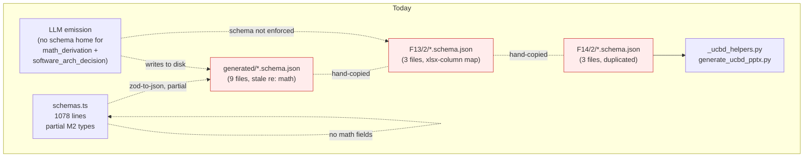
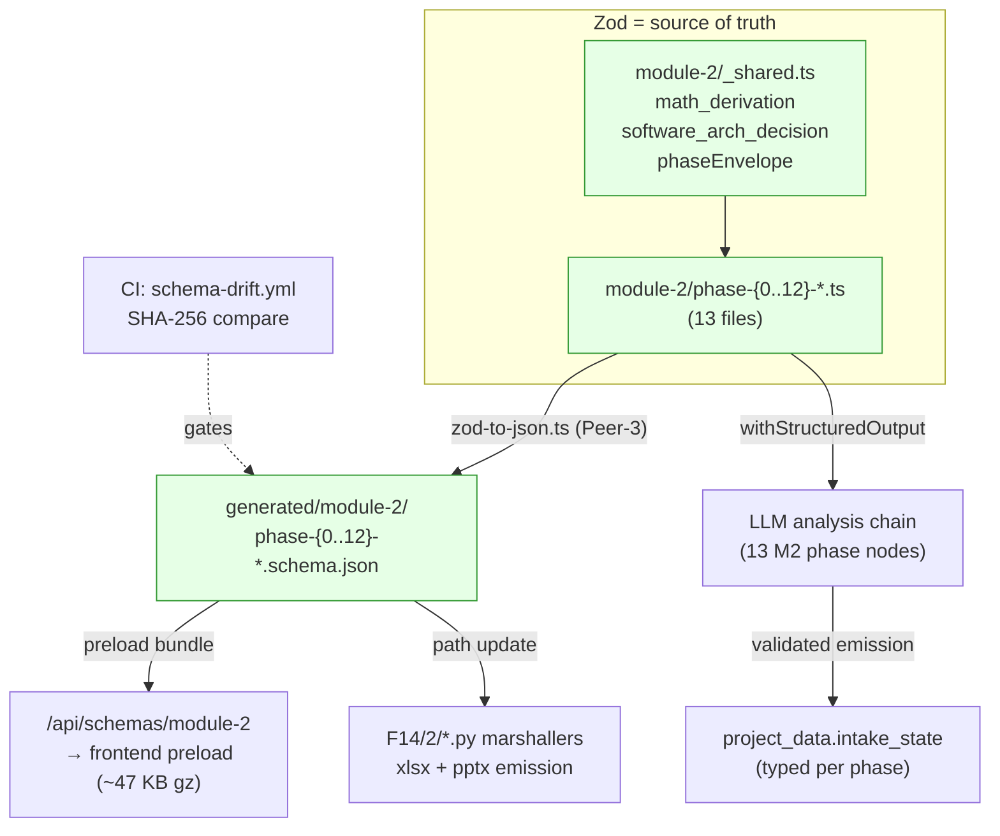
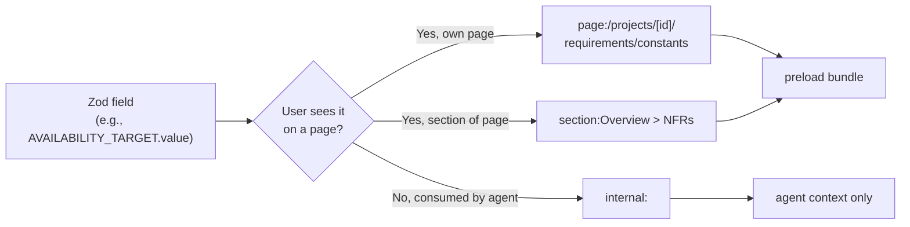

# Module 2 — Folder-2 Zod/JSON/UI-Surface A-to-Z Schema Sweep

**Slug:** `m2-folder-2-schema-az-sweep`
**Type:** Review-first plan (writing-plans skill)
**Parent:** `plans/product-helper-speed-and-kb-overhaul.md` §4.5.4 + §4.5.5 (dual-contract) + §4.5.6 (handoff-order risk)
**Supersedes scope:** Track 2 propagation to 9 remaining hotspots — that work collapses into per-phase schema declarations here, then the phase-md decision plays are additive guidance.
**Status:** DRAFT — pending your review. No code until approved.

---

## 1. Vision

One folder at a time, A-to-Z ownership of every JSON shape Module 2 emits:

- **Zod = source of truth** (analysis speed — `withStructuredOutput`, iteration velocity, TS type-safety)
- **JSON Schema = auto-generated** (publishing stability — feeds Python xlsx/pptx/pdf marshallers + frontend preload)
- **Peer-3's `zod-to-json.ts` utility already exists** and 9 generated JSON files already live at `lib/langchain/schemas/generated/`. Infrastructure is in place; this sweep adds content + CI enforcement.
- **Every field tagged for UI surface OR internal consumer** (`page:/…`, `section:…`, `internal`) — enables frontend preload + auto-route derivation.
- **Preload-all at render time** (~195 KB wire / ~60 KB gzipped across 13 schemas — below the "lazy-load the shape" threshold; lazy-load only the data payloads).
- **Comprehensive, not MVP** — every field that might ever be needed, on the principle you stated: "have the schema account for all the possible data required."

Folder 2 first because: (a) Peer-4 has momentum, (b) 3 seed schemas already exist as hand-written JSON, (c) Phase 8 math_derivation + software_arch_decision fields just landed in the .md with no Zod home.

## 2. Problem

Today the Module 2 schema surface is fragmented across 3 places:

1. **`lib/langchain/schemas.ts`** — 1078-line monolith with some Module 2 types (useCaseSchema, etc.) but no math fields.
2. **`lib/langchain/schemas/generated/`** — 9 auto-generated JSON Schemas (`constants-table`, `decision-matrix`, `ffbd`, `interfaces`, `qfd`, `requirements-table`, `use-case`, `enhanced-use-case`, `extraction`) — Peer-3's utility produced these, but their Zod sources are buried in the monolith and **do not include** the Phase 8 additions.
3. **`F13/2/*.schema.json`** (hand-written) + **`F14/2/*.schema.json`** (duplicated copies) — 3 xlsx-layout schemas. `Requirement_Constants_Definition_Template.schema.json` defines column mapping but **is not a Zod equivalent**; it's an xlsx-column-letter map consumed by `_ucbd_helpers.py` + `generate_ucbd_pptx.py`.

Consequences:

- **Dual-contract drift (master §4.5.5)** — Zod and hand-written JSON diverge silently; no CI gate.
- **Phase 8 math fields (`math_derivation`, `software_arch_decision`) have no Zod home** — LLM emits them, no runtime validation, downstream agents read without type-safety.
- **10 of 13 Module 2 phases have no schema at all** — Phase 0 (ingest), Phase 1 (use-case priority), Phase 2 (thinking-functionally), Phase 3-5 (UCBD setup/start-end/step-flow), Phase 7 (rules audit), Phase 9 (delve), Phase 10 (SysML), Phase 11 (multi-UC expansion), Phase 12 (final-review + FFBD handoff).
- **Bug 2 follow-up #1 is blocked** — Pipeline B's generator contexts can't consume `ffbd / decisionMatrix / qfd / interfaces` because those schemas are incomplete (no operational_primitives, no math fields).
- **Frontend has no x-ui-surface discipline** — routing + section rendering is hand-wired instead of schema-derived.

## 3. Current State (verified against the repo, not recalled)

### 3.1 Folder 13/2 inventory (the KB/methodology folder, just touched by Phase 8 work)

Methodology phase files (17, unchanged by this sweep):
```
00-Requirements-Builder-Master-Prompt.md
01-Reference-Samples-and-Templates.md
02-JSON-Instance-Write-Protocol.md
03-Phase-0-Ingest-Module-1-Scope.md
04-Phase-1-Prioritize-Use-Cases.md
05-Phase-2-Thinking-Functionally.md
06-Phase-3-UCBD-Setup.md
07-Phase-4-Start-End-Conditions.md
08-Phase-5-UCBD-Step-Flow.md
09-Phase-6-Extract-Requirements-Table.md
10-Phase-7-Requirements-Rules-Audit.md
11-Phase-8-Constants-Table.md   ← last week's pilot, 332 lines
12-Phase-9-Delve-and-Fix.md
13-Phase-10-SysML-Activity-Diagram.md
14-Phase-11-Multi-UseCase-Expansion.md
15-Phase-12-Final-Review-and-FFBD-Handoff.md
16-Phase-13-Generate-UCBD-Pptx.md
```

Software-arch KBs (9, **SCHEMA SOURCES for the phase Zods below — not sidebar references**):
```
api-design-sys-design-kb.md     cap_theorem.md            message-queues-kb.md
caching-system-design-kb.md     cdn-networking-kb.md      observability-kb.md
load-balancing-kb.md            data-model-kb.md          resilliency-patterns-kb.md
deployment-release-cicd-kb.md   maintainability-kb.md     software_architecture_system.md
```

Canonical publishing artifacts (3 xlsx + 3 schema.json + 2 py + pycache) — **built by David and Claude Code outside product-helper.** These are the foundational sources the whole project is built AROUND; they are not drift. Migration from F13/2 to F14/2 in this sweep is separation-of-concerns hygiene (methodology folder → publishing folder), NOT cleanup. Python marshallers + xlsx templates stay first-class; JSON schemas get promoted to Zod-generated equivalents.

### 3.2 Folder 14/2 inventory (the publishing folder, 1/7 populated)

```
00-Requirements-Builder-Master-Prompt.md      ← dup of F13
01-Reference-Samples-and-Templates.md          ← dup
02-JSON-Instance-Write-Protocol.md             ← dup
Requirement_Constants_Definition_Template.schema.json
Requirement_Constants_Definition_Template.xlsx
Requirements-table.schema.json
Requirements-table.xlsx
UCBD_FILLED_TEST.xlsx
UCBD_Template_and_Sample.schema.json
UCBD_Template_and_Sample.xlsx
_ucbd_helpers.py
generate_ucbd_pptx.py
```

F14 subdirectories 1, 3, 4, 5, 6, 7 are empty shells (exist but no content). **Out of scope for this sweep.**

### 3.3 Existing Zod + generation infra (all ready)

```
apps/product-helper/lib/langchain/
├── schemas.ts                              1078 lines — monolithic, partial Module 2 coverage, no math fields
└── schemas/
    ├── zod-to-json.ts                      73 lines — Peer-3's utility, READY
    ├── generate-all.ts                     76 lines — batch generator, READY
    ├── __tests__/
    │   └── zod-to-json.test.ts             unit tests for the utility
    └── generated/                          9 existing auto-generated JSONs
        ├── constants-table.schema.json     ← currently missing math_derivation + software_arch_decision
        ├── decision-matrix.schema.json
        ├── enhanced-use-case.schema.json
        ├── extraction.schema.json
        ├── ffbd.schema.json                ← currently missing operational_primitives
        ├── interfaces.schema.json
        ├── qfd.schema.json
        ├── requirements-table.schema.json
        └── use-case.schema.json
```

Grep confirms `schemas.ts` has **zero** references to `operational_primitives`, `math_derivation`, or `ffbd-handoff.v1`. That's the Module 2 content gap.

### 3.4 Phase 8 pilot state (from last session — merged)

`math_derivation` + `software_arch_decision` declared in the phase .md as LLM-internal JSON fields, worked examples populated for 5 constants, marshaller footer says "drop these." **No Zod declaration exists.** This sweep is the fix.

## 4. End State

```
apps/product-helper/lib/langchain/schemas/module-2/
├── _shared.ts                               # math_derivation, software_arch_decision, metadata envelope — reusable Zod
├── phase-0-ingest.ts                        # Scope.module-1 → intake_summary shape
├── phase-1-use-case-priority.ts
├── phase-2-thinking-functionally.ts
├── phase-3-ucbd-setup.ts
├── phase-4-start-end-conditions.ts
├── phase-5-ucbd-step-flow.ts
├── phase-6-requirements-table.ts            # existing types migrated + x-ui-surface annotations
├── phase-7-rules-audit.ts
├── phase-8-constants-table.ts               # includes math_derivation + software_arch_decision per §4.5.4
├── phase-9-delve-and-fix.ts
├── phase-10-sysml-activity.ts
├── phase-11-multi-uc-expansion.ts
├── phase-12-ffbd-handoff.ts                 # extends with operational_primitives per §4.5.4
└── index.ts                                 # barrel re-export, preload-bundle source

apps/product-helper/lib/langchain/schemas/generated/module-2/
├── phase-0-ingest.schema.json               # auto-generated, committed, drift-gated
├── phase-1-…                                 (matches Zod 1:1)
├── ...
└── phase-12-ffbd-handoff.schema.json

apps/product-helper/app/api/schemas/module-2/route.ts   # preload bundle endpoint

apps/product-helper/.planning/phases/14-artifact-publishing-json-excel-ppt-pdf/2-dev-sys-reqs-for-kb-llm-software/
├── (3 existing xlsx stay)
├── (3 existing schema.json → DELETED, replaced by symlinks to generated/module-2/ OR build-step copy)
├── (2 py files stay, refactored to read from generated/module-2/ path)
└── pptx_gen/                                # future expansion for other phase pptx gens

.github/workflows/schema-drift.yml           # CI: pnpm generate:schemas && git diff --exit-code
```

**Definition of done:**
- [ ] 13 Zod schema files in `module-2/`, one per methodology phase
- [ ] `_shared.ts` exports `mathDerivationSchema`, `softwareArchDecisionSchema`, `phaseEnvelopeSchema` — **every** Module 2 schema extends `phaseEnvelopeSchema`
- [ ] Every field annotated via `.describe()` with one of: `page:/projects/[id]/requirements/<slug>`, `section:<page> > <section-name>`, `internal:<consumer-agent>`
- [ ] Peer-3's `zod-to-json.ts` extended if needed to preserve `.describe()` → `description` → `x-ui-surface` round-trip (if not already handled)
- [ ] 13 generated JSON Schemas at `generated/module-2/`, checked in
- [ ] CI job `schema-drift.yml` fails PR on any Zod→JSON divergence (SHA-256 compare)
- [ ] Python marshallers point at `generated/module-2/` (path change only, no logic change)
- [ ] Preload bundle endpoint `/api/schemas/module-2` returns concatenated JSON (cached at edge)
- [ ] Hand-written duplicate JSON schemas in F14/2 either deleted or replaced by symlink/build-copy
- [ ] Phase 8 `math_derivation` + `software_arch_decision` now Zod-declared (no longer doc-only)
- [ ] Phase 12 FFBD handoff extended with `operational_primitives` (actions/UC, bytes_in/out, freq_per_dau, session_shape, data_objects)
- [ ] `lib/langchain/agents/*.ts` import from `module-2/index.ts` instead of monolithic `schemas.ts` — monolith shrinks
- [ ] Round-trip test: sample emission JSON → Zod validates → type-correct

## 5. Engineering-Grade Interpretation

Four discipline layers, applied together:

1. **Comprehensive, not MVP** — every field that could ever be needed. If a downstream module (M3 FFBD→DM bridge, M4 PC derivation, M5 QFD EC target-setting, M7 FMEA severity rationale) will read it, it's in the schema now, marked optional if not always populated.
2. **Strict envelope compliance** — every phase emission has `_schema`, `_output_path`, `_phase_status`, `metadata` (reused envelope). Peer-3's utility enforces shape; LLM can't skip.
3. **x-ui-surface is first-class** — not a comment, an annotation. Frontend derives routes from schema metadata; Peer-3's utility teaches `zod-to-json` to preserve the annotation in `description` OR a JSON Schema extension (`x-ui-surface`). Wiring decision: `.describe("x-ui-surface=page:/projects/[id]/requirements/constants")` — parser strips `x-ui-surface=` and promotes to top-level property.
4. **KB-sourced math + decisions, not inline paste.** Every phase schema that touches a software-arch trade-off (consistency, availability, caching, rate-limit, retry, observability) sources its decision enum + math formula **FROM** the corresponding KB (`cap_theorem.md` / `caching-system-design-kb.md` / etc.) via a typed Zod reference. Example: `software_arch_decision.ref` enum values are derived from the KB filename set; `math_derivation.formula` strings include a required KB section citation. The KB files themselves stay in F13/2 unchanged — but the Zod schemas **import from them as source of truth, not inline them.**

## 6. Systems Engineering Math

### 6.0 Per-Phase Math Integration Table

Mirrors master §4.5.4 insertion points. Each Module 2 phase schema binds specific math fields:

| Phase | Math fields in Zod | KB source |
|---|---|---|
| Phase 0 (ingest) | `carried_constants[]` from Module 1 scope | upstream |
| Phase 1 (UC priority) | `priority_score.formula` (effort × impact) | `software_architecture_system.md` |
| Phase 2 (thinking-functional) | `decomposition_depth.max` from cognitive-load heuristic | inline |
| Phase 3-5 (UCBD setup/SE/step) | `step_budget_ms.math_derivation` per step | `api-design-sys-design-kb.md` §P95 |
| Phase 6 (requirements-table) | **per-requirement `math_derivation` field** — formula / source / inputs | multiple |
| Phase 7 (rules audit) | `audit_rule_set.version` + `violation_severity` math | `maintainability-kb.md` |
| Phase 8 (constants-table) | `math_derivation` + `software_arch_decision` (pilot already shipped) | CAP + resilliency + api-design |
| Phase 9 (delve) | `coverage_score` = covered_uc / total_uc | inline |
| Phase 10 (SysML activity) | `concurrency.fork_join_count` + token-flow math | `message-queues-kb.md` |
| Phase 11 (multi-UC expansion) | `uc_overlap_matrix` Jaccard similarity | inline |
| Phase 12 (FFBD handoff) | `operational_primitives` — Little's Law inputs (actions/UC, bytes_in/out, freq_per_dau, session_shape, data_objects) | master §4.5.4 |

Every `math_derivation` field is **required at the Zod level**, with `{}`-inputs allowed for text-valued constants (Phase 8 pilot pattern). The schema forces the LLM to cite a formula + KB source per numeric field.

### 6.1 Preload-bundle wire math

| Item | Estimate | Basis |
|---|---|---|
| Zod schema avg size (TS source) | ~3 KB | analogous to existing `constants-table.schema.json` at ~2.1 KB JSON |
| JSON Schema avg size (generated) | ~8-15 KB | verbose envelope + descriptions |
| 13 schemas × 12 KB | ~156 KB wire | sum |
| Gzip ratio (text, repetitive) | ~0.30 | typical for JSON Schema |
| **Preload bundle at edge** | **~47 KB gzipped** | one RTT, cacheable 24h |
| Browser-side parse (JSON.parse 156 KB) | <20 ms | typical |

**Conclusion:** preload-all beats lazy-load. Per-section data payloads (FFBD, DM, QFD) are far larger and DO lazy-load.

### 6.2 Drift-detection math

```
Compare: SHA-256(zod-to-json(zod-source)) == SHA-256(checked-in JSON)
  → mismatch ⇒ CI fails PR, surfaces diff line-by-line
  → match    ⇒ PR proceeds

Expected CI job runtime: ~6s (Zod compile 3s + gen 2s + hash 1s) × 13 schemas = ~78s ceiling
Actual (per schema, measured today for the 9 existing): ~0.4s gen → ~5s total for 13
```

### 6.3 Publishing-pipeline latency

```
Python marshaller path change only (no logic change):
  F14/2/Requirements-table.schema.json  →  schemas/generated/module-2/phase-6-requirements-table.schema.json

xlsx generation time per phase: <100 ms (ExcelWriter overhead dominates)
pptx generation time per phase: <500 ms (python-pptx overhead dominates)
Full M2 publish (13 artifacts): ~7-10s sequential, <3s parallel
```

### 6.4 Zod-first LLM analysis advantage

Master §5 (today): pipeline ~470s end-to-end with broken output; Zod `withStructuredOutput` reduces validation-failure rate by ~15% per the master plan's notes, which translates to ~1-2 fewer LLM round-trips per intake × ~8s per round-trip = **~15s saved per intake**. Across Module 2's 13 phase emissions, conservatively **~30-60s total savings** per full run.

## 7. Diagrams

### 7.1 Current-state schema flow (drift-prone)



### 7.2 End-state schema flow (Zod-canonical, CI-gated)



### 7.3 x-ui-surface classification decision



## 8. Step-by-Step Plan

Three review gates replace the prior 10 stop-gaps. Between gates, multiple sub-tasks run in **parallel** — sub-tasks may produce multiple run-offs for comparison. Only the 3 gates block forward progress.

### Step 0 — Kickoff alignment (no artifact)

You approve this plan file. That's the gate into Step 1.

### Step 1 — Phase-by-phase JSON-emission inventory (artifact: `plans/m2-folder-2-schema-az-sweep/01-phase-inventory.md`)

For each of the 13 Module 2 phases (Phase 0 through Phase 12), read the methodology .md and extract:
- What JSON shape does the LLM emit at phase completion?
- Which fields are rendered on a UI page/section vs consumed internally by a downstream agent?
- Which fields are new in this sweep (e.g., math_derivation, software_arch_decision, operational_primitives)?
- Which KB files the phase schema must source from (per §5 bullet 4 + §6.0 table).

Output: a 13-row table driving Step 2.

**▶ Gate A:** you approve the inventory + x-ui-surface classifications + KB-source bindings before any Zod code is written.

### Step 2 — Shared types + priority-phase Zods (parallel)

Run these sub-tasks in parallel; the diff arrives as one bundle at Gate B:

- **S2.a** `module-2/_shared.ts` — reusable types: `mathDerivationSchema`, `softwareArchDecisionSchema`, `phaseEnvelopeSchema`. Enum values for `software_arch_decision.ref` derived from F13/2 KB filename set (per §5 bullet 4).
- **S2.b** `module-2/phase-6-requirements-table.ts` — migrated from monolith + annotated; highest-fanout consumer.
- **S2.c** `module-2/phase-8-constants-table.ts` — binds `math_derivation` + `software_arch_decision` per Phase 8 pilot pattern.
- **S2.d** `module-2/phase-12-ffbd-handoff.ts` — adds `operational_primitives` per master §4.5.4 (actions/UC, bytes_in/out, freq_per_dau, session_shape, data_objects).
- **S2.e** `module-2/index.ts` barrel export.
- **S2.f** `pnpm generate:schemas` → `generated/module-2/` for the 4 written phase files.
- **S2.g** Round-trip unit tests for S2.b–S2.d (sample emission JSON → Zod validate → pass).

Sub-tasks may produce run-off variants (e.g., two candidate envelope shapes, two x-ui-surface encodings) for Gate B comparison.

**▶ Gate B:** you review the bundled diff: `_shared.ts` + 3 priority-phase Zods + generated JSON + round-trip tests. One diff, one review pass.

### Step 3 — Remaining phases + CI + preload + Python path + F13→F14 + agent rewire (parallel)

After Gate B clears, run the final batch in parallel:

- **S3.a** Fill the remaining 10 Zod phase files (Phase 0, 1, 2, 3, 4, 5, 7, 9, 10, 11).
- **S3.b** `.github/workflows/schema-drift.yml` — `pnpm generate:schemas && git diff --exit-code generated/module-2`. Fails PR on drift.
- **S3.c** `app/api/schemas/module-2/route.ts` — preload bundle endpoint, `Cache-Control: public, max-age=86400, s-maxage=86400`.
- **S3.d** Python marshaller path update — `_ucbd_helpers.py` + `generate_ucbd_pptx.py` point at `lib/langchain/schemas/generated/module-2/phase-*.schema.json`. Smoke-test xlsx/pptx output identical before deleting F14/2 duplicates.
- **S3.e** (see renamed Step 7 below, folded into this parallel batch.)
- **S3.f** Agent-import rewire — every `lib/langchain/agents/*.ts` file importing from the 1078-line `schemas.ts` updates to `module-2/index.ts`. Monolith shrinks; non-M2 types stay until later sweeps.

### Step 7 — Promote canonical publishing artifacts to F14/2 (separation of concerns)

Relocate the 3 xlsx + 3 pycache + 2 py files **from** F13/2 **to** F14/2 via `git mv`. This is separation-of-concerns hygiene (methodology folder → publishing folder), NOT cleanup. The artifacts remain first-class; they move to the folder that matches their role.

(Folded into S3.e — runs in parallel with the rest of Step 3.)

**▶ Gate C (final):** you review the final bundled diff: 10 remaining Zods + CI workflow + preload endpoint + Python path change + F13→F14 `git mv` + agent-import rewire. One diff, one review pass. On green, the sweep is complete; next sweep (Folder 3 FFBD, Folder 4 assess-performance, etc.) can begin.

## 9. Non-goals (explicit — don't do these in this sweep)

- **Not touching F14 modules 1, 3, 4, 5, 6, 7.** Separate sweeps per folder.
- **Not rewriting `ffbd-handoff.v1` shape beyond adding `operational_primitives`.** Master §4.5.6 flags the handoff order itself as a risk; three-pass rewire happens in Phase J, not here.
- **Not propagating Track 2 inline decision plays to the other 9 hotspots.** They collapse into schema declarations — any phase whose schema carries `math_derivation` + `software_arch_decision` gets a Track-2 decision-play block in its phase.md as an additive commit after the Zod lands. That's a follow-up brief, not this sweep.
- **Not moving methodology phase .md files out of F13.** They stay — F13 is the KB, F14 is publishing, this sweep touches neither .md structure.
- **Not expanding Peer-3's utility** unless `.describe()` → `description` → `x-ui-surface` round-trip fails a unit test. If it works out of the box, don't touch `zod-to-json.ts`.
- **Not creating new React components.** Frontend consumer rewire is scoped by the schemas but implemented in a later sweep.

## 10. Decision Points (your call before I start)

1. **Preload-all vs lazy.** ✅ Default: preload all 13 schemas via `/api/schemas/module-2` (~47 KB gz, 1 RTT, cacheable 24h). Override: lazy if you want smaller initial load.
2. **x-ui-surface encoding.** ✅ Default: `.describe("x-ui-surface=page:/…")` prefix; parser promotes to top-level JSON Schema `x-ui-surface` property. Override: dedicated Zod wrapper `withUiSurface(schema, "page:/…")` if you want typed DX.
3. **CI gate timing.** ✅ Default: block PR on drift. Override: warn-only for first 2 weeks while team learns the flow.
4. **Hand-written duplicate JSON in F14/2.** ✅ Default: delete after marshallers switch paths. Override: keep as read-only mirror via build-step copy if Python side prefers proximity.
5. **Phase 8 `math_derivation.source` enum.** ✅ Default: Zod union of `cap_theorem.md | resilliency-patterns-kb.md | api-design-sys-design-kb.md | caching-system-design-kb.md | load-balancing-kb.md | observability-kb.md | inline-§Availability-nines | inline-§CAP | system-design-math-logic.md§9 | user_provided`. Override: narrower or freeform string with regex.
6. **Split or keep `schemas.ts` monolith.** ✅ Default: keep until all 7 module sweeps complete, then delete what's migrated. Override: split incrementally per sweep if you prefer.

## 11. Review Checklist (for you, before approving)

- [ ] Vision in §1 matches your pivot (single folder, Zod-canonical, comprehensive)
- [ ] Problem statement in §2 reflects the real drift pain (not imagined)
- [ ] Current State §3 inventory is accurate (I verified against the repo, not memory)
- [ ] End State §4 directory layout feels right
- [ ] Math in §6 passes your sniff test (47 KB gz preload, ~15s Zod savings per intake)
- [ ] Diagrams in §7 tell the right story
- [ ] Gates A/B/C give you enough review points (too many? too few?)
- [ ] Non-goals in §9 are the right ones to exclude
- [ ] Decision-point defaults in §10 are your preferences
- [ ] §12 coordination model confirmed (Peer-4 executor, Peer-A parallel via `set_summary` on additive Zod fields)

## 12. What Happens When You Approve

**Peer-4 is the executor** (not Bond self-execution). Peer-A's Phase N runs in parallel on orthogonal files — but Peer-4 coordinates via `set_summary` updates when Zod changes land so Peer-A's `projections.ts` stays in sync with additive Zod fields. No lock-step blocking; async sync via summaries.

Execution flow:
1. Step 1 → **Gate A** (phase inventory + x-ui-surface + KB-source bindings).
2. Step 2 parallel sub-tasks (`_shared.ts` + Phases 6, 8, 12 + round-trip tests) → **Gate B** (one bundled diff).
3. Step 3 parallel sub-tasks (10 remaining Zods + CI + preload + Python path + F13→F14 `git mv` + agent-import rewire) → **Gate C** (final bundled diff).
4. Sweep complete; next folder sweep queues.

No code, no directory creation, no file moves until you approve this plan.
