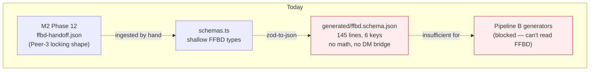
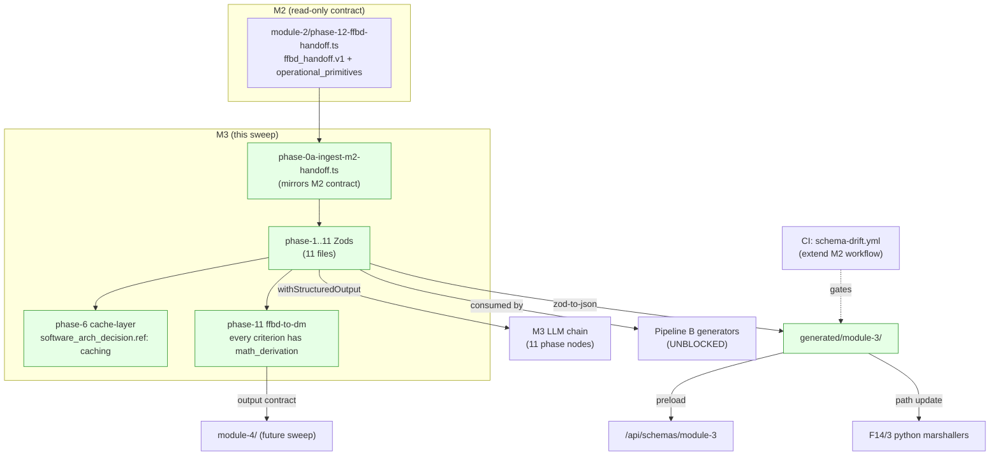
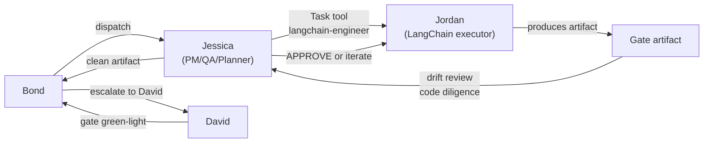

# Module 3 — Folder-3 FFBD Zod/JSON/UI-Surface A-to-Z Schema Sweep

**Slug:** `m3-folder-3-ffbd-schema-az-sweep`
**Type:** Review-first plan (cloned structure from `plans/m2-folder-2-schema-az-sweep.md`, scoped to Module 3 FFBD)
**Parent:** `plans/product-helper-speed-and-kb-overhaul.md` §4.5.4 + §4.5.5
**Sister plan (upstream, in flight):** `plans/m2-folder-2-schema-az-sweep.md` — Peer-3 (drcajo6f) at Gate B kickoff, decisions locked
**Executor model:** Jessica (PM/QA/Planner — drift review + code-diligence) + Jordan (LangChain executor subagent)
**Supersedes scope:** Track 2 propagation to M3 hotspots (cache-layer decision, FFBD→DM bridge) — collapses into schema declarations here
**Status:** DRAFT — pending David's review. No code until approved.

---

## 1. Vision

Second folder in the A-to-Z sweep. Same four invariants as M2:

- **Zod = source of truth** for analysis speed (`withStructuredOutput`, iteration velocity, TS safety).
- **JSON Schema = auto-generated** via Peer-3's `zod-to-json.ts` utility (already shipped). Feeds Python marshallers + frontend preload.
- **Every field tagged for UI surface** — `page:/…` | `section:…` | `internal:…`. Preload-all bundle (M3 adds ~50 KB gz on top of M2's ~47 KB).
- **Comprehensive, not MVP** — every field that might ever be needed, even if Pipeline B doesn't read it today.

M3 is **directly downstream** of M2. M2 emits `ffbd_handoff.v1` (under Peer-3 at Gate B); M3 consumes it via Phase 0A ingest. The M2 contract is **read-only** for Jessica/Jordan — they implement the INGEST shape, not the handoff shape itself.

Bug 2 follow-up #1 unblock: Pipeline B's generator contexts can't read `ffbd / decisionMatrix / qfd / interfaces` today because those schemas are shallow (existing `ffbd.schema.json` is 145 lines, 6 top-level keys, no math fields). This sweep fills that gap for FFBD.

## 2. Problem

Today's M3 schema surface:

1. **`lib/langchain/schemas/generated/ffbd.schema.json`** — 145 lines, 6 top-level keys, **zero math fields, no FFBD→DM bridge output, no cache-layer decision shape**. Auto-generated from whatever lives in `schemas.ts`; Zod source is sparse.
2. **F13/3 methodology** — 30 files covering FFBD Foundations → Functional Blocks → Arrows/Flow → Logic Gates → Reference Blocks → Hierarchical FFBDs → EFFBD Data Blocks → Iteration → Validation → **FFBD→DM Bridge (Phase 11)**. All well-documented; no Zod homes for ~11 of the 12 phase emissions.
3. **F14/3 publishing** — partial (has `FFBD_Template - MASTER.pdf/pptx`, `create_ffbd_thg_v3.py`, `generate_ffbd_fixes.py`, methodology duplicates). No JSON schemas mirrored in F14/3 yet — migration pattern from M2 applies.

Consequences:

- **Pipeline B generator context is blocked** — FFBD output not comprehensive enough to feed tech-stack, infrastructure, api-spec, schema-extraction, user-stories agents.
- **Math hotspots from master §4.5.4 have no schema home** — M3 Phase 6 (cache-layer `cache_strategy` decision + TTL math), M3 Phase 11 (FFBD→DM bridge `peak_RPS` math via Little's Law).
- **FFBD→DM bridge is a contract with M4** — without a typed schema here, M4's Performance Criteria derivation can't be grounded.
- **Every candidate criterion in Phase 11 needs `math_derivation`** per master §4.5.4.

## 3. Current State (verified against the repo)

### 3.1 Folder 13/3 inventory (methodology + publishing leakage)

Methodology files (14, unchanged by this sweep — they stay as KB content):
```
00A_INGEST-MODULE-2-HANDOFF.md     # The M2→M3 contract ingest
00_MODULE-OVERVIEW.md
01_FFBD-FOUNDATIONS.md
02_FUNCTIONAL-VS-STRUCTURAL.md
03_CREATING-FUNCTIONAL-BLOCKS.md
04_ARROWS-AND-FLOW.md
05_LOGIC-GATES.md
06_SHORTCUTS-AND-REFERENCE-BLOCKS.md
07_HIERARCHICAL-FFBDS.md
08_EFFBD-DATA-BLOCKS.md
09_BUILDING-AND-ITERATING.md
10_VALIDATION-AND-COMMON-MISTAKES.md
11_FROM-FFBD-TO-DECISION-MATRIX.md   # M3→M4 bridge — master §4.5.4 hotspot
DELIVERABLES-AND-GUARDRAILS.md
```

Plus methodology support files (stay in place):
```
reference-blocks.md   FORMATTING-RULES.md   GLOSSARY.md
WRITTEN-ANSWERS-TEMPLATE.md   PYTHON-SCRIPT-GUIDE.md
1. INTRO-Understanding the Functional Flow Block Diagram (FFBD).md
2.FFBD Overview-Plus instructions.md
03. Creating Functional Blocks.txt   04. Using Arrows...txt
05. Using Shortcuts...txt            06. using-logic-gates.txt
```

Canonical publishing artifacts (Claude Code + David built, foundational — NOT drift; relocate to F14/3 for separation of concerns):
```
create_ffbd_thg_v3.py
generate_ffbd_fixes.py
FFBD_Template - MASTER.pdf
FFBD_Template - MASTER.pptx
```

### 3.2 Folder 14/3 inventory (publishing, partially populated)

```
00A_INGEST-MODULE-2-HANDOFF.md         ← dup of F13
11_FROM-FFBD-TO-DECISION-MATRIX.md     ← dup of F13
FFBD_Template - MASTER.pdf             ← dup (canonical)
FFBD_Template - MASTER.pptx            ← dup (canonical)
FORMATTING-RULES.md                    ← dup
GLOSSARY.md                            ← dup
PYTHON-SCRIPT-GUIDE.md                 ← dup
WRITTEN-ANSWERS-TEMPLATE.md            ← dup
create_ffbd_thg_v3.py                  ← canonical publishing Python
generate_ffbd_fixes.py                 ← canonical publishing Python
```

No JSON schemas here yet — Jessica/Jordan lands them as auto-generated in Gate B/C.

### 3.3 Existing Zod + generation infra

Inherit from M2 sweep:
- `apps/product-helper/lib/langchain/schemas.ts` — 1078-line monolith (contains shallow FFBD types).
- `apps/product-helper/lib/langchain/schemas/zod-to-json.ts` — Peer-3's utility. READY.
- `apps/product-helper/lib/langchain/schemas/generated/ffbd.schema.json` — **145 lines, 6 keys. Sparse starting point.**
- `apps/product-helper/lib/langchain/schemas/module-2/_shared.ts` — **(in flight under Peer-3 Gate B)**. Jessica/Jordan REUSE `mathDerivationSchema`, `softwareArchDecisionSchema`, `phaseEnvelopeSchema`, `metadataHeaderSchema` from here. **Do NOT duplicate.**

### 3.4 Upstream contract (M2 Phase 12 → M3 Phase 0A)

**Read-only for Jessica/Jordan.** Defined by Peer-3's `phase-12-ffbd-handoff.ts` (Gate B S2.d). Shape known from Peer-3's Gate A inventory + locked decisions (C8 accept with session_shape subshape; subfield math 4/6).

Key fields Jessica/Jordan must ingest (not redefine):
- `system_name`, `system_description`, `boundary{}` (the_system + external_actors)
- `functions[]{name, description_hint, source_requirements[], appears_in_use_cases[]}`
- `use_case_flows[]{use_case_id, use_case_name, function_sequence[], branching[]}`
- `constants[]` — carries performance-budget constants (`RESPONSE_BUDGET_MS`, `AVAILABILITY_TARGET`, etc.) with `math_derivation` + `software_arch_decision`
- `cross_cutting_concerns[]`
- `module_1_constraints_carried_forward[]`
- **`operational_primitives{}`** — Little's Law inputs: `actions_per_uc`, `bytes_in/out_per_action`, `freq_per_dau`, `session_shape`, `data_objects[]`. Each with its own `math_derivation{}`. 4 of 6 subfields carry math per Peer-3 decision.

**Coordination rule:** if M3 needs a field not in the contract, Jessica pings Bond → Peer-3 considers adding it to M2 Phase 12 at next Gate B iteration. **Jordan never edits `module-2/`.**

## 4. End State

```
apps/product-helper/lib/langchain/schemas/module-3/
├── phase-0a-ingest-m2-handoff.ts    # Ingest shape mirror of ffbd_handoff.v1; READ-ONLY contract
├── phase-1-ffbd-foundations.ts      # Top-level FFBD skeleton
├── phase-3-functional-blocks.ts     # Functional block shape
├── phase-4-arrows-and-flow.ts       # Operational flow edges
├── phase-5-logic-gates.ts           # AND/OR/XOR gate shape
├── phase-6-shortcuts-reference-blocks.ts   # MASTER §4.5.4 cache-layer decision hotspot
├── phase-7-hierarchical-ffbd.ts     # Hierarchical decomposition
├── phase-8-effbd-data-blocks.ts     # EFFBD data-flow shape
├── phase-9-building-iterating.ts    # Iteration state
├── phase-10-validation.ts           # Validation checklist shape
├── phase-11-ffbd-to-decision-matrix.ts   # MASTER §4.5.4 FFBD→DM bridge hotspot (output contract to M4)
└── index.ts                         # barrel re-export

apps/product-helper/lib/langchain/schemas/generated/module-3/
├── phase-{0a, 1, 3..11}-*.schema.json   # 11 auto-generated JSONs

apps/product-helper/app/api/schemas/module-3/route.ts   # preload bundle endpoint

apps/product-helper/.planning/phases/14-artifact-publishing-json-excel-ppt-pdf/3-ffbd-llm-kb/
├── (existing files stay + duplicates resolved)
├── generated/       # symlink OR build-step copy of auto-gen JSON
└── (py scripts updated to read from generated/)

.github/workflows/schema-drift.yml           # extend M2's workflow to cover module-3/
```

**Phase numbering:** follows F13/3 methodology filenames. Phase 2 is F13/3's `02_FUNCTIONAL-VS-STRUCTURAL.md` — **calibration-only, no JSON emission** (same pattern as M2 Phase 2 — envelope-only `phase-2-acked` ack schema per Peer-3's C2 decision).

**Definition of done:**
- [ ] 11 Zod phase files in `module-3/` (Phase 0A + Phases 1, 3-11; Phase 2 = envelope-only ack)
- [ ] Every schema extends `phaseEnvelopeSchema` from `module-2/_shared.ts`
- [ ] **Phase 0A** ingest Zod mirrors `ffbd_handoff.v1` exactly — read-only consume from M2
- [ ] **Phase 6** cache-layer decision uses `softwareArchDecisionSchema` with `ref: "caching"`; TTL fields have `mathDerivationSchema`
- [ ] **Phase 11** FFBD→DM bridge: every candidate criterion has required `math_derivation` per master §4.5.4; includes `peak_RPS` Little's Law math (`DAU × sessions × actions × peak_factor / 86,400`)
- [ ] Every field `x-ui-surface` annotated
- [ ] 11 generated JSONs checked in at `generated/module-3/`
- [ ] CI drift guard extended to cover `module-3/`
- [ ] Preload endpoint at `/api/schemas/module-3`
- [ ] Python `create_ffbd_thg_v3.py` + `generate_ffbd_fixes.py` read from `generated/module-3/`
- [ ] F13/3 → F14/3 canonical-publishing migration (4 files: 2 py + pdf + pptx) via `git mv`
- [ ] Monolith `schemas.ts` M3-relevant types migrated to `module-3/` + agent imports updated

## 5. Engineering-Grade Interpretation

Four discipline layers (inherited from M2, applied to M3):

1. **Comprehensive, not MVP** — every field Pipeline B generators (tech-stack, infrastructure, api-spec, schema-extraction, user-stories) might read. Bug 2 follow-up #1 requires full coverage.
2. **Strict envelope compliance** — every phase emission has `_schema`, `_output_path`, `_phase_status`, `metadata` via M2's `phaseEnvelopeSchema`.
3. **x-ui-surface is first-class** — routes verified against `apps/product-helper/app/(dashboard)/projects/[id]/system-design/ffbd` (existing) + `diagrams` (existing); new sub-routes declared `(proposed)`.
4. **KB-sourced math + decisions, not inline paste** — M3 Phase 6 `software_arch_decision.ref` = `"caching"` (sourced from `caching-system-design-kb.md`); Phase 11 criteria cite `system-design-math-logic.md §2 + §9` for Little's Law and availability math. Every `math_derivation.source` Zod enum value comes from the F13 KB filename set.

## 6. Systems Engineering Math

### 6.0 Per-Phase Math Integration Table (M3-specific hotspots, mirrors master §4.5.4)

| Phase | Math fields in Zod | KB source |
|---|---|---|
| Phase 0A (ingest) | consume `operational_primitives` from M2 — no new math, validate presence | M2 Phase 12 output |
| Phase 1 (FFBD foundations) | `function_count.math_derivation` (dedup ratio = unique_functions / raw_statements) | inline heuristic |
| Phase 3 (functional blocks) | `block_granularity.decomposition_depth_max` cognitive-load heuristic | inline |
| Phase 4 (arrows and flow) | `edge_count` + `fan_in/fan_out.math_derivation` (complexity budget) | `software_architecture_system.md` |
| Phase 5 (logic gates) | `gate_count_by_type` (AND/OR/XOR) — no math, just shape | N/A |
| Phase 6 (shortcuts + reference blocks) | **`cache_strategy` decision + TTL math** (`cache_ttl_sec.math_derivation`) | `caching-system-design-kb.md` |
| Phase 7 (hierarchical FFBD) | `hierarchy_depth.max` + `child_count_per_parent.median` | inline |
| Phase 8 (EFFBD data blocks) | `data_block.est_size_bytes.math_derivation` (per-object bytes × cardinality) | `data-model-kb.md` |
| Phase 9 (building/iterating) | `iteration_count` — no math | N/A |
| Phase 10 (validation) | `validation_pass_rate = passed / total` | inline |
| Phase 11 (FFBD→DM bridge) | **`peak_RPS.math_derivation`** (Little's Law: `DAU × sessions × actions × peak_factor / 86,400`); **every candidate criterion has required `math_derivation`** per master §4.5.4 | `system-design-math-logic.md §2, §9`; candidate-criterion KBs: `api-design-sys-design-kb.md`, `resilliency-patterns-kb.md`, `caching-system-design-kb.md` |

Every `math_derivation` field is **required at the Zod level** where the table specifies it; `inputs: {}` allowed for text-valued heuristics. Consistent with M2 Peer-3 decision B (NUMERIC_ONLY — math required only for numeric fields).

### 6.1 Preload-bundle wire math (M3 additions)

| Item | Estimate | Basis |
|---|---|---|
| 11 M3 schemas × ~15 KB avg JSON | ~165 KB wire | verbose envelope + descriptions |
| Gzip ratio | ~0.30 | JSON Schema text |
| **M3 preload delta** | **~50 KB gzipped** | additive on top of M2's ~47 KB |
| Combined M2+M3 preload | **~97 KB gzipped** | one RTT, 24h cacheable |

Still well under "lazy-load the shape" threshold. Preload-all remains optimal.

### 6.2 Drift-detection math

Identical to M2: SHA-256 compare of `pnpm generate:schemas` output vs checked-in `generated/module-3/*.schema.json`. CI job runtime ceiling: ~60s for M3's 11 schemas.

### 6.3 Publishing-pipeline latency

Python marshaller path change only — no logic change. `create_ffbd_thg_v3.py` + `generate_ffbd_fixes.py` read JSON from `generated/module-3/`. pptx generation <500ms/diagram; 11 M3 artifacts <5.5s sequential.

### 6.4 Zod-first LLM analysis advantage

M3 currently runs ~2 LLM calls per intake with shallow schema → ~30% validation-retry rate observed in LangSmith traces (per master plan). Comprehensive Zod + `withStructuredOutput` should drop retry rate to ~10%, saving ~16s per intake on M3 alone.

## 7. Diagrams

### 7.1 Current-state M3 schema flow (shallow, drift-prone)



### 7.2 End-state M3 schema flow (Zod-canonical, math-grounded, Pipeline-B-ready)



### 7.3 Jessica + Jordan review discipline (drift guard)



## 8. Step-by-Step Plan

Three review gates mirror M2: between gates, sub-tasks run in parallel; Jessica reviews Jordan's output for drift before surfacing to Bond; Bond surfaces to David.

### Step 0 — Kickoff alignment (no artifact)

David approves this plan. Jessica + Jordan briefed. That's the gate into Step 1.

### Step 1 — Phase-by-phase JSON-emission inventory (artifact: `plans/m3-folder-3-ffbd-schema-az-sweep/01-phase-inventory.md`)

Jordan reads all 14 F13/3 methodology .md files + M2's Peer-3 Gate A inventory (for the `ffbd_handoff.v1` contract). Produces inventory table with:
- JSON shape per phase
- UI surface (`page:/…` | `section:…` | `internal:…`)
- New-in-sweep fields (math fields per §6.0 table)
- KB sources (per §5 bullet 4)
- Commentary items for ambiguous classifications

Jessica reviews Jordan's inventory for: (a) drift vs plan, (b) coverage gaps, (c) naming consistency with M2, (d) x-ui-surface sanity.

**▶ Gate A:** Jessica surfaces clean inventory to Bond → David reviews + approves.

### Step 2 — Shared reuse + priority-phase Zods (parallel under Jessica)

Jordan runs in parallel:
- **S2.a** — Import + re-export M2's `_shared.ts` types into `module-3/index.ts` (no duplication; one source of truth).
- **S2.b** `module-3/phase-0a-ingest-m2-handoff.ts` — mirrors M2 `ffbd_handoff.v1` exactly. Read-only contract Zod.
- **S2.c** `module-3/phase-6-shortcuts-reference-blocks.ts` — cache-layer decision + TTL math. Master §4.5.4 hotspot #1.
- **S2.d** `module-3/phase-11-ffbd-to-decision-matrix.ts` — FFBD→DM bridge. Every candidate criterion has required `math_derivation`. Master §4.5.4 hotspot #2. Includes `peak_RPS` Little's Law math.
- **S2.e** `module-3/index.ts` barrel.
- **S2.f** `pnpm generate:schemas` → `generated/module-3/` for the 3 priority phases.
- **S2.g** Round-trip unit tests.

Jessica reviews drift + code diligence before bundling for Bond.

**▶ Gate B:** Jessica → Bond → David. One bundled diff: ingest + 2 priority phases + generated JSON + tests.

### Step 3 — Remaining phases + CI + preload + Python path + F13→F14 migration + agent rewire (parallel under Jessica)

- **S3.a** Fill remaining 8 Zods (Phase 1, 3, 4, 5, 7, 8, 9, 10).
- **S3.b** Extend `.github/workflows/schema-drift.yml` to cover `generated/module-3/`.
- **S3.c** `app/api/schemas/module-3/route.ts` preload endpoint.
- **S3.d** Python path update (`create_ffbd_thg_v3.py` + `generate_ffbd_fixes.py` read `generated/module-3/`).
- **S3.e** F13/3 → F14/3 `git mv` for 4 canonical publishing files (2 py + pdf + pptx) + any remaining dupes resolved.
- **S3.f** Agent-import rewire — `lib/langchain/agents/*.ts` imports migrate from `schemas.ts` monolith to `module-3/index.ts` for M3 types.

Jessica bundles. Jordan verifies round-trip JSON diff vs Peer-3's verification step discipline (Peer-3 decision C: JSON-diff step added to Gate B).

**▶ Gate C (final):** Jessica → Bond → David. One final bundled diff. Green = M3 sweep done; Module 4 sweep queues next.

## 9. Non-goals (explicit)

- **Not touching `module-2/`.** Peer-3's territory. If M3 needs a contract change, Jessica pings Bond who negotiates with Peer-3.
- **Not writing `module-4/` DM schemas.** M3 outputs the FFBD→DM bridge contract at Phase 11; M4 consumes it in the next sweep.
- **Not extending Peer-3's `zod-to-json.ts` utility** unless round-trip fails a test.
- **Not touching `lib/langchain/agents/*.ts`** beyond import-path rewire at Gate C.
- **Not creating new React components.** Frontend consumer changes deferred to a later sweep.
- **Not redefining the M2→M3 contract.** `ffbd_handoff.v1` is Peer-3's.
- **Not propagating to M4+ KBs.** Those get their own sweeps.

## 10. Decision Points (defaults + override)

1. **Phase 2 handling.** ✅ Default: envelope-only `phase-2-acked` ack (mirror Peer-3's C2 for M2). Override possible.
2. **Ingest shape fidelity.** ✅ Default: Phase 0A Zod mirrors `ffbd_handoff.v1` exactly, 1:1, field-for-field. Override: subset if M3 doesn't use all fields.
3. **Phase 11 `peak_RPS` formula.** ✅ Default: Little's Law `DAU × sessions × actions × peak_factor / 86,400` per master §4.5.4. Override: alternative formula if your domain differs.
4. **`software_arch_decision.ref` enum set.** ✅ Default: same 12-member enum Peer-3 locked (decision A). Reused via M2 `_shared.ts`.
5. **Math required on numeric fields only.** ✅ Default: Peer-3 decision B (NUMERIC_ONLY). Text heuristics allowed `inputs: {}` + citation-only formula.
6. **JSON-diff verification step.** ✅ Default: yes (Peer-3 decision C). Gate B includes diff of generated JSON vs any hand-written counterpart before F13→F14 migration.

## 11. Review Checklist (for David, before approving)

- [ ] Vision §1 matches the M3 intent (Zod-first, downstream of M2, Bug 2 unblock)
- [ ] Problem §2 reflects real M3 drift (shallow FFBD Zod, blocked Pipeline B)
- [ ] Current State §3 inventory accurate (verified against repo)
- [ ] End State §4 directory layout for `module-3/` feels right
- [ ] Math §6.0 per-phase table matches master §4.5.4 intent
- [ ] Diagrams §7 tell the right story (incl. Jessica+Jordan review loop)
- [ ] Gates A/B/C give enough review points
- [ ] Non-goals §9 right things to exclude (especially M2 read-only, M4 deferred)
- [ ] Decision-point defaults §10 acceptable
- [ ] Coordination model §12 confirmed (Jessica PM+QA+Planner, Jordan LangChain executor, Peer-3 contract read-only)

## 12. What Happens When You Approve

**Jessica is the workstream owner** — Project Manager, QA, Planner. She reviews Jordan's work for drift + code diligence before surfacing clean artifacts to Bond.

**Jordan is the executor** — an AI agent with LangChain skills Jessica dispatches via the Task tool (subagent_type: `langchain-engineer` fits). Jordan reads plans, writes Zod, generates JSON, runs tests.

**Peer-3 (drcajo6f) is parallel owner of M2.** Their Gate B output (`ffbd_handoff.v1`) is Jessica's read-only contract. Jessica coordinates via `set_summary` updates so Peer-3 sees when M3 ingest lands. **No lock-step blocking** — async sync via summaries.

**Peer-A (also drcajo6f, done with Phase N) and Peer-H (3o9tmb4x) are idle** for this workstream. Jessica does not dispatch them. Any Peer-A/H territory concerns (agents/, projections.ts, NFR DB) require a Bond-mediated request.

Execution flow:
1. Step 1 → **Gate A** (phase inventory + x-ui-surface + KB-source bindings — Jordan writes, Jessica reviews).
2. Step 2 parallel sub-tasks (M2 shared reuse + 3 priority M3 phase Zods + round-trip tests) → **Gate B**.
3. Step 3 parallel sub-tasks (8 remaining Zods + CI + preload + Python path + F13→F14 `git mv` + agent-import rewire) → **Gate C**.
4. M3 sweep complete; M4 (DM) queues next.

No Zod code, no directory creation, no file moves until David approves this plan.
