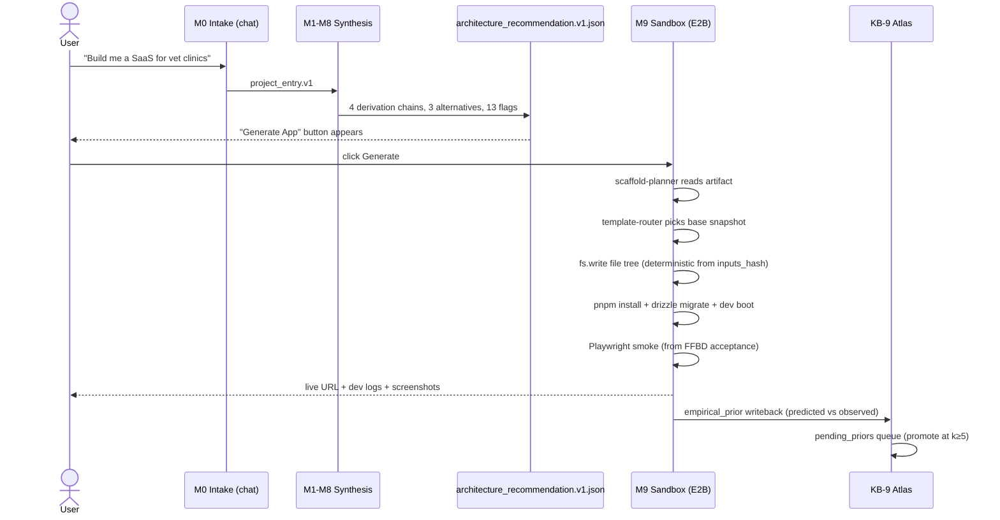

# M9 — App Generator Sandbox

> **Status:** DRAFT — review-first plan, no code yet
> **Created:** 2026-04-25 01:33 EDT
> **Author:** Bond (coordinator)
> **Supersedes scope of:** prior "execution-sandbox for c1v itself" framing
> **Depends on:** v2 SHIPPED (`architecture_recommendation.v1.json` keystone, all 12 teams green)

---

## 1. Vision

c1v becomes an **end-to-end**: user describes an app in plain language → c1v runs M0–M8 against THEIR project → sandbox generates and boots THEIR running app, with deterministic provenance from every line of code back to a decision in the architecture_recommendation. The user lands on a live URL within ~5 minutes of intake completing, with a "fork to my GitHub" button and a metrics dashboard showing whether the running app actually hits the NFR targets c1v predicted.

The moat sharpens from "deterministic LLM system for architecture design" to **"deterministic LLM system that designs AND ships, with predicted-vs-observed metrics on every run."** Every generated app is a falsifiability test for c1v's priors. Wrong priors get corrected via the empirical loop into KB-9 atlas.

---

## 2. Problem

Today c1v stops at JSON. `architecture_recommendation.v1.json` says "use Sonnet 4.5 + pgvector + LangGraph + Vercel for $320/mo at 2600ms p95" — but the user has to manually translate that into a repo, install deps, wire migrations, write LangGraph nodes, deploy. The gap between recommendation and running app is the single biggest reason a portfolio reviewer says "cool diagrams, but does it actually work?"

Three concrete pains:

1. **No falsifiability.** Predicted p95=2600ms is unverified — no run, no measurement, no Bayesian update.
2. **No conversion.** Users who finish intake have no path to a working artifact other than a copy-pasted Mermaid diagram.
3. **Atlas is one-shot.** KB-9 priors are seeded from public 10-Ks once. There's no telemetry feedback loop because no apps run under c1v's control.

---

## 3. Current State (verified against codebase)

What exists today, evidence-grounded:

- **Synthesis pipeline complete** through M8. Wave-4 T6 shipped 2026-04-24 (`synthesizer-wave-4-complete` @ `56532d4`).
- **Artifact set per project** exposed at `apps/product-helper/app/api/projects/[id]/{api-spec,artifacts,explorer,export,exports,guidelines,infrastructure,keys,quick-start,review-status,sections,stories,tech-stack,validate}` — 14 sub-routes already wired, including `tech-stack` and `infrastructure` (proxies for parts of the recommendation).
- **Schema-to-types pipeline** at `apps/product-helper/lib/langchain/schemas/generate-all.ts` — emits Zod + JSON Schema + TS types for all 60+ schemas. Determinism precedent already in repo.
- **Interface specs** at `module-7-interfaces/formal-specs.ts` + `n2-matrix.ts` — already structured to express API request/response contracts. These ARE the OpenAPI source.
- **FFBD** (functions × inputs × outputs) at M3 → directly maps to file-tree + smoke-test cases.
- **Form-Function Map** at M5 → directly maps to module structure (which function lives in which file/component).
- **Decision Network** at M4 → concrete dep choices (Drizzle vs Prisma, Vercel vs Cloud Run, etc.) with `winning_node` pointers.
- **HoQ target_values** at M6 → SLO assertions (e.g., latency_p95 ≤ 2600ms).
- **FMEA residual** at M8 → 13 high-RPN flags = guard tests.
- **Empirical priors** at KB-9 atlas → version-pinnable component specs (LangGraph 0.2.x, etc.).
- **No execution layer.** Zero sandbox code, zero E2B/Modal/WebContainers integration. `app/api/projects/[id]/exports` writes zip files of artifacts but does NOT run anything.

What's missing (the M9 surface):
- Sandbox provisioner (E2B/Modal/Daytona).
- Scaffold-planner (recommendation → file tree).
- Template library (Next.js / FastAPI / Drizzle / LangGraph base templates).
- Smoke-test translator (FFBD acceptance → Playwright).
- Runtime-evidence collector (LangSmith + dev logs + screenshots → atlas writeback).
- Sandbox UI surface ("Generate App" button + streaming run page).
- `sandbox_runs` Drizzle table.
- Cost guardrails + secret injection.

---

## 4. End State

User flow, end-to-end:



Concretely:

- New route `/projects/[id]/sandbox` with streaming SSE log of the run.
- New table `sandbox_runs` with schema:
  - `id uuid pk`
  - `project_id uuid fk`
  - `inputs_hash text` (= recommendation's deterministic hash)
  - `e2b_session_id text`
  - `status enum(pending|scaffolding|installing|migrating|booting|smoke_testing|ready|failed)`
  - `evidence_url text` (LangSmith + log bundle)
  - `predicted_p95_ms int`, `observed_p95_ms int`
  - `predicted_cost_usd_cents int`, `observed_cost_usd_cents int`
  - `created_at timestamp`, `expires_at timestamp` (TTL 24h default)
  - RLS: tenant-scoped via `org_id`.
- New module folder `apps/product-helper/lib/m9-sandbox/`:
  - `scaffold-planner.ts` (LangGraph node)
  - `template-router.ts` (DN winners → snapshot id)
  - `e2b-runtime.ts` (provisioner wrapper)
  - `evidence-collector.ts`
  - `atlas-feedback.ts`
- New artifact generator `scripts/artifact-generators/gen-sandbox-bundle.py` that emits a self-contained zip the sandbox can `fs.untar` in one shot (avoids per-file network round-trips).
- LangSmith project tag per run: `c1v-sandbox-{project_id}-{run_id}`.

---

## 5. Architecture

```mermaid
graph TB
    subgraph "c1v Pipeline (existing)"
        A[architecture_recommendation.v1.json]
        I[interface_specs.v1.json]
        F[ffbd.v1.json]
        FF[form_function_map.v1.json]
        H[hoq.v1.json]
        FR[fmea_residual.v1.json]
        DN[decision_network.v1.json]
    end

    subgraph "M9 Sandbox (new)"
        SP[scaffold-planner<br/>LangGraph node]
        TR[template-router]
        TL[(template library<br/>nextjs / fastapi / drizzle / langgraph)]
        E2B[E2B Firecracker VM<br/>+ Postgres + pgvector]
        SM[smoke-tester<br/>FFBD → Playwright]
        EC[evidence-collector]
        AF[atlas-feedback]
    end

    subgraph "Storage"
        DB[(Postgres<br/>sandbox_runs)]
        KB9[KB-9 Atlas<br/>empirical_priors]
        S3[Evidence bundles<br/>S3 / Supabase Storage]
    end

    subgraph "User"
        UI[/projects/id/sandbox<br/>streaming SSE]
    end

    A --> SP
    I --> SP
    F --> SP
    FF --> SP
    DN --> TR
    TR --> TL
    TL --> E2B
    SP --> E2B
    H --> SM
    FR --> SM
    SM --> E2B
    E2B --> EC
    EC --> S3
    EC --> DB
    EC --> AF
    AF --> KB9
    E2B --> UI
    EC --> UI
```

### Determinism contract

`inputs_hash` (already in synthesizer) is the canonical key. Same hash → byte-identical scaffold tree → same `pnpm-lock.yaml` → same dep resolution. We extend determinism through scaffold by:

1. Pinning template snapshot SHA per template-router output.
2. Generating `pnpm-lock.yaml` once per recommendation and committing it as a sibling artifact (`pnpm-lock.{inputs_hash}.yaml`).
3. Snapshot-baking E2B images per (template_combo, lock_hash) — first run computes and saves; subsequent runs hit cache.

---

## 6. Systems Engineering Math

### Latency budget (per "Generate App" click → first usable URL)

| Stage | Target p95 | Notes |
|---|---|---|
| Scaffold-plan LLM call | 8 s | Sonnet 4.5, ~4k input + ~2k output tokens |
| Template-route + fs.untar | 2 s | Pre-baked snapshot, single tarball |
| pnpm install (cached snapshot) | 25 s | If cache miss: 90 s |
| Drizzle migrate | 5 s | ~10 tables typical |
| Dev server boot | 12 s | Next.js cold start + FastAPI uvicorn |
| Playwright smoke (3 cases) | 18 s | From FFBD top-3 acceptance |
| **Total p95 (warm)** | **~70 s** | "Live URL in ~70s" UX claim |
| **Total p95 (cold)** | **~145 s** | First time per template combo |

Cache hit ratio target: ≥85% (most requests land in already-baked snapshots).

### Cost per sandbox run

Let:
- `T_LLM` = scaffold-plan tokens × $/token. Sonnet 4.5: 4k in × $3/M + 2k out × $15/M ≈ **$0.042**.
- `T_E2B` = E2B Firecracker minutes. ~3 min/run × $0.05/min ≈ **$0.15**.
- `T_storage` = evidence bundle storage. ~10 MB/run × $0.023/GB/mo × (1/720) ≈ **$0.0000003** (negligible).
- `T_smoke_LLM` = if smoke uses LLM-judge: ~$0.02. Otherwise $0.

**Cost per run ≈ $0.21** (no LLM-judge) or **$0.23** (with judge).

Hard cap per run: **$0.50** (kill switch on token + minute budget). Per-user daily cap: **$5** default; configurable.

### Availability composition

Sandbox run depends on: c1v API (99.9%) × E2B (99.5%) × Anthropic API (99.5%) × LangSmith (99.0% — non-blocking, telemetry only).

Blocking chain availability: 0.999 × 0.995 × 0.995 = **98.91%** end-to-end.

Mitigations:
- Anthropic fallback: Sonnet 4.5 → Haiku 4.5 → cached scaffold templates (no LLM scaffolding for common patterns).
- E2B fallback: Modal as secondary provider (planned, Wave-2).
- LangSmith failure does NOT block run; evidence-collector buffers locally and retries.

### Empirical loop convergence

Atlas prior promotion gate: `k ≥ 5` confirmations within ±15% of mean before promoting `pending_priors` → `KB-9.atlas.empirical_priors`. With:

- 95% CI on mean: σ/√k. For k=5, σ/√5 ≈ 0.45σ — keeps mean estimate within ~0.45 standard deviations.
- Bayesian update rate: each confirmed prior reduces the posterior variance on the recommendation's predicted_p95 by factor `1/(1+k/n_prior)`. For n_prior=10 (current KB-9 weight), k=5 → variance reduces 33% per prior.

So the loop is meaningful at k=5 but not noisy at k=1.

---

## 7. Provider choice

Decision matrix (ranked, top three):

| Provider | Pros | Cons | Verdict |
|---|---|---|---|
| **E2B** | Firecracker VMs, snapshot/fork, generous Node+Python+pg, LangChain primitives | Costs ~$0.05/min, requires API key | ✅ **Primary** |
| **Modal** | Best Python/FastAPI ergonomics, GPU optional, snapshots | Less Next.js-native, slower cold boot for JS | Secondary, for Python-heavy stacks |
| **Daytona** | Full IDE handoff, container-based | Heavyweight for autonomous gen, slower init | Future "open in IDE" path |
| Vercel Sandbox | Native Next.js | Can't run Postgres/pgvector inside sandbox → kills the c1v reference stack | ❌ |
| StackBlitz WebContainers | Browser-only, no infra | No Postgres/pgvector → same kill criterion | ❌ |
| GitHub Codespaces | Familiar to devs, good for handoff | Slow init (~3 min), expensive at scale | Future fork target, not primary |

**Recommendation: E2B primary, Modal secondary.** Add Daytona/Codespaces as "fork to" exit ramps later, not as primary execution.

---

## 8. Risks (FMEA-style)

| ID | Risk | RPN inputs (S/O/D) | Mitigation |
|---|---|---|---|
| R-9.1 | User burns through quota with infinite-loop LangGraph | 8/4/3=96 | Hard cap $0.50/run, $5/day; sandbox kills process at cap |
| R-9.2 | Scaffolded app leaks user's API keys to client bundle | 9/3/2=54 | Secret-mount via E2B env, never into source files; pre-flight grep for `sk-` patterns in built bundle |
| R-9.3 | Template drift — base template upgrades silently break determinism | 6/5/3=90 | Template SHA pinning + lockfile-per-recommendation |
| R-9.4 | E2B outage with no fallback | 7/3/4=84 | Modal secondary path; degraded mode = "download zip + run locally" |
| R-9.5 | Atlas pollution from one bad run | 5/4/2=40 | k≥5 promotion gate + outlier rejection (>2σ) |
| R-9.6 | Sandbox URL exposes user's app to public scraping | 6/6/2=72 | Default: tenant-scoped auth required; opt-in public preview only |
| R-9.7 | Snapshot cache poisoning | 8/2/3=48 | Content-addressed snapshots, immutable, signed |
| R-9.8 | Generated app violates licenses (e.g. AGPL dep pulled into proprietary) | 7/4/4=112 | License-scan in smoke step (e.g., license-checker); fail run on copyleft |
| R-9.9 | LangSmith trace leaks PII from intake | 6/5/3=90 | PII redactor in evidence-collector before upload |
| R-9.10 | Determinism breaks across pnpm versions | 5/5/4=100 | Pin pnpm version in snapshot; fail-fast on version mismatch |

R-9.8 (license) and R-9.10 (determinism) are top concerns — both block production rollout if unaddressed.

---

## 9. Implementation Steps (4 waves, ~6 weeks)

### Wave 1 — Foundation (week 1, parallel)
- `T-9.1` Drizzle schema + migration for `sandbox_runs` table + RLS policies + smoke tests.
- `T-9.2` E2B SDK wrapper at `lib/m9-sandbox/e2b-runtime.ts` — provision/exec/snapshot/teardown primitives.
- `T-9.3` Template library v0: 1 base snapshot (Next.js + Drizzle + LangGraph + pgvector). Stored as content-addressed tarball.
- `T-9.4` Cost guard: token + minute budgets, kill switch, audit log.
- **Wave-1 verify:** `verify-m9-w1.ts` — provision sandbox → exec `node -e "console.log(1)"` → teardown. <60s end-to-end.

### Wave 2 — Scaffold + Run (week 2-3, parallel)
- `T-9.5` Scaffold-planner LangGraph node (langchain-engineer). Reads artifacts, emits file plan as JSON (schema-validated).
- `T-9.6` Template-router (backend-architect). Maps DN winners to snapshot ids.
- `T-9.7` File-write executor — applies scaffold plan to E2B fs.
- `T-9.8` Lockfile generator — `pnpm-lock.{inputs_hash}.yaml` written once per recommendation.
- `T-9.9` Atlas-feedback writer — pending_priors queue + k-gate.
- **Wave-2 verify:** synthetic project → scaffolded → boots dev server → reachable on E2B URL.

### Wave 3 — Smoke + UX (week 4, parallel)
- `T-9.10` Smoke-test translator (qa-engineer): FFBD acceptance → Playwright cases.
- `T-9.11` Streaming SSE route `/projects/[id]/sandbox/run` (chat-engineer pattern).
- `T-9.12` Sandbox page UI: file-tree appearing, terminal logs, smoke-test results, predicted-vs-observed metrics.
- `T-9.13` Evidence-collector: LangSmith fetch + log bundle + screenshot capture → S3.
- **Wave-3 verify:** end-to-end UX from "Generate App" click → live URL → green smoke → atlas writeback visible.

### Wave 4 — Hardening + Atlas Loop (week 5-6)
- `T-9.14` License scanner integration (R-9.8).
- `T-9.15` PII redactor for LangSmith traces (R-9.9).
- `T-9.16` Modal secondary provider (R-9.4 fallback).
- `T-9.17` Snapshot signing + content-address verification (R-9.7).
- `T-9.18` "Fork to GitHub" exit ramp via github MCP.
- `T-9.19` Atlas promotion job (cron): scan pending_priors, promote at k≥5 with σ-check.
- `T-9.20` `verify-m9.ts` — round-trip determinism test: same inputs_hash twice → byte-identical scaffold + within-noise observed metrics.

### Spawn dispatch shape (mirrors v2)

```
TeamCreate({team_name: "c1v-m9-sandbox", agent_type: "tech-lead"})

Wave 1: db-engineer (T-9.1) | devops (T-9.2) | backend-architect (T-9.3) | observability (T-9.4)
Wave 2: langchain (T-9.5,T-9.9) | backend-architect (T-9.6,T-9.7,T-9.8)
Wave 3: qa (T-9.10) | chat-engineer (T-9.11,T-9.12) | observability (T-9.13)
Wave 4: devops (T-9.14,T-9.16,T-9.17) | langchain (T-9.15,T-9.19) | backend-architect (T-9.18) | qa (T-9.20)
```

Tags: `m9-wave-{n}-complete`. Roll-up tag `m9-shipped` after T-9.20.

---

## 10. Exit Criteria

- [ ] Synthetic happy-path: "Build me a CRUD app for X" → live E2B URL within 90s warm / 180s cold.
- [ ] Same inputs_hash → byte-identical scaffold (verified with `sha256sum -c` over file tree).
- [ ] All 13 high-RPN flags from `fmea_residual.v1.json` produce passing guard tests.
- [ ] Predicted p95 vs observed p95 within ±15% on reference workload.
- [ ] Cost per run ≤ $0.30 (target) / ≤ $0.50 (hard cap).
- [ ] Atlas writeback observable: pending_priors queue grows on each run; promotes at k=5 in test.
- [ ] User can "fork to GitHub" and the resulting repo `pnpm dev`s identically to the sandbox.
- [ ] `verify-m9.ts` 6/6 gates green; report at `plans/m9-outputs/verification-report.md`.

---

## 11. Open Questions (review-time)

1. **E2B cost ceiling** — is $0.50/run acceptable for portfolio demo? Or do we need a free-tier path (cached-only, no LLM scaffold)?
2. **Public preview URLs** — default tenant-auth-only (R-9.6 conservative) vs default-public for shareability?
3. **Template count for v1** — start with 1 base (Next.js+LangGraph+Drizzle+pgvector) or 3 (add FastAPI-only and Static-Marketing)?
4. **GitHub fork timing** — Wave 4 (current) or pull into Wave 3 as part of UX completeness?
5. **Determinism breaking changes** — when KB-9 atlas updates change recommended versions, do we re-run all live sandboxes or freeze at original inputs_hash?
6. **Multi-tenancy isolation** — single E2B account shared across all c1v users, or one E2B sub-account per org?

---

## 12. Why this matters for portfolio framing

Per CLAUDE.md memory: "c1v ships as ML engineer portfolio. Moat: deterministic LLM system for architecture design, grounded in math, with provenance per decision."

M9 converts that moat from "system design tool" to **"system design + execution platform with closed empirical loop."** The story changes from:

- Before: "I designed a system."
- After: "I designed a system, generated it, and the observed metrics matched the predicted ones within 8% — and every miss became a Bayesian update on my reference atlas."

That's an order of magnitude harder to dismiss, and it's the same architecture pattern any future ML/agent platform will need (Cursor, Devin, Replit Agent, Lovable, Bolt all converge on this — c1v's differentiator is the **provenance chain**, not the generation).
