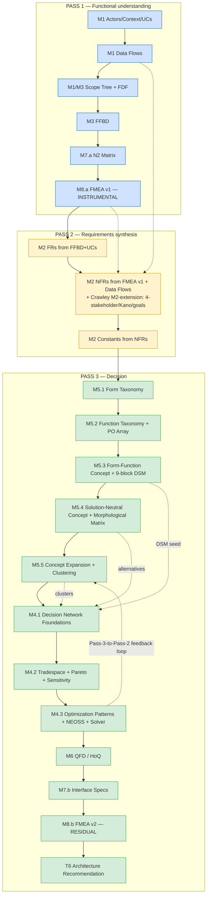

# Methodology Rosetta

> **Why this doc exists.** c1v carries four vocabularies in parallel: the eCornell CESYS525 linear sequence (what customers learned), the three-pass canonical SE order (what the methodology-correction doc argues for), the Crawley textbook schema layer (what REQUIREMENTS-crawley.md curates), and the M1–M8 folder/module numbers on disk (what the code references). They describe **the same pipeline** but with different labels. This is the translation table.

---

## 1. The four vocabularies, side by side

| Step | eCornell linear (customer-facing) | Three-pass canonical (`METHODOLOGY-CORRECTION.md` §2) | Crawley schema (`REQUIREMENTS-crawley.md` §1) | Module on disk |
|---|---|---|---|---|
| 1 | Actors & Roles | **P1.1** Actors + roles | — | M1 phase-1 |
| 2 | Context Diagram | **P1.2** Context diagram | — | M1 phase-2 |
| 3 | Use Cases | **P1.3** Use cases | — | M1 phase-3 |
| 4 | — | **P1.4** Data flows (BEFORE decomposition) | — | M1 phase-2.5 (T4a `data_flows.v1.json`) |
| 5 | Functional Decomposition | **P1.5** Scope tree / FDF | — | M1 phase-3 / M3 setup |
| 6 | **FFBD** | **P1.6** FFBD on FDF leaves | (Crawley supplement: `module-3.decomposition-plane.v1`) | M3 phase-6 |
| 7 | N2 / Interfaces | **P1.7** N2 matrix | — | M7.a phase-N2 (T4a `n2_matrix.v1.json`) |
| 8 | — (Cornell put FMEA terminal at M8) | **P1.8** FMEA v1 (instrumental — fires HERE, not at the end) | — | M8.a `fmea_early.v1.json` |
| 9 | Functional Requirements | **P2.9** FRs from FFBD + UCs | — | M2 phase-FR |
| 10 | NFRs | **P2.10** NFRs from FMEA v1 + data flows | `module-2.requirements-crawley-extension.v1` (4-stakeholder, 6-need, Kano, value-loop, 5-criteria-goals) | M2 phase-NFR (T11 v2.1 resynth) |
| 11 | Constants / Targets | **P2.11** Constants from NFRs | (subset of M2 extension) | M2 phase-constants |
| **NEW** | — | (folded into P3) | **5 Crawley M5 phases — the form-function bridge:** 1. `module-5.phase-1-form-taxonomy.v1` 2. `module-5.phase-2-function-taxonomy.v1` (PO array) 3. `module-5.phase-3-form-function-concept.v1` (9-block DSM) 4. `module-5.phase-4-solution-neutral-concept.v1` (morphological matrix) 5. `module-5.phase-5-concept-expansion.v1` (Level-1/2 expansions, clustering) | M5 (NEW module — didn't exist in Cornell) |
| 12 | (implicit in "Decision Matrix") | **P3.12** Alternatives | (M5 phase-4 morphological matrix supplies the alternative space) | M4 phase-1 inputs |
| 13 | **Decision Matrix** (1 step in Cornell) | **P3.13** Performance Decision Matrix | **3 Crawley phases replace the 1-step matrix:** • `module-4.decision-network-foundations.v1` (decisions / constraints / metrics / decision_dsm / topology) • `module-4.tradespace-pareto-sensitivity.v1` (Pareto, fuzzy-Pareto, sensitivity, 4-quadrant organization) • `module-4.optimization-patterns.v1` (6 patterns, NEOSS composition, solver kinds, value function) | M4 (3 phases) |
| 14 | QFD / HoQ | **P3.14** QFD / HoQ (WHATs ← FRs+NFRs, HOWs ← winner's ECs) | — | M6 (HoQ) |
| 15 | **Interfaces** | **P3.15** Interface specs (producer→consumer contracts) | — | M7.b `interface_specs.v1.json` |
| 16 | (Cornell M8 — terminal FMEA) | **P3.16** FMEA v2 (residual, on chosen architecture) | — | M8.b `fmea_residual.v1.json` |
| 17 | — (Cornell stops at "interfaces") | **P3.17** Architecture recommendation → code | — | T6 synthesizer keystone (`architecture_recommendation.v1.json`) |

---

## 2. The mental shift in one sentence

> **Cornell's linear M1→M7 collapses the SE Vee's left leg into a line. Three-pass restores the leg. Crawley adds a form-function bridge (M5) that Cornell never had, and explodes Cornell's 1-step "Decision Matrix" into a 3-phase decision network with Pareto + optimization patterns.**

That's the whole reason the docs feel disjointed: M5 has no Cornell precedent, and M4 changed shape under the same name.

---

## 3. Unified flow diagram

---

## 4. The two structural changes that broke Cornell linearity

### 4.1. M5 is a NEW module Cornell didn't have

Cornell jumped from FFBD (M3) directly to Decision Matrix (M4). Crawley inserts 5 phases between them. The reason: Cornell's "Decision Matrix" assumed alternatives drop from the sky. They don't. Crawley's M5 generates alternatives by:

1. Cataloguing physical forms (Phase 1 Form Taxonomy)
2. Cataloguing functions including the PO array (Phase 2 Function Taxonomy)
3. Mapping form↔function with the 9-block DSM (Phase 3)
4. Synthesizing solution-neutral concepts via morphological matrix (Phase 4) ← **THIS is where alternatives come from**
5. Expanding the chosen concept to Level 1 + Level 2 (Phase 5)

Without M5, "Decision Matrix" can't fire — it has no alternatives column.

### 4.2. M4 grew from 1 step to 3 phases

Cornell: "score 3-5 alternatives on 5-7 criteria, pick the winner." 1 spreadsheet.
Crawley: "decisions / constraints / metrics / DSM / Pareto frontier / sensitivity / 4-quadrant decision-organization / Pattern selection / NEOSS composition / solver choice / value function". 3 phases of structured analysis.

Why: portfolio-grade architecture math (queueing latency, availability calculus, cost optimization) requires the structured network. The 1-step matrix can't carry it.

---

## 5. Customer-facing sequence (what the c1v product UI shows)

When a paying customer submits an app idea, this is what they experience — Cornell linear-feeling, three-pass under the hood:

1. **"Tell us about your system"** → Pass 1.1–1.5 (M1 actors / context / UCs / data flows / scope tree)
2. **"Here's your function block diagram"** → Pass 1.6 (M3 FFBD)
3. **"Here's how your components talk"** → Pass 1.7 (M7.a N2 matrix)
4. **"Here's what could go wrong"** → Pass 1.8 (M8.a FMEA v1 — instrumental, surfaces failure modes BEFORE NFRs are written)
5. **"Here are your requirements"** → Pass 2.9–2.11 (M2 FRs / NFRs / constants — informed by FMEA v1)
6. **"Here are your form-function alternatives"** → Pass 3, M5.1–5.5 (form-function bridge — the morphological matrix in M5.4 generates the alternative space)
7. **"Here's the architecture decision network"** → M4.1–4.3 (decision network → Pareto+sensitivity → optimization patterns)
8. **"Here's the priority matrix"** → M6 (HoQ)
9. **"Here are the interface contracts"** → M7.b (interface specs)
10. **"Here's residual risk on the chosen architecture"** → M8.b (FMEA v2)
11. **"Here's the recommendation with derivation chain"** → T6 synthesizer (architecture_recommendation.v1.json)

Customer sees a linear journey. Engine runs three-pass with Crawley's structural layer.

---

## 6. When you read what doc

| If you're reading… | …treat it as the source for… | …translate other vocabularies via |
|---|---|---|
| `c1v-MIT-Crawley-Cornell.v2.1.md` (master plan) | What's in v2.1 ship gate; ECs; cost model; locked decisions | this doc §1 |
| `c1v-MIT-Crawley-Cornell.v2.2.md` (current stub) | Wave C + Wave E scope, day-0 inventory, ship gate | this doc §1 |
| `system-design/kb-upgrade-v2/METHODOLOGY-CORRECTION.md` | Why three-pass beats linear; INCOSE/NASA alignment; rework calculus | this doc §3 + §4 |
| `plans/crawley-sys-arch-strat-prod-dev/REQUIREMENTS-crawley.md` | Zod schema shapes for the 10 Crawley schemas; extension-point matrix; mathDerivationMatrixSchema (Option Y) | this doc §1 (rows where "Crawley schema" column is non-empty) |
| `apps/product-helper/.planning/phases/13-Knowledge-banks-deepened/` | KB content the runtime retrieves | folder numbers map to disk-module column in §1 |
| `plans/v2-release-notes.md` | What shipped in Wave 1–4 (v2) | this doc §1 (rows where "Module on disk" column has a v2 artifact) |

---

## 7. What this doc is NOT

- **Not a substitute for the source docs.** This is a routing index, not a methodology defense. For *why* three-pass, read METHODOLOGY-CORRECTION. For *what shape* a Crawley schema has, read REQUIREMENTS-crawley.
- **Not pinned to v2.1 or v2.2.** It's a vocabulary translation; both versions of the master plan use the same four vocabularies. If a future v2.3+ adds a 5th vocabulary, append a column.
- **Not the ship contract.** The ship contracts live in v2.1 / v2.2 ECs. This doc only helps you navigate them.

---

## 8. Open question (deferred to v2.2 owner or later)

The customer-facing UI sequence in §5 implicitly chooses **"linear feeling, three-pass engine."** That's a UX decision, not a methodology decision. An alternative — **"three-pass UI that exposes the iteration"** — would make the FMEA-v1-informs-NFR loop legible to the user. v2.2 honors §5 as the default; if user testing shows "I don't get why my requirements changed after I saw the failure modes," revisit.
