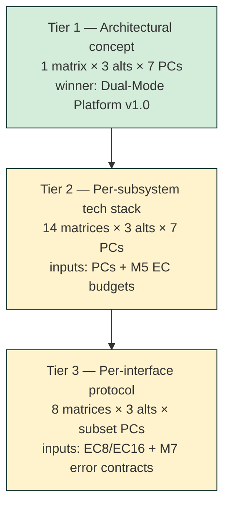

# Module 4 Decision Matrix — Execution Plan (APPROVED)

> Approved by David 2026-04-20 ~03:30 EDT after 5 rounds of refinement. See §12 Final Locked State. Executing 8-file bundle.

## 1. Vision

Build **one populated Decision Matrix** for c1v that compares **three candidate architectural alternatives** across **a weighted, normalized rubric of performance criteria**, produces a **defendable winner + runner-up** with sensitivity analysis, and emits a **QFD-ready handoff** to Module 5.

The matrix is the course-canonical artifact — Excel workbook + JSON schema + rendered PPT — not a bespoke format.

## 2. Problem

M3 handed us 11 candidate PCs and 4 candidate alternatives. The Cornell CESYS521 template caps at **3 options × 8 criteria**. M4 must:

1. **Cut 4 alternatives → 3** (template hard limit).
2. **Cut 11 PCs → 6–8** (template hard limit + "at least 6" KB rule).
3. **Score 3 alternatives × 8 criteria** without running benchmarks — use conservative estimates + document each assumption in column O (KB Step 2 rule).
4. **Promote Estimate→Final** for the ≤8 constants that drive the chosen PCs (the other 17 of the 25 surfaced constants stay Estimate until a later pass — see §7).
5. **Resolve the 3 non-constant decisions** from M2 (`UC-PRIORITY-01`, `SEMANTICS-V1-WRITEBACK`, `COMPLIANCE-V1-SCOPE`) — these are real blockers for M4 scoring.
6. Produce the course-required validation: **10% rule, sensitivity analysis, min/max rejection check**.

## 3. Current state

### M3 outputs (live at `system-design/module-3-ffbd/`)
- `decision_matrix_handoff.json` — the input: 7 top-level functions, 11 PCs, 4 ALTs (A/B/C/D), 5 open Qs, 11 perf budgets, 5 M1 constraints
- 6 sub-FFBDs (F.2–F.7) + top-level FFBD (JSON + Mermaid)
- `uncertainties.json`, `interfaces_list.json`, `validation_report.json`
- `WRITTEN-ANSWERS.md` (module narrative)

### M2 cross-cut still open
- `open_questions.json` — 25 below-threshold constants + 3 non-constant decisions
- M4 owns resolution of the **11 constants that drive the 11 PCs** (PC.1–PC.11). The remaining 14 constants (session TTL, rate limits, trace sampling, etc.) stay Estimate.

### M4 KB files consulted
- `LLM-FILL-INSTRUCTIONS.md` — authoritative JSON contract
- `01 - Creating an Objective Decision Matrix.md` — structural canon
- `15 - Building Your Decision Matrix Checklist.md` — the 8-step workflow
- `16 - Decision Matrix Template Instructions.md` — laptop worked example
- `17 - From Decision Matrix to QFD.md` — Module 5 handoff pattern
- `GLOSSARY.md` — term definitions
- `decision-matrix-template.schema.json` — Excel template cell-level contract
- `decision-matrix-template.xlsx` — source template (rows 22–29 criteria, row 30 totals, rows 35–41 scale block)

## 4. End state — deliverables

```
system-design/
└── module-4-decision-matrix/
    ├── alternatives_shortlist.json      # 3 ALTs + dropped-ALT rationale
    ├── criteria_selection.json          # 8 of 11 PCs + dropped-PC rationale
    ├── scale_rubrics.json               # 1–5 conditions for each Method-4 criterion
    ├── weights_pre_normalization.json   # 1–5 raw ratings BEFORE looking at scores
    ├── decision_matrix.json             # Populated against the KB schema (cell-exact)
    ├── normalization_trace.jsonl        # One row per cell: method + formula + inputs
    ├── rejection_check.json             # Min/Max disqualifier pass — which ALTs violate what
    ├── sensitivity_analysis.json        # ±20% per uncertain cell; winner-stable yes/no
    ├── final_interpretation.md          # Top score + 10% rule + weak criteria + recommendation
    ├── constants_promoted.json          # Estimate→Final promotions (only PC-driving constants)
    ├── non_constant_decisions_resolved.json  # UC-PRIORITY-01, SEMANTICS-V1-WRITEBACK, COMPLIANCE-V1-SCOPE
    ├── qfd_handoff.json                 # Handoff to Module 5 — ECs preview, PC carry-over
    ├── validation_report.json           # KB checklist pass/fail (15 items from §15)
    ├── diagrams/
    │   └── decision_matrix.pptx         # Stakeholder render (matches M2/M3 pptx pattern)
    └── renders/
        ├── decision_matrix_c1v.xlsx     # The populated Excel workbook (main artifact)
        └── decision_matrix_c1v.pdf      # Print-friendly render (optional)
```

### Quality bar
- **Excel workbook opens clean** in Excel/LibreOffice (no `#VALUE!` in row 30 totals — see §8 unused-row rule).
- **Weights sum to 1.00 ± 0.01** exactly.
- **Every normalized cell in [0.0, 1.0]**.
- **Every criterion has a documented measurement method** (Direct or Scaled with 1–5 rubric).
- **Every assumption in column O** — no silent estimates.
- **Sensitivity analysis actually run** — not skipped because the winner is "obvious."

## 5. Execution plan (KB-aligned 8-step workflow)

### Step 0 — Shortlist alternatives (4 → 3)
**Proposed cut:** drop **ALT.A (Single-LLM Anthropic-only)** → it violates the M1 hard constraint "Must operate across multiple LLM providers" and makes CC.R07 (LLM-provider fallback) impossible. The handoff already flags this as a hard-violation.

**Options A/B/C:**
- **Option A** = ALT.B — Multi-LLM with weighted routing (current c1v direction)
- **Option B** = ALT.C — Agent swarm (many small specialized models)
- **Option C** = ALT.D — Hybrid: Anthropic primary + local small models for traceback + RAG

Output: `alternatives_shortlist.json` with rejection rationale for ALT.A.

### Step 1 — Select 8 criteria from the 11 PCs
**Proposed cut:** Template caps at 8; M3 weight_hints give: 4 HIGH (PC.1/2/3/11) + 5 MEDIUM (PC.4/5/6/9/10) + 2 LOW (PC.7/8).

**Proposed 8:** all 4 HIGH + 4 MEDIUM (drop PC.7/8 LOWs + PC.9 to stay at 8).

| Chosen | PC ID | Name | Driving constant | Target |
|---|---|---|---|---|
| ✓ | PC.1 | Customer-System Non-Invasiveness | MAX_CUSTOMER_SYSTEM_OVERHEAD_PCT | ≤ 2% |
| ✓ | PC.2 | Feedback Loop Latency | RECOMMENDATION_CADENCE_MIN + AGGREGATION_WINDOW_MIN | ≤ 60 min |
| ✓ | PC.3 | Tech-Stack Traceback Coverage | TRACEBACK_COVERAGE_PCT (**Final**) | 100% |
| ✓ | PC.4 | Spec Generation Completion Time | SPEC_GENERATION_TIMEOUT_SEC | ≤ 300 s |
| ✓ | PC.5 | CLI Emission Latency | CLI_EMISSION_TIMEOUT_SEC | ≤ 60 s |
| ✓ | PC.6 | Founder Intake Responsiveness | FOUNDER_INTAKE_RESPONSE_BUDGET_MS | ≤ 2000 ms |
| ✓ | PC.10 | Compliance Evidence Export | EVIDENCE_EXPORT_FORMATS | 100% protected-action auditable |
| ✓ | PC.11 | Feature-Surfacing Precision | **TBD — new scale rubric in M4** | **TBD** |
| ✗ | PC.7 | Review Queue Load Time | REVIEW_QUEUE_LOAD_BUDGET_MS | dropped: LOW weight, reviewer UX only |
| ✗ | PC.8 | Spec Render Time | SPEC_RENDER_BUDGET_MS | dropped: LOW weight, reviewer UX only |
| ✗ | PC.9 | LLM Provider Fallback Success Rate | RATE_LIMIT_RPM | dropped: can't score without benchmark; belongs in M5 EC |

Output: `criteria_selection.json` with rationale per drop.

### Step 2 — Define measurement method per criterion
For each of the 8: Direct or Scaled (Method 4), specify units, Min/Max if truly binding.

**Proposed mix:**
- PC.1 Direct (%), smaller-is-better (Method 2), **Max = 2%** (M1-anchored hard reject).
- PC.2 Direct (minutes), smaller-is-better (Method 2), no Max.
- PC.3 Direct (%), larger-is-better (Method 1), **Min = 100%** (Final; anything <100% = auto-reject per M1).
- PC.4 Direct (seconds), smaller-is-better (Method 2).
- PC.5 Direct (seconds), smaller-is-better (Method 2).
- PC.6 Direct (ms), smaller-is-better (Method 2).
- PC.10 Scaled 1–5 (Method 4) — enum-to-ordinal rubric (all-4-frameworks=5, three=4, two=3, one=2, none=1).
- PC.11 Scaled 1–5 (Method 4) — feature-precision rubric based on PM valuation rate.

Output: `scale_rubrics.json` with 1–5 conditions for PC.10 and PC.11.

### Step 3 — Assign weights BEFORE looking at scores (KB anti-bias rule)
Proposed 1–5 rating per criterion, then normalize to sum=1:

| PC | Importance (1–5) | Raw | Normalized |
|---|---|---|---|
| PC.1 | 5 | 5 | 0.17 |
| PC.2 | 5 | 5 | 0.17 |
| PC.3 | 5 | 5 | 0.17 |
| PC.4 | 4 | 4 | 0.13 |
| PC.5 | 3 | 3 | 0.10 |
| PC.6 | 3 | 3 | 0.10 |
| PC.10 | 3 | 3 | 0.10 |
| PC.11 | 2 | 2 | 0.07 |
| **Σ** | | **30** | **1.01** (rounds to 1.00 with one cell adjusted by 0.01) |

Output: `weights_pre_normalization.json`. **Final rounding adjustment** lands on the lowest-weight criterion.

### Step 4 — Populate raw values (3 options × 8 criteria = 24 cells)
Source of truth per cell:
- **PC.1 / PC.2 / PC.3 / PC.4 / PC.5 / PC.6** — use the driving-constant value as the *target*; score each ALT by how well its architecture plausibly hits that target. Values are **engineering estimates with assumption in column O**, conservative per KB Step 2.
- **PC.10** — score 1–5 per `scale_rubrics.json` (each ALT's export coverage).
- **PC.11** — score 1–5 per `scale_rubrics.json` (each ALT's precision plausibility).

For each cell, I write:
- The raw value in native units.
- The assumption + source in column O.
- Never blank — "N/A" if truly unknown, flagged for normalization median.

Output rows into `decision_matrix.json` per KB schema (columns C/D/E).

### Step 5 — Apply Min/Max rejection check
- PC.1 Max 2% → any ALT exceeding 2% overhead = auto-reject.
- PC.3 Min 100% → any ALT losing traceback coverage = auto-reject.

If any ALT fails, its final score is irrelevant (KB Step 7 rule). Record in `rejection_check.json`.

### Step 6 — Normalize (24 cells → [0, 1])
Per the method chosen in Step 2. Record method + formula + clamp (if any) in `normalization_trace.jsonl` (one row per cell).

### Step 7 — Excel fill + workbook safety
Per `LLM-FILL-INSTRUCTIONS.md`:
- Write to A22:O29 bounded range.
- **Unused rows (if we end at 8 criteria exactly, none; if fewer, explicitly null L/M/N to prevent `#VALUE!` poisoning SUM).**
- Do NOT overwrite L/M/N (formulas).
- Scale block rows 33–41 for PC.10; extras go in `additional_scales` per LLM-FILL rule.

Output: `renders/decision_matrix_c1v.xlsx` (loaded from template, saved to new path per `write_guidance.preserve_template`).

### Step 8 — Interpretation
- Apply **10% rule** — runner-up within 10% of top is "in contention."
- **Sensitivity analysis** — vary each uncertain cell ±20%, check if winner flips. Record per-cell stability in `sensitivity_analysis.json`.
- Write `final_interpretation.md` — top score, runner-up, weak criteria, recommendation (or "further investigation needed" if sensitivity-brittle).

### Step 9 — Promote constants + resolve non-constant decisions
For each of the 8 PCs, finalize its driving constant based on what the matrix chose. Write `constants_promoted.json`.

Example: if all 3 ALTs score within ≤ 1% overhead, PC.1 target MAX_CUSTOMER_SYSTEM_OVERHEAD_PCT stays 2% as a hard ceiling. If all 3 hit ≤ 300 s intake, SPEC_GENERATION_TIMEOUT_SEC = 300 s Final.

Write `non_constant_decisions_resolved.json` for UC-PRIORITY-01 (confirm 6 UCs), SEMANTICS-V1-WRITEBACK (v1=read-only), COMPLIANCE-V1-SCOPE (all four frameworks) — **pending your answers; see §7 open Qs**.

### Step 10 — QFD handoff to Module 5
Per `17 - From Decision Matrix to QFD.md`, emit:
- Winning option as the c1v "system concept" the QFD will tune.
- 8 chosen PCs as QFD "front porch" input.
- Weights carry over unchanged.
- **Preview Engineering Characteristics (ECs)** — the design knobs — for Module 5 to score.

Output: `qfd_handoff.json`.

### Step 11 — Validation + diagrams
Run `validation_report.json` against KB Step 15 checklist (6+ criteria, weights sum, no blanks, normalized in [0,1], etc.). Pass all 15 or flag each failure explicitly.

Generate `diagrams/decision_matrix.pptx` matching M2/M3 pattern (stakeholder-facing deck).

## 6. Locked decisions I'm proposing (veto any by reply)

1. **Drop ALT.A** (single-LLM) — violates M1 hard constraint.
2. **Drop PC.7, PC.8, PC.9** — LOW weight or unmeasurable without benchmarks.
3. **Score PC.11 via a new 1–5 rubric** M4 defines (alternative: drop it — but it's the "proactive feature-surfacing" vision promise).
4. **Promote only the 8 PC-driving constants** in M4; leave the other 17 Estimate constants for a later finalization pass.
5. **Scoring uses conservative engineering estimates** with assumptions in column O — no benchmarks run in M4.
6. **Rejection rule is binary** — PC.1 > 2% or PC.3 < 100% = auto-reject, regardless of other scores.

## 7. Open questions (need your call before I start)

These are the genuine decision points — not permission asks:

1. **UC-PRIORITY-01** — Keep 6 UCBDs = UC01/03/04/06/08/11? (M3 recommendation: yes.)
2. **SEMANTICS-V1-WRITEBACK** — v1 = read-only? (M3 recommendation: yes, read-only.)
3. **COMPLIANCE-V1-SCOPE** — All four frameworks (SOC2 + HIPAA + GDPR + PCI-DSS) in v1, or narrow to SOC2 + HIPAA? This directly flips PC.10's target rubric + AUDIT_RETENTION_DAYS Final value.
4. **PC.11 rubric definition** — Proposal: 5 = "PM marks ≥80% of surfaced features valuable"; 4 = "60–79%"; 3 = "40–59%"; 2 = "20–39%"; 1 = "<20% or <5 features surfaced/cycle." Accept, tune, or drop PC.11?
5. **Best-case vs. worst-case scoring** — Question 5 from M3 handoff: "Should the Decision Matrix score alternatives by best-case or worst-case customer overhead?" Proposal: **worst-case** (conservative; protects the "non-invasive" promise).

## 8. Template safety — the `#VALUE!` trap

`decision-matrix-template.schema.json` explicitly warns: unused rows ship with space characters in H/I/J/K, causing `=H*K` in L/M/N to evaluate `#VALUE!`, which poisons the row-30 SUMs. With exactly 8 criteria we use all 8 rows (22–29) — no cleanup needed. **If we drop any criterion mid-execution**, the fill pipeline MUST explicitly null A, C–O on every unused row. Pipeline will enforce.

## 9. What not to do

- Don't introduce new PCs beyond the 11 from M3 handoff (round-trip to M3 required).
- Don't score before weights are locked (KB anti-bias rule).
- Don't touch `apps/product-helper/` code — M4 is pure deliverable authoring under `system-design/module-4-decision-matrix/`.
- Don't run actual benchmarks — estimates only, with notes in column O.
- Don't silently drop a PC because data is missing — flag and escalate.
- Don't finalize all 25 M2 Estimate constants — only the 8 PC-drivers. Rest wait.
- Don't attempt the QFD in M4. Module 5 owns the House of Quality (saw the sibling KB at `apps/product-helper/.planning/phases/14-.../5-implementing-qfd-method-kb/`... assumed but not verified — will confirm at QFD-handoff time).

## 10. Estimated scope

| Phase | Approx files written | Approx LLM work |
|---|---|---|
| Steps 0–3 (shortlist, criteria, weights) | 4 JSON | Shortest — decisions only |
| Step 4 (fill 24 raw cells with assumptions) | 1 JSON updated | Longest — per-cell reasoning |
| Steps 5–6 (rejection check, normalize) | 2 JSON | Mechanical |
| Step 7 (Excel fill via openpyxl) | 1 xlsx + 1 pdf | Template-write guard |
| Step 8 (interpretation + sensitivity) | 2 files | Per-cell ±20% analysis |
| Steps 9–10 (promotions, QFD handoff) | 3 JSON | Cross-module alignment |
| Step 11 (validation + pptx) | 2 files | Checklist + deck |

Total: **~16 output files** in `system-design/module-4-decision-matrix/`. Estimated 45–75 min of execution once you approve.

---

## 11. Trigger condition

**Waiting for:** your answers to §7 Open Questions (especially Q3 compliance scope and Q4 PC.11 rubric) + approval of §6 locked decisions.

**When you reply:** I execute Steps 0–11 in order. No TaskCreate, no writes, no agents dispatched until this plan is greenlit.

**Paths:**
- This plan: `.claude/plans/module-4-decision-matrix-execution.md`
- M3 handoff input: `system-design/module-3-ffbd/decision_matrix_handoff.json`
- M4 KB root: `apps/product-helper/.planning/phases/14-artifact-publishing-json-excel-ppt-pdf/4-assess-software-performance-kb/`
- M4 output target: `system-design/module-4-decision-matrix/`

---

## 12. FINAL LOCKED STATE (2026-04-20 ~03:30 EDT) — supersedes §4–§7

After 5 rounds of David review, the plan above was materially reshaped. This section is the canonical source of truth for execution. §4–§7 are history.

### 12.1 Alternatives — reframed around customer-chosen deployment mode

M3's A/B/C/D (LLM-architecture alternatives) were superseded by product-reality: c1v ships a customer-choice between privacy-preserving local inference and SOTA cloud inference.

| | Option | What it means | Default/recommended mode |
|---|---|---|---|
| A | **SOTA Cloud** | Claude on c1v infra. No local model. Best insights. | N/A (single mode) |
| B | **Privacy Local** | Local LLM on customer infra. Full data privacy. | N/A (single mode) |
| C | **Dual-Mode Platform** | Customer picks at onboarding. Both paths supported. | SOTA Cloud (recommended) |

### 12.2 Criteria — 6 total (PC.7/8/9/10/11 dropped)

| PC | Name | Raw | Weight | Method | Min/Max | Units |
|---|---|---:|---:|---|---|---|
| PC.1 | Customer-System Non-Invasiveness | 5 | 0.20 | M2 smaller-better | **Max 2 % (default mode only)** | % overhead |
| PC.2 | Feedback Loop Latency | 5 | 0.20 | M2 smaller-better | — | minutes |
| PC.3 | Tech-Stack Traceback Coverage | 5 | 0.20 | M1 larger-better | **Min 100 %** | % |
| PC.4 | Spec Generation Completion Time | 4 | 0.16 | M2 smaller-better | — | seconds |
| PC.5 | CLI Emission Latency | 3 | 0.12 | M2 smaller-better | — | seconds |
| PC.6 | Founder Intake Responsiveness | 3 | 0.12 | M2 smaller-better | — | ms |
| **Σ** | | **25** | **1.00** | | | |

Template rows 22–27 populated; rows 28–29 explicitly nulled per `#VALUE!` trap rule.

### 12.3 PC.1 scoring rule — dual-mode semantics

Max=2% applies **only to an option's default/recommended mode**. Privacy mode (Options B and C-privacy) is a customer opt-in with disclosed higher overhead — it does NOT trigger rejection. The worst-case/best-case scoring question from §7 Q5 is moot under this reframe.

**Per-option PC.1 scoring intent:**
- Option A (SOTA Cloud): default ≈ 1 % → passes cleanly, high score.
- Option B (Privacy Local): "default" = customer's only choice = local = 3–4 % → penalized on PC.1 but not auto-rejected (disclosed opt-in; still penalized naturally on PC.4/PC.6 since local LLMs are slower).
- Option C (Dual-Mode): default = SOTA Cloud ≈ 1 % → passes. Privacy path noted but not scored.

### 12.4 Non-constant decisions — finalized

| ID | Status |
|---|---|
| D1 UC-PRIORITY-01 | **Final**: Keep 6 UCBDs (UC01/03/04/06/08/11). |
| D2 SEMANTICS-V1-WRITEBACK | **Final**: v1 = read-only. |
| D3 COMPLIANCE-V1-SCOPE | **Final**: Compliance → v2. v1 operational audit logs only (90 d retention, for debugging/ops, not compliance evidence). |

### 12.5 Constants promoted to Final in M4

| Constant | Final value | Notes |
|---|---:|---|
| TRACEBACK_COVERAGE_PCT | 100 % | Already Final from M2 (PC.3 rejection). |
| MAX_CUSTOMER_SYSTEM_OVERHEAD_PCT | 2 % | PC.1 rejection threshold (default mode). |
| FOUNDER_INTAKE_RESPONSE_BUDGET_MS | 2000 ms | 1500 ms logged as stretch goal. |
| INTAKE_COMPLETENESS_THRESHOLD | 0.85 | No PC driver; simple approval. |
| SPEC_RENDER_BUDGET_MS | 1500 ms (Mermaid only) | PDF / Excel / MD renders deferred to v1.1+. |
| CLI_EMISSION_TIMEOUT_SEC | 60 s | Post-completion emission confirmed. |
| SPEC_GENERATION_TIMEOUT_SEC | 300 s | PC.4 target. |
| AUDIT_RETENTION_DAYS | **90 days** | Compliance→v2 cascade. Operational-only in v1 (was 2555). |

**Removed:** `EVIDENCE_EXPORT_FORMATS` (→ v2).

**Still Estimate (17):** C3 (SPEC_GENERATION_TIMEOUT_SEC redundant with above — see note below), C4, C8–C18, C20–C22. Future finalization pass.

### 12.6 Output bundle — 8 files (reduced from 16)

```
system-design/module-4-decision-matrix/
├── decision_matrix.json
├── scale_rubrics.json                # placeholder — no Method-4 criteria
├── sensitivity_analysis.json
├── final_report.md
├── qfd_handoff.json
├── validation_report.json
├── diagrams/decision_matrix.pptx
└── renders/decision_matrix_c1v.xlsx
```

Folded into `final_report.md`: alternatives rationale, criteria cuts, weight derivation, rejection check, 10% rule, constants promoted, non-constant decisions resolved.

Folded into `decision_matrix.json`: raw weights column, normalization methods, notes per cell.

Folded into `validation_report.json`: rejection check.

### 12.7 Execution order

Adapted Steps 0–11 from §5:
- **Step 0**: alternatives = {SOTA Cloud, Privacy Local, Dual-Mode Platform}.
- **Step 1**: 6 criteria. Rows 28–29 nulled in template.
- **Step 2**: no Method-4 criteria remain after PC.10/11 dropped. `scale_rubrics.json` ships as empty placeholder with documenting comment.
- **Step 3**: weights per 12.2.
- **Step 4**: **18 cells** (3 options × 6 criteria), each with assumption in column O.
- **Step 5**: PC.1 Max + PC.3 Min per 12.3.
- **Steps 6–11**: mechanical per §5.

### 12.8 Trigger state

**APPROVED.** Executing now. No further gates.

---

## 13. v1.1 patches — iterative learnings from M6 Interfaces + M7 FMEA (2026-04-20 04:55 EDT)

**Origin:** M6 Interface Matrix + M7 FMEA execution surfaced two classes of gap in the as-approved M4 (§12):

1. **Detectability blind spot.** M7 produced 5 failure modes with Detectability=5 (near-invisible), all citation-related — silent wrong-answers. Current PC.6 captures precision floors but not *detection cost*. M5 HoQ will systematically under-weight observability ECs (structured logging, distributed tracing, RUM) because no PC forces them up.
2. **Scope too high.** M4 v1.0 picks ONE architectural concept ("Dual-Mode Platform") but never scores the 10-20 implementation decisions that actually got made ad-hoc in `apps/product-helper/`: Next.js App Router vs Pages, LangGraph vs plain LangChain, Drizzle vs Prisma, pgvector vs Pinecone, SSE vs WebSocket, Anthropic SDK vs OpenRouter, Redis vs Supabase-native cache, Clerk vs custom JWT. **M4 should help make critical front-end/back-end decisions** now that M2 schema + M6 API contracts are upstream inputs — v1.0 doesn't.

### 13.1 Tier architecture — one matrix becomes 22



**Tier 2 — 14 subsystem matrices:**
| Subsystem | Decision | Alternatives |
|---|---|---|
| SS1 Web framework | Next.js App Router / Pages Router / Remix | 3 |
| SS2 Agent orchestrator | LangGraph / CrewAI / custom | 3 |
| SS3 LLM SDK | `@langchain/anthropic` / `@anthropic-ai/sdk` / OpenRouter | 3 |
| SS4 Provider fallback depth | single / dual / triple | 3 |
| SS5 Cache | Redis/Upstash / in-process / Supabase-native | 3 |
| SS6 DB ORM | Drizzle / Prisma / Kysely | 3 |
| SS7 Vector store | pgvector (Supabase) / Pinecone / Weaviate | 3 |
| SS8 Auth | custom JWT (jose) / Clerk / Auth.js | 3 |
| SS9 Billing | Stripe / Lemon Squeezy / Paddle | 3 |
| SS10 Pricing model | credit-based (current) / seat-based / usage-based | 3 |
| SS11 Email | Resend / Postmark / SES | 3 |
| SS12 Observability | Sentry+Pino / Datadog / Honeycomb | 3 |
| SS13 Diagrams | Mermaid / Excalidraw / D3 | 3 |
| SS14 Deployment | Vercel / Railway / Fly.io | 3 |

**Tier 3 — 8 interface matrices (from M6):**
| Interface | Decision | Alternatives |
|---|---|---|
| IF-02 Intake streaming | SSE / WebSocket / long-poll | 3 |
| IF-08 LLM provider call | Anthropic SDK / OpenRouter / LiteLLM | 3 |
| IF-10 Artifact export | sync REST / async queue / SSE progress | 3 |
| IF-12 MCP transport | JSON-RPC 2.0 (current) / gRPC / WS RPC | 3 |
| IF-14 Webhook delivery | inline retry / queue+DLQ / Inngest | 3 |
| IF-16 Vector retrieval | raw SQL cosine / pgvector HNSW / hybrid | 3 |
| IF-18 Credit deduction | optimistic (current) / pessimistic / saga | 3 |
| IF-20 Email delivery | immediate / queued rate-limited / batch | 3 |

### 13.2 New / split PCs and ECs

**PC.7 — Observability / Detectability (NEW)**
- **Unit:** composite {structured-log coverage %, trace sample rate %, RUM coverage %, detection-mode count per M7 failure mode with Detectability≥4}
- **Weight target:** 0.10 — re-balance from PC.6 0.12→0.08; PC.5 0.13→0.12; allocate 0.07 to PC.7. Rerun §12.2 weights.
- **minAcceptable:** ≥3 detection modes for any M7 failure mode with Detectability≥4
- **targetValue:** zero silent (Detectability=5) failure modes remaining after PC.7-driven mitigation
- **measurementMethod:** M7 FMEA Detectability column + `lib/observability/*` audit + trace-sample audit

**EC17 split — was "non-invasive + rotation"; becomes:**
- **EC17a — Scope enforcement.** Per-endpoint capability check; keys cannot exceed declared scope. Drives mitigations for M7 F.23, F.33.
- **EC17b — Rotation cadence.** Automated key rotation schedule with grace window. Drives mitigation for M7 F.32.

**EC19 — Provider redundancy depth (NEW)**
- Depth 1 (single) / 2 (primary + failover) / 3 (primary + warm secondary + tertiary for rate-limit storms). M7 already promoted `SS4_PROVIDER_FALLBACK_DEPTH` 2→3 without any QFD row forcing the tradeoff. EC19 surfaces cost ($/Mtok × depth) vs availability uplift explicitly.

### 13.3 Systems Engineering Math for v1.1

**LLM token / dollar cost for Tier 2+3 run:**
- 22 matrices × 3 alternatives × ~7 PCs avg = ~462 scoring cells + 22 recommendations
- Per matrix via `decision-matrix-agent.ts`: ~20k input (context + rubric) + ~8k output
- Total: 22 × 20k in + 22 × 8k out = 440k input + 176k output
- Sonnet 4.6 ($3/$15 per Mtok): **$1.32 + $2.64 ≈ $4.00**
- Opus 4.7 winner-validation pass only for top 5 closest calls: +$5-7
- **Budget: ~$10 total for v1.1 matrix set**

**Latency:**
- Serial: 22 × ~60s = ~22 min
- Parallel fan-out (3 concurrent agent dispatches): ~8 min p95. **Recommend parallel** — no cross-matrix dependencies.

**Payoff:** 22 locked decisions with defensible rationale replacing ~22 ad-hoc historical choices in `apps/product-helper/`. Unblocks `system-agent-builder-pivot.md §4`: decisions become programmatic artifacts consumable by future agent-builder runs.

### 13.4 Skills-agent 5-layer spec (matches `system-agent-builder-pivot.md §3.7.2`)

| Layer | Skill agent | Target |
|---|---|---|
| 1. KB | `product-manager` | `.planning/phases/13-Knowledge-banks-deepened/New-knowledge-banks/4-assess-software-performance-kb/` — author PC.7 rubric + EC17a/b + EC19 methodology pages; extend to cover tiered matrices |
| 2. Zod | `database-engineer` | `lib/langchain/schemas.ts:671-695` (`decisionMatrixSchema`) — add `tier: 1\|2\|3`, `parentDecisionId?`, extend `performanceCriterionSchema` for composite units (PC.7) |
| 3. Agent | `langchain-engineer` | `lib/langchain/agents/decision-matrix-agent.ts` — extend prompt to accept tier + parent context; consume M5 EC budgets + M7 error contracts as inputs |
| 4. Artifact | `data-viz-engineer` + `backend-architect` | `lib/diagrams/generators.ts` (tier hierarchy Mermaid); `.planning/phases/13.../4-assess-software-performance-kb/decision_matrix_from_json.py` (stacked tier reports in xlsx) |
| 5. Frontend | `ui-ux-engineer` | `components/system-design/decision-matrix-viewer.tsx` — add tier tabs (Tier 1 / Tier 2 by subsystem / Tier 3 by interface); parent↔child nav; PC.7 column |

### 13.5 Patch application order

1. **Author PC.7 / EC17a/b / EC19** into this §13 spec — **DONE (this section).**
2. **Layer 1+2 updates** (KB + Zod schema tier extension). Parallel `product-manager` + `database-engineer` dispatch. **~2 hr.**
3. **Tier-1 rerun** with PC.7 weight added — verify Dual-Mode Platform still wins. **~1 hr.**
4. **Tier-2 parallel fan-out** (14 subsystem matrices, 3 agents). **~8 min exec + ~2 hr review.**
5. **Tier-3 parallel fan-out** (8 interface matrices). **~5 min exec + ~1 hr review.**
6. **Forward propagation:** M5 HoQ spec picks up final PC/EC list from this §13; M7 FMEA re-run scoped to new EC17a/b/19 failure modes.

### 13.6 Open questions (need David's call before v1.1 starts)

1. **Lock PC.7 now, or after M5 drafts?** Recommend lock now — additive retrofit is painful mid-M5.
2. **Tier 2/3 rubric reuse.** Full 7 PCs or selected subset per matrix? Recommend subset (4 relevant PCs per matrix) — full rubric overkill for e.g., cache-provider choice.
3. **Tier 2/3 rollup into Tier 1.** Recommend no hard feedback — Tier 1 sets concept, Tier 2/3 fill implementation within that concept.
4. **Review cadence.** Auto-accept Tier 2/3 winners with ≥0.15 margin + no 10%-rule violation, manual review for closer calls? Recommend yes.

### 13.7 Resume point — M4 v1.1 pickup

**Done v1.0 (2026-04-20 ~03:30 EDT):** 1 tier-1 matrix × 3 alternatives × 6 PCs, winner Dual-Mode Platform. §12 LOCKED, FINAL.

**Start v1.1 here:**
1. Read §13 end-to-end
2. Answer §13.6 open questions (4 decisions)
3. Dispatch Layer 1+2 in parallel (KB authoring + schema tier extension)
4. Once merged: fan-out 14 tier-2 + 8 tier-3 via `decision-matrix-agent.ts` (~13 min wall time + ~$10 LLM spend)
5. Update M5 HoQ spec + M7 FMEA re-run scope with final PC/EC list

**Ties to existing plans:**
- `system-agent-builder-pivot.md §3.7.2` — same 5-layer skills-agent discipline
- `schema-mapping-analysis.md §8.5` — tier extension to `decision-matrix-viewer.tsx` is on the drift fix list (severity 🟡); v1.1 and drift fix can land together
- M5 HoQ plan (to be written) — must consume new PC.7 + EC17a/b + EC19 from this §13 before authoring
- M7 FMEA — re-run scoped to EC17a/b/19 failure modes after Tier 2 decisions land
