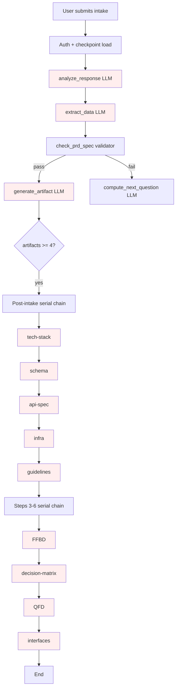
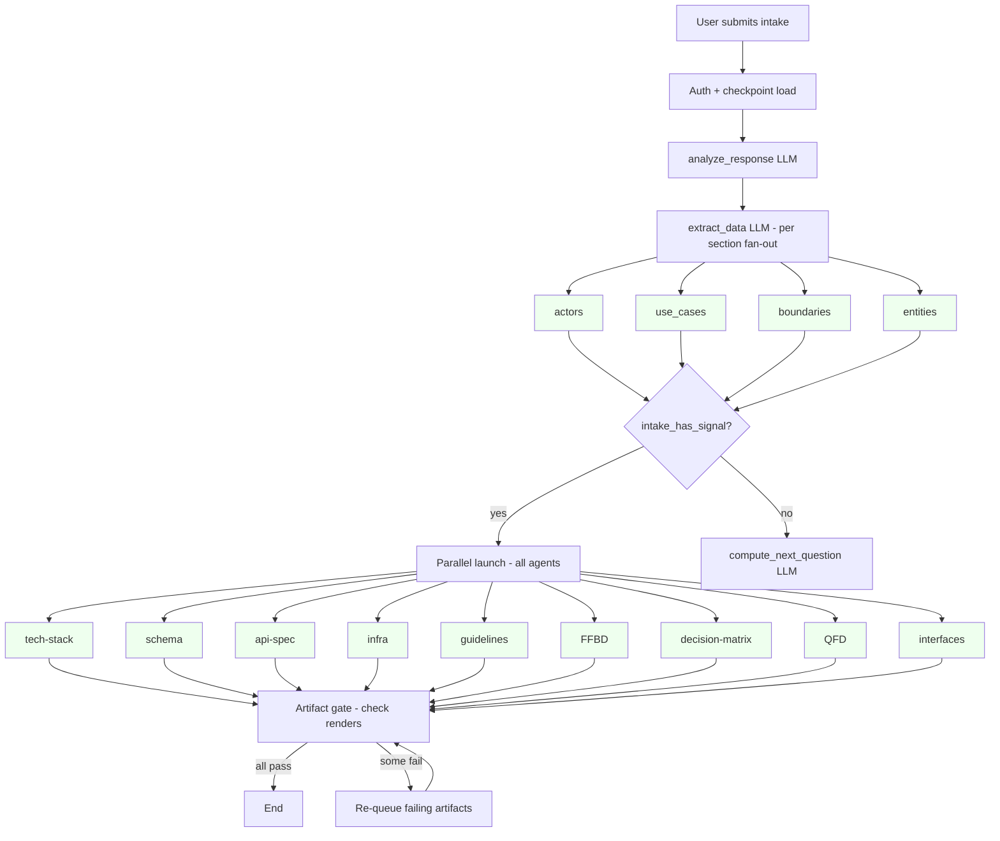
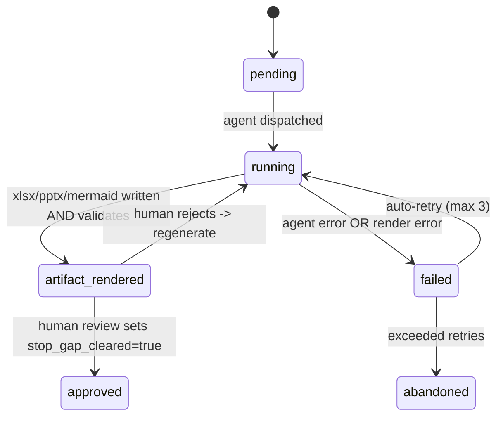
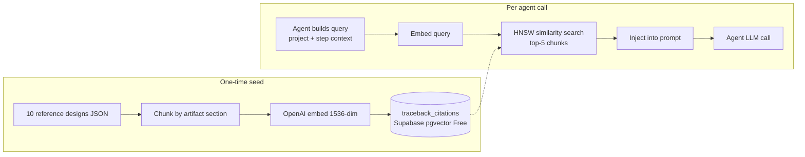

# Product-Helper: Speed to Real Uncertainty + Phase Gating + KB Overhaul

_Draft 2026-04-20. Covers five threads raised in conversation: (1) agent kick-off latency, (2) artifact-gated phases, (3) honest codebase map, (4) vector DB on Supabase Free, (5) KB premium reference seeding. Written per the plan-before-action contract — no code, no TaskCreate until this is reviewed._

---

## 1. Vision

Product-Helper should spend **as few seconds as possible** on getting the actors, use cases, system boundary and MORE time on the *real* uncertainty: the systems-engineering math that produces a defensible architecture recommendation. Today the pipeline burns latency on sequential `await` chains and unused infrastructure. The fix is:

- **Start agents in parallel** the moment intake has enough signal, not after a cascade of validations.
- **DO NOT Gate phases on artifact existence** (mermaid / pptx / xlsx rendered)
- **Use the vector DB that's already scaffolded** to retrieve premium reference designs (Netflix, WhatsApp, B2B SaaS) instead of injecting hardcoded prose.
- **Stop pretending Steps 3-6 are shipped** — they're skeleton code. Finish them honestly.

Success criterion: time from intake submission to first agent token streaming drops from ~8-12s to **< 3s**, and Steps 3-6 produce real artifacts (FFBD mermaid, decision matrix xlsx, QFD xlsx, interfaces pptx) that render in the UI.

---

## 2. Problem — Five Threads

| # | Thread | One-line statement |
|---|---|---|
| 1 | **Speed** | Agents wait for sequential `await`s on validation + extraction + artifact generation before the next agent can even see the state. |
| 2 | **Phase gating** | Graph edges decide "phase done".  Silent gaps get baked in. |
| 3 | **Codebase confusion** | You believe Steps 1-6 are implemented. They're not. Steps 1-2 are live; Steps 3-6 have agents + Zod schemas + graph nodes but no UI - NOT TRUE - SOME UI, no pptx/xlsx export BECAUSE I DIDN't WANT IT TO SLOW DOWN, and strict sequential routing. I want PPT creation as a seperate pipeline working in the backgroud.
| 4 | **Vector DB** | `0008_enable_pgvector.sql` + `0009_traceback_citations.sql` landed. Neither is read or written by any runtime code. Question "do I need Supabase Pro?" — answered: no. |
| 5 | **KB quality** | KB is hardcoded TypeScript prose in `lib/education/knowledge-bank.ts`. No premium reference designs. No retrieval. Agents cannot learn from examples. | WTF not the knoweldge banks I was talking about

---

## 3. Current State — Ground-Truth Codebase Map

_Compiled from read-only Explore pass on `apps/product-helper/` (2026-04-20). All citations are `file_path:line` ranges._

### 3.1 The 6-step methodology — what's actually shipped

| Step | Name | Route/UI | Agent | Artifact produced today |
|---|---|---|---|---|
| 1 | Problem Statement | `/api/chat/projects/[id]` + `components/projects/sections/problem-statement-section.tsx` | `extraction-agent.ts` | JSON in `projectData.problemStatement` |
| 2 | Requirements (actors, UCs, boundaries, entities, NFRs, goals, stories, scope) | Same route + 6 section components | `extraction-agent.ts`, `user-stories-agent.ts` | JSON + context / use-case / class mermaid diagrams |
| 3 | FFBD | **No UI section.** Agent + schema exist | `ffbd-agent.ts`, graph node `generate_ffbd` | JSON schema defined; generation wired but produces only JSON; **no pptx/xlsx** |
| 4 | Decision Matrix | **No UI section.** Agent + schema exist | `decision-matrix-agent.ts` | JSON only; no xlsx export; no sensitivity rendering |
| 5 | QFD (House of Quality) | **No UI section.** Agent + schema exist | `qfd-agent.ts` | JSON only; no roof correlation UI; no xlsx export |
| 6 | Interfaces (N2 matrix, DFD, interface specs) | **No UI section.** Agent + schema exist | `interfaces-agent.ts` | JSON only; no pptx export |

**Critical finding:** Steps 3-6 are skeleton code. The frontend display inventory in `plans/frontend-display-variables-inventory.md:116-132` lists "System Design - Decision Matrix", "FFBD", "QFD", "Interfaces" viewers — but the codebase map finds **zero section components** for these. They're aspirational rows in the inventory.

The plan is half right, half stale. Here's the ground truth per row:

What's correct ✅
Agents exist — ffbd-agent.ts, decision-matrix-agent.ts, qfd-agent.ts, interfaces-agent.ts — all 4 present
Schemas exist — schemas.ts:662,690,743,776 for each
Graph nodes wired — intake-graph.ts:376-379 adds generate_ffbd, generate_decision_matrix, generate_qfd, generate_interfaces and chains them (L412-427)
No pptx/xlsx export — pptxgenjs / exceljs / officegen are not in the dependency tree; no export buttons in any viewer
What's stale ❌ — UI sections DO exist
The plan says "No UI section" for all four. False. These shipped on Mar 28, 2026 (per the .handoff-504-timeout.md on disk):

Step	Viewer component	Mounted at
3 FFBD	ffbd-viewer.tsx:30	/system-design/ffbd/page.tsx:37
4 Decision Matrix	decision-matrix-viewer.tsx:12	/system-design/decision-matrix/page.tsx:38
5 QFD	qfd-viewer.tsx:34	/system-design/qfd/page.tsx:4
6 Interfaces	interfaces-viewer.tsx:177	/system-design/interfaces/page.tsx:38
They're HTML renderers of the JSON — tables, Mermaid diagrams, no xlsx/pptx.

What's worse than the plan suggests 🔴
An undocumented production blocker noted in .handoff-504-timeout.md:17-34:

Steps 3-6 nodes run sequentially in the graph
Total pipeline ~5 min, Vercel kills at 300s
QFD starts then times out → Interfaces node never fires in production
No export const maxDuration on api/chat/projects/[projectId]/route.ts (I grepped)
Fix requires fanning out after extract_data since all 4 read the same extraction result
Corrected table for your plan doc
#	Step	Status	What exists	What's missing
3	FFBD	UI shipped, backend times out in prod	Agent + schema + graph node + viewer page	pptx export; parallel execution; Vercel maxDuration
4	Decision Matrix	UI shipped, backend times out in prod	Agent + schema + graph node + viewer page	xlsx export; sensitivity analysis rendering; parallel execution
5	QFD	UI shipped, last node to succeed before 504	Agent + schema + graph node + viewer page	xlsx export; roof-correlation UI; parallel execution
6	Interfaces	UI exists, never reached in prod	Agent + schema + graph node + viewer page	pptx export; N2 rendering parity; parallel execution (this one is actually what unblocks it)
Bottom line: the plan's "no UI" claim predates the Mar 28 ship; the real gaps are (a) no spreadsheet/presentation exports, and (b) a 504 timeout bug that makes Step 6 a black hole in production. Want me to read the 4 viewers to see how much fidelity they actually have vs. the Cornell reference output?

### 3.2 Agent orchestration — where latency actually goes

Path from `user clicks send` → `first agent runs`:

```
POST /api/chat/projects/[id]/route.ts
  → langgraph-handler.ts:processWithLangGraph()
    → loadCheckpoint(projectId)            // 1 DB query, ~50ms
    → state.messages.push(new HumanMessage)
    → graph.invoke(state, { recursionLimit: 50 })
      → analyze_response node              // LLM call, ~1-2s
      → extract_data node                  // LLM call, ~2-4s
      → check_prd_spec node                // validation, ~50ms
      → routeAfterValidation:
          ├─ generate_artifact              // LLM call, ~2-3s
          ├─ compute_next_question          // LLM call, ~1-2s
          └─ END
```

**Total pre-first-artifact latency: ~5-9s** (sum of serial LLM calls).

Post-intake chain (langgraph-handler.ts:247-275) adds another block:

```
if (artifactCount >= 4) {
  const genSummary = await triggerPostIntakeGeneration(...);
  // Inside: sequential await on:
  //   tech-stack (2-3s) → schema (2-3s) → api-spec (2-3s)
  //   → infrastructure (2-3s) → guidelines (2-3s)
  // Total: ~10-15s serialized
}
```

And Steps 3-6 chain (intake-graph.ts:393-403):

```
generate_ffbd (3-5s) → generate_decision_matrix (3-5s)
  → generate_qfd (3-5s) → generate_interfaces (3-5s)
// Total: ~12-20s serialized
```

### 3.3 Phase gating — how phases actually advance

- Not artifact-driven. Graph edges (`addConditionalEdges` in intake-graph.ts:378-403) route on state-shape checks, not on "is the mermaid rendered." - NOT WHAT I MEANT - I want to get the main meat and potatoes of the platform as soon as possible which is the system design math 
- Intake "complete" = `generatedArtifacts.length >= 4` (langgraph-handler.ts:247). Content unchecked. 
- No pptx/xlsx generator exists anywhere — `grep` for `pptx`, `python-pptx`, `xlsx`, `exceljs`, `openpyxl` returns **zero hits**.

### 3.4 Knowledge base — how it's actually consumed

- Location: `lib/education/knowledge-bank.ts` (hardcoded TS) + `lib/education/reference-data/` (industry-patterns, system-design-examples, budget-stacks, influencer-data, context-inference).
- Consumption: `phaseToStep()` → `getEducationContext()` → `buildPromptEducationBlock()` → prepended to LLM prompts as markdown. **Not RAG.** No embedding query. No similarity search.
- Vector DB: `traceback_citations` table created by `0009_traceback_citations.sql` with HNSW index on 1536-dim vector column. **Zero writers, zero readers in the runtime.** Scaffold only.
- Premium reference designs: `system-design-examples.ts` exists but based on git size is small (< 50KB); contents are illustrative, not canonical Netflix-grade case studies.

### 3.5 Frontend display layer

13 section components under `components/projects/sections/`. Map:

```
problem-statement-section.tsx    → Step 1
actors-section.tsx               → Step 2 (partial)
scope-section.tsx                → Step 2 (partial)
goals-metrics-section.tsx        → Step 2 (partial)
nfr-section.tsx                  → Step 2 (partial)
user-stories-section.tsx         → Step 2 (partial)
system-overview-section.tsx      → Step 2 composite
architecture-section.tsx         → post-intake
schema-section.tsx               → post-intake
api-spec-section.tsx             → post-intake
infrastructure-section.tsx       → post-intake
guidelines-section.tsx           → post-intake
tech-stack-section.tsx           → post-intake
// NO sections for Steps 3-6 (FFBD/Decision Matrix/QFD/Interfaces)
- partially NOT TRUEE 
```

---

## 4. Systems Engineering Math

Anchoring on the framework in `system-design/system-design-math-logic.md` §2 (Little's Law chain) and §9 (formula reference card).

### 4.1 Latency budget — today vs target

**Today (measured from code paths above, no telemetry):**

| Phase | Serial duration | Parallelizable? |
|---|---|---|
| Auth + checkpoint load | ~100-300ms | No (one trip) |
| `analyze_response` | 1-2s | No (depends on message) |
| `extract_data` | 2-4s | **Yes** (per-section extract can fan out) |
| `check_prd_spec` | 50-100ms | No (but non-blocking possible) |
| `generate_artifact` (first) | 2-3s | **Yes** (3+ diagrams can render in parallel) |
| Post-intake chain (5 agents) | 10-15s | **Yes** (all 5 are independent) |
| Steps 3-6 chain | 12-20s | **Partial** (Step 3 feeds Step 6; 4 and 5 independent) |
| **Total intake → full spec** | **~27-44s serialized** | |

**Target (after parallelization):**

Under Amdahl's law with ~80% parallelizable fraction and 4-way concurrency:

```
T_parallel = T_serial × [ (1 - f) + f / n ]
           = 35s × [ 0.2 + 0.8/4 ]
           = 35s × 0.4
           = 14s
```

First-artifact appearance target: **< 3s** (auth + checkpoint + one LLM round-trip). Full spec: **< 15s**.

### 4.2 Throughput — concurrent intakes

Little's Law: `L = λ × W`.

- Current W (per-request duration) ≈ 30s
- Target W ≈ 14s (post-parallelization)
- Next.js API route on Vercel handles ≈ 100 concurrent connections per serverless instance
- At launch load (10 DAU, avg 1 intake/user/day), λ = 10/86,400 = 0.00012 req/s → L ≈ 0
- At 1,000 DAU with 20% peak factor: λ_peak = 1,000 × 0.2 × (1/86,400) × peak_factor_5 = 0.012 req/s → L ≈ 0.36 concurrent. **No scaling concern at this cohort size.**
- LLM provider rate limits (Anthropic: 4,000 RPM tier 2) become the ceiling before Vercel does.

### 4.3 Availability — inherited risk

Serial availability `A_sys = ∏ A_i`:

| Component | Assumed A | Contribution |
|---|---|---|
| Vercel | 99.99% | 52 min/yr down |
| Supabase (Free) | 99.9% | 8.76 hr/yr down |
| Anthropic API | 99.5% | ~44 hr/yr down |
| OpenAI embeddings (for KB retrieval) | 99.5% | ~44 hr/yr down |
| **Serial product** | **98.9%** | **~96 hr/yr down** |

**Mitigation targets (post-implementation):**
- Dual-LLM fallback (Claude primary, GPT secondary) → 99.9975% provider availability → net 99.87%.
- Cache embeddings locally so OpenAI outage degrades retrieval but doesn't block.
- Supabase Free has no uptime SLA — budget for this or move to Pro when paying customers arrive.

### 4.4 Cost — AI $ per intake

Using cost anchors in `system-design-math-logic.md` §10:

**Per full intake (Steps 1-6 + post-intake, serialized):**

```
~10 agent calls × ~8K input tokens × ~2K output tokens
Input: 10 × 8K = 80K tokens × $3/1M = $0.24  (Sonnet-class)
Output: 10 × 2K = 20K tokens × $15/1M = $0.30
Per-intake: ~$0.54
```

**Post-parallelization** (same token count, just concurrent): **same cost, 3× less wall time**.

**KB ingestion (one-time):**

```
Per reference design (Netflix-size: ~30K tokens chunked to ~200 embeddings):
  Embedding: 30K × $0.02/1M = $0.0006 per design
  10 premium designs × $0.0006 = $0.006 (negligible)
```

**KB retrieval per intake (per agent call, 1 query):**

```
Query embedding: 500 tokens × $0.02/1M = $0.00001
Retrieval: 5 chunks × 2K tokens = 10K additional input tokens
Extra LLM cost: 10K × $3/1M = $0.03 per agent call
If all 10 agents pull KB: +$0.30 per intake
```

**New per-intake cost with KB retrieval: ~$0.84.** At 1,000 DAU × 1 intake/day = **~$840/day = $25K/month**. Requires hard per-tenant rate limits before enabling paid tier.

---

## 5. End-State

### 5.1 Speed

- **Optimistic agent launch**: As soon as intake has `actors.length >= 1 && useCases.length >= 1`, all downstream agents (tech-stack, schema, api-spec, infrastructure, guidelines, FFBD, decision-matrix, QFD, interfaces) start in parallel `Promise.all`. They stream updates as they complete; user sees progressive fill.
- **Non-blocking validation**: `check_prd_spec` still runs but as a *flag* producer, not a gate. Agents launch regardless; validation warnings appear as badges on sections.
- **First-artifact TTFB**: < 3 seconds from submit.

### 5.2 Phase gating on real artifacts

- Each phase has exactly one primary artifact (mermaid / pptx / xlsx).
- Phase status: `pending | running | artifact_rendered | approved`.
- Transition to `artifact_rendered` requires the file to actually exist in the `artifacts` table *and* render without error.
- `stop_gap_cleared` boolean (from `plans/artifact-json-field-inventory.xlsx` row 6) gates human approval from `artifact_rendered` → `approved`.

| Step | Primary artifact | Secondary |
|---|---|---|
| 1 | Problem statement JSON | — |
| 2 | Context diagram (mermaid), UCBD (mermaid) | Use case table (xlsx) |
| 3 | FFBD (mermaid) | FFBD pptx summary |
| 4 | Decision matrix (xlsx, full sensitivity) | Decision matrix pptx |
| 5 | QFD House of Quality (xlsx, roof + imputed importance) | QFD pptx |
| 6 | N2 interface matrix (xlsx) | Interface specs pptx, DFD mermaid |

### 5.3 Vector DB wired up (no Pro plan)

- `pgvector` on Supabase Free holds KB embeddings.
- Ingestion pipeline: one-time seed of 10 premium reference designs; re-runnable on content update.
- Retrieval: each agent call embeds its contextual query (project data + step), pulls top-5 similar chunks, injects into prompt.
- Fallback: if retrieval fails, agent runs against hardcoded KB (current behavior). No hard dependency.

### 5.4 Premium reference KB

- 10 canonical system designs seeded, each filled out across **all 17 artifact schemas** from `METHODOLOGY-CORRECTION.md` Appendix A:
  - Consumer-scale: Netflix, WhatsApp, Instagram, Uber, Discord
  - B2B SaaS: Stripe, Shopify, Figma, Slack, Linear
- Each design stored as structured JSON (one row per artifact) + rendered markdown chunks for embedding.
- Embeddings live in `traceback_citations` with metadata: `{design_slug, artifact_type, step_number, source_url}`.

### 5.5 Codebase honesty

- Steps 3-6 get real UI sections built from the JSON already produced (xlsx + pptx renderers wired).
- No more "row exists in display inventory, section doesn't exist in code." The display inventory becomes the source of truth, enforced by a CI check that fails if an inventory row has no matching component.

---

## 6. Proposed Flow — Mermaid

### 6.1 Current (serial, ~30s)



### 6.2 Proposed (parallel, ~14s)



### 6.3 Artifact-gated phase state machine



### 6.4 KB retrieval pipeline



---

## 7. Steps

Phased so each phase is independently shippable. Each has a concrete exit criterion you can verify with a single command.

### Phase A — Fix the 504 (1-2 days, P0 production bug)

**Corrected scope after user review:** Steps 3-6 are NOT fully independent. The real dep graph is:

```
FFBD ──┬─→ Decision Matrix ─→ QFD
       └─→ Interfaces
```

- FFBD consumes `useCases + systemBoundaries` (extraction only) — root node
- Decision Matrix needs `nonFunctionalRequirements + ffbd` — depends on FFBD
- QFD needs `actors + decisionMatrix.criteria` — depends on DM
- Interfaces needs `ffbd + useCases` — depends on FFBD only, parallel with DM→QFD

Partial parallelization: FFBD serially → `[DM→QFD, Interfaces]` concurrently. Expected wall time: ~5 min serial → ~3 min (longest branch wins).

**Pipeline A (the one blowing timeout, inside LangGraph):**

1. Add `export const maxDuration = 600;` to `app/api/chat/projects/[projectId]/route.ts` — belt-and-suspenders, not a fix. Vercel Pro-Fluid caps at 300s by default; Pro-Advanced allows 800s. 600 gives headroom for partial-parallel runs.
2. Rewrite `intake-graph.ts:412-427` edges:
   ```ts
   // Fan out after FFBD to both branches concurrently
   .addEdge('generate_ffbd', 'generate_decision_matrix')
   .addEdge('generate_ffbd', 'generate_interfaces')
   // DM → QFD chain (sequential, needed)
   .addEdge('generate_decision_matrix', 'generate_qfd')
   // Both tails terminate
   .addEdge('generate_qfd', END)
   .addEdge('generate_interfaces', END)
   ```
   Remove `routeAfterFFBD`, `routeAfterDecisionMatrix`, `routeAfterQFD` routing unless they encode a condition other than "should Step N run" — if any are artifact-existence gates, drop per user directive ("do not gate on artifacts").
3. Verify `edges.ts:routeAfterArtifact` still gates entry into Step 3 (FFBD fires only after all 6 core KB artifacts land — this gate stays; it's an input-data gate, not an artifact-render gate).

**Pipeline B (already parallel, leave alone):**

`triggerPostIntakeGeneration` at `langgraph-handler.ts:504` already runs the 6 dev-spec agents via `Promise.allSettled` at `L1129-1146`. Fire-and-forget after stream closes. No timeout contribution. Do not touch in this phase.

**Exit criterion:** Production intake on a fresh project completes without 504; Step 6 (Interfaces) data present in `projectData.intakeState.extractedData.interfaces` after the chat turn. Measured wall time < 300s on p95.

### Phase B — Artifact-gated phase states (2-3 days)

1. Add `phase_status` enum column to `projects.projectData` per step: `pending | running | artifact_rendered | approved | failed | abandoned`.
2. Implement `validateArtifactRendered()` per step — checks the mermaid parses, the xlsx opens, the pptx opens.
3. Wire `stop_gap_cleared` UI checkbox per section (per `plans/artifact-json-field-inventory.xlsx` row 6 semantics).
4. Add the state machine from §6.3 as a reusable hook.
5. **Exit criterion**: deleting the mermaid from the `artifacts` table reverts phase to `running` on next load.

### Phase C — PPTX + XLSX renderers (3-4 days)

1. Add `pptxgenjs` (pure JS, works in Node runtime — avoids Python). Validate with Vercel's Node.js 22 runtime.
2. Add `exceljs` for xlsx.
3. Renderers per step:
   - Step 4 (decision matrix): PCs × alternatives table, weights column, sensitivity tab → xlsx.
   - Step 5 (QFD): HoQ matrix, roof correlation, imputed importance → xlsx.
   - Step 6 (interfaces): N2 matrix xlsx + interface-specs pptx.
   - Step 3 (FFBD): pptx slide summary in addition to mermaid.
4. Wire download endpoints: `GET /api/projects/[id]/artifacts/[type]/export`.
5. **Exit criterion**: each xlsx/pptx opens cleanly in Excel/PowerPoint with no warnings.

### Phase D — Frontend sections for Steps 3-6 (2-3 days)

1. Build four section components mirroring the pattern in `problem-statement-section.tsx`:
   - `ffbd-section.tsx` — mermaid viewer + download pptx.
   - `decision-matrix-section.tsx` — interactive table + sensitivity bar + download xlsx.
   - `qfd-section.tsx` — HoQ grid + roof visualization + download xlsx.
   - `interfaces-section.tsx` — N2 matrix + interface list + download pptx.
2. Add routes under `/projects/[id]/system-design/[step]`.
3. Add these rows to `plans/frontend-display-variables-inventory.md` with citations (reverses the current orphan rows).
4. **Exit criterion**: every row in `frontend-display-variables-inventory.md` for Steps 3-6 resolves to a `file_path:line` in code.

### Phase E — KB ingestion on Supabase Free pgvector (2-3 days)

1. Add `scripts/ingest-kb.ts`: reads `lib/education/reference-designs/*.json`, chunks per artifact section, embeds via OpenAI, inserts into `traceback_citations`.
2. Wire retrieval helper: `lib/kb/retrieve.ts:retrieveForAgent(projectId, step)` → embed query → pgvector search → top-5 chunks.
3. Integrate retrieval into each agent's prompt-build step. Fallback: if retrieval errors, use hardcoded KB.
4. Cache query embeddings in `traceback_citations` with a `query_cache` flag to avoid re-embedding common queries.
5. **Exit criterion**: running one intake logs ≥ 1 successful KB retrieval per agent call; Supabase DB size grows by < 50 MB.

### Phase F — Seed 10 premium reference designs (3-5 days, highly parallelizable via agent swarm)

1. Produce each design as a single JSON file at `lib/education/reference-designs/{slug}.json` with all 17 artifact schemas filled out (from `system-design/METHODOLOGY-CORRECTION.md` Appendix A).
2. Designs to seed:
   - **Consumer**: Netflix (streaming + recommendations), WhatsApp (E2E messaging), Instagram (feed + stories), Uber (real-time matching), Discord (voice + chat).
   - **B2B SaaS**: Stripe (payments), Shopify (storefront), Figma (collaborative canvas), Slack (messaging + integrations), Linear (issue tracking).
3. Sourcing: public engineering postmortems (Netflix Tech Blog, High Scalability archive), S-1s / 10-Ks for unit economics, SimilarWeb for DAU/session numbers, benchmarks where available. Each design's JSON must cite sources.
4. Run `scripts/ingest-kb.ts` to embed and index.
5. **Exit criterion**: ≥ 10 designs in `reference-designs/`, each with all 17 artifacts, each embedded in `traceback_citations`, and a smoke test query (`"recommendation feed at 50M DAU"`) returns a Netflix chunk.

### Phase G — CI enforcement (1 day)

1. Script: `scripts/verify-display-inventory.ts` — parses `plans/frontend-display-variables-inventory.md` and grep-checks each `Field Path` resolves to a component.
2. Add GitHub Action step to run this on PR. Fail if any orphan row exists.
3. **Exit criterion**: CI fails loudly on a manufactured orphan row and passes on current main.

### Total estimate: 14-21 days of focused work. Parallelizable across agents (Phases A, B, C, D, E are mostly independent after Phase A).

---

## 8. Open Questions for Review

1. **LangGraph parallelism model**: Does the current `@langchain/langgraph 0.2.60` version support `Send` API-based fan-out, or do we need to drop to manual `Promise.all` outside the graph? (Check before Phase A.)
2. **Supabase Free DB size ceiling**: At 10 reference designs × ~200 embeddings × 10 KB = 20 MB baseline. User-generated project embeddings could add ~5-10 MB per intake. Re-check at 100 intakes. Forecast exhaustion at ~5,000 intakes without eviction.
3. **pptxgenjs vs python-pptx**: pptxgenjs is JS-native and works on Vercel. python-pptx would require a separate Python service. Recommend pptxgenjs. Confirm?
4. **"Stop-gap cleared" gating strictness**: Should human approval of Step 2 be required before Step 3 agents run, or should all agents run in parallel and Step 3 results get held in `awaiting_review` until Step 2 is approved? My recommendation: parallel execution, held display. Confirm?
5. **KB retrieval cost ceiling**: At $0.30/intake added cost, a free-tier user could burn $9/month of LLM budget just on retrieval context. Do we gate KB retrieval behind paid plan or per-tenant quota?

---

## 9. What This Plan Does NOT Commit To

- No rewrite of the intake-graph beyond the parallelism changes. Current graph structure stays.
- No migration away from hardcoded KB until Phase E is green — retrieval is additive, not replacement.
- No change to existing Steps 1-2 UI (they work; don't touch).
- No change to auth, billing, or Stripe flow.
- No attempt to implement the three-pass methodology correction from `METHODOLOGY-CORRECTION.md` in this plan. That's a separate v3 re-run on c1v itself, not a product-helper refactor. Tracked for future.

---

## 10. Review Signals

To approve this plan, please confirm (or redirect):

- [ ] The five-thread framing is complete. No missing thread.
- [ ] Phase ordering (A → G) is correct. Or if you want a different order.
- [ ] The 10 premium designs list (Netflix/WhatsApp/Instagram/Uber/Discord + Stripe/Shopify/Figma/Slack/Linear). Or a different set.
- [ ] pptxgenjs (JS) vs python-pptx (Python service). Pick one.
- [ ] KB retrieval cost: gate behind paid plan, per-tenant quota, or unlimited on free?
- [ ] Anything from §8 Open Questions that needs resolution before execution.

Once approved, I'll create TaskCreate entries per phase and proceed. No code until then.

---

## 11. Revision v2 — User review 2026-04-20 (supersedes conflicts)

### 11.1 Corrections to §2 Problem table

- **Thread 3 (codebase confusion):** UI sections for Steps 3-6 shipped Mar 28, 2026. Viewers exist at `components/system-design/{ffbd,decision-matrix,qfd,interfaces}-viewer.tsx`, mounted at `/system-design/{step}/page.tsx`. The real gaps are (a) no PPTX/XLSX export, (b) Pipeline A sequential chain blows Vercel's 300s default, (c) `maxDuration` not exported on the chat route.
- **Thread 5 (KB quality):** The real KBs are the 10 methodology markdown files at `apps/product-helper/.planning/phases/12-project-explorer/knowledge-banks/` (340 KB total, one per step: `01-CONTEXT-DIAGRAM.md` through `10-INTERFACES.md`). `lib/education/knowledge-bank.ts` (the file I originally cited) is just thinking-state / tooltip content, not the methodology KBs.
- **NEW Thread 6 (NFR data quality):** NFR extraction under-fires. Empty NFRs cascade into Decision Matrix criteria invention, which then cascade into QFD performance targets. Users see authoritative-looking matrices built on hallucinated inputs.

### 11.2 Two-pipeline clarification

```
Chat turn
  │
  ▼
LangGraph (streaming, in-flight)           ← Pipeline A (blows timeout today)
  ├── analyze_response
  ├── extract_data (Zod + withStructuredOutput, well-engineered, don't touch)
  ├── check_prd_spec
  ├── generate_artifact (core Step 1-2 diagrams)
  └── routeAfterArtifact → generate_ffbd
                             ├── generate_decision_matrix → generate_qfd
                             └── generate_interfaces
  │
  ▼
Stream closes
  │
  ▼
if (4+ core artifacts && !techStack) →
  triggerPostIntakeGeneration                ← Pipeline B (already parallel, fire-and-forget)
    Promise.allSettled on:
      recommendTechStack, generateUserStories, extractDatabaseSchema,
      generateAPISpecification, generateInfrastructureSpec,
      generateCodingGuidelines (sequential after tech-stack)
```

**Only Pipeline A needs Phase A parallelization.** Pipeline B is already concurrent.

### 11.3 Correction to §5.2 (end-state)

Delete "Phase gating on real artifacts" section. Per user directive: **do not gate phases on artifact existence**. North star is time-to-system-design-math. Phase status becomes a visibility signal (`pending | running | complete | failed`) not a blocking gate.

### 11.4 Correction to §6.3 (state machine mermaid)

Obsolete — remove from scope. Replace with visibility-only status (no `artifact_rendered` state, no `approved` gate).

### 11.5 New section — Thread 6: NFR extraction quality

**Problem shape** (three stacked issues, all in `extraction-agent.ts`):

a. Premature NFR warning fires on every extraction pass because first-message input can't possibly produce 3 NFRs. Console noise, no signal.
b. Empty NFRs poison Decision Matrix: `generate-decision-matrix.ts:61-63` falls back to "No non-functional requirements extracted yet." which forces the agent to invent criteria. QFD then inherits these invented criteria as performance targets.
c. Extraction prompt (`prompts.ts:113-120`) under-emphasizes NFRs relative to `problemStatement` / `goalsMetrics`, which use aggressive "CRITICAL: Do NOT return empty" language. Claude prioritizes the loud sections.

**Proposed fix (Phase H, after Phase A):**

1. Delete the premature warning (lines ~113-122 of extraction-agent.ts).
2. Add a dedicated NFR-extraction pass triggered when `projectData.completeness > 60%` — runs once with a specialized prompt that pulls only from conversation + already-extracted actors/goals.
3. OR (alternative, simpler): strengthen the NFR section of the main extraction prompt to match the aggressiveness of `problemStatement` / `goalsMetrics` sections. Test with A/B on the same intake transcript.
4. **Exit criterion:** fresh intake of a medium-complexity project (e.g. "B2B marketplace with payments") produces ≥ 5 NFRs by the time completeness hits 60%, without the warning having fired prematurely.

### 11.6 Correction to §7 phase order

New ordering with the 504 fix as P0:

| Phase | Goal | Est. | Changed? |
|---|---|---|---|
| **A (rewritten above)** | Fix 504 timeout via FFBD fan-out + maxDuration=600 | 1-2d | Heavy revision |
| **B REMOVED** | Was artifact-gated phases — killed per user directive | — | Dropped |
| **C (revised)** | PPT/XLSX exporters as **separate background pipeline** (not inline) — pptxgenjs + exceljs worker, triggered by artifact-row inserts, produces downloadable blobs | 3-4d | Pipeline relocation |
| **D DOWNGRADED** | Frontend sections — viewers already shipped Mar 28. Scope shrinks to: wire download buttons to Phase C exports; add NFR-populated Decision Matrix display once Phase H lands. | 1d | Drastically reduced |
| **E (revised)** | If pgvector retrieval is worth it at all — KB markdown files are only 340KB, fit in prompt context with per-step targeted injection. Defer vector DB until Phase H shows context-budget pressure. | — | Likely defer |
| **F (revised)** | Seed premium reference designs INTO the existing 10 KB markdown files (`.planning/phases/12-project-explorer/knowledge-banks/07-FFBD.md` through `10-INTERFACES.md`). Each step's KB gets a "Canonical Examples" section with Netflix/WhatsApp/etc. worked examples. No new JSON files. | 3-5d | Retargeted |
| **G** | CI enforcement on display inventory — unchanged | 1d | — |
| **NEW H** | NFR extraction quality fix (see §11.5) | 1-2d | New |

### 11.7 Answered open questions

- **Q1 LangGraph `Send` API:** Not needed. Plain `addEdge` with two targets fans out concurrently in LangGraph JS v0.2.60. See Phase A patch sketch.
- **Q3 pptxgenjs vs python-pptx:** pptxgenjs confirmed (JS-native, works on Vercel). Note: must run in background pipeline, not in chat request path.
- **Q4 Stop-gap gating:** Moot — no artifact gating.
- **Q5 KB retrieval cost:** Moot for now — KB files fit in context with targeted per-step injection. Revisit only if Phase H shows context pressure.

### 11.8 New review signals

- [ ] Phase A edge-rewrite sketch in §A is correct (FFBD → {DM→QFD, Interfaces})
- [ ] `maxDuration = 600` is acceptable (vs 300 or 800)
- [ ] Phase H NFR fix approach — prompt strengthening (simple) vs dedicated post-60%-completeness pass (cleaner)?
- [ ] Phase F — seed Netflix/WhatsApp examples INTO existing KB markdown files (vs new JSON files)?
- [ ] Phase D shrunk to "wire download buttons" — confirm the viewers don't need rework beyond that?

---

## 11.9 NEW Thread 7 — Methodology chain is broken (CRITICAL, user review 2026-04-20)

**Finding:** The 6 post-intake agents (Pipeline B) do NOT consume the outputs of Steps 3-6 (Pipeline A). The Cornell methodology is supposed to be a *chain* where each step constrains the next. Today it's a *branch* — two generators rooted at the same extraction, producing parallel outputs that never meet.

### Consequences (all verified from Context-type audits)

| Agent | What it should consume from Pipeline A | What it actually consumes |
|---|---|---|
| `recommendTechStack` | `nfrs` + `qfd.engineeringCharacteristics` | `projectName`, `projectVision`, `useCases[name,desc]`, `dataEntities[name]` |
| `generateAPISpecification` | `ffbd.topLevelBlocks` + `interfaces.sequenceDiagrams` | `projectName`, `projectVision`, `useCases`, `dataEntities` |
| `extractDatabaseSchema` | `interfaces.dataFlowDiagram` | `projectName`, `projectVision`, `dataEntities` (full), `useCases[name,desc]` |
| `generateInfrastructureSpec` | `dm.criteria` (latency/availability) + `nfrs` | `projectName`, `projectDescription` only (comically thin) |
| `generateCodingGuidelines` | `qfd.roofCorrelations` (tradeoffs → priorities) | `projectName`, `techStack` |
| `generateUserStories` | `ffbd` decomposition (functions → story breakdown) | `projectName`, `projectVision`, `useCases`, `actors[name,role]` |

**Plain-language finding:** Steps 3-6 viewers show up in the UI, look impressive, and then die on the vine. Decision Matrix can pick "latency ≤ 200ms, 99.99% uptime" and the infrastructure agent will cheerfully recommend a Hobby-tier Vercel + free-tier Supabase because it never saw those targets.

### Trade-off this creates

Wiring Pipeline B to consume Pipeline A outputs means **Pipeline B can no longer be fire-and-forget after the stream closes** — it must wait for Pipeline A to finish. This adds ~3 min (the parallelized Pipeline A wall time) to the end-to-end generation, but produces **correct**, chained specs instead of the current decorative branch.

This is aligned with the "time-to-system-design-math" north star: the math is only valuable if it *flows* into the downstream specs. Currently it doesn't.

### Required work — new Phase I

1. Extend `Context` types on all 6 post-intake agents to accept the relevant Step 3-6 outputs (per table above).
2. Rewrite the Pipeline B orchestrator (`triggerPostIntakeGeneration` in `langgraph-handler.ts:504` + `L1129-1146`) to:
   - Wait for `state.extractedData.{ffbd, decisionMatrix, qfd, interfaces}` to all exist before firing B.
   - Read those into each agent's Context.
   - Keep `Promise.allSettled` for the 6 B agents themselves (they're independent of each other, only dependent on A).
3. Update each agent's prompt template to reference the new Context fields (e.g. tech-stack agent's prompt gains an `## NFRs` and `## QFD Engineering Characteristics` section).
4. Retire the `fire-and-forget after stream close` pattern. Pipeline B now runs in the same LangGraph execution as Pipeline A, with a join node between them.

### Revised total pipeline timing

```
Extraction (serial)                          ~30-60s
Steps 1-2 core artifacts (serial-ish)        ~30-60s
Pipeline A (FFBD → {DM→QFD, Interfaces})     ~180s  (after Phase A parallelization)
Pipeline B (6 agents Promise.allSettled)     ~30s   (longest single agent)
─────────────────────────────────────────────────
Total end-to-end                             ~4-6 min
```

Currently Pipeline B runs in ~30s fire-and-forget producing wrong output. New total is ~4-6 min producing *correct* output. This requires re-thinking UX: progressive streaming of partial results during the 4-6 min window, not a single terminal "done" state.

### Ordering constraint

Phase I **requires Phase A done first**. If we wire B to wait on A while A still times out at 300s, the whole pipeline breaks worse than it does today. Execution order:

1. **Phase A** (504 fix) — must ship first
2. **Phase I** (chain A→B) — requires Phase A stability
3. Then H, C, F, etc.

### 11.10 Phase order — final

| Phase | Goal | Est. | Priority |
|---|---|---|---|
| **A** | Fix 504 via FFBD fan-out + `maxDuration = 600` | 1-2d | P0 (prod bug) |
| **I (NEW)** | Wire Pipeline A outputs → Pipeline B Context types; retire fire-and-forget; add progressive UX for 4-6 min window | 3-5d | P0 (correctness) |
| **H** | NFR extraction quality (unblocks correct DM → cascades into Phase I chain) | 1-2d | P1 |
| **C** | PPT/XLSX background exporters | 3-4d | P2 |
| **F** | Seed premium reference designs into existing KB markdowns | 3-5d | P2 |
| **D** | Wire download buttons for Phase C exports | 1d | P3 |
| **G** | CI enforcement on display inventory | 1d | P3 |
| **E** | Vector DB — deferred, likely not needed | — | Deferred |
| **B** | Artifact-gated phases — dropped | — | Dropped |

Total: ~12-20 days end-to-end. A+I is the critical path (~5-7 days) — everything else is additive polish.

### 11.11 Review signals — updated

- [ ] Thread 7 framing is right — Pipeline A → Pipeline B is a *branch* today, needs to become a *chain*
- [ ] Accept the 4-6 min end-to-end as the new target (with progressive streaming UX) vs. current broken 30s that produces wrong specs
- [ ] Phase I ordering after Phase A is the right sequence
- [ ] Retire fire-and-forget pattern — confirm no other callers depend on `triggerPostIntakeGeneration` running outside the graph
- [ ] Should the "progressive UX" during the 4-6 min window show: (a) live-streaming agent tokens, (b) phase-by-phase completion badges, (c) both?

---

## 11.12 Phase A v3 — Final scope (answers Q1/Q2/Q3 + reducer bug)

My three open questions are resolved + one critical prerequisite surfaced. Phase A grows by one item that **must ship before the fan-out** or parallel writes silently drop data.

### Answers folded in

- **Q1 LangGraph array-return:** Supported in v0.2.60. `routeAfterFFBD` returns `['generate_decision_matrix', 'generate_interfaces']`; `path_map` (3rd arg to `addConditionalEdges`) must list all three targets including `END`. Worth a 15-min throwaway test before trusting it.
- **Q2 Node error guards:** **None of the Step 3-6 nodes guard on `state.error` at entry.** LangGraph doesn't auto-abort sibling branches. If FFBD succeeds but DM errors mid-branch, Interfaces keeps running (wasted LLM call, potentially corrupts state). Need entry-guards added to DM, QFD, Interfaces.
- **Q3 Join semantics:** Supersteps — all parallel nodes in a wave complete before END resolves. First-to-END doesn't short-circuit. Good for correctness; means we can't stream Interfaces partial results while DM→QFD is still running.

### NEW finding — `extractedData` reducer is last-write-wins

`lib/langchain/graphs/channels.ts:272-275`:

```ts
extractedData: {
  reducer: replaceReducer as (existing: unknown, incoming: unknown) => unknown,
  default: createDefaultExtractionResult,
},
```

`replaceReducer` (L100-102) returns `incoming ?? existing`. Under parallel fan-out:

1. FFBD completes, writes `{ ...state.extractedData, ffbd: result }` — snapshot at dispatch, not live state.
2. DM and Interfaces both dispatched concurrently, each reads the post-FFBD snapshot.
3. Interfaces finishes first at ~90s → writes `{ ...snapshot, dataFlowDiagram, n2Chart, sequenceDiagrams, interfaceMatrix }`.
4. DM finishes at ~120s → writes `{ ...snapshot, decisionMatrix }` — note: snapshot does NOT include Interfaces' writes.
5. `replaceReducer` applies DM's return → **Interfaces' four fields silently dropped.**

Fix required **before** fan-out is enabled:

```ts
// channels.ts:272 — change to merge reducer
extractedData: {
  reducer: (existing, incoming) =>
    incoming !== undefined ? { ...existing, ...incoming } : existing,
  default: createDefaultExtractionResult,
},
```

Shallow merge is sufficient because each node writes disjoint top-level keys (`ffbd`, `decisionMatrix`, `qfd`, `dataFlowDiagram`, etc.). Deep merge would be safer if nested keys overlap — worth auditing.

### Final Phase A task list (5 items, ordered)

1. **Change `extractedData` reducer to merge-reducer** (`channels.ts:272`). Must land first — without this, fan-out silently drops writes.
2. **Add `state.error` entry-guards** to `generate-decision-matrix.ts:41`, `generate-qfd.ts:42`, `generate-interfaces.ts:43`:
   ```ts
   if (state.error) {
     console.warn(`[GENERATE_${X}] Skipping due to upstream error: ${state.error}`);
     return {};
   }
   ```
3. **Rewrite `routeAfterFFBD`** in `edges.ts:378-381` to return array of targets:
   ```ts
   export function routeAfterFFBD(state: IntakeState): FFBDRouteTarget[] {
     if (state.error) return [END];
     return ['generate_decision_matrix', 'generate_interfaces'];
   }
   ```
   Update `FFBDRouteTarget` type accordingly.
4. **Rewire `intake-graph.ts:412-427` edges**:
   ```ts
   .addConditionalEdges('generate_ffbd', routeAfterFFBD,
     ['generate_decision_matrix', 'generate_interfaces', END])
   .addConditionalEdges('generate_decision_matrix', routeAfterDecisionMatrix,
     ['generate_qfd', END])
   .addEdge('generate_qfd', END)
   .addEdge('generate_interfaces', END)
   ```
5. **Add `export const maxDuration = 600;`** to `app/api/chat/projects/[projectId]/route.ts`. Belt-and-suspenders — new math shows 270s wall time fits under Vercel's 300s Pro-Fluid default, but first-turn extraction + Steps 1-2 share this route and can push total above 300s on complex projects.

### Verification reads before committing

- `intake-graph.ts:406-409` — confirm `routeAfterArtifact` path_map doesn't need updating and that `currentPhase` is set correctly before fan-out (stale `currentPhase` inside parallel nodes = garbage).
- `edges.ts:378-397` routers — already confirmed: only gate on `state.error`.
- `langgraph-handler.ts:454-462` — the stream loop merges node outputs into `accumulatedState`. Confirm it handles multiple nodes returning in the same superstep; current code may assume single-node-per-wave.

### Revised wall-time math

```
FFBD        ~120s ────────┐
                          │
           ┌──────────────┴──────────────┐
           ▼                             ▼
        DM ~30s                     Interfaces ~90s
           │                             │
           ▼                             │
        QFD ~120s ──────────────────┐    │
                                    │    │
                                    ▼    ▼
                                     END (waits for both)

Critical path: FFBD(120) + DM(30) + QFD(120) = 270s
Interfaces branch: 120 + 90 = 210s (finishes earlier, waits at END)
```

Down from current sequential: 120 + 30 + 120 + 90 = 360s → **270s post-fix** (25% reduction; fits under 300s default).

### 11.13 Updated Phase A review signals

- [ ] Reducer fix (item 1) is acceptable as shallow merge — confirm no nested key overlaps in extractedData that would require deep merge
- [ ] Entry-guards (item 2) return `{}` on upstream error — correct? (alternative: return `{ error: state.error }` to propagate)
- [ ] Array-return router pattern (item 3) — approve this pattern before implementing, or want the 15-min throwaway test first?
- [ ] 270s critical path accepts peak-loaded LLM calls — any reason to believe FFBD/QFD could exceed 120s on complex intakes?


QUESTION: 
do these Agent	File
recommendTechStack	tech-stack-agent.ts
generateUserStories	user-stories-agent.ts
extractDatabaseSchema	schema-extraction-agent.ts
generateAPISpecification	api-spec-agent.ts
generateInfrastructureSpec	infrastructure-agent.ts
generateCodingGuidelines	guidelines-agent.ts (runs sequentially — needs tech stack) 

Read any of the QFD, FFBD, MD?

ANSWER: 
o. Zero of the 6 post-intake agents read FFBD, QFD, Decision Matrix, or Interfaces.

The one hit in guidelines-agent.ts:109 is a false positive — it says "interfaces": TypeScript interface naming" (i.e. PascalCase for TS interface keyword), unrelated to the Step 6 Interfaces artifact.

What the 6 actually consume
From the context builders in the Quick Start orchestrator + each agent's Context type:

Agent	Actually reads	Ignores
recommendTechStack	projectName, projectVision, useCases[name,desc], dataEntities[name]	FFBD, QFD, DM, Interfaces, NFRs, problemStatement, goalsMetrics
generateUserStories	projectName, projectVision, useCases (full), actors[name,role]	all of the above
extractDatabaseSchema	projectName, projectVision, dataEntities (full), useCases[name,desc]	all of the above
generateAPISpecification	projectName, projectVision, useCases, dataEntities	all of the above
generateInfrastructureSpec	projectName, projectDescription only	everything else
generateCodingGuidelines	projectName, techStack (from the prior agent)	all of the above
What this means
You've got two pipelines running side-by-side that don't talk to each other:


Pipeline A (inside LangGraph, during chat):
  extractedData  ──→  FFBD ──→ DM ──→ QFD ──→ Interfaces
                       │       │       │        │
                       └── writes to state.extractedData.{ffbd,decisionMatrix,qfd,interfaces}
                           but nothing downstream reads these

Pipeline B (fire-and-forget after chat, 4+ artifacts):
  extractedData.{actors, useCases, dataEntities}
                 ──→ techStack, userStories, DB schema, API spec, infra, guidelines
                 (reads none of the Step 3-6 output)
The consequences
DM's performance criteria never influence infrastructure. If DM decides "latency ≤ 200ms" and "99.99% uptime," the infrastructure agent will never see those targets — it runs on projectName + projectDescription alone, which is almost comically thin context.

QFD's engineering characteristics never shape the API spec. QFD is designed to translate customer needs into technical requirements — those translations never reach the REST endpoint generator.

NFRs never reach tech stack selection. If you have "must run on mobile edge" or "GDPR-compliant data residency," the tech stack agent never sees it.

FFBD functions don't map to user stories or API endpoints. FFBD decomposes the system into F.1.1 Onboard Organization, F.1.2 Validate Credentials, etc. User stories and API spec are generated from useCases directly, skipping the functional decomposition entirely.

Interfaces (DFD, N2 chart, sequence diagrams) don't inform the database schema or API spec. The whole point of Step 6 is to specify how components talk to each other — that signal is discarded.

In plain terms
Steps 3-6 are producing decorative artifacts — they show up in the UI viewers and look impressive, but they have zero influence on the actual engineering specs (tech stack, schema, API, infra, guidelines). The Cornell methodology is supposed to be a chain where each step constrains the next. Right now it's a branch: two separate generators rooted at the same extraction result, and the Step 3-6 branch is a read-only sidecar.

If you want to fix it
Each of the 6 post-intake agents needs its Context type extended to accept the Step 3-6 outputs, and the orchestrator/handler needs to wait for Steps 3-6 to complete before firing Pipeline B. Concretely:

techStack should receive nfrs + qfd.engineeringCharacteristics
apiSpec should receive ffbd.topLevelBlocks + interfaces.sequenceDiagrams
dbSchema should receive interfaces.dataFlowDiagram (which reveals persistence requirements)
infrastructure should receive dm.criteria (latency/availability targets) + nfrs
guidelines should receive qfd.roofCorrelations (tradeoffs → coding priorities)
userStories should receive ffbd decomposition (functions → story breakdown)
But that also makes the current parallel-in-Pipeline-B pattern impossible — you'd need Pipeline A complete before B starts. With the existing 504 already blowing in Pipeline A, you'd need the parallel fan-out fix first before you can even consider wiring these together.

Want me to show exactly which Context interfaces need extending, and what that would do to execution time end-to-end?