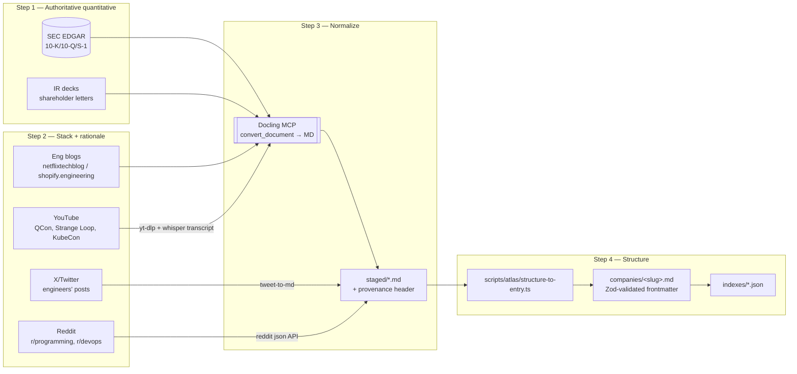
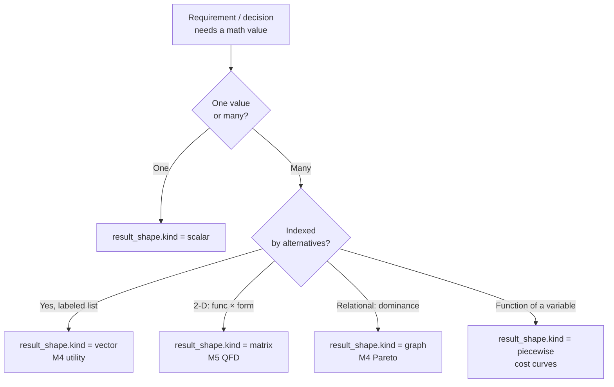
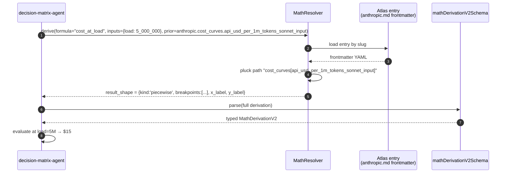
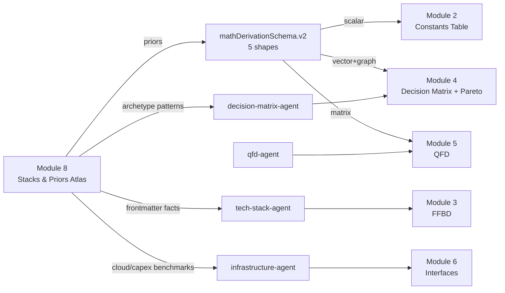

# Stacks & Priors Atlas — Evidence KB + Hybrid-Math Prior Store for c1v

> **Purpose**: Build a grounded, source-cited knowledge bank of public-and-frontier-AI company backend/frontend stacks + DAU/cost + **quantitative priors** (cost curves, latency budgets, availability) that feed a v2 `mathDerivationSchema` supporting scalar/vector/graph/matrix/piecewise result shapes. Used by c1v's LangChain agents (`tech-stack-agent`, `infrastructure-agent`, `decision-matrix-agent`, `qfd-agent`) to cite evidence AND anchor math at M2 Phase 8, M4 (Decision Matrix), and M5 (QFD).
>
> **Status**: DRAFT v2 — awaiting review. v1 extended with (a) explicit 4-step research pipeline, (b) math-schema v2 with 5 result shapes, (c) AI-company coverage. Zero files created yet.
>
> **Date**: 2026-04-21
> **Slug**: `public-company-stacks-atlas` (KB = "Module 8" + math schemas `lib/langchain/schemas/math/`)
> **Supersedes**: v1 in-place (company-only, scalar-only math, no explicit pipeline).

---

## 1. Vision

A first-class c1v knowledge bank that is **simultaneously**:
1. **An evidence library** — cite-able stacks, DAU, revenue, infra cost per company
2. **A prior store** — structured math priors (cost curves, p95 envelopes, availability, utility weights) that math-driven decision agents can consume
3. **A learning asset** for David — groundedness is the portfolio moat

Agents should be able to answer:
- *"For 5M DAU consumer social, what backend patterns do public companies use, and what's the cost/DAU?"* → frontmatter lookup
- *"What's a defensible p95 chain budget for an AI chat app?"* → `latency_priors` from Anthropic + OpenAI + Replicate Atlas entries
- *"What's the piecewise cost curve for GPU inference at 10M vs 100M req/mo?"* → `cost_curves` from Together / HuggingFace / Replicate
- *"Build me the Pareto frontier across 6 architecture alternatives"* → graph-shaped `mathDerivation` with node-weights sourced from Atlas priors

Every quantitative output must be traceable to an Atlas primary source. That is the moat.

---

## 2. Problem

**2.1 Scalar-only math is the ceiling.** Current `mathDerivationSchema` (`apps/product-helper/lib/langchain/schemas/module-2/_shared.ts:117`) is scalar-only: `result: z.union([z.number(), z.string()])`. M4 Decision Matrix emits utility *vectors*; M4 Pareto emits a *graph*; M5 QFD emits a *matrix*; every cost decision wants a *piecewise* curve. The schema literally cannot carry these shapes today.

**2.2 Priors are hallucinated.** When the NFR engine needs "p95 budget for consumer fintech read = 300ms" or "availability for managed Postgres = 99.95%", today it's LLM vibes. No corpus. No citation. No reproducibility. This collapses under reviewer scrutiny.

**2.3 Agents recommend stacks without evidence.** `tech-stack-agent` / `infrastructure-agent` outputs are LLM-parametric — trained-on-2024 opinion, not "here are 7 public companies at your DAU, 5 chose Postgres, 2 chose DynamoDB."

**2.4 AI/ML stacks are blind spots.** If c1v is positioned as "deterministic LLM system for architecture design," it must itself contain evidence of how AI-native systems are built. Excluding OpenAI/Anthropic/Databricks/HuggingFace/Cursor/Perplexity/Mistral/Replicate would be malpractice.

**2.5 David's learning gap.** Portfolio positioning (`memory/project_c1v_portfolio_positioning.md`) requires: *"deterministic LLM system for architecture design, grounded in math, with provenance per decision."* Groundedness requires a corpus. Building the Atlas **is** demonstrating the moat.

---

## 3. Current State (from the c1v codebase)

**3.1 Existing KB pattern** (`apps/product-helper/.planning/phases/13-Knowledge-banks-deepened/New-knowledge-banks/`):
- 7 module folders (`1-defining-scope-kb-for-software`, ..., `7-identify-evaluate-risk-software`)
- Each: numbered phase markdowns, `phase_artifact.schema.json`, `GLOSSARY.md`
- Format convention (per `plans/kb-runtime-architecture.md` §2.1): markdown keyed by `<module>/<phase>.md`, schema-first 6-section shape

**3.2 Existing math schema** (`apps/product-helper/lib/langchain/schemas/module-2/_shared.ts`):
- `mathDerivationSchema` at line 117 — fields: `formula`, `inputs`, `kb_source`, `kb_section?`, `result: number | string`
- **Scalar-only.** Explicitly documented on line 108: *"Per-field derivation of a numeric value."*
- Rigor pattern to match: discriminated unions (`sourceLensSchema`, lines 206-262), `.describe()` with `x-ui-surface=` annotations on every field, envelope composition via `.extend()` (`phaseEnvelopeSchema`, line 455), schema semver strings.

**3.3 Consuming agents** (confirmed present in `apps/product-helper/lib/langchain/agents/`):
- `tech-stack-agent.ts`
- `infrastructure-agent.ts`
- `decision-matrix-agent.ts` — M4, needs utility vectors + Pareto graphs
- `qfd-agent.ts` — M5, needs matrix-shaped quality
- `ffbd-agent.ts` — M3, consumes priors for function-to-form mapping
- `quick-start-synthesis-agent.ts` — top-of-funnel

**3.4 KB loader precedent**:
- `apps/product-helper/lib/langchain/agents/intake/kb-question-generator.ts` — reads markdown, the pattern to extend

**3.5 Retrieval gap** (per `plans/kb-runtime-architecture.md`):
- `kb_chunks` + pgvector: greenfield
- Current KBs read via direct file reads → Atlas must work today under file-read and be forward-compatible with pgvector

**3.6 Research tooling available**:
- **Docling MCP** is wired (confirmed tools: `mcp__docling__convert_document_into_docling_document`, `mcp__docling__convert_directory_files_into_docling_document`, `mcp__docling__export_docling_document_to_markdown`, `mcp__docling__search_for_text_in_document_anchors`). This is the 10-K → MD engine.
- **WebFetch + WebSearch** tools available for URL fetching + discovery
- **Firecrawl + Exa MCP** (seen in `gsd-phase-researcher` tool list) for structured scraping

**Implication**: Atlas v1 ships as (a) markdown with YAML frontmatter + JSON indexes (works today), (b) Zod schema + generated JSON Schema (rigor), (c) docling-driven ingest pipeline (reproducible refreshes), (d) `mathDerivationSchema.v2` with 5 result shapes (unlocks M4/M5 math).

---

## 4. End State

### 4.1 Filesystem layout

```
apps/product-helper/
  lib/langchain/schemas/
    math/                                  # ← NEW: result-shape-aware math
      derivation-v2.ts                     # mathDerivationSchema v2 (5 shapes)
      result-shape.ts                      # discriminated union (scalar|vector|graph|matrix|piecewise)
      priors.ts                            # Atlas-prior references (cost_curve_ref, p95_prior_ref, etc.)
      __tests__/derivation-v2.test.ts

    atlas/                                 # ← NEW: Atlas entry schema
      entry.ts                             # company / archetype entry Zod
      priors.ts                            # per-entry prior shapes (cost curves, latency dists)
      index.ts                             # registers in generate-all.ts
      __tests__/entry.test.ts

  .planning/phases/13-Knowledge-banks-deepened/New-knowledge-banks/
    8-stacks-and-priors-atlas/             # ← NEW: Module 8 KB
      README.md
      GLOSSARY.md                          # DAU / MAU / p50 / p95 / p99 / RPS / TCO / SLA / SLO / cost-per-request
      SOURCES.md                           # source-tier taxonomy + AI-company rules
      PIPELINE.md                          # 4-step research pipeline doc
      atlas.schema.json                    # generated
      companies/
        # --- Public SaaS / Web / Marketplace / Fintech ---
        netflix.md shopify.md github.md basecamp.md
        uber.md lyft.md doordash.md airbnb.md
        meta.md slack.md etsy.md
        dropbox.md pinterest.md reddit.md
        twitter.md linkedin.md
        stripe.md coinbase.md robinhood.md
        vercel.md figma.md
        # --- Public AI / Data / Observability ---
        palantir.md c3-ai.md snowflake.md databricks.md mongodb.md datadog.md
        # --- Frontier AI (private; stricter source rules) ---
        openai.md anthropic.md mistral.md huggingface.md
        perplexity.md replicate.md together.md cursor.md cohere.md
      archetypes/
        rails-majestic-monolith.md         # Shopify, GitHub, Basecamp
        go-microservices-at-scale.md       # Uber, Lyft, DoorDash
        php-hyperscale.md                  # Meta, Slack, Etsy
        python-data-heavy.md               # Dropbox, Pinterest, Reddit
        scala-jvm-platform.md              # Twitter, LinkedIn, Netflix-backend
        fintech-secure-core.md             # Stripe, Coinbase, Robinhood
        ai-native-inference-edge.md        # Vercel, Figma, Perplexity, Cursor
        ai-training-gpu-fleet.md           # OpenAI, Anthropic, Mistral, Databricks
        ai-inference-as-a-service.md       # HuggingFace, Replicate, Together, Cohere
        data-warehouse-and-ml-platform.md  # Snowflake, Databricks, Palantir
      indexes/
        by-dau.json by-primary-lang.json by-db.json
        by-gpu-exposure.json               # AI-specific: owns-cluster / rents / serverless
        by-inference-pattern.json          # AI: edge / batch / streaming / fine-tune
        index.json

  scripts/
    atlas/
      ingest-10k.ts                        # SEC EDGAR → docling → staged MD
      ingest-blog.ts                       # blog URL → docling → staged MD
      ingest-video.ts                      # YouTube transcript → normalized MD
      ingest-social.ts                     # X / Reddit post → flagged MD
      structure-to-entry.ts                # staged MD → frontmatter-populated entry
      build-indexes.ts                     # entries → indexes/*.json
      verify-citations.ts                  # citation URL liveness + tier-compliance
```

### 4.2 `mathDerivationSchema.v2` — the unlock

Discriminated union on `result_shape.kind`. Every Atlas entry can provide priors in the matching shape.

```ts
// derivation-v2.ts (sketch; rigor matches _shared.ts patterns)
export const resultShapeSchema = z.discriminatedUnion('kind', [
  // Existing scalar — back-compat with v1
  z.object({
    kind: z.literal('scalar'),
    value: z.union([z.number(), z.string()]),
    units: z.string().optional(),
  }).describe('x-ui-surface=section:Math > Result — scalar value (Little\'s Law, availability, p95 chain).'),

  // Decision utility per alternative — M4
  z.object({
    kind: z.literal('vector'),
    dim_label: z.string(),                             // e.g., "alternative_id"
    values: z.array(z.object({
      label: z.string(),                               // e.g., "arch_A"
      value: z.number(),
      components: z.record(z.string(), z.number()).optional(), // {cost: 0.4, latency: 0.3, ...}
    })),
    units: z.string().optional(),
  }).describe('x-ui-surface=section:Math > Result — per-alternative utility U(a) = Σ wᵢ·scoreᵢ.'),

  // Pareto frontier — M4
  z.object({
    kind: z.literal('graph'),
    nodes: z.array(z.object({
      id: z.string(),
      label: z.string(),
      coords: z.record(z.string(), z.number()),        // {cost: 0.3, latency: 0.8, ...}
      is_frontier: z.boolean(),
    })),
    edges: z.array(z.object({
      from: z.string(),
      to: z.string(),
      relation: z.enum(['dominates', 'incomparable', 'dominated_by']),
    })),
    axes: z.array(z.string()),                         // dimensions evaluated
  }).describe('x-ui-surface=section:Math > Result — Pareto dominance graph across architecture alternatives.'),

  // QFD Q(f,g) = s·(1-k) — M5
  z.object({
    kind: z.literal('matrix'),
    row_labels: z.array(z.string()),                   // functions
    col_labels: z.array(z.string()),                   // forms
    cells: z.array(z.array(z.number())),               // row-major, value in [0,1]
    cell_semantics: z.string(),                        // "quality_score" | "strength_minus_conflict"
  }).describe('x-ui-surface=section:Math > Result — concept-quality matrix Q(f,g).'),

  // Cost curves — every decision, priors from Atlas KB-8
  z.object({
    kind: z.literal('piecewise'),
    x_label: z.string(),                               // "requests_per_month"
    y_label: z.string(),                               // "usd_per_month"
    breakpoints: z.array(z.object({
      x: z.number(),
      y: z.number(),
      regime_label: z.string().optional(),             // "free_tier" | "linear" | "volume_discount"
    })),
    slope_left: z.number().optional(),
    slope_right: z.number().optional(),
  }).describe('x-ui-surface=section:Math > Result — piecewise function (cost curves, tiered pricing).'),
]);

export const mathDerivationV2Schema = z.object({
  formula: z.string(),
  inputs: z.record(z.string(), z.union([z.number(), z.string(), z.array(z.number())])).default({}),
  kb_source: z.string(),                               // slug in KB-8 or other KB
  kb_section: z.string().optional(),
  atlas_prior_ref: z.object({                          // ← NEW: point into KB-8 priors
    entry_slug: z.string(),                            // e.g., "anthropic"
    prior_path: z.string(),                            // e.g., "cost_curves.inference_per_1m_tokens"
  }).optional(),
  result_shape: resultShapeSchema,
  derivation_log: z.array(z.string()).default([]),     // step-by-step for audit
  confidence: z.number().min(0).max(1).optional(),     // [0,1] — when prior-based
});
```

**Back-compat**: v1 consumers still work — scalar shape is the default and round-trips to the v1 `{formula, inputs, kb_source, result}` record. A migration helper `liftScalarToV2()` takes a v1 record and returns the `kind: 'scalar'` variant.

### 4.3 Atlas entry schema (markdown frontmatter)

Same envelope pattern as existing c1v — YAML frontmatter + prose body. Frontmatter is Zod-typed (`lib/langchain/schemas/atlas/entry.ts`). Example for a hybrid SaaS+AI company:

```markdown
---
slug: anthropic
name: Anthropic
kind: frontier_ai_private                     # public | frontier_ai_private | ai_infra_public
hq: San Francisco, CA
last_verified: 2026-04-21
verification_status: partial                  # verified | partial | inferred

scale:
  metric: api_calls_per_day_est              # AI frontier reports requests, not DAU
  value: ~2_000_000_000
  as_of: 2025-Q4
  source_tier: C_press_analyst
  source_url: "..."
  corroborated_by: ["B_official_blog: ..."]

revenue_usd_annual: ~4_000_000_000            # ranged, private-company estimate
infra_cost_usd_annual: null                   # undisclosed
gpu_fleet_est: "100K+ H100 equivalent"        # press-reported
compute_partner: [AWS_Trainium, GCP_TPU]

frontend:
  web: [React, TypeScript, Next.js]
  mobile: [Native_iOS, React_Native]
backend:
  primary_langs: [Python, Rust]
  frameworks: [FastAPI, Tokio]
data:
  oltp: [Postgres_managed]
  cache: [Redis]
  vector: [self_hosted]
  warehouse: [Snowflake_or_similar]         # tier-F inference
infra:
  cloud: [AWS, GCP]
  compute: [Trainium, TPU_v5, H100]
  cdn: [Cloudflare, Fastly]
ai_stack:
  training_framework: [JAX, custom]
  serving: [vLLM_style_custom]
  evals: [custom_internal]

# ─── Math priors (KEY section — feeds mathDerivationSchema.v2) ───

latency_priors:                               # p95 budgets, chain-composable
  - anchor: chat_completion_stream_first_token_p95_ms
    value: 800
    source_tier: B_official_blog
    source_url: "..."
  - anchor: chat_completion_stream_full_p95_ms
    value: 4000
    source_tier: C_press_analyst

cost_curves:                                  # piecewise, drop-in for result_shape.piecewise
  - anchor: api_usd_per_1m_tokens_sonnet_input
    breakpoints:
      - {x: 0,          y: 0,    regime_label: "flat"}
      - {x: 1_000_000,  y: 3.00, regime_label: "flat"}
    units: "usd_per_1m_tokens"
    source_tier: B_official_blog

availability_priors:                          # for serial/parallel composition
  - anchor: api_sla_monthly
    value: 0.999
    units: fraction_uptime
    source_tier: B_official_blog

utility_weight_hints:                         # for M4 — what AI-native companies weight
  latency: 0.20
  cost: 0.25
  quality_bench: 0.30
  availability: 0.15
  safety: 0.10

archetype_tags: [ai-training-gpu-fleet, ai-native-inference-edge]
---

## 1. Scale & economics
## 2. Frontend stack (what and why)
## 3. Backend stack (what and why)
## 4. AI stack (training + serving + evals) — REQUIRED for AI-kind entries
## 5. Data & storage
## 6. Math priors commentary — how the priors were sourced and caveats
## 7. Migrations & turning points
## 8. Sources (numbered, with tier + URL + retrieval date)
```

`ai_stack` and `utility_weight_hints` are **only required for `kind: frontier_ai_private` or `kind: ai_infra_public`** — Zod refinement. Other entries may omit.

---

## 5. Scope (v1)

### 5.1 Companies (~33 target, up from v1's 20)

**Public SaaS / Web / Marketplace / Fintech (20)**:
Shopify · GitHub · Basecamp · Airbnb · Uber · Lyft · DoorDash · Meta · Slack · Etsy · Dropbox · Pinterest · Reddit · Twitter/X · LinkedIn · Netflix · Stripe · Coinbase · Robinhood · Vercel · Figma *(21, folding 1 into Vercel-or-Figma choice)*

**Public AI / Data / Observability (5)**:
Palantir · C3.ai · Snowflake · MongoDB · Datadog

**Public AI-adjacent (1)**:
Databricks *(when IPO lands; today treat as frontier-private)*

**Frontier-AI private (9)** — stricter source rules per §6.2:
OpenAI · Anthropic · Mistral · HuggingFace · Perplexity · Replicate · Together · Cursor · Cohere

### 5.2 Archetype cross-cuts (10, up from 6)

- `rails-majestic-monolith`
- `go-microservices-at-scale`
- `php-hyperscale`
- `python-data-heavy`
- `scala-jvm-platform`
- `fintech-secure-core`
- `ai-native-inference-edge` — *new*
- `ai-training-gpu-fleet` — *new*
- `ai-inference-as-a-service` — *new*
- `data-warehouse-and-ml-platform` — *new*

### 5.3 Schemas (in v1 scope)

- `lib/langchain/schemas/math/derivation-v2.ts` + tests (5 result shapes + back-compat)
- `lib/langchain/schemas/atlas/entry.ts` + tests (company entry, Zod-refined on `kind`)
- `lib/langchain/schemas/atlas/priors.ts` + tests (cost curves, latency priors, availability priors as typed shapes)
- Wired into `schemas/generate-all.ts` → emit `schemas/generated/math/*.json` and `schemas/generated/atlas/*.json`

### 5.4 Research pipeline (in v1 scope)

See §5 for full pipeline. Four ingest scripts under `scripts/atlas/` + one integration MD at `PIPELINE.md`.

### 5.5 Agent integration (one pilot in v1)

Extend `tech-stack-agent.ts` with `atlasLookup(dauRange, archetypeTags, aiNative?)` + Jest test proving ≥2 real citations returned on a representative prompt. Decision-matrix + QFD agent integration deferred to v1.1 once math-v2 schema is stable.

### 5.6 Out of scope

- pgvector integration (waits on `kb-runtime-architecture.md`)
- Real-time / streaming refresh (static corpus; manual quarterly refresh)
- Non-English-market companies (ByteDance, Nubank, Rakuten)
- Full Monte Carlo sensitivity implementation (`result_shape` supports it; executor is v1.1)
- Unit-economics finer than published pricing tables
- UI surfacing (agents consume; users don't browse Atlas directly)

---

## 6. Research Pipeline (NEW — explicit 4-step workflow)

### 6.1 Overview



### 6.2 Step-by-step contracts

**Step 1 — Authoritative quantitative (tier A)**
- **Source**: SEC EDGAR (10-K, 10-Q, S-1) for public, IR decks for both public + AI-public
- **Tool**: WebFetch (direct URL) → Docling MCP (`convert_document_into_docling_document` → `export_docling_document_to_markdown`)
- **Extract**: DAU/MAU/subs, revenue, capex, cloud-commitment disclosures, gross margin (infra-cost proxy), employee count
- **Output**: `scripts/atlas/staged/<slug>/10k-<date>.md` with provenance header `{url, retrieved_at, filing_type, tier: A_sec_filing}`

**Step 2 — Stack + rationale (tier B–F)**
- **Sources**:
  - Official engineering blogs (tier B) — WebFetch → Docling
  - Conference talks on YouTube (tier E) — fetch transcript via youtube-transcript-api or whisper; treat as tier B if speaker is company IC
  - X/Twitter posts from named company engineers (tier C+, flagged) — manual curation
  - Reddit AMA / technical threads (tier C, flagged) — manual curation for high-signal threads only
  - GitHub org repos + configs (tier F) — crawl for `package.json`, `requirements.txt`, `go.mod`, `docker-compose.yml`
- **Output**: `scripts/atlas/staged/<slug>/<source-tier>-<title>.md` with provenance header

**Step 3 — Docling normalization**
- All non-social sources go through Docling MCP: `convert_document_into_docling_document` (preserves anchors + headings) → `export_docling_document_to_markdown`
- Result: uniform MD with anchor IDs the `kb_section` field can reference precisely
- Social sources (X, Reddit) bypass Docling — direct text extraction with tweet/post URL as anchor

**Step 4 — Structure**
- `scripts/atlas/structure-to-entry.ts` takes staged MD directory per company → populates Zod-typed frontmatter (slots from §4.3)
- Human review step: the prose body (§1–§8 of the entry) is written by the research agent but reviewed by David before commit
- `scripts/atlas/build-indexes.ts` regenerates `indexes/*.json` from committed entries
- `scripts/atlas/verify-citations.ts` checks every URL 200s + tier-rule compliance; CI gate

### 6.3 Source-tier rules (UPDATED)

```
A_sec_filing      — 10-K, 10-Q, S-1, proxy, IR deck. Highest trust. QUANTITATIVE ONLY.
B_official_blog   — Company engineering blog or official research post (Anthropic research,
                    OpenAI blog). For AI-private, B is often top-tier (no 10-K exists).
C_press_analyst   — FT, The Information, Bloomberg, The Pragmatic Engineer, Gartner, SemiAnalysis.
                    Used when A/B silent. For QUANT claims on AI-private: REQUIRE dual-C corroboration.
D_stackshare      — Community-reported. NEVER sufficient alone; corroborate with B/E/F.
E_conference      — QCon / Strange Loop / KubeCon / NeurIPS. B-equivalent if speaker is IC.
F_github          — Public repo configs. Proves stack usage; silent on scale.
G_model_card      — AI-specific: model cards, system cards, safety reports (e.g., Claude 3.7 model card).
                    B-equivalent for AI-private quant (context window, latency, pricing).
H_social_flagged  — X/Twitter post from verified company employee OR Reddit thread with ≥50 corroborations.
                    Always flagged; never sole source for quant claims.
```

**Rules**:
- **Public companies**: Every quant claim (DAU, $, capex) must cite A, B, or dual-C. Stack: B, E, F, or dual-D.
- **AI-private**: Quant claims must cite B, G, or dual-C. Stack: B, E, F, or G.
- **All entries**: `last_verified` date; staleness flag at 18 months → agents receive warning on retrieval.
- **Math priors** specifically: must cite B, E, or G — priors derived from tier C or D are rejected by the Zod refinement on `atlas.priors.source_tier`.

---

## 7. Systems Engineering Math (5 result shapes, Atlas as prior store)

Aligned with David's spec. Each row shows: primitive → `result_shape.kind` → Atlas prior field → consuming node.

| # | Math primitive | Formula | `result_shape.kind` | Atlas prior field | Used by |
|---|---|---|---|---|---|
| 1 | Little's Law + M/M/c | L = λW, ρ = λ/(cμ) | `scalar` | `latency_priors[*].value` (μ from tail latency anchors) | M2 Phase 8 constants |
| 2 | Availability (serial) | A = ∏Aᵢ | `scalar` | `availability_priors[*].value` | M2 Phase 8 constants |
| 3 | Availability (parallel) | A = 1 − ∏(1−Aᵢ) | `scalar` | `availability_priors[*].value` | M2 Phase 8 constants |
| 4 | Decision utility | U(a) = Σ wᵢ·scoreᵢ | `vector` | `utility_weight_hints.*` (as wᵢ priors) | M4 Decision Matrix |
| 5 | Pareto dominance | a ≻ b iff ∀i aᵢ ≥ bᵢ ∧ ∃j aⱼ > bⱼ | `graph` | all `*_priors.*.value` as coords | M4 Pareto phase |
| 6 | Sensitivity | σᵢ² = Var(U(a) | perturb wᵢ) | `scalar` per decision, ranked | `utility_weight_hints` perturbation bounds | M4 sensitivity |
| 7 | Concept quality | Q(f,g) = s·(1−k) | `matrix` | archetype cross-cut strength-weakness | M5 QFD |
| 8 | Cost curves | cost = piecewise(load) | `piecewise` | `cost_curves[*].breakpoints` | every decision node |
| 9 | Tail latency chain | p95_chain ≈ Σ p95ᵢ (or Laplace for skew) | `scalar` | `latency_priors[*].value` per hop | decision scoring |

**What "as rigorous as module-2" means operationally**:
- Every shape is a discriminated union (like `sourceLensSchema` at `_shared.ts:206`)
- Every field has `.describe('x-ui-surface=...')` — render + xlsx marshaller surfaces
- Schema semver strings (`mathDerivation.v2.0.0`) — drift-checkable
- Each prior field on an Atlas entry is Zod-refined to match one of the 5 result-shape variants
- `atlas_prior_ref.entry_slug` + `atlas_prior_ref.prior_path` is a typed pointer; at generation time the resolver loads the entry's frontmatter, plucks the path, and populates the `result_shape` — fail-closed if the path doesn't resolve

**Back-compat**: v1 `{formula, inputs, kb_source, result}` records parse cleanly under the v2 scalar variant. `liftScalarToV2()` is a one-line helper.

---

## 8. Diagrams

### 8.1 Research pipeline

*(See §6.1 — already drawn as mermaid.)*

### 8.2 Math-schema shape selector



### 8.3 Atlas prior resolution (how a decision node gets its curve)



### 8.4 Atlas → c1v modules



---

## 9. Execution Plan (phased, reviewable)

**Phase 0 — Schema v2 (foundation; no content yet)**
1. Implement `lib/langchain/schemas/math/result-shape.ts` (5-variant discriminated union, tests)
2. Implement `lib/langchain/schemas/math/derivation-v2.ts` (full schema + `liftScalarToV2` helper + tests)
3. Implement `lib/langchain/schemas/atlas/priors.ts` (typed prior shapes referencing result-shape variants)
4. Implement `lib/langchain/schemas/atlas/entry.ts` (frontmatter schema, Zod-refined on `kind`)
5. Wire all into `generate-all.ts`; run `pnpm tsx lib/langchain/schemas/generate-all.ts`; verify `schemas/generated/math/` and `schemas/generated/atlas/` emit
6. Add schema CI test: no drift between `.ts` and `.json`

**Phase 1 — Research pipeline tooling**
7. `scripts/atlas/ingest-10k.ts` (SEC EDGAR → WebFetch → Docling → staged/)
8. `scripts/atlas/ingest-blog.ts` (URL → WebFetch → Docling → staged/)
9. `scripts/atlas/ingest-video.ts` (YouTube URL → transcript → staged/)
10. `scripts/atlas/ingest-social.ts` (X URL / Reddit URL → extract → flagged staged/)
11. `scripts/atlas/structure-to-entry.ts` (staged dir → Zod-validated frontmatter)
12. `scripts/atlas/build-indexes.ts`
13. `scripts/atlas/verify-citations.ts`

**Phase 2 — KB scaffold + research (the heavy phase)**
14. Create `8-stacks-and-priors-atlas/` tree; write README/GLOSSARY/SOURCES/PIPELINE
15. Research + draft 20 public SaaS/Web/Marketplace/Fintech entries
16. Research + draft 5 public AI/Data/Observability entries
17. Research + draft 9 frontier-AI private entries (strict dual-source rule)
18. Draft 10 archetype cross-cut docs
19. Build indexes (`scripts/atlas/build-indexes.ts`)

**Phase 3 — Agent integration (one pilot)**
20. `lib/langchain/agents/utils/atlas.ts` — `atlasLookup()` helper
21. `lib/langchain/agents/utils/math-resolver.ts` — `resolvePrior(ref)` that returns a `resultShape`
22. Extend `tech-stack-agent.ts` to call `atlasLookup()` + inject ≥2 citations
23. Jest test: "2M DAU consumer social" → agent surfaces ≥2 real URLs
24. Jest test: "AI chat app latency budget" → agent surfaces a `latency_priors` anchor from an AI-kind entry

**Phase 4 — Verification**
25. `scripts/atlas/verify-citations.ts` against all entries (CI gate)
26. Manual spot-check: 10% sample citations (dead/paywalled/misquoted?)
27. Full `pnpm jest` (must not regress)
28. Retrospective: `plans/public-company-stacks-atlas.retrospective.md` checking §11 success criteria

**Sequencing**: 0 blocks 1, 2, 3. 1 blocks 2. 2 and 3 parallelizable by component (Phase 3 steps 20–22 can start once 6 sample Atlas entries exist, not all 33). 4 final.

**Parallelization**: Phase 2 entry research fans out per company to `gsd-phase-researcher` subagents (per memory: dispatching-parallel-agents skill); each subagent gets one company + the pipeline scripts and returns a staged entry for human review.

---

## 10. Risks & Open Questions

| Risk | Mitigation | Open? |
|---|---|---|
| Private AI source-tier lower than public — agents over-trust | Require dual-corroboration (B+C, or B+G); Zod refinement rejects `source_tier: D` alone for priors | No |
| Docling mis-anchors or loses structure on complex 10-Ks | Spot-check sample per filing; fall back to manual MD if Docling anchors miss §headings | Need pilot |
| Math-v2 schema churn mid-research (shape signatures shift) | Phase 0 lands before Phase 2; schema frozen with semver; breaking changes bump major | No |
| YouTube transcripts low-quality / captions missing | whisper fallback for uncaptioned talks; flag entries with `transcript_quality: low` | No |
| X/Reddit posts deleted between retrieval and review | Archive.org snapshot URL in citation alongside live URL | No |
| AI fleet/cost numbers (OpenAI $B capex) are speculative | Mark `verification_status: partial`; flag on retrieval; ranges not point values | No |
| Scope creep from archetype docs over-referencing entries | Archetypes are *cross-cuts*, not primary sources; re-citing rule enforced in SOURCES.md | No |
| Retrieval-mode mismatch when pgvector lands | Frontmatter is RAG-metadata-compatible; prose is chunk-ready; same corpus serves both | No |

**Open questions** (flag before Phase 2):
1. **Entry count**: 33 (this plan) vs. go deeper with fewer (~20 with more prior-density per entry)?
2. **Frontier-AI inclusion-list**: the 9 listed (OpenAI, Anthropic, Mistral, HuggingFace, Perplexity, Replicate, Together, Cursor, Cohere) — drop / add?
3. **Agent integration scope in v1**: tech-stack-agent pilot only, or also one math-consuming agent (decision-matrix or qfd) to prove the prior-resolver pattern end-to-end? Recommend: add a single decision-matrix unit test that pulls a `piecewise` cost curve — proves the wiring without full UI integration.
4. **Location of math schemas**: `lib/langchain/schemas/math/` (this plan) — confirm, or nest under `module-2/` as an extension?
5. **Docling fidelity on 10-Ks**: pilot on 2 filings (one narrative-heavy like Shopify, one AI-adjacent like Snowflake) **before Phase 2** to de-risk. Recommend: yes.

---

## 11. Success Criteria (goal-backward)

After this plan executes:
- [ ] `mathDerivationSchema.v2` compiles + parses all 5 shapes with tests; v1 records still parse as `scalar`
- [ ] `anthropic.md` frontmatter contains a piecewise `cost_curves[api_usd_per_1m_tokens_sonnet_input]` sourced to the official pricing page (tier B)
- [ ] A Jest test loads that prior via `atlasLookup` + `math-resolver`, evaluates at load=5M tokens, returns the correct dollar amount
- [ ] `tech-stack-agent` asked "stack for 2M DAU AI chat app" surfaces ≥3 recommendations with real citations (≥1 to AI-kind entry)
- [ ] Every entry passes `verify-citations.ts` (URL 200, tier-rule compliant)
- [ ] David can read any entry and in 5 minutes understand scale, stack, migrations, and priors with citations
- [ ] A reviewer skimming the retrospective sees the moat ("deterministic, grounded, cited, math-typed") in under 10 minutes

Verification: Phase 4 retrospective.

---

## 12. What this plan does NOT commit to

- Real-time freshness (static; manual quarterly refresh)
- UI surfacing of the Atlas (agents consume; users don't browse)
- pgvector migration (forward-compatible but not blocking)
- Full executor for sensitivity / Monte Carlo (schema ready; executor = v1.1)
- Unit economics below published pricing tables
- Non-English-market company coverage in v1
- Auto-refresh of priors from blog rewrites (manual refresh loop only)

---

**End of v2 plan. Awaiting review.**
