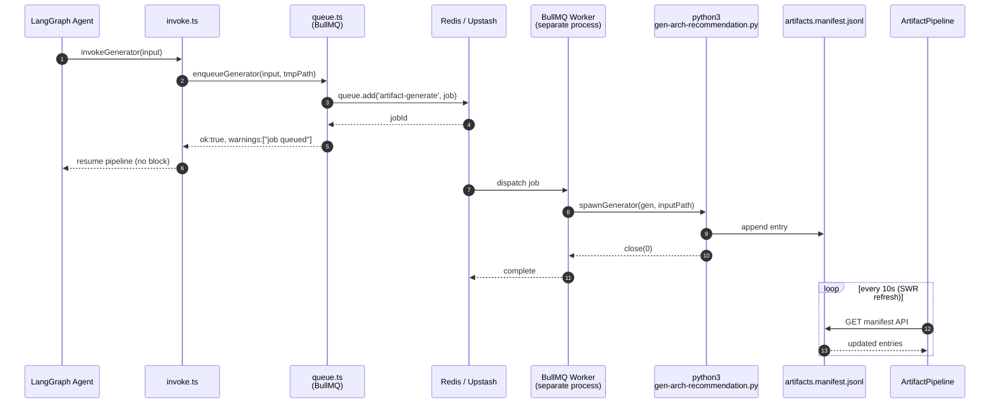

# T10 Runtime Integration Diagram

Sequence of calls from agent output to UI render, per
`plans/c1v-MIT-Crawley-Cornell.v2.md` §15.6.

## Inline (fast generators: ffbd, qfd, n2, ...)

```mermaid
sequenceDiagram
    autonumber
    participant Agent as LangGraph Agent
    participant Ajv as Ajv Validator<br/>(lib/langchain/schemas)
    participant Invoke as invoke.ts
    participant Cfg as config.ts
    participant Py as python3<br/>gen-*.py
    participant Runner as common/runner.py
    participant Manifest as artifacts.manifest.jsonl
    participant API as GET .../artifacts/manifest
    participant UI as ArtifactPipeline +<br/>FMEAViewer / ...

    Agent->>Ajv: validate(instanceJson, schemaRef)
    Ajv-->>Agent: ok
    Agent->>Invoke: invokeGenerator(input)
    Invoke->>Cfg: shouldRunInline(gen)
    Cfg-->>Invoke: true (maxElapsedMs <= 5s)
    Invoke->>Py: spawn('python3', [gen-*.py, tmp.json])
    Py->>Runner: run_generator(render)
    Runner->>Runner: load + re-validate + render
    Runner->>Manifest: append_manifest_entry(...)
    Runner-->>Py: stdout: {ok:true, generated:[...]}
    Py-->>Invoke: close(0)
    Invoke-->>Agent: ArtifactGeneratorOutput (ok:true)
    Note over Invoke,Agent: failures return ok:false;<br/>pipeline continues

    UI->>API: GET /api/projects/:id/artifacts/manifest
    API->>Manifest: read + parse JSONL
    Manifest-->>API: ManifestEntry[]
    API-->>UI: {runDir, entries, latest}
    UI-->>UI: render download links
```

## Queued (long-running: gen-arch-recommendation)



## Failure + Fallback

```mermaid
sequenceDiagram
    participant Invoke as invoke.ts
    participant Queue as queue.ts
    participant Py as python3 gen-*.py
    participant Manifest as manifest.jsonl

    Invoke->>Queue: dynamic import bullmq
    alt REDIS_URL unset or module missing
      Queue-->>Invoke: throw
      Note right of Invoke: log warn + inline fallback
      Invoke->>Py: spawnGenerator(...)
    else queue available
      Queue-->>Invoke: enqueued
    end

    Py-->>Invoke: nonzero exit / timeout
    Invoke->>Invoke: buildErrorOutput(E_TIMEOUT | E_NONZERO_EXIT)
    Invoke-->>Manifest: (python already logged partial if reached runner)
    Note over Invoke: ok:false never throws;<br/>caller continues with extractedData
```

## Key guarantees

- **Non-fatal:** every generator path returns an `ArtifactGeneratorOutput`.
  `ok:false` is a warning, not a pipeline halt.
- **Atomic manifest:** `common/manifest_writer.py` uses `O_APPEND + fcntl.flock`.
  TS-side writes (rare) use `fs.appendFile(..., {flag: 'a'})` which is atomic
  for small lines on POSIX.
- **Graceful dep:** BullMQ + Redis are optional. Missing → inline fallback.
- **UI read path:** `ArtifactPipeline` polls `/api/projects/:id/artifacts/manifest`
  every 10s via SWR. `FMEAViewer` reads SVG via an `` pointing at the
  download API, avoiding any inline-HTML injection surface.
