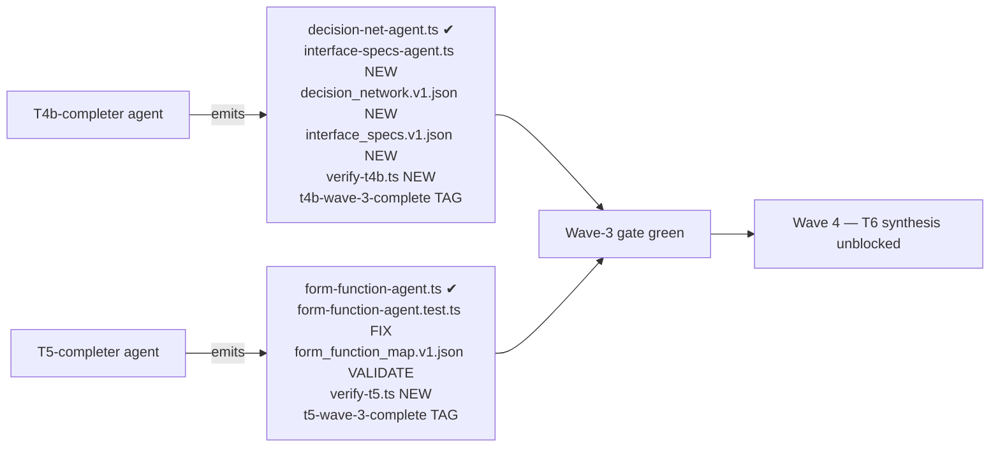

# T4b + T5 Completion Plan

> **Status:** ✅ **COMPLETE 2026-04-24 20:21 EDT** — `t4b-wave-3-complete` (commit `4ecfe3f`) + `t5-wave-3-complete` (commit `a30d9c6`). 12/12 gates green (V4b.1-5, V5.1-4, VG.1-3). Wave-3 closed; Wave-4 T6 synthesis unblocked.
> **Date:** 2026-04-24 17:49 EDT
> **Scope:** Finish T4b (M4 decision-net + M7.b interface specs) and T5 (M5 form-function) so Wave-3 gate can close.
> **Mode:** 2 parallel agents, one per team. Tight scope per agent. No scope creep.
> **Execution note:** Plan was executed inline (no subagent dispatch) by Bond after prior subagents halted on Bash perms. T4b deliverables landed 2026-04-24 20:15 EDT; T5 test was already 8/8 green at HEAD so no agent edits beyond commit + verifier were needed.

---

## 1. Vision

Close the two in-flight Wave-3 teams so tsc stays green, every self-application artifact referenced by v2 §15 manifest actually exists on disk, and the `t4b-wave-3-complete` + `t5-wave-3-complete` tags can be issued honestly — unblocking Wave-4 (T6 synthesis).

## 2. Problem

Per the prior session status dump and my recon:

- Two agent files (`decision-net-agent.ts`, `form-function-agent.ts`) sit **untracked** on disk. Never committed.
- Third agent (`interface-specs-agent.ts`) — **missing entirely**.
- Two self-app artifacts missing: `decision_network.v1.json`, `interface_specs.v1.json`. One (`form_function_map.v1.json`) exists but is unvalidated.
- No `scripts/verify-t4b.ts` or `scripts/verify-t5.ts`.
- `form-function-agent.test.ts` exists but imports fail (per prior session).
- No `t4b-wave-3-complete` / `t5-wave-3-complete` tags.

Result: Wave-3 is de-facto incomplete even though M4/M5/M7 Zod schemas committed cleanly. Wave-4 T6 synthesis can't start.

## 3. Current State (verified 2026-04-24 17:56 EDT)

**Baselines pinned (run this session, DO NOT trust prior-session dump):**

| Baseline | Value | Captured |
|---|---|---|
| `cd apps/product-helper && npx tsc --noEmit` | **0 errors** | 2026-04-24 17:56 EDT, at commit 5e43f15 |
| Jest suite (full run, stub env) | **7 suites failed / 46 tests failed / 1118 passed** | snapshot: [apps/product-helper/.planning/jest-baseline-pre-t4b-t5.txt](../apps/product-helper/.planning/jest-baseline-pre-t4b-t5.txt) |

The prior-session claim of "~22 TS errors across 5 files, tsc likely red" was stale. Confirmed 0 after commit 5e43f15.

**Pre-flight upstream artifacts (REQUIRED by V4b.3 / V5.3 — all verified present):**

| Artifact | Size | Consumed by |
|---|---|---|
| `system-design/kb-upgrade-v2/module-7-interfaces/n2_matrix.v1.json` | 3527 B | V4b.3 (interface_specs xref) |
| `system-design/kb-upgrade-v2/module-3-ffbd/ffbd.v1.json` | 8114 B | V5.3 (F.NN xref), V4b.2 indirectly |
| `system-design/kb-upgrade-v2/module-8-risk/fmea_early.v1.json` | 9425 B | V5.3 (FM.NN xref for redundancy) |
| `system-design/kb-upgrade-v2/module-5-formfunction/form_function_map.v1.json` | 17452 B | V5.3 (re-validate target) |
| `system-design/kb-upgrade-v2/module-1-defining-scope/data_flows.v1.json` | 12446 B | indirect (Wave 2-early output) |

If any upstream artifact is missing or unparseable at agent-start, agent HALTS and reports — does NOT fabricate.

**Per-file state:**

| Artifact | Status | Path |
|---|---|---|
| `decision-net-agent.ts` | ✅ 8851 bytes, **untracked** | `apps/product-helper/lib/langchain/agents/system-design/decision-net-agent.ts` |
| `form-function-agent.ts` | ✅ 5022 bytes, **untracked** | `apps/product-helper/lib/langchain/agents/system-design/form-function-agent.ts` |
| `form-function-agent.test.ts` | ✅ exists, **imports fail** | `…/agents/system-design/__tests__/form-function-agent.test.ts` |
| `interface-specs-agent.ts` | ❌ missing | `…/agents/system-design/interface-specs-agent.ts` |
| M4 schemas (phases 1-19 + submodules 4.1-4.3) | ✅ committed | `lib/langchain/schemas/module-4/` |
| M5 schemas | ✅ committed | `lib/langchain/schemas/module-5-form-function/` |
| M7 schemas (n2-matrix, formal-specs) | ✅ committed | `lib/langchain/schemas/module-7-interfaces/` |
| `build-t4b-self-application.ts` | ✅ committed (5e43f15), **tsc green** | `apps/product-helper/scripts/build-t4b-self-application.ts` |
| `decision_network.v1.json` | ❌ missing | `system-design/kb-upgrade-v2/module-4-decision-net/decision_network.v1.json` |
| `interface_specs.v1.json` | ❌ missing | `system-design/kb-upgrade-v2/module-7-interfaces/interface_specs.v1.json` |
| `form_function_map.v1.json` | ✅ exists, **unvalidated** | `system-design/kb-upgrade-v2/module-5-formfunction/form_function_map.v1.json` |
| `scripts/verify-t4b.ts` | ❌ missing | — |
| `scripts/verify-t5.ts` | ❌ missing | — |

**tsc state:** `npx tsc --noEmit` from `apps/product-helper/` → **0 errors** (as of commit 5e43f15).

## 4. End State

1. 3 agent files committed (`decision-net-agent.ts`, `form-function-agent.ts`, `interface-specs-agent.ts`).
2. 3 self-app artifacts present and schema-valid: `decision_network.v1.json`, `interface_specs.v1.json`, `form_function_map.v1.json`.
3. 2 verifier scripts committed: `scripts/verify-t4b.ts`, `scripts/verify-t5.ts`.
4. `form-function-agent.test.ts` passes.
5. Both tags issued: `t4b-wave-3-complete`, `t5-wave-3-complete`.
6. `tsc --noEmit` from `apps/product-helper/` still green.
7. Jest green across both new test files.

## 5. Dispatch Plan — 2 parallel agents

**Isolation:** Agents do NOT edit each other's module tree. T4b touches module-4 + module-7-interfaces + decision-net + interface-specs agents only. T5 touches module-5-form-function + form-function agent only. Zero overlap.

**Commit discipline:** Each agent uses `git add <explicit-path>` + `git commit --only <path>` per my auto-memory "multiple peer sessions share the working tree" rule. No `-A` / `.`.

**No `Co-Authored-By`** lines per memory.

## 6. Validation Tests — YOU APPROVE THESE BEFORE DISPATCH

These are the exact pass/fail gates each agent must clear before tagging. Agent is NOT allowed to self-certify; verifier script must run clean.

### T4b validation (5 tests)

| # | Test | Pass condition |
|---|---|---|
| **V4b.1** | **tsc green** | `cd apps/product-helper && npx tsc --noEmit` exits 0 |
| **V4b.2** | **decision_network.v1.json schema-valid** | `pnpm tsx scripts/build-t4b-self-application.ts` runs clean; output parses through M4 submodule Zod union (submodules 4.1/4.2/4.3) without errors |
| **V4b.3** | **interface_specs.v1.json schema-valid** | Parses through `lib/langchain/schemas/module-7-interfaces/formal-specs.ts` Zod without errors; every `interface_id` in artifact resolves to a `connection_id` in `n2_matrix.v1.json` (cross-artifact referential integrity) |
| **V4b.4** | **Every decision-node score has empirical prior** | `verify-t4b.ts` asserts: for each `decision_nodes[*].scores[*]`, `empirical_priors.source ∈ {kb-8-atlas, kb-shared, nfr, fmea, inferred}` AND (source='inferred' ⟹ rationale present) AND (sample_size < 10 ⟹ provisional=true). Per v1 R2. **Enforcement boundary:** M4 Zod union enforces the source enum + base `provisional:boolean` shape (overlap with V4b.2); the `sample_size<10 ⟹ provisional=true` conditional and `source='inferred' ⟹ rationale` implication are BUSINESS RULES not encoded in the schema — `verify-t4b.ts` is the sole enforcer. Do NOT drop V4b.4 on the theory that V4b.2 covers it. |
| **V4b.5** | **No placeholder text** | grep for `TODO\|FIXME\|XXX\|placeholder` in all 4 new/touched T4b files returns 0 matches |

### T5 validation (4 tests)

| # | Test | Pass condition |
|---|---|---|
| **V5.1** | **tsc green** | Same as V4b.1 |
| **V5.2a** | **Imports fixed, existing cases green** | `npx jest lib/langchain/agents/system-design/__tests__/form-function-agent.test.ts` resolves all imports (currently fails at import time per prior session) AND every pre-existing `it(...)` block passes. This is the "nothing I removed or replaced" check. |
| **V5.2b** | **5 new/verified cases cover the required behaviors** | After V5.2a, agent must demonstrate named `it(...)` blocks covering: (1) surjectivity refine — missing realizing form rejects, (2) Q=s·(1-k) refine — mismatched product rejects, (3) Stevens/Bass citation gate — Crawley source rejects at schema level, (4) FMEA redundancy soft-dep — function flagged in fmea_early triggers redundant form in phase-1 with FM.NN cite, (5) ffbd F.NN cross-artifact — unknown F.NN in phase-2 rejects. Verifier asserts all 5 test names present in the file (grep by name). |
| **V5.3** | **form_function_map.v1.json schema-valid** | Parses through M5 Zod without errors; every F.NN in phase-2 resolves in `ffbd.v1.json`; every redundancy cites an FM.NN that exists in `fmea_early.v1.json`. |
| **V5.4** | **Citation attribution gate** | `verify-t5.ts` greps `form-function-agent.ts` + `lib/langchain/schemas/module-5-form-function/**` for the string "Crawley" as a math-citation source → MUST NOT match (math is Stevens1974 + Bass2021 ONLY; Crawley is framing-only, not math source). |

### Global gate (both teams must clear before tags issue)

| # | Test | Pass condition |
|---|---|---|
| **VG.1** | **Repo tsc still green after both merges** | Run `npx tsc --noEmit` from `apps/product-helper/` after both agents' commits land → 0 errors |
| **VG.2** | **Jest — no new failures vs baseline** | Run full jest suite with stub env. Diff failure list against [apps/product-helper/.planning/jest-baseline-pre-t4b-t5.txt](../apps/product-helper/.planning/jest-baseline-pre-t4b-t5.txt) (captured 2026-04-24 17:56 EDT: **7 suites / 46 tests failing**). **Delta MUST be ≤ 0** (fewer failures OK; any NEW failing suite or test blocks.) Baseline failures are pre-existing drizzle/postgres stub issues unrelated to T4b/T5 scope. |
| **VG.3** | **No new untracked files in the T4b/T5 scope** | `git status --short apps/product-helper/lib/langchain/agents/system-design/ apps/product-helper/scripts/ system-design/kb-upgrade-v2/module-4-decision-net/ system-design/kb-upgrade-v2/module-5-formfunction/ system-design/kb-upgrade-v2/module-7-interfaces/` is clean |

### Concurrency / rollback / tagging policy (added per critique items 7-9)

- **Serialize the final verifier pass.** Agent bodies run in parallel, but VG.1 + VG.2 run ONCE at the end by Bond (me), not concurrently by both agents. Prevents jest-worker-pool thrash and tsc duplicate type-check passes on the shared worktree.
- **Rollback: agents DO NOT self-revert.** On any V-gate failure, agent reports `FAIL <gate> — <evidence>` and stops. Bond decides fix-forward (next iteration) or `git revert <sha>` (if the commit is net-negative). Never `git reset` on the shared tree — risks clobbering peer sessions.
- **Tags issued by human, not agent.** Agents report `READY-FOR-TAG` with commit SHA list + verifier log. Bond inspects verifier output, runs VG.1+VG.2 serially, THEN cuts `t4b-wave-3-complete` / `t5-wave-3-complete`. Eliminates agent self-certification failure mode.

## 7. Agent prompts (draft — will be in TeamCreate calls)

### 7.1 T4b-completer — subagent_type `langchain-engineer`

**Context files to read (REQUIRED):**
- [plans/c1v-MIT-Crawley-Cornell.v2.md](c1v-MIT-Crawley-Cornell.v2.md) §§0.3.5-0.3.6 (wave/team context)
- [plans/team-spawn-prompts-v2.md](team-spawn-prompts-v2.md) §T4b (lines 21-170) — **authoritative T4b agent contract including decision-net-agent + interface-specs-agent specs**
- [plans/research/crawley-book-findings.md](research/crawley-book-findings.md)
- [apps/product-helper/lib/langchain/agents/system-design/decision-net-agent.ts](../apps/product-helper/lib/langchain/agents/system-design/decision-net-agent.ts) (existing, untracked — verify before committing)
- [apps/product-helper/scripts/build-t4b-self-application.ts](../apps/product-helper/scripts/build-t4b-self-application.ts) (committed at 5e43f15)
- [apps/product-helper/lib/langchain/schemas/module-4/](../apps/product-helper/lib/langchain/schemas/module-4/) (target Zod)
- [apps/product-helper/lib/langchain/schemas/module-7-interfaces/formal-specs.ts](../apps/product-helper/lib/langchain/schemas/module-7-interfaces/formal-specs.ts) — `interfaceSpecsV1Schema` + `InterfaceSpecsV1` type (target Zod for interface-specs-agent)

**Deliverables:**
1. Commit existing [decision-net-agent.ts](../apps/product-helper/lib/langchain/agents/system-design/decision-net-agent.ts) after verification against §T4b contract.
2. **NEW:** [interface-specs-agent.ts](../apps/product-helper/lib/langchain/agents/system-design/interface-specs-agent.ts) per [plans/team-spawn-prompts-v2.md](team-spawn-prompts-v2.md) §T4b lines 132-145. Goal verbatim: *"Produce M7.b formal interface specs from decision-net winner + M7.a N2 matrix + NFRs. Per interface (IF.NN in n2_matrix): SLA (p95 latency, availability %, throughput ceiling), retry policy, timeout, circuit-breaker threshold, auth mode, error-handling contract."* Output conforms to `interfaceSpecsV1Schema`.
3. Run `pnpm tsx scripts/build-t4b-self-application.ts` → emit `system-design/kb-upgrade-v2/module-4-decision-net/decision_network.v1.json`.
4. Produce `system-design/kb-upgrade-v2/module-7-interfaces/interface_specs.v1.json` (via interface-specs-agent on c1v self-inputs).
5. **NEW:** `scripts/verify-t4b.ts` implementing V4b.1-V4b.5 checks.

**Commit discipline:** `git add <path>` + `git commit --only <path>` per file. No `-A` / `.`. No `Co-Authored-By`.

**Exit contract:** Report `READY-FOR-TAG` with commit SHA list + verifier log output (V4b.1-V4b.5). Do NOT cut tag. Do NOT self-revert on gate failure — report and halt.

### 7.2 T5-completer — subagent_type `langchain-engineer`

**Context files to read (REQUIRED):**
- [plans/c1v-MIT-Crawley-Cornell.v2.md](c1v-MIT-Crawley-Cornell.v2.md) §0.3 + §14.1 (T5 ownership)
- [plans/team-spawn-prompts-v2.md](team-spawn-prompts-v2.md) §T5 (if present — verify)
- [apps/product-helper/lib/langchain/agents/system-design/form-function-agent.ts](../apps/product-helper/lib/langchain/agents/system-design/form-function-agent.ts) (existing, untracked)
- [apps/product-helper/lib/langchain/agents/system-design/__tests__/form-function-agent.test.ts](../apps/product-helper/lib/langchain/agents/system-design/__tests__/form-function-agent.test.ts) (imports fail — must diagnose)
- [apps/product-helper/lib/langchain/schemas/module-5-form-function/](../apps/product-helper/lib/langchain/schemas/module-5-form-function/)
- `system-design/kb-upgrade-v2/module-5-formfunction/form_function_map.v1.json` (target for re-validate)
- `system-design/kb-upgrade-v2/module-3-ffbd/ffbd.v1.json` + `system-design/kb-upgrade-v2/module-8-risk/fmea_early.v1.json` (xref sources for V5.3)

**Deliverables:**
1. Diagnose form-function-agent.test.ts import failures; fix minimally (no schema refactors; if an import target doesn't exist, HALT and report — do NOT invent types).
2. Commit form-function-agent.ts + fixed test together.
3. Extend test to cover all 5 behaviors per V5.2b (surjectivity, Q=s·(1-k), Stevens/Bass gate, FMEA redundancy, F.NN xref).
4. **NEW:** `scripts/verify-t5.ts` implementing V5.1-V5.4 checks.
5. Re-validate `form_function_map.v1.json` via `verify-t5.ts` (not by regeneration — it already exists).

**Commit discipline + exit contract:** same as §7.1.

## 8. Systems Engineering Math

- **Latency:** agent dispatch is parallel (independent trees). Expected wall-clock = max(T4b, T5) not sum. Rough estimate: T4b ~25-35 min (6 deliverables, build-script already compiles), T5 ~15-25 min (smaller scope, test fix dominant). Total: **25-35 min agent time** + gate review.
- **Rework probability:** V4b.5 "no placeholder" + V5.4 "no Crawley math citation" are the two load-bearing rejection gates. If tripped, agent re-loops once; second trip = human escalation.
- **Blast radius if agent fails mid-run:** bounded to the team's module subtree; `tsc --noEmit` will catch any cross-tree regression before tag issues.

## 9. What I am NOT doing

- NOT touching T8 4-/5- folder collision yet — separate concern, open question whether `t8-wave-1-complete` tag is legitimate or premature.
- NOT dispatching Wave-4 T6 synthesis — gated on these tags.
- NOT editing frozen UI components (per UI freeze in [apps/product-helper/CLAUDE.md](../apps/product-helper/CLAUDE.md)).
- NOT adding `Co-Authored-By`.
- NOT using `git add -A` or `.`.

## 10. Decision points for you

**Validation gates (12 total, after critique-driven split):**
- T4b: V4b.1, V4b.2, V4b.3, V4b.4, V4b.5
- T5: V5.1, V5.2a, V5.2b, V5.3, V5.4
- Global: VG.1, VG.2, VG.3

1. **Approve all 12 gates** as pass/fail? Any to cut or add?
2. **Parallel bodies + serialized final verifier + human-cut tags** (my recommendation per critique items 7-9) or full sequential (T4b completes+tagged before T5 dispatches)?
3. **Tag format** — `t4b-wave-3-complete` / `t5-wave-3-complete` (matches existing `t3-wave-1-complete` / `t8-wave-1-complete` / `t9-wave-1-complete` / `t10-wave-1-complete`)?

## 11. Critique response log (2026-04-24)

Changes applied against the 10-item critique:

| # | Item | Resolution |
|---|---|---|
| 1 | tsc baseline contradiction | §3 now pins `tsc --noEmit = 0` at commit 5e43f15, 17:56 EDT. Prior-session "~22 errors" was stale. |
| 2 | interface-specs-agent has no contract | §7.1 now cites [plans/team-spawn-prompts-v2.md](team-spawn-prompts-v2.md) §T4b lines 132-145 (full agent contract) + [formal-specs.ts](../apps/product-helper/lib/langchain/schemas/module-7-interfaces/formal-specs.ts) `interfaceSpecsV1Schema`. |
| 3 | Pre-flight upstream artifacts unverified | §3 adds pre-flight table; all 5 (`n2_matrix`, `ffbd`, `fmea_early`, `form_function_map`, `data_flows`) verified present with byte counts. Agent HALTs on missing. |
| 4 | V5.2 conflated test-passes with test-covers-5-things | Split into V5.2a (imports fixed, existing cases green) + V5.2b (5 named cases present and passing). |
| 5 | V4b.4 vs V4b.2 overlap | V4b.4 now explicitly states the enforcement boundary: M4 Zod covers source enum + base provisional shape; `sample_size<10⟹provisional=true` + `source='inferred'⟹rationale` are business rules enforced ONLY by verify-t4b.ts. Do not drop. |
| 6 | Jest baseline not captured | Captured at [apps/product-helper/.planning/jest-baseline-pre-t4b-t5.txt](../apps/product-helper/.planning/jest-baseline-pre-t4b-t5.txt): 7 suites / 46 tests failing pre-merge. VG.2 gate now references this file and requires delta ≤ 0. |
| 7 | Concurrent tsc/jest thrash | §6 "Concurrency / rollback / tagging policy" block added: agent bodies parallel, final VG.1+VG.2 serialized at Bond. |
| 8 | No rollback policy | Added: agent reports FAIL + halts; Bond decides fix-forward vs `git revert <sha>`. NO self-revert. NO `git reset` on shared worktree. |
| 9 | Agent self-tagging | Added: agent reports `READY-FOR-TAG` + commit SHA list + verifier log. Bond cuts the tag after inspection + running serialized VG.1/VG.2. |
| 10 | §8 latency independence | Retained parallel-bodies estimate; final verifier serialized to eliminate jest-worker contention. |

---

**Sign-off required before dispatch.** Nothing spawns until David says go.
