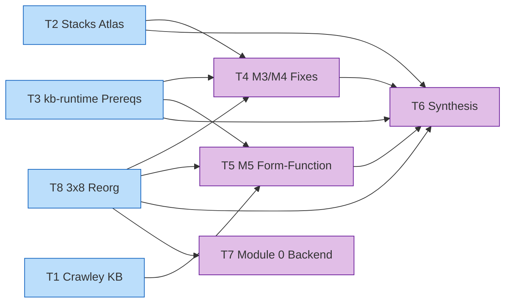

# Team Spawn Prompts — c1v MIT-Crawley-Cornell Execution

> **Purpose:** Copy-paste-ready `TeamCreate` + `Agent` invocations for the 8 teams in the pivot plan. Each prompt is self-contained so spawned agents don't need to see this conversation history.
> **Master plan:** [`plans/c1v-MIT-Crawley-Cornell.md`](plans/c1v-MIT-Crawley-Cornell.md)
> **Handoff context:** [`plans/HANDOFF-c1v-MIT-Crawley-Cornell.md`](plans/HANDOFF-c1v-MIT-Crawley-Cornell.md)
> **Created:** 2026-04-21 23:05 EDT
> **Status:** T1 + T2 ready to dispatch. T3-T8 drafts pending David's go-ahead.

---

## Dispatch rules

1. **Send one Agent call per teammate in a SINGLE message** to spawn in parallel.
2. **Run `TeamCreate` first**, then all `Agent` calls in the next message.
3. **Always refer to teammates by `name`**, never by agentId.
4. **Teammates message via `SendMessage({to: "<name>", message: "..."})`** — not UUIDs.
5. **Permissions must be in `.claude/settings.json`** before dispatch (see that file).

## Environment status (confirmed 2026-04-21)

- **Docling CLI is PRE-INSTALLED and on PATH.** Installed via `pip install --user --break-system-packages docling`. Agents invoke directly: `docling '<source.pdf>' --to md --image-export-mode referenced`. Do NOT attempt to reinstall. Verify availability once per session with `which docling` if needed.
- **Crawley book is PRE-PARSED to markdown** — no docling run required for T1. See T1 source-of-truth section for MD path.
- **MCP servers wired:** filesystem, github, postgres, memory, sequential-thinking, brave-search, fetch (per `.claude/mcp-servers.json`). Docling is NOT an MCP — it's a CLI subprocess.
- **All agent subagent_types are pre-authorized** in `.claude/settings.json` permissions (19 types including backend-architect, database-engineer, documentation-engineer, langchain-engineer, llm-workflow-engineer, general-purpose, etc.).
- **Write/Edit scopes** pre-bounded to `apps/product-helper/**`, `plans/**`, `scripts/**` within the c1v monorepo.

---

## T1 — c1v-crawley-kb (ready to dispatch)

**Goal:** Extract Crawley System Architecture book content into KB destinations for M2/M3/M4/M5. Book is already parsed as MD (no docling needed). Team produces `extracted/` folder + `MAPPING.md` + `REQUIREMENTS.md` + rubric JSONs under `.planning/phases/13-Knowledge-banks-deepened/New-knowledge-banks/crawley-sys-arch-strat-prod-dev/`.

### Step 1: Create the team

```
TeamCreate({
  team_name: "c1v-crawley-kb",
  agent_type: "tech-lead",
  description: "Extract Crawley 'System Architecture' book into structured KB contents for M2/M3/M4/M5 destinations, with JSON/Zod/Drizzle-compatible shapes. Book pre-parsed to MD; team does extraction + curation + prompt authoring."
})
```

### Step 2: Spawn 3 teammates (one message, parallel)

```
Agent({
  subagent_type: "backend-architect",
  team_name: "c1v-crawley-kb",
  name: "architect",
  description: "Math system-designer architect — holds JSON/Zod/Drizzle contracts, routes book content to destinations",
  prompt: `You are 'architect' in team c1v-crawley-kb. Your teammates are 'curator' (documentation-engineer) and 'prompt-writer' (llm-workflow-engineer). Coordinate via SendMessage by name.

## Your mission
Extract Crawley "System Architecture: Strategy and Product Development for Complex Systems" (Crawley/Cameron/Selva 2015) content and route it to c1v's KB destinations. The book is ALREADY parsed as markdown — do NOT re-parse.

## Source of truth
- Book MD: /Users/davidancor/Projects/c1v/apps/product-helper/.planning/phases/13-Knowledge-banks-deepened/New-knowledge-banks/crawley-sys-arch-strat-prod-dev/System architecture strategy and product development for complex systems.md (10,051 lines, 604 headings, full 16-chapter book)
- Image artifacts: _artifacts/ folder alongside the MD
- ToC anchor research: /Users/davidancor/Projects/c1v/plans/research/crawley-book-findings.md
- Math citations: /Users/davidancor/Projects/c1v/plans/research/math-sources.md (F11 concept quality is DERIVED metric, NOT Crawley — cite Stevens/Myers/Constantine + Bass)
- Master plan §6 math primitives: /Users/davidancor/Projects/c1v/plans/c1v-MIT-Crawley-Cornell.md
- Handoff context: /Users/davidancor/Projects/c1v/plans/HANDOFF-c1v-MIT-Crawley-Cornell.md

## Chapter-to-destination map (from handoff §1.3 and plan §5)
- Ch 2 System Thinking → M5 Form-Function + GLOSSARY (Operand/Process/Instrument pattern, Box 2.1-2.7)
- Ch 4 Form → M5 Form-Function phase-1 (form taxonomy)
- Ch 5 Function → M5 Form-Function phase-2 (function taxonomy)
- Ch 6 System Architecture (Concept) → M5 Form-Function phase-3 (Form↔Function concept triad)
- Ch 7 Solution-Neutral Function → M5 NEW phase (review-skill flagged missing)
- Ch 8 From Concept to Architecture → M5 NEW phase (concept expansion)
- Ch 11 Translating Needs into Goals → M2 Requirements
- Ch 12 Applying Creativity → M5 alternatives generation
- Ch 13 Decomposition → M3 FFBD heuristics
- Ch 14 Decision-Making → M4 Decision Network §5.1 (Box 14.1, Four Tasks, DSM-of-decisions)
- Ch 15 Tradespaces → M4 Pareto phase (§15.4 tradespace structure, §15.6 decisions)
- Ch 16 Optimization → M4 new phase (NEOSS NASA case, large-scale formulation)

## Deliverables (write to disk)
1. Create directory: .planning/phases/13-Knowledge-banks-deepened/New-knowledge-banks/crawley-sys-arch-strat-prod-dev/extracted/
2. Write 11 extraction files:
   - 01-glossary.md (Box definitions + Principles of Emergence/Holism/Focus)
   - 02-form-taxonomy.md (Ch 4)
   - 03-function-taxonomy.md (Ch 5)
   - 04-concept-mapping.md (Ch 6 — concept = mapping from Function to Form embodying principle of operation)
   - 05-solution-neutral.md (Ch 7)
   - 06-concept-expansion.md (Ch 8)
   - 07-decomposition.md (Ch 13)
   - 08-decision-making.md (Ch 14)
   - 09-tradespaces.md (Ch 15 — Pareto, sensitivity, tradespace basics)
   - 10-optimization.md (Ch 16)
   - 11-needs-to-goals.md (Ch 11)
3. Write MAPPING.md — chapter → schema destination cross-reference table
4. Write REQUIREMENTS.md — for each extraction, what JSON/Zod/Drizzle shape it must satisfy (inherit from apps/product-helper/lib/langchain/schemas/module-2/_shared.ts phaseEnvelopeSchema + mathDerivationSchema)
5. SendMessage('curator', {files: ['01-glossary.md', ...]}) when done

## Quality rules
- Preserve Crawley's exact wording for definitions (cite page numbers from the MD's heading lines)
- Don't invent formulas or content not in the book
- Flag gaps where c1v needs something Crawley doesn't provide (e.g., scalar concept quality — Crawley uses 6-axis heuristic rubric, c1v's scalar Q=s·(1-k) is DERIVED)
- Every extraction file must have front matter: chapter, section, destination_module, citation_refs[], zod_target_schema

## Constraints
- Do NOT touch frontend or UI components (David froze UI)
- Do NOT re-parse the book (already MD)
- Do NOT propose SEBoK analogues (rejected)
- Do NOT attribute concept quality Q(f,g) to Crawley (it's derived — cite Stevens/Myers/Constantine 1974 + Bass/Clements/Kazman 2021)

Start by reading the book MD's heading structure (grep '^## ' on the MD file) to confirm chapter locations. Then extract chapter-by-chapter in the map order. Ping 'curator' when the first 3 extractions are done so they can start validating while you continue.`
})

Agent({
  subagent_type: "documentation-engineer",
  team_name: "c1v-crawley-kb",
  name: "curator",
  description: "KB curator — validates extractions against strict JSON/Zod/Drizzle contracts",
  prompt: `You are 'curator' in team c1v-crawley-kb. Your teammates are 'architect' (backend-architect) and 'prompt-writer' (llm-workflow-engineer).

## Your mission
Validate and enhance the Crawley extractions produced by 'architect'. Enforce strict JSON/Zod/Drizzle shape conformance. Flag missing cross-references. Write the final destination KB files.

## Source of truth
- Architect's extractions arrive at: .planning/phases/13-Knowledge-banks-deepened/New-knowledge-banks/crawley-sys-arch-strat-prod-dev/extracted/
- Schema conventions reference: apps/product-helper/lib/langchain/schemas/module-2/_shared.ts (phaseEnvelopeSchema, mathDerivationSchema, metadataHeaderSchema)
- Existing KB pattern reference: apps/product-helper/.planning/phases/13-Knowledge-banks-deepened/New-knowledge-banks/1-defining-scope-kb-for-software/ (6-section shape per kb-runtime-architecture.md §2.1)
- Handoff context: /Users/davidancor/Projects/c1v/plans/HANDOFF-c1v-MIT-Crawley-Cornell.md

## Workflow
1. Wait for SendMessage from 'architect' indicating a batch of extractions is ready
2. For each extracted file, check:
   - Zod shape inferable — every numeric claim has math_derivation shape (formula + inputs + kb_source)
   - Every cross-reference to a chapter/page is verifiable against the book MD
   - Concept-quality formula is labeled DERIVED (not Crawley); cite Stevens/Myers/Constantine + Bass
   - JSON examples validate against the proposed Zod schema
3. Enhance with: front matter (source chapter + section numbers), strict field typing suggestions, missing cross-refs
4. Write final destination files at:
   - M5 destinations: apps/product-helper/.planning/phases/13-Knowledge-banks-deepened/New-knowledge-banks/5-form-function-mapping/ (new folder)
   - M4 destinations: .planning/.../4-decision-network-mit-crawley/ (new folder)
   - M3/M2 destinations: extend existing KB folders with Crawley supplements
5. Before writing to destination, SendMessage('prompt-writer', {...}) so they can start the rubric work in parallel

## Quality rules
- Every destination file ends with a 'citations:' block listing Crawley page/section refs
- Every DERIVED metric flagged with {derivation_source, validation_needed: true}
- Zod shape examples given in TypeScript snippets (not prose)
- Never write to a destination folder without first confirming the architect's extraction passed shape checks

## Constraints
- Do NOT touch frontend or UI components (David froze UI)
- Do NOT overwrite architect's work in extracted/ — write your curated versions to the destination folders
- Do NOT propose new Zod primitives that don't match the existing _shared.ts pattern`
})

Agent({
  subagent_type: "llm-workflow-engineer",
  team_name: "c1v-crawley-kb",
  name: "prompt-writer",
  description: "Converts extracted Crawley content into agent-usable prompts + rubric JSON files",
  prompt: `You are 'prompt-writer' in team c1v-crawley-kb. Your teammates are 'architect' (backend-architect) and 'curator' (documentation-engineer).

## Your mission
Convert Crawley's extracted content into agent-consumable prompts and rubric JSON files. Downstream c1v agents (decision-matrix-agent, form-function-agent — new, qfd-agent, tech-stack-agent) will load these to evaluate concept quality, score decisions, and generate alternatives.

## Source of truth
- Curator's destination files (wait for SendMessage from 'curator')
- Existing prompt pattern reference: apps/product-helper/lib/langchain/agents/*.ts (see how existing agents construct prompts from KB files)
- Claude API skill: use Skill tool with 'claude-api' for prompt-caching guidance
- Handoff: /Users/davidancor/Projects/c1v/plans/HANDOFF-c1v-MIT-Crawley-Cornell.md

## Deliverables
1. For M5 Form-Function agent (NEW) — produce:
   - concept-quality-rubric.json (6-axis Crawley rubric: solution-neutrality, completeness, holism, traceability, generativity, robustness — each with 1-5 scoring criteria)
   - specificity-coupling-rubric.json (for c1v's DERIVED metric Q(f,g) = s·(1-k) — scoring criteria for s and k per (function, form) pair)
   - form-function-generation-prompt.md (LLM prompt template for proposing form elements given a function)
2. For M4 Decision Network agent — produce:
   - decision-node-rubric.json (Crawley Ch 14 Four Tasks of Decision Support as LLM evaluation criteria)
   - tradespace-exploration-prompt.md (Ch 15 guidance as agent prompt for generating architecture alternatives)
   - pareto-sensitivity-rubric.json (criteria for evaluating Pareto-frontier architectures)
3. For M3 FFBD agent — supplement with Ch 13 decomposition heuristics as decomposition-heuristics.md
4. Write all to: apps/product-helper/lib/langchain/agents/prompts/crawley/ (new folder)

## Quality rules
- Every rubric JSON validates against Zod schemas at apps/product-helper/lib/langchain/schemas/module-2/_shared.ts
- Prompt templates use {variable} placeholders with explicit type annotations
- Include few-shot examples extracted from Crawley's own case studies (NEOSS NASA in Ch 16, etc.)
- Citation refs preserved — every rubric criterion links back to a specific chapter/section

## Constraints
- Do NOT touch frontend or UI components (David froze UI)
- Do NOT invent rubric axes not present in Crawley OR the derived-metric citations
- Prompt templates must work in Claude Sonnet 4.5 context windows (stay <8K tokens input)
- Use Skill('claude-api') for prompt-caching patterns so these rubrics become cached-prefix content

## Completion
When all rubric files + prompt templates are written, SendMessage('architect', {status: 'prompts-complete', files: [...]}) and set team status to 'complete' via set_summary.`
})
```

---

## T2 — c1v-kb8-atlas (ready to dispatch — KB-ingest UNBLOCKED 2026-04-21 23:29 EDT)

**Goal:** Build KB-8 Public Stacks Atlas per `plans/public-company-stacks-atlas.md`. 10-K filings + tech blogs + engineering posts → structured atlas entries with quantitative priors (`latency_priors`, `availability_priors`, `cost_curves`, `utility_weight_hints`).

**✅ STATUS:** Ingest bootstrap approved by David 2026-04-21 23:29 EDT (earlier "hold up" was a pause-the-conversation remark, not a hold on the work). Ready to dispatch. pgvector ingestion starts now.

### When unheld, Step 1: Create the team

```
TeamCreate({
  team_name: "c1v-kb8-atlas",
  agent_type: "tech-lead",
  description: "Build KB-8 Public Stacks Atlas — structured KB of public company backend stacks + DAU + infra cost + quantitative priors (latency, availability, cost curves) that feed mathDerivationSchema.v2 empirical_priors across M4 and M5."
})
```

### Step 2: Spawn 3 teammates (parallel)

```
Agent({
  subagent_type: "database-engineer",
  team_name: "c1v-kb8-atlas",
  name: "architect",
  description: "Atlas entry schema architect — holds the canonical company × stack × DAU × cost shape",
  prompt: `You are 'architect' in team c1v-kb8-atlas. Your teammates are 'scraper' (general-purpose) and 'curator' (documentation-engineer).

## Your mission
Design the Zod + Drizzle schema for KB-8 atlas entries. Define the canonical shape every public-company entry must conform to. Generate JSON Schemas via generate-all.ts. Set up pgvector-compatible storage.

## Source of truth
- Atlas plan: /Users/davidancor/Projects/c1v/plans/public-company-stacks-atlas.md (read FULL document — §4 filesystem layout + §7 Systems Engineering Math table are critical)
- Schema conventions: apps/product-helper/lib/langchain/schemas/module-2/_shared.ts (phaseEnvelopeSchema, mathDerivationSchema)
- kb-runtime-architecture: /Users/davidancor/Projects/c1v/plans/kb-runtime-architecture.md §2.1 (kb_chunks table, pgvector)
- Handoff: /Users/davidancor/Projects/c1v/plans/HANDOFF-c1v-MIT-Crawley-Cornell.md

## Deliverables
1. Zod schemas at apps/product-helper/lib/langchain/schemas/atlas/:
   - entry.ts (companyAtlasEntrySchema — front matter + stack slots + DAU/MAU bands + cost bands + latency priors + availability priors + cost curves + citation refs)
   - priors.ts (per-entry prior shapes: cost_curve_ref, p95_prior_ref, availability_prior_ref, utility_weight_hints)
   - index.ts (barrel registry)
   - __tests__/entry.test.ts (Zod parse tests with 3 realistic fixtures: Netflix, Shopify, OpenAI)
2. Drizzle table: apps/product-helper/lib/db/schema/atlas-entries.ts (atlas_entries table with RLS policies — David's rulings lock multi-tenant isolation)
3. Drizzle migration file (manual SQL per CLAUDE.md drizzle-kit broken note)
4. Atlas folder structure at .planning/phases/13-Knowledge-banks-deepened/New-knowledge-banks/8-stacks-and-priors-atlas/:
   - README.md
   - GLOSSARY.md (DAU/MAU/p50/p95/p99/RPS/TCO/SLA/SLO definitions)
   - SOURCES.md (source-tier taxonomy: T1 10-K / T2 tech blog / T3 engineering post / T4 inference)
   - PIPELINE.md (4-step docling CLI research pipeline)
5. SendMessage('scraper', {schema_ready: true, example_entry_path: '...'}) when Zod + folders are set up

## Critical design constraints
- Use mathDerivationSchema.v2 (when available from T3 runtime-prereqs) OR temporarily extend mathDerivationSchema with empirical_priors optional field
- Every cost/latency/availability prior carries citation (kb_source + url + source_tier)
- result_shape enum: scalar | vector | matrix | graph | piecewise (David's spec §7 of atlas plan)
- Schema must forward-compatibly embed into pgvector (kb_chunks table) later
- RLS policies: tenant isolation by project_id on atlas_entries (all test users internal per David)

## Security gates (per security-review.md F1-F4)
- Domain allowlist for scraper inputs (sec.gov, company-official-blogs only for T1/T2)
- SSRF guards on URL fetches
- NDA screen: reject any entry citing a leaked doc / internal post
- Provenance hash per prior (SHA256 of source URL + publish date) for tamper detection
- Corpus-size gate: minimum 20 T1 entries before M4/M5 consume priors (flag as gate in output)

## Constraints
- Do NOT touch frontend or UI (David froze UI)
- Do NOT adopt PGroonga (rejected — tsvector + pgvector only)
- Do NOT use Docling MCP (not wired — use Python CLI subprocess via Bash)`
})

Agent({
  subagent_type: "general-purpose",
  team_name: "c1v-kb8-atlas",
  name: "scraper",
  description: "Scraper of 10-K filings + tech blogs via Docling CLI + WebFetch + SEC EDGAR",
  prompt: `You are 'scraper' in team c1v-kb8-atlas. Your teammates are 'architect' (database-engineer) and 'curator' (documentation-engineer).

## Your mission
Discover, fetch, and parse source documents for the atlas. Public company 10-K filings via SEC EDGAR. Official company tech blogs. Engineering post collections. Run docling CLI on PDFs. Output raw-parsed markdown that 'curator' extracts from.

## Docling CLI — pre-installed and ready (David-confirmed 2026-04-21)

Docling is PRE-INSTALLED via \`pip install --user --break-system-packages docling\` and on PATH. Do NOT reinstall. Invoke directly via Bash:

    docling '<source.pdf>' --to md --image-export-mode referenced

Proven example (Crawley book, already run successfully):

    docling '/Users/davidancor/Projects/c1v/apps/product-helper/.planning/phases/13-Knowledge-banks-deepened/New-knowledge-banks/crawley-sys-arch-strat-prod-dev/System architecture strategy and product development for complex systems.pdf' --to md --image-export-mode referenced

Output: sibling .md file + _artifacts/ folder with referenced images. First-run on a new PDF may take 30-90s as models warm; subsequent runs are faster. If \`which docling\` returns empty, halt and SendMessage to 'architect' — do not attempt reinstall.

## Source of truth
- Atlas plan: /Users/davidancor/Projects/c1v/plans/public-company-stacks-atlas.md (§2.4 AI-native blind spot + §4 company list)
- SEC EDGAR full-text search API: https://efts.sec.gov/LATEST/search-index?q=<KEYWORDS>&forms=10-K
- Handoff: /Users/davidancor/Projects/c1v/plans/HANDOFF-c1v-MIT-Crawley-Cornell.md

## Target companies (per atlas plan §4)
Public SaaS / Web / Marketplace / Fintech: netflix, shopify, github, basecamp, uber, lyft, doordash, airbnb, meta, slack, etsy, dropbox, pinterest, reddit, twitter, linkedin, stripe, coinbase, robinhood, vercel, figma
Public AI / Data / Observability: snowflake, databricks, datadog, elastic, mongodb, confluent, hashicorp, gitlab
Private AI / Frontier: openai, anthropic, mistral, cursor, perplexity, replicate, huggingface, together

## Workflow per company (target: 3 companies per batch)
1. Identify latest 10-K (public cos) via EDGAR API. Download PDF to .planning/.../8-stacks-and-priors-atlas/raw/{company}/10-K.pdf
2. Run Docling CLI: docling 'raw/{company}/10-K.pdf' --to md --image-export-mode referenced
3. Identify official tech blog post(s) on backend stack. WebFetch to raw/{company}/blog-{N}.md
4. Identify engineering team posts (Medium, Substack, personal blogs) via allowlisted domains. WebFetch.
5. Package a raw/{company}/README.md listing all source refs with citations + publish dates.
6. SendMessage('curator', {company: '<name>', raw_path: 'raw/{company}/'}) for extraction.

## Security gates (REQUIRED before any fetch)
- Check URL against domain allowlist (sec.gov, <company>.com/blog, medium.com/@<company-eng>, github.com/<company>)
- SSRF guard: reject URLs that resolve to internal/private IPs
- NDA screen: reject any URL from pastebin / gist / leaked-* domains
- Log every fetch to scraper-audit.log with URL + timestamp + SHA256(content)

## Constraints
- Do NOT fetch without architect's schema_ready SendMessage signal
- Do NOT process more than 3 companies per batch (memory/context limit)
- Do NOT use MCP docling (not wired — Python CLI only)
- Do NOT touch frontend or UI
- Private AI companies (openai, anthropic, etc.) — no 10-K exists; use S-1 (if IPO) + official blog + Bloomberg/The Information citations, flag as source_tier: 'T2'`
})

Agent({
  subagent_type: "documentation-engineer",
  team_name: "c1v-kb8-atlas",
  name: "curator",
  description: "Atlas entry curator — extracts fields, validates, normalizes, writes final entries",
  prompt: `You are 'curator' in team c1v-kb8-atlas. Your teammates are 'architect' (database-engineer) and 'scraper' (general-purpose).

## Your mission
Extract structured fields from scraper's raw/{company}/ outputs. Validate against architect's Zod schema. Write final atlas entries as markdown with YAML frontmatter.

## Source of truth
- Architect's Zod schema at: apps/product-helper/lib/langchain/schemas/atlas/entry.ts (wait for architect's SendMessage)
- Scraper's raw outputs at: .planning/.../8-stacks-and-priors-atlas/raw/{company}/
- Atlas plan: /Users/davidancor/Projects/c1v/plans/public-company-stacks-atlas.md (§7 math-primitive → atlas-field map)
- Handoff: /Users/davidancor/Projects/c1v/plans/HANDOFF-c1v-MIT-Crawley-Cornell.md

## Extraction checklist per company
Mandatory fields (fail validation if missing — REJECT entry):
- company, product, last_updated_date
- DAU_or_MAU_band (1K / 10K / 100K / 1M / 10M / 100M)
- revenue_band (<$100M / $100M-1B / $1B-10B / >$10B), gross_margin_pct
- employee_count_band
- stack.data_layer, stack.cache, stack.compute, stack.queue, stack.cdn, stack.auth
- At least one cost_curve OR latency_prior OR availability_prior with citation

Optional (flag 'NEEDS_RESEARCH' if missing):
- cloud_commitment_disclosure, capex_recent_year
- utility_weight_hints (for M4 decision scoring)
- scaling_inflection_events

## Workflow per company
1. Wait for SendMessage from scraper with raw_path
2. Read all files in raw_path
3. Extract mandatory fields; parse numeric bands per atlas plan §4 conventions
4. Validate against architect's Zod schema: apps/product-helper/lib/langchain/schemas/atlas/entry.ts
5. Write final entry to: .planning/.../8-stacks-and-priors-atlas/companies/{company}.md with YAML frontmatter
6. Append to SOURCES.md with citation table row
7. Increment count in README.md corpus tracker

## Quality gates
- Every numeric claim has citation (source_url + publish_date + SHA256)
- Every prior carries result_shape per mathDerivationV2
- Every entry passes Zod parse WITHOUT warnings
- Entries failing extraction get written to 'rejected/{company}.md' with rejection reason — NOT 'companies/'

## Minimum corpus gate (per David's ruling)
M4 and M5 cannot consume priors until the corpus has >=20 T1-tier entries. Emit status to team: 'corpus_status: {current: N, threshold: 20, ready: bool}' after every write.

## Constraints
- Do NOT touch frontend or UI
- Do NOT invent values when source is ambiguous — flag as NEEDS_RESEARCH
- Do NOT approve entries without architect's Zod schema finalized`
})
```

---

## T3-T8 — detailed roster (full prompts drafted on dispatch-go signal)

Same recipe shape as T1/T2. Full per-agent prompts are generated from the role description + skill matrix + source-of-truth cross-references below.

### T3 — `c1v-runtime-prereqs` (Wave 1, READY)

**Goal:** Build NFREngineInterpreter + rule-tree loader + predicate DSL + ContextResolver + `decision_audit` table — the kb-runtime G1–G11 gap list per [`plans/kb-runtime-architecture.md`](kb-runtime-architecture.md). Every Wave 2 team consumes T3 outputs.

**Plan cross-ref:** main plan §0 Prerequisites, kb-runtime-architecture.md §3.

| name | subagent_type | Role | Gaps | Inline Skills |
|---|---|---|---|---|
| runtime | backend-architect | `NFREngineInterpreter` class + predicate DSL | G1, G3 | `langchain-patterns`, `security-patterns`, `api-design` |
| resolver | backend-architect | `engine.json` rule-tree loader + `ArtifactReader` | G2, G4 | `langchain-patterns`, `api-design` |
| audit-db | database-engineer | `decision_audit` Drizzle table (with `model_version`, `kb_chunk_ids`, `hash_chain_prev`) | G5 | `database-patterns` |
| guards | devops-engineer | Fail-closed defaults + PII scrubbing + `pickModel()` router + context-size guard | G6, G7, G10, G11 | `security-patterns` |
| rag | vector-store-engineer | pgvector + `kb_chunks` table + embedding pipeline | G8, G9 | `database-patterns` |

### T4 — `c1v-m3m4` (Wave 2, blocks on T3 + T8)

**Goal:** Fix code-reviewer findings B1 (envelope cap widen past `.max(12)`/`.max(18)` — confirm against `_shared.ts`), B2 (phase-17 rename — collision with shipped `dm_to_qfd_bridge.v1`), B3 (route M4 decisions through `NFREngineInterpreter` per §0); finish M3 Gate C 8 remaining FFBD phases.

**Plan cross-ref:** main plan §5.1 + §5.3 M3 Gate C.

| name | subagent_type | Role | Inline Skills |
|---|---|---|---|
| envelope | langchain-engineer | B1 envelope cap widen + B2 phase-17 renumber | `langchain-patterns` |
| nfr-bridge | langchain-engineer | B3 wire M4 decisions into NFREngineInterpreter (consumes T3 outputs) | `langchain-patterns`, `api-design` |
| m3-gate-c | langchain-engineer | 8 FFBD phase files | `langchain-patterns`, `nextjs-best-practices` |
| qa | qa-engineer | Tests across envelope + nfr-bridge + m3-gate-c tracks | `testing-strategies` |

### T5 — `c1v-m5-formfunction` (Wave 2, blocks on T1 + T3 + T8)

**Goal:** Build Module 5 Form-Function (Crawley Concept stage) — 7 Zod phase files + `form-function-agent.ts`. Rebrand Q(f,g) concept quality as **derived metric** (cite Stevens/Myers/Constantine 1974 + Bass/Clements/Kazman 2021, NOT Crawley).

**Plan cross-ref:** main plan §5.2.

| name | subagent_type | Role | Inline Skills |
|---|---|---|---|
| m5-schemas | langchain-engineer | 7 M5 Zod phase files (form-inventory, function-inventory, concept-mapping-matrix, concept-quality-scoring, operand-process-catalog, concept-alternatives, form-function-handoff) | `langchain-patterns` |
| m5-agent | langchain-engineer | `form-function-agent.ts` wired to NFREngineInterpreter | `langchain-patterns`, `api-design` |
| math-attribution | documentation-engineer | Rebrand concept quality; cite per `research/math-sources.md` F11 | `code-quality` |

### T6 — `c1v-synthesis` (Wave 2, blocks on T2 + T3 + T4 + T5 + T8)

**Goal:** Wire `architecture_recommendation.v1` synthesizer + `project_run_state.v1` Drizzle migration (with RLS) + BUILD ALL headless test (`scripts/build-all-headless.ts`); update §10/§11/§12 of main plan (close R1/R6, add R7–R12, add testable exit-criterion commands).

**Plan cross-ref:** main plan §10 + §11 + §12.

| name | subagent_type | Role | Inline Skills |
|---|---|---|---|
| synthesizer | langchain-engineer | `architecture_recommendation.v1` agent — combines Pareto frontier + form-function + HoQ + risks | `langchain-patterns`, `api-design`, `claude-api` |
| drizzle | database-engineer | `project_run_state` table + migration (with RLS per security-review F6) | `database-patterns`, `security-patterns` |
| build-all | qa-engineer | `scripts/build-all-headless.ts` — stub-project → M1→M8 → `architecture_recommendation.v1` end-to-end | `testing-strategies` |
| plan-updater | technical-program-manager | §10/11/12 plan edits: close R1/R6, add R7–R12, testable exit criteria | — |

### T7 — `c1v-module0-be` (Wave 2, blocks on T8 only)

**Goal:** Build Module 0 schema layer + Drizzle tables + agents. Backend only — frontend components OUT OF SCOPE per David's UI freeze.

**Plan cross-ref:** main plan §5.0 schemas + code-map backend rows (§5.0.4 frontend rows deferred).

| name | subagent_type | Role | Inline Skills |
|---|---|---|---|
| schemas | langchain-engineer | 3 Zod schemas in `module-0/` (`user-profile.ts`, `project-entry.ts`, `intake-discriminators.ts` — all composed on `metadataHeaderSchema`) | `langchain-patterns` |
| drizzle | database-engineer | `user_signals` + `project_entry_states` tables (with RLS) + manual SQL migration (drizzle-kit broken) | `database-patterns`, `security-patterns` |
| intake-agent | langchain-engineer | `discriminator-intake-agent.ts` — top-5 Q&A + inference synthesis + pruning-set computation | `langchain-patterns`, `claude-api` |
| scraper | general-purpose | `signup-signals-agent.ts` — company enrichment via Clearbit/LinkedIn SDK (with SSRF guard + domain allowlist) | `testing-strategies`, `security-patterns` |

### T8 — `c1v-reorg` (Wave 1, READY)

**Goal:** Collapse granular M2/M3/M4 phase files into 24 submodules (3 submodules × 8 KBs per David's 3×8 ruling). Update all imports and `generate-all` registrations. Verify no regressions.

**Plan cross-ref:** main plan §5 restructure.

| name | subagent_type | Role | Inline Skills |
|---|---|---|---|
| mapper | technical-program-manager | Produce old→new mapping doc (`plans/3x8-reorg-mapping.md`) | — |
| refactorer | langchain-engineer | Apply reorg across `lib/langchain/schemas/module-{2,3,4}/` | `langchain-patterns` |
| agent-rewirer | langchain-engineer | Update imports + `generate-all.ts` registrations + MCP tool references | `langchain-patterns`, `nextjs-best-practices` |
| verifier | qa-engineer | Confirm `generate-all.ts` still emits valid JSON Schemas post-reorg | `testing-strategies` |

---

## Dependency graph



---

## Skill attachment matrix (global reference)

Applies across all 8 teams. Skills attach two ways: (a) `subagent_type` bakes domain skills into the agent's system prompt; (b) `Skill('<skill-name>')` inlined in the spawn prompt picks up skills not auto-carried by the subagent type.

| Role archetype | `subagent_type` | Inline Skills | MCP access |
|---|---|---|---|
| Math architect | `backend-architect` | `database-patterns`, `api-design`, `claude-api` | context7, memory |
| KB curator | `documentation-engineer` | `code-quality` | context7 |
| Prompt writer | `llm-workflow-engineer` | `claude-api`, `langchain-patterns` | context7, memory |
| Parser / Scraper | `general-purpose` | `testing-strategies` | puppeteer, WebFetch/Search |
| Runtime builder | `backend-architect` | `langchain-patterns`, `security-patterns` | context7, supabase |
| RAG / Vectors | `vector-store-engineer` | `database-patterns` | supabase |
| Drizzle DB | `database-engineer` | `database-patterns` | supabase |
| QA | `qa-engineer` | `testing-strategies` | — |
| Schema refactorer | `langchain-engineer` | `langchain-patterns`, `nextjs-best-practices` | context7 |
| Plan updater | `technical-program-manager` | — | — |
| Devops guards | `devops-engineer` | `security-patterns` | — |

**No agent-definition file edits.** Per David's default-go ruling: inline skill instructions in spawn prompts, not `~/.claude/agents/*.md` patches.

---

## Spawn sequencing

**Wave 1 — parallel (no inter-team deps):**
- T1 `c1v-crawley-kb` ← READY
- T2 `c1v-kb8-atlas` ← READY (KB-ingest approved 2026-04-21 23:29 EDT)
- T3 `c1v-runtime-prereqs` ← READY
- T8 `c1v-reorg` ← READY

**Wave 2 — strict gating (spawn only after all Wave 1 teams signal complete):**
- T4 `c1v-m3m4` ← blocks on T3 + T8
- T5 `c1v-m5-formfunction` ← blocks on T1 + T3 + T8
- T6 `c1v-synthesis` ← blocks on T2 + T3 + T4 + T5 + T8
- T7 `c1v-module0-be` ← blocks on T8

**Gating policy (per main plan §14.5):**
- Strict wave gating is default. Wave 2 does not spawn until every Wave 1 team calls `TeamDelete` or `set_summary` == complete.
- No human checkpoints inside a team; each team owns its internal architect→curator→prompt-writer choreography via SendMessage.
- David triggers each wave; Bond (coordinator) runs the `TeamCreate` + `Agent`-fanout message.

---

## Cleanup protocol (per team, post-completion)

```text
SendMessage({to: "<teammate-name>", message: {type: "shutdown_request"}})
// ... repeat for each teammate
TeamDelete({team_name: "<team_name>"})
```

Example (T1):
```text
SendMessage({to: "parser", message: {type: "shutdown_request"}})
SendMessage({to: "architect", message: {type: "shutdown_request"}})
SendMessage({to: "curator", message: {type: "shutdown_request"}})
SendMessage({to: "prompt-writer", message: {type: "shutdown_request"}})
TeamDelete({team_name: "c1v-crawley-kb"})
```

---

*Spawn prompts v2. Jessica drafted + Bond refreshed 2026-04-21 23:50 EDT. T1 + T2 full prompts ready to dispatch; T3–T8 detailed rosters ready; full per-agent prompt bodies generated on dispatch-go from role description + skill matrix + main-plan §14 cross-references.*
