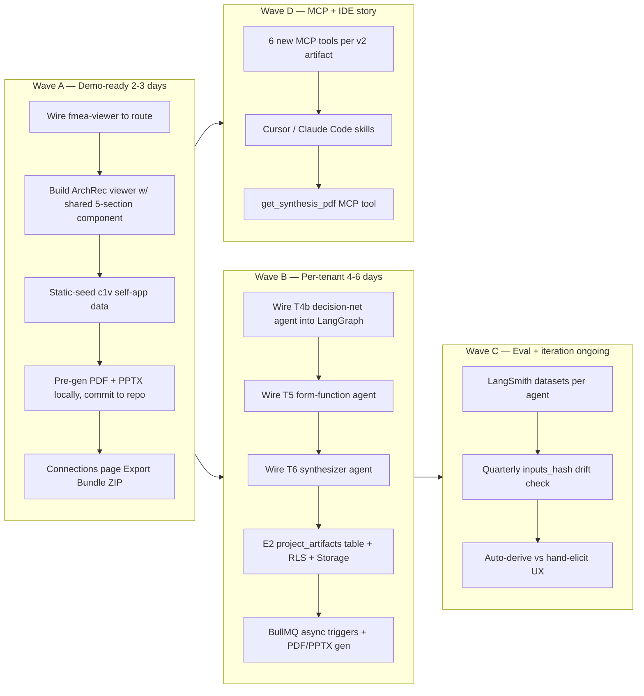

# v2 Runtime Wiring + Display + Artifact Download — Ideation

**Status:** IDEATION — surfacing options/tradeoffs, not yet a written plan
**Author:** Bond
**Created:** 2026-04-25 02:53 EDT
**Scope:** Wire v2 artifacts (decision_network, form_function_map, fmea_residual, hoq, ffbd_v2, data_flows, architecture_recommendation) into runtime production. Decide display contract. Decide artifact download formats — **PPT and PDF must ship in Wave A demo.**

---

## Dimension A — Generation strategy (where does v2 artifact DATA come from at runtime?)

Three architectures, picking one is the keystone decision:

| Strategy | Latency | Deploy story | Risk |
|---|---|---|---|
| **A1. Server-side Python generators** (subprocess `gen-arch-recommendation` etc. on Vercel) | ~3-8s/artifact (cold start) | Vercel doesn't run Python natively → Edge Functions or migrate to Cloud Run | Byte-identical to self-application HTML, but ops surface ≠ AV.01's "Vercel-only" recommendation |
| **A2. TS-native v2 agents** (extend LangGraph with 6+ new GENERATE_* nodes) | ~1-2s/artifact (Sonnet 4.5 p95=1100ms × parallelism) | Native runtime, deploys on Vercel today | 6 new agents = 6 new prompt-engineering surfaces; envelope contract enforcement everywhere; given the schema/api-spec regression we just diagnosed, this scales the regression risk 6× |
| **A3. Hybrid — TS extracts, Python generates** | ~2-5s/artifact | TS LangGraph populates `*-gen-input.json` shape → BullMQ worker calls Python via Vercel cron OR GitHub Action OR Cloud Run sidecar | Cross-boundary state; debt spreads; but **canonical Python generators stay canonical** |
| **A4. Static-seed (canned c1v self-app)** | Instant — every project sees the c1v synthesis as exemplar data | $0 — pre-generated, committed | No per-tenant generation; demo-only until A2/A3 lights up |

**Read:** A4 → A3 staged. A4 unblocks portfolio demo immediately (static-seeded c1v synthesis displays as canned exemplar). A3 lights up per-tenant generation in Wave B by piping `gen-*` Python generators behind BullMQ. A2 is *what the architecture_recommendation says* (Vercel + LangGraph dominates AV.02/AV.03), but A3 is what the **portfolio narrative** rewards: "the same Python generators that produced the c1v self-application produce every tenant project — your project's `inputs_hash` was computed by the same code that hashed c1v itself."

---

## Dimension B — Display strategy (how do v2 artifacts RENDER?)

Three mechanisms with very different fidelity-vs-control tradeoffs. The self-application HTML at `.planning/runs/self-application/synthesis/architecture_recommendation.html` is the design spec — 5 sections, brand-locked styling, Mermaid via CDN with `theme:'neutral'`, `securityLevel:'loose'`.

| Strategy | Self-app fidelity | Auth/router | Accessibility | Brand drift risk |
|---|---|---|---|---|
| **B1. Iframe srcdoc with HTML blob** (`<iframe srcdoc={html}>`) | 100% byte-identical | Hard — inside iframe, no router context | Inline `<style>` blocks, hard to a11y-audit | None |
| **B2. Full React port** (5 sections via shadcn) | Visual ~95%, structural 100% | Native | Free | Low — brand tokens already match |
| **B3. React shell + raw Mermaid** (sections from JSON, figures from `embeddedArtifacts[].content`) | 100% on figures, 95% on sections | Native | Free | Low |

**Read:** B3. Sections render in React/shadcn (auth, router, dark-mode aware). Mermaid figures come straight from `embeddedArtifacts[i].content` so they're byte-equivalent to the self-application. Use the existing FROZEN `components/diagrams/diagram-viewer.tsx` as the figure renderer — it already handles Mermaid CDN init.

**Subtlety:** the self-app HTML has 5 sections per artifact (callout, rationale, references-table, risks, tradeoffs, embedded-figures). For a 7-artifact suite, that's 35 section instances. Build **one shared `<ArtifactViewer>` component** that takes `{section, content}` props and lays out all five regardless of which artifact — preserves the self-app structure across the whole suite.

---

## Dimension C — Artifact download options

Six artifact families exist on disk per the self-app (`.json`, `.json-enriched`, `.html`, `.xlsx`, `.mmd`, `.md`). User wants `.pptx` and `.pdf` in the demo too — see Dimension M for the format-specific generation paths. The UX layer is independent of format generation:

| Option | UX | Implementation cost | Portfolio fit |
|---|---|---|---|
| **C1. Per-artifact "Download" dropdown** | In each viewer's header, dropdown w/ JSON / HTML / PDF / PPTX / Mermaid / XLSX | Medium — 7 viewers × 6 formats | High — "show your work" pillar |
| **C2. Project-level "Export Bundle" ZIP** | One button on Connections page → ZIP mirroring `system-design/kb-upgrade-v2/module-N/` layout, includes PDF + PPTX at top level | Low — server-side `archiver` + recursive read | Highest — "here's the whole portfolio for your project" |
| **C3. Tiered (C1 + C2)** | Both | High | Highest |
| **C4. Inline "Show source" `<details>`** (matches self-app HTML) | Each Mermaid figure has `<details><summary>show source</summary>` reveal | Low — copy-paste from self-app | High — auditability story |
| **C5. MCP-export parity** | The existing `lib/mcp/claude-md-generator.ts` + `skill-generator.ts` get sibling generators per v2 artifact. AI agents (Claude Code, Cursor) can pull v2 outputs via MCP tool calls including `get_pdf_export`, `get_pptx_export`. | Medium — 6 new MCP tools | Highest — c1v's IDE differentiator |

**Read:** ship **C2 + C4 + C5** in Wave A. C1 (per-artifact dropdown) is a nice-to-have — the bundle ZIP and inline source covers 90% of demo intent. **C5 is the dark-horse winner** — Claude Code/Cursor users can pull `architecture_recommendation.pdf` via `get_synthesis_pdf` MCP tool and feed it into their build sessions. That's the portfolio "this is alive in my IDE" demo.

---

## Dimension D — Pipeline trigger (WHEN do v2 artifacts compute?)

Downstream of A:

| Trigger | UX | Cost | When |
|---|---|---|---|
| **D1. Synchronous post-intake** (extend current LangGraph) | One loading state, ~8min | Stretches the already-462s flow. Logs show 462,321ms for project=32 today — adding 6 more agents pushes past 12min. | Don't. |
| **D2. Asynchronous BullMQ jobs** | Skeleton loaders per viewer | T10 BullMQ infra exists; just add 6 job types. ~5-15s per artifact, parallel. | **Recommended for A2/A3.** |
| **D3. Lazy-on-view** | First viewer hit blocks for ~5s | Cheapest — compute only what user sees | Good for low-traffic |
| **D4. Static-seed (c1v self-app)** | Instant — every project sees the c1v synthesis as canned demo data | $0 | **Recommended for A4 (portfolio-first).** |
| **D5. Hybrid by criticality** | sync arch_rec, async heavy artifacts | Complex | If we want both |

**Read:** D4 → D2. Wave A serves canned c1v synthesis for every project as exemplar (PDF/PPTX/HTML/JSON pre-generated locally and committed). Wave B lights up BullMQ async per-tenant gen.

---

## Dimension E — DB shape (where do v2 artifacts PERSIST?)

Today: `project.projectData.intakeState.extractedData.{actors, useCases, decisionMatrix, ffbd, qfd, interfaces}` — single JSONB blob.

v2 plan §15.5 says EXTEND don't replace. But:
- 7 new artifact families × ~50KB each → row size pushes past 350KB. JSONB updates rewrite whole blob → write amplification.
- No per-artifact provenance (`inputs_hash`, `synthesized_at`, `_phase_status`) lives well inside a megablob.
- Manifest semantics (sha256, bytes, run history, PDF/PPTX byte refs) don't fit `extractedData` extension at all.

| Option | Layout | RLS story | Manifest story |
|---|---|---|---|
| **E1. Extend `extractedData`** (per v2 plan) | `extractedData.{decisionNetwork, formFunction, fmeaResidual, hoq, archRecommendation, ffbdV2, dataFlows}` | Inherits `projects` RLS gap (top item in `plans/post-v2-followups.md`) | None — drop manifest |
| **E2. New `project_artifacts` table** | `(project_id, module, artifact_type, version, content jsonb, inputs_hash, sha256, bytes, synthesized_at, _phase_status, format)` | RLS done right from day one (lessons from `project_run_state` T6 work) | Native — table IS the manifest |
| **E3. Both — blob for viewers, table for provenance** | E1 reads, E2 writes | Mixed | Best |

**Read:** E2. The projects-table RLS gap is already a known mess; E1 inherits it. E2 is one Drizzle migration + RLS policies (proven pattern from T6 `project_run_state`). The viewer reads via `eq(projectArtifacts.projectId, ...).where(eq(module, 'M4'))` — cleaner than nested JSONB path traversal. **The table IS the manifest** — `select sha256, synthesized_at, format from project_artifacts where project_id=N order by synthesized_at desc` gives you the provenance ledger free.

For PDF/PPTX: store binary blobs in Supabase Storage (cheap, presigned URLs), keep `format`, `bytes`, `sha256`, `storage_path` in the table. Avoids bloating Postgres.

---

## Dimension F — Reuse map (what existing infra does this lean on?)

| Component | Status | Use as |
|---|---|---|
| `app/api/projects/[id]/artifacts/manifest/route.ts` | T10 shipped | Extend to surface v2 artifacts (incl. PDF/PPTX URLs) |
| `components/project/overview/artifact-pipeline.tsx` | Semi-frozen, manifest-read OK | Extension point for v2 artifact list + download badges |
| `components/diagrams/diagram-viewer.tsx` | Frozen | Mermaid renderer, used by every figure |
| `scripts/artifact-generators/*.py` (13 generators) | T10 shipped | Strategy A3/A4 source-of-truth + PDF/PPTX gen |
| `app/api/mcp/[projectId]/route.ts` + 17 tools | Shipped | Add 6-7 v2 tools incl. `get_synthesis_pdf` (C5) |
| BullMQ pipeline (T10) | Shipped, optional | D2 trigger |
| `lib/mcp/skill-generator.ts` + `claude-md-generator.ts` | Shipped | Template for v2 artifact bundle generation |
| FMEA viewer (T10, 255 LOC) | Shipped, no route | **Wire to a route — no new component needed for fmea_residual** |
| `project_run_state` table + RLS (T6) | Shipped | Pattern for E2 `project_artifacts` |
| Supabase Storage | Available, unused for project artifacts | Binary blob host for PDF + PPTX + XLSX |

**Surprise:** the FMEA viewer **already exists** and is unrouted. Lowest-hanging fruit on the entire roadmap — one route file (`app/(dashboard)/projects/[id]/system-design/fmea-residual/page.tsx`) wires it.

---

## Dimension G — The "real content" gap

The self-application worked because **Bond hand-drove every decision**. The arch-rec D-01..D-04 reflect Bond's tech choices for c1v itself. For tenant projects (Team Heat Guard etc.), v2 needs LLM-generated equivalents:

| v2 artifact | Self-app source | Tenant source needed |
|---|---|---|
| `decision_network.v1.json` | Hand-curated DN.01-A..DN.04-A | NEW agent — `decision-net-agent.ts` (T4b shipped, NOT WIRED) |
| `form_function_map.v1.json` | Hand-mapped F.N → control surfaces | NEW agent — `form-function-agent.ts` (T5 shipped, NOT WIRED) |
| `fmea_residual.v1.json` | Hand-derived from observed risks | NEW agent — fmea-residual-agent (T6 sub-agent shipped, NOT WIRED) |
| `hoq.v1.json` | Hand-elicited 6 PCs × 18 ECs | NEW agent — hoq-agent (T6 sub-agent shipped, NOT WIRED) |
| `architecture_recommendation.v1.json` | Bond's deterministic synthesis | NEW agent — synthesizer (T6 sub-agent shipped, NOT WIRED) |

**The agents EXIST.** They were built by Wave-2 / Wave-3 / Wave-4 but never wired into the runtime LangGraph. Wiring them in is plumbing, not greenfield agent design. But **prompt-engineering surface is real**. Each agent was tested on c1v itself; tenant projects (B2B SaaS heat safety, e-commerce, social platforms) will hit edge cases the c1v test didn't cover. The schema/api-spec regression we just diagnosed shows what happens when a Sonnet 4.5 agent meets unfamiliar PRD shape.

---

## Dimension H — The intake gap

Today's intake (logs.md) does: extractData (actors/useCases) → FFBD → DecisionMatrix → Interfaces → QFD. Five generators in 8 minutes.

v2 needs MORE inputs:
- M0 signup signals (T7) — exists, NOT WIRED
- M2 v2.1 NFRs (26 NFRs incl. 12 fmea-derived) — exists, NOT WIRED
- M2 constants v2.1 (28 constants) — exists, NOT WIRED
- M4 decision criteria with cost/latency/availability/ops-surface tradeoffs per choice — exists, NOT WIRED
- M6 HoQ elicitation (6 PCs × 18 ECs) — exists, NOT WIRED
- M7.b interface_specs with chain budgets — exists, NOT WIRED
- M8.a fmea_early (12 FMs) — exists, NOT WIRED

**Intake conversation length is the bottleneck.** Today's chat does 8 user turns to extract 3 actors + 5 use cases. Adding 6 PCs + 18 ECs + 12 FMs would need ~25 more turns. UX cliff.

**Options:**
1. **Long-form intake** — 45+ min chat with progressive disclosure
2. **Multi-session intake** — split into Phase A (today's), Phase B (NFRs + FMs), Phase C (HoQ + decisions)
3. **Auto-derive** — generate v2 inputs FROM v1 outputs (FFBD → infer FMs, decision-matrix → infer DN nodes). LLM hallucination risk
4. **Hybrid** — auto-derive draft, user reviews + edits in dedicated UI

**Read:** Wave A skips this (static-seed sidesteps tenant inputs). Wave B uses #3 (auto-derive) for first-pass coverage. Wave C ships #4 (review UI).

---

## Dimension I — Eval / determinism

`architecture_recommendation.v1.json` ships `inputs_hash: 559c0c0c…` and `next_steps[3]`: "Re-run synthesis quarterly; recompute inputs_hash to detect drift in upstream artifacts." This is a portfolio anchor — proof the system is deterministic.

For runtime production, every tenant project's arch_rec gets its own `inputs_hash`. Re-running intake MUST produce a reproducible OR cleanly-different hash. That requires:

1. **All inputs versioned** — KB versions, agent versions, prompt template versions
2. **Hash stable across LLM nondeterminism** — temperature=0, but Sonnet 4.5 still has variance. May need to hash structured inputs (extracted entities/decisions) NOT raw LLM outputs
3. **Eval harness per artifact** — does each decision cite a real KB chunk? Does each FM trace to an FFBD function?

LangSmith is the harness today (project=32 already produced 18-row eval dataset). Each new tenant agent → new LangSmith dataset → new evals. Not portfolio-blocking, but production-blocking.

---

## Dimension J — Portfolio sequencing

Given memory `project_c1v_portfolio_positioning` ("portfolio project, not product v1; moat = deterministic LLM system grounded in math with provenance per decision"), wiring priorities are NOT what they'd be for a product launch:



**Wave A unblocks portfolio demo.** Lands in 2-3 days. Every project shows the c1v self-app architecture_recommendation and 7 v2 artifact viewers as a "this is what c1v does" demo. Bundle ZIP downloads work because source files exist on disk + pre-generated PDF/PPTX.

**Wave B turns the demo into per-tenant.** ~4-6 days. Wires the existing T4b/T5/T6 agents into the LangGraph. Schema regression we just found WILL repeat across 6 new agents — fix the pattern (regression doc applies broadly: flat schemas, explicit "all keys required" prompts, runtime test coverage). Per-tenant PDF/PPTX gen via BullMQ Python sidecar.

**Wave C is portfolio polish.** Determinism, evals, drift detection — the differentiator narrative.

**Wave D is the IDE moat.** MCP tool surface for Cursor/Claude Code is what makes c1v a "lives in your IDE" tool, not just another web app.

---

## Dimension K — UX surface (the "first project" experience)

A new user signs up and creates project=33. What should they see?

**Option K1 — Card grid dashboard:** 13 cards (6 v1 viewers + 7 v2 viewers), each with a state badge (`Generating…` / `Ready` / `Skipped`). Tabs by phase: Requirements / System-Design / Backend.

**Option K2 — Linear funnel:** completeness bar at top; sections gated until prior is done. Maps to Cornell pedagogical method.

**Option K3 — Stage-3 reveal:** intake chat → "Quick Start" results (existing) → "Deep Synthesis" page (new, surfaces v2 artifacts post-async-gen).

**Read:** K3 is portfolio-aligned — "here's what 5 minutes of chat got you, here's what 8 minutes of synthesis got you." The "Deep Synthesis" page is where Wave A lands.

---

## Dimension L — Auditability disclosure pattern

Self-app HTML has `<details><summary>show source</summary>` for every Mermaid block. Portfolio move — proves we're not hiding implementation. Every v2 viewer should have:

- "Show JSON" disclosure → raw v1.json
- "Show Mermaid source" disclosure → .mmd contents per figure
- "Show prompt" disclosure → the prompt that produced this artifact (only viable for tenant-generated, not c1v-static)
- "Show derivation chain" disclosure → for arch_rec, the 4-step chain D-01..D-04 → DN nodes → KB chunks → atlas priors

A single "Provenance" accordion component added to `<ArtifactViewer>`. Big portfolio multiplier for ~50 LOC.

---

## Dimension M — Multi-format export (PDF + PPTX REQUIRED in Wave A)

Six format families. User-confirmed PDF + PPTX must ship in demo:

| Format | Wave A? | Generator | Cost / latency | Notes |
|---|---|---|---|---|
| `.json` (v1 envelope) | YES | One file write | $0 | Already on disk |
| `.html` (rendered) | YES | gen-arch-recommendation Python | already shipped | Self-app source-of-truth |
| `.mmd` (Mermaid sources) | YES | Already on disk | $0 | Direct copy |
| `.xlsx` (HoQ + FMEA) | YES | gen-qfd.py + gen-fmea.py | already shipped | Python via T10 generators |
| `.md` (diff/notes) | YES | Already on disk | $0 | Direct copy |
| **`.pdf`** | **YES** | See PDF section below | ~2-3s/render | New for Wave A |
| **`.pptx`** | **YES** | See PPTX section below | ~1-2s/render | New for Wave A |

### M.1 — PDF generation paths

Three viable approaches, ranked by Wave-A fit:

| Path | Engine | Bundle size | Self-app fidelity | Wave A ready? |
|---|---|---|---|---|
| **PDF-1. Headless Chrome via Puppeteer** | `@sparticuz/chromium` on Vercel Edge | ~50MB | 100% — print stylesheet of self-app HTML | YES if we add the dep |
| **PDF-2. weasyprint (Python)** | CSS Paged Media spec | ~40MB Python deps | 100% — direct HTML render | YES via Python sidecar (matches A3) |
| **PDF-3. @react-pdf/renderer (TS)** | React → PDF primitives | ~200KB | ~80% — must rebuild layout in PDF primitives | Painful — rebuilds the 5 sections in a different DSL |

**Read for Wave A (static-seed):** **PDF-2 weasyprint locally**, run once, commit `architecture_recommendation.pdf` into `.planning/runs/self-application/synthesis/`. Zero runtime cost. Same approach for the 6 other v2 artifacts (each gets a static PDF generated from its rendered HTML). Total commit weight ~5-10MB.

**Read for Wave B (per-tenant):** **PDF-1 Puppeteer on Vercel** if staying TS-pure (matches AV.01); OR **PDF-2 weasyprint via Cloud Run sidecar** if going A3 hybrid. Both viable; Cloud Run is cleaner because the Python generators already produce HTML deterministically.

### M.2 — PPTX generation paths

| Path | Engine | Bundle size | Quality | Wave A ready? |
|---|---|---|---|---|
| **PPTX-1. python-pptx** (Python) | Programmatic deck building | ~10MB Python deps | High — full control over layout, native PPTX format | YES — pairs with A4 static-seed |
| **PPTX-2. pptxgenjs** (TS) | Programmatic, Node/Edge | ~120KB | High — matches python-pptx capability | YES if going TS-pure |
| **PPTX-3. Marp/Slidev → export** | Markdown → deck | varies | Medium — abstraction layer loses fidelity | Indirection penalty |

**Recommended deck shape (~12 slides per project):**

| Slide | Content | Source |
|---|---|---|
| 1 | Title — Project name + winning AV badge | callout from arch_rec |
| 2 | Executive Summary | `top_level_architecture.summary` |
| 3 | Pareto Frontier — table with 3 alternatives | `pareto_frontier[]` |
| 4 | Decision D-01 — LLM provider + rationale | `decisions[0]` + `derivation_chain[0]` |
| 5 | Decision D-02 — Vector store | `decisions[1]` + `derivation_chain[1]` |
| 6 | Decision D-03 — Orchestration | `decisions[2]` + `derivation_chain[2]` |
| 7 | Decision D-04 — Deployment | `decisions[3]` + `derivation_chain[3]` |
| 8 | Top-level Architecture Diagram | M3 ffbd_top_level.mmd → PNG |
| 9 | HoQ Matrix | M6 hoq.v1.xlsx snapshot |
| 10 | FMEA Residual — top 5 by RPN | `residual_risk.flags[0..4]` |
| 11 | Tail-latency Budget | `tail_latency_budgets[]` chain bar chart |
| 12 | Next Steps + Provenance | `next_steps[]` + `inputs_hash` |

For Mermaid → PNG conversion: use `mmdc` (mermaid-cli, ~30MB) headless; cache the PNGs alongside .mmd source files.

**Read for Wave A:** PPTX-1 python-pptx locally, generate the 12-slide deck once from the c1v self-app envelope, commit `architecture_recommendation.pptx` (~500KB-1MB). Same approach for the 6 supporting v2 artifact decks (each can have a smaller 4-6 slide variant). Total commit ~5MB.

**Read for Wave B:** PPTX-1 via the same A3 Python sidecar that handles weasyprint; share the Mermaid-to-PNG cache.

### M.3 — Bundle ZIP shape (Wave A)

```
project-NN-bundle.zip
├── README.md                              # Index, regen instructions
├── architecture_recommendation/
│   ├── v1.json                            # Canonical envelope
│   ├── rendered.html                      # Self-app HTML
│   ├── slides.pptx                        # 12-slide deck
│   ├── report.pdf                         # weasyprint render of HTML
│   └── figures/
│       ├── ffbd_top_level.mmd
│       ├── ffbd_top_level.png
│       ├── context_diagram.mmd
│       └── ...
├── decision_network/
│   ├── v1.json
│   ├── rendered.html
│   ├── slides.pptx
│   └── report.pdf
├── form_function_map/
│   └── ...
├── fmea_residual/
│   ├── v1.json
│   ├── stoplight.xlsx
│   ├── slides.pptx
│   └── report.pdf
├── hoq/
│   ├── v1.json
│   ├── matrix.xlsx
│   ├── slides.pptx
│   └── report.pdf
├── ffbd_v2/
│   └── ...
└── data_flows/
    └── ...
```

ZIP bundling via `archiver` npm package on the API route. Streamed response (no buffering full ZIP into memory). Total bundle ~10-15MB compressed.

---

## Dimension N — Failure modes specific to PDF/PPTX

| Failure | Detection | Mitigation |
|---|---|---|
| weasyprint hangs on a malformed Mermaid block (`<pre class="mermaid">` without rendering) | 30s timeout in CI | Pre-render Mermaid → SVG/PNG before HTML→PDF, embed as `` |
| python-pptx silent-truncates a too-long rationale text | manual visual review of c1v self-app deck before commit | Cap text at 600 chars/slide, overflow into "Show more" follow-up slide |
| Puppeteer cold-start on Vercel Edge exceeds 10s | timeout on `/api/projects/[id]/export/pdf` | Use Vercel "fluid compute" (longer timeouts) OR move to Cloud Run sidecar (no cold start) |
| pptxgenjs Mermaid PNG embed fails when image is base64-encoded > 5MB | manual review | Downscale Mermaid PNG to 1200×800px max before embed |
| Bundle ZIP exceeds 50MB and fails in browser download | one-time generation test | Compress images, drop redundant figures, split into multi-part ZIP if needed |

---

## Dimension O — Per-tenant cost model (Wave B)

For PDF+PPTX gen at production scale (per `architecture_recommendation.v1.json` AV.01 100 DAU baseline = 100 projects/day):

| Component | Per-project cost | Per-month at 100 DAU × 30d |
|---|---|---|
| Sonnet 4.5 LLM calls (6 new agents) | ~$0.30 | $900 |
| weasyprint PDF render (Cloud Run) | ~$0.001 | $3 |
| python-pptx PPTX render (Cloud Run) | ~$0.001 | $3 |
| Supabase Storage (15MB bundle × 30 days retention) | ~$0.005 | $15 |
| BullMQ Redis queue throughput | ~$0.001 | $3 |
| **Total Wave B operating cost** | **~$0.31/project** | **~$924/mo** |

This blows past AV.01's $320/mo budget — the PDF/PPTX themselves are cheap, but the 6 LLM agents are expensive. Two possible mitigations:

1. **Cache aggressively** — same PRD shape → same v2 artifacts. Hash extracted entities + use cases + NFRs → if hash matches a prior project, copy artifacts instead of re-generating.
2. **Lazy gen** — only synthesize when user navigates to viewer or hits "Export". Most users don't view all 7 viewers.
3. **Tier gating** — Free tier gets static-seed; Plus tier gets per-tenant generation.

**Read:** ship Wave A free for everyone (static-seed costs $0). In Wave B, gate per-tenant generation behind credit system (already shipped — `checkAndDeductCredits` in `lib/db/queries.ts`), credit cost ~500-1000 per Deep Synthesis.

---

## Open questions to lock before plan-writing

1. **Strategy A choice** — A4 → A3 (static-seed Wave A, hybrid Python gen Wave B) confirmed?
2. **DB shape** — E2 new `project_artifacts` table + Supabase Storage for binaries — confirmed?
3. **Display fidelity** — B3 React shell + raw Mermaid figures from `embeddedArtifacts[].content` — confirmed?
4. **PDF engine** — weasyprint (Python sidecar, A3-aligned) for both Waves, OR Puppeteer (TS-pure, AV.01-aligned) for Wave B?
5. **PPTX engine** — python-pptx (Python sidecar) for both Waves, OR pptxgenjs (TS) for Wave B?
6. **Mermaid → PNG** — mmdc CLI cached at gen-time, or runtime render-and-screenshot via Puppeteer?
7. **Bundle hosting** — Supabase Storage (presigned URLs) or direct `/api/projects/[id]/export/bundle` stream?
8. **MCP scope** — ship 6-7 v2 tools incl. `get_synthesis_pdf` / `get_synthesis_pptx` in Wave A?
9. **Credit cost for per-tenant gen** — 500/1000 credits per Deep Synthesis (Wave B)?
10. **Bundle ZIP location** — Connections page (existing IDE downloads section) or new Project Settings → Export?

**Defaults if no flips:** A4→A3; E2; B3; weasyprint + python-pptx (consistent A3 stack); mmdc cached; Supabase Storage presigned; ship MCP in Wave A; 1000 credits/synthesis; Connections page extension.

Tell me which defaults to flip, and I'll write the Wave-A plan to `plans/v2-runtime-wave-a-static-seed.md` with the same vision/problem/current-state/end-state/math/Mermaid/steps shape as `plans/regression-schema-and-apispec-fixes.md`.
