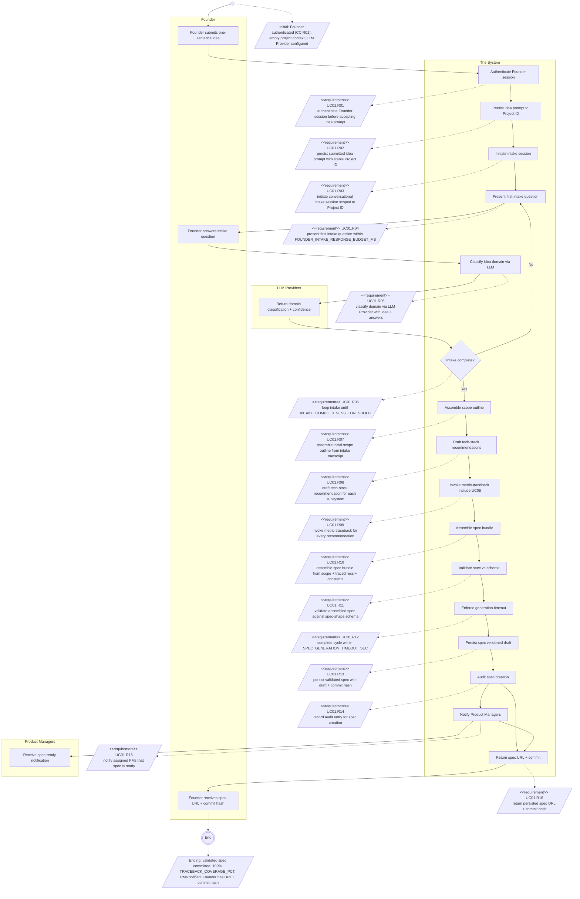
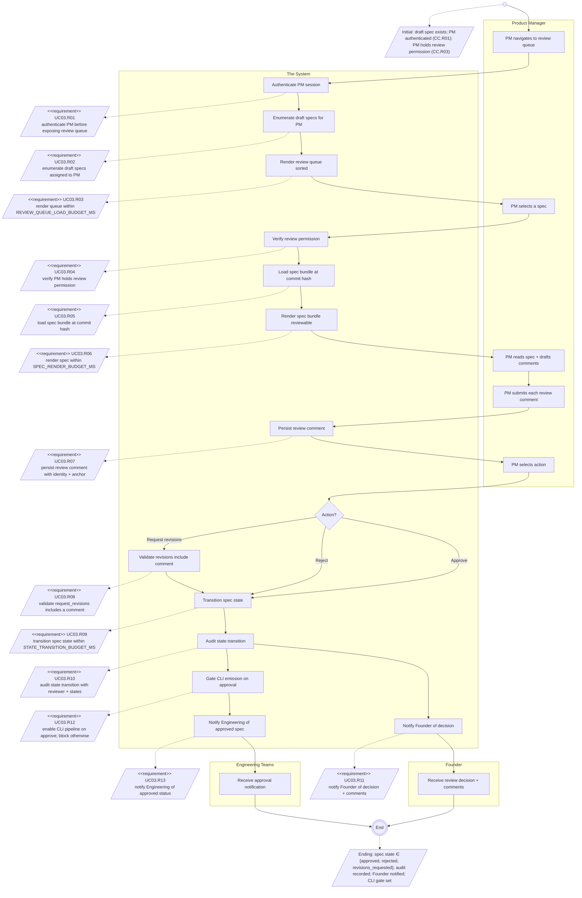
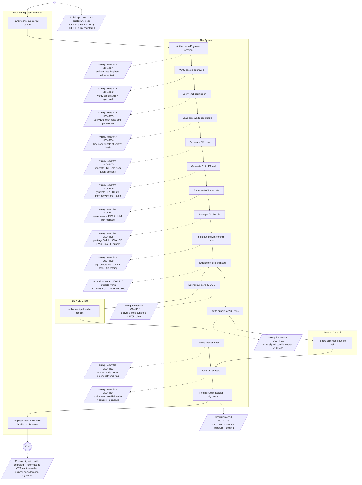
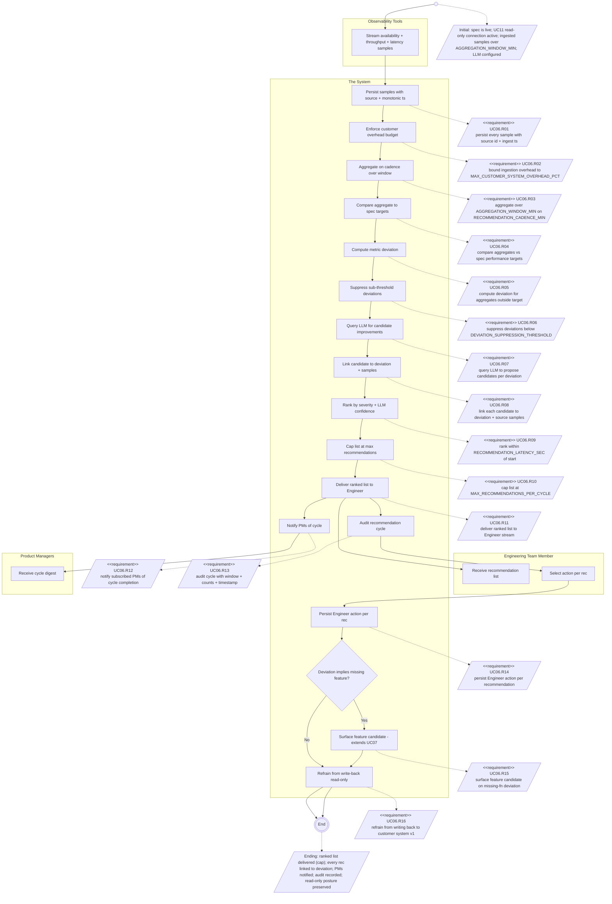
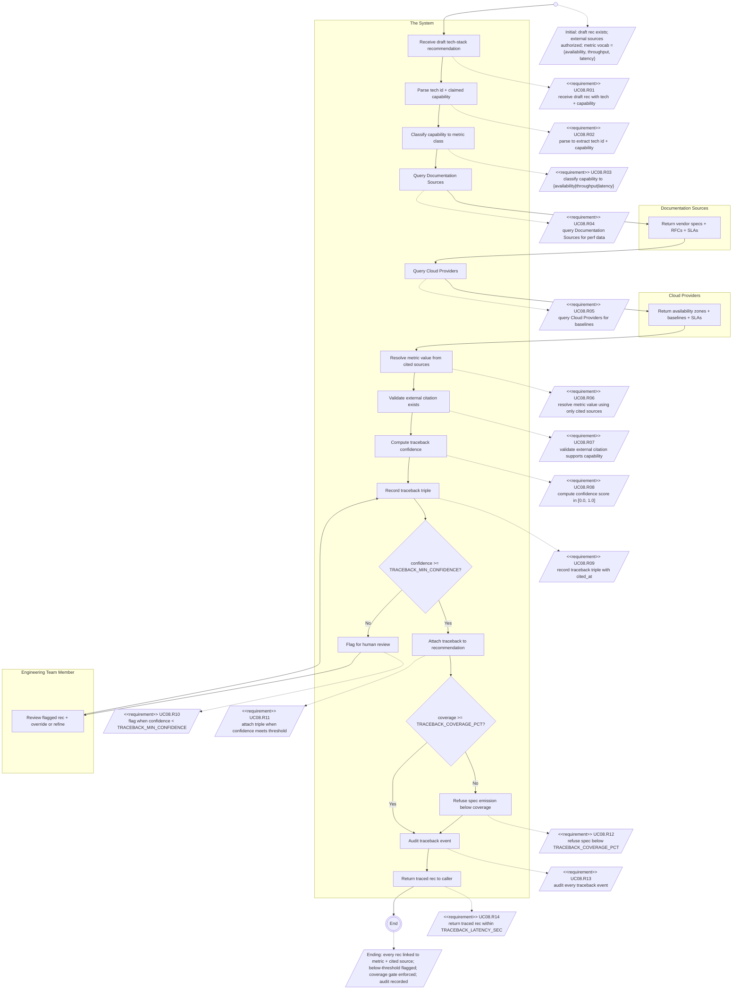
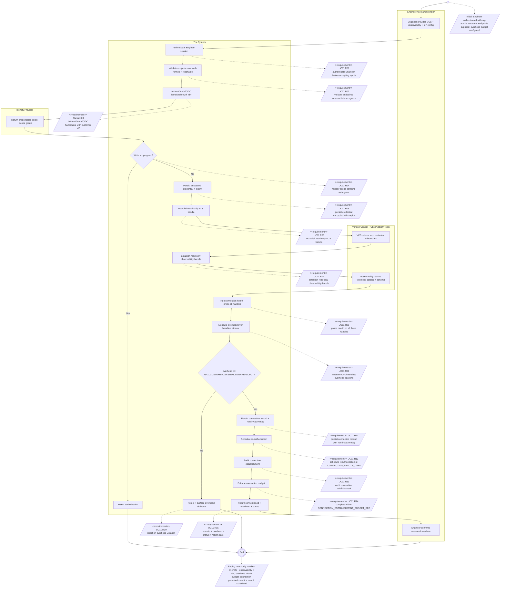

# c1v Module 2 — SysML Activity Diagrams (Obsidian view)

> Inline Mermaid render of the 6 UCBD activity diagrams. Reading View (`Cmd+E`).

## UC01 — Generate Spec from Idea

> Source: `module-2-requirements/sysml/UC01-generate-spec-from-idea.activity.mmd`

## UC03 — Review Generated Spec

> Source: `module-2-requirements/sysml/UC03-review-generated-spec.activity.mmd`

## UC04 — Emit CLI Commands

> Source: `module-2-requirements/sysml/UC04-emit-cli-commands.activity.mmd`

## UC06 — Recommend Design Improvements

> Source: `module-2-requirements/sysml/UC06-recommend-design-improvements.activity.mmd`

## UC08 — Trace Tech Stack to Metric

> Source: `module-2-requirements/sysml/UC08-trace-tech-stack-to-metric.activity.mmd`

## UC11 — Connect Existing Customer System

> Source: `module-2-requirements/sysml/UC11-connect-existing-customer-system.activity.mmd`

